# 本体驱动的项目实施全链路风险管控工具设计方案 v1.0（开源项目集成版）

> 版本：v1.0（基于 10 个开源项目的能力，重构 v0.4 方案）
> 日期：2026-08-24
> 状态：方案评审稿
> 前置文档：[v0.4 方案](./项目风险管控工具设计方案-v0.4.md)（业务目标来源）、[10 项目深度分析](../../ontology-project/ontology-agent-第一梯队深度分析.md)（组件来源）

---

## 0. 结论先行（TL;DR）

| 项目 | 内容 |
|---|---|
| 产品定位 | 面向 **售前 → 实施 → 运维质保** 全链路的本体驱动风险管控工具（Web 应用）——**与 v0.4 完全一致** |
| 核心用户 | **项目经理**（单项目精细管理 + 多项目风险总览） |
| 核心价值 | 根据 **合同内容 / 项目范围 / 功能清单 / 产品原型 / 技术方案** 自动识别风险 |
| 与 v0.4 的关系 | 业务目标 100% 保留；架构从"Nuxt 3 单体"升级为 **「React 前端 + Python FastAPI 一体化后端」**（与 ontopilot 同构：React → FastAPI → SQLite），把 10 个开源项目的能力提炼成 **8 个借鉴组件** |
| 组件来源 | ontopilot / ontocast / semantica / HugAgentOS / ontogpt / trustgraph / jonex / fusion-jena / OpenCrab / PRD（全部宽松许可证，满足合同 8.3.2 合规要求） |
| 技术栈变更 | **前端切换 React 生态**（Vite + AntD + @xyflow/react 图谱）；**后端统一 Python FastAPI**（业务 API + 识别引擎同进程一体化），SQLite |
| 风险识别 | 升级为 **「解析 → 抽取 → 校验 → 推理 → 闸门」五步流水线**，在 v0.4 的 L1-L4 之上增加"证据审查 + 控制平面闸门" |
| 交付要求 | 可执行 MVP + 内置示例数据（用真实合同结构做演示）+ 演示模式 |

```
10 个开源项目（抄什么）
  │
  ▼ 提炼成 8 个组件
C1 本体建模工作台  ← fusion-jena(CQ驱动) + trustgraph(本体加载) + ontopilot(发布审查)
C2 文档加工流水线  ← ontopilot(全流水线) + jonex(多模态解析)
C3 模板抽取引擎    ← ontogpt(extractor模式) + ontocast(模板共进化)
C4 规则引擎与推理  ← semantica(Rete规则)
C5 控制平面闸门    ← HugAgentOS(执行前检查+证据审查)
C6 审计追溯        ← semantica(决策记录+快照) + jonex(引用溯源)
C7 一致性/偏差检测 ← trustgraph(跨源对账) + PRD(编号门禁+就绪度)
C8 MCP 接口层      ← OpenCrab(本体能力MCP化)
```

---

## 1. 业务目标回顾（v0.4 确认，本节不变）

### 1.1 全链路三阶段

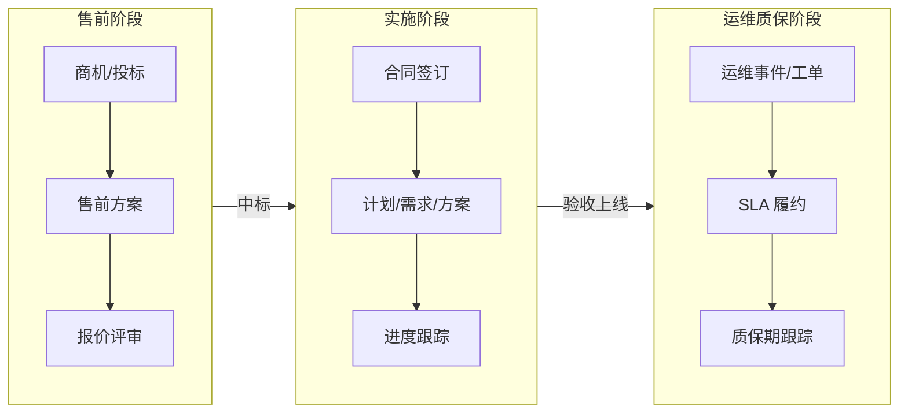

### 1.2 五类输入文档（风险识别的原材料）

| 输入 | 典型内容 | 典型风险信号 |
|---|---|---|
| 合同 | 交付范围、里程碑付款、验收条款、SLA | 范围模糊、验收标准缺失 |
| 项目范围 | 功能清单、优先级、边界 | 功能蔓延、P2 承诺模糊 |
| 功能清单 | 模块、优先级、接口 | 范围过大、依赖外部系统 |
| 产品原型 | 页面说明、交互逻辑 | 原型未评审、与需求不一致 |
| 技术方案 | 技术栈、架构、评审记录 | 技术不成熟、方案未评审 |

### 1.3 业务价值（不变）

1. **自动识别风险**：五类输入 → 风险信号自动生成，不靠人肉登记
2. **全链路关联**：售前承诺 → 合同 → 需求 → 方案 → 进度 → 运维，风险沿链路传导可追踪
3. **项目总览视角**：项目经理既能管单项目细节，也能看多项目风险总览
4. **决策有据可查**：每个风险"为什么产生、依据哪段文档"都能回溯
5. **沉淀组织资产**：本体模型 + 规则库 + 抽取模板 = 行业知识资产，越用越聪明

---

## 2. 设计总纲：10 个项目 → 8 个组件

### 2.1 组件来源映射（先看这张表）

| 组件 | 参考项目 | 抄什么 | 抄的程度 |
|---|---|------|------|
| C1 本体建模工作台 | fusion-jena、trustgraph、ontopilot | 用"能力问题(CQ)"驱动建模；本体可视化管理；变更走"草案→审核→发布" | 思路借鉴（自研） |
| C2 文档加工流水线 | ontopilot、jonex | 文档→要素候选→人审核→发布入库的全流水线；PDF/Word/Excel 多模态解析 | 流程借鉴（自研） |
| C3 模板抽取引擎 | ontogpt、ontocast | extractor 模板范式（LLM 按"答题卡"抽取）；模板字段锚定本体；模板随人审结果共进化 | **直接集成 ontogpt**（Python 包） |
| C4 规则引擎与推理 | semantica | Rete 规则引擎；规则 DSL；推理沿本体关系传导（L2） | 参考实现（自研 DSL） |
| C5 控制平面闸门 | HugAgentOS | 所有"改变状态的动作"先过规则闸门，违规拦截；高风险动作必须附证据 | 概念借鉴（自研） |
| C6 审计追溯 | semantica、jonex | 决策记录五要素（谁/何时/依据/决策/结果）；状态快照可回放；风险/决策带引用段落 | 模式借鉴（自研） |
| C7 一致性/偏差检测 | trustgraph、PRD | 跨源对账（合同 vs 计划 vs 进度 两两比对）；文档编号门禁；就绪度评分 | 模式借鉴（自研） |
| C8 MCP 接口层 | OpenCrab、ontopilot | 本体能力 MCP 化（query_ontology / check_rule 等工具） | MVP 先做 REST，MCP 后置 |

### 2.2 组件协作关系图

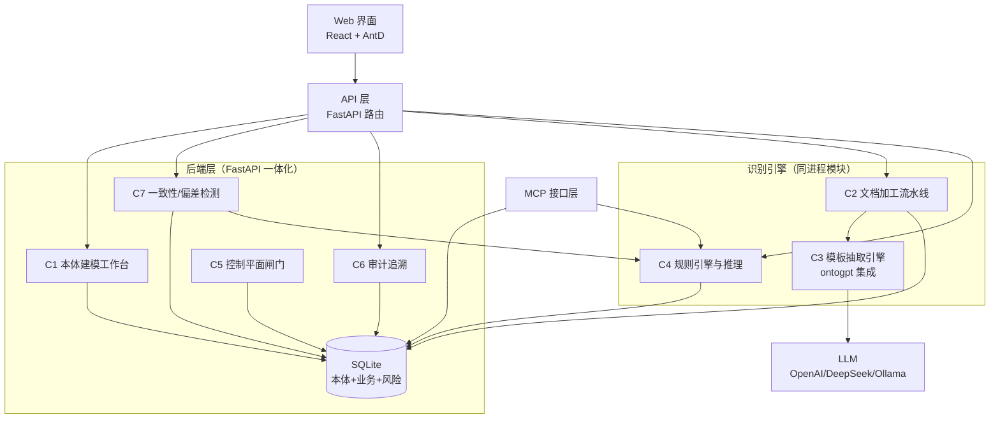

---

## 3. 总体架构

### 3.1 分层架构图

```mermaid
flowchart TB
    subgraph L1[展示层]
        P1[风险驾驶舱<br/>多项目总览视角]
        P2[项目工作台<br/>项目经理视角]
        P3[本体建模视图<br/>@xyflow/react 图谱]
    end
    subgraph L2[API 层（FastAPI）]
        A1[API 路由]
        A2[实体 CRUD]
        A3[文档上传/版本]
        A4[审计查询]
        A5[闸门拦截器]
    end
    subgraph L3[识别引擎（同进程模块）]
        S1[文档解析器<br/>PDF/Word/Excel]
        S2[抽取器<br/>ontogpt 模板]
        S3[校验器<br/>SHACL 风格]
        S4[规则引擎<br/>Rete/DSL]
        S5[对账器<br/>跨源比对]
    end
    subgraph L4[数据层]
        D1[(SQLite<br/>本体 JSON + 业务表)]
    end
    subgraph L5[外部]
        E1[LLM 服务<br/>可插拔]
        E2[MCP 客户端<br/>外部 Agent]
    end

    L1 --> L2
    L2 --> L3
    L2 --> L4
    L3 --> L4
    L3 --> E1
    L2 --> E2
```

### 3.2 为什么是"React + FastAPI 一体化"（技术栈变更理由）

两个事实驱动这次技术栈调整：

1. **10 个参考项目：有前端的 6 个全部是 React 生态**（React 18/19 + Vite/Next.js），图谱库（@xyflow/react、reactflow）也在 React 侧，0 个用 Vue/Nuxt
2. **后端 9 个是 Python 生态**（ontogpt/ontocast/semantica/trustgraph/jonex/fusion-jena/ontopilot/OpenCrab/HugAgentOS），LLM 抽取、规则推理、文档解析的成熟组件全在 Python 侧

| 能力 | 放在哪 | 理由 |
|---|---|---|
| Web 界面/CRUD | React（Vite + AntD） | 参考项目同款（jonex/trustgraph/semantica），图谱生态最强 |
| LLM 模板抽取 | FastAPI 同进程 | ontogpt 直接 `import` 调用，免去服务间网络开销 |
| 规则推理 | FastAPI 同进程 | semantica 的 Rete 引擎参考实现是 Python |
| 文档解析 | FastAPI 同进程 | pdfplumber/python-docx/openpyxl 生态成熟 |
| 数据写入 | **只走 FastAPI** | SQLite 单一写入者（Python 侧），无跨进程锁冲突 |

> 关键设计决策：**后端一体化**——业务 API 与识别引擎跑在同一个 FastAPI 进程，ontogpt 以库的形式直接 import，省掉服务间 REST 调用。整体架构与 ontopilot 完全同构（React Web UI → FastAPI → SQLite），参考价值最大。

### 3.3 组件与里程碑对照

| 组件 | 归属里程碑 | 工作量占比 |
|---|---|:---:|
| C1 本体建模工作台 | M2 | 15% |
| C2 文档加工流水线 | M3 | 15% |
| C3 模板抽取引擎 | M4（核心） | 25% |
| C4 规则引擎与推理 | M4（核心） | 20% |
| C5 控制平面闸门 | M4 | 10% |
| C6 审计追溯 | M4（贯穿） | 5% |
| C7 一致性/偏差检测 | M4/M5 | 5% |
| C8 MCP 接口层 | M5+（P1） | 5% |

---

## 4. 核心流水线：从文档到风险（本方案的心脏）

### 4.1 五步流水线总览

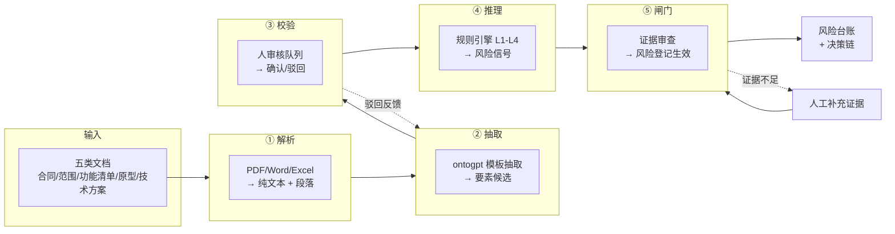

### 4.2 每一步的详细设计

| 步骤 | 做什么 | 参考 | 关键设计 | 产出 |
|---|---|------|------|------|
| ① 解析 | 五类文档 → 可抽取的文本段落（保留段落编号） | jonex（多模态）、ontopilot | 段落编号是"引用溯源"的基础：风险必须能跳回原文段落 | 带编号的文本块 |
| ② 抽取 | 按文档类型选模板，LLM 按模板抽取要素 | **ontogpt（直接集成）** | 模板字段锚定本体类/属性（grounding）；LLM 默认关闭，可配置 | 要素候选（含置信度） |
| ③ 校验 | 人工审核队列逐条确认 | ontopilot（审查工作流） | 驳回的候选回填"模板改进建议"（ontocast 共进化） | 已确认要素 |
| ④ 推理 | L1 规则匹配 + L2 关系推演 + L3 阈值 + L4 LLM 辅助 | semantica（Rete） | 规则命中记录"规则 + 证据"，供审计 | 风险信号（未生效） |
| ⑤ 闸门 | 高风险信号必须挂证据才能入台账 | HugAgentOS（闸门） | 证据 = 文档段落 + 规则 + 确认人 | 生效风险（带决策链） |

### 4.3 L1-L4 识别架构（v0.4 保留，与流水线对齐）

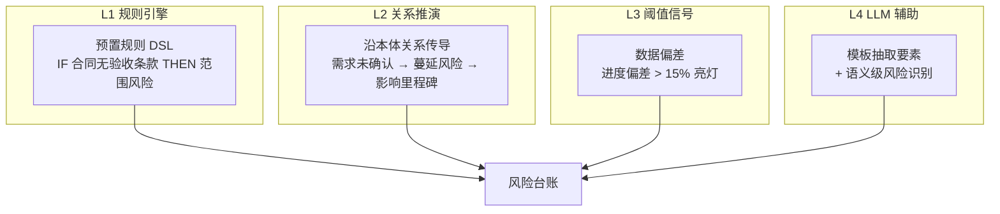

### 4.4 端到端示例：用《软件开发合同》走一遍流水线

> 用真实的合同结构演示（本合同即示例数据来源），让开发有据可依：

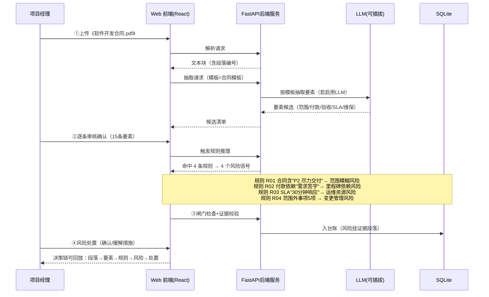

**示例数据的预期结果**（内置演示用，验收可对照）：

| 风险 | 触发证据（合同原文） | 等级 |
|---|---|---|
| P2 功能承诺模糊（"尽力交付"） | 4.2 注：P2 为尽力交付 | 中 |
| 里程碑付款依赖外部确认 | 3.2 付款以《需求规格说明书》签字为前提 | 中 |
| SLA 响应资源不足 | 12.2 S1 级 30 分钟内响应 | 高 |
| 变更管理压力大 | 4.3 范围外事项 5 项 + 8.2 变更流程 | 低 |

---

## 5. 八个组件详细设计

### 5.1 C1 本体建模工作台（M2，对应 v0.4 M2）

**参考**：fusion-jena（CQ 驱动建模）、trustgraph（本体可视化加载）、ontopilot（发布审查）

**做什么**：把"本体"变成项目经理也能看懂、能维护的东西。v0.4 的 15 类/16 关系/18 属性是本体的 v1 种子，工作台负责演进它。

**功能清单**：

| 功能 | 说明 | 参考 |
|---|---|---|
| 类/关系/属性管理 | 增删改查，图谱可视化（@xyflow/react） | trustgraph 工作台 |
| CQ（能力问题）驱动 | 用户写"要回答什么问题"（如"这份合同有没有验收条款？"），LLM 辅助生成本体草案 | fusion-jena |
| 变更发布流 | 本体修改走"草案 → 审核 → 发布"，发布生成版本快照，可回滚 | ontopilot |
| 模板联动 | 本体类变更时，提示同步更新相关抽取模板（C3） | ontocast 共进化 |

**工作流**：

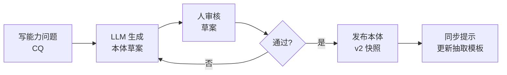

### 5.2 C2 文档加工流水线（M3，对应 v0.4 M3 扩展）

**参考**：ontopilot（全流水线）、jonex（多模态解析）

**做什么**：五类输入文档 → 带编号文本块 → 要素候选 → 人审核 → 入库。文档版本化管理，可追溯"这条需求来自哪个文档哪个版本"。

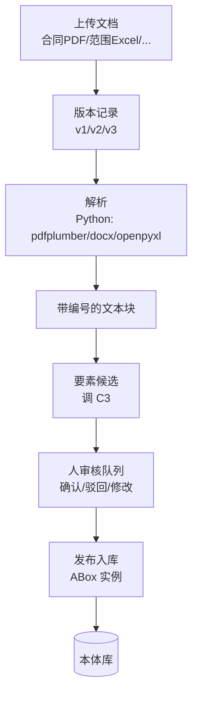

**关键点**：每个文本块带 `文档ID + 版本 + 段落号`，这是"引用溯源"（C6）和"对账"（C7）的地基。

### 5.3 C3 模板抽取引擎（M4 核心，本方案最值得抄的部分）

**参考**：**ontogpt（直接集成）**、ontocast（共进化）

**做什么**：给 LLM 发"答题卡"。每种文档类型一个抽取模板，模板字段锚定本体（grounding），LLM 按模板填表，产出结构化要素。

**为什么直接集成 ontogpt**：
- 它把"LLM 按模板抽取"做成了开箱即用的 Python 包，`pip install ontogpt` 即可
- extractor 模式（SPIRES）：预定义模板类 → LLM 按类填充 → 校验 → 输出，正是我们"五类文档 → 结构化要素"的需求
- 支持 LiteLLM：一套代码接 OpenAI / DeepSeek / 本地 Ollama（v0.4 决策 D11"LLM 默认关闭"继续生效——模板先手写，LLM 仅当配置 key 后启用）
- BSD-3-Clause，可商用，保留版权声明即可

**模板示例**（合同模板的简化版）：

```
合同抽取模板 (ContractExtractor):
  合同编号: str
  甲方: str
  乙方: str
  交付范围: list[str]          → 本体: Contract.scope_text
  付款节点: list[PaymentNode]  → 本体: Contract.payment_milestones
  验收条款: list[str]          → 本体: Contract.has_acceptance_clause
  SLA响应时限: str             → 本体: Sla.response_time
  质保期: str                  → 本体: Warranty.period
  范围外事项: list[str]        → 本体: Contract.excluded_items
```

**共进化机制**（ontocast 借鉴）：人审核时驳回的候选，自动记录"模板哪里不合适"，攒够 N 条后提示"建议模板新增字段 X"，人工确认后模板升级。

### 5.4 C4 规则引擎与推理（M4 核心）

**参考**：semantica（Rete 规则引擎设计）

**做什么**：承载 L1（规则匹配）+ L2（关系推演）。规则 DSL 让业务人员也能写规则，不必懂代码。

**规则 DSL 示例**：

```
# 规则库文件 rules/contract.rules
RULE 合同无验收条款
  WHEN contract.has_acceptance_clause == false
  THEN 生成风险(类型=范围风险, 等级=高, 证据=contract.scope_text)

RULE 付款依赖外部签字
  WHEN payment_node.dependency == "需求确认签字"
  THEN 生成风险(类型=里程碑依赖, 等级=中)

RULE 需求蔓延
  WHEN requirement.change_count > 3 AND requirement.is_confirmed == false
  THEN 生成风险(类型=范围蔓延, 等级=高)
```

**L2 关系推演**（沿本体关系传导）：

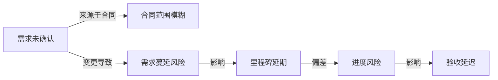

**实现**：规则 DSL 解析器 + 匹配执行器自研（参考 semantica 的 ruleengine 模块）；Rete 优化后续再加（数据量小先用线性匹配即可）。

### 5.5 C5 控制平面闸门（M4，本方案的"刹车"）

**参考**：HugAgentOS（控制平面概念，只借概念不借代码）

**做什么**：v0.4 的风险管控是"识别"，v1.0 增加"拦截"——所有改变系统状态的关键动作，先过闸门检查，违规就拦下并说明理由。

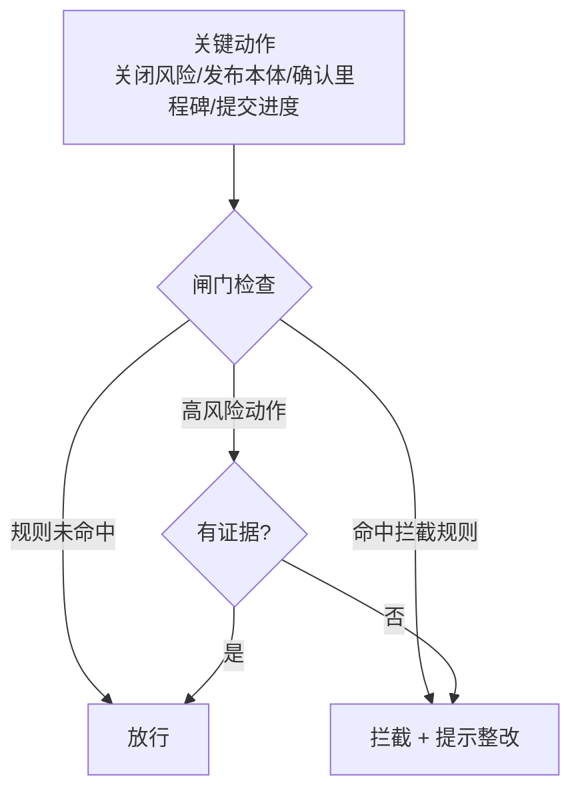

**闸门规则预置**（对应合同示例）：

| 动作 | 拦截条件 | 提示 |
|---|---|---|
| 关闭风险 | 风险等级=高 且 缓解措施未填写 | 先填缓解措施 |
| 确认里程碑完成 | 存在未处置的高风险影响该里程碑 | 先处置风险 |
| 提交进度 | 实际进度 < 计划且未登记延期风险 | 先登记延期 |
| 发布本体 | 存在未审核的草案变更 | 先走审核流 |

### 5.6 C6 审计追溯（M4 贯穿，全方案的"账本"）

**参考**：semantica（决策记录 + 时间快照）、jonex（引用溯源）

**做什么**：每个风险/决策都有完整"决策链"，可回放、可追溯。这是对合同 8.1.2"甲方有权实时查看进度"的落地。

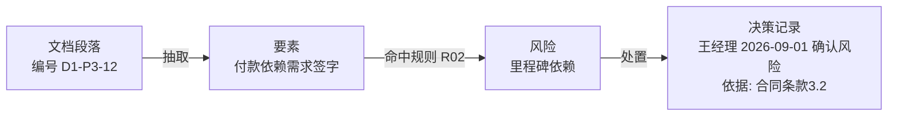

**决策记录五要素**（semantica 借鉴）：`决策人 + 时间 + 依据证据 + 决策内容 + 结果`。风险状态每次变化都写一条，界面可"回放"风险的一生。

### 5.7 C7 一致性/偏差检测（M4/M5）

**参考**：trustgraph（跨源对账）、PRD（编号门禁 + 就绪度）

**做什么**：三个子能力：

**① 跨源对账**（trustgraph 思路）：合同承诺 vs 计划 vs 进度 vs 运维，两两比较：

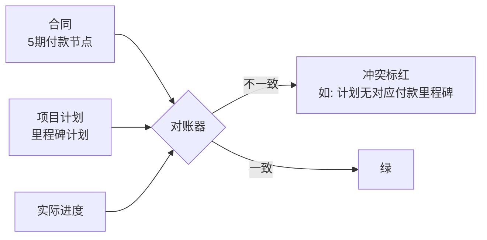

**② 编号门禁**（PRD 思路）：每条需求/决策有编号（如 `REQ-003`），方案必须 `@implements REQ-003` 挂接；没有实现对应编号需求的方案，亮红灯拦截发布。

**③ 就绪度评分**（PRD 思路）：需求/方案/里程碑多维打分（0-100），低于阈值亮黄灯：

```
里程碑就绪度 = 需求确认率×40% + 方案评审率×30% + 风险处置率×30%
```

### 5.8 C8 MCP 接口层（M5+，P1 功能）

**参考**：OpenCrab（MCP server 实现）

**做什么**：把本体资产/风险能力暴露给外部 Agent（企业微信助手、钉钉机器人等）。MVP 先做 REST，MCP server 作为 P1：

| MCP 工具 | 功能 | 供谁用 |
|---|---|---|
| query_ontology | 查本体类/关系/实例 | 外部 Agent |
| get_risk_feed | 获取项目风险清单 | 外部 Agent |
| create_risk | 登记新风险（走闸门） | 现场人员 |
| check_rule | 规则试运行（不改数据） | 规则编写者 |

---

## 6. 本体与数据模型（v0.4 的 15 类 → v1.0 扩展）

### 6.1 本体类扩展

v0.4 的 15 个核心类全部保留，新增 4 个"支撑类"：

| 新类 | 作用 | 来源 |
|---|---|---|
| Template（抽取模板） | 五类文档的抽取模板定义 | ontogpt 模板 |
| Rule（规则） | 规则 DSL 的持久化 | semantica |
| Decision（决策记录） | 风险/状态变更的审计账本 | semantica |
| Evidence（证据） | 风险产生的依据（文档段落引用） | jonex / semantica |

### 6.2 扩展后的类图（核心类示意，略去 Bid/Plan/Milestone/OpsEvent/Sla/Warranty/Stakeholder）

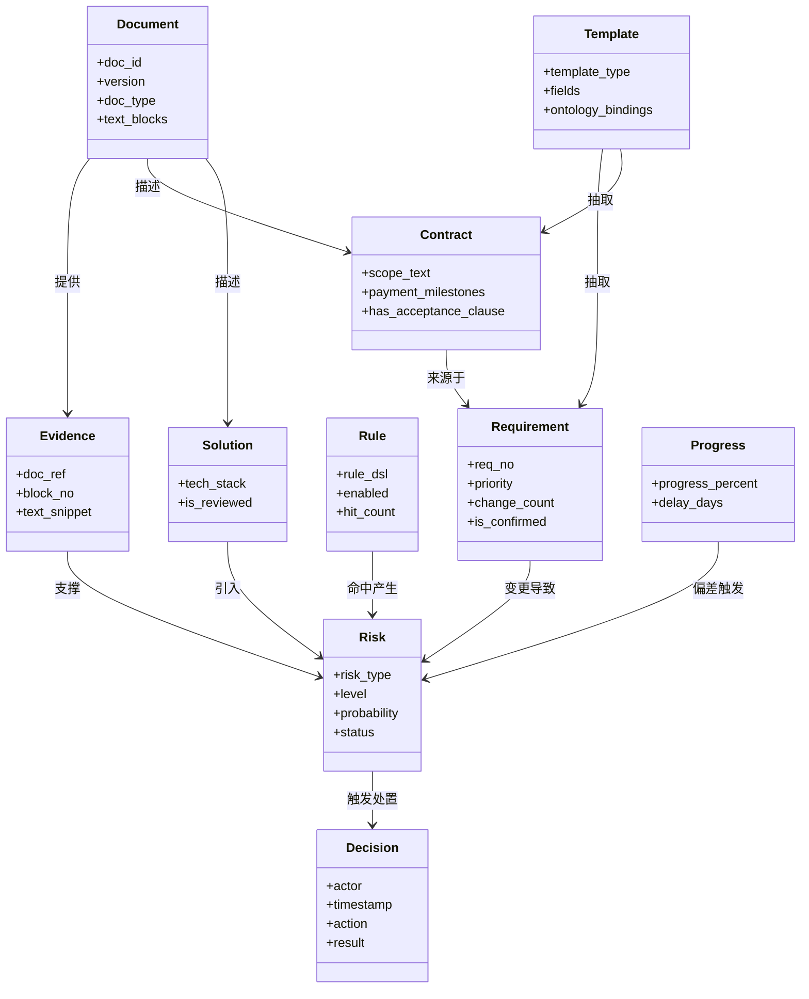

### 6.3 数据存储

- 保持 v0.4 决策 D9：本体存 SQLite（`ontology` JSON 表 + `instances` 表），预留 OWL/RDF 导出
- 新增表：`templates`、`rules`、`decisions`、`evidences`、`doc_blocks`（带编号文本块）
- 写入路径唯一：全部经 FastAPI API（识别引擎是同进程模块，天然无跨进程锁问题）

### 6.4 项目隔离与用户（MVP 简化）

- **MVP 单用户**：演示模式不设登录，直接进入示例项目
- **项目隔离**：全部业务表（contract/plan/progress/requirement/risk/ops_event 等）带 `project_id` 字段，API 层按当前项目过滤，杜绝跨项目数据串扰
- **预留扩展**：`users` 表 + 角色（admin/pm），后续接入登录与权限控制时无需改表结构

---

## 7. 技术栈（v0.4 → v1.0）

| 层 | v0.4 | v1.0 | 变更理由 |
|---|---|------|------|
| Web 前端 | Nuxt 3 + TypeScript + Element Plus | **React 19 + Vite + Ant Design** | 6/10 参考项目前端全 React（jonex/trustgraph/semantica 同款） |
| 图可视化 | AntV G6 | **@xyflow/react**（原 reactflow） | semantica/trustgraph 同款；免费商用、交互优于 G6 |
| Web 后端 | Nuxt server（node:sqlite） | **FastAPI 一体化**（业务 API + 识别引擎同进程） | 与 ontopilot 同构；SQLite 单一写入者 |
| 识别引擎 | 无（规则内嵌） | FastAPI 内置模块（ontogpt 直接 import） | 9/10 参考项目是 Python 生态；免服务间 REST |
| LLM 接入 | 可插拔（自研） | LiteLLM（ontogpt 生态） | 一套代码接所有模型，支持 Ollama |
| 文档解析 | 无 | Python pdfplumber / python-docx / openpyxl | 成熟稳定 |
| 规则引擎 | 自研 DSL（计划） | 自研 DSL + semantica Rete 参考 | 参考实现加速 |
| 本体存储 | SQLite JSON | SQLite 保留 + 存储抽象层（预留 Postgres） | semantica 图存储抽象思路 |
| 数据模型 | 15 类/16 关系/18 属性 | + Template/Rule/Decision/Evidence | 支撑审计与抽取 |
| 对外接口 | REST | REST + MCP（P1） | OpenCrab 思路 |

**进程模型**：

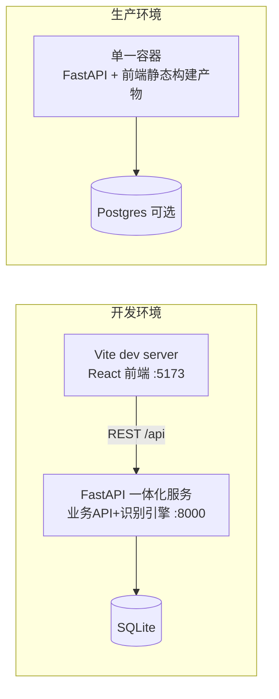
---

## 8. 部署与运行

### 8.1 部署拓扑

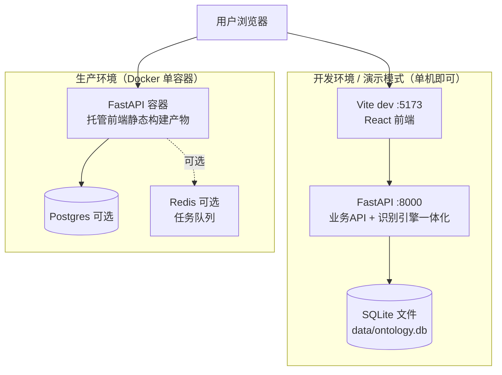

---

## 9. 里程碑计划（v0.4 的 M1-M5 → v1.0 细化）

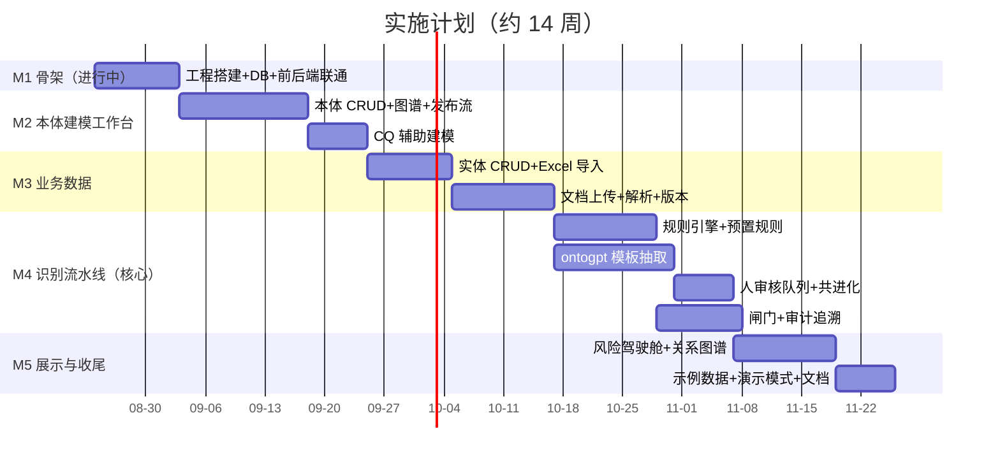

### 9.1 里程碑交付标准（对照 v0.4）

| 里程碑 | v0.4 定义 | v1.0 调整 | 验收标志 |
|---|---|---|---|
| M1 | Nuxt3 工程 + SQLite + API | **切换为 React + FastAPI 一体化骨架**，前后端联通 | 一个文档能完成"上传→解析"全链路 |
| M2 | 本体建模工作台 | + CQ 辅助 + 本体发布快照 | 改一个类→审核→发布→回滚 |
| M3 | 业务实体 CRUD + Excel 导入 | + 五类文档上传解析 + 版本管理 | 合同 PDF 解析出带编号文本块 |
| M4 | 文档中心 + 自动识别 + 风险中心 | + ontogpt 抽取 + 规则引擎 + 闸门 + 审计 | 合同示例命中 4 条预置规则且决策链可回放 |
| M5 | 仪表盘 + 关系图谱 | + 跨项目总览 + 对账视图 | 30 秒看懂项目风险态势 |

---

## 10. 与 v0.4 方案的差异对照

| 维度 | v0.4 | v1.0 | 变化原因 |
|---|---|---|---|
| 架构 | Nuxt 3 单体 | **React 前端 + FastAPI 一体化后端** | 参考项目前端全 React（0 个 Vue）；后端统一 Python 生态 |
| 风险识别 | L1-L4 规则 + LLM 辅助 | 五步流水线（解析→抽取→校验→推理→闸门） | 加入 ontopilot 审核流 + HugAgentOS 闸门 |
| 数据模型 | 15 类/16 关系/18 属性 | + Template/Rule/Decision/Evidence | 支撑抽取、审计、拦截 |
| 文档处理 | 手动录入 | 上传→解析→抽取→人审→入库全流水线 | ontopilot / jonex |
| 拦截能力 | 无（只识别不拦截） | 控制平面闸门 | HugAgentOS |
| 审计能力 | 操作日志 | 决策链回放 + 引用溯源 + 快照 | semantica / jonex |
| 对账能力 | 无 | 跨源对账 + 编号门禁 + 就绪度 | trustgraph / PRD |
| 对外接口 | 无 | REST + MCP（P1） | OpenCrab |
| 技术栈 | Nuxt + SQLite | **React + Vite + AntD + @xyflow/react + FastAPI + LiteLLM + pdfplumber** | 与参考项目技术栈同构，抄起来最顺 |

**保持不变**：业务目标、核心用户（项目经理）、五类输入、本体核心 15 类、SQLite 轻量策略、LLM 默认关闭、MVP + 示例数据 + 演示模式。

---

## 11. 开源合规（对应合同 8.3.2：不得引入强传染性许可证）

### 11.1 十个参考项目的许可证

| 项目 | 许可证 | 使用方式 | 合规要点 |
|---|---|---|---|
| ontogpt | BSD-3-Clause | **直接集成（pip 安装）** | 保留版权声明；禁止用 Monarch 名义背书 |
| ontopilot | Apache 2.0 | 思路借鉴 | 无需分发即无义务 |
| ontocast | Apache 2.0 | 思路借鉴 | 同上 |
| semantica | MIT | 参考实现 | 最宽松 |
| trustgraph | Apache 2.0 | 思路借鉴 | 同上 |
| jonex | Apache 2.0 | 思路借鉴 | 同上 |
| fusion-jena | Apache 2.0 | 思路借鉴 | 同上 |
| OpenCrab | MIT | 思路借鉴 | 最宽松 |
| PRD | MIT | 思路借鉴 | 最宽松 |
| HugAgentOS | Apache 2.0 + 附加条款 | **仅借鉴概念，不引入代码** | 附加条款禁止改造为竞争性多租户 SaaS；不集成代码则无义务 |

**结论**：10 个项目全部为宽松许可证（Apache/MIT/BSD），**无 AGPL/GPL 强传染性组件**，完全满足合同 8.3.2 要求。唯一直接引入依赖的 ontogpt 为 BSD-3-Clause（同 MIT 级别），交付物清单（合同第九条 15 项"开源组件清单及许可证说明"）中如实列明即可。

### 11.2 依赖合规清单（交付时需附）

| 组件 | 许可证 | 用途 |
|---|---|---|
| ontogpt | BSD-3-Clause | 模板抽取 |
| FastAPI | MIT | 识别引擎框架 |
| LiteLLM | MIT | LLM 统一接入 |
| pdfplumber / python-docx / openpyxl | MIT | 文档解析 |
| React 19 / Vite | MIT | Web 前端框架 |
| Ant Design | MIT | UI 组件 |
| @xyflow/react | MIT | 图谱可视化 |

---

## 12. 风险与应对（本方案自身的风险）

| 风险 | 概率 | 影响 | 应对 |
|---|---|---|---|
| ontogpt 与 LLM 兼容性问题 | 中 | 中 | LiteLLM 抽象层兜底；LLM 默认关闭，模板先手写 |
| LLM 抽取质量不稳定 | 高 | 中 | 人审核队列兜底（C2）；驳回记录反哺模板（共进化） |
| 团队对 React 不熟 | 中 | 中 | 前端是薄壳（CRUD+图表），AntD 组件成熟、参考项目多，学习成本可控 |
| 规则 DSL 设计过度 | 中 | 中 | 先 10 条预置规则起步，够用即停（防过度设计） |
| 本体建模工作台偏离业务 | 中 | 高 | CQ 驱动：建模必须以"能回答的业务问题"为准绳 |
| 闸门过于严格影响使用 | 中 | 中 | 闸门规则可配置、可豁免（需项目经理级审批豁免） |
