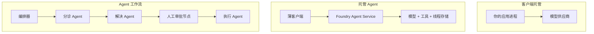
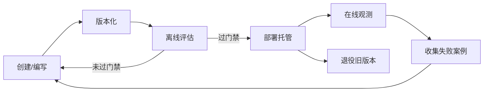
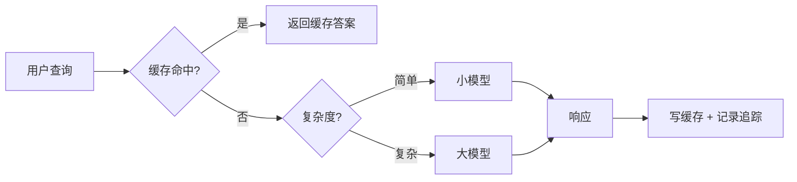
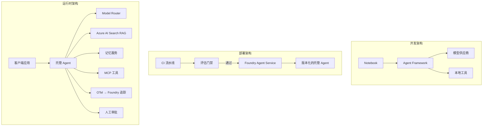

# 部署可扩展的 Agent：用 Microsoft Foundry 走向生产

来源：Microsoft Learn 开源课程 [AI Agents for Beginners - Deploying Scalable Agents with Microsoft Foundry](https://github.com/microsoft/ai-agents-for-beginners/blob/main/16-deploying-scalable-agents/README.md)

> 本文是对原英文课程的中文整理版，不是逐字翻译。目标是帮助中文读者理解"在我机器上能跑"与"生产环境可靠又省钱地跑"之间的差距，以及如何用部署模式、评估门禁、模型路由、缓存和企业级管控来弥合这个差距。

## 1. 这节课要解决什么问题

到目前为止，课程里的 Agent 都跑在笔记本电脑上、notebook 里，靠 `az login` 和几个环境变量驱动——这是学习的正确方式，但不是"数千客户凌晨 3 点还依赖它"的正确方式。

本课通过构建一个真实的客服 Agent（带工具、检索、记忆、评估、监控），覆盖：

- 原型 Agent 和已部署 Agent 的差别——为什么这个跨越主要在于模型之外的一切
- 三种部署模式：客户端托管、服务托管（Hosted Agents）、工作流编排
- Microsoft Foundry 上的 Agent 生命周期：创建 → 版本化 → 部署 → 评估 → 观测 → 退役
- 扩展策略：模型路由、缓存、并发控制、无状态设计
- 用 OpenTelemetry + Foundry 追踪做可观测性
- 通过模型选择、路由和评估门禁做成本优化
- 企业级考量：治理、人工审批、生产环境安全运行 MCP 服务器

前置知识：第 14 课（MAF）、第 4 课（工具使用）、第 5 课（Agentic RAG）、第 13 课（记忆）、第 11 课（MCP）、第 10 课（可观测性与评估——本课直接在其基础上展开）。还需要 Azure 订阅 + Foundry 项目（至少一个已部署的聊天模型）、`az login`、Python 3.12+。

## 2. 从原型到生产：到底什么变了

原型 Agent 和生产 Agent 共享同一个核心循环——推理、调用工具、回复。变的是包裹在这个循环外面的一切。**模型大约只占生产 Agent 的 20%，另外 80% 是运维骨架**：

| 关注点 | 原型 | 生产 |
|--------|------|------|
| 托管 | 跑在你的 notebook 里 | 作为托管服务运行，有版本、有发布流程 |
| 身份 | 你的 az login 令牌 | 托管身份 + 限定范围的 RBAC |
| 状态 | 内存中，重启即丢 | 外置（线程存储、记忆服务） |
| 失败 | 你自己看 traceback | 重试、降级、死信队列、告警 |
| 成本 | "才几分钱" | 按请求跟踪、路由、缓存、预算管理 |
| 质量 | 肉眼检查输出 | 每次发布前自动评估 |
| 信任 | 你亲自批准每个动作 | 策略 + 高风险动作人工介入 |

记住这张表——后面每一节都对应其中一行。

## 3. 三种部署模式

三种模式经常组合使用：

### 3.1 客户端托管（Client-Hosted）

Agent 对象活在你的应用进程里，你的代码直接调用模型供应商，推理循环跑在你的服务中——之前所有课程都是这种方式。

- **适用**：需要完全控制循环、自定义中间件，或把 Agent 嵌入已有后端。
- **代价**：扩缩容、状态、韧性都要自己负责。

### 3.2 托管 Agent（Foundry Agent Service）

Agent 注册为 Microsoft Foundry 中的资源。Foundry 托管推理循环、存储线程、强制内容安全与 RBAC，Agent 在 Foundry 门户中可见。你的应用变成一个薄客户端——只负责创建线程和读取响应。

- **适用**：想要持久性、内置可观测性、治理，减少运维面。
- **代价**：用底层控制权换托管运行时。

### 3.3 Agent 工作流（Agent Workflows）

多个 Agent（和工具）组成显式控制流的图——顺序步骤、分支、人工审批节点、可暂停恢复的持久检查点。这是 MAF Workflows 能力在部署规模上的应用。

- **适用**：一个任务横跨多个专业 Agent，或中间需要审批环节。
- **代价**：组件更多，需要编排级可观测性。



## 4. Foundry 上的 Agent 生命周期

部署不是一次性推送，而是一个循环——它看起来很像软件发布周期，因为它就是软件发布周期：



延续第 10 课的核心思想：**离线评估是门禁，不是事后检查**。新版本不清过评估阈值就不发布；在线可观测性再把真实世界的失败反哺回离线测试集——这就是完整的闭环。

## 5. 四大扩展策略

扩展 Agent 与扩展无状态 Web API 不同——每个请求可能触发多次昂贵的模型和工具调用。四项技术承担了大部分负载：

1. **无状态请求处理**：进程内存中不保留任何用户状态。会话线程持久化到 Foundry 线程存储或记忆服务，任何实例都能处理任何请求——这才能水平扩展、无需会话粘滞。
2. **模型路由**：不是每个请求都需要最强（最贵）的模型。简单请求（意图分类、简短事实问答）路由到小而快的模型，大模型只留给真正的推理。可以用 Foundry 的 Model Router，也可以自己实现轻量分类器（实验里会做 DIY 版）。
3. **响应缓存**：很多客服问题几乎重复（"怎么重置密码？"）。缓存常见问题的答案、完全不打模型。即使命中率不高，也能显著降低成本和延迟。
4. **并发与背压**：模型供应商有速率限制。限定并发、指数退避重试、优雅降级——排队返回"我们正在处理"好过直接 500。



## 6. 生产环境可观测性

看不见就没法运维。如第 10 课所述，MAF 原生输出 OpenTelemetry 追踪——每次模型调用、工具调用、编排步骤都是一个 span。生产中把 span 导出到 Foundry（或任何 OTel 兼容后端），就可以：

- 端到端追踪单个客户投诉经过的每次模型/工具调用
- 观察 p50/p95 延迟和每请求成本随时间的变化
- 在用户（或财务部门）发现之前，对错误率飙升和成本异常告警

```python
from agent_framework.observability import get_tracer

tracer = get_tracer()

with tracer.start_as_current_span("support_request") as span:
    span.set_attribute("customer.tier", "enterprise")
    span.set_attribute("routed.model", "gpt-5-nano")
    # span 内的 Agent 执行会被自动追踪
```

`customer.tier`、`routed.model` 这样的属性把"一面墙的 trace"变成可回答的业务问题（"企业客户是不是被过度路由到小模型了？"）。

## 7. 成本优化

生产 Agent 的成本由 token 主导。三个杠杆，按影响力排序：

1. **模型选对尺寸**：能过评估门禁的小模型几乎总比同样能过的大模型便宜。用评估来证明小模型够用，而不是出于保守默认用最大的模型。
2. **按复杂度路由**：只为真正需要大模型推理的请求支付大模型价格。
3. **激进缓存**：最便宜的模型调用是根本不发生的那次。

评估门禁与成本控制是同一门学科的两个视角：评估告诉你质量底线，路由和缓存让你尽可能贴着这条底线的成本运行。

## 8. 企业级部署考量

- **治理**：Hosted Agents 继承 Foundry 的 RBAC、内容安全和审计日志。给每个 Agent 一个最小权限的托管身份——知识库只读、工单 API 限定范围，仅此而已。
- **人在环中**：有些动作后果太重不能全自动——退款、删账户、升级到法务。MAF 支持"需审批工具"：Agent 提议动作 → 执行暂停 → 人工批准/拒绝 → 工作流恢复。第 6 课见过原语，本课部署它。
- **生产环境的 MCP**：MCP 让 Agent 通过标准接口消费外部工具。生产中要**把每个 MCP 服务器当作不可信边界**：锁定服务器版本、用限定范围的身份运行、校验其输出、绝不向它暴露密钥。MCP 服务器是一个依赖项，依赖项就要打补丁、审计、限流。

开发、部署、运行三张架构图是同一个 Agent 生命的三个阶段：



## 9. 动手实验：生产级客服 Agent

打开 `code_samples/16-python-agent-framework.ipynb`，端到端组装一个 Contoso 客服 Agent，8 项生产关注点全部接通：

1. **工具调用**——查订单状态、开支持工单
2. **RAG**——从知识库回答政策问题（Azure AI Search，附内存回退方案让 notebook 无需 Search 资源也能跑）
3. **记忆**——跨对话轮次记住客户
4. **模型路由**——复杂度分类器把请求路由到小/大模型
5. **响应缓存**——重复问题从缓存返回
6. **人工审批**——超过阈值的退款暂停等待人工签核
7. **评估流水线**——小型离线测试集给 Agent 打分，充当发布门禁
8. **可观测性**——每个请求都包在 OpenTelemetry 追踪里

核心是"路由 + 缓存"的请求处理器：

```python
async def handle_support_request(query: str, customer_id: str) -> str:
    # 1. 能用缓存就用缓存
    cached = response_cache.get(normalize(query))
    if cached:
        return cached

    # 2. 按复杂度路由以控制成本
    model = "gpt-5-nano" if is_simple(query) else "gpt-5-mini"

    # 3. 在追踪 span 内运行 Agent，保证可观测性
    with tracer.start_as_current_span("support_request") as span:
        span.set_attribute("routed.model", model)
        span.set_attribute("customer.id", customer_id)
        response = await support_agent.run(query, model=model)

    # 4. 写缓存并返回
    response_cache.set(normalize(query), response.text)
    return response.text
```

守护发布的评估门禁：

```python
async def evaluation_gate(agent, test_cases, threshold: float = 0.8) -> bool:
    passed = 0
    for case in test_cases:
        result = await agent.run(case["input"])
        if score_response(result.text, case["expected"]) >= 0.8:
            passed += 1
    pass_rate = passed / len(test_cases)
    print(f"Evaluation pass rate: {pass_rate:.0%} (gate: {threshold:.0%})")
    return pass_rate >= threshold  # 门禁通过才部署
```

notebook 刻意把原语写得很小，没有任何东西藏在框架调用背后——值得逐行阅读。

## 10. 用冒烟测试验证已部署的 Agent

上面的评估门禁是离线针对 Agent 对象运行的。Agent 作为 Hosted Agent 部署之后，还需要一个更便宜的检查：**部署后的端点真的在应答吗？**

"部署成功"只证明控制平面接受了定义，不证明 Agent 能回复。缺依赖、路由配置错误、连接过期都可能留下一个"绿色部署但什么都不返回"的状态。冒烟测试能在几秒内、每次部署时抓住这类问题，且没有完整评估的成本。

仓库自带基于 AI Smoke Test GitHub Action 的现成冒烟测试流水线：

- **用例目录**：`tests/lesson-16-smoke-tests.json` 包含针对 Contoso 客服 Agent 的提示词和断言（有依据的政策回答、订单查询、不跑题、多轮线程连续性）。其他课 Agent 的用例目录见 `tests/README.md`。
- **工作流**：`.github/workflows/smoke-test.yml` 用 Azure OIDC 登录，把每个提示 POST 到 Agent 的 Responses 端点，任一断言失败即 job 失败。

```yaml
- name: Smoke-test hosted agent
  uses: JFolberth/ai-smoketest@v1
  with:
    project_endpoint: ${{ inputs.project_endpoint }}
    agent_name: ContosoSupportAgent
    tests_file: tests/lesson-16-smoke-tests.json
```

部署后在 Actions 页签运行，提供 Foundry 项目端点和 Agent 名称；联合身份需要在 Foundry 项目范围拥有 Azure AI User 角色。

把三层检查想象成金字塔：**冒烟测试**（能通、能答？）每次部署都跑；**离线评估**（质量够不够发布？）晋级前跑；**在线评估**（真实环境表现如何？）持续跑。

## 11. 知识自测（8 问）

1. **生产 Agent 中"模型"占多大比例？** 约 20%。其余是运维骨架：托管与版本化、身份与 RBAC、外置状态、失败处理、成本跟踪、评估、人在环中。
2. **什么时候选 Hosted Agent 而不是客户端托管？** 想要托管运行时的持久性（线程可持久、可恢复）、可观测性、内容安全和 RBAC，且愿意用部分底层控制权换更小的运维面时。需要完全控制循环或嵌入已有后端时选客户端托管。
3. **为什么可扩展的 Agent 进程内存必须无状态？** 这样任何实例都能处理任何请求，才能不靠会话粘滞做水平扩展。用户会话状态外置到线程存储或记忆服务。
4. **模型路由解决什么问题？和评估什么关系？** 路由把简单请求发给小模型、大模型只做真推理，同时控制延迟和成本。评估证明小模型对某类请求够用——**没有评估的路由是瞎猜**。
5. **什么是评估门禁？在生命周期哪个位置？** 对新版本跑离线测试集，通过率不达阈值就阻止部署。位于"版本化"和"部署"之间，把质量变成发布的前置条件而非事后检查。
6. **为什么生产中把 MCP 服务器当不可信边界？** 它是 Agent 调用的外部依赖：锁版本、限定身份、校验输出、限流、不暴露密钥——和对待任何第三方依赖一样。它的输出会进入 Agent 的推理，不加验证的信任就是安全风险。
7. **哪一项改动通常对成本影响最大？** 模型选对尺寸——用能过评估门禁的最小模型。成本由 token 主导，缓存和路由是进一步优化，但选对基础模型是最大的一阶效应。
8. **customer.tier、routed.model 这类 span 属性有什么用？** 把原始 trace 变成可回答的业务问题——没有属性只有一面墙的 span；有属性才能按业务维度切片遥测数据。

## 12. 作业

把实验中的客服 Agent 强化为特定场景：**SaaS 公司的订阅计费支持 Agent**。要求：

1. 换成计费相关工具：`get_subscription_status`、`get_invoice`、`issue_credit`（超过 $50 的返还额度需人工审批）
2. 增加三份 RAG 文档：退款政策、计费周期、取消政策
3. 评估集扩展到至少 8 个用例，其中至少 2 个应触发人工审批路径，确认评估门禁能正确通过/拦截
4. 增加一份成本报告：跑 10 个混合查询后，打印多少走了小模型、多少走了大模型、多少命中缓存

再写一小段说明你选择的模型路由规则，以及如何用真实流量验证它。没有唯一正确答案——考核点是各生产关注点是否被连贯地接通。

## 13. 小结

- 走向生产主要是构建模型之外的运维骨架：托管、身份、状态、失败处理、成本、质量、信任
- 三种部署模式各有适用场景，经常组合使用
- 生命周期里离线评估是发布门禁，在线观测把失败反哺测试集
- 扩展四策略（无状态、路由、缓存、限流）与成本优化是一体两面
- 企业管控：RBAC、人在环中审批、生产安全的 MCP 集成

下一课走相反的旅程：不是把 Agent 扩展上云，而是把它拉回单台开发机、完全本地运行。

## 14. 延伸资料

- [Microsoft Foundry 文档](https://learn.microsoft.com/azure/ai-foundry/)
- [Microsoft Foundry Agent Service 概览](https://learn.microsoft.com/azure/ai-foundry/agents/)
- [Microsoft Agent Framework](https://github.com/microsoft/agent-framework)
- [Foundry Model Router](https://learn.microsoft.com/azure/ai-foundry/concepts/model-router)
- [AI Smoke Test GitHub Action](https://github.com/JFolberth/ai-smoketest)
- [Model Context Protocol（MCP）](https://modelcontextprotocol.io/)

---

- 上一课：[15-构建计算机使用 Agent（CUA）](15-browser-use-zh-optimized.md)
- 下一课：[17-创建本地 AI Agent](17-creating-local-ai-agents-zh-optimized.md)
