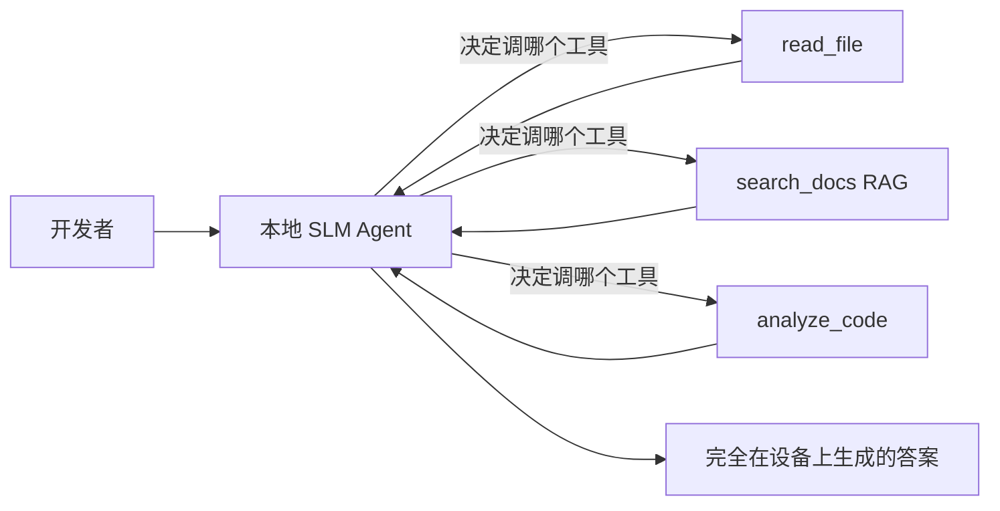
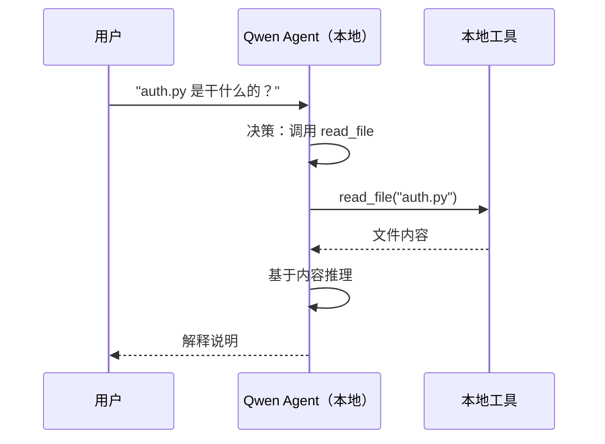
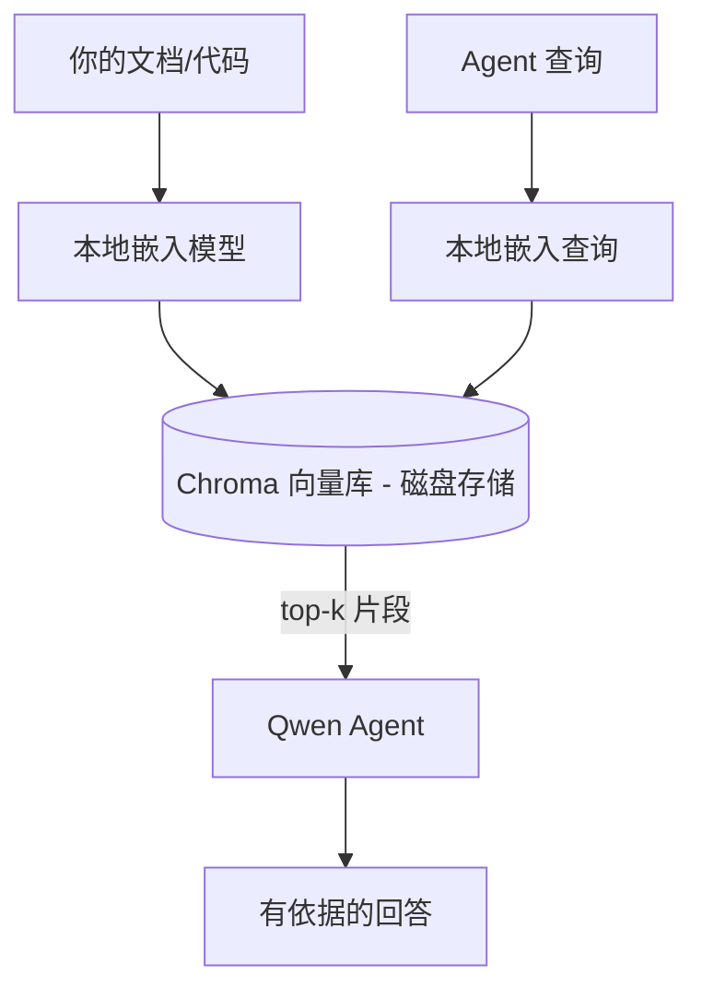
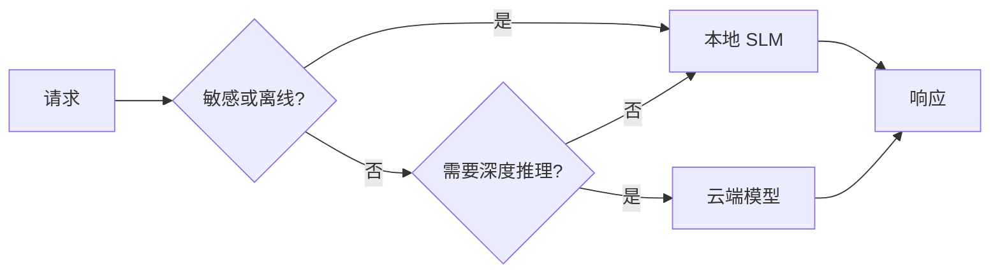

# 创建本地 AI Agent：Foundry Local + Qwen 全离线实践

来源：Microsoft Learn 开源课程 [AI Agents for Beginners - Creating Local AI Agents Using Microsoft Foundry Local and Qwen](https://github.com/microsoft/ai-agents-for-beginners/blob/main/17-creating-local-ai-agents/README.md)

> 本文是对原英文课程的中文整理版，不是逐字翻译。目标是帮助中文读者理解 SLM（小语言模型）的取舍、Foundry Local 的本地推理运行时、Qwen 函数调用能力，以及本地 RAG / 本地 MCP / 云-本地混合模式。

## 1. 这节课要解决什么问题

上一课把 Agent 扩展"上云"，这一课把它拉"下地"——落到单台机器上。学完你将拥有一个能推理、调工具、读文件、搜文档的工程助手，**全程没有一次云端推理调用**。

为什么要这样做？工程实践中反复出现的三个理由：

- **隐私**：代码和文档不出本机。任何 prompt、代码片段、客户数据都不跨越网络边界。
- **成本**：本地推理没有按 token 计费。花电费的价格就能迭代一整天。
- **离线**：在飞机上、涉密场所、或云服务故障期间，Agent 照常工作。

代价是：用**小语言模型（SLM）**替换前沿云端大模型，跑在你的 CPU/GPU/NPU 上。本课要做的是**在这个约束下构建足够好的 Agent**，而不是假装约束不存在。

学完你将能够：

- 解释 SLM 的取舍，选出合适的本地 Agent 用例
- 用 Foundry Local 本地部署 Qwen 模型，通过 OpenAI 兼容端点连接
- 构建完全跑在工作站上的工具调用 Agent
- 用本地向量数据库（Chroma）给自己的文档加本地 RAG
- 连接本地 MCP 服务器，并对云-本地混合设计做出判断

前置知识：第 4 课（工具使用）、第 5 课（Agentic RAG）、第 11 课（MCP）、第 14 课（MAF）。硬件方面：**8 GB 内存是现实下限**，16 GB+ 更从容；GPU/NPU 有帮助但非必需。软件：Foundry Local、Python 3.12+、`foundry-local-sdk`、`openai`、`chromadb`。

## 2. SLM：本地工作的合适工具

前沿云模型有数千亿参数和整个数据中心撑腰；SLM 只有几十亿参数，还得塞进笔记本内存。这个差异决定了清晰的预期：

**SLM 擅长：**

- 结构化、有边界的任务——分类、抽取、对已知文档做摘要
- **工具调用**——决定调哪个函数、传什么参数
- 在自己的数据上快速、便宜、私密地迭代

**SLM 不擅长：**

- 大上下文里开放式、多跳的推理
- 广博的世界知识（见得少，忘得多）

因此本地 Agent 的制胜策略是：**让 SLM 做编排，让工具干重活**。模型不需要"知道"你的代码库——它只需要知道什么时候调 `read_file`、什么时候调 `search_docs`。这正好打在 SLM 的长处上。



## 3. Microsoft Foundry Local

**Foundry Local** 是一个轻量运行时，在你的机器上下载、管理和运行模型。对我们最重要的特性：它暴露一个 **OpenAI 兼容的 HTTP 端点**——OpenAI SDK 和 MAF 的 OpenAI 客户端只需改一个 `base_url` 就能直接使用。之前学的所有 Agent 构建知识全部迁移，只是端点从云端换成了 `localhost`。

Foundry Local 还会自动为你的硬件挑选最优模型构建——CPU 版、CUDA/GPU 版或 NPU 版——不用手工按机器优化。

### 安装与验证

```bash
# 安装（示例，请按你的平台参考官方文档）
winget install Microsoft.FoundryLocal      # Windows
# brew install microsoft/foundrylocal/foundrylocal   # macOS

# 下载并运行 Qwen 模型，启动本地服务
foundry model run qwen2.5-7b-instruct
foundry service status
```

服务运行后，你就拥有了一个本地 OpenAI 兼容端点（通常是 `http://localhost:PORT/v1`）。notebook 用 `foundry-local-sdk` 自动发现端点，无需硬编码端口。

## 4. 为什么是 Qwen：可靠的函数调用

Agent 之所以是 Agent，在于能调工具。很多 SLM 能聊天，但产出的工具调用不可靠、格式混乱。**Qwen** 系列模型专门针对函数调用训练，能稳定输出格式正确的工具调用结构——这正是把"本地聊天模型"变成"本地 Agent"的关键。

流程就是你已经熟悉的标准工具调用循环，只是跑在本机：



## 5. 本地 RAG

文档检索是本地 Agent 最能体现价值的地方。与其指望 SLM 背下了你所用框架的文档，不如把文档嵌入到**本地向量数据库**，让 Agent 按需检索相关片段。

课程使用 **Chroma**——一个进程内嵌入式向量存储，无需管理任何服务器。整条流水线全部本地：本地嵌入模型 → 本地向量 → 本地检索 → 本地 SLM。



这就是第 5 课的 Agentic RAG 模式——唯一的变化是每个组件都跑在你的机器上。

## 6. 本地 MCP 服务器

MCP 是一种传输协议，不是云服务。MCP 服务器可以作为本地进程通过 `stdio` 运行，用标准协议向 Agent 暴露工具。这样你可以完全离线复用日益壮大的 MCP 服务器生态——文件系统访问、git 操作、数据库查询等。

安全姿态与云端不同，但不能缺席：本地 MCP 服务器以**你的用户权限**运行，所以要限定它能触碰的范围（一个项目目录，而不是整个用户主目录），并把它的输出当作需要校验的输入。

## 7. 云-本地混合模式

本地优先不等于只用本地。成熟的系统按**敏感度和难度**路由：

| 场景 | 跑在哪 |
|------|--------|
| 敏感代码/数据，或离线 | **本地 SLM** |
| 简单、有边界的任务 | **本地 SLM**（便宜、快） |
| 非敏感数据上的多跳深度推理 | **云端模型** |
| 云服务故障期间的一切 | **本地 SLM**（优雅降级） |

这呼应了第 16 课的**模型路由**思想——只不过现在其中一个"模型"是你自己的机器。健壮的设计在云不可用时回退到本地，让 Agent 在质量上降级而不是彻底失败。



## 8. 动手实验：本地工程助手

打开 `code_samples/17-local-agent-foundry-local.ipynb`，构建一个完全跑在工作站上的**本地工程助手**，能够：

1. **调用工具**——通过 Foundry Local 使用 Qwen 函数调用
2. **本地文件操作**——列出并读取项目目录中的文件
3. **代码分析**——报告源文件的基本指标
4. **文档检索**——用 Chroma 对 docs 文件夹做本地 RAG
5. **使用 MCP**——连接本地 MCP 服务器（未配置时优雅跳过）

全程零云端推理。

### 核心代码

助手通过 OpenAI 兼容端点连接 Foundry Local，Agent 代码与云端课程几乎一样——只换了客户端：

```python
from foundry_local import FoundryLocalManager
from openai import OpenAI

# Foundry Local 自动发现/下载模型，提供本地端点
manager = FoundryLocalManager("qwen2.5-7b-instruct")
client = OpenAI(base_url=manager.endpoint, api_key=manager.api_key)  # api_key 只是本地占位符
```

工具就是限定在项目目录内的普通 Python 函数：

```python
def read_file(path: str) -> str:
    """读取文件，但仅限沙箱化的项目目录之内。"""
    full = (PROJECT_ROOT / path).resolve()
    if PROJECT_ROOT not in full.parents and full != PROJECT_ROOT:
        return "Access denied: path is outside the project directory."
    return full.read_text(encoding="utf-8")
```

注意沙箱检查——即使在本地，一个能读任意路径的工具也是隐患。notebook 中每个工具都限定在单一项目根目录内。

## 9. 知识自测（8 问）

1. **给出两个本地运行 Agent 的具体理由。** 隐私（代码数据不出机器，合规监管常是驱动因素）、成本（无按 token 账单）、离线能力（无网络也能工作），任选其二。
2. **SLM 和工具之间推荐怎样分工？为什么？** SLM 做**编排**（决定调哪个工具、传什么参数），工具**干重活**（读文件、检索文档、计算结果）。SLM 擅长有边界的决策，不擅长广博知识和长程多跳推理，靠工具扬长避短。
3. **为什么云端 Agent 代码能在 Foundry Local 上复用？** 因为它暴露 **OpenAI 兼容 HTTP 端点**——只改 `base_url`（外加本地占位 api_key），其他代码原封不动。
4. **为什么特意选 Qwen 函数调用模型而不是随便一个 SLM？** Agent 必须产出可靠、格式正确的工具调用。很多 SLM 聊天没问题但工具调用格式混乱；Qwen 针对函数调用训练、输出稳定，这才让本地聊天模型变成能干活的本地 Agent。
5. **本地 RAG 流水线中哪些组件跑在本机？** 全部：嵌入模型、向量库（Chroma，磁盘上）、检索步骤、SLM。没有任何组件碰云。
6. **本地 MCP 服务器就自动安全了吗？** 不。它以你的用户权限运行，你能碰的它都能碰。要限定作用范围（如单个项目目录），并把它的输出当作待校验的输入。
7. **描述一条包含本地模型的合理混合路由规则。** 敏感或离线请求 → 本地 SLM；简单有边界任务 → 本地 SLM（快、省）；非敏感数据的多跳深度推理 → 云模型；云不可用时回退本地实现优雅降级。这就是第 16 课的模型路由，只是本机成了其中一个"模型"。
8. **跑本课本地 Agent 的现实内存下限是多少？加内存能买到什么？** 约 8 GB 是现实下限，16 GB+ 更从容。更多内存能跑更大更强的模型、装下更多上下文。GPU/NPU 加速推理但非必需——没有加速器时 Foundry Local 会选 CPU 构建。

## 10. 作业

把本地工程助手扩展成一个**本地文档审查员**（可以用本仓库任一课程文件夹作为目标项目）。要求：

1. **索引一个真实的文档/代码文件夹**进 Chroma（至少 5 个文件）
2. **新增 `find_todos` 工具**：扫描项目中的 `TODO`/`FIXME` 注释，返回文件名和行号——保持和 `read_file` 一样的沙箱检查
3. **问 Agent 三个问题**，强制它组合使用工具：一个纯 RAG 问题、一个需要读特定文件的问题、一个需要找 TODO 的问题
4. **测量它**：给三次响应分别计时并记录在 markdown 单元格中，评价延迟对你的目标工作流是否可接受

最后写一小段：这个审查员**哪些部分你会挪到云端、哪些留在本地**，为什么。考核点是本地组件是否正确接通、混合推理是否合理——不考核模型质量。

## 11. 小结

- **SLM** 用广度换隐私、成本和离线能力——当它**编排工具**而不是自己背知识时最出彩
- **Foundry Local** 在设备上以 **OpenAI 兼容端点**运行模型，云端 Agent 代码一行改动即可迁移
- **Qwen 函数调用模型**让可靠的本地工具调用（进而本地 Agent）成为可能
- **本地 RAG**（Chroma）和**本地 MCP** 让 Agent 不出机器就获得能力
- **混合模式**按敏感度和难度路由，本地是优雅的兜底

至此部署篇完整闭环：第 16 课把 Agent 扩展进 Microsoft Foundry 云端，本课把它缩放到单台工作站。下一课转向保障已部署 Agent 的安全。

## 12. 延伸资料

- [Microsoft Foundry Local 文档](https://learn.microsoft.com/azure/ai-foundry/foundry-local/)
- [Microsoft Foundry 文档](https://learn.microsoft.com/azure/ai-foundry/what-is-azure-ai-foundry)
- [Microsoft Agent Framework](https://aka.ms/ai-agents-beginners/agent-framework)
- [Qwen 函数调用文档](https://qwen.readthedocs.io/en/latest/framework/function_call.html)
- [Model Context Protocol（MCP）](https://modelcontextprotocol.io/)
- [Chroma 向量数据库](https://docs.trychroma.com/)

---

- 上一课：[16-部署可扩展的 Agent](16-deploying-scalable-agents-zh-optimized.md)
- 下一课：[18-AI Agent 安全](18-securing-ai-agents-zh-optimized.md)
