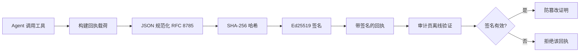
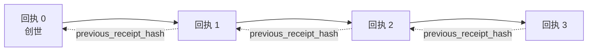

# AI Agent 安全：用密码学回执构建防篡改审计链

来源：Microsoft Learn 开源课程 [AI Agents for Beginners - Securing AI Agents with Cryptographic Receipts](https://github.com/microsoft/ai-agents-for-beginners/blob/main/18-securing-ai-agents/README.md)

> 本文是对原英文课程的中文整理版，不是逐字翻译。目标是帮助中文读者理解 Agent 审计链的痛点、密码学回执（Ed25519 签名 + JCS 规范化 + 哈希链）的原理与代码实现，以及回执"能证明什么、不能证明什么"这条最关键的边界。

## 1. 这节课要解决什么问题

本课覆盖：

- 为什么 AI Agent 的审计链对合规、调试和信任至关重要
- 什么是密码学回执（cryptographic receipt），它和普通日志行的区别
- 用纯 Python 为 Agent 的工具调用生成签名回执
- 离线验证回执、检测篡改
- 把回执串成链——删除或重排任何一条都会破坏整条链
- 回执能证明什么、明确不能证明什么

## 2. 问题：你的 Agent 的审计链

想象你为 Contoso Travel 部署了一个 Agent：读客户请求、调航班 API 查询、代客户订座。上季度它处理了 5 万笔订单。

今天审计员来了，问一个简单的问题："给我看你的 Agent 都做了什么。"你交出日志文件。审计员接着问更难的问题："**我怎么知道这些日志没被改过？**"

这就是审计链问题。今天大多数 Agent 部署依赖的手段都答不上来：

- **应用日志**：Agent 自己写的，任何有文件系统权限的人都能改
- **云日志服务**：平台层面防篡改——前提是审计员信任平台运营方
- **数据库事务日志**：适合数据库变更，不适合任意工具调用

它们都要求审计员先信任某个人（你、你的云厂商、你的数据库供应商）。内部使用尚可接受；受监管的工作负载（金融、医疗、任何受欧盟 AI 法案约束的场景）不行。

密码学回执的解法：让每个 Agent 动作**可独立验证**。审计员不需要信任你——只需要你的公钥和回执本身。

## 3. 什么是密码学回执

回执是一个记录 Agent 行为的 JSON 对象，附带数字签名。



最小回执长这样：

```json
{
  "type": "agent.tool_call.v1",
  "agent_id": "contoso-travel-bot",
  "tool_name": "lookup_flights",
  "tool_args_hash": "sha256:a3f9c1...",
  "result_hash": "sha256:7b2e1d...",
  "policy_id": "contoso-travel-policy-v3",
  "timestamp": "2026-04-25T14:30:00Z",
  "sequence": 47,
  "previous_receipt_hash": "sha256:9d4e6a...",
  "signature": {
    "alg": "EdDSA",
    "sig": "c5af83...",
    "public_key": "8f3b2c..."
  }
}
```

真正起作用的是三个性质：

1. **签名**：Agent 网关用 Ed25519 私钥签名。持有对应公钥的任何人可以离线验证；篡改任何字段都会使签名失效。
2. **规范化编码**：签名前用 JSON Canonicalization Scheme（JCS，RFC 8785）序列化，保证不同实现对同一逻辑回执产出字节级一致的输出。没有规范化，不同 JSON 序列化器会对相同内容产出不同签名。
3. **哈希链**：`previous_receipt_hash` 把每条回执链接到前一条。删除或重排一条回执，其后所有回执全部失效——即使绕过单条签名，篡改也会在链的层面暴露。

三个性质合起来提供三项保证：

- **归属（Attribution）**：这把密钥签署了这份内容
- **完整性（Integrity）**：内容自签名后未被修改
- **顺序（Ordering）**：这条回执在链中位于那条之后

## 4. 用 Python 生成回执

不需要专门的库——密码学原语随处可得，逻辑只有几十行 Python。完整流程见 `code_samples/18-signed-receipts.ipynb`，概要版：

```python
import json
import hashlib
import base64
from nacl import signing
from jcs import canonicalize  # RFC 8785 规范化 JSON

def b64url_nopad(data: bytes) -> str:
    return base64.urlsafe_b64encode(data).decode("ascii").rstrip("=")

def sha256_canonical(obj) -> str:
    """对 Python 对象的 JCS 规范化 JSON 形式取 SHA-256。"""
    return f"sha256:{hashlib.sha256(canonicalize(obj)).hexdigest()}"

# 生成或加载签名密钥（生产环境应存放在密钥保管库）
signing_key = signing.SigningKey.generate()
verify_key = signing_key.verify_key

# 构建回执载荷（尚无签名）
tool_args = {"origin": "SYD", "destination": "LAX"}
tool_result = [{"flight": "QF11", "price": 1850, "stops": 0}]

payload = {
    "type": "agent.tool_call.v1",
    "agent_id": "contoso-travel-bot",
    "tool_name": "lookup_flights",
    "tool_args_hash": sha256_canonical(tool_args),
    "result_hash": sha256_canonical(tool_result),
    "policy_id": "contoso-travel-policy-v3",
    "timestamp": "2026-04-25T14:30:00Z",
    "sequence": 0,
    "previous_receipt_hash": None,
}

# 规范化 → 哈希 → 签名
canonical_bytes = canonicalize(payload)
message_hash = hashlib.sha256(canonical_bytes).digest()
signature_bytes = signing_key.sign(message_hash).signature

# 附上结构化的签名对象
receipt = {
    **payload,
    "signature": {
        "alg": "EdDSA",
        "sig": b64url_nopad(signature_bytes),
        "public_key": b64url_nopad(bytes(verify_key)),
    },
}
```

这就是完整的签名流水线。

## 5. 验证回执与检测篡改

验证是逆向操作：

```python
import base64
import hashlib
from nacl import signing
from nacl.exceptions import BadSignatureError
from jcs import canonicalize

def b64url_decode(s: str) -> bytes:
    padding = "=" * ((4 - len(s) % 4) % 4)
    return base64.urlsafe_b64decode(s + padding)

def verify_receipt(receipt: dict) -> bool:
    # 签名是结构化对象：{"alg", "sig", "public_key"}
    sig_obj = receipt.get("signature")
    if not sig_obj or sig_obj.get("alg") != "EdDSA":
        return False

    # 重建实际被签名的载荷（除 signature 外的全部字段）
    payload = {k: v for k, v in receipt.items() if k != "signature"}

    canonical_bytes = canonicalize(payload)
    message_hash = hashlib.sha256(canonical_bytes).digest()

    try:
        verify_key = signing.VerifyKey(b64url_decode(sig_obj["public_key"]))
        verify_key.verify(message_hash, b64url_decode(sig_obj["sig"]))
        return True
    except BadSignatureError:
        return False
```

签名有效返回 `True`，否则 `False`——**无网络调用、无服务依赖、不需要信任任何第三方**。

notebook 演示篡改检测：生成有效回执并确认可验证 → 改动 `tool_args_hash` 的一个字节 → 重新验证、看到失败。这就是"防篡改"的实操证明：任何修改，无论多小，都会破坏签名。

## 6. 多步 Agent 的回执链

一条签名回执保护一个动作；一条回执链保护一个序列。



每条回执记录前一条的哈希。攻击者要悄悄删掉回执 2，必须二选一：

- 修改回执 3 的 `previous_receipt_hash`（破坏回执 3 的签名），或
- 对改过的回执 3 伪造新签名（需要 Agent 的私钥）

如果私钥在硬件密钥保管库里、公钥随每条回执发布，两种攻击都无法在不被发现的情况下实施。这就是一条**外部审计员无需信任你就能验证**的审计链。

## 7. 回执能证明什么、不能证明什么（最重要的一节）

回执很强大，但它的力量是有边界的。

**回执证明三件事：**

1. **归属**：某把特定密钥签署了某份特定载荷
2. **完整性**：载荷自签名后未被修改
3. **顺序**：这条回执在哈希链中位于那条之后

**回执不能证明：**

1. **正确性**：Agent 的动作是不是对的。给错误答案签名和给正确答案签名一样"干净"。
2. **策略合规**：`policy_id` 引用的策略是否真的被评估过、被检查过是否允许该动作。回执记录的是"声称了什么"，不是"强制执行了什么"。
3. **密钥之外的身份**：回执说的是"这把密钥签了这份内容"，不是"这个人授权了这件事"。把密钥关联到人或组织需要独立的身份基础设施（目录服务、公钥注册表等）。
4. **输入的真实性**：如果 Agent 收到被操纵的 prompt 并据此行动，回执会如实记录该动作。回执在输入校验的下游，不能替代输入校验。

这条边界之所以重要：它告诉你回执的用处（让 Agent 行为可审计、防篡改，甚至跨组织边界），也告诉你还缺哪些层（输入校验——第 6 课、策略强制执行、身份基础设施）。

**常见误区：以为"我们有回执"等于"我们有治理"。不是的。回执是地基，治理是建在上面的系统。**

## 8. 证明"人批准的正是这个动作"

上一节第 3 条值得单独展开：动作回执只说"这把密钥签了这份内容"，从不说"某个人授权了它"。而对高风险动作（退款、删除、电汇），治理框架越来越要求的恰恰是这句缺失的话——它可以用本课已有的原语构造出来。

后续 notebook `code_samples/human-authorization-receipts.ipynb` 增加了第二种回执类型 `human.approval.v1`，与本课回执同一信封结构（类型化载荷 + 对其规范化 SHA-256 的 Ed25519 签名，`signature` 对象在签名字节之外）：

- 具名审批人在执行前对**完整规范化动作及其摘要**签名
- Agent 的动作回执携带**同一个动作摘要**和 `parent_approval_ref`（审批回执的 `receipt_hash`，与链中 `previous_receipt_hash` 同一约定）
- 一个 `verify_chain` 遍历两种工件，但使用**各自独立锁定的密钥注册表**（审批人密钥 vs Agent 密钥）——代码路径共享，签发权威绝不共享

这买到的性质要谨慎表述：*人批准了这个确切的动作，且 Agent 执行的正是那个被批准的动作*。notebook 的"拒绝夹具"让这个性质是真实的而非口头宣称：

- 经典场景：篡改、混淆代理（confused deputy）、重放、任一侧伪造密钥、畸形输入
- **过期权威**：签名仍能通过验证，但因策略版本变更、审批人密钥被轮换出锁定注册表、或审批在执行前过期而照样拒绝
- **摘要替换**：一条签名有效的动作回执指向一条*真实*的审批——但那条审批绑定的是*另一个*规范化动作

每种失败以不同的原因拒绝，审计员看到拒绝就知道是权威过期还是执行动作被换。notebook 教的规则：**一份签名的审批本身不是权威。只有当两条回执在执行时刻仍绑定到同一个规范化动作，权威才存在。** 本课遵循的 IETF 草案（`draft-farley-acta-signed-receipts`）中的共签路径就是这个模式的标准化形态。

## 9. 生产环境参考

本课代码刻意最小化以便逐行读懂。生产中有两个选项：

1. **直接在密码学原语上构建**：上面那 50 行对很多用例已够用。PyNaCl（Ed25519）和 `jcs`（规范化 JSON）都是维护良好、经过审计的库。
2. **使用生产级回执库**：多个开源项目实现了同一模式并附加密钥轮换、批量验证、JWK Set 分发、策略引擎集成等特性：
   - 本课回执格式遵循 IETF 草案 [draft-farley-acta-signed-receipts](https://datatracker.ietf.org/doc/draft-farley-acta-signed-receipts/)（rev 02），有共享一致性测试套件（agent-governance-testvectors）供独立实现交叉验证字节级一致的规范化输出
   - Microsoft Agent Governance Toolkit 把回执与基于 Cedar 的策略决策组合（见其 Tutorial 33 端到端示例）
   - `protect-mcp` / `@veritasacta/verify`（npm）：Node 实现，用于给任何 MCP 服务器包上防篡改审计链，含"暂停待共签"流程（桌面流程基于 WebAuthn）
   - [nobulex](https://github.com/arian-gogani/nobulex)（`pip install nobulex`）：Python SDK，同样的 Ed25519 + JCS 模式，带 LangChain / CrewAI 集成

自研 vs 用库，就像自写 JWT 库 vs 用成熟库：都合理；库省时间、减小审计面，自研迫使你理解每个原语。本课教自研路径，让你两条路都有根基。

## 10. 知识自测（5 问）

1. **审计员只有公钥，能离线验证回执吗？** 能。Ed25519 验证只需要公钥和被签名的字节——无网络调用、无服务依赖。这正是回执在气隙环境、跨组织、低信任审计场景中有用的原因。
2. **攻击者把回执的 `policy_id` 改成更宽松的策略，验证时会发生什么？** 验证失败。签名是对原始载荷的规范化字节计算的；改任何字段就改变了规范化字节 → 改变了 SHA-256 哈希 → 签名失效。要产出新的有效签名需要私钥，而攻击者没有。
3. **为什么回执放的是 `tool_args_hash` / `result_hash` 而不是原始参数和结果？** 两个原因：一是回执可能要在不宜泄露原始内容（PII、业务数据）的环境中归档传输，哈希既保持回执小巧又保护内容隐私，审计员用哈希比对单独存储的内容副本；二是哈希定长，无论输入输出多大，回执大小都有界。
4. **攻击者从链中间悄悄删掉一条回执，什么会失效？** 被删那条之后的所有回执——它们的 `previous_receipt_hash` 不再匹配实际的链。要掩盖删除就得重签之后的每一条，而那需要私钥。
5. **回执验证通过，能证明 Agent 的动作正确、合理、合规吗？** 不能。有效回执只证明归属、完整性、顺序三件事。它不证明动作正确、不证明 `policy_id` 的策略真被评估过、不证明 Agent 遵守了所有规则。**回执让 Agent 行为可审计，不保证其正确——这是本课最重要的边界。**

## 11. 练习

打开 `code_samples/18-signed-receipts.ipynb` 完成四个部分：

1. 签署第一条回执并验证
2. 篡改回执、观察验证失败
3. 构建三条回执的链并验证链完整性
4. 把该模式应用到 MAF 构建的 Agent：给工具调用包上回执签名，然后独立验证

**进阶挑战 1**：给回执 schema 加一个自选字段（如追踪用的 request ID），更新规范化签名逻辑，确认回执仍能通过验证往返；再在签名后修改该字段，确认验证失败——这迫使你理解规范化编码的每个字节如何参与签名。

**进阶挑战 2**：把两条回执按确定顺序拼接规范化字节后取 SHA-256，把摘要作为新字段嵌入第三条回执再签名，验证三条回执都能往返。你刚构建了一个一步的包含证明（inclusion proof）：持有第三条回执的任何人都能证明前两条在其签名时已存在，且无需披露其内容——这正是选择性披露回执在规模化时用的模式（Merkle 承诺，RFC 6962）。

## 12. 生产清单

准备把回执签名 Agent 部署到真实环境时：

- [ ] **签名密钥离开开发机**：用 Azure Key Vault、AWS KMS 或 HSM。私钥绝不进源码库、绝不明文放在应用机器上
- [ ] **发布验证公钥**：审计员需要它离线验证。标准模式是众所周知 URL 上的 JWK Set（RFC 7517），如 `https://your-org.example.com/.well-known/agent-keys.json`
- [ ] **把链锚定到外部**：定期把最新链头哈希写入透明日志（Sigstore Rekor、RFC 3161 时间戳机构或第二套内部系统），让外部方能确认"这条链在这个时间点存在"
- [ ] **不可变存储回执**：只追加的 Blob 存储（Azure Storage 不可变策略、AWS S3 Object Lock）防止内部人员在存储层改写历史
- [ ] **确定保留期**：许多合规体系要求多年保留。规划回执增长（每条约 500 字节；每天 1 万次调用的 Agent 一年约产生 1.8 GB）
- [ ] **书面说明回执不覆盖什么**：运维手册应明确列出与回执并行的其他控制（输入校验、策略强制、限流、身份基础设施）

## 13. 更进一步的模式

同样的原语可以组合出更高级的治理模式：

- **选择性披露**：字段用 RFC 6962 风格 Merkle 树独立承诺，可向特定审计员披露特定字段并证明其余未变——同时满足"要完整性"的全面审计和"看得越少越好"的 GDPR 数据最小化
- **回执吊销**：签名密钥泄露后，需要把该密钥某时间点之后签的所有回执标记为不可信。标准做法：短生命周期签名密钥 + 已发布吊销列表，或带吊销条目的透明日志
- **双边/分离签名回执**：把载荷拆成执行前（`authorization_*`）和执行后（`result_*`）两半、独立签名——适合授权决策和观测结果由不同主体或不同时间产生的场景
- **载荷组合**：回执密封的是 `result_hash` 里的任何字节。真实载荷往往比单次工具调用结果更丰富：决策前推理、备选项、证据及其完备性、风险姿态、责任链、门禁结果都可以放进载荷，由一条回执密封
- **跨实现一致性**：同一回执格式的多语言实现（Python/TypeScript/Rust/Go）针对共享测试向量交叉验证。自研实现应对照已发布向量确认线上兼容
- **后量子迁移**：Ed25519 不抗量子。回执格式是算法敏捷的——`signature.alg` 字段可以承载 `ML-DSA-65`（NIST 后量子签名标准），迁移期可以双签

## 14. 小结

密码学回执给 AI Agent 一条这样的审计链：

- **可独立验证**：任何持有公钥的一方都能验证，无服务依赖
- **防篡改**：任何修改都使签名失效
- **可携带**：回执是一个小 JSON 文件，随处归档、传输、验证
- **对齐标准**：建立在 Ed25519（RFC 8032）、JCS（RFC 8785）、SHA-256 之上

它们不能替代输入校验、策略强制、身份基础设施——它们是这些层的地基。当你把 Agent 部署到受监管工作负载、跨组织流程、或任何"未来的审计员不能假定信任你"的场景，回执就是让审计链诚实的方式。

**最重要的一句话：回执证明"谁在什么时候说了什么"，不证明"说的是对的"。牢牢握住这个区别——它是诚实的溯源系统与误导性溯源系统的分界线。**

## 15. 延伸资料

- [IETF 草案：Signed Decision Receipts for Machine-to-Machine Access Control](https://datatracker.ietf.org/doc/draft-farley-acta-signed-receipts/)
- [RFC 8032：EdDSA 签名算法](https://datatracker.ietf.org/doc/html/rfc8032)
- [RFC 8785：JSON 规范化方案（JCS）](https://datatracker.ietf.org/doc/html/rfc8785)
- [RFC 6962：证书透明度](https://datatracker.ietf.org/doc/html/rfc6962)（选择性披露回执使用的 Merkle 树构造）
- [Microsoft Agent Governance Toolkit Tutorial 33：离线可验证决策回执](https://github.com/microsoft/agent-governance-toolkit/blob/main/docs/tutorials/33-offline-verifiable-receipts.md)
- [跨实现一致性测试向量](https://github.com/ScopeBlind/agent-governance-testvectors)
- [PyNaCl 文档](https://pynacl.readthedocs.io/)（Python 中的 Ed25519）

---

- 上一课：[17-创建本地 AI Agent](17-creating-local-ai-agents-zh-optimized.md)
- 本课程全部 18 课到此完结 🎉
