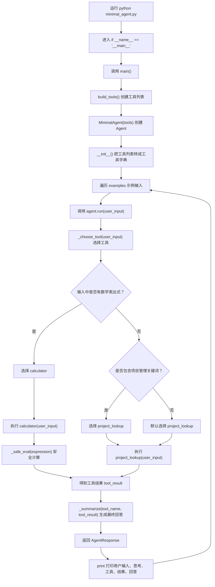

# `minimal_agent.py` 代码详解

本文面向 Python 初学者，逐段解释 `minimal_agent.py` 的引用、语法、函数和执行逻辑。

这个示例不是一个真正调用大模型的 AI Agent。它用本地规则模拟 Agent 的核心行为：

- 接收用户输入
- 判断应该调用哪个工具
- 执行工具
- 把工具结果整理成最终回答

## 1. 代码整体结构

`minimal_agent.py` 可以分成 6 个部分：

| 部分 | 代码位置 | 作用 |
| --- | --- | --- |
| 引用模块 | `import ...` | 引入 Python 标准库能力 |
| 数据结构 | `Tool`、`AgentResponse` | 定义工具和 Agent 输出结果的格式 |
| Agent 主类 | `MinimalAgent` | 负责选择工具、调用工具、生成回答 |
| 工具注册 | `build_tools()` | 告诉 Agent 有哪些工具可以用 |
| 工具函数 | `calculator()`、`project_lookup()` | 真正执行具体任务 |
| 程序入口 | `main()`、`if __name__ == "__main__"` | 让文件可以直接运行 |

## 2. 引用模块

代码开头：

```python
from __future__ import annotations

import ast
import operator
import re
from dataclasses import dataclass
from typing import Callable
```

逐行解释：

| 代码 | 含义 |
| --- | --- |
| `from __future__ import annotations` | 让类型标注的处理更灵活。这里主要是为了让 `list[Tool]` 这类写法更稳定。 |
| `import ast` | 引入 Python 的语法树模块，用来安全解析数学表达式。 |
| `import operator` | 引入标准运算函数，例如加法、减法、乘法、除法。 |
| `import re` | 引入正则表达式模块，用来从用户输入中识别数学表达式。 |
| `from dataclasses import dataclass` | 引入 `dataclass`，方便快速定义只保存数据的类。 |
| `from typing import Callable` | 引入函数类型标注。`Callable[[str], str]` 表示“接收字符串，返回字符串的函数”。 |

## 3. `Tool`：工具的数据结构

代码：

```python
@dataclass(frozen=True)
class Tool:
    name: str
    description: str
    run: Callable[[str], str]
```

### 3.1 什么是 `class`

`class Tool:` 定义了一个类。你可以把类理解成一种“数据模板”。

这个模板规定了一个工具必须有 3 个字段：

- `name`：工具名称
- `description`：工具说明
- `run`：工具执行函数

### 3.2 什么是 `@dataclass`

`@dataclass` 是 Python 提供的装饰器。

普通类需要自己写初始化方法：

```python
class Tool:
    def __init__(self, name, description, run):
        self.name = name
        self.description = description
        self.run = run
```

使用 `@dataclass` 后，Python 会自动帮你生成类似上面的初始化代码。

所以可以直接这样创建工具：

```python
Tool(
    name="calculator",
    description="提取并计算用户输入中的四则运算表达式",
    run=calculator,
)
```

### 3.3 什么是 `frozen=True`

`frozen=True` 表示这个对象创建之后，不建议再修改字段。

例如：

```python
tool = Tool("calculator", "计算器", calculator)
tool.name = "other"
```

上面这种修改会报错。

这样做的好处是：工具定义更稳定，不容易在程序运行过程中被意外改掉。

### 3.4 什么是类型标注

这几行：

```python
name: str
description: str
run: Callable[[str], str]
```

是类型标注。

它们不会强制改变程序运行方式，但能帮助人和编辑器理解代码：

- `name: str` 表示 `name` 应该是字符串
- `description: str` 表示 `description` 应该是字符串
- `run: Callable[[str], str]` 表示 `run` 应该是一个函数，输入字符串，输出字符串

## 4. `AgentResponse`：Agent 返回结果的数据结构

代码：

```python
@dataclass(frozen=True)
class AgentResponse:
    user_input: str
    thought: str
    tool_name: str
    tool_result: str
    final_answer: str
```

这个类表示 Agent 运行一次后的完整结果。

字段含义：

| 字段 | 含义 |
| --- | --- |
| `user_input` | 用户原始输入 |
| `thought` | Agent 选择工具的说明 |
| `tool_name` | 实际调用的工具名称 |
| `tool_result` | 工具返回的结果 |
| `final_answer` | Agent 整理后的最终回答 |

为什么不直接返回一个字符串？

因为教学时我们希望看到 Agent 的中间过程。例如：

- 它选了哪个工具？
- 工具返回了什么？
- 最终回答是怎么来的？

用 `AgentResponse` 可以把这些信息分开保存，方便观察和测试。

## 5. `MinimalAgent`：Agent 主类

代码：

```python
class MinimalAgent:
    """A tiny local agent: choose a tool, run it, then summarize."""
```

`MinimalAgent` 是这个文件最核心的类。

它负责三件事：

1. 根据用户输入选择工具
2. 调用工具
3. 把工具结果整理成回答

## 6. `__init__()`：初始化 Agent

代码：

```python
def __init__(self, tools: list[Tool]):
    self.tools = {tool.name: tool for tool in tools}
```

### 6.1 什么是 `__init__`

`__init__` 是 Python 类的初始化方法。

当你写：

```python
agent = MinimalAgent(build_tools())
```

Python 会自动调用：

```python
MinimalAgent.__init__(agent, build_tools())
```

你不需要手动调用它。

### 6.2 什么是 `self`

`self` 表示“当前这个对象自己”。

例如：

```python
self.tools = ...
```

意思是：给当前这个 Agent 对象保存一个名为 `tools` 的属性。

以后在这个对象内部，就可以用：

```python
self.tools
```

拿到这些工具。

### 6.3 什么是字典推导式

代码：

```python
{tool.name: tool for tool in tools}
```

会把工具列表转换成字典。

如果 `tools` 是：

```python
[
    Tool(name="calculator", ...),
    Tool(name="project_lookup", ...),
]
```

转换后大致是：

```python
{
    "calculator": Tool(name="calculator", ...),
    "project_lookup": Tool(name="project_lookup", ...),
}
```

这样 Agent 后续可以通过工具名快速找到工具：

```python
tool = self.tools["calculator"]
```

## 7. `run()`：执行一次 Agent 流程

代码：

```python
def run(self, user_input: str) -> AgentResponse:
    tool_name = self._choose_tool(user_input)
    tool = self.tools[tool_name]
    tool_result = tool.run(user_input)
    thought = f"用户输入匹配到 {tool.name} 工具：{tool.description}"
    final_answer = self._summarize(tool_name, tool_result)

    return AgentResponse(
        user_input=user_input,
        thought=thought,
        tool_name=tool_name,
        tool_result=tool_result,
        final_answer=final_answer,
    )
```

这是整个 Agent 的主流程。

逐行解释：

| 代码 | 含义 |
| --- | --- |
| `tool_name = self._choose_tool(user_input)` | 根据用户输入选择工具名称 |
| `tool = self.tools[tool_name]` | 根据工具名称，从工具字典里取出工具对象 |
| `tool_result = tool.run(user_input)` | 调用工具函数，把用户输入传进去 |
| `thought = ...` | 生成一段说明，展示为什么选择该工具 |
| `final_answer = self._summarize(...)` | 把工具结果整理成用户能读懂的回答 |
| `return AgentResponse(...)` | 返回结构化结果 |

### 7.1 什么是方法名前面的下划线

`_choose_tool()` 和 `_summarize()` 前面有一个下划线。

这是一种 Python 约定，表示：

> 这个方法主要给类内部使用，不建议外部直接调用。

它不是强制限制，只是一种代码风格。

## 8. `_choose_tool()`：选择工具

代码：

```python
def _choose_tool(self, user_input: str) -> str:
    if re.search(r"\d+\s*[\+\-\*/]\s*\d+", user_input):
        return "calculator"

    project_keywords = ["项目", "总集", "管理", "范围", "进度", "风险"]
    if any(keyword in user_input for keyword in project_keywords):
        return "project_lookup"

    return "project_lookup"
```

这个函数模拟真实 Agent 中的“工具选择”。

真实 Agent 中，LLM 可能会根据工具说明判断：

- 这是计算问题，调用计算器
- 这是项目问题，调用知识查询
- 这是搜索问题，调用搜索工具

这个教学示例没有 LLM，所以用规则来判断。

### 8.1 正则表达式判断计算请求

代码：

```python
re.search(r"\d+\s*[\+\-\*/]\s*\d+", user_input)
```

含义：

| 片段 | 含义 |
| --- | --- |
| `r"..."` | 原始字符串，常用于写正则表达式 |
| `\d+` | 匹配一个或多个数字 |
| `\s*` | 匹配零个或多个空格 |
| `[\+\-\*/]` | 匹配 `+`、`-`、`*`、`/` 其中一个 |
| `\d+` | 再匹配一个或多个数字 |

所以它能识别：

```text
18 + 24
10/2
3 * 7
```

如果匹配成功，就返回：

```python
return "calculator"
```

意思是选择计算器工具。

### 8.2 关键词判断项目管理请求

代码：

```python
project_keywords = ["项目", "总集", "管理", "范围", "进度", "风险"]
if any(keyword in user_input for keyword in project_keywords):
    return "project_lookup"
```

`project_keywords` 是一个列表，保存项目管理相关关键词。

`any(...)` 的含义是：

> 只要里面有一个条件为真，整体就为真。

例如用户输入：

```text
这个总集项目的核心管理动作是什么？
```

里面包含：

```text
总集
项目
管理
```

所以会选择：

```python
project_lookup
```

### 8.3 默认工具

代码最后：

```python
return "project_lookup"
```

如果前面都没有匹配，也默认返回 `project_lookup`。

因为这个最小示例只有两个工具，而项目知识查询作为默认回答更容易演示。

## 9. `_summarize()`：整理最终回答

代码：

```python
def _summarize(self, tool_name: str, tool_result: str) -> str:
    if tool_name == "calculator":
        return f"计算结果是 {tool_result}。"

    return f"根据本地项目知识，建议关注：{tool_result}"
```

这个函数把工具结果包装成一句面向用户的回答。

如果是计算器工具：

```python
计算结果是 42。
```

如果是项目知识工具：

```python
根据本地项目知识，建议关注：范围确认、分工界面、进度跟踪、风险登记和交付物归档。
```

### 9.1 什么是 f-string

代码：

```python
f"计算结果是 {tool_result}。"
```

这是 Python 的格式化字符串。

`{tool_result}` 会被变量 `tool_result` 的值替换。

例如：

```python
tool_result = "42"
```

那么：

```python
f"计算结果是 {tool_result}。"
```

结果就是：

```text
计算结果是 42。
```

## 10. `build_tools()`：注册工具

代码：

```python
def build_tools() -> list[Tool]:
    return [
        Tool(
            name="calculator",
            description="提取并计算用户输入中的四则运算表达式",
            run=calculator,
        ),
        Tool(
            name="project_lookup",
            description="返回总集项目管理的本地知识片段",
            run=project_lookup,
        ),
    ]
```

这个函数告诉 Agent：

> 你现在有两个工具可以用。

第一个工具：

| 字段 | 值 |
| --- | --- |
| `name` | `calculator` |
| `description` | 提取并计算用户输入中的四则运算表达式 |
| `run` | `calculator` 函数 |

第二个工具：

| 字段 | 值 |
| --- | --- |
| `name` | `project_lookup` |
| `description` | 返回总集项目管理的本地知识片段 |
| `run` | `project_lookup` 函数 |

注意：

```python
run=calculator
```

这里没有写成：

```python
run=calculator()
```

原因是：

- `calculator` 表示把函数本身传进去
- `calculator()` 表示立刻执行这个函数

这里我们只是注册工具，不是马上执行工具，所以要写 `run=calculator`。

## 11. `calculator()`：计算器工具

代码：

```python
def calculator(user_input: str) -> str:
    expression_match = re.search(r"[\d\s\+\-\*/\(\)\.]+", user_input)
    if expression_match is None:
        return "未找到可计算的表达式"

    expression = expression_match.group(0).strip()
    value = _safe_eval(expression)
    if int(value) == value:
        return str(int(value))
    return str(value)
```

这个函数做 4 件事：

1. 从用户输入里提取数学表达式
2. 如果没找到表达式，返回提示
3. 调用 `_safe_eval()` 计算
4. 把计算结果转成字符串返回

### 11.1 提取表达式

代码：

```python
expression_match = re.search(r"[\d\s\+\-\*/\(\)\.]+", user_input)
```

这个正则表达式会匹配：

- 数字
- 空格
- `+`
- `-`
- `*`
- `/`
- `(`
- `)`
- `.`

例如：

```text
请帮我计算 18 + 24
```

会提取：

```text
18 + 24
```

### 11.2 判断是否找到表达式

代码：

```python
if expression_match is None:
    return "未找到可计算的表达式"
```

如果正则表达式没有匹配到内容，`expression_match` 就是 `None`。

`None` 可以理解为“没有值”。

### 11.3 `group(0)` 和 `strip()`

代码：

```python
expression = expression_match.group(0).strip()
```

含义：

- `group(0)`：取出正则匹配到的完整内容
- `strip()`：去掉字符串首尾的空格

### 11.4 为什么不用 `eval`

Python 有一个函数叫 `eval()`，可以直接执行字符串表达式：

```python
eval("18 + 24")
```

虽然方便，但危险。

如果用户输入恶意代码，`eval()` 可能执行不该执行的内容。

所以本示例使用 `_safe_eval()`，只允许数字和四则运算。

### 11.5 整数结果格式化

代码：

```python
if int(value) == value:
    return str(int(value))
return str(value)
```

`_safe_eval()` 返回的是浮点数，例如：

```python
42.0
```

如果结果其实是整数，就转成：

```python
42
```

这样输出更自然。

## 12. `_safe_eval()`：安全计算表达式

代码：

```python
def _safe_eval(expression: str) -> float:
    operators = {
        ast.Add: operator.add,
        ast.Sub: operator.sub,
        ast.Mult: operator.mul,
        ast.Div: operator.truediv,
        ast.USub: operator.neg,
    }
```

这个函数使用 `ast` 解析表达式。

`operators` 是一个字典，表示：

| AST 运算符 | 实际函数 | 含义 |
| --- | --- | --- |
| `ast.Add` | `operator.add` | 加法 |
| `ast.Sub` | `operator.sub` | 减法 |
| `ast.Mult` | `operator.mul` | 乘法 |
| `ast.Div` | `operator.truediv` | 除法 |
| `ast.USub` | `operator.neg` | 负号 |

### 12.1 什么是 AST

AST 是 Abstract Syntax Tree，中文一般叫“抽象语法树”。

简单理解：

> Python 会先把 `18 + 24` 这样的字符串解析成一棵树，再执行。

例如：

```text
18 + 24
```

可以理解成：

```text
    +
   / \
 18  24
```

代码中的 `_safe_eval()` 就是手动遍历这棵树，只处理安全节点。

### 12.2 内部函数 `walk()`

代码：

```python
def walk(node: ast.AST) -> float:
```

`walk()` 是定义在 `_safe_eval()` 内部的函数。

这种函数叫“嵌套函数”。

它只在 `_safe_eval()` 内部使用，外部不能直接调用。

### 12.3 递归处理表达式

代码：

```python
if isinstance(node, ast.Expression):
    return walk(node.body)
```

`ast.Expression` 是整棵表达式的根节点。

真正要计算的内容在 `node.body` 里，所以继续调用 `walk(node.body)`。

这种“函数调用自己”的写法叫递归。

### 12.4 处理数字

代码：

```python
if isinstance(node, ast.Constant) and isinstance(node.value, (int, float)):
    return float(node.value)
```

如果当前节点是数字，就直接返回这个数字。

例如：

```text
18
```

会返回：

```python
18.0
```

### 12.5 处理二元运算

代码：

```python
if isinstance(node, ast.BinOp) and type(node.op) in operators:
    return operators[type(node.op)](walk(node.left), walk(node.right))
```

二元运算就是有左右两个操作数的运算。

例如：

```text
18 + 24
```

其中：

- 左边是 `18`
- 运算符是 `+`
- 右边是 `24`

代码会先分别计算左右两边：

```python
walk(node.left)
walk(node.right)
```

然后通过：

```python
operators[type(node.op)]
```

找到对应的运算函数。

如果运算符是 `+`，对应的就是：

```python
operator.add
```

最后执行：

```python
operator.add(18.0, 24.0)
```

得到：

```python
42.0
```

### 12.6 拒绝不支持的表达式

代码：

```python
raise ValueError("表达式只支持数字、括号和 + - * / 运算")
```

如果遇到不允许的语法，例如函数调用、变量、列表、字典，就抛出错误。

这就是它比 `eval()` 更安全的原因。

## 13. `project_lookup()`：本地知识查询工具

代码：

```python
def project_lookup(_: str) -> str:
    return "范围确认、分工界面、进度跟踪、风险登记和交付物归档。"
```

这个函数很简单：无论用户输入什么，都返回同一段项目管理知识。

参数写成 `_` 是一种 Python 习惯：

```python
def project_lookup(_: str) -> str:
```

意思是：

> 这个参数会被传进来，但函数内部暂时不用它。

如果以后扩展，可以根据输入内容返回不同答案。

例如：

- 输入包含“风险”，返回风险管理说明
- 输入包含“进度”，返回进度跟踪说明
- 输入包含“范围”，返回范围确认说明

## 14. `main()`：命令行演示

代码：

```python
def main() -> None:
    agent = MinimalAgent(build_tools())
    examples = [
        "请帮我计算 18 + 24",
        "这个总集项目的核心管理动作是什么？",
    ]

    for user_input in examples:
        response = agent.run(user_input)
        print(f"用户：{response.user_input}")
        print(f"思考：{response.thought}")
        print(f"工具：{response.tool_name}")
        print(f"结果：{response.tool_result}")
        print(f"回答：{response.final_answer}")
        print()
```

这个函数用于演示 Agent 如何运行。

### 14.1 创建 Agent

代码：

```python
agent = MinimalAgent(build_tools())
```

执行顺序是：

1. `build_tools()` 创建工具列表
2. `MinimalAgent(...)` 创建 Agent
3. Agent 在 `__init__()` 中把工具列表转成工具字典

### 14.2 示例输入列表

代码：

```python
examples = [
    "请帮我计算 18 + 24",
    "这个总集项目的核心管理动作是什么？",
]
```

这是一个列表，里面有两条用户输入。

第一条会触发计算器工具。

第二条会触发项目知识查询工具。

### 14.3 `for` 循环

代码：

```python
for user_input in examples:
```

意思是：

> 依次取出 `examples` 列表里的每一条输入，并把它命名为 `user_input`。

循环第一次：

```python
user_input = "请帮我计算 18 + 24"
```

循环第二次：

```python
user_input = "这个总集项目的核心管理动作是什么？"
```

每次循环都会执行：

```python
response = agent.run(user_input)
```

也就是让 Agent 处理一次输入。

## 15. 程序入口判断

代码：

```python
if __name__ == "__main__":
    main()
```

这是 Python 文件中很常见的写法。

它的意思是：

> 只有当这个文件被直接运行时，才执行 `main()`。

例如直接运行：

```powershell
python minimal_agent.py
```

这时 `__name__` 的值是 `"__main__"`，所以会执行 `main()`。

但如果其他文件这样导入：

```python
from minimal_agent import MinimalAgent
```

这时不会自动执行 `main()`。

这样做的好处是：

- 文件可以直接运行，作为演示脚本
- 文件也可以被测试代码导入，作为模块使用

## 16. 执行逻辑图

下面这张图展示 `minimal_agent.py` 的执行流程。



## 17. 一次计算请求的完整过程

输入：

```text
请帮我计算 18 + 24
```

执行过程：

1. `main()` 调用 `agent.run("请帮我计算 18 + 24")`
2. `_choose_tool()` 用正则表达式发现 `18 + 24`
3. Agent 选择 `calculator`
4. `calculator()` 从输入中提取 `18 + 24`
5. `_safe_eval()` 安全计算表达式，得到 `42.0`
6. `calculator()` 把 `42.0` 格式化成 `"42"`
7. `_summarize()` 生成 `"计算结果是 42。"`
8. `run()` 返回 `AgentResponse`
9. `main()` 打印执行过程

最终输出中会看到：

```text
工具：calculator
结果：42
回答：计算结果是 42。
```

## 18. 一次项目问题的完整过程

输入：

```text
这个总集项目的核心管理动作是什么？
```

执行过程：

1. `main()` 调用 `agent.run("这个总集项目的核心管理动作是什么？")`
2. `_choose_tool()` 没有发现数学表达式
3. `_choose_tool()` 发现输入包含 `总集`、`项目`、`管理`
4. Agent 选择 `project_lookup`
5. `project_lookup()` 返回本地知识片段
6. `_summarize()` 把本地知识片段整理成回答
7. `run()` 返回 `AgentResponse`
8. `main()` 打印执行过程

最终输出中会看到：

```text
工具：project_lookup
结果：范围确认、分工界面、进度跟踪、风险登记和交付物归档。
回答：根据本地项目知识，建议关注：范围确认、分工界面、进度跟踪、风险登记和交付物归档。
```

## 19. 这个示例和真实 AI Agent 的关系

这个示例中的核心对应关系如下：

| 本示例 | 真实 AI Agent 中通常对应什么 |
| --- | --- |
| `_choose_tool()` 中的规则判断 | LLM 根据上下文和工具说明选择工具 |
| `Tool` | 工具定义、函数调用 schema、插件能力 |
| `calculator()` | 外部工具、API、数据库、代码执行器 |
| `project_lookup()` | 本地知识库、RAG、文档检索 |
| `_summarize()` | LLM 根据工具结果生成自然语言回答 |
| `AgentResponse` | Agent 运行轨迹、trace、结构化日志 |

所以，这个示例虽然没有调用大模型，但已经包含了 Agent 最关键的工程骨架：

```text
输入 -> 决策 -> 工具调用 -> 结果整理 -> 输出
```

## 20. 初学者建议阅读顺序

建议按这个顺序读代码：

1. 先看 `main()`，理解程序从哪里开始。
2. 再看 `build_tools()`，理解 Agent 有哪些工具。
3. 再看 `MinimalAgent.run()`，理解 Agent 的主流程。
4. 再看 `_choose_tool()`，理解工具选择逻辑。
5. 再看 `calculator()` 和 `project_lookup()`，理解工具如何执行。
6. 最后看 `_safe_eval()`，理解为什么计算表达式需要安全处理。

如果第一次读不懂 `_safe_eval()`，可以先跳过。它属于安全细节，不影响理解 Agent 的主流程。
