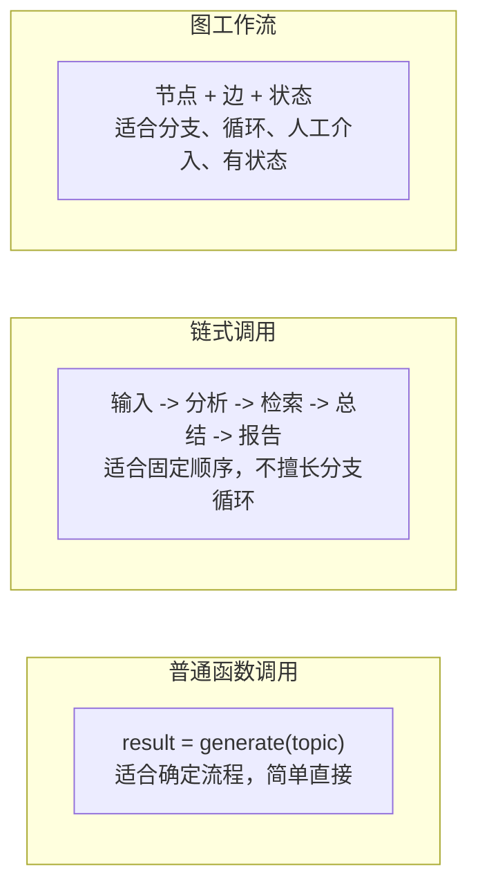
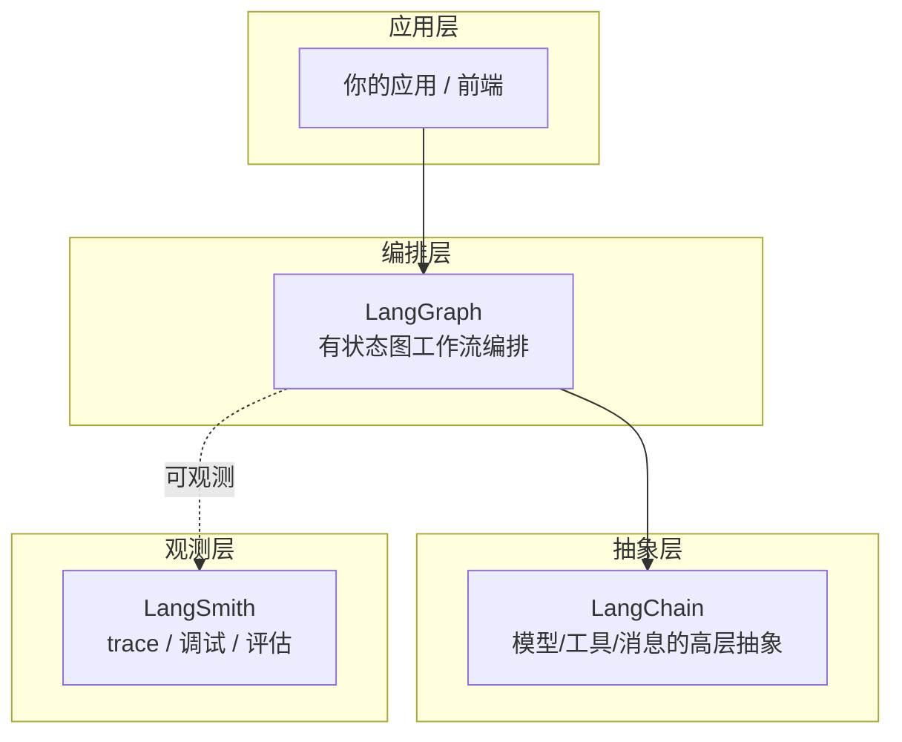
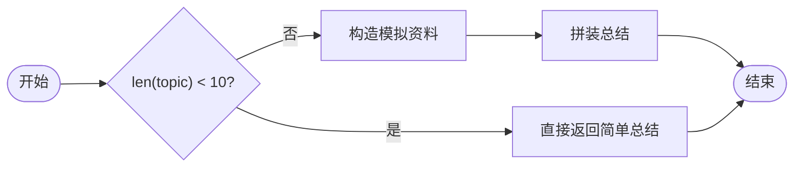
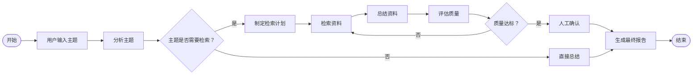

# 01. LangGraph 是什么

> 版本说明：本教程基于 **Python 3.13 + LangGraph 1.x**。本章不写 LangGraph 代码，只建立心智模型。

## 本章导读

很多 Agent 示例看起来只是"调用一次大模型"。真实业务不是这样：它会有**状态、分支、循环、人工审批、失败重试和中间结果展示**。

这一章回答三个问题：

1. Agent 工作流为什么需要"图"这种表达方式？
2. LangGraph 在整个 AI 工程栈里处于什么位置？
3. 什么场景该用 LangGraph，什么场景用普通函数 / 任务队列就够？

学完这一章，你会有一个清晰的选型判断力——这也是后面 14 章所有代码的出发点。本章不涉及代码文件，配套代码从第 02 章开始。

---

## 本章目标

- 理解 Agent 工作流为什么需要图结构。
- 区分普通函数调用、链式调用和图工作流。
- 理解 LangGraph 与 LangChain、LangSmith 的关系。
- 掌握"什么时候该用 LangGraph"的判断标准。
- 看懂贯穿项目"资料检索与总结 Agent"的第一版流程。

---

## 为什么需要这一章

先看一个反例。假设你要做一个"资料检索与总结 Agent"，第一版代码可能长这样：

```python
def research(topic: str) -> str:
    questions = analyze_topic(topic)      # 1. 拆解主题
    if len(questions) == 0:
        return "主题无效"
    docs = search_documents(questions)    # 2. 检索资料
    summary = summarize(docs)             # 3. 总结
    while quality(summary) < 80:          # 4. 质量不够就再来一轮
        docs += search_more(summary)
        summary = summarize(docs)
    approved = human_approve(summary)     # 5. 人工确认
    if not approved:
        summary = revise(summary)
    return report(summary)                # 6. 生成报告
```

这段代码能跑，但它把所有事情揉在一起：

- **流程不可见**：哪个分支在前、循环条件是什么，要靠人脑推演。
- **不可暂停**：人工确认是同步调用，一次执行必须一口气跑完。
- **不可恢复**：跑到一半崩了，全部重来。
- **不可观察**：中间状态只存在于局部变量里，无法给前端展示进度。

LangGraph 的思路是把这段代码里的"做什么"和"下一步做什么"拆开：

- **做什么** → 拆成节点（Node），比如 `analyze_topic`、`search_documents`。
- **下一步做什么** → 拆成边（Edge），比如"质量不够回到检索"。
- **传递的数据** → 放进统一的状态（State）。

这样流程变成一张**显式的图**，机器能检查它、暂停它、恢复它、流式输出它。这就是后续所有章节要做的。

---

## 核心概念

### 为什么是"图"，不是普通函数

先给三种表达方式的定位：



**普通函数调用**适合确定流程：

```python
result = generate_report(topic)
```

简单、直接。但一旦流程里出现"如果资料不够就继续检索""生成前需要人工确认"，代码会迅速退化成上面那种堆 `if`、`while` 和状态变量的怪物。

**链式调用**适合固定顺序：

```text
输入主题 -> 分析主题 -> 检索资料 -> 生成总结 -> 输出报告
```

比单个函数清晰，但仍然是线性管线，无法表达"质量不达标就回头再搜一次"这种回路。

**图工作流**适合有条件、有循环、有状态的流程：

```text
开始
  -> 分析主题
  -> 是否需要检索？
      -> 否：直接总结
      -> 是：检索资料 -> 总结资料 -> 评估质量
  -> 质量是否达标？
      -> 否：补充检索
      -> 是：人工确认 -> 最终报告
结束
```

这就是 LangGraph 的典型使用场景。它本质上是把一个流程**显式地描述成节点和有向边**。

### 图工作流 vs 状态机 vs 工作流引擎

你可能熟悉服务端的状态机和工作流引擎（如 Camunda、Temporal、Airflow），它们和 LangGraph 是什么关系？

| 对比维度 | 状态机 | 工作流引擎 | LangGraph |
|---|---|---|---|
| 核心模型 | 状态 + 状态转移 | 流程定义 + 任务 | 状态图 + 节点 + 边 |
| 状态表达 | 枚举状态 | 流程实例变量 | 任意 `TypedDict` / Pydantic 结构 |
| 分支 | 条件转移 | BPMN 网关 | 条件边 + 路由函数 |
| 循环 | 需要状态回环 | 任务重复 | 边指回旧节点（原生支持） |
| 与 LLM 集成 | 无 | 需要自建 | 原生支持（工具、消息、结构化输出） |
| 轻量程度 | 轻 | 重，需部署引擎 | 轻量 Python 库 |

结论：LangGraph 更像是**为 Agent 场景设计的一个轻量状态图运行时**。它借鉴了状态机和工作流引擎的思路，但针对"LLM 输出的不确定性、需要人工介入、需要持久化恢复"做了专门设计。

### LangGraph / LangChain / LangSmith：三者的边界

很多初学者把这三个概念混在一起。它们是同一生态里的三层：



| 组件 | 定位 | 什么时候接触 |
|---|---|---|
| **LangChain** | Agent 高层开发框架，核心入口是 `create_agent` | 入门阶段可以先跳过 |
| **LangGraph** | 底层编排框架 & Agent Runtime，负责有状态、可持久化、可精细控制的执行 | **本教程主线** |
| **LangSmith** | 观测平台：trace、调试、评估 | 第 13 章 |

一句话：**LangChain 提供好用的高层封装，LangGraph 提供可靠的底层执行能力，LangSmith 负责让你看得见执行过程。**

### 什么时候该用 LangGraph：决策表

| 场景 | 用普通函数 | 用任务队列/工作流引擎 | 用 LangGraph |
|---|---|---|---|
| 单次 LLM 调用，无分支 | ✅ | — | 过度设计 |
| 固定顺序的链式处理 | ✅ | 可选 | 过度设计 |
| 有分支、循环的 Agent 流程 | ❌ 会堆成面条代码 | 需要自建 Agent 集成 | ✅ |
| 需要人工确认/介入 | ❌ | 可行但重 | ✅ 原生支持 |
| 需要暂停后恢复（长任务） | ❌ | ✅ | ✅ 原生支持 |
| 需要流式展示节点进度 | ❌ | 依赖引擎 | ✅ 原生支持 |
| 团队已有成熟工作流引擎 | 不冲突 | ✅ 继续用 | 可以作为引擎内的一步 |

判断口诀：**流程里有"回路"或"人"，优先考虑 LangGraph；纯线性的确定流程，普通函数就够。**

---

## 最小代码示例

这一章不写 LangGraph 代码，先用普通 Python 把贯穿项目的第一版流程描述出来，为第 03 章做铺垫：

```python
def run_research_agent(topic: str) -> str:
    if len(topic) < 10:
        return f"主题较简单，直接生成总结：{topic}"

    documents = ["模拟资料 A", "模拟资料 B"]
    summary = f"基于 {len(documents)} 份资料生成总结：{topic}"
    return summary


if __name__ == "__main__":
    print(run_research_agent("LangGraph 适合做什么"))
```

```powershell
python 01_basic_flow.py
```

预期输出：

```text
基于 2 份资料生成总结：LangGraph 适合做什么
```

这段代码能跑，但注意：**它把分支和流程都藏在了 `if` 里**。第 03 章开始，你会看到同一个流程用图表达后的样子。

---

## 执行过程拆解

用输入 `"LangGraph 适合做什么"`（15 个字符）追踪一次执行：

**第 1 步：入口调用**

`run_research_agent("LangGraph 适合做什么")` 进入函数。

**第 2 步：分支判断**

`len("LangGraph 适合做什么")` 为 15，`15 < 10` 为 False，**跳过**"主题较简单"分支。

**第 3 步：模拟检索**

构造 2 份模拟资料，拼出总结字符串并返回。

**反例验证**：如果输入 `"短"`（1 个字符），`1 < 10` 为 True，函数直接返回"主题较简单，直接生成总结：短"——**不执行检索和总结逻辑**。

这就是普通函数里的"隐形流程"：



对比记忆：这个 `if` 判断，就是第 06 章 `analyze_topic` + 路由函数要表达的东西——只是这里藏在了函数体里，而 LangGraph 会把它们**显式画成节点和边**。

---

## 从流程到图的映射

理解"业务流程"如何映射成"图"，是本章最重要的实操技能。三步走：

**第 1 步：列出业务步骤**

```text
分析主题 -> 检索资料 -> 总结资料 -> 评估质量 -> 生成报告
```

**第 2 步：标出分支和循环**

```text
分析主题
  -> 主题简单？是：直接总结
  -> 主题复杂？否：检索资料
评估质量
  -> 达标？是：生成报告
  -> 不达标？否：回到检索资料   <- 循环
```

**第 3 步：翻译成图的语言**

| 业务流程元素 | 图的表达 | 对应概念 |
|---|---|---|
| 一个业务步骤 | 一个节点 | Node |
| 固定顺序 | 一条边 | Edge |
| 根据数据做选择 | 条件边 | conditional edge |
| 需要回退重做 | 边指回旧节点 | 循环 |
| 步骤间传递的数据 | 共享状态 | State |

这张表就是整本教程的**总地图**。后续每章都在填充它的某个格子。

---

## 贯穿项目改造

本教程贯穿项目：**资料检索与总结 Agent**。

用户输入一个研究主题，系统完成任务拆解、资料检索、内容整理、质量检查、人工确认和最终报告生成。

第一版完整流程：



先记住三个问题，后续章节围绕它们展开：

- **哪些步骤是明确顺序？** → 普通边（第 06 章）。
- **哪些步骤需要条件判断？** → 条件边（第 06 章）。
- **哪些步骤可能循环？** → 循环控制 + `recursion_limit`（第 09 章）。

---

## 代码运行方式

本章示例保存为 `01_basic_flow.py`（仅作演示，不在 `code/` 目录下，第 02 章起才有正式代码）：

```powershell
python 01_basic_flow.py
```

预期输出：

```text
基于 2 份资料生成总结：LangGraph 适合做什么
```

---

## 调试与排查

本章没有 LangGraph 代码，最大的"坑"不在运行时报错，而在**选型错误**。下面三个排查场景帮助建立判断力。

### 场景一：我在做一个 Agent，但不知道要不要用 LangGraph

自查三个问题：

1. 流程里有没有**循环**（如"质量不够再来一轮"）？
2. 流程里有没有**人**（审批、修改、确认）？
3. 用户需不需要**看到中间状态**（进度、暂停、恢复）？

三个全是"否" → 普通函数就够。任何一个"是" → 值得用 LangGraph。

### 场景二：我已经用了 LangChain 的 `create_agent`，还需要 LangGraph 吗？

不需要二选一。LangChain 1.x 的 `create_agent` 底层就是基于 LangGraph 实现的。从 `create_agent` 开始，遇到"需要精细控制节点、条件分支、长时间运行"时，再下沉到 LangGraph 直接写图。

### 场景三：团队有 Temporal / Camunda，要引入 LangGraph 吗？

不必替换。LangGraph 可以嵌在既有工作流引擎中作为一个任务步骤。先用决策表判断，不要为了"新技术"引入重复的编排层。

---

## 常见错误

| 错误认知 | 纠正 |
|---|---|
| "LangGraph 是大模型调用库" | 它是**有状态流程编排库**，LLM 只是节点里可以调用的一种能力 |
| "只要是 Agent 就必须用 LangGraph" | 单次调用、固定链式流程，普通函数更合适 |
| "用 LangGraph 替代所有业务系统" | 数据库、权限、队列、日志仍然要按普通工程方式设计 |
| "先学 LangChain 才能学 LangGraph" | 两者是并列的编排层，可以从 LangGraph 直接开始 |
| "LangSmith 必须装" | 它是观测平台，入门阶段可以先不接，第 13 章再引入 |
| "图工作流很复杂，不如用代码硬写" | 复杂流程用 `if/while` 硬写，正是可维护性崩塌的开始 |

---

## 练习任务

**必做 1：画出你熟悉的一个业务流程**

选一个你实际做过或见过的服务端业务流程，画出它的流程图，标出：

- 哪些步骤是固定顺序？
- 哪些步骤是条件分支？
- 哪些步骤是循环？

自查：你能把这张图翻译成"节点 + 边 + 状态"三列吗？（对应"从流程到图的映射"）

**必做 2：判断选型**

用本章决策表，判断你画出的流程：该用普通函数、工作流引擎，还是 LangGraph？

自查：你的结论能说出至少两条理由，且能反驳一个反面选项。

**扩展练习：对比三种写法**

把 `run_research_agent()` 改写成"链式调用"版本，让两个函数显式串联。对比它与原版的差异，思考：如果再加一个"质量不达标循环"，哪种写法会先失控？

---

## 本章小结

- Agent 工作流需要图结构，是因为真实流程有**分支、循环、人工介入、长任务恢复**。
- LangGraph 是**面向 Agent 场景的轻量状态图运行时**，不是大模型调用库。
- 生态定位：LangChain = 高层封装，LangGraph = 底层编排，LangSmith = 观测。
- 选型口诀：**流程里有"回路"或"人"，优先考虑 LangGraph**。
- 贯穿项目"资料检索与总结 Agent"的第一版流程已经画好，三个问题（顺序/分支/循环）是后续 14 章的线索。

下一章补齐运行本教程所需的 Python 最小基础——特别是 `TypedDict` 和类型标注，它们是后面定义 `State` 的直接工具。

---

## 本章速查

**概念一句话定义**

| 概念 | 定义 |
|---|---|
| 普通函数调用 | 确定流程的直接调用 |
| 链式调用 | 固定顺序的线性管线 |
| 图工作流 | 节点 + 边 + 状态，显式表达分支、循环、人工介入 |
| LangGraph | 面向有状态、长时间运行 Agent 的底层编排框架 |
| LangChain | Agent 高层开发框架（`create_agent`） |
| LangSmith | trace / 调试 / 评估的观测平台 |

**本章核心结论**

- 判断标准：流程里有"回路"或"人"，用 LangGraph。
- 三个待答问题：哪些是顺序？哪些是分支？哪些是循环？

**加深阅读**

- 系统笔记：`LangGraph-笔记/01-LangGraph基础入门.md` 的「1.0 LangGraph 和 LangChain 的版本迭代及定位」与「1.1 构成图的基本要素」
- 官方文档：[LangGraph 概览](https://docs.langchain.com/oss/python/langgraph/overview)
