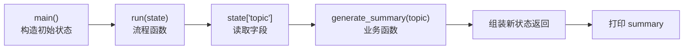

# 02. Python 最小基础

> 版本说明：本教程基于 **Python 3.13**。建议使用虚拟环境管理依赖（见下文 3.x 节）。

## 本章导读

你有服务端和前端经验，所以不需要从"变量是什么"开始学。但 LangGraph 示例会大量使用 Python 的**字典、类型标注、`TypedDict`、模块导入和虚拟环境**——这些基础不牢，后面看 `StateGraph` 会寸步难行。

本章只讲"本教程马上要用"的 Python，一个字都不多讲。

学完这一章，你将得到：

- 一个能运行的最小 Python 项目（`code/step_by_step/02_basic_function.py`）。
- 一份贯穿项目初始状态的定义（`ResearchState`）。
- 一条清晰的依赖管理路径（venv + pip，可选 uv）。

涉及代码：`code/step_by_step/02_basic_function.py`

---

## 本章目标

- 创建一个最小 Python 项目并理解文件 / 模块 / 入口。
- 掌握本教程用到的类型：`str`、`int`、`list`、`dict`、`TypedDict`。
- 理解类型标注的原理（标注不约束运行时）。
- 在 `TypedDict`、`dataclass`、`Pydantic BaseModel` 之间做对选择。
- 用 venv 创建虚拟环境，用 `.env` 管理配置。
- 区分同步函数和异步函数的最低必要概念。

---

## 为什么需要这一章

第 01 章我们把流程画成了图，但图是要用 Python 写的。写图之前有四个现实障碍：

1. **`TypedDict` 是什么？** 不搞清楚，`StateGraph(ResearchState)` 第一行就卡住。
2. **类型标注是运行期的还是编译期的？** 不理解这一点，你会被"为什么标注了 `str` 还能传 `int`"这类问题困扰。
3. **包和模块怎么管理？** 装了一堆依赖，换个项目全冲突，必须用虚拟环境隔离。
4. **同步和异步什么时候用？** LangGraph 的节点可以是 `async def`，不理解基本区别，后面会莫名其妙。

本章逐个解决。每个概念只讲"理解它需要的最小知识"。

---

## 核心概念

### 文件、模块和入口

一个 `.py` 文件就是一个模块。直接运行一个文件时，常见入口写法：

```python
def main() -> None:
    print("hello")


if __name__ == "__main__":
    main()
```

- `main()`：入口函数，类似服务端里的启动入口。
- `if __name__ == "__main__"`：只有当**这个文件被直接运行**时才执行。如果被别的文件 `import`，这段不会跑。

这是 Python 社区约定，后面所有示例代码都用这个结构。

### 基本类型与字典

本教程用到的类型极少：

```python
name: str = "LangGraph"          # 字符串
count: int = 3                   # 整数
ok: bool = True                  # 布尔
tags: list[str] = ["图", "状态"]  # 字符串列表
state: dict[str, object] = {     # 字典：键是 str，值是任意类型
    "topic": "LangGraph",
    "documents": [],
}
```

其中 **`dict` 是 LangGraph 状态的核心载体**。节点的输入输出都是字典或其子类型。

> 服务端 / 前端开发者对照：Python 的 `dict` ≈ JSON 对象 ≈ 前端的 object。键必须是字符串（或可哈希对象），值是任意类型，可以嵌套。

### 类型标注：提示，不是约束

```python
def summarize(topic: str) -> str:
    return f"主题总结：{topic}"

summarize(123)   # 不会报错！标注不约束运行时
```

**关键原理**：Python 的类型标注是**给人和工具看**的，运行时不做强制校验。好处是：

- 编辑器 / IDE 给出补全和静态检查。
- 读者一眼看出函数契约（输入输出）。
- 大型重构时工具能帮忙找出类型错误。

代价是：**不要相信标注会保护你**。运行时该写防御逻辑还是得写（第 08 章处理 LLM 返回值时会再碰到）。

### 描述"字典结构"的三兄弟

定义带结构的字典，Python 生态有三种主流方式：

```python
from typing import TypedDict
from dataclasses import dataclass
from pydantic import BaseModel


# 1. TypedDict：给 dict 加类型描述，运行期仍是一个普通 dict
class StateTD(TypedDict):
    topic: str
    summary: str

# 2. dataclass：更接近"类"，带字段、可继承、可自动生成方法
@dataclass
class StateDC:
    topic: str
    summary: str

# 3. Pydantic BaseModel：校验 + 序列化 + 默认值
class StatePM(BaseModel):
    topic: str
    summary: str = ""
```

三者的选择：

| 对比维度 | TypedDict | dataclass | Pydantic BaseModel |
|---|---|---|---|
| 运行期是 | 普通 dict | 类的实例 | 类的实例 |
| 运行时校验 | 无 | 无 | **有**（类型/必填） |
| 默认值 | 不支持（需 `NotRequired` 技巧） | 支持 | 支持 |
| 序列化 JSON | 天然是 dict | 需 `asdict` | 内置 |
| 依赖 | 标准库 `typing` | 标准库 | 第三方包 |
| 适合场景 | **LangGraph State 入门首选** | 通用数据结构 | 外部输入校验、LLM 结构化输出 |

LangGraph 的 `StateGraph` 三种都支持。**本教程入门阶段全部使用 `TypedDict`**，原因：

- 状态本质是 dict，`TypedDict` 零额外依赖。
- 入门阶段不需要运行期校验。
- 第 08 章做 LLM 结构化输出时，会引入 Pydantic。

### 虚拟环境与依赖管理

Python 依赖是"全局共享"的，不同项目依赖不同版本会互相冲突。虚拟环境 = 每个项目一个隔离的 Python 空间。

**venv（官方内置，推荐起步）：**

```powershell
python -m venv .venv          # 创建虚拟环境
.\.venv\Scripts\Activate.ps1  # Windows 激活（cmd 用 .bat）
# macOS / Linux：source .venv/bin/activate
```

激活后终端提示符前会出现 `(.venv)`，之后 `pip install` 装的包只属于当前项目。

**pip + requirements.txt：**

```powershell
pip install -r requirements.txt    # 按清单安装
pip freeze > requirements.txt      # 导出当前环境的包清单
```

**uv（可选，更快）：** `uv` 是新一代包管理器，速度远超 pip，语法兼容：

```powershell
pip install uv
uv venv .venv
uv pip install -r requirements.txt
```

| 对比维度 | venv + pip | uv |
|---|---|---|
| 内置 | Python 自带 | 需额外安装 |
| 安装速度 | 慢 | 极快 |
| 学习成本 | 低 | 低（命令几乎兼容） |
| 建议 | 入门先用 | 后续可切换 |

### `.env` 与环境变量

API Key、模型配置不能硬编码进代码，放环境变量：

```properties
# .env 文件（不要提交到 Git）
DEEPSEEK_API_KEY=sk-xxxxxxxx
OPENAI_MODEL=gpt-4o-mini
```

代码中加载：

```python
from dotenv import load_dotenv
import os

load_dotenv()                          # 读取 .env 到环境变量
key = os.getenv("DEEPSEEK_API_KEY")    # 读取
```

仓库里提交 `.env.example`（占位模板），真实 `.env` 加入 `.gitignore`。这是所有真实项目的配置惯例。

### 同步 vs 异步：最低必要概念

```python
def run_sync(state):      # 同步函数
    return {"ok": True}

async def run_async(state):   # 异步函数
    await asyncio.sleep(0.1)
    return {"ok": True}
```

- 同步函数：调用时阻塞，直到返回。
- 异步函数（`async def`）：可以 `await` 等待 IO（网络请求、数据库），不阻塞线程。

LangGraph 的节点两者都支持，图调用对应 `invoke()`（同步）和 `ainvoke()`（异步）。入门阶段**先全部用同步**，第 05 章会专门讲 async 节点。

---

## 最小代码示例

创建 `code/step_by_step/02_basic_function.py`：

```python
from typing import TypedDict


class ResearchState(TypedDict):
    topic: str
    summary: str


def generate_summary(topic: str) -> str:
    return f"这是关于《{topic}》的入门总结。"


def run(state: ResearchState) -> ResearchState:
    summary = generate_summary(state["topic"])
    return {
        "topic": state["topic"],
        "summary": summary,
    }


def main() -> None:
    initial_state: ResearchState = {
        "topic": "LangGraph 适合做什么",
        "summary": "",
    }
    result = run(initial_state)
    print(result["summary"])


if __name__ == "__main__":
    main()
```

```powershell
cd code/step_by_step
python 02_basic_function.py
```

预期输出：

```text
这是关于《LangGraph 适合做什么》的入门总结。
```

---

## 执行过程拆解

逐行看这个程序做了什么：

1. `ResearchState` 用 `TypedDict` 声明状态结构：`topic` 和 `summary` 两个字符串字段。
2. `generate_summary(topic)` 是**业务函数**：只接收普通字符串，不知道任何状态概念。
3. `run(state)` 是**流程函数**：读取 `state["topic"]`，调用业务函数，组装新状态返回。
4. `main()` 构造初始状态，调用 `run()`，打印 `summary`。
5. `if __name__ == "__main__"` 保证直接运行才执行。

状态流转：

| 阶段 | state |
|---|---|
| 构造时 | `{"topic": "LangGraph 适合做什么", "summary": ""}` |
| `run()` 读取 | `state["topic"]` → 传给 `generate_summary` |
| `run()` 返回 | `{"topic": "...", "summary": "这是关于...总结。"}` |
| 打印 | 输出 `summary` 字段 |

**本章最重要的是记住业务函数和流程函数的边界**：`generate_summary` 只做一件事（拼字符串），`run` 负责调度。第 03 章你会看到，这个边界正是 LangGraph 节点与普通函数的对接点。

这段调度的调用链：



第 03 章的核心转换，就是把 `run(state)` 这个"调度角色"替换成 LangGraph 的图结构——`generate_summary` 变成节点，调度交给边。

---

## 贯穿项目改造

这一章先不用 LangGraph，只建立贯穿项目的**初始数据模型**：

```python
class ResearchState(TypedDict):
    topic: str
    summary: str
```

后续章节会逐步增加字段：

```text
第 02 章：topic, summary
第 04 章：+ questions, documents, quality_score
第 09 章：+ iteration_count, max_iterations
第 11 章：+ draft_report, final_report
```

每次加字段都是因为**下一个节点需要它**——这就是第 04 章讲的 State 设计原则。

---

## 代码运行方式

**首次运行需要先建环境（推荐）：**

```powershell
cd code/step_by_step
python -m venv .venv
.\.venv\Scripts\Activate.ps1          # Windows
pip install langgraph                  # 本教程核心依赖
python 02_basic_function.py
```

**只验证本文件**（无第三方依赖，直接跑）：

```powershell
python 02_basic_function.py
```

预期输出：

```text
这是关于《LangGraph 适合做什么》的入门总结。
```

---

## 调试与排查

### 场景一：`ModuleNotFoundError`

```text
ModuleNotFoundError: No module named 'langgraph'
```

**原因**：包没有安装，或者激活了错误的虚拟环境（最常见的是**忘激活**）。

**排查**：

```powershell
pip show langgraph        # 有输出 = 已安装
where python              # 确认当前用的是哪个解释器（应在项目 .venv 下）
```

### 场景二：中文乱码

终端输出 `é这是` 之类乱码。

**原因**：文件编码与终端不一致。Python 3 源文件默认 UTF-8，问题通常在 Windows 终端代码页。

**排查**：在 PyCharm 中把 File Encoding 设为 UTF-8；Windows 终端执行 `chcp 65001`；确保 `print` 的是中文字符串而不是字节。

### 场景三：`KeyError`

```text
KeyError: 'summary'
```

**原因**：读取了字典里不存在的键。

**排查**：检查 `run()` 里读的键名与构造的 `initial_state` 是否一致。`TypedDict` 不会自动补缺失字段（第 04 章会深入验证这一点）。

### 场景四：`import` 导入失败

```text
ImportError: attempted relative import with no known parent package
```

**原因**：用了相对导入（`from . import xx`）但在顶层直接运行脚本。

**排查**：本教程前 6 章全部用单文件 + 绝对导入；进入项目结构（第 07 章起）后统一用 `python -m app.xxx` 方式运行。

---

## 常见错误

| 现象 | 原因 | 解决 |
|---|---|---|
| `ModuleNotFoundError` | 依赖未装 / 环境未激活 | 见"调试与排查-场景一" |
| 标注了 `str` 却能传 `int` | 类型标注不约束运行时 | 这是特性，交给 IDE 静态检查 |
| 用 `dataclass` 当 State | 不理解三者差异 | 入门统一用 `TypedDict` |
| 忘记加 `if __name__ == "__main__"` | 被 import 时也执行了副作用 | 养成加入口判断的习惯 |
| `.env` 读取不到值 | 文件不在当前工作目录 / 没调 `load_dotenv()` | 确认工作目录和 `load_dotenv()` 调用位置 |
| 误删了 `.venv` | 环境放项目内被清理 | 重建：`python -m venv .venv` + 重新 `pip install` |

---

## 练习任务

**必做 1：扩展状态**

给 `ResearchState` 增加 `documents: list[str]` 字段，并在 `run()` 中返回它：

```python
return {
    "topic": state["topic"],
    "summary": summary,
    "documents": ["模拟资料 A", "模拟资料 B"],
}
```

自查：输出里 `summary` 正常，且 `result` 中能看到 `documents` 列表。

**必做 2：从命令行读输入**

用 `input()` 读取主题，替代硬编码：

```python
topic = input("请输入研究主题：")
```

自查：程序可以交互式运行，输入不同主题得到不同总结。

**扩展练习：切换成 Pydantic**

安装 `pydantic`，把 `ResearchState` 改用 `BaseModel` 定义，体会默认值的便利：

```python
from pydantic import BaseModel

class ResearchState(BaseModel):
    topic: str
    summary: str = ""      # 有默认值，不需要手动传
```

自查：用 `ResearchState(topic="LangGraph")` 也能运行，`summary` 自动是 `""`。对比第 04 章 `TypedDict` 必须手动传全字段的差异。

---

## 本章小结

- 文件 / 模块 / 入口：`if __name__ == "__main__"` 是 Python 约定。
- 类型标注是提示不是约束：标注给人和工具看。
- 状态定义三选一：**入门用 `TypedDict`**，外部校验用 Pydantic。
- 环境隔离：venv + pip，习惯后可以换 uv。
- 配置管理：`.env` + `load_dotenv()`，仓库只提交 `.env.example`。
- 同步 / 异步：入门先同步，第 05 章再讲 async 节点。

下一章把 `run(state)` 包装成 LangGraph 的第一个图——你已经具备全部前置知识了。

---

## 本章速查

**语法速查**

| 语法 | 作用 | 示例 |
|---|---|---|
| `def f(x: int) -> str` | 定义函数 + 类型标注 | `def summarize(topic: str) -> str` |
| `TypedDict` | 描述字典结构 | `class ResearchState(TypedDict): topic: str` |
| `if __name__ == "__main__"` | 仅直接运行时执行 | 入口约定 |
| `os.getenv("KEY")` | 读环境变量 | `os.getenv("DEEPSEEK_API_KEY")` |
| `async def` / `await` | 异步函数 | 第 05 章展开 |

**加深阅读**

- notebook：`langgraph/chapter01/02_dataclass.ipynb`、`03_pydantic.ipynb`（状态定义的另外两种方式）
- 官方文档：[Python venv 文档](https://docs.python.org/3/library/venv.html)、[LangGraph State 定义](https://docs.langchain.com/oss/python/langgraph/state)
