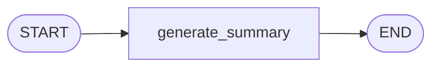
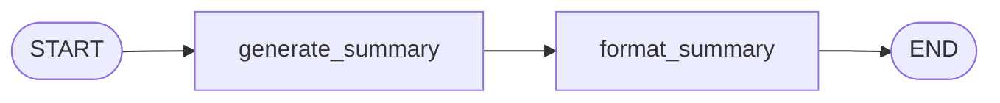

# 03. 第一个 LangGraph Hello World

> 版本说明：本教程示例基于 **Python 3.10+，推荐 3.13；LangGraph 1.x**。可用 `pip show langgraph` 确认版本。

## 本章导读

上一章（02）我们用普通 Python 函数实现了一个"输入主题 → 输出总结"的流程。它跑得通，但流程顺序藏在函数体里，你只能靠阅读代码"脑补"执行过程。

这一章，我们把它改造成 LangGraph 的第一个图：**一个节点、两条边、一份状态**。

学完这一章，你将得到：

- 一个能运行的最小 LangGraph 程序（`code/step_by_step/03_first_graph.py`）。
- 对 **"节点做事、边决定顺序、状态传数据"** 的第一次直观体验。
- 后续所有章节的脚手架——后面讲 State、Node、Edge 的深化，都建立在本章这 6 行核心代码之上。

涉及代码：`code/step_by_step/03_first_graph.py`

---

## 本章目标

- 安装并导入 LangGraph。
- 用 `StateGraph` 创建一个最小图。
- 定义一个节点，并用 `add_edge` 连接 `START` 和 `END`。
- 用 `invoke()` 执行图并读取结果。
- 能说清楚"为什么 LangGraph 要把流程显式画出来"。

---

## 为什么需要这一章

回看第 02 章的普通函数版本：

```python
def run(state: ResearchState) -> ResearchState:
    summary = generate_summary(state["topic"])
    return {
        "topic": state["topic"],
        "summary": summary,
    }
```

它有两个问题：

1. **流程顺序靠嵌套表达**：如果以后要"先检索再总结""质量不够再总结一次"，这个函数会被不断堆 `if` / `while`，流程结构越来越难读。
2. **没有中间状态**：函数一执行到底，中途无法观察、无法暂停、无法恢复。

LangGraph 的思路是把 **"做什么"（Node）** 和 **"下一步做什么"（Edge）** 拆开。流程结构变成显式的图，机器可以检查它、暂停它、恢复它——这些能力会在第 09、10、11 章逐步释放。

---

## 核心概念

### 一次图调用 = 一次有状态的业务流程

用你熟悉的服务端概念类比：

| LangGraph 概念 | 服务端类比 |
|---|---|
| `graph.invoke()` | 发起一次业务流程 |
| `State` | 这次流程的上下文对象 / DTO |
| `Node`（节点） | 一个 service 方法 |
| `Edge`（边） | 流程编排 / 路由规则 |

一次 `invoke()`，就是一次完整的流程执行。

### StateGraph：构建图的入口

`StateGraph` 是 LangGraph 构建有状态图的主要类。创建时需要告诉它**状态结构**：

```python
builder = StateGraph(ResearchState)
```

这里 `ResearchState` 是一个 `TypedDict`（带字段描述的字典，类似 TypeScript 的 `interface`）。它定义了这个图执行过程中所有节点共享的数据结构。

### 节点（Node）：一个普通 Python 函数

节点就是函数。它接收当前状态，返回要更新的字段：

```python
def generate_summary(state: ResearchState) -> dict[str, str]:
    return {"summary": f"...{state['topic']}..."}
```

注意两点：

- 参数 `state` 是**当前完整状态**，节点可以读任意字段。
- 返回值是**局部更新**，LangGraph 会帮你合并回状态，不需要你手动返回整个字典。

> **为什么可以只返回 `{"summary": ...}` 而不用管 `topic`？** 想象一个服务端函数只更新 `user.name`，不需要把整个 user 对象重发一遍——LangGraph 的"合并"就是同样语义：返回值里出现哪个键，就更新哪个键；没出现的键保持原值。第 04 章会专门讲这个合并机制（还有更复杂的"追加"合并策略）。

### 边（Edge）：定义执行顺序

```python
builder.add_edge(START, "generate_summary")
builder.add_edge("generate_summary", END)
```

`add_edge(from, to)` 表示"from 执行完，下一步执行 to"。本章只用到固定顺序边；条件边在第 06 章。

### START 与 END：虚拟边界

`START` 是图的虚拟起点，`END` 是虚拟终点。它们不是业务节点，只用于标记"图从哪开始、到哪结束"。LangGraph 运行时靠它们确定执行边界。

### 编译与执行

```python
graph = builder.compile()   # 编译：结构检查 + 生成可执行对象
result = graph.invoke(...)  # 执行：运行一次完整流程
```

`compile()` 会校验图结构（节点是否存在、边两端是否有效），校验通过后返回可调用对象。

### 对比：普通函数 vs StateGraph

| 对比维度 | 普通函数 | StateGraph |
|---|---|---|
| 流程表达 | 嵌套调用 / if / while | 显式的节点和边 |
| 状态管理 | 函数参数 / 局部变量 | 统一 `State`，节点间共享 |
| 新增一个步骤 | 修改函数体 | 加一个节点 + 一条边 |
| 中间状态可观察 | 否 | 是（后续章节流式输出） |
| 可暂停 / 恢复 | 否 | 是（第 10、11 章） |

---

## 最小代码示例

安装依赖：

```powershell
pip install langgraph
```

创建文件 `code/step_by_step/03_first_graph.py`：

```python
from typing import TypedDict

from langgraph.graph import END, START, StateGraph


class ResearchState(TypedDict):
    topic: str
    summary: str


def generate_summary(state: ResearchState) -> dict[str, str]:
    return {
        "summary": f"这是关于《{state['topic']}》的 LangGraph 入门总结。"
    }


builder = StateGraph(ResearchState)
builder.add_node("generate_summary", generate_summary)
builder.add_edge(START, "generate_summary")
builder.add_edge("generate_summary", END)

graph = builder.compile()


if __name__ == "__main__":
    result = graph.invoke({
        "topic": "LangGraph 适合做什么",
        "summary": "",
    })
    print(result)
```

整个程序分为四步：

1. 用 `TypedDict` 定义状态结构（`topic` + `summary`）。
2. 定义节点函数 `generate_summary`。
3. 构建图：`StateGraph` → `add_node` → `add_edge`。
4. 编译并执行：`compile()` → `invoke()`。

### 逐行注释版（第一次接触 LangGraph，先看这版）

```python
# 1. 导入：从 typing 引入"带字段描述的字典"工具
from typing import TypedDict

# 2. 导入 LangGraph 的三个核心符号：
#    StateGraph  构建图的类
#    START       图的虚拟起点
#    END         图的虚拟终点
from langgraph.graph import END, START, StateGraph


# 3. 定义状态结构：告诉图"整个流程共享哪些数据"
class ResearchState(TypedDict):
    topic: str       # 输入：用户给的主题
    summary: str     # 输出：节点写回的总结


# 4. 定义节点函数（业务步骤）：
#    参数 state = 当前完整状态，可以读任意字段
#    返回值 = 要更新的字段（"局部更新"）
def generate_summary(state: ResearchState) -> dict[str, str]:
    return {
        "summary": f"这是关于《{state['topic']}》的 LangGraph 入门总结。"
    }


# 5. 创建图构建器，绑定状态结构
builder = StateGraph(ResearchState)

# 6. 注册节点：给节点起个名字（字符串），关联业务函数
builder.add_node("generate_summary", generate_summary)

# 7. 连接边：从虚拟起点进入节点
builder.add_edge(START, "generate_summary")

# 8. 连接边：节点执行完走向虚拟终点
builder.add_edge("generate_summary", END)

# 9. 编译：检查图结构是否合法，生成可执行对象
graph = builder.compile()


# 10. 入口：直接运行本文件时才执行
if __name__ == "__main__":
    # 11. 执行图：传入初始状态，返回最终完整状态
    result = graph.invoke({
        "topic": "LangGraph 适合做什么",
        "summary": "",
    })
    # 12. 打印结果（会看到输入字段和输出字段都在）
    print(result)
```

对照上面 12 步，回头再看"整个程序分为四步"就很清楚了：**1-4 是"定义"，5-8 是"构建"，9 是"编译"，10-12 是"执行"**。

---

## 执行过程拆解

`graph.invoke({...})` 内部发生了什么？逐步看：

**第 1 步：注入初始状态**

`invoke` 传入的字典成为初始状态：

```python
state = {"topic": "LangGraph 适合做什么", "summary": ""}
```

**第 2 步：从 START 出发**

运行时从虚拟起点出发，沿边找到下一个节点 `generate_summary`。

**第 3 步：执行节点**

节点读取当前状态并返回局部更新：

```python
# 节点内部
state["topic"]                          # -> "LangGraph 适合做什么"
# 返回
{"summary": "这是关于《LangGraph 适合做什么》的 LangGraph 入门总结。"}
```

**第 4 步：合并状态**

LangGraph 把节点返回值合并回状态：`summary` 被覆盖成新值，`topic` 保持不变。

**第 5 步：到达 END**

从 `generate_summary` 出发，沿边到 `END`，图执行结束。

**第 6 步：返回最终状态**

`invoke()` 返回完整最终状态：

```text
{'topic': 'LangGraph 适合做什么', 'summary': '这是关于《LangGraph 适合做什么》的 LangGraph 入门总结。'}
```

用状态快照表看得更清楚：

| 阶段 | state 的内容 |
|---|---|
| `invoke` 注入时 | `topic="LangGraph 适合做什么"`, `summary=""` |
| 节点执行前 | 同上（节点只读） |
| 节点返回 | `{"summary": "这是关于...总结。"}` |
| 合并后 | `topic` 不变, `summary` 被新值覆盖 |
| `invoke` 返回 | 完整最终状态 |

---

## 贯穿项目改造

贯穿项目"资料检索与总结 Agent"在本章完成了**第一次形态转换**：

```text
第 02 章（普通函数）                第 03 章（单节点图）
generate_summary(topic)      ->    generate_summary(state)
run(state)                   ->    START -> generate_summary -> END
                                   ^ 上下文变成了 State
```

对应关系：



三个关键转换，是后续所有章节的心智模型：

- **业务步骤 → 节点**：做什么。
- **流程顺序 → 边**：接下来做什么。
- **上下文 → 状态**：节点之间传什么。

本章的图还没有体现 LangGraph 的全部价值——它和普通函数能力一样，只是换了个表达方式。真正的区别从第 04 章（多节点共享 State）和第 06 章（条件分支）开始显现。

---

## 代码运行方式

```powershell
cd code/step_by_step
python 03_first_graph.py
```

预期输出：

```text
{'topic': 'LangGraph 适合做什么', 'summary': '这是关于《LangGraph 适合做什么》的 LangGraph 入门总结。'}
```

验证要点：

- 输出包含你传入的 `topic`（说明初始状态被保留）。
- 输出包含节点写入的 `summary`（说明节点更新被合并回状态）。
- 结果是一个字典，不是字符串——`invoke()` 返回的是**最终状态**。

---

## 调试与排查

### 场景一：`invoke()` 报 `KeyError`

```python
graph.invoke({"topic": "LangGraph"})   # 忘记传 summary 字段
```

报错：

```text
KeyError: 'summary'
```

**原因**：节点函数通过 `state['summary']` 读取字段，但初始状态里没有这个键。`TypedDict` 只描述类型，不负责运行时补字段。

**排查**：把初始状态补全，与 `ResearchState` 定义对齐。

### 场景二：`add_edge` 引用了不存在的节点

```python
builder.add_edge(START, "generate_summary")   # 拼成了 generate_summar
```

编译时报错：

```text
ValueError: Expected an edge to start at node "generate_summar" but that node is not in the graph
```

**原因**：边引用的节点名和 `add_node` 注册的名字不一致。

**排查**：`add_node` 和 `add_edge` 的名字逐字比对。节点名就是一个普通字符串，建议保持小写下划线风格。

### 场景三：想看图的形状

`compile()` 之后可以把图转成 **mermaid 源码**（无需额外依赖）：

```python
print(graph.get_graph().draw_mermaid())
```

输出：

```text
graph TD;
	__start__([<p>__start__</p>]):::first
	generate_summary(generate_summary)
	__end__([<p>__end__</p>]):::last
	__start__ --> generate_summary;
	generate_summary --> __end__;
```

把这段源码粘到任意支持 mermaid 的编辑器/网页里，就能渲染成可视化图。它证明编译后的图结构符合你的预期，后面章节写复杂图时靠它快速确认拓扑。

> 想用纯文本形式打印（`graph.get_graph().print_ascii()`）也可以，但需要额外安装 `grandalf`：`pip install grandalf`。没有它时会报 `ImportError: Install grandalf to draw graphs`。入门阶段推荐用 `draw_mermaid()`。

---

## 常见错误

| 现象 | 原因 | 解决 |
|---|---|---|
| `ModuleNotFoundError: No module named 'langgraph'` | 依赖未安装，或激活了错误的虚拟环境 | `pip install langgraph`，确认 `pip show langgraph` 有输出 |
| 节点返回完整状态 | 不理解"局部更新"约定 | 只返回你修改的字段，LangGraph 负责合并 |
| `START` / `END` 拼写错误 | 从错误模块导入 | 从 `langgraph.graph` 导入：`from langgraph.graph import END, START, StateGraph` |
| 报 `AttributeError: 'StateGraph' object has no attribute 'invoke'` | 忘了 `compile()` | 先 `graph = builder.compile()` 再 `invoke` |
| `invoke` 返回里缺少输入字段 | 误以为节点返回值是最终结果 | `invoke()` 返回的是合并后的完整状态，包含所有输入字段 |

---

## 练习任务

**必做 1：修改节点名称**

把节点名 `generate_summary` 改为 `write_summary`，同步修改 `add_node` 和所有 `add_edge` 引用。

自查：`graph.get_graph().draw_mermaid()` 输出中节点名是 `write_summary`，程序运行结果与修改前一致。

**必做 2（推荐）：新增第二个节点**

增加节点 `format_summary`，让流程变成：



`format_summary` 读取 `summary`，在前面加一行标题，例如返回 `{"summary": "## 总结\n" + state["summary"]}`。

自查：最终 `summary` 带上了标题前缀，且两个节点各只改自己关心的字段。

**扩展练习：体验"局部更新"**

让 `generate_summary` 同时返回 `{"summary": "...", "topic": state["topic"] + "（已处理）"}`，观察最终输出里 `topic` 是否被覆盖。

自查：你能解释"节点返回同名字段会覆盖旧值"这一行为吗？这是第 04 章的默认覆盖语义。

---

## 本章小结

你已经跑通了第一个 LangGraph：

- **节点做事**：`generate_summary` 是一个普通函数。
- **边决定顺序**：`START → generate_summary → END`。
- **状态传数据**：`topic` 进、`summary` 出，`invoke()` 返回完整最终状态。

这一章的图还很"玩具"。真正的转折点在第 04 章——当节点变成三个，State 变成五个字段，你就需要认真思考"哪些数据进 State、节点之间如何共享"。

---

## 本章速查

**核心 API**

| API | 作用 | 本章用法 |
|---|---|---|
| `StateGraph(StateClass)` | 创建图构建器，绑定状态结构 | `builder = StateGraph(ResearchState)` |
| `builder.add_node(name, fn)` | 注册节点 | `builder.add_node("generate_summary", generate_summary)` |
| `builder.add_edge(from, to)` | 加固定顺序边 | `builder.add_edge(START, "generate_summary")` |
| `builder.compile()` | 编译图（结构校验） | `graph = builder.compile()` |
| `graph.invoke(input)` | 执行一次图 | `result = graph.invoke({...})` |
| `graph.get_graph().draw_mermaid()` | 输出图结构的 mermaid 源码 | 调试用（零依赖） |

**概念一句话定义**

- `State`：图执行过程中的共享数据。
- `Node`：读取状态、返回状态更新的函数。
- `Edge`：决定下一个执行节点的连接。
- `START` / `END`：图的虚拟边界，不是业务节点。
- `compile()`：把"图的描述"变成"可执行对象"。

**加深阅读**

- notebook：`langgraph/chapter01/01_graph.ipynb`（图的基础构建与运行）
- 系统笔记：`LangGraph-笔记/01-LangGraph基础入门.md` 的「1.1 构成图的基本要素」与「2. 图的基础构建与运行」
- 官方文档：[LangGraph Graph API 概览](https://docs.langchain.com/oss/python/langgraph/graph-api)
