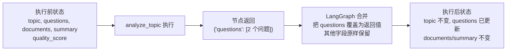

# 04. State：让工作流拥有共享上下文

> 版本说明：本教程示例基于 **Python 3.10+，推荐 3.13；LangGraph 1.x**。

## 本章导读

第 03 章的图只有一个节点，State 只有两个字段（`topic`、`summary`）。这看不出共享上下文的价值。

真实 Agent 有多个步骤：分析主题 → 检索资料 → 总结资料。这些步骤之间必须传递数据——第 2 步要用第 1 步产出的检索问题，第 3 步要用第 2 步产出的资料。**State 就是这份在节点之间流转的共享上下文**。

这一章把图扩成 3 个节点、State 扩成 5 个字段，并引入本章最重要也最容易踩坑的概念：**reducer（合并策略）**。

涉及代码：`code/step_by_step/04_state_graph.py`

---

## 本章目标

- 理解 `State` 是图执行过程中的共享上下文，而不是数据库。
- 用 `TypedDict` 定义业务状态。
- 理解节点如何读取状态、如何返回局部更新。
- 理解默认"覆盖"语义与 reducer"合并"语义的区别。
- 建立"哪些数据该进 State"的判断标准。

---

## 为什么需要这一章

先想一个问题：三个节点共享数据，如果不使用 `State`，你有哪几种方案？

**方案 A：模块级全局变量**

```python
documents = []          # 模块级变量

def search_documents():
    documents.append(...)   # 直接改全局
```

问题：全局变量污染命名空间；多实例/多线程下互相串；图执行中途出错难以回滚。服务端开发中我们早就知道全局可变状态是噩梦，这里同理。

**方案 B：返回值手动串联**

```python
questions = analyze_topic(state)
documents = search_documents(questions)
summary = summarize_documents(documents)
```

问题：这是把"流程控制"写死在业务代码里。一旦出现分支、循环、人工介入，串联调用立刻崩坏。这正是第 01 章讲的"链式调用不擅长表达复杂流程"。

**方案 C：共享 State（LangGraph 的做法）**

每个节点只声明"我读什么、我写什么"，流程由边的定义控制，数据统一放在 State 里，由 LangGraph 运行时负责合并与流转。

```python
def search_documents(state):
    # 读：state["questions"]
    # 写：return {"documents": ...}
```

本章就是把贯穿项目从方案 B（普通函数串联）升级为方案 C（共享 State）。

---

## 核心概念

### State 是上下文，不是数据库

`State` 保存的是**一次图执行过程中需要流转的数据**。它可以被持久化（第 10 章），但它不是业务数据库：

| 适合放 State | 不适合放 State |
|---|---|
| 节点间需要传递的中间结果 | 用户资料、订单、完整历史记录 |
| 流程决策依据（质量分数、轮次） | 需要 SQL 查询的大表数据 |
| 当前会话的上下文 | 可随时重新计算的临时值 |
| 需要持久化恢复的少量数据 | 日志（应走日志系统） |

判断标准一句话：**只有"下一个节点需要用到"的数据，才放进 State。**

### 节点如何读取 State

节点函数的第一个参数就是当前完整状态：

```python
def summarize_documents(state: ResearchState) -> dict[str, str]:
    topic = state["topic"]                # 读
    count = len(state["documents"])       # 读
    return {"summary": f"基于 {count} 份资料..."}  # 写
```

**节点只能读"传入的 state"，不能自己去改它**。所有修改都必须通过返回值表达——这样 LangGraph 才能追踪每次状态变更，这是后续持久化、回放、调试的基础。

### 节点返回局部更新

节点的返回值有三种写法，行为完全不同：

| 返回方式 | 行为 | 适用场景 |
|---|---|---|
| 只返回修改的字段 `{"summary": ...}` | LangGraph 只合并这些字段 | **推荐**，本章和后续章节都用 |
| 返回完整状态字典 | 逐字段覆盖合并 | 不推荐，容易漏字段、易出错 |
| 返回 `None` | 状态不变 | 只读节点 / 只做副作用的节点 |

```python
# 推荐：只写自己负责的字段
def analyze_topic(state) -> dict[str, list[str]]:
    return {"questions": [...]}

# 不推荐：手动拼完整状态，后续加字段很容易忘记同步
def analyze_topic(state) -> ResearchState:
    return {
        "topic": state["topic"],
        "questions": [...],
        "documents": state.get("documents", []),
        # 新增字段时这里容易漏，一漏就丢数据
    }
```

**"合并"到底做了什么？** 一个容易困惑的点：节点返回 `{"questions": [...]}`，为什么最终状态里 `topic`、`documents` 还在？



"合并" = 用返回值的字段去**覆盖**状态里同名键，其余键保持不动。这就是为什么节点可以只返回自己修改的字段——你写哪些键，就更新哪些键。

### 默认覆盖语义

如果两个节点都返回同一个字段，LangGraph 默认用**新值覆盖旧值**：

```python
node_a 返回 {"summary": "第一版总结"}
node_b 返回 {"summary": "第二版总结"}
最终 summary = "第二版总结"
```

这是默认行为。对 `str`、`int` 等单值字段，覆盖是正确的。但对 `list`、`dict` 这类**累加型**字段，覆盖可能是陷阱——请看下一个概念。

### reducer：控制合并策略

当多个节点都要"往同一个 list 里追加"时，默认覆盖会导致前一个节点的成果丢失：

```python
node_a 返回 {"documents": [doc_1]}
node_b 返回 {"documents": [doc_2]}
默认行为：最终 documents = [doc_2]   # doc_1 丢了！
```

解法是用 `Annotated[类型, reducer函数]` 声明合并策略：

```python
from typing import Annotated, TypedDict
from operator import add

class ResearchState(TypedDict):
    documents: Annotated[list[str], add]   # 追加而不是覆盖
```

> **`Annotated[X, Y]` 是什么？** 这是 Python 标准库 `typing` 里的类型工具：`Annotated` 在类型 `X` 上"贴"了一个附加信息 `Y`，运行期 `Annotated[list[str], add]` 仍然是 `list[str]`。LangGraph 会在编译时**读取这个附加信息**，把它当成"该字段的合并策略"。所以它的作用不是给程序看的，是给 LangGraph 看的——你可以把它理解为"字段的配置"。

加了 `add` 之后：

```python
node_a 返回 {"documents": [doc_1]}
node_b 返回 {"documents": [doc_2]}
最终 documents = [doc_1, doc_2]   # 正确追加
```

| 语义 | 声明方式 | 行为 | 适用字段 |
|---|---|---|---|
| 覆盖（默认） | 不写 `Annotated` | 后写的覆盖先写的 | `str` / `int` / 单值 |
| 追加（reducer） | `Annotated[list[str], add]` | 新值拼到旧值后面 | 消息列表、文档列表、日志 |

`add` 来自 Python 标准库 `operator.add`，是 LangGraph 内置支持的 reducer 之一。真正的 Agent 场景更常用 `add_messages`（消息追加），会在第 07 章工具调用时遇到。本章只需要理解：**reducer 是"这个字段如何合并"的声明**。

### 消息型状态 vs 业务状态

LangGraph 官方预置了 `MessagesState`（消息型状态），字段是 `messages: Annotated[list[AnyMessage], add_messages]`，适合"对话消息"场景。

本章的"资料检索与总结 Agent"是**业务状态**——字段是 `topic`、`documents`、`quality_score` 这类业务数据，而不是对话消息。入门阶段先掌握业务状态，消息型状态到工具调用章节再接触。

---

## 最小代码示例

创建文件 `code/step_by_step/04_state_graph.py`：

```python
from typing import TypedDict

from langgraph.graph import END, START, StateGraph


class ResearchState(TypedDict):
    topic: str
    questions: list[str]
    documents: list[str]
    summary: str
    quality_score: int


def analyze_topic(state: ResearchState) -> dict[str, list[str]]:
    return {
        "questions": [
            f"{state['topic']} 是什么？",
            f"{state['topic']} 适合解决什么问题？",
        ]
    }


def search_documents(state: ResearchState) -> dict[str, list[str]]:
    documents = [f"资料：{question}" for question in state["questions"]]
    return {"documents": documents}


def summarize_documents(state: ResearchState) -> dict[str, str]:
    return {
        "summary": f"基于 {len(state['documents'])} 份资料，总结主题：{state['topic']}"
    }


builder = StateGraph(ResearchState)
builder.add_node("analyze_topic", analyze_topic)
builder.add_node("search_documents", search_documents)
builder.add_node("summarize_documents", summarize_documents)

builder.add_edge(START, "analyze_topic")
builder.add_edge("analyze_topic", "search_documents")
builder.add_edge("search_documents", "summarize_documents")
builder.add_edge("summarize_documents", END)

graph = builder.compile()


if __name__ == "__main__":
    result = graph.invoke({
        "topic": "LangGraph",
        "questions": [],
        "documents": [],
        "summary": "",
        "quality_score": 0,
    })
    print(result)
```

图结构：


---

## 执行过程拆解

`graph.invoke({...})` 一次执行里，状态经历了完整的"读取 → 更新 → 合并"循环。逐步看：

**第 1 步：注入初始状态**

```python
state = {
    "topic": "LangGraph",
    "questions": [],
    "documents": [],
    "summary": "",
    "quality_score": 0,
}
```

**第 2 步：执行 `analyze_topic`**

- 读取：`state["topic"]`
- 返回：`{"questions": ["LangGraph 是什么？", "LangGraph 适合解决什么问题？"]}`
- 合并后：`questions` 被覆盖为 2 个问题，其余字段不变。

**第 3 步：执行 `search_documents`**

- 读取：`state["questions"]`（上一步刚写入的 2 个问题）
- 返回：`{"documents": ["资料：LangGraph 是什么？", "资料：LangGraph 适合解决什么问题？"]}`
- 合并后：`documents` 有 2 份资料。

**第 4 步：执行 `summarize_documents`**

- 读取：`state["documents"]`（2 份）、`state["topic"]`
- 返回：`{"summary": "基于 2 份资料，总结主题：LangGraph"}`
- 合并后：`summary` 被写入。

**第 5 步：到达 END，返回最终状态**

用状态快照表看全程：

| 阶段 | questions | documents | summary |
|---|---|---|---|
| 初始 | `[]` | `[]` | `""` |
| `analyze_topic` 后 | 2 个问题 | `[]` | `""` |
| `search_documents` 后 | 2 个问题 | 2 份资料 | `""` |
| `summarize_documents` 后 | 2 个问题 | 2 份资料 | "基于 2 份资料..." |
| 最终返回 | 2 个问题 | 2 份资料 | "基于 2 份资料..." |

注意：每个节点都只返回**自己负责的字段**，但 `invoke()` 返回的是**合并后的完整状态**。这就是"节点返回局部更新、LangGraph 统一合并"的核心机制。

---

## 贯穿项目改造

贯穿项目的状态从第 03 章的 2 个字段扩展到 5 个字段：

```python
class ResearchState(TypedDict):
    topic: str
    questions: list[str]      # analyze_topic 产出
    documents: list[str]      # search_documents 产出
    summary: str              # summarize_documents 产出
    quality_score: int        # 本章先占位，第 08 章开始打分
```

每个节点只读写自己相关的字段：

| 节点 | 读取 | 写入 |
|---|---|---|
| `analyze_topic` | `topic` | `questions` |
| `search_documents` | `questions` | `documents` |
| `summarize_documents` | `documents`、`topic` | `summary` |

这就是 LangGraph 的**依赖关系表**：读什么，决定了这个节点被排在哪些节点之后；写什么，决定了它能给后续节点提供什么。

后续章节会逐步增加字段：

```text
第 04 章：topic, questions, documents, summary, quality_score
第 09 章：+ iteration_count, max_iterations（循环控制）
第 11 章：+ draft_report, final_report（人工确认）
```

每次加字段都要回答同一句话：**下一个节点需要它吗？**

---

## 代码运行方式

```powershell
cd code/step_by_step
python 04_state_graph.py
```

预期输出：

```text
{'topic': 'LangGraph', 'questions': ['LangGraph 是什么？', 'LangGraph 适合解决什么问题？'], 'documents': ['资料：LangGraph 是什么？', '资料：LangGraph 适合解决什么问题？'], 'summary': '基于 2 份资料，总结主题：LangGraph', 'quality_score': 0}
```

验证要点：

- `questions` 和 `documents` 各 2 项，说明上游产出被下游正确消费。
- `summary` 提到"2 份资料"，说明 `len(state["documents"])` 读到的是合并后的值。
- 初始传入的 `quality_score: 0` 原样保留——没有任何节点写它。

---

## 调试与排查

### 场景一：`invoke()` 报 `KeyError`

```python
graph.invoke({"topic": "LangGraph"})   # 缺 questions / documents 等
```

报错：

```text
KeyError: 'questions'
```

**原因**：某个节点通过 `state['questions']` 读取字段，但初始状态里没有这个键。注意 LangGraph **不会**为 `TypedDict` 声明的字段自动补默认值——`TypedDict` 只描述类型，不负责运行时兜底。

一个隐蔽的细节：如果没有任何节点读取某个缺失字段，程序能正常跑完，但**最终返回的状态里也没有这个字段**。这种"静默缺字段"比直接报错更危险，它会在下游某个节点第一次读取时变成 `KeyError`。

**排查**：把初始状态与 `ResearchState` 逐字段比对，养成"初始状态显式写全"的习惯。这也是第 10 章持久化里必须处理状态缺失字段的原因。

### 场景二：`documents` 数据"神秘丢失"

如果两个节点都往 `documents` 追加数据，但没有声明 reducer：

```python
# 未声明 Annotated[list[str], add]
node_a 返回 {"documents": [doc_1]}
node_b 返回 {"documents": [doc_2]}
# 结果：documents 只剩 [doc_2]
```

**原因**：默认覆盖语义把前一个节点的成果覆盖掉了。

**排查**：把字段声明改成 `documents: Annotated[list[str], add]`，用标准库 `from operator import add` 导入。

### 场景三：返回类型不稳定导致运行时报错

```python
def node(state) -> dict:
    if state.get("flag"):
        return {"summary": "ok"}        # str
    return {"summary": ["ok"]}          # list，类型变了
```

`TypedDict` 声明的 `summary: str` 只是类型提示，运行时不会强制校验，但**字段类型在节点间传递时频繁变化，会在下游 `len()`、字符串拼接处报错**，错误信息往往很隐晦。

**排查**：节点的返回类型保持与 `ResearchState` 声明一致；类型标注写全（`dict[str, str]` 而不是裸 `dict`），让 IDE 提前帮你发现问题。

### 场景四：打印中间状态

想确认某个节点执行后的状态，可以直接单测该节点：

```python
state = {"topic": "LangGraph", "questions": [], "documents": [], "summary": "", "quality_score": 0}
print(analyze_topic(state))
# 输出：{'questions': ['LangGraph 是什么？', 'LangGraph 适合解决什么问题？']}
```

节点是普通函数，可以直接调用——这是后续第 05 章"节点可测试性"和第 13 章"单元测试"的基础。

---

## 常见错误

| 现象 | 原因 | 解决 |
|---|---|---|
| `KeyError` | 节点读取了初始状态未提供的字段 | 初始状态与 `ResearchState` 对齐；未提供的字段不会自动补默认值 |
| 多次写入的 list 只剩最后一次 | list 字段没加 reducer | `Annotated[list[str], add]` |
| 节点返回完整状态，偶尔丢字段 | 手动拼完整状态容易漏 | 只返回修改的字段 |
| 同一字段类型漂移（str / list 交替） | 节点返回类型不稳定 | 用 `dict[str, str]` 这类精确标注 |
| 把不需要传递的变量塞进 State | 混淆了"共享上下文"和"局部变量" | 只有下一个节点需要才放 |
| 最终状态里少了某些字段 | 初始状态没传，且没有任何节点写入 | 初始状态显式写全声明过的字段 |

---

## 练习任务

**必做 1：增加 `final_report` 字段**

给 `ResearchState` 增加 `final_report: str`，初始化为空字符串。不需要新增节点，先让它"躺在"状态里。

自查：`invoke()` 返回结果里出现 `final_report: ''`，其余字段不受影响。

**必做 2：增加 `source_count` 字段并写入**

给状态增加 `source_count: int`，让 `summarize_documents` 在返回时同时写入资料数量：

```python
return {
    "summary": f"基于 {len(state['documents'])} 份资料...",
    "source_count": len(state["documents"]),
}
```

自查：最终输出里 `source_count` 等于 2，且没有破坏原有字段。

**扩展练习：体验覆盖的"坑"**

修改 `search_documents`，让它返回两次——直接在函数里追加两次（例如 `documents + documents`），观察 `invoke()` 结果。

然后给 `documents` 字段加上 `Annotated[list[str], add]` reducer，观察行为差异。

自查：你能解释加 reducer 前后两次输出的差异吗？这正是"覆盖 vs 合并"的核心。

---

## 本章小结

- `State` 是节点间共享的上下文，**只放"下一个节点需要"的数据**。
- 节点读取 `state`，通过返回值提交**局部更新**，LangGraph 负责合并。
- 默认行为是**覆盖**；对累加型字段（list 追加），用 **reducer**（`Annotated[T, add]`）声明合并策略。
- `invoke()` 返回合并后的**完整最终状态**，而不是某个节点的返回值。

下一章会专门讲 Node 的设计：怎么把业务逻辑拆成小而可测的节点，避免把所有逻辑堆在一个函数里。

---

## 本章速查

**核心概念一句话**

- `State`：一次图执行中的共享数据快照。
- 局部更新：节点只返回自己修改的字段。
- 默认覆盖：同名字段返回新值覆盖旧值。
- reducer：声明"该字段如何合并"（如 `Annotated[list[str], add]` 追加）。
- 判断标准：下一个节点需要，才放进 State。

**本章涉及 API**

| API | 作用 |
|---|---|
| `TypedDict` | 定义状态结构（带字段描述的字典） |
| `Annotated[T, reducer]` | 声明字段合并策略 |
| `operator.add` | 内置 list 追加 reducer |

**加深阅读**

- notebook：
  - `langgraph/chapter01/02_dataclass.ipynb`、`03_pydantic.ipynb`（其他状态定义方式）
  - `langgraph/chapter01/04_reducer.ipynb`（reducer 深入）
  - `langgraph/chapter01/05_addmessage.ipynb`（消息型 reducer）
- 系统笔记：`LangGraph-笔记/01-LangGraph基础入门.md` 的「3. 图的状态（State）管理」
- 官方文档：[LangGraph State 与 reducer](https://docs.langchain.com/oss/python/langgraph/state)
