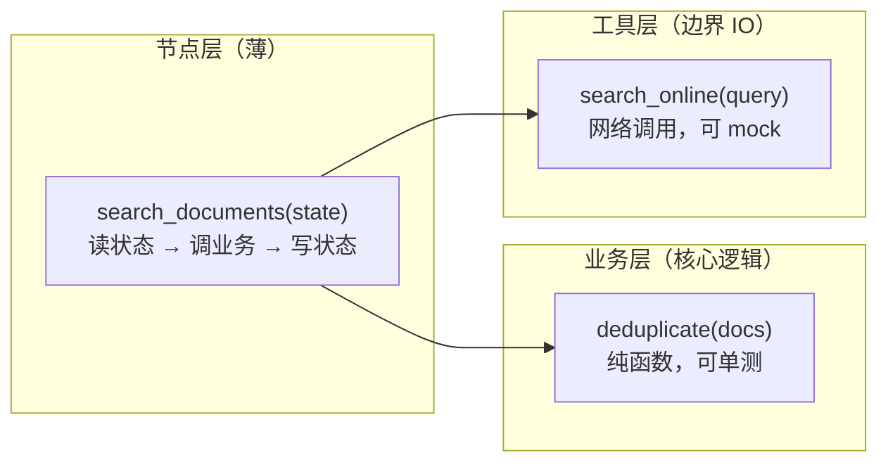

# 05. Node：把业务步骤拆成可测试函数

> 版本说明：本教程基于 **Python 3.10+，推荐 3.13；LangGraph 1.x**。

## 本章导读

第 04 章我们把流程拆成了 3 个节点，State 也扩展到 5 个字段。但"拆节点"和"拆得好"是两回事——如果每个节点都是一坨几十行的逻辑，图只是换了一种写法的单体函数。

这一章讲节点的**设计规范**：节点函数该长什么样、业务逻辑放哪、如何测试。核心结论一句话：**节点是薄薄的一层胶水，真正的业务逻辑在节点调用的普通函数里。**

涉及代码：`code/step_by_step/05_node_functions.py`

---

## 本章目标

- 理解节点函数和业务函数的边界。
- 掌握节点函数的签名约定（输入、输出）。
- 学会把"胖节点"拆成可测试的小函数。
- 了解同步节点与异步节点。
- 学会直接单测节点函数。

---

## 为什么需要这一章

假设你把所有逻辑塞进一个节点：

```python
def big_node(state: ResearchState) -> dict:
    questions = []
    for q in state["topic"].split():
        questions.append(f"{q} 是什么？")
    docs = []
    for q in questions:
        docs.append(search_online(q))      # 网络调用
    summary = call_llm(docs)                # 模型调用
    score = len(summary) // 10              # 评分
    return {"questions": questions, "documents": docs,
            "summary": summary, "quality_score": score}
```

问题很明显：

- **无法单测**：一调用就发网络请求、烧模型 token。
- **无法复用**：`score` 的计算逻辑被焊死在节点里。
- **无法定位**：报错时不知道是检索、总结还是评分出的问题。

正确的形态是：**节点只做三件事——读状态、调业务函数、写状态**。业务逻辑全部下沉到普通函数，那才是可以独立测试、独立复用的代码。

这和你写服务端时"controller 很薄、service 负责逻辑"是一个道理。

---

## 核心概念

### 节点函数的标准形态

```python
def node_name(state: ResearchState) -> dict[str, str]:
    return {"field": "new value"}
```

三个约定：

1. **输入**：第一个参数是当前完整状态。
2. **输出**：返回一个字典（局部更新），由 LangGraph 合并回状态。
3. **命名**：小写下划线，如 `analyze_topic`、`search_documents`，与 `add_node` 注册名一致。

### 节点可以返回什么

| 返回方式 | 行为 | 适用场景 |
|---|---|---|
| `dict`（字段子集） | 合并这些字段 | **默认写法** |
| `Command` | 更新状态 + 指定下一步 / 恢复 | 第 11 章 HITL 用到 |
| `None` | 状态不变 | 只读节点、纯副作用节点 |
| 抛异常 | 整个图执行失败 | 需要全局失败语义时（可配重试） |

入门阶段只需要掌握第一种。

### 业务函数：不需要知道 LangGraph

```python
def build_questions(topic: str) -> list[str]:
    return [f"{topic} 是什么？"]

def analyze_topic(state: ResearchState) -> dict[str, list[str]]:
    return {"questions": build_questions(state["topic"])}
```

`build_questions` 对 LangGraph 一无所知：它只接收一个字符串，返回一个列表。**这种函数可以用最朴素的 pytest 直接测试，不需要任何图**。

### 节点命名规范

| 节点名 | 职责 | 示例 |
|---|---|---|
| 动词 + 名词 | 一句话说清做什么 | `analyze_topic`、`search_documents` |
| 不用 `node_` 前缀 | 冗余 | ❌ `node_analyze` |
| 与业务术语一致 | 便于对齐流程文档 | `evaluate_summary` 对应流程图里的"评估质量" |

### 同步节点 vs 异步节点

```python
def sync_node(state) -> dict:          # 同步
    return {"field": "ok"}

async def async_node(state) -> dict:   # 异步
    await some_io()                     # 例如 await api_call()
    return {"field": "ok"}
```

- 同步节点：函数体直接阻塞执行。
- 异步节点：`async def`，内部可以 `await` 网络 / 数据库 IO，不阻塞线程。

两者的配对关系：

| 图执行方式 | 支持的节点 |
|---|---|
| `graph.invoke(...)` | 同步节点 ✅，异步节点 ❌ |
| `graph.ainvoke(...)` | 异步节点 ✅（同步节点也会被自动调度） |

入门阶段**先用同步节点**。等你的工具开始真实调用网络 API 时，再考虑 `async` 化（第 07 章工具章节会提到）。

### 胖节点怎么拆：三层结构

把业务代码组织成三层，从外到内：

```text
节点函数（薄）          -> 读状态、调业务、写状态
业务函数（核心逻辑）      -> 可测试的业务计算
工具/模型调用（边界）    -> 外部 IO（第 07、08 章展开）
```

对应代码：

```python
# 工具层（第 07 章）
def search_online(query: str) -> list[str]:
    ...  # 真实网络调用

# 业务层
def deduplicate(docs: list[str]) -> list[str]:
    return list(dict.fromkeys(docs))

# 节点层（薄）
def search_documents(state) -> dict:
    docs = search_online(state["topic"])   # 工具
    return {"documents": deduplicate(docs)}  # 业务
```

这样 `deduplicate` 可以脱离网络独立测试，`search_online` 可以在测试里替换成 mock。

三层的调用关系：



- **节点层**认识 LangGraph（接收 state、返回更新）。
- **业务层**不认识 LangGraph，只做计算，是测试的主战场。
- **工具层**是唯一接触外部世界的边界，测试时 mock 掉。

依赖方向固定：节点层 → 业务层 + 工具层，反过来不行。这正是第 14 章"单向依赖"原则的雏形。

---

## 最小代码示例

创建 `code/step_by_step/05_node_functions.py`：

```python
from typing import TypedDict


class ResearchState(TypedDict):
    topic: str
    questions: list[str]


def build_questions(topic: str) -> list[str]:
    return [
        f"{topic} 是什么？",
        f"{topic} 的核心概念有哪些？",
        f"{topic} 适合哪些工程场景？",
    ]


def analyze_topic(state: ResearchState) -> dict[str, list[str]]:
    return {"questions": build_questions(state["topic"])}


def test_build_questions() -> None:
    questions = build_questions("LangGraph")
    assert len(questions) == 3
    assert "LangGraph" in questions[0]


def main() -> None:
    test_build_questions()
    state: ResearchState = {"topic": "LangGraph", "questions": []}
    result = analyze_topic(state)
    print(result)


if __name__ == "__main__":
    main()
```

运行：

```powershell
cd code/step_by_step
python 05_node_functions.py
```

预期输出：

```text
{'questions': ['LangGraph 是什么？', 'LangGraph 的核心概念有哪些？', 'LangGraph 适合哪些工程场景？']}
```

注意这个示例**故意没有建图**——它在演示"节点函数可以被当普通函数直接调用"。这也是本章最重要的实践：**节点不需要图就能测试。**

---

## 执行过程拆解

这段代码虽然短，但包含了三层结构：

1. `build_questions(topic)`：**业务函数**。纯输入输出，无任何外部依赖。
2. `analyze_topic(state)`：**节点函数**。读 `state["topic"]` → 调业务函数 → 写 `questions`。
3. `test_build_questions()`：**测试函数**。直接断言业务函数的结果。

调用链：

```text
main()
  -> test_build_questions()      # 先自检
  -> analyze_topic(state)        # 节点函数
       -> build_questions(topic) # 业务函数
  -> print(result)
```

关键认知：`analyze_topic` 能被直接调用，是因为它**只是一个普通函数**。测试它不需要初始化图、不需要 checkpointer、不需要 API Key。这就是"薄节点"带来的可测试性。

---

## 贯穿项目改造

贯穿项目"资料检索与总结 Agent"建议拆成 6 个节点：


每个节点的职责与读写：

| 节点 | 职责 | 读取 | 写入 |
|---|---|---|---|
| `analyze_topic` | 分析用户主题，生成研究问题 | `topic` | `questions` |
| `plan_search` | 决定检索哪些方向 | `questions` | `search_queries` |
| `search_documents` | 调用工具获取资料 | `search_queries` | `documents`, `errors` |
| `summarize_documents` | 基于资料生成总结 | `documents` | `summary` |
| `evaluate_summary` | 判断总结质量 | `summary` | `quality_score`, `missing_points` |
| `generate_report` | 生成最终报告 | `summary` 等 | `final_report` |

设计要点：

- 每个节点对应**一行职责描述**，说不出这一行就说明职责不清晰。
- 每个节点的读写都在 `State` 里**显式可见**（对应第 04 章的"依赖关系表"）。
- 后续章节（第 06-09 章）会在这些节点之间加分支、循环和工具，但**节点本身的职责边界不变**——这正是边界清晰的价值。

---

## 代码运行方式

**方式一：直接运行（内置自检）**

```powershell
python 05_node_functions.py
```

**方式二：用 pytest 运行测试**

```powershell
pip install pytest
pytest 05_node_functions.py
```

pytest 会自动收集文件名以 `test_` 开头（或类名/函数名以 `test_` 开头）的函数并执行。预期输出：`1 passed`。

---

## 调试与排查

### 场景一：节点返回了错误的结构

```python
def analyze_topic(state) -> dict[str, list[str]]:
    return {"questions": "一个字符串"}   # 类型不符，但不会在节点层报错
```

**现象**：`invoke()` 能跑，但下游节点 `len(state["questions"])` 把字符串当列表用，报 `TypeError` 或行为诡异。

**原因**：节点返回的字段类型不稳定。`TypedDict` 标注不约束运行时。

**排查**：给节点函数写死返回类型标注（`-> dict[str, list[str]]`），配合 IDE 检查；调试时直接打印节点返回值核对。

### 场景二：节点"太胖"，测试要真发请求

**现象**：`test_build_questions()` 一旦节点内部混入 `search_online()`，测试就必须发网络请求。

**排查**：把 IO 调用拆到独立函数（工具层），节点只调业务函数。测试时 mock 工具函数即可：

```python
from unittest.mock import patch

@patch("step_by_step.search_online", return_value=["模拟资料"])
def test_search(mock_search):
    ...   # 不需要真实网络
```

### 场景三：`async` 节点用 `invoke()` 调用报错

**现象**：`RuntimeError: asyncio.run() cannot be called from a running event loop` 之类。

**原因**：图里有异步节点，但用了同步 `invoke()`；或异步图在已有事件循环里调用 `ainvoke` 的方式不对。

**排查**：节点有 `async def` 时，图统一用 `graph.ainvoke(...)`；脚本入口用 `asyncio.run(main())`。

---

## 常见错误

| 现象 | 原因 | 解决 |
|---|---|---|
| 节点做太多事 | 检索、总结、评分都塞进一个节点 | 每节点一行职责描述，拆到 6 个节点 |
| 节点直接读环境变量 | 配置散落 | 配置集中管理（`config.py`），节点只收状态 |
| 节点返回结构不稳定 | 返回类型标注缺失/不准确 | 写精确返回标注 `dict[str, list[str]]` |
| 测试依赖真实 LLM / 网络 | 业务逻辑没和 IO 分离 | 业务函数与工具分离，测试 mock IO |
| 命名 `node_xxx` | 冗余前缀 | 直接用动词 + 名词 |
| 把图构建代码混进业务函数 | 边界混乱 | 图构建只在入口文件；节点/业务函数保持纯净 |

---

## 练习任务

**必做 1：为 `summarize_documents` 做同样的拆分**

参考 `analyze_topic` 的模式：

1. 写一个纯业务函数 `build_summary(topic: str, documents: list[str]) -> str`。
2. 用节点函数 `summarize_documents(state)` 包装它。
3. 写一个测试函数断言 `build_summary` 的结果包含主题名。

自查：`pytest` 运行通过，且 `build_summary` 不依赖任何 LangGraph 概念。

**必做 2：为每个节点写结构测试**

给第 04 章的 3 个节点（`analyze_topic`、`search_documents`、`summarize_documents`）各写一个最小测试，只验证"输入合法状态 → 返回的键名正确"：

```python
def test_analyze_topic_structure():
    state = {"topic": "LangGraph", "questions": []}
    result = analyze_topic(state)
    assert set(result.keys()) == {"questions"}
```

自查：三个测试全部通过，且没有调用任何真实 IO。

**扩展练习：体会 async 节点**

把 `summarize_documents` 改成 `async def`，用 `asyncio.sleep(0)` 模拟等待，然后用 `ainvoke` 调用一个最小图。

自查：`ainvoke` 能正常返回；你能否说出同步图配 `invoke`、异步节点配 `ainvoke` 的对应关系。

---

## 本章小结

- 节点是**薄胶水**：读状态 → 调业务函数 → 写状态。
- 业务逻辑放在**不知道 LangGraph 的普通函数**里，才能独立测试。
- 三层结构：节点层（薄）/ 业务层（逻辑）/ 工具层（IO）。
- 同步节点 + `invoke()`，异步节点 + `ainvoke()`。
- 节点函数本身就是普通函数，**不需要图就能单测**。

下一章用 Edge 把这些节点串起来，让流程出现分支——那才是 LangGraph 区别于普通函数的地方。

---

## 本章速查

**节点函数模板**

```python
def node_name(state: StateT) -> dict[str, Any]:
    # 1. 读状态
    # 2. 调业务函数
    # 3. 返回局部更新
    return {"field": value}
```

**加深阅读**

- 系统笔记：`LangGraph-笔记/02-LangGraph控制流与节点执行.md` 的「5. 节点执行与容错机制」（节点重试、超时、缓存）
- 官方文档：[LangGraph 节点](https://docs.langchain.com/oss/python/langgraph/graph-api)
