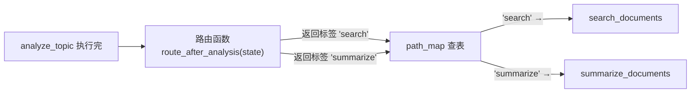
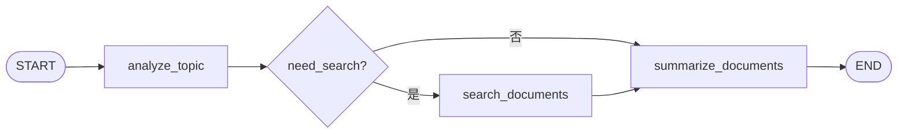
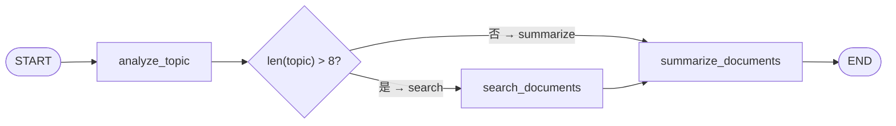
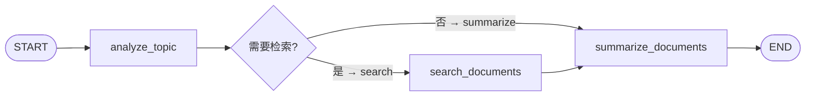

# 06. Edge：控制流程、分支和结束条件

> 版本说明：本教程基于 **Python 3.13 + LangGraph 1.x**。

## 本章导读

前面几章的图都是**固定顺序**：从 `START` 一路走到 `END`。但真实 Agent 不会这么听话——简单主题可以直接总结，复杂主题需要先检索；质量不达标要回头再搜一次；达到标准才能结束。

这些"接下来走哪条路"的决策，就是本章的主角：**Edge（边）**，尤其是**条件边**。

学完这一章，贯穿项目会从"直线"变成真正的"分支图"。

涉及代码：`code/step_by_step/06_conditional_edges.py`

---

## 本章目标

- 理解普通边和条件边的区别。
- 掌握 `add_conditional_edges()` 的完整签名和用法。
- 理解路由函数的职责边界。
- 知道条件入口（`START` 配条件边）和静态边混用的坑。
- 把贯穿项目改造成带分支的工作流。

---

## 为什么需要这一章

回顾第 04 章的图：


问题：**不管主题多简单，都必须走一遍检索。** 真实业务显然不合理——`analyze_topic` 之后应该判断：

- 主题足够简单？→ 直接总结。
- 主题需要外部资料？→ 先检索。

这就是分支。LangGraph 的分支用**条件边**表达。

---

## 核心概念

### 普通边：固定下一步

```python
builder.add_edge("search_documents", "summarize_documents")
```

语义：`search_documents` 执行完，**无条件**进入 `summarize_documents`。

### 条件边：根据状态决定下一步

```python
builder.add_conditional_edges(
    "analyze_topic",            # 从哪个节点出发
    route_after_analysis,       # 路由函数：返回一个标签
    {
        "search": "search_documents",      # 标签 -> 目标节点
        "summarize": "summarize_documents",
    },
)
```

三个参数：

| 参数 | 作用 | 要求 |
|---|---|---|
| `source` | 从哪个节点出发 | 已通过 `add_node` 注册的节点名 |
| `path` | 路由函数 | 接收 state，返回一个字符串标签 |
| `path_map` | 标签到目标的映射 | 值是节点名或 `END` |

完整签名（LangGraph 1.x）：

```python
add_conditional_edges(
    source: str,
    path: Callable[[State], str],
    path_map: dict[str, str],
)
```

**条件边是一次"查表"**，把三件事串起来：



路由函数负责"根据状态选标签"，`path_map` 负责"标签到节点的映射"。两件事拆开的好处：**路由只关心"条件"，映射只关心"结构"**——加新分支时改两处，语义始终清晰。

### 路由函数的三条铁律

```python
from typing import Literal

def route_after_analysis(state: ResearchState) -> Literal["search", "summarize"]:
    if state["need_search"]:
        return "search"
    return "summarize"
```

1. **必须是纯函数**：只根据 `state` 决定返回什么，不要有副作用（不要调用 LLM、不要发网络请求）。
2. **返回值类型用 `Literal[...]` 标注**：让 IDE 检查路径映射是否齐全。
3. **返回的字符串必须在 `path_map` 里**：否则运行时抛异常。

**为什么路由函数要轻量？** 因为路由决策越复杂，越说明"决策本身应该是上一个节点的业务逻辑"。复杂判断应该在前一个节点里算好写入 `state`（比如 `need_search`），路由函数只做"查表"。

### 条件入口：让 `START` 也能做判断

`START` 也是节点，可以给它配条件边：

```python
builder.add_conditional_edges(
    START,
    route_at_start,
    {"a": "node_a", "b": "node_b"},
)
```

适合"入口就要分流"的场景（比如根据用户意图走不同流程）。本教程主线用固定 `START`，分支都放在业务节点之后，更符合阅读习惯。

### 为什么不要在同一个节点上混用静态边和条件边

一个节点只能有**一种**出边定义：

```python
# ❌ 错误：同一个节点既加普通边又加条件边
builder.add_edge("analyze_topic", "summarize_documents")
builder.add_conditional_edges("analyze_topic", route_after_analysis, {...})

# ✅ 正确：用条件边统一表达分支
builder.add_conditional_edges("analyze_topic", route_after_analysis, {...})
```

`add_edge` 会覆盖 `add_conditional_edges`（或反过来），最终行为不可预测，等于给自己埋雷。**一个节点只定义一种出边**。

### 流程图到代码的映射



流程图里的每个菱形（判断）对应一个路由函数；每条带标签的线对应 `path_map` 里的一项。

---

## 最小代码示例

创建 `code/step_by_step/06_conditional_edges.py`：

```python
from typing import Literal, TypedDict

from langgraph.graph import END, START, StateGraph


class ResearchState(TypedDict):
    topic: str
    need_search: bool
    documents: list[str]
    summary: str


def analyze_topic(state: ResearchState) -> dict[str, bool]:
    return {"need_search": len(state["topic"]) > 8}


def route_after_analysis(state: ResearchState) -> Literal["search", "summarize"]:
    if state["need_search"]:
        return "search"
    return "summarize"


def search_documents(state: ResearchState) -> dict[str, list[str]]:
    return {"documents": [f"模拟资料：{state['topic']}"]}


def summarize_documents(state: ResearchState) -> dict[str, str]:
    source_count = len(state["documents"])
    return {"summary": f"基于 {source_count} 份资料总结：{state['topic']}"}


builder = StateGraph(ResearchState)
builder.add_node("analyze_topic", analyze_topic)
builder.add_node("search_documents", search_documents)
builder.add_node("summarize_documents", summarize_documents)

builder.add_edge(START, "analyze_topic")
builder.add_conditional_edges(
    "analyze_topic",
    route_after_analysis,
    {
        "search": "search_documents",
        "summarize": "summarize_documents",
    },
)
builder.add_edge("search_documents", "summarize_documents")
builder.add_edge("summarize_documents", END)

graph = builder.compile()


if __name__ == "__main__":
    result = graph.invoke({
        "topic": "LangGraph 条件边",
        "need_search": False,
        "documents": [],
        "summary": "",
    })
    print(result["summary"])
```

运行：

```powershell
cd code/step_by_step
python 06_conditional_edges.py
```

预期输出：

```text
基于 1 份资料总结：LangGraph 条件边
```

---

## 执行过程拆解

示例输入的 `topic` 是"LangGraph 条件边"，我们来数一下字符数：`L-a-n-g-G-r-a-p-h-空格-条-件-边`，共 **12 个字符**，`len(topic) > 8` 为 **True**。所以它实际走的是**检索分支**。追踪一次完整执行：

**第 1 步：`analyze_topic`**

- 读取 `topic`，计算 `len("LangGraph 条件边") > 8` → `True`。
- 返回 `{"need_search": True}`，状态里 `need_search` 被覆盖为 `True`。

**第 2 步：路由决策**

`route_after_analysis` 读取 `state["need_search"]`：

- `True` → 返回 `"search"`。

**第 3 步：沿 `path_map` 跳转**

- `"search"` → `search_documents` 被执行，`"summarize"` 分支被跳过。

**第 4 步：`search_documents`**

- 返回 `{"documents": ["模拟资料：LangGraph 条件边"]}`，`documents` 有 1 份资料。

**第 5 步：`summarize_documents`**

- 读取 `state["documents"]`（1 份资料），返回 `{"summary": "基于 1 份资料总结：LangGraph 条件边"}`。

**第 6 步：到达 END。**

决策树确认：



**反例验证**：如果把 `topic` 改成 `"短"`（1 个字符），`need_search` 变 `False`，路由返回 `"summarize"`，则 `search_documents` 被跳过，`summarize_documents` 读到的 `documents` 是初始空列表，输出会变成 `"基于 0 份资料总结：短"`。你可以把示例代码里的 `topic` 改短后运行验证。

---

## 贯穿项目改造

把贯穿项目的"是否需要检索"分支落地：



设计说明：

- `analyze_topic` 产出 `need_search`（业务判断写进状态）。
- `route_after_analysis` 只查状态做路由（轻量、无副作用）。
- `search_documents` 只在 `"search"` 分支被执行。
- 两条分支最终汇聚到 `summarize_documents`（扇入），LangGraph 支持一个节点有多条入边。

后续章节会继续演进：

- 第 08 章：用 `quality_score` 判断"质量是否达标"。
- 第 09 章：把"质量不达标"改造成循环边（指回 `search_documents`）。

---

## 代码运行方式

```powershell
cd code/step_by_step
python 06_conditional_edges.py
```

默认输出：

```text
基于 1 份资料总结：LangGraph 条件边
```

对比实验：把示例里的 `topic` 改成 `"短"`（1 个字符），重新运行。

自查：输出变成 `"基于 0 份资料总结：短"`——因为话题太短不触发检索，`search_documents` 被跳过。你能解释为什么吗？

---

## 调试与排查

### 场景一：路由函数返回的标签不在 `path_map` 里

```python
# path_map 只有 {"search": ..., "summarize": ...}
def route(state) -> str:
    if state["need_search"]:
        return "SEARCH"        # 大写，拼写不一致
    return "summarize"
```

报错类似：

```text
InvalidUpdateError: Conditional edge ... returned ... 'SEARCH' but not in path map ...
```

**原因**：返回了 `path_map` 之外的标签。

**排查**：路由函数返回值用 `Literal["search", "summarize"]` 标注，让 IDE 检查；打印路由函数实际返回值对照 `path_map`。

### 场景二：`add_edge` 和 `add_conditional_edges` 同时加在同一节点

**现象**：图行为时好时坏，或编译告警。

**原因**：一个节点只能有一种出边，后者覆盖前者。

**排查**：检查每个节点只有一条出边定义。分支用条件边，固定路径用普通边，不要混用。

### 场景三：路由函数里调用 LLM / 发网络请求

**现象**：图执行变得极慢，或路由偶发失败。

**原因**：路由函数在每次执行时都会调用，放重逻辑等于给每条边都加延迟。

**排查**：把"复杂判断"放到前一个节点写入 `state`（如 `need_search`），路由函数只做轻量查表。

### 场景四：确认条件边结构

用第 03 章的技巧可视化：

```python
print(graph.get_graph().draw_mermaid())
```

输出里能看到 `analyze_topic` 分出两条边，分别指向两个节点——这就是你期待的分支结构。

---

## 常见错误

| 现象 | 原因 | 解决 |
|---|---|---|
| `InvalidUpdateError` / 路由标签不在映射表 | 返回值与 `path_map` 不一致 | `Literal` 标注 + 逐字比对 |
| 节点同时有普通边和条件边 | 混用出边定义 | 一个节点一种出边 |
| 路由函数做重逻辑 | 误解路由职责 | 判断写入前节点状态，路由只查表 |
| `END` 忘了写进 `path_map` | 结束分支漏配 | `"finish": END` |
| 路由函数返回 `None` | 分支条件没写全 | 确保所有路径都有返回值 |
| 忘记 `need_search` 初始值 | 初始状态缺字段 | 初始状态与 `ResearchState` 对齐 |

---

## 练习任务

**必做 1：改判断规则**

让"主题包含『最新』两个字"时必须检索：

```python
def analyze_topic(state) -> dict[str, bool]:
    return {"need_search": "最新" in state["topic"] or len(state["topic"]) > 8}
```

自查：输入 `"最新LangGraph"` 走检索分支，输入 `"LangGraph"` 走直接总结分支。

**必做 2：加一个 reject 路由**

增加 `reject` 分支：空主题直接结束并返回错误提示。

提示：需要给 `ResearchState` 加 `error: str` 字段；`path_map` 里加 `"reject": END`。

自查：输入 `""` 时直接返回包含错误提示的状态，且流程结束。

**扩展练习：条件入口**

把 `START` 改成条件入口，根据输入主题是否为空，决定进 `analyze_topic` 还是直接进 `reject` 分支。

自查：`draw_mermaid()` 输出显示 `__start__` 分出两条边。

---

## 本章小结

- **普通边**：固定下一步；**条件边**：根据状态选择下一步。
- `add_conditional_edges(source, path, path_map)` 三个参数各司其职。
- 路由函数三条铁律：纯函数、`Literal` 标注、只查表。
- 一个节点只定义一种出边，不要混用。
- 流程图的菱形判断 = 路由函数 + `path_map`。

下一章给节点接入工具，让 Agent 能调用外部能力——贯穿项目的 `search_documents` 会从"模拟数据"变成"调用真实搜索"。

---

## 本章速查

**API 速查**

```python
# 普通边
builder.add_edge("from_node", "to_node")

# 条件边
builder.add_conditional_edges(
    "source_node",           # 出发点
    route_function,          # state -> str
    {"label_a": "node_a",    # 标签 -> 目标
     "label_b": END},        # 或 END
)
```

**路由函数模板**

```python
def route(state: ResearchState) -> Literal["a", "b"]:
    if state["condition_field"]:
        return "a"
    return "b"
```

**加深阅读**

- notebook：`langgraph/chapter02/03_route.ipynb`、`05_route2.ipynb`（条件路由深入）
- 系统笔记：`LangGraph-笔记/02-LangGraph控制流与节点执行.md` 的「4.2 分支结构」与「4.3 多分支汇聚」
- 官方文档：[LangGraph 条件边](https://docs.langchain.com/oss/python/langgraph/graph-api)
