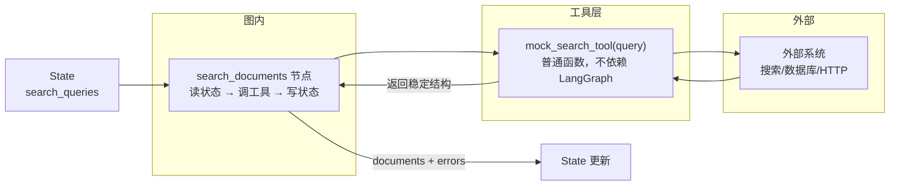

# 07. 工具调用：让 Agent 连接外部能力

> 版本说明：本教程基于 **Python 3.13 + LangGraph 1.x**。

## 本章导读

目前贯穿项目的 `search_documents` 用的是硬编码的模拟数据。真实 Agent 不能只靠模型"凭空回答"——它需要查数据库、读文件、请求 HTTP API、访问搜索服务。这些外部能力在 LangGraph 里统称为**工具（tool）**。

这一章讲清楚两件事：

1. 工具函数和节点函数的职责边界（谁管外部世界、谁管状态）。
2. 工具调用失败时怎么处理，才不会让整个图崩掉。

从本章开始，代码迁移到真实项目结构（`code/langgraph_intro_project/`）。

涉及代码：`code/step_by_step/07_tool_calling.py`、`code/langgraph_intro_project/app/tools/search_tool.py`、`app/nodes/search.py`

---

## 本章目标

- 理解工具函数和节点函数的区别。
- 编写一个可替换的模拟检索工具。
- 在节点中调用工具并写入 `State`。
- 掌握工具错误处理的三种模式。
- 了解工具的超时、重试与降级策略。

---

## 为什么需要这一章

如果没有工具，Agent 的"知识"上限就是训练数据——它不知道今天的天气、查不了你公司的订单、读不到本地文件。工具就是 Agent 的外部器官。

但工具引入了一个大问题：**外部系统不可靠**。网络超时、接口报错、返回格式变化……如果这些异常直接穿透到图里，一次工具失败会让整条工作流失败。

所以本章的两个主题：**怎么封装工具**、**怎么处理工具失败**。

---

## 核心概念

### 工具函数 vs 节点函数

| 对比维度 | 工具函数 | 节点函数 |
|---|---|---|
| 职责 | 访问外部能力 | 连接状态和工具 |
| 是否知道 LangGraph | **不知道** | 知道（接收 state） |
| 是否修改状态 | **不修改**，只返回结果 | 返回状态更新 |
| 输入 | 普通参数（query、条件） | 当前状态 |
| 可测试性 | 直接单测 | 直接单测（第 05 章） |

```python
# 工具函数：不知道 LangGraph，只做一件事
def search_tool(query: str) -> list[str]:
    return [f"模拟资料：{query}"]

# 节点函数：把状态转成工具输入，把工具输出写回状态
def search_documents(state: ResearchState) -> dict[str, list[str]]:
    documents = search_tool(state["topic"])
    return {"documents": documents}
```

这种拆分让你后续可以**无缝替换工具实现**：把 `search_tool` 从"模拟数据"换成"调用真实搜索 API"，节点函数一行都不用改。

### 工具返回值：结构必须稳定

工具的返回值会被下游节点消费，**字段结构必须稳定**。推荐用 `TypedDict` 描述：

```python
class SearchResult(TypedDict):
    title: str
    content: str
```

返回结构不稳定（今天 `{title, content}`，明天 `{name, text}`），下游解析就会崩。

### 工具错误处理：三种模式

| 模式 | 做法 | 优点 | 缺点 | 适用场景 |
|---|---|---|---|---|
| 抛异常 | `raise ValueError(...)` | 简单直接 | 图直接失败（除非配重试） | 参数校验、致命错误 |
| 返回错误结果 | 返回带 `error` 字段的结果 | 调用方显式处理 | 每个调用点都要判断 | 业务可控的错误 |
| 写入 errors 列表 | 异常捕获后记录到状态 | 图继续执行，可追溯 | 错误信息容易散落 | **推荐**，多查询批量检索 |

看一个具体对比。**抛异常**会让整个图失败：

```python
def mock_search_tool(query: str) -> list[SearchResult]:
    if not query.strip():
        raise ValueError("query 不能为空")   # 空查询 -> 图崩溃
```

**写入 errors 列表**让图继续跑，失败可追溯：

```python
def search_documents(state: ResearchState) -> dict[str, object]:
    documents: list[SearchResult] = []
    errors: list[str] = []

    for query in state["search_queries"]:
        try:
            documents.extend(mock_search_tool(query))
        except Exception as exc:
            errors.append(f"检索失败：{query}，原因：{exc}")

    return {
        "documents": documents,
        "errors": errors,
    }
```

后面第 09 章会看到：`errors` 里有没有失败，可以作为"是否重试"的业务依据。

### 超时、重试与降级

真实工具调用必须考虑三点：

```python
# 超时：网络调用设上限，避免节点挂死
response = requests.get(url, timeout=10)

# 重试：瞬时故障可以自动重试（技术重试）
for attempt in range(3):
    try:
        return requests.get(url, timeout=10)
    except TimeoutError:
        if attempt == 2:
            raise
        time.sleep(2 ** attempt)   # 退避

# 降级：主工具挂了用备用方案
try:
    return search_online(query)
except Exception:
    return search_local_cache(query)   # 降级到本地缓存
```

入门阶段先做到"超时 + 捕获异常写 errors"，重试和降级在第 15 章生产化清单里统一回顾。

---

## 最小代码示例

创建 `code/step_by_step/07_tool_calling.py`：

```python
from typing import TypedDict

from langgraph.graph import END, START, StateGraph


class SearchResult(TypedDict):
    title: str
    content: str


class ResearchState(TypedDict):
    topic: str
    search_queries: list[str]
    documents: list[SearchResult]
    errors: list[str]


def mock_search_tool(query: str) -> list[SearchResult]:
    if not query.strip():
        raise ValueError("query 不能为空")

    return [
        {
            "title": f"{query} 入门资料",
            "content": f"这是一段关于 {query} 的模拟资料。",
        }
    ]


def search_documents(state: ResearchState) -> dict[str, object]:
    documents: list[SearchResult] = []
    errors: list[str] = []

    for query in state["search_queries"]:
        try:
            documents.extend(mock_search_tool(query))
        except Exception as exc:
            errors.append(f"检索失败：{query}，原因：{exc}")

    return {
        "documents": documents,
        "errors": errors,
    }


builder = StateGraph(ResearchState)
builder.add_node("search_documents", search_documents)
builder.add_edge(START, "search_documents")
builder.add_edge("search_documents", END)

graph = builder.compile()


if __name__ == "__main__":
    result = graph.invoke({
        "topic": "LangGraph",
        "search_queries": ["LangGraph 是什么", "LangGraph 如何使用"],
        "documents": [],
        "errors": [],
    })
    print(result["documents"])
    print("errors:", result["errors"])
```

运行：

```powershell
cd code/step_by_step
python 07_tool_calling.py
```

预期输出：

```text
[{'title': 'LangGraph 是什么 入门资料', 'content': '这是一段关于 LangGraph 是什么 的模拟资料。'}, {'title': 'LangGraph 如何使用 入门资料', 'content': '这是一段关于 LangGraph 如何使用 的模拟资料。'}]
errors: []
```

---

## 执行过程拆解

一次执行流程：

**第 1 步：注入初始状态**

```python
{"search_queries": ["LangGraph 是什么", "LangGraph 如何使用"], "documents": [], "errors": []}
```

**第 2 步：`search_documents` 遍历查询词**

对每个查询词：

- 调用 `mock_search_tool(query)`。
- 成功 → 结果拼进 `documents`。
- 失败（如空查询）→ 错误信息拼进 `errors`。

**第 3 步：返回局部更新**

```python
{"documents": [2 份资料], "errors": []}
```

**关键点**：工具的异常**没有穿透到图**。这正是"errors 列表模式"的价值——图照常走到 END，状态里带着结果和错误记录，由后续节点决定怎么处理。

调用链路全景：



边界：**工具层和外部系统不认识 LangGraph**，只有节点负责翻译状态和工具结果。替换 `mock_search_tool` 为真实实现时，图内一切不动。

---

## 贯穿项目改造

第 07 章开始，建议把代码迁移到项目结构：

```text
code/langgraph_intro_project/
  app/
    state.py              # 统一定义状态
    nodes/
      search.py           # 节点函数
    tools/
      search_tool.py      # 工具函数
```

**`tools/search_tool.py`**：只负责检索。

```python
class SearchResult(TypedDict):
    title: str
    content: str

def mock_search_tool(query: str) -> list[SearchResult]:
    ...
```

**`nodes/search.py`**：只负责从状态取查询词、调工具、写状态。

```python
def search_documents(state: ResearchState) -> dict[str, object]:
    ...
```

**`state.py`**：统一定义 `ResearchState`。

为什么这么拆？因为职责单一：

- 工具层可以独立测试（mock / 替换真实实现）。
- 节点层不关心"检索怎么实现"，只关心"状态怎么流转"。
- 后面第 14 章会看到完整的分层目录结构。

---

## 代码运行方式

**方式一：单文件示例（本章）**

```powershell
cd code/step_by_step
python 07_tool_calling.py
```

**方式二：项目结构（迁移起点）**

```powershell
cd code/langgraph_intro_project
python -m app.nodes.search
```

---

## 调试与排查

### 场景一：工具抛异常，整个图失败

**现象**：`invoke()` 抛出工具里的异常，图没有正常结束。

**原因**：节点没有捕获异常，或用了"抛异常"模式但没有配重试。

**排查**：确认节点里 `try/except` 捕获了工具调用，并把错误写入 `errors`；只有真正致命的情况才让异常穿透。

### 场景二：下游节点拿到空 `documents`

**现象**：`summarize_documents` 收到的资料是空的。

**原因**：可能是所有查询都失败了（`errors` 里有记录），也可能是 `search_queries` 本身就是空的。

**排查**：先看 `errors` 字段——非空说明工具层失败；为空说明上游没产出查询词。用第 04 章的"直接调节点函数"技巧单独验证：

```python
print(search_documents({"topic": "x", "search_queries": [], "documents": [], "errors": []}))
```

### 场景三：真实工具替换后行为不一致

**现象**：模拟工具正常，换成真实搜索 API 后输出变了。

**原因**：真实工具可能超时、限流、返回格式不同。

**排查**：先在工具函数外单独测试真实 API，确认返回结构符合 `SearchResult`；再给工具加超时和错误捕获。

---

## 常见错误

| 现象 | 原因 | 解决 |
|---|---|---|
| 工具函数里直接改状态 | 混淆工具和节点职责 | 工具只返回结果，状态更新交给节点 |
| 工具异常导致图失败 | 没有捕获 | 用 errors 列表模式 |
| 工具返回结构不稳定 | 没有类型约束 | 用 `TypedDict` 定义返回结构 |
| 超时导致节点挂死 | 没设超时 | `requests.get(url, timeout=10)` |
| 一个查询失败就全盘放弃 | 批量检索没有逐条容错 | 循环内逐条 `try/except` |

---

## 练习任务

**必做 1：增加 `source` 字段**

给 `SearchResult` 增加 `source: str`，在 `mock_search_tool` 里返回固定值（如 `"mock"`）。

自查：输出中每份资料都带 `source` 字段，且下游读取该字段不报错。

**必做 2：触发一次错误**

故意在初始状态里放一个空查询词 `""`，重新运行。

自查：`documents` 正常返回 2 份资料，同时 `errors` 里多了一条失败记录，图没有崩溃。

**扩展练习：本地文件检索**

把 `mock_search_tool` 替换成读取本地 Markdown 文件的实现（第 02 章的 `LangGraph-笔记/` 目录就是现成素材）。返回匹配的文件标题和摘要。

自查：把工具实现替换后，节点函数和状态定义一行都不用改。

---

## 本章小结

- **工具**：访问外部能力的普通函数，不依赖 LangGraph、不修改状态。
- **节点**：把状态转成工具输入、把工具输出写回状态。
- 错误处理推荐 **errors 列表模式**：图继续跑，失败可追溯。
- 工具调用要设超时，批量调用要逐条容错。
- 工具层和节点层分离后，替换真实实现零成本。

下一章在节点里调用 LLM——这是贯穿项目从"固定逻辑"变成"真 Agent"的关键一步。

---

## 本章速查

**工具函数模板**

```python
def my_tool(args: ...) -> list[TypedDictResult]:
    if invalid(args):
        raise ValueError("...")   # 参数校验
    result = call_external(...)    # 外部调用（设超时）
    return result                  # 结构稳定的返回
```

**节点内调用工具的容错模板**

```python
def node(state: ResearchState) -> dict[str, object]:
    results, errors = [], []
    for item in state["items"]:
        try:
            results.extend(my_tool(item))
        except Exception as exc:
            errors.append(f"{item} 失败：{exc}")
    return {"results": results, "errors": errors}
```

**加深阅读**

- 系统笔记：`LangGraph-笔记/04-LangGraph中断与工具与部署.md` 的「工具」相关章节
- notebook：`langgraph/chapter04/13_tool_call.ipynb`、`14_tool_node.ipynb`（ToolNode 与工具循环）
- 官方文档：[LangGraph 工具调用](https://docs.langchain.com/oss/python/langgraph/tool-calling)
