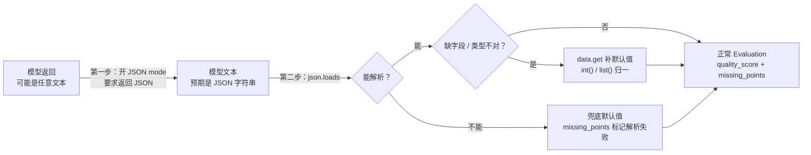
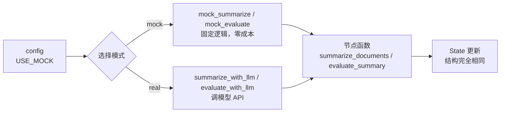

# 08. LLM 调用与提示词组织

> 版本说明：本教程基于 **Python 3.10+，推荐 3.13；LangGraph 1.x**。

## 本章导读

贯穿项目到了关键一步：前几章的 `summarize_documents` 和 `evaluate_summary` 都是**固定字符串拼接**。真实 Agent 需要让 LLM 处理"不确定的语言任务"——理解资料、生成总结、评估质量。

这一章回答四个问题：

1. LangGraph 和 LLM 的职责边界在哪？
2. 为什么 Prompt 要当成"接口契约"来设计？
3. 模型输出怎么做到结构化、可解析、可兜底？
4. 模拟模式和真实模式怎么切换？

涉及代码：`code/step_by_step/08_llm_mock.py`、`08_llm_real.py`、`code/langgraph_intro_project/app/llm.py`、`app/prompts/*.md`

---

## 本章目标

- 理解"LangGraph 编排、LLM 处理语言"的职责分工。
- 用 Prompt 明确模型的输入和输出契约。
- 掌握结构化输出的三种方式及对比。
- 实现模型返回非 JSON 时的兜底处理。
- 用配置开关切换模拟 / 真实模式。

---

## 为什么需要这一章

如果把贯穿项目继续用固定逻辑写，`evaluate_summary` 永远只能"看长度打分"——这不是 Agent，是规则脚本。真正的 Agent 需要让 LLM 去理解内容质量。

但引入 LLM 带来了生产中最常见的问题：

- **输出不稳定**：同一个 Prompt，模型这次返回 JSON，下次加一段"好的！"。
- **格式难解析**：结构化数据提取失败，下游直接崩。
- **Prompt 散落**：几十个节点各自拼接字符串，改个措辞到处找。

这些问题的解法是统一的：**把 LLM 调用封装成一个有契约的"服务"**，节点只跟契约交互。

---

## 核心概念

### LangGraph 负责编排，LLM 负责语言

| 职责 | 属于谁 |
|---|---|
| 流程控制（分支、循环、重试） | LangGraph |
| 状态管理与持久化 | LangGraph |
| 理解语言、生成文本、做判断 | LLM |
| 连接外部系统 | 工具（第 07 章） |

**不要把 LangGraph 当模型，也不要把模型当流程引擎。** LLM 只负责"内容生产"，它不应该决定"下一步执行哪个节点"——那是路由函数的职责（第 06 章）。

### Prompt 是接口契约

服务端接口会定义请求和响应结构。LLM 节点的 Prompt 也应该这样做——明确告诉模型"输入是什么、输出必须是什么"。

反例（契约不清晰）：

```text
请评价一下这个总结。
```

正例（契约清晰）：

```text
请评估以下总结的质量，输出 JSON：
{"quality_score": 80, "missing_points": ["缺少部署说明"]}

总结：
{summary}
```

### 结构化输出：三种方式

| 方式 | 做法 | 优点 | 缺点 |
|---|---|---|---|
| 手写解析 + 兜底 | 让模型输出 JSON，`json.loads` 解析，失败给默认值 | 零依赖，可控 | 解析代码要自己写 |
| JSON mode | `response_format={"type": "json_object"}` | 模型保证输出 JSON | 仍需兜底（可能为空/缺字段） |
| `with_structured_output` | Pydantic 模型 + SDK 自动解析 | 类型安全、校验自动 | 依赖具体 SDK |

本教程的 `08_llm_real.py` 用**方式 1 + 方式 2 组合**：开 JSON mode 降低失败率，同时手写兜底防极端情况。

### 兜底处理：模型输出不听话时怎么办

模型返回非 JSON 时，流程**不能崩**。兜底模式：

```python
try:
    data = json.loads(text)
    return {
        "quality_score": int(data.get("quality_score", 0)),
        "missing_points": list(data.get("missing_points", [])),
    }
except (json.JSONDecodeError, TypeError, ValueError):
    return {"quality_score": 0, "missing_points": ["模型输出不是合法 JSON"]}
```

要点：

- `data.get(key, 默认值)` 处理**缺字段**。
- `int(...)` / `list(...)` 处理**类型不对**。
- `except` 给出**业务上合理的默认值**，而不是让流程崩溃。
- 兜底结果最好带标记（如 `missing_points` 里写"解析失败"），让下游能识别。

整个处理链路是一条"从不可信输入到结构化输出"的防御流水线：



每一步都在做同一件事：**把"模型可能给出的各种坏输出"，收敛成一个结构确定、业务可用的 `Evaluation`**。

### Prompt 的组织模式

**模式一：模板文件化（项目结构推荐）**

把 Prompt 放到独立文件，例如 `app/prompts/summarize.md`、`app/prompts/evaluate.md`，代码里加载并格式化：

```python
from pathlib import Path

PROMPT_DIR = Path(__file__).resolve().parent / "prompts"

def load_prompt(name: str) -> str:
    return (PROMPT_DIR / f"{name}.md").read_text(encoding="utf-8")

prompt = load_prompt("summarize").format(topic=topic, documents=json.dumps(documents))
```

好处：Prompt 与代码分离，改措辞不改代码、便于评审和版本管理。

**模式二：三段式结构（所有 Prompt 通用）**

```text
1. 系统指令：你是谁、你要做什么（角色 + 目标）
2. 上下文：输入的资料、数据（动态填充）
3. 输出契约：必须输出的格式、示例、约束
```

以 `app/prompts/summarize.md` 为例：

```text
请基于资料总结主题：{topic}

资料：
{documents}

要求：
1. 用中文输出
2. 结构清晰
3. 不要编造资料中没有的信息
```

### 模拟模式 vs 真实模式

| 对比维度 | 模拟模式 | 真实模式 |
|---|---|---|
| 是否调用模型 API | 否，固定逻辑 | 是 |
| 结果可复现 | 完全可复现 | 受网络/模型影响 |
| 适用场景 | 教程、测试、调试 | 验证真实效果 |
| 成本 | 0 | 按 token 计费 |

项目里用**配置开关**切换（`app/config.py`）：

```python
USE_MOCK = os.getenv("USE_MOCK", "true")   # "true" 或 "false"
```

节点层根据模式选择调用哪个函数——节点本身保持结构不变。

---

## 最小代码示例

创建 `code/step_by_step/08_llm_mock.py`（模拟模式）：

```python
from typing import TypedDict

from langgraph.graph import END, START, StateGraph


class SearchResult(TypedDict):
    title: str
    content: str


class Evaluation(TypedDict):
    quality_score: int
    missing_points: list[str]


class ResearchState(TypedDict):
    topic: str
    documents: list[SearchResult]
    summary: str
    quality_score: int
    missing_points: list[str]


def mock_summarize(topic: str, documents: list[SearchResult]) -> str:
    titles = "、".join(doc["title"] for doc in documents)
    return f"主题《{topic}》的总结。参考资料：{titles}"


def mock_evaluate(summary: str) -> Evaluation:
    if len(summary) > 40:
        return {"quality_score": 85, "missing_points": []}
    return {"quality_score": 60, "missing_points": ["总结太短"]}


def summarize_documents(state: ResearchState) -> dict[str, str]:
    return {
        "summary": mock_summarize(state["topic"], state["documents"])
    }


def evaluate_summary(state: ResearchState) -> dict[str, object]:
    result = mock_evaluate(state["summary"])
    return {
        "quality_score": result["quality_score"],
        "missing_points": result["missing_points"],
    }


builder = StateGraph(ResearchState)
builder.add_node("summarize_documents", summarize_documents)
builder.add_node("evaluate_summary", evaluate_summary)
builder.add_edge(START, "summarize_documents")
builder.add_edge("summarize_documents", "evaluate_summary")
builder.add_edge("evaluate_summary", END)

graph = builder.compile()


if __name__ == "__main__":
    result = graph.invoke({
        "topic": "LangGraph",
        "documents": [
            {"title": "LangGraph 入门资料", "content": "关于 LangGraph 的模拟资料。"},
            {"title": "LangGraph 实战资料", "content": "关于 LangGraph 实战的模拟资料。"},
        ],
        "summary": "",
        "quality_score": 0,
        "missing_points": [],
    })
    print(result)
```

运行：

```powershell
cd code/step_by_step
python 08_llm_mock.py
```

预期输出：

```text
{'topic': 'LangGraph', 'documents': [{'title': 'LangGraph 入门资料', 'content': '关于 LangGraph 的模拟资料。'}, {'title': 'LangGraph 实战资料', 'content': '关于 LangGraph 实战的模拟资料。'}], 'summary': '主题《LangGraph》的总结。参考资料：LangGraph 入门资料、LangGraph 实战资料', 'quality_score': 85, 'missing_points': []}
```

---

## 执行过程拆解

**第 1 步：`summarize_documents`**

- 调 `mock_summarize(topic, documents)`：把资料标题拼成总结。
- 写入 `summary`。注意此时代码里 `len(summary) > 40` 会为 True（总结较长），`quality_score` 会是 85。

**第 2 步：`evaluate_summary`**

- 调 `mock_evaluate(summary)`：根据总结长度打分。
- 写入 `quality_score` 和 `missing_points`。

**第 3 步：返回完整状态。**

**关键点**：`mock_summarize` 和 `mock_evaluate` 返回的都是**结构化数据**（`str` 和 `Evaluation` 字典），和真实模式的结构完全一致。**这就是"先模拟后真实"能无缝替换的原因**——契约相同。

两种模式的切换关系：



节点层不关心走哪条路，只关心返回结构——这就是"契约相同"带来的可替换性。

---

## 贯穿项目改造

本章之后，贯穿项目具备：

- 基于资料生成总结（`summary`）。
- 对总结打分（`quality_score`）。
- 输出缺失点（`missing_points`）。

这三个字段会在第 09 章用于循环判断（"质量不够就再搜一轮"）。

**真实模式替换思路**（对应 `app/llm.py`）：

```python
def summarize_with_llm(topic: str, documents: list[SearchResult]) -> str:
    prompt = load_prompt("summarize").format(
        topic=topic,
        documents=json.dumps(documents, ensure_ascii=False, indent=2),
    )
    return _call_llm(prompt)
```

替换三步骤：

1. **保留节点结构**：`summarize_documents` 的签名和返回不变。
2. **替换实现**：把 `mock_summarize` 换成 `summarize_with_llm`。
3. **切换开关**：`USE_MOCK` 配置从 `true` 改成 `false`。

节点不知道也不关心实现细节——这就是"封装 LLM 调用"的意义。

---

## 代码运行方式

**模拟模式（推荐先跑）：**

```powershell
cd code/step_by_step
python 08_llm_mock.py
```

**真实模式（需要 API Key）：**

```powershell
$env:OPENAI_API_KEY="你的 API Key"
python 08_llm_real.py
```

真实模式会调用 OpenAI 兼容接口，输出依赖模型结果，无法完全复现。它演示了 `_call_llm` 的封装和 JSON 兜底逻辑。

---

## 调试与排查

### 场景一：模型返回非 JSON，流程崩溃

**现象**：`json.loads(text)` 抛 `JSONDecodeError`。

**原因**：模型输出带了解释文字、Markdown 代码块包裹（```json ... ```）等。

**排查**：按顺序处理——

1. 开 JSON mode（`response_format`），先让模型尽量只返回 JSON。
2. 最外层兜底：解析失败返回默认值，不让图崩溃。
3. 需要兼容更多模型时，再增加清洗逻辑（例如去掉 ```` ```json ```` 包裹）。

### 场景二：`quality_score` 类型对不上

**现象**：下游 `score >= 80` 报错或行为诡异。

**原因**：模型返回 `"80"`（字符串）或 `80.0`（浮点）。

**排查**：强制转换 `int(data.get("quality_score", 0))`，把类型归一。

### 场景三：模拟模式正常，真实模式结果差

**现象**：真实模型的总结没有遵守"不要编造资料中没有的信息"。

**原因**：Prompt 约束不够强，或模型版本/温度设置问题。

**排查**：把 `temperature` 调低（示例用 0.2）；输出契约给正反例；必要时在节点里加后置校验（如检测总结是否引用了资料内容）。

### 场景四：API Key 报错

```text
RuntimeError: 未设置 OPENAI_API_KEY
```

**原因**：环境变量没配。

**排查**：确认 `.env` 存在且键名正确，代码开头执行 `load_dotenv()`。

---

## 常见错误

| 现象 | 原因 | 解决 |
|---|---|---|
| Prompt 太散，输出结构不可控 | 没有输出契约 | 三段式 Prompt：指令/上下文/契约 |
| 节点直接依赖模型 SDK | 封装缺失 | LLM 调用收进独立函数/模块 |
| 测试依赖真实模型 | 没做 mock | 模拟模式保证测试可复现 |
| 模型返回非 JSON 直接崩 | 没有兜底 | 解析失败给默认值 |
| 改个 Prompt 满仓库找 | Prompt 内联在节点里 | 模板文件化（`app/prompts/*.md`） |
| `with_structured_output` 配置复杂 | 入门阶段过度设计 | 先用手写解析 + 兜底 |

---

## 练习任务

**必做 1：修改模拟评估逻辑**

让 `mock_evaluate()` 在总结包含"风险"时加 10 分。

自查：输入一个含"风险"的总结，`quality_score` 比不含时高 10 分。

**必做 2：手写一段兜底**

自己写一个函数，接收一段"模型输出"（可能是合法 JSON、带 Markdown 包裹、纯文本三种情况），统一返回 `Evaluation` 结构。

自查：三种输入都能返回合法的 `Evaluation`，且非法输入带"解析失败"标记。

**扩展练习：Pydantic 校验**

安装 `pydantic`，定义 `EvaluationModel(BaseModel)`，用 `model_validate()` 校验模型返回值，失败时给默认值。

自查：你能否对比出"手写兜底"和"Pydantic 校验"在代码量、错误信息上的差异？

---

## 本章小结

- **职责分工**：LangGraph 管编排，LLM 管语言内容。
- **Prompt 即契约**：明确输入、明确输出结构，配正反例。
- **结构化输出三选一**：手写解析 + 兜底（本教程）、JSON mode、`with_structured_output`。
- **兜底不能省**：模型输出要当"不可信外部输入"处理。
- **模拟 / 真实模式**：契约一致，配置开关切换。

下一章用 `quality_score` 控制循环——质量不达标就回到检索，这是 Agent 自我修正能力的开始。

---

## 本章速查

**结构化输出兜底模板**

```python
def parse_evaluation(text: str) -> Evaluation:
    try:
        data = json.loads(text)
        return {
            "quality_score": int(data.get("quality_score", 0)),
            "missing_points": list(data.get("missing_points", [])),
        }
    except (json.JSONDecodeError, TypeError, ValueError):
        return {"quality_score": 0, "missing_points": ["模型输出不是合法 JSON"]}
```

**Prompt 三段式**

```text
[系统指令] 你是一个……请完成……
[上下文]   资料/数据：{...}
[输出契约] 输出 JSON：{"字段": 示例}，要求……
```

**加深阅读**

- 系统笔记：`LangGraph-笔记/01-LangGraph基础入门.md` 的「1.0 LangGraph 与 LangChain 定位」中关于 LLM 抽象的部分
- 官方文档：[LangChain 结构化输出](https://docs.langchain.com/oss/python/langchain/structured_output)
