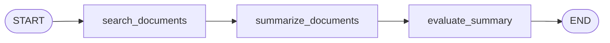
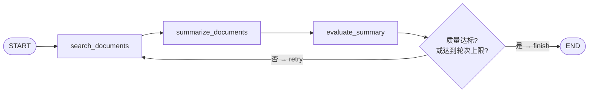
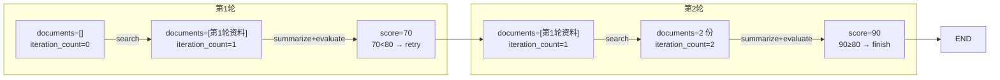

# 09. 循环、重试与递归限制

> 版本说明：本教程基于 **Python 3.13 + LangGraph 1.x**。

## 本章导读

贯穿项目还差一块核心拼图：**循环**。资料不足时，Agent 需要继续检索；总结质量不达标时，需要补充资料后重新总结。这就是"业务循环"。

但循环必须**可终止**，否则一次图调用会无限跑下去。LangGraph 提供了两道防线：

- **业务层的结束条件**：质量达标就停（你控制）。
- **运行时的 `recursion_limit`**：代码写错了也要能兜底（框架控制）。

学完这一章，贯穿项目第一次具备"自我修正"能力。

涉及代码：`code/step_by_step/09_loop_and_limit.py`

---

## 本章目标

- 理解 Agent 为什么需要循环。
- 用状态字段设计可终止的业务循环。
- 掌握 `recursion_limit` 的作用和用法。
- 区分"失败重试"和"业务重试"。
- 认识并排查 `GraphRecursionError`。

---

## 为什么需要这一章

第 08 章结束时，图是这样一条直线：



问题：**评估完质量，无论合不合格都直接结束。** 质量 60 分也结束，这和"Agent 自我修正"的预期不符。

真实的行为应该是：

- 质量达标 → 结束。
- 质量不达标、且没超过最大轮次 → **回到检索，再来一轮**。

把"回到检索"画出来，图里就出现了**回路**。这就是循环。

---

## 核心概念

### 业务循环：用状态字段控制

循环是否继续，由状态字段决定：

```python
iteration_count: int   # 当前已执行的轮次
max_iterations: int    # 业务允许的最大轮次
quality_score: int     # 质量分，决定是否继续
```

路由函数读这些字段做判断：

```python
def route_after_evaluation(state) -> Literal["retry", "finish"]:
    if state["quality_score"] >= 80:                    # 达标了
        return "finish"
    if state["iteration_count"] >= state["max_iterations"]:  # 达到上限
        return "finish"
    return "retry"
```

**两个结束条件缺一不可**：

- `quality_score >= 80`：**业务正确性**，达标就停。
- `iteration_count >= max_iterations`：**资源上限**，不达标也不能无限烧钱。

### recursion_limit：运行时保护

`recursion_limit` 是 LangGraph 的运行时防线，防止"代码写错时无限执行"。它在**调用图时通过 config 传入**：

```python
result = graph.invoke(
    initial_state,
    {"recursion_limit": 100},
)
```

默认值很大（约 10007 步）。当执行步数超过限制时，抛出 `GraphRecursionError`。

**两个限制的对比：**

| 对比维度 | 业务循环限制 | `recursion_limit` |
|---|---|---|
| 谁负责 | 你的业务代码 | LangGraph 运行时 |
| 解决什么问题 | "什么时候应该停"（业务语义） | "代码写错时不要无限跑"（安全网） |
| 判定依据 | `quality_score` / `iteration_count` | 执行步数 |
| 超限表现 | 走 `finish` 分支 | 抛 `GraphRecursionError` |

**结论：两个都要设。** 只设 `recursion_limit` 是"防崩"，不是业务正确；只设业务限制，代码 bug 时可能形成死循环。

### GraphRecursionError：真实报错长这样

故意制造一个死循环（路由永远返回 `"again"`）：

```python
def route(state) -> Literal["again", "end"]:
    return "again"   # 永远循环

# invoke 时：
GraphRecursionError: Recursion limit of 10007 reached without hitting a stop
condition. You can increase the limit by setting the `recursion_limit` config key.
```

**排查方向**：

1. 路由函数的分支条件是否**可能永远不满足**（例如 `quality_score` 永远到不了 80，且 `iteration_count` 没在增长）。
2. 是否**忘了更新 `iteration_count`**——计数不涨，上限永远到不了。
3. 是否**循环边指回了错误的节点**。

### 失败重试 vs 业务重试

| 对比维度 | 失败重试（技术重试） | 业务重试（循环） |
|---|---|---|
| 触发原因 | 瞬时故障（超时、网络抖） | 业务不达标（质量分不够） |
| 目的 | 让同一次调用成功 | 补充数据后重新决策 |
| 位置 | 工具函数内部 / 节点执行 | 图的边 |
| 示例 | 第 07 章的 `for attempt in range(3)` | 本回路的 `retry` 分支 |

**不要混为一谈**：工具超时重试是"容错"，业务循环是"决策"。图里看到"重试"，先问自己：重试的是同一次操作，还是重新走一遍流程？

---

## 最小代码示例

创建 `code/step_by_step/09_loop_and_limit.py`：

```python
from typing import Literal, TypedDict

from langgraph.graph import END, START, StateGraph


class ResearchState(TypedDict):
    topic: str
    documents: list[str]
    summary: str
    quality_score: int
    iteration_count: int
    max_iterations: int


def search_documents(state: ResearchState) -> dict[str, object]:
    next_count = state["iteration_count"] + 1
    return {
        "documents": state["documents"] + [f"第 {next_count} 轮检索资料"],
        "iteration_count": next_count,
    }


def summarize_documents(state: ResearchState) -> dict[str, str]:
    return {"summary": f"基于 {len(state['documents'])} 份资料生成总结"}


def evaluate_summary(state: ResearchState) -> dict[str, int]:
    score = min(50 + len(state["documents"]) * 20, 95)
    return {"quality_score": score}


def route_after_evaluation(state: ResearchState) -> Literal["retry", "finish"]:
    if state["quality_score"] >= 80:
        return "finish"
    if state["iteration_count"] >= state["max_iterations"]:
        return "finish"
    return "retry"


builder = StateGraph(ResearchState)
builder.add_node("search_documents", search_documents)
builder.add_node("summarize_documents", summarize_documents)
builder.add_node("evaluate_summary", evaluate_summary)

builder.add_edge(START, "search_documents")
builder.add_edge("search_documents", "summarize_documents")
builder.add_edge("summarize_documents", "evaluate_summary")
builder.add_conditional_edges(
    "evaluate_summary",
    route_after_evaluation,
    {"retry": "search_documents", "finish": END},
)

graph = builder.compile()


if __name__ == "__main__":
    result = graph.invoke(
        {
            "topic": "LangGraph",
            "documents": [],
            "summary": "",
            "quality_score": 0,
            "iteration_count": 0,
            "max_iterations": 3,
        },
        {"recursion_limit": 20},
    )
    print(result)
```

运行：

```powershell
cd code/step_by_step
python 09_loop_and_limit.py
```

预期输出：

```text
{'topic': 'LangGraph', 'documents': ['第 1 轮检索资料', '第 2 轮检索资料'], 'summary': '基于 2 份资料生成总结', 'quality_score': 90, 'iteration_count': 2, 'max_iterations': 3}
```

图结构：



---

## 执行过程拆解

评分规则：`score = min(50 + 资料数 * 20, 95)`。追踪 `iteration_count` 的变化：

| 轮次 | 执行节点 | 执行后 documents | score | 路由判断 | 结果 |
|---|---|---|---|---|---|
| — | 注入初始状态 | `[]` | 0 | — | — |
| 第 1 轮 | search → summarize → evaluate | `["第 1 轮检索资料"]` | `min(70, 95)=70` | 70 < 80，1 < 3 | `retry` |
| 第 2 轮 | search → summarize → evaluate | 2 份资料 | `min(90, 95)=90` | 90 >= 80 | `finish` |

用图看状态怎么一步步"滚"起来：



每一轮循环，`documents` 和 `iteration_count` 都比上一轮多一份，直到 `score` 跨过达标线或轮次触顶。

注意两个细节：

1. **`iteration_count` 在第 1 轮后变成 1，第 2 轮后变成 2**。最终输出 `iteration_count: 2`。
2. **退出原因是"达标"，不是"超限"**——`max_iterations: 3` 没有用到。如果把达标分数改成 95（需要 3 份资料才够），会触发"达到轮次上限退出"的分支。

这就是"业务结束条件 + 资源上限"双保险的意义：**正常情况靠达标退出，异常情况靠上限兜底。**

---

## 贯穿项目改造

贯穿项目的循环逻辑成型：

```text
search_documents
  -> summarize_documents
  -> evaluate_summary
  -> 质量达标？结束
  -> 质量不达标且未超次数？回到 search_documents
```

说明：

- `quality_score` 来自第 08 章的 `evaluate_summary`（真实模式由 LLM 打分）。
- `iteration_count` / `max_iterations` 是本章新增的循环控制字段。
- 循环边 `"retry": "search_documents"` 指回检索节点，形成回路。
- 超出上限仍不达标时，需要给用户"当前最佳报告 + 风险标记"——这是第 15 章生产化清单的内容。

---

## 代码运行方式

```powershell
cd code/step_by_step
python 09_loop_and_limit.py
```

**对比实验一**：把达标分数从 80 改成 95，重新运行。

自查：输出变为 3 轮（`iteration_count: 3`）——因为评分规则 `min(50 + 资料数 * 20, 95)` 下，2 份资料得 90 分仍不达标，需要第 3 轮凑满 3 份资料得 95 分。你能用轮次表推演出这个结果吗？

**对比实验二**：把达标分数改成 `999`（永远达不到），观察循环如何被 `max_iterations` 拦住。

自查：输出 `iteration_count: 3`（达到上限退出），且不会抛 `GraphRecursionError`——因为业务上限先于运行时限制生效。

---

## 调试与排查

### 场景一：`GraphRecursionError`

报错文本：

```text
GraphRecursionError: Recursion limit of 10007 reached without hitting a stop condition.
```

**原因**：循环没有终止条件，或终止条件永远不满足。

**排查清单**：

1. 路由函数里 `quality_score` 的判断条件是否可达？
2. `iteration_count` 是否真的在增长（节点有没有返回更新）？
3. `max_iterations` 是否设置且判断正确？
4. `recursion_limit` 是否设置，避免默认 10007 步才报错、浪费资源？

### 场景二：循环次数比预期多一轮/少一轮

**现象**：`iteration_count` 的最终值不对。

**原因**：计数逻辑和路由判断的时序没对齐。常见错误——`search_documents` 里 `next_count = state["iteration_count"] + 1`，但路由判断用了**旧的** `iteration_count`。

**排查**：用本章"执行过程拆解"的轮次表逐行推演，打印每一步的状态（直接调用节点函数，见第 04 章技巧）。

### 场景三：`recursion_limit` 设置无效

```python
graph.invoke(input, {"recursion_limit": 20})
```

**现象**：还是报错，但步数不是 20。

**原因**：`recursion_limit` 必须放在 config 字典的第二层正确位置（`{"recursion_limit": N}` 即可，不要嵌套进 `{"configurable": {...}}`）。

> 这里容易混：`thread_id` 在 `config["configurable"]["thread_id"]`，而 `recursion_limit` 在 `config["recursion_limit"]`。原因很简单——`configurable` 是"业务会话参数"，`recursion_limit` 是"运行时执行参数"，LangGraph 把它们放在 config 的不同层级。对照第 10 章的 `config = {"configurable": {"thread_id": "..."}}` 就能区分。

**排查**：对照示例代码的调用方式。

### 场景四：无限循环烧掉大量 token

**现象**：日志显示节点被执行了几十上百次。

**原因**：循环里包含真实 LLM 调用（第 08 章的 `summarize_with_llm`），每次循环都在烧钱。

**排查**：**任何真实成本操作都必须先有业务上限**。`max_iterations` 是硬约束，`recursion_limit` 是最后一道安全网。

---

## 常见错误

| 现象 | 原因 | 解决 |
|---|---|---|
| `GraphRecursionError` | 循环无终止条件 | 业务结束条件 + `recursion_limit` 双保险 |
| 循环永不退出 | 忘了更新 `iteration_count` | 计数字段必须在循环节点里递增 |
| 只设 `recursion_limit` 不设业务上限 | 误解两者职责 | 达标退出靠业务，防崩靠运行时 |
| 失败重试和业务循环混用 | 概念混淆 | 工具超时重试是容错，质量不达标循环是决策 |
| 循环里烧大量 token | 无成本上限 | `max_iterations` 设小，真实调用前加检查 |
| 路由判断用了旧计数 | 更新和判断时序错位 | 用轮次表推演 + 打印状态 |

---

## 练习任务

**必做 1：修改达标分数**

把达标分数从 80 改成 90，观察循环次数变化。

自查：你能用"执行过程拆解"的表格推演出新的循环次数吗？运行结果和你的推演一致吗？

**必做 2：加 `risk_note` 字段**

增加 `risk_note: str` 字段：达到 `max_iterations` 仍不达标时，`finish` 分支里写入"已达到最大轮次，当前结果可能不完整"。

自查：质量永远不达标时，最终状态里 `risk_note` 非空；正常达标时为空字符串。

**扩展练习：触发真实 `GraphRecursionError`**

把 `route_after_evaluation` 改成永远返回 `"retry"`，并把 `recursion_limit` 设成 `10`，观察报错。

自查：你能复现文档里的 `GraphRecursionError` 报错文本，并解释为什么 `recursion_limit` 挡在了业务上限前面？

---

## 本章小结

- 业务循环用状态字段控制：`iteration_count`、`max_iterations`、`quality_score`。
- `recursion_limit` 是运行时安全网，调用图时通过 config 传入。
- 两个结束条件缺一不可：**达标退出**（业务正确）+ **上限兜底**（资源保护）。
- 失败重试（容错）和业务循环（决策）是两回事。
- `GraphRecursionError` 的排查顺序：路由条件 → 计数增长 → 上限判断 → `recursion_limit`。

下一章加入持久化，让长流程可以保存和恢复——循环再长也不怕中断。

---

## 本章速查

**循环路由函数模板**

```python
def route(state: ResearchState) -> Literal["retry", "finish"]:
    if state["quality_score"] >= threshold:      # 业务达标
        return "finish"
    if state["iteration_count"] >= state["max_iterations"]:  # 资源上限
        return "finish"
    return "retry"
```

**图调用带限制**

```python
result = graph.invoke(input, {"recursion_limit": 100})
```

**加深阅读**

- 系统笔记：`LangGraph-笔记/02-LangGraph控制流与节点执行.md` 的「4.4 循环结构」与「4.4.2 引入递归限制」
- 官方文档：[GraphRecursionError 排查](https://docs.langchain.com/oss/python/langgraph/errors/GRAPH_RECURSION_LIMIT)
