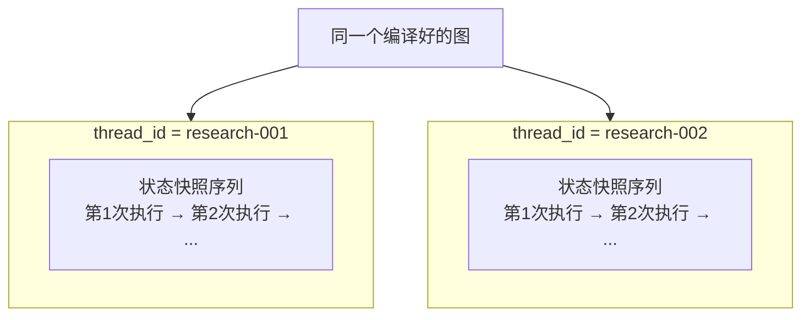
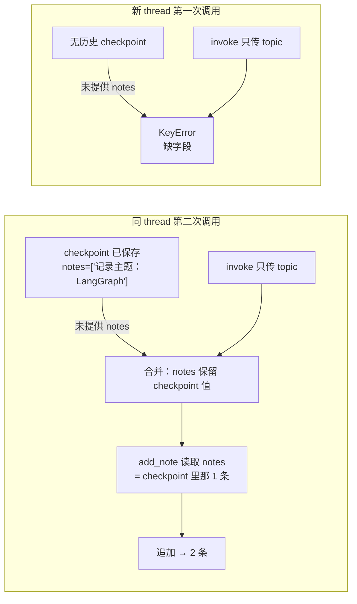

# 10. 持久化与会话恢复

> 版本说明：本教程基于 **Python 3.10+，推荐 3.13；LangGraph 1.x**。

## 本章导读

第 09 章的 Agent 已经能循环自我修正了，但它有个致命问题：**执行状态只活在内存里**。服务重启、请求中断、用户稍后回来，一切从头再来。

这一章引入 LangGraph 的持久化能力：**checkpointer + `thread_id`**。它让 Agent 可以：

- 在任意时刻保存执行状态。
- 用同一个 `thread_id` 恢复上次的会话。
- 为第 11 章的人工确认（暂停后继续）打基础。

涉及代码：`code/step_by_step/10_persistence.py`

---

## 本章目标

- 理解 Agent 为什么需要持久化。
- 掌握 checkpointer 与 `thread_id` 的关系。
- 理解"同一个 thread 恢复状态 / 不同 thread 状态隔离"的实际行为。
- 区分 checkpointer（短期状态）和 store（长期记忆）。
- 知道内存型 checkpointer 为什么不能用于生产。

---

## 为什么需要这一章

真实 Agent 有两个特点：

1. **运行时间长**：一个研究任务可能跑几分钟，甚至等待人工确认数小时。
2. **会被中断**：服务重启、进程崩溃、HTTP 请求断开。

没有持久化时，这些情况都会导致状态丢失。你可能已经意识到：**第 11 章的人工确认，本质上就是"暂停 + 恢复"**——没有持久化，暂停就无从谈起。

LangGraph 的持久化模型：

```text
graph = builder.compile(checkpointer=checkpointer)
```

编译时挂一个 **checkpointer**，图在每次节点执行后自动保存状态快照。之后用 `thread_id` 找回这条状态。

---

## 核心概念

### checkpointer：保存线程级执行状态

checkpointer 负责保存"一次会话（thread）的执行状态"。LangGraph 会在**每个节点执行后**自动写入快照，不需要你手动调用。

```python
from langgraph.checkpoint.memory import InMemorySaver

checkpointer = InMemorySaver()                     # 内存型
graph = builder.compile(checkpointer=checkpointer) # 编译时挂载
```

`InMemorySaver` 是内存型实现：快照存在进程内存里，**进程重启即丢失**。它只适合教程和本地实验。

### thread_id：一条会话的身份证

`thread_id` 是 config 里的一个标识，区分不同的会话：

```python
config = {"configurable": {"thread_id": "research-001"}}
```



- **同一个 `thread_id`**：多次调用共享同一条状态链，后一次能看到前一次的结果。
- **不同 `thread_id`**：状态完全隔离，互不可见。

这里的 `thread_id` 不是“一次 `invoke()` 的编号”，而是“一条会话的编号”。  
所以第一次调用结束后，图虽然已经跑到 `END`，但 checkpoint 还在；第二次用同一个 `thread_id` 调用时，LangGraph 会先恢复这条会话的最新状态，再把这次输入合并进去继续跑。  
如果换成新的 `thread_id`，又不传完整初始字段，就没有历史 checkpoint 可恢复，才会报 `KeyError`。

### 一个关键行为（已实测）

挂上 checkpointer 后，**同一个 thread 的第二次调用，未提供的字段会从 checkpoint 恢复**：

```python
first = graph.invoke({"topic": "LangGraph", "notes": []}, config)
# 第一次执行后 notes = ["记录主题：LangGraph"]

second = graph.invoke({"topic": "LangGraph"}, config)   # 不传 notes
# notes 从 checkpoint 恢复为 ["记录主题：LangGraph"]，再追加一条
```

而**新 thread 没有历史状态**，缺字段会直接 `KeyError`（结合第 04 章的结论：LangGraph 不自动补默认值）。

这正是持久化与普通调用的本质区别：**恢复的状态来自 checkpoint，而不是靠调用方手动传回来。**

**为什么"少传字段还能跑"？** 一个容易困惑的点。在 LangGraph 的模型里，`invoke(input)` 的 `input` 被当作**对当前状态的增量更新**，而不是"从零开始的全量初始状态"：



- 有 checkpoint：缺失字段用历史值顶上（**恢复**）。
- 无 checkpoint：缺失字段无处可来，报 `KeyError`（**不自动补默认值**）。

### checkpointer 和 store：两种持久化

| 对比维度 | checkpointer | store |
|---|---|---|
| 保存什么 | 线程级短期执行状态 | 跨线程长期记忆 |
| 作用范围 | 单个 thread 内部 | 所有 thread 共享 |
| 典型数据 | 某次任务的中间状态 | 用户偏好、历史知识、长期资料 |
| 生命周期 | 任务结束即可清理 | 长期保留 |
| 本教程 | 第 10、11 章使用 | 不展开（进阶主题） |

**不要把二者混成一个概念**。一句话：checkpointer 管"这次任务走到哪了"，store 管"这个用户一直知道什么"。

### 持久化方案对比

| 方案 | 特点 | 适用场景 |
|---|---|---|
| `InMemorySaver` | 内存，重启丢失 | 教程、本地实验 |
| SQLite / `SqliteSaver` | 单机文件，持久化 | 小规模生产、单进程 |
| PostgreSQL / `PostgresSaver` | 数据库，可扩展、可并发 | 生产推荐 |
| LangGraph Platform | 托管服务 | 云上部署 |

入门阶段用 `InMemorySaver` 理解概念；第 15 章会讲生产迁移。

---

## 最小代码示例

创建 `code/step_by_step/10_persistence.py`：

```python
from typing import TypedDict

from langgraph.checkpoint.memory import InMemorySaver
from langgraph.graph import END, START, StateGraph


class ResearchState(TypedDict):
    topic: str
    notes: list[str]


def add_note(state: ResearchState) -> dict[str, list[str]]:
    return {
        "notes": state["notes"] + [f"记录主题：{state['topic']}"]
    }


builder = StateGraph(ResearchState)
builder.add_node("add_note", add_note)
builder.add_edge(START, "add_note")
builder.add_edge("add_note", END)

checkpointer = InMemorySaver()
graph = builder.compile(checkpointer=checkpointer)


def main() -> None:
    # 1. 第一次调用：初始化 thread research-001
    config = {"configurable": {"thread_id": "research-001"}}
    first = graph.invoke({"topic": "LangGraph 持久化", "notes": []}, config)
    print("第 1 次：", first)

    # 2. 第二次调用：同一个 thread，不传 notes —— 从 checkpoint 恢复
    second = graph.invoke({"topic": "LangGraph 持久化"}, config)
    print("第 2 次：", second)

    # 3. 新 thread：没有历史状态，缺 notes 会 KeyError
    try:
        graph.invoke(
            {"topic": "LangGraph 持久化"},
            {"configurable": {"thread_id": "other-002"}},
        )
    except KeyError as exc:
        print(f"新 thread 缺字段：KeyError: {exc}")


if __name__ == "__main__":
    main()
```

运行：

```powershell
cd code/step_by_step
python 10_persistence.py
```

预期输出：

```text
第 1 次： {'topic': 'LangGraph 持久化', 'notes': ['记录主题：LangGraph 持久化']}
第 2 次： {'topic': 'LangGraph 持久化', 'notes': ['记录主题：LangGraph 持久化', '记录主题：LangGraph 持久化']}
新 thread 缺字段：KeyError: 'notes'
```

---

## 执行过程拆解

**第 1 次调用（thread research-001）**

1. `invoke` 传入 `{"topic": ..., "notes": []}`，作为该 thread 的初始状态。
2. `add_note` 读取 `notes=[]`，追加一条，返回 1 条 notes。
3. checkpointer 保存快照：`notes=["记录主题：LangGraph 持久化"]`。

**第 2 次调用（同一 thread）**

1. `invoke` 只传 `{"topic": ...}`，**没传 `notes`**。
2. LangGraph 从 checkpoint 恢复该 thread 的状态：`notes` 变回上次保存的 1 条。
3. `add_note` 读取恢复后的 `notes`，追加第二条。
4. 结果：2 条 notes。

**第 3 次调用（新 thread other-002）**

1. 该 thread 没有任何历史 checkpoint。
2. `invoke` 只传 `topic`，没有 `notes`，也没有可恢复的状态。
3. `add_note` 读取 `state["notes"]` → `KeyError`。

三次调用的状态演进：

| 调用 | thread_id | 传入 | notes 来源 | 结果 |
|---|---|---|---|---|
| 第 1 次 | research-001 | `notes: []` | 调用方 | 1 条 |
| 第 2 次 | research-001 | 无 `notes` | **checkpoint 恢复** | 2 条 |
| 第 3 次 | other-002 | 无 `notes` | 无（KeyError） | 报错 |

---

## 贯穿项目改造

贯穿项目需要持久化的数据：

```python
class ResearchState(TypedDict):
    topic: str            # 用户主题
    search_queries: list[str]
    documents: list[str]  # 已检索资料
    summary: str          # 总结草稿
    quality_score: int
    iteration_count: int  # 循环轮次
    ...
```

真实产品里，每个"任务"对应一个 `thread_id`，例如 `research-{user_id}-{task_id}`。用户中断后回来，只要拿着同一个 `thread_id`，就能恢复整个任务。

**注意边界**：checkpointer 保存的是**执行状态**；业务数据（用户资料、最终报告）应该进**业务数据库**。不要把 checkpointer 当成你的数据库——它解决的是"流程恢复"，不是"数据存储"。

---

## 代码运行方式

```powershell
cd code/step_by_step
python 10_persistence.py
```

对比实验：

1. 把第 2 次调用改成**新 thread**，观察 notes 是空的还是恢复的。
2. 把第 2 次调用**显式传回 `first["notes"]`**，观察与"自动恢复"的差异。

自查：你能解释"自动从 checkpoint 恢复"和"调用方手动传回来"的本质区别吗？

---

## 调试与排查

### 场景一：忘记传 `thread_id`

**现象**：每次调用都是全新状态，无法恢复。

**原因**：没有 `thread_id`，LangGraph 每次生成随机线程，彼此隔离。

**排查**：确认 config 结构是 `{"configurable": {"thread_id": "xxx"}}`，且恢复时使用**同一个字符串**。

### 场景二：`KeyError`（新 thread 缺字段）

**现象**：

```text
KeyError: 'notes'
```

**原因**：新 thread 没有历史 checkpoint，且调用时没传完整初始状态。

**排查**：第一次调用一个 thread 时，必须传全 `ResearchState` 的必填字段（第 04 章结论：不自动补默认值）。或者用 `update_state()` 预置状态（见下方）。

### 场景三：想看 thread 当前状态

调试时用 `get_state()` 查看某个 thread 保存的最新快照：

```python
snapshot = graph.get_state(config)
print(snapshot.values)
```

想手动改状态用 `update_state(config, {...})`。这两个 API 是调试和人工介入（第 11 章）的重要工具。

### 场景四：进程重启后状态丢失

**现象**：重启脚本后，之前的 thread 状态不见了。

**原因**：`InMemorySaver` 是内存型，进程退出即销毁。

**排查**：这是预期行为。生产环境换 SQLite / Postgres 实现，checkpointer 代码不用改——`compile(checkpointer=...)` 的接口是统一的。

---

## 常见错误

| 现象 | 原因 | 解决 |
|---|---|---|
| 无法恢复会话 | 忘记传 / 传错 `thread_id` | 同一个任务用同一个固定 `thread_id` |
| 新 thread 报 `KeyError` | 首次调用缺初始字段 | 首次调用传全必填字段 |
| 用 `InMemorySaver` 上生产 | 误解内存型边界 | 换 SQLite / Postgres |
| 把业务数据全塞进 State | 混淆执行状态和业务数据 | 业务数据进数据库，State 只留流程数据 |
| 每次调用手动传回所有状态 | 不理解 checkpoint 恢复 | 不传的字段会自动从 checkpoint 恢复 |
| 把 checkpointer 当 store 用 | 概念混淆 | checkpointer=线程状态，store=长期记忆 |

---

## 练习任务

**必做 1：观察状态隔离**

把第 2 次调用换成新 `thread_id`（如 `"research-002"`），并补全初始字段，观察 notes 是否包含第 1 次的内容。

自查：不同 thread 的 notes 完全独立，互不影响。

**必做 2：体验自动恢复**

在第 2 次调用里**故意不传** `notes`，验证它从 checkpoint 恢复；再改成**显式传 `first["notes"]`**，对比两次的结果是否相同。

自查：你能说出 checkpoint 恢复的机制，以及为什么显式传回是"冗余"的？

**扩展练习：改用 SQLite**

安装 `langgraph-checkpoint-sqlite`，把 `InMemorySaver` 换成 SQLite 实现，重启脚本后再次用同一个 `thread_id` 调用，观察状态是否还在。

自查：换 checkpointer 后，图的构建和调用代码是否一行没改？

---

## 本章小结

- **checkpointer** 保存线程级执行状态，编译时挂载，节点执行后自动保存。
- **`thread_id`** 标识会话：同 thread 共享状态，不同 thread 隔离。
- 同一 thread 第二次调用，**未提供的字段从 checkpoint 恢复**。
- checkpointer（短期执行状态）≠ store（长期记忆）。
- `InMemorySaver` 只适合教程；生产用 SQLite / Postgres。

下一章是 LangGraph 最精彩的能力之一：**Human-in-the-loop**。它完全建立在持久化之上——暂停、给人看状态、等人反馈、恢复执行。

---

## 本章速查

**API 速查**

```python
from langgraph.checkpoint.memory import InMemorySaver

graph = builder.compile(checkpointer=InMemorySaver())
config = {"configurable": {"thread_id": "research-001"}}

result = graph.invoke(input, config)      # 带会话执行
snapshot = graph.get_state(config)        # 查看最新快照（调试）
graph.update_state(config, {...})         # 手动改状态（调试/介入）
```

**加深阅读**

- 系统笔记：`LangGraph-笔记/03-LangGraph持久化与记忆管理.md`（checkpointer 深入、SQLite/Postgres 实现、replay 与 fork）
- notebook：`langgraph/chapter03/01_in_memory.ipynb`、`02_in_SQL.ipynb`、`08_replay.ipynb`
- 官方文档：[LangGraph 持久化](https://docs.langchain.com/oss/python/langgraph/persistence)
