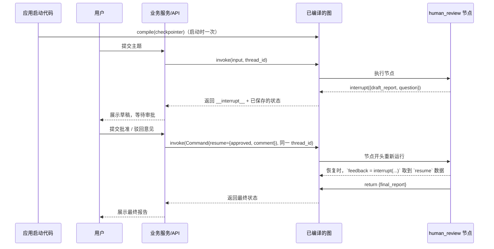
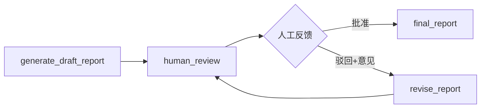

# 11. Human-in-the-loop：人工确认与人工修改

> 版本说明：本教程基于 **Python 3.10+，推荐 3.13；LangGraph 1.x**。

## 本章导读

真实业务里，Agent 不能总是自动完成所有决策：最终报告发布前要人工确认、模型低置信度时要人补充要求、涉及风险/审批/合规时必须让人介入。

LangGraph 的 human-in-the-loop（HITL）能力，让图在某个节点**暂停**，把中间状态交给调用方，等人反馈后再**恢复**执行。

这一章是上一章持久化的直接应用——暂停和恢复，本质上都是 checkpointer 在做状态保存。

涉及代码：`code/step_by_step/11_human_in_the_loop.py`、`code/langgraph_intro_project/app/nodes/human_review.py`

---

## 本章目标

- 理解哪些 Agent 步骤必须人工介入。
- 使用 `interrupt()` 暂停图执行。
- 使用 `Command(resume=...)` 恢复图执行。
- 理解"恢复执行会重跑触发中断的节点"这一语义及后果。
- 掌握 HITL 的工程约束（幂等、序列化、不要捕获异常）。

---

## 为什么需要这一章

考虑两个场景：

1. **发布审批**：Agent 生成了报告，但发布前必须有负责人确认。此时应该暂停。
2. **低置信度**：模型对某个判断把握很低，应该停下来问人，而不是硬着头皮继续。

如果不用 HITL，你只能把"人工确认"写成同步调用塞进节点里——这会阻塞整个图，也无法利用 checkpointer 在等待期间做状态管理。LangGraph 的 `interrupt()` 让暂停成为**图的一等公民**：状态保存在 checkpoint 里，等待多久都行，恢复时从断点继续。

---

## 核心概念

### interrupt()：暂停图，交出数据

```python
from langgraph.types import interrupt

def human_review(state) -> dict:
    feedback = interrupt({
        "draft_report": state["draft_report"],
        "question": "是否批准这份报告？",
    })
    # 恢复后从这里继续执行
    return {"final_report": state["draft_report"]}
```

这里要分清两个层次：

- `interrupt(...)` 是**节点代码里的函数调用**，作用是告诉 LangGraph：这里该暂停了。
- `__interrupt__` 里的 `Interrupt(...)` 是**`graph.invoke()` 返回结果的一部分**，不是第二次调用 `interrupt()`。
- 第一次执行到这一行时，图会停住；恢复时，这一行会重新执行，`feedback` 才会拿到 `Command(resume=...)` 传回来的值。
- `Interrupt.value` 就是当初传给 `interrupt()` 的上下文，`Interrupt.id` 是这次中断的标识。

第一次暂停时，调用方实际拿到的是 `graph.invoke()` 的返回值，`__interrupt__` 里直接装着 `Interrupt` 对象，更像这样：

```python
{
    "topic": "LangGraph HITL",
    "draft_report": "《LangGraph HITL》的报告草稿",
    "final_report": "",
    "__interrupt__": [
        Interrupt(
            value={
                "draft_report": "《LangGraph HITL》的报告草稿",
                "question": "是否批准这份报告？",
            },
            id="..."
        )
    ],
}
```

- `__interrupt__` 是列表，不是单个对象。
- `Interrupt.value` 就是你传给 `interrupt()` 的那份数据。
- `Interrupt.id` 是这次中断的标识，后端通常会一起保存，方便前端回填时关联这次审批。

`Interrupt(...)` 是 LangGraph 返回的 Python 对象打印形式，不是普通 JSON。读取时先从 `__interrupt__` 列表里取出对象，再用属性读取：

```python
interrupt_item = first["__interrupt__"][0]

# 中断 id
interrupt_id = interrupt_item.id

# interrupt({...}) 传出去的数据
payload = interrupt_item.value
question = payload["question"]
draft_report = payload["draft_report"]
```

如果要返回给前端，不要直接把 `Interrupt` 对象原样丢出去，通常会展开成普通 dict：

```python
{
    "interrupt_id": interrupt_item.id,
    "interrupt_question": payload["question"],
    "draft_report": payload["draft_report"],
}
```

### Command(resume=...)：把反馈传回去

```python
from langgraph.types import Command

# 第一次 invoke：触发中断，返回 __interrupt__
first = graph.invoke(input, config)

# 第二次 invoke：传入人工反馈，恢复执行
resumed = graph.invoke(
    Command(resume={"approved": False, "comment": "补充风险说明"}),
    config,
)
```

`Command(resume=...)` 是"继续执行"的指令，参数就是要交给 `interrupt()` 的返回值。

### 恢复执行语义：节点会重跑

这是 HITL 最重要的机制：**恢复执行时，会从触发 `interrupt()` 的节点开头重新运行**。

```python
def human_review(state) -> dict:
    send_email("通知审批人")       # ❌ 副作用：重跑会再发一次
    feedback = interrupt({...})    # 在这里暂停
    return {"final_report": ...}
```

节点开头到 `interrupt()` 之间的代码，在恢复时会**再执行一遍**。因此：

- `interrupt()` **之前**的副作用（发邮件、扣费、写库）必须**幂等**。
- 更稳妥：把外部写入、发消息、扣费这类副作用放到 `interrupt()` **之后**执行。
- 不要把 `interrupt()` 包在 `try/except` 里捕获——它异常是用于暂停的，捕获会破坏恢复机制。
- 同一个节点里有多个 `interrupt()` 时，不要随意增删或重排——恢复时是按顺序定位的，改动会导致恢复错位。

> **为什么 `interrupt()` 不能放进 `try/except`？** 它的暂停机制是"抛出一个特殊的 `GraphInterrupt` 异常"：运行时捕获到这个异常后，保存 checkpoint 并停止执行，把控制权交回调用方。如果你在节点里用 `except Exception` 把它吞掉，暂停信号就消失了，图会直接崩溃而不是干净地暂停。所以规则是：让 `interrupt()` 的异常自然传播，交给 LangGraph 运行时处理。

### `compile` 和 `invoke` 分别是谁调用？

这两个方法处在**不同阶段**，不要把它们理解成用户连续点击的两个按钮：

| 方法 | 什么时候调用 | 通常由谁调用 | 作用 |
|---|---|---|---|
| `compile()` | 应用启动或模块初始化时调用一次 | 开发者写的应用代码 / 服务进程 | 把节点和边编译成可执行的图对象，并挂载 checkpointer |
| `invoke()` | 每次开始执行或恢复执行时调用 | 业务服务、API 路由或脚本 | 用输入状态运行已经编译好的图 |

典型关系是：**先 `compile()`，后多次 `invoke()`**。

```python
# 应用启动时：开发者或服务进程执行一次
graph = builder.compile(checkpointer=checkpointer)

# 用户提交主题后：API / 脚本调用
result = graph.invoke(input_state, config)

# 用户提交审批意见后：API / 脚本再次调用，恢复同一个 thread
result = graph.invoke(Command(resume=feedback), config)
```

用户通常不直接调用 `compile()` 或 `invoke()`：用户在前端填写主题、点击提交或审批；后端代码负责把这些操作转换成 `invoke()` 调用。也就是说：

- `compile()` 是**组装应用**，不是执行任务。
- `invoke()` 是**执行任务**，不是编译图。
- `interrupt()` 是图在执行过程中把控制权交回后端，后端等待用户反馈。

### HITL 完整时序



两个关键点：

1. **两次 `invoke` 必须用同一个 `thread_id`**，否则恢复不到断点。
2. **恢复时不重传输入**，状态从 checkpoint 读取。

### 人工反馈 payload：要能序列化

`Command(resume=...)` 的数据会被写入 checkpoint，**必须能序列化**（dict / list / str / int 等）。不要传对象实例。

推荐结构：

```json
{
  "approved": false,
  "comment": "请补充资料来源和风险说明",
  "approved_by": "张三"
}
```

---

## 最小代码示例

创建 `code/step_by_step/11_human_in_the_loop.py`：

```python
from typing import TypedDict

from langgraph.checkpoint.memory import InMemorySaver
from langgraph.graph import END, START, StateGraph
from langgraph.types import Command, interrupt


class ResearchState(TypedDict):
    topic: str
    draft_report: str
    final_report: str


def write_draft(state: ResearchState) -> dict[str, str]:
    return {"draft_report": f"《{state['topic']}》的报告草稿"}


def human_review(state: ResearchState) -> dict[str, str]:
    feedback = interrupt({
        "draft_report": state["draft_report"],
        "question": "是否批准这份报告？",
    })

    if feedback.get("approved"):
        return {"final_report": state["draft_report"]}

    comment = feedback.get("comment", "需要修改")
    return {"final_report": f"{state['draft_report']}\n人工修改意见：{comment}"}


builder = StateGraph(ResearchState)
builder.add_node("write_draft", write_draft)
builder.add_node("human_review", human_review)
builder.add_edge(START, "write_draft")
builder.add_edge("write_draft", "human_review")
builder.add_edge("human_review", END)

checkpointer = InMemorySaver()
graph = builder.compile(checkpointer=checkpointer)


if __name__ == "__main__":
    config = {"configurable": {"thread_id": "review-001"}}

    first = graph.invoke(
        {"topic": "LangGraph HITL", "draft_report": "", "final_report": ""},
        config,
    )
    print(first)

    resumed = graph.invoke(
        Command(resume={"approved": False, "comment": "补充风险说明"}),
        config,
    )
    print(resumed)
```

运行：

```powershell
cd code/step_by_step
python 11_human_in_the_loop.py
```

预期输出（第一次调用部分）：

```text
{'topic': 'LangGraph HITL', 'draft_report': '《LangGraph HITL》的报告草稿', 'final_report': '', '__interrupt__': [Interrupt(value={'draft_report': '《LangGraph HITL》的报告草稿', 'question': '是否批准这份报告？'}, id='...')]}
```

预期输出（恢复调用部分）：

```text
{'topic': 'LangGraph HITL', 'draft_report': '《LangGraph HITL》的报告草稿', 'final_report': '《LangGraph HITL》的报告草稿\n人工修改意见：补充风险说明'}
```

### 怎么读取返回的数据

第一次 `invoke()` 触发 `interrupt()` 后，返回值会同时带着图状态和 `__interrupt__`。读取时先拿状态字段，再从 `__interrupt__` 里取中断信息：

```python
first = graph.invoke(
    {"topic": "LangGraph HITL", "draft_report": "", "final_report": ""},
    config,
)

# 先拿已经生成的状态字段
draft_report = first["draft_report"]

# 再读中断信息
interrupt_item = first["__interrupt__"][0]
interrupt_data = interrupt_item.value
interrupt_id = interrupt_item.id
question = interrupt_data["question"]
pending_draft = interrupt_data["draft_report"]
```

要点：

- `first["draft_report"]` 是图已经写回来的状态字段。
- `first["__interrupt__"][0].value` 是暂停时交给调用方的数据。
- `first["__interrupt__"][0].id` 是这次中断的标识，前端/后端可以一起保存。
- 如果是本章项目接口，后端已经把这些值展开成了 `interrupt_id`、`interrupt_question`、`draft_report` 等字段，调用方直接读这些扁平字段即可。

---

## 执行过程拆解

**第一次 `invoke`：**

1. `write_draft` 执行，`draft_report` 先写入状态。
2. `human_review` 执行到 `interrupt(...)`，图暂停。
3. 调用方拿到完整状态 + `__interrupt__`，可以直接读取草稿、问题和中断 id。
4. checkpointer 保存断点，等待下一次恢复调用。

**调用方响应：**

- 前端展示 `first["__interrupt__"][0].value`（草稿 + 问题）。
- 人工点击"驳回并补充意见"，产生反馈 `{"approved": False, "comment": "补充风险说明"}`。

**第二次 `invoke`（`Command(resume=...)`）：**

1. 用同一 `thread_id` 找到断点，恢复之前保存的状态。
2. `human_review` **从头重新运行**，直到再次执行到 `interrupt()`。
3. 这一次 `interrupt()` 直接拿到人工反馈 `{"approved": False, "comment": "补充风险说明"}`。
4. 节点读取反馈，走"驳回"分支。
5. 最终返回新的状态，`final_report` 里已经合并了修改意见。

---

## 贯穿项目改造

贯穿项目在生成最终报告前插入人工确认节点：



说明：

- `human_review` 只做"接收反馈、记录反馈"（工程版本见 `app/nodes/human_review.py`），后续节点根据反馈生成最终报告，职责更清晰。
- 人工反馈 payload 示例：

```json
{
  "approved": false,
  "comment": "请补充资料来源和风险说明"
}
```

- **审批流 vs 人工确认**：本教程的 HITL 是"单点确认 + 可修改"。真实审批流（多级审批、会签）是在这个基础上加业务规则，核心机制一样。

---

## 代码运行方式

```powershell
cd code/step_by_step
python 11_human_in_the_loop.py
```

**对比实验一**：把反馈改成 `{"approved": True}`，观察 `final_report` 直接等于草稿。

**对比实验二**：第二次 `invoke` 时**换一个 `thread_id`**，观察是否还能恢复。

自查：你能解释为什么换了 `thread_id` 就恢复失败吗？（回到第 10 章）

---

## 调试与排查

### 场景一：中断后无法恢复

**现象**：第二次 `invoke(Command(resume=...))` 报错，或直接重新跑了一遍。

**原因**：

1. 图没挂 checkpointer——`interrupt()` 必须配合 checkpointer 使用。
2. 两次调用的 `thread_id` 不一致。

**排查**：确认 `builder.compile(checkpointer=...)`；确认 config 的 `thread_id` 字符串完全一致。

### 场景二：恢复后副作用执行了两次

**现象**：发了一封重复的邮件 / 扣了两次费。

**原因**：副作用代码放在 `interrupt()` 之前，恢复重跑时又执行了一次。

**排查**：把副作用移到 `interrupt()` 之后；必须前置的话，做成幂等（用唯一 ID 去重）。

### 场景三：`interrupt()` 被 try/except 吞掉

**现象**：图没有暂停，或恢复行为异常。

**原因**：`interrupt()` 的暂停机制依赖它抛出的异常（`GraphInterrupt`），被捕获后就破坏了控制流。

**排查**：不要用 `try/except` 包裹 `interrupt()` 及其调用链。让它自然传播。

### 场景四：恢复后行为错乱

**现象**：恢复后跳到了错误的节点，或 `interrupt()` 返回的值不对。

**原因**：同一节点内多个 `interrupt()` 被增删或重排，恢复定位错位。

**排查**：同一个节点内保持 `interrupt()` 的数量和顺序稳定；需要多个暂停点用不同节点。

### 场景五：反馈数据无法序列化

**现象**：写入 checkpoint 时报错（如传了对象实例）。

**原因**：`Command(resume=...)` 的数据必须可序列化。

**排查**：只传 dict / list / str / int / bool。

---

## 常见错误

| 现象 | 原因 | 解决 |
|---|---|---|
| 中断后无法恢复 | 没有 checkpointer / thread_id 不一致 | 见"调试与排查-场景一" |
| 副作用执行两次 | 副作用在 `interrupt()` 之前 | 移到之后，或保证幂等 |
| `interrupt()` 不生效 | 被 try/except 捕获 | 让它自然传播 |
| 多个暂停点错乱 | 同节点内增删 `interrupt()` | 保持数量与顺序稳定 |
| 反馈对象序列化失败 | 传了非序列化对象 | 只传 dict/list/str/int/bool |
| 恢复时重新传初始状态 | 误解恢复语义 | 恢复不传输入，从 checkpoint 读 |

---

## 练习任务

**必做 1：增加 `approved_by` 字段**

让 `human_review` 把 `feedback["approved_by"]` 写入状态（State 增加 `approved_by: str`）。

自查：恢复后 `approved_by` 等于你传入的审批人名字；不传时为空字符串。

**必做 2：驳回后重新总结**

增加 `revise_report` 节点：驳回时不是直接拼意见，而是调用 `write_draft` 生成带意见的新草稿，再回到 `human_review` 二次确认。

自查：流程变成"确认 → 驳回 → 修订 → 再次确认"，第二次恢复时能看到修订后的草稿。

**扩展练习：暂停点副作用对比**

在 `human_review` 里加一个计数器 `attempt += 1` 放在 `interrupt()` 之前，观察恢复后 `attempt` 变成了几。

自查：`attempt` 变成 2——这直观演示了"节点重跑"的语义。尝试把计数放在 `interrupt()` 之后，再观察差异。

---

## 本章小结

- `interrupt()` 暂停图，`Command(resume=...)` 恢复图。
- **恢复时从触发中断的节点开头重跑**——副作用要么幂等、要么放 `interrupt()` 之后。
- 不捕获 `interrupt()`、不重排同节点的多个 `interrupt()`。
- HITL 必须配合 checkpointer + 固定 `thread_id`。
- 人工反馈数据要可序列化。

下一章把执行过程流式输出，让前端能实时展示"哪个节点在跑、模型在说什么、是否在等人"。

---

## 本章速查

**HITL 标准流程**

```python
# 第一次：触发中断
result = graph.invoke(input, config)      # config 含 thread_id
# result["__interrupt__"] 里有等待人工处理的数据

# 第二次：恢复
result = graph.invoke(
    Command(resume={"approved": True, "comment": "..."}),
    config,                               # 同一个 thread_id
)
```

**铁律清单**

- [ ] 图编译时挂了 checkpointer
- [ ] 两次调用 thread_id 一致
- [ ] `interrupt()` 之前无不可幂等副作用
- [ ] `interrupt()` 不被 try/except 捕获
- [ ] 同节点 `interrupt()` 数量顺序稳定
- [ ] resume 数据可序列化

**加深阅读**

- 系统笔记：`LangGraph-笔记/04-LangGraph中断与工具与部署.md` 的「8.1 动态中断」与「8.2 静态断点」
- notebook：`langgraph/chapter04/01_HITL.ipynb`、`03_approve.ipynb`、`06_single_node.ipynb`
- 官方文档：[LangGraph Human-in-the-loop](https://docs.langchain.com/oss/python/langgraph/human-in-the-loop)
