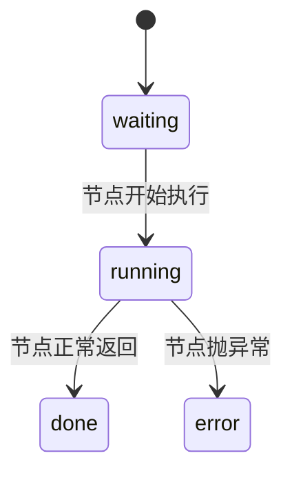
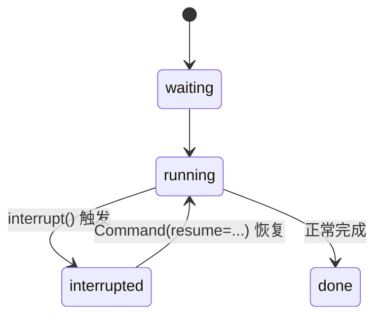
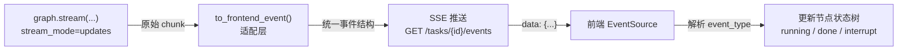

# 12. 流式输出与前端集成

> 版本说明：本教程基于 **Python 3.13 + LangGraph 1.x**。

## 本章导读

Agent 工作流可能运行几十秒甚至更久。前端不能只显示一个"转圈加载"——用户需要知道：当前执行到哪个节点了、模型在说什么、是不是在等人确认。

这一章讲两件事：

1. 后端如何用 `graph.stream()` 逐步输出执行过程。
2. 如何把流式输出包装成前端能消费的事件结构 + 最小 API。

涉及代码：`code/step_by_step/12_stream_output.py`、`code/step_by_step/12_api.py`、`code/langgraph_intro_project/app/api/`

---

## 本章目标

- 理解"流式输出"和"最终状态"的区别。
- 掌握 `graph.stream(..., stream_mode=...)` 的常见 mode。
- 区分 `stream()` 与 `stream_events(version="v3")` 的适用场景。
- 设计前端可消费的统一事件结构。
- 用 FastAPI 包装最小接口。

---

## 为什么需要这一章

前 11 章我们一直用 `graph.invoke()`：一次性执行，最后返回完整结果。但长任务场景下，这个体验是灾难——用户盯着加载圈几十秒，不知道发生了什么。

真实产品的需求：

- **节点进度**：`analyze_topic` 在跑、`search_documents` 完成了、`evaluate_summary` 失败了。
- **模型消息**：LLM 正在逐 token 生成总结。
- **中断状态**：图停在 `human_review`，等人提交反馈。
- **最终结果**：完整报告。

`invoke()` 只能给最后一种。流式输出负责前三种。

---

## 核心概念

### 节点级状态展示

前端展示的每个节点，应该有明确的状态机：

```text
analyze_topic:      waiting | running | done | error
search_documents:   waiting | running | done | error
summarize_documents: waiting | running | done | error
evaluate_summary:   waiting | running | done | error
human_review:       waiting | interrupted | done
generate_report:    waiting | running | done | error
```

普通节点的状态流转：



而 `human_review` 这类有人工介入的节点多一个特殊状态：



前端对 `interrupted` 的处理很关键：它不是一个"结束状态"，而是**等待外部输入的中途状态**——看到它就该弹审批卡片，而不是把任务标记成失败。

任务级别的状态（跨节点）：

```text
created -> running -> interrupted -> completed
                        |--> failed
                        |--> cancelled
```

前端的本质工作，就是把后端事件流**翻译成这棵状态树**。

### 流式输出 vs 最终状态

| 对比维度 | `invoke()` | `stream()` |
|---|---|---|
| 返回什么 | 最终完整状态 | 执行过程的每个片段 |
| 时机 | 全部执行完 | 每步执行完立即返回 |
| 前端体验 | 转圈等结果 | 实时看进度 |
| 适用场景 | 批处理、测试 | 交互式产品 |

### graph.stream() 与 stream_mode

`stream()` 的核心参数是 `stream_mode`，决定每个片段里装什么：

| mode | 输出内容 | 适合谁消费 |
|---|---|---|
| `values` | 每步之后的**完整状态** | 调试、状态还原 |
| `updates` | 每个节点的**局部状态更新** | 展示"哪个节点干了什么" |
| `messages` | 模型消息和 token | 聊天式逐字输出 |
| `custom` | 自定义事件 | 业务事件 |
| `debug` | 完整调试信息 | 排障 |

```python
for chunk in graph.stream(input, config, stream_mode="updates"):
    print(chunk)
    # {'analyze_topic': {'documents': [...]}}
    # {'summarize_documents': {'summary': '...'}}
```

`updates` 格式是 `{节点名: 该节点返回的局部更新}`，天然适合"节点进度"展示。

### stream() vs stream_events()

| 对比维度 | `graph.stream(...)` | `graph.stream_events(..., version="v3")` |
|---|---|---|
| 关注点 | 图执行过程的状态 | 类型化的事件流 |
| 输出粒度 | 节点级 | 更细（含 LLM token、工具调用） |
| 版本 | 无 | 需指定 `version="v3"` |
| 适合场景 | 后端调试、节点进度 | 前端消费、可观测系统 |

**入门建议**：后端内部调试优先用 `stream(stream_mode="updates")`；真正给前端做事件流时，再对接 `stream_events(version="v3")`。

### 统一事件结构

后端无论用哪种方式，给前端的事件应该**统一结构**，避免前端写死解析逻辑：

```json
{
  "task_id": "stream-001",
  "node": "summarize_documents",
  "status": "running",
  "event_type": "node_update",
  "payload": {"summary": "基于 1 份资料总结：..."}
}
```

前端只需要处理几种 `event_type`：

| event_type | 含义 | 前端动作 |
|---|---|---|
| `node_update` | 节点返回了状态更新 | 标记该节点 done，刷新数据 |
| `node_start` | 节点开始执行 | 标记该节点 running |
| `token` | 模型 token（来自 messages mode） | 追加到输出框 |
| `interrupt` | 图在等人 | 弹出审批卡片 |

### SSE：前端怎么收事件

服务端把事件写成 SSE（Server-Sent Events）格式，前端用 `EventSource` 直接订阅：

```text
data: {"task_id": "task-001", "node": "analyze_topic", "status": "running", ...}

data: {"task_id": "task-001", "node": "human_review", "event_type": "interrupt", ...}
```

```javascript
const es = new EventSource("/tasks/task-001/events");
es.onmessage = (e) => {
  const evt = JSON.parse(e.data);
  updateNodeState(evt.node, evt.status, evt.payload);
};
```

---

## 最小代码示例

创建 `code/step_by_step/12_stream_output.py`：

```python
from typing import TypedDict

from langgraph.graph import END, START, StateGraph


class ResearchState(TypedDict):
    topic: str
    documents: list[str]
    summary: str


def analyze_topic(state: ResearchState) -> dict[str, list[str]]:
    return {"documents": [f"资料：《{state['topic']}》的入门资料"]}


def summarize_documents(state: ResearchState) -> dict[str, str]:
    return {"summary": f"基于 {len(state['documents'])} 份资料总结：{state['topic']}"}


builder = StateGraph(ResearchState)
builder.add_node("analyze_topic", analyze_topic)
builder.add_node("summarize_documents", summarize_documents)
builder.add_edge(START, "analyze_topic")
builder.add_edge("analyze_topic", "summarize_documents")
builder.add_edge("summarize_documents", END)

graph = builder.compile()


def to_frontend_event(task_id: str, chunk: dict, status: str = "running") -> dict:
    """把 stream 输出整理成前端可消费的统一事件格式。"""
    node = list(chunk.keys())[0] if chunk else ""
    return {
        "task_id": task_id,
        "node": node,
        "status": status,
        "event_type": "node_update",
        "payload": chunk.get(node, {}) if chunk else {},
    }


if __name__ == "__main__":
    config = {"configurable": {"thread_id": "stream-001"}}

    for chunk in graph.stream(
        {
            "topic": "LangGraph 流式输出",
            "documents": [],
            "summary": "",
        },
        config,
        stream_mode="updates",
    ):
        print(to_frontend_event("stream-001", chunk))
```

运行：

```powershell
cd code/step_by_step
python 12_stream_output.py
```

预期输出：

```text
{'task_id': 'stream-001', 'node': 'analyze_topic', 'status': 'running', 'event_type': 'node_update', 'payload': {'documents': ['资料：《LangGraph 流式输出》的入门资料']}}
{'task_id': 'stream-001', 'node': 'summarize_documents', 'status': 'running', 'event_type': 'node_update', 'payload': {'summary': '基于 1 份资料总结：LangGraph 流式输出'}}
```

---

## 执行过程拆解

`graph.stream(...)` 的执行与 `invoke()` 相同，只是**每个节点完成后立即产出**：

1. `analyze_topic` 执行完 → 产出第一个 chunk：`{'analyze_topic': {'documents': [...]}}`。
2. `summarize_documents` 执行完 → 产出第二个 chunk：`{'summarize_documents': {'summary': '...'}}`。
3. 遍历结束，流关闭。

`to_frontend_event` 做的事情：

- 从 chunk 里取出节点名（chunk 唯一的 key）。
- 取出该节点的局部更新作为 `payload`。
- 包装成统一事件结构。

**关键点**：`to_frontend_event` 是"适配层"——它把 LangGraph 的原始输出翻译成产品约定的格式。前端永远不直接碰 LangGraph 的数据结构，只依赖这个约定。

事件从图到前端的链路：



`stream()` 产出 → 适配层翻译 → SSE 传输 → 前端渲染，每一跳都有明确职责。改动任何一跳，其他层不需要跟着改。

---

## 贯穿项目改造

贯穿项目的节点较多，前端节点状态机：

```text
analyze_topic -> plan_search -> search_documents -> summarize_documents
  -> evaluate_summary -> human_review -> generate_report
```

**最小 API 设计**（对应 `code/step_by_step/12_api.py`）：

```text
POST /tasks                       创建任务，返回 task_id
GET  /tasks/{task_id}             查询任务状态
POST /tasks/{task_id}/feedback    提交人工反馈（对接第 11 章 Command）
GET  /tasks/{task_id}/events      获取事件流（SSE）
GET  /tasks/{task_id}/report      获取最终报告
```

`task_id` 直接映射为 `thread_id`，整个后端围绕它组织：

```text
创建任务（生成 thread_id）
  -> 触发图执行（后台任务，前端订阅 /events）
  -> 图运行，SSE 推送节点事件
  -> 到达 human_review，推送 interrupt 事件
  -> 前端弹审批卡片，POST /feedback
  -> 后端 Command(resume=...) 恢复，继续推送
  -> 完成，GET /report 取结果
```

这就是一个可产品化的 Agent 后端形态。第 15 章会讨论长任务不该阻塞 HTTP 请求、队列和 Worker 的工程化方案。

---

## 代码运行方式

**流式输出示例：**

```powershell
cd code/step_by_step
python 12_stream_output.py
```

**最小 API：**

```powershell
pip install fastapi uvicorn
cd code/step_by_step
python 12_api.py          # 或 uvicorn 12_api:app --reload
```

启动后用浏览器或 curl 验证：

```powershell
curl -X POST http://127.0.0.1:8000/tasks -H "Content-Type: application/json" -d '{"topic": "LangGraph"}'
# {"task_id": "task-001"}
```

---

## 调试与排查

### 场景一：`stream()` 只输出最终结果

**现象**：for 循环只跑了一次，或者 chunk 格式是完整状态。

**原因**：`stream_mode` 用错了。`values` 模式每步输出完整状态，`updates` 模式每步输出节点更新。

**排查**：确认 `stream_mode="updates"`；打印 chunk 观察格式是否符合"`{节点名: 更新}`"。

### 场景二：前端收到的事件结构不稳定

**现象**：前端解析经常报错，字段对不上。

**原因**：直接把 `stream()` 原始输出暴露给前端，没有适配层。

**排查**：统一用 `to_frontend_event` 之类适配函数，固定 `task_id/node/status/event_type/payload` 五字段。

### 场景三：`interrupt` 事件没有推送

**现象**：图停在 `human_review`，但前端没有收到审批卡片。

**原因**：流式循环里没有处理 `__interrupt__` 事件，或中断后流被当作正常结束。

**排查**：在 `stream()` 循环里检测 chunk / 状态中的 `__interrupt__` 字段，单独推送 `event_type: "interrupt"`，并保持连接等待恢复后的新事件。

### 场景四：`stream_events` 报版本错误

**现象**：`TypeError` 或 `ValueError` 提示需要指定 version。

**原因**：`stream_events` 必须传 `version="v3"`。

**排查**：`graph.stream_events(input, config, version="v3")`。入门阶段优先用 `stream()`，够用就别上 `stream_events`。

---

## 常见错误

| 现象 | 原因 | 解决 |
|---|---|---|
| 只给前端最终结果 | 没用流式 | 用 `stream(stream_mode="updates")` |
| 前端解析事件结构不稳定 | 没有统一适配层 | 固定五字段事件结构 |
| 节点状态只有 running/done，缺 error | 状态机不完整 | 每个节点配 waiting/running/done/error |
| 前端不知道 interrupt | 中断事件没单独处理 | 检测 `__interrupt__` 推送 interrupt 事件 |
| 用 `stream_events` 不传版本 | API 用法错误 | `version="v3"`；或直接用 `stream()` |
| 长任务阻塞 HTTP 请求 | 同步执行图 | 后台任务 + 前端订阅事件（第 15 章展开） |

---

## 练习任务

**必做 1：补充节点状态机**

给 `to_frontend_event` 增加 `node_start` 事件（节点开始时推送 `status: "running"`，完成时推送 `status: "done"`）。

自查：前端能区分"节点正在跑"和"节点已完成"，而不是只知道节点返回了数据。

**必做 2：处理 interrupt 事件**

在示例图里加一个 `human_review` 节点（用第 11 章的代码），在 `stream()` 循环中检测 `__interrupt__` 并推送 `event_type: "interrupt"`。

自查：流式输出中出现 interrupt 事件，且不阻塞后续的恢复事件。

**扩展练习：SSE 接入**

把 `12_api.py` 的 `GET /tasks/{task_id}/events` 改造成真正的 SSE 端点，用 `stream()` 的输出作为事件源。

自查：用 `curl -N` 或浏览器 EventSource 能实时收到逐节点事件。

---

## 本章小结

- 流式输出让长任务可交互：节点进度、模型消息、中断状态都能实时推给前端。
- `stream(stream_mode="updates")` 输出节点级更新，后端调试首选。
- `stream_events(version="v3")` 输出类型化事件，前端/观测系统首选。
- 前端事件要**统一结构**，后端加适配层，别让前端碰 LangGraph 原始输出。
- 最小 API：创建任务 → 订阅事件 → 提交反馈 → 取报告。

下一章加日志、观测和测试，把工作流变成可维护的工程。

---

## 本章速查

**stream_mode 速查**

| mode | 输出 | 用途 |
|---|---|---|
| `values` | 完整状态 | 调试、还原 |
| `updates` | 节点局部更新 | 节点进度 |
| `messages` | 模型消息/token | 逐字输出 |
| `custom` | 自定义事件 | 业务事件 |

**统一事件结构**

```python
{
    "task_id": str,
    "node": str,
    "status": str,       # waiting/running/done/error/interrupted
    "event_type": str,   # node_update/node_start/token/interrupt
    "payload": dict,
}
```

**加深阅读**

- 系统笔记：`LangGraph-笔记/04-LangGraph中断与工具与部署.md` 的「9. 部署」相关章节
- notebook：`langgraph/chapter05/01_values.ipynb`、`02_messages.ipynb`、`04_custom.ipynb`（stream_mode 逐一演示）
- 官方文档：[LangGraph 流式输出](https://docs.langchain.com/oss/python/langgraph/streaming)
