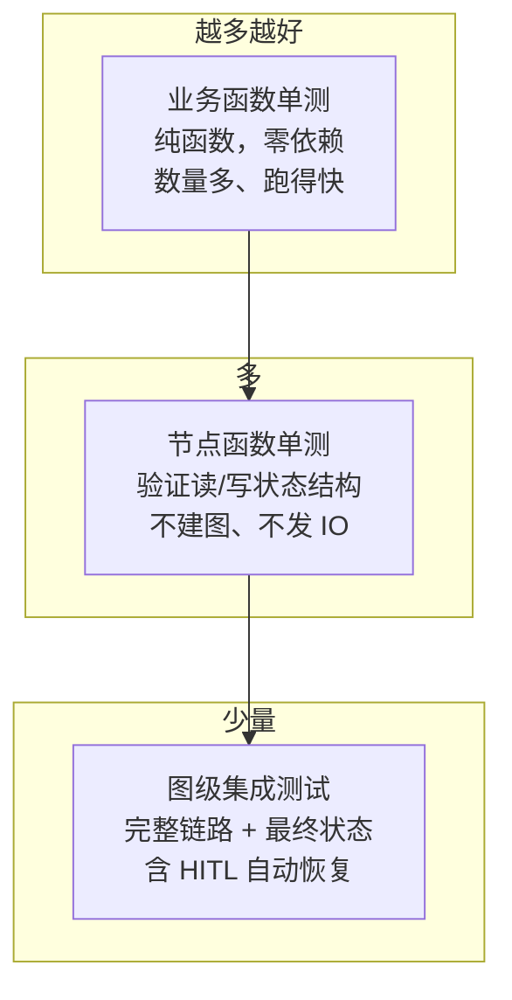

# 13. 调试、观测与测试

> 版本说明：本教程基于 **Python 3.10+，推荐 3.13；LangGraph 1.x**。

## 本章导读

Agent 出问题时，不能只看最终回答。你需要知道：哪个节点输入了什么、输出了什么、耗时多久、是否调用了工具、模型返回是否符合预期。

可观测性不是上线后才补的能力，教程项目也应该尽早建立习惯。这一章讲三件事：

1. 节点日志怎么打（结构化、可追溯）。
2. 测试怎么分层（单元 / 集成）。
3. LLM 输出不稳定时，测试怎么才能不脆弱。

涉及代码：`code/step_by_step/13_debug_and_test.py`、`code/langgraph_intro_project/tests/`

---

## 本章目标

- 为节点增加基础日志（节点名、耗时、输出字段）。
- 理解节点单元测试和图级集成测试的区别。
- 学会测试"不稳定的 LLM 输出"。
- 了解 LangSmith 的 trace 和调试价值。

---

## 为什么需要这一章

第 12 章之前，我们已经构建了一个相当复杂的 Agent：分支、循环、工具、LLM、人工介入。现在的风险是**出了 bug 找不到原因**。

举两个真实场景：

1. `search_documents` 返回了空资料，`summarize_documents` 生成了一份空总结——问题出在工具调用失败？还是检索条件不对？
2. 集成测试偶尔失败，但看起来每次结果都差不多——是模型不稳定？还是断言写得太脆弱？

没有日志和测试，你只能靠猜。本章把"猜"变成"查"。

---

## 核心概念

### 打印日志 vs 结构化日志

```python
# 反例：魔法值拼进字符串，无法检索
print("节点完成了，耗时" + str(x) + "毫秒")

# 正例：结构化键值对，可以 grep 也可以接入日志系统
logger.info("node=%s duration_ms=%s output_keys=%s", name, duration_ms, keys)
```

结构化日志的原则：**key=value 平铺，可检索、可聚合**。不要拼自然语言句子。

### 最小日志字段

每个节点至少记录：

| 字段 | 含义 |
|---|---|
| `thread_id` | 哪次会话（从 config 取） |
| `node` | 哪个节点 |
| `input_summary` | 输入摘要（注意别打完整 Prompt / 密钥） |
| `output_keys` | 输出了哪些字段 |
| `duration_ms` | 耗时 |
| `error` | 异常信息（异常时） |

### 节点日志包装器

不需要在每个节点里手写日志，用装饰器统一包装：

```python
def log_node(name: str, fn: Callable[[dict[str, Any]], dict[str, Any]]):
    def wrapper(state: dict[str, Any]) -> dict[str, Any]:
        started = time.perf_counter()
        try:
            result = fn(state)
            duration_ms = int((time.perf_counter() - started) * 1000)
            logger.info(
                "node=%s duration_ms=%s output_keys=%s",
                name, duration_ms, list(result.keys()),
            )
            return result
        except Exception:
            logger.exception("node=%s failed", name)
            raise
    return wrapper

builder.add_node("summarize_documents",
                 log_node("summarize_documents", summarize_documents))
```

这样做的好处：

- 节点函数保持纯净（只做业务）。
- 日志逻辑集中，改格式只改一处。
- 异常自动记录 `traceback` 后重新抛出，不吞错。

### 测试分层

| 层级 | 测什么 | 特点 | 对应文件 |
|---|---|---|---|
| 业务函数单测 | 纯函数（如 `build_questions`） | 最快、最稳定 | `tests/test_nodes.py` |
| 节点函数单测 | 节点读状态/写状态的结构 | 无 IO、无图 | 同上 |
| 图级集成测试 | 完整图 + 最终状态 | 慢、覆盖全链路 | `tests/test_graph.py` |

测试顺序建议：**先业务函数，再节点函数，最后完整图**。前两层不过，不要写第三层。



越往上的测试越"靠近代码"、越快、越稳定；越往下越"靠近产品"、越慢、越贵。**数量应该从下往上递减**。

### 测试不稳定的 LLM 输出

LLM 输出有随机性，测试要**测结构，不测文案**：

```python
# ✅ 测结构
assert "quality_score" in result
assert isinstance(result["quality_score"], int)
assert 0 <= result["quality_score"] <= 100

# ❌ 测文案（模型一改措辞就崩）
assert result["summary"] == "这是一份关于 LangGraph 的完美总结。"
```

配套策略：

- **模拟模式**用于稳定测试（第 08 章的 `mock_*`）。
- **真实模式**用于人工验收或少量集成验证，不进 CI。
- 断言放宽：测字段存在、类型正确、范围合理，不测精确值。

### LangSmith：trace 你的 Agent

LangSmith 是 LangChain 生态的观测平台，能自动记录每次图执行的完整 trace（节点、工具、LLM 调用、耗时、token）。

接入方式（环境变量）：

```powershell
$env:LANGSMITH_TRACING="true"
$env:LANGSMITH_API_KEY="你的 LangSmith Key"
```

入门阶段**可以先不接**。先用本地日志 + 测试把基本习惯建立起来，第 15 章生产化清单里再决定是否上观测平台。

---

## 最小代码示例

创建 `code/step_by_step/13_debug_and_test.py`（核心部分）：

```python
import logging
import time
from collections.abc import Callable
from typing import Any, TypedDict

from langgraph.graph import END, START, StateGraph

logging.basicConfig(level=logging.INFO, format="%(levelname)s %(name)s: %(message)s")
logger = logging.getLogger(__name__)


class ResearchState(TypedDict):
    topic: str
    documents: list[str]
    summary: str
    quality_score: int


def summarize_documents(state: ResearchState) -> dict[str, str]:
    return {"summary": f"基于 {len(state['documents'])} 份资料总结：{state['topic']}"}


def evaluate_summary(state: ResearchState) -> dict[str, int]:
    summary = state["summary"]
    if len(summary) > 40:
        return {"quality_score": 85}
    return {"quality_score": 60}


def log_node(name: str, fn: Callable[[dict[str, Any]], dict[str, Any]]):
    def wrapper(state: dict[str, Any]) -> dict[str, Any]:
        started = time.perf_counter()
        try:
            result = fn(state)
            duration_ms = int((time.perf_counter() - started) * 1000)
            logger.info(
                "node=%s duration_ms=%s output_keys=%s",
                name, duration_ms, list(result.keys()),
            )
            return result
        except Exception:
            logger.exception("node=%s failed", name)
            raise
    return wrapper


builder = StateGraph(ResearchState)
builder.add_node("summarize_documents", log_node("summarize_documents", summarize_documents))
builder.add_node("evaluate_summary", log_node("evaluate_summary", evaluate_summary))
builder.add_edge(START, "summarize_documents")
builder.add_edge("summarize_documents", "evaluate_summary")
builder.add_edge("evaluate_summary", END)

graph = builder.compile()
```

配套测试（同一文件内）：

```python
def test_evaluate_summary_passes() -> None:
    state = {"summary": "这是一段足够长的总结，包含背景、用途和风险，还覆盖了实施步骤、验证方法以及部署注意事项。"}
    result = evaluate_summary(state)
    assert result["quality_score"] >= 80


def test_evaluate_summary_fails() -> None:
    state = {"summary": "太短"}
    result = evaluate_summary(state)
    assert result["quality_score"] < 80


def test_graph_generates_report() -> None:
    result = graph.invoke(dict(INITIAL_STATE), {"recursion_limit": 20})
    assert result["summary"]
    assert result["quality_score"] > 0
```

运行：

```powershell
cd code/step_by_step
python 13_debug_and_test.py
```

预期输出（日志部分）：

```text
INFO __main__: node=summarize_documents duration_ms=0 output_keys=['summary']
INFO __main__: node=evaluate_summary duration_ms=0 output_keys=['quality_score']
...
所有测试通过。

{'topic': 'LangGraph 调试', 'documents': ['资料一', '资料二', '资料三'], 'summary': '基于 3 份资料总结：LangGraph 调试', 'quality_score': 60}
```

---

## 执行过程拆解

一次 `graph.invoke(...)` 的执行与日志输出对应：

1. `summarize_documents` 被 `log_node` 包装执行 → 日志 `node=summarize_documents ... output_keys=['summary']`。
2. `evaluate_summary` 被包装执行 → 日志 `node=evaluate_summary ... output_keys=['quality_score']`。
3. 图结束，`invoke` 返回最终状态。

测试的三个函数：

- `test_evaluate_summary_passes`：直接调节点函数，验证达标分支（长总结 → ≥80 分）。
- `test_evaluate_summary_fails`：直接调节点函数，验证不达标分支（短总结 → <80 分）。
- `test_graph_generates_report`：跑完整图，验证最终状态字段。

**关键认知**：测试和正式执行共用同一批节点函数，但测试不依赖网络、不依赖模型——这就是第 05、08 章"业务/节点分离 + mock"设计的回报。

---

## 贯穿项目改造

完整项目的测试分层（`code/langgraph_intro_project/tests/`）：

```text
tests/
  test_nodes.py    # 节点单元测试：测结构，不测文案
  test_graph.py    # 图级集成测试：完整流程 + 人工反馈恢复
```

`test_graph.py` 里一个关键技巧——处理 HITL 中断：

```python
def _run_with_approval(graph, config, state, resume=None):
    result = graph.invoke(state, config | {"recursion_limit": RECURSION_LIMIT})
    if "__interrupt__" in result:                    # 图在等人
        return graph.invoke(
            Command(resume=resume or {"approved": True, "approved_by": "集成测试"}),
            config,
        )
    return result
```

集成测试用**自动模拟人工反馈**跑通全流程，而不是真的去等人点按钮。

---

## 代码运行方式

**单文件示例：**

```powershell
cd code/step_by_step
python 13_debug_and_test.py
```

**完整项目测试：**

```powershell
cd code/langgraph_intro_project
pip install pytest
pytest
```

预期输出（当前项目）：`11 passed`。

**接入 LangSmith（可选）：**

```powershell
$env:LANGSMITH_TRACING="true"
$env:LANGSMITH_API_KEY="你的 LangSmith Key"
```

---

## 调试与排查

### 场景一：日志里节点没执行

**现象**：日志没有某个节点的记录，但图正常结束。

**原因**：条件边跳过了该节点（第 06 章的分支逻辑），属于正常行为。

**排查**：结合 `stream()`（第 12 章）或 `draw_mermaid()` 确认执行路径，别当成 bug。

### 场景二：错误被吞掉，状态却不完整

**现象**：图正常结束，但 `summary` 是空的、`errors` 为空、日志没异常。

**原因**：某处 `except Exception: pass` 把异常吞了，或工具返回了空结果且没有记录到 `errors`。

**排查**：搜索所有 `except` 分支，确认要么 `logger.exception`、要么写入 `errors` 状态字段。

### 场景三：集成测试不稳定（偶尔红偶尔绿）

**现象**：测试依赖真实 LLM / 网络，结果时好时坏。

**原因**：测试用了真实模式。

**排查**：CI 里用模拟模式（`USE_MOCK=true`）；真实模式只做人工验收。

### 场景四：测试断言过于严格

**现象**：改了个 Prompt 措辞，测试就挂。

**原因**：断言了具体文案或精确分数。

**排查**：改测结构（字段存在、类型、范围）。模型输出是"不稳定外部依赖"，测试要容忍合理波动。

---

## 常见错误

| 现象 | 原因 | 解决 |
|---|---|---|
| 只测最终文本，一改就挂 | 断言脆弱 | 测结构，不测文案 |
| 节点没日志，排查靠猜 | 没建日志习惯 | 用 `log_node` 包装器统一记录 |
| 测试依赖真实模型 | 没分 mock/real | CI 用 mock，真实模式人工验收 |
| 异常被吞，图看似正常 | `except: pass` | 记录到日志或 `errors` 字段 |
| 日志打完整 Prompt / 密钥 | 敏感信息泄露 | 只打摘要，脱敏 |
| 集成测试太多、太慢 | 分层不清 | 业务/节点单测为主，集成测试少量 |

---

## 练习任务

**必做 1：补全 `evaluate_summary` 测试**

写两个测试：一个长总结（达标）、一个短总结（不达标），验证 `quality_score` 分支。

自查：两个测试都通过，且不依赖图、不依赖模型。

**必做 2：给节点包装日志**

用 `log_node` 给图里所有节点加日志，运行后观察每个节点的 `duration_ms` 和 `output_keys`。

自查：日志能定位"哪个节点耗时最长"。

**扩展练习：集成测试处理人工反馈**

参考 `tests/test_graph.py` 的 `_run_with_approval`，写一个测试：图在 `human_review` 中断后，自动提交 `{"approved": False, "comment": "补充风险说明"}`，断言最终报告包含修改意见。

自查：测试能自动化走完"暂停 → 反馈 → 恢复"链路。

---

## 本章小结

- 结构化日志：`key=value`，节点名 + 耗时 + 输出字段，异常不吞。
- 测试分层：业务函数 → 节点 → 完整图，从快到慢。
- LLM 输出：测结构不测文案，mock 进 CI，真实模式人工验收。
- LangSmith 是进阶观测，入门先建立本地日志 + 测试习惯。

下一章把文件整理成完整项目结构——让状态、节点、工具、Prompt、API 各归其位。

---

## 本章速查

**日志包装器模板**

```python
def log_node(name, fn):
    def wrapper(state):
        started = time.perf_counter()
        try:
            result = fn(state)
            logger.info("node=%s duration_ms=%s output_keys=%s",
                        name, int((time.perf_counter()-started)*1000), list(result.keys()))
            return result
        except Exception:
            logger.exception("node=%s failed", name)
            raise
    return wrapper
```

**测试策略口诀**

- 结构 > 文案
- mock 进 CI，真实人工验
- 业务函数 → 节点 → 图

**加深阅读**

- 系统笔记：`LangGraph-笔记/02-LangGraph控制流与节点执行.md` 的「5. 节点执行与容错机制」（节点重试/超时，可观测的另一半）
- 官方文档：[LangSmith](https://docs.langchain.com/oss/python/langsmith/tracing)
