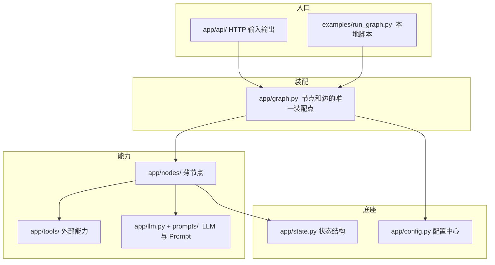

# 14. 项目化目录结构

> 版本说明：本教程基于 **Python 3.13 + LangGraph 1.x**。

## 本章导读

第 07 章我们开始把代码迁移到项目结构，此后每章都在往这个结构里填东西。这一章做**最终收束**：把真实项目 `code/langgraph_intro_project/` 的每个目录、每个文件的职责讲清楚。

学完这一章，你将理解"为什么 LangGraph 项目长这样"，以及"往哪加文件、往哪改代码"。

涉及代码：`code/langgraph_intro_project/`（完整项目）

---

## 本章目标

- 理解状态、节点、工具、Prompt、API 的分层边界。
- 看懂真实项目 `code/langgraph_intro_project/` 的目录结构。
- 掌握配置与业务代码如何解耦。
- 学会用模块方式运行（`python -m`）避免导入陷阱。

---

## 为什么需要这一章

单文件示例适合入门，但不适合真实项目：

- 所有节点挤在一个文件，改一个节点要上下翻很久。
- Prompt 和代码混在一起，改措辞要动代码。
- 配置散落各处，换环境要改代码。
- 测试无从下手。

从第 07 章开始，我们其实一直在"攒"这个项目结构。本章只是把已经形成的结构**正式讲清楚**——不是重新发明，而是收束。

---

## 项目目录总览

```text
code/langgraph_intro_project/
├── app/                        # 应用主代码
│   ├── __init__.py
│   ├── config.py               # 配置中心（环境变量 / .env）
│   ├── graph.py                # 图定义（节点、边的装配）
│   ├── state.py                # 状态结构 + 初始状态构造
│   ├── llm.py                  # LLM 调用层（mock/real）
│   ├── nodes/                  # 节点层（薄胶水）
│   │   ├── analyze.py
│   │   ├── search.py
│   │   ├── summarize.py
│   │   ├── evaluate.py
│   │   ├── report.py
│   │   └── human_review.py
│   ├── tools/                  # 工具层（外部能力）
│   │   └── search_tool.py
│   ├── prompts/                # Prompt 模板（独立文件）
│   │   ├── analyze.md
│   │   ├── summarize.md
│   │   ├── evaluate.md
│   │   └── report.md
│   └── api/                    # API 层（输入输出转换）
│       ├── main.py
│       └── schemas.py
├── tests/                      # 测试
│   ├── test_nodes.py           # 节点单元测试
│   └── test_graph.py           # 图级集成测试
├── examples/
│   └── run_graph.py            # 本地脚本运行入口
├── .env.example                # 配置模板（不含真实密钥）
├── pyproject.toml              # 项目元信息与依赖
└── README.md
```

---

## 核心概念

项目化的本质是**把前面 12 章的能力按"变化频率"分层**：

- **经常变的**（Prompt、配置、工具实现）→ 独立文件，改起来不动代码。
- **结构稳定的**（状态、节点边界）→ 固化进模块，谁都别乱动。
- **唯一的装配点**（图定义）→ 只此一处知道"图长什么样"。

核心规则只有三条：

1. **单向依赖**：API → 图 → 节点/工具 → 状态/配置，不允许反向。
2. **薄节点**：节点只做"读状态、调业务、写状态"（第 05 章铁律）。
3. **配置集中**：环境相关参数只在 `config.py` 出现。

记住这三条，下面每个目录的职责就都是"这三条的具体化"。



---

## 各层职责

### app/config.py：配置中心

所有可调参数集中在环境变量 / `.env`：

```python
USE_MOCK: bool = _to_bool(os.getenv("USE_MOCK"))               # 模拟/真实模式
MAX_ITERATIONS: int = int(os.getenv("MAX_ITERATIONS", "3"))    # 循环上限
RECURSION_LIMIT: int = int(os.getenv("RECURSION_LIMIT", "50")) # 递归限制
QUALITY_THRESHOLD: int = int(os.getenv("QUALITY_THRESHOLD", "80"))
OPENAI_API_KEY: str = os.getenv("OPENAI_API_KEY", "")          # 模型密钥
OPENAI_MODEL: str = os.getenv("OPENAI_MODEL", "gpt-4o-mini")
```

**为什么集中？** 节点不直接读环境变量，而是从 `config` 导入。换环境只改 `.env`，不碰代码。

### app/state.py：状态结构

只定义状态结构和公共类型，不写业务逻辑：

```python
class ResearchState(TypedDict):
    topic: str
    questions: list[str]
    documents: list[SearchResult]
    ...
    approved_by: str
    feedback_comment: str

def build_initial_state(topic: str, max_iterations: int) -> ResearchState:
    return { ... }   # 一次性构造完整初始状态
```

`build_initial_state` 是个好习惯——所有测试、示例、API 都用它构造状态，避免各处手写导致字段不一致。

### app/nodes/：节点层（薄胶水）

每个文件放一类节点，例如 `app/nodes/search.py`：

```python
def search_documents(state: ResearchState) -> dict[str, object]:
    # 读状态 -> 调工具 -> 写状态
    ...
```

铁律（第 05 章）：节点只做"读状态、调业务/工具、写状态"，逻辑放业务函数。

### app/tools/：工具层（外部能力）

```python
# app/tools/search_tool.py
def mock_search_tool(query: str) -> list[SearchResult]:
    ...
```

工具不依赖 LangGraph，不修改状态，只返回结果。替换真实实现时，节点不用改。

### app/prompts/：Prompt 模板

```text
app/prompts/summarize.md
```

Prompt 独立文件，用 `load_prompt("summarize").format(...)` 加载（第 08 章）。改措辞不改代码。

### app/graph.py：图定义

集中装配节点和边：

```python
def build_graph():
    builder = StateGraph(ResearchState)
    builder.add_node("analyze_topic", analyze_topic)
    ...
    builder.add_conditional_edges("analyze_topic", route_after_analysis, {...})
    ...
    return builder.compile(checkpointer=InMemorySaver())

GRAPH = build_graph()   # 模块级单例，API / 脚本共用
```

**为什么集中？** 全项目只有这一处知道"图长什么样"。改流程只改 `graph.py`。

### app/api/：API 层

只做输入输出转换：

```python
@app.post("/tasks")
def create_task(request: CreateTaskRequest) -> dict[str, str]:
    task_id = _new_task_id()
    return {"task_id": task_id}
```

API 不拼 Prompt、不调模型、不定图——那些是别的层的职责。

### 分层总览

| 层 | 文件 | 知道 LangGraph 吗 | 职责 |
|---|---|---|---|
| 配置 | `config.py` | 否 | 环境参数集中管理 |
| 状态 | `state.py` | 是（被图引用） | 定义结构与初始状态 |
| 节点 | `nodes/*.py` | 是 | 读状态、调业务、写状态 |
| 工具 | `tools/*.py` | 否 | 外部能力 |
| Prompt | `prompts/*.md` | 否 | 模型指令模板 |
| 图 | `graph.py` | 是 | 装配节点和边 |
| API | `api/*.py` | 是（调图） | HTTP 输入输出转换 |
| 测试 | `tests/*.py` | 部分 | 验证各层 |

**依赖方向从上到下**：API → 图 → 节点/工具/Prompt/状态 → 配置。谁也不要反向依赖。

---

## 最小代码示例

用 `app/graph.py` 的核心片段展示"图定义"这一层的形态：

```python
from langgraph.graph import END, START, StateGraph

from app.config import QUALITY_THRESHOLD
from app.nodes.analyze import analyze_topic
from app.nodes.search import plan_search, search_documents
from app.nodes.summarize import summarize_documents
from app.nodes.evaluate import evaluate_summary
from app.nodes.report import generate_draft_report, generate_final_report
from app.nodes.human_review import human_review
from app.state import ResearchState


def route_after_analysis(state: ResearchState) -> Literal["search", "summarize"]:
    if state["need_search"]:
        return "search"
    return "summarize"


def build_graph():
    builder = StateGraph(ResearchState)
    builder.add_node("analyze_topic", analyze_topic)
    builder.add_node("plan_search", plan_search)
    builder.add_node("search_documents", search_documents)
    builder.add_node("summarize_documents", summarize_documents)
    builder.add_node("evaluate_summary", evaluate_summary)
    builder.add_node("generate_draft_report", generate_draft_report)
    builder.add_node("human_review", human_review)
    builder.add_node("generate_final_report", generate_final_report)

    builder.add_edge(START, "analyze_topic")
    builder.add_conditional_edges("analyze_topic", route_after_analysis,
        {"search": "plan_search", "summarize": "summarize_documents"})
    builder.add_edge("plan_search", "search_documents")
    builder.add_edge("search_documents", "summarize_documents")
    builder.add_edge("summarize_documents", "evaluate_summary")
    builder.add_conditional_edges("evaluate_summary", route_after_evaluation,
        {"retry": "plan_search", "finish": "generate_draft_report"})
    builder.add_edge("generate_draft_report", "human_review")
    builder.add_edge("human_review", "generate_final_report")
    builder.add_edge("generate_final_report", END)

    checkpointer = InMemorySaver()   # 教程内存型；生产换 SQLite/Postgres
    return builder.compile(checkpointer=checkpointer)
```

注意它**只是装配**：节点来自各个 `nodes/*.py`，判断函数就地定义（轻量路由，第 06 章铁律），checkpointer 在编译时挂载。

---

## 执行过程拆解

从入口到图的完整调用链：

```text
examples/run_graph.py        # 用户输入主题
  -> app.graph.GRAPH         # 模块级单例图
  -> build_initial_state()   # 构造初始状态（state.py）
  -> graph.invoke(...)       # 执行图（graph.py 装配的节点/边）
       -> nodes/analyze.py   # 每个节点内部：
            -> config.py     # 读配置
            -> prompts/      # 读 Prompt（llm.py 加载）
            -> tools/        # 调工具
            -> state.py      # 类型来自这里
  -> 结果返回
```

**模块级单例的意义**：`GRAPH = build_graph()` 让 API 和脚本复用同一个编译好的图，避免每次请求都重新编译。

---

## 贯穿项目改造

本章的"改造"就是**把前面 12 章的能力放进正确位置**。对照清单：

| 前 12 章能力 | 最终位置 |
|---|---|
| State 定义（第 02-04 章） | `app/state.py` |
| 节点拆分（第 05 章） | `app/nodes/*.py` |
| 条件边（第 06 章） | `app/graph.py` |
| 工具（第 07 章） | `app/tools/search_tool.py` |
| LLM 调用 / Prompt（第 08 章） | `app/llm.py` + `app/prompts/*.md` |
| 循环（第 09 章） | `app/graph.py` + `state.py` 循环字段 |
| 持久化（第 10 章） | `app/graph.py` 的 checkpointer |
| HITL（第 11 章） | `app/nodes/human_review.py` |
| 流式/API（第 12 章） | `app/api/` |
| 测试（第 13 章） | `tests/` |

---

## 代码运行方式

从**项目根目录**运行（注意 `python -m` 用法）：

```powershell
cd code/langgraph_intro_project

# 本地脚本
python examples/run_graph.py

# 图模块（自带演示）
python -m app.graph

# API 服务
uvicorn app.api.main:app --reload

# 测试
pytest
```

**为什么用 `python -m` 而不是 `python xxx.py`？** 顶层脚本用相对导入（`from app.config import ...`）时，直接 `python file.py` 会因 `sys.path` 不含项目根目录而报 `ModuleNotFoundError`。`python -m app.graph` 以模块方式运行，包结构正确解析。

---

## 调试与排查

### 场景一：`ModuleNotFoundError: No module named 'app'`

**现象**：运行 `python app/graph.py` 报找不到 `app` 包。

**原因**：`sys.path` 的问题——直接运行文件时 Python 把文件所在目录（`app/`）加进路径，而不是项目根目录。

**排查**：在项目根目录用 `python -m app.graph`；`examples/run_graph.py` 里加了 `sys.path.insert(0, ...)` 也是同样的目的。

### 场景二：`graph.py` 变成巨型文件

**现象**：图定义文件越写越长，塞满了节点实现。

**原因**：把业务逻辑塞进了图装配层。

**排查**：`graph.py` 只放 `add_node` / `add_edge` / 轻量路由函数。任何"逻辑"都应该在 `nodes/` 或业务函数里。

### 场景三：改动 Prompt 要重启才生效

**现象**：改了 `prompts/*.md`，服务不重启还是旧 Prompt。

**原因**：`load_prompt` 在模块加载时读了一次，或进程缓存。

**排查**：确认 `load_prompt` 每次调用都重新读文件（本教程实现如此）；生产如需热更新可加缓存策略，入门阶段不必。

### 场景四：测试互相污染

**现象**：测试 A 跑过，测试 B 跑挂；单独跑 B 又正常。

**原因**：共享了模块级状态（比如 `graph.py` 的单例被某个测试改坏，或内存 `_TASKS` 被污染）。

**排查**：每个测试用独立的 `thread_id`；集成测试用独立的状态实例（`build_initial_state` 每次新建）。

---

## 常见错误

| 现象 | 原因 | 解决 |
|---|---|---|
| `No module named 'app'` | 运行方式不对 | `python -m app.xxx` 从项目根运行 |
| `graph.py` 又大又乱 | 业务逻辑混进装配层 | 装配层只放节点边和轻量路由 |
| 工具函数改状态 | 职责越界 | 工具只返回，状态更新交节点 |
| Prompt 散落 Python 文件 | 没独立成 md | 放 `prompts/` |
| API 层拼 Prompt / 调模型 | 分层混乱 | API 只做转换，调用图 |
| `.env` 提交到仓库 | 密钥泄露 | 只提交 `.env.example` |
| 每个文件手写初始状态 | 重复且易漏字段 | 用 `build_initial_state()` |

---

## 练习任务

**必做 1：拆出独立节点文件**

如果 `search_documents` 和 `summarize_documents` 还在同一个文件，把它们拆到 `app/nodes/search.py` 和 `app/nodes/summarize.py`，并在 `graph.py` 更新导入。

自查：`pytest` 全部通过，`python -m app.graph` 正常输出报告。

**必做 2：写项目 README**

给 `code/langgraph_intro_project/README.md` 补充：安装、`.env` 配置、运行脚本、启动 API、跑测试五个部分的命令。

自查：一个新人按 README 从头到尾能跑通 `python examples/run_graph.py`。

**扩展练习：配置驱动流程参数**

把 `QUALITY_THRESHOLD`、`MAX_ITERATIONS` 从 `config.py` 导入到 `graph.py` 的路由函数中（本教程项目已实现），体验"改 `.env` 就能调流程"。

自查：把 `QUALITY_THRESHOLD` 改成 95，重新运行，循环轮次变化（对应第 09 章结论）。

---

## 本章小结

- 分层：配置 / 状态 / 节点 / 工具 / Prompt / 图 / API，各管一段。
- `graph.py` 是唯一知道"图长什么样"的地方，只做装配。
- 配置集中在 `config.py`，节点不直接读环境变量。
- 用 `python -m` 运行避免导入陷阱。
- 目录结构的目的是职责清晰，不是显得复杂。

下一章从生产化角度收尾：部署方式、持久化迁移、成本与安全、检查清单。

---

## 本章速查

**目录职责速查表**

| 目录/文件 | 放什么 | 不放什么 |
|---|---|---|
| `config.py` | 环境变量、可调参数 | 业务逻辑 |
| `state.py` | 状态结构、初始状态构造 | 业务逻辑 |
| `nodes/` | 节点函数（薄） | 业务实现、Prompt |
| `tools/` | 外部能力 | 状态修改 |
| `prompts/` | Prompt 模板 | 代码 |
| `graph.py` | 节点/边装配 | 业务实现 |
| `api/` | HTTP 输入输出 | 图定义、Prompt |
| `tests/` | 各层测试 | 业务代码 |

**运行命令**

```powershell
python examples/run_graph.py    # 本地脚本
uvicorn app.api.main:app --reload  # API
pytest                          # 测试
```

**加深阅读**

- 系统笔记：`LangGraph-笔记/04-LangGraph中断与工具与部署.md` 的「9. 部署」相关章节
- 官方文档：[LangGraph 部署](https://docs.langchain.com/oss/python/langgraph/deployment)
