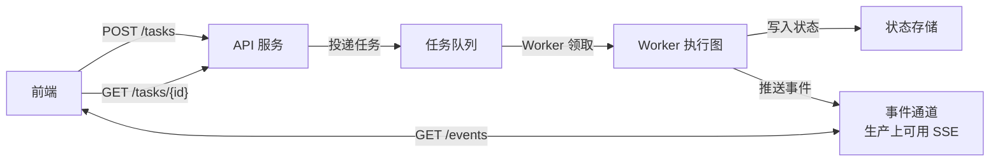
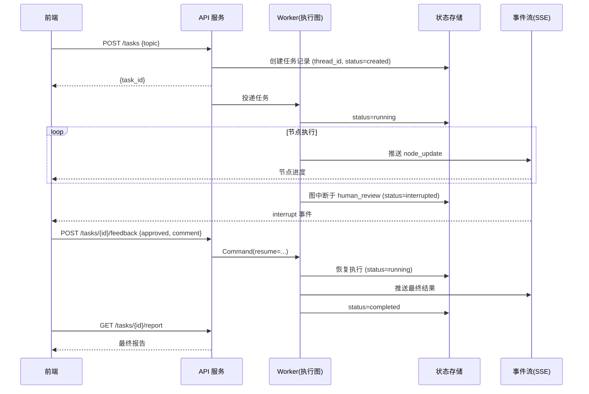
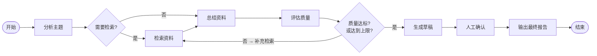

# 15. 部署与生产化注意事项

> 版本说明：本教程基于 **Python 3.10+，推荐 3.13；LangGraph 1.x**。

## 本章导读

教程项目能跑，不代表可以直接上线。生产环境要面对并发、超时、成本、权限、日志、持久化、失败恢复和数据安全——这些 LangGraph 都不替你解决，它们属于"工程化"。

这一章是**收尾章节**：梳理三种运行方式、画清部署架构、给出可勾选的生产化检查清单。读完你就知道"上线前还差什么"。

涉及代码：`code/langgraph_intro_project/`（完整项目）

---

## 本章目标

- 理解本地脚本、Web API、后台任务三种运行方式。
- 知道长任务为什么不能阻塞 HTTP 请求。
- 理解持久化如何从内存迁移到数据库。
- 建立成本、权限、观测的生产意识。
- 用检查清单评估项目是否达到上线门槛。

---

## 为什么需要这一章

前面 14 章，我们让 Agent 从"一个函数"长成了"一个项目"。但真实生产还有最后一公里：

- 图执行几十秒，HTTP 请求等得起吗？
- `InMemorySaver` 重启就丢，能上生产吗？
- 循环失控、模型调用失控，账单谁付？
- 人工审批没有审计记录，合规怎么过？

本章不写新功能，而是把这些"工程账"算清楚。

---

## 核心概念

### 三种运行方式

| 方式 | 适合场景 | 特点 |
|---|---|---|
| 本地脚本 | 学习、调试、批处理 | 最简单，阻塞执行 |
| Web API | 前端 / 其他服务触发 | 需要处理长任务 |
| 后台任务 | 长时间运行任务 | API + 队列 + Worker |

**本地脚本**（`examples/run_graph.py`）：命令式调用，适合批处理和验证。

**Web API**（`app/api/`）：对外提供接口。但要注意——**不能让长任务长期占用一个 HTTP 请求**。

**后台任务**（生产推荐形态）：



流程：API 只负责**接收任务、返回 task_id**；真正的图执行交给后台 Worker；前端通过事件通道订阅事件（生产上可用 SSE，第 12 章给出接口草图），再通过 API 查状态。

入门教程不需要实现完整队列（Celery、RQ、Arq），但要**理解这个形态**——第 12 章的 API 草图 + 本章的架构图就是这个方向的第一步。

### 持久化迁移

| 阶段 | checkpointer | 说明 |
|---|---|---|
| 教程 | `InMemorySaver` | 内存，重启丢失 |
| 单机小规模 | SQLite | 一个文件，简单可靠 |
| 生产 | PostgreSQL | 可扩展、可并发、可托管 |

迁移的关键认知：**`compile(checkpointer=...)` 的接口是统一的**。换持久化实现，图的构建和调用代码几乎不用改——这正是 LangGraph 抽象的价值。

### 配置与密钥

- API Key 放环境变量或密钥管理系统，不写代码里。
- 仓库只提交 `.env.example`，真实 `.env` 进 `.gitignore`。
- 日志不打完整 Prompt、用户隐私或密钥——只打摘要和脱敏字段。

### 成本控制：给数字

模型调用是**真金白银**，四个数字必须定：

```python
# config.py 里的硬约束
MAX_ITERATIONS = 3       # 循环上限：最坏 3 轮检索+总结
RECURSION_LIMIT = 50     # 运行时安全网
QUALITY_THRESHOLD = 80   # 达标线，减少无效循环
```

- **限制最大循环次数**：1 次任务最坏 `MAX_ITERATIONS` 轮模型调用，成本上限可估算。
- **裁剪上下文**：检索资料做去重和截断，别把全部原文塞进 Prompt（第 08 章）。
- **token 统计**：记录每次模型调用的 `prompt_tokens / completion_tokens`，按单价估算费用。
- **失败降级**：工具失败记录原因，避免反复重试烧模型。

### 权限与审计

- 人工审批必须记录**审批人、审批时间、审批意见**（第 11 章的 `approved_by`、`feedback_comment` 就是为审计留的）。
- 用户只能查看**自己的**任务状态和报告（`task_id` 归属校验）。
- 高风险任务必须人工确认。

### 观测与告警

- 每个节点耗时（第 13 章的 `log_node`）。
- 工具调用成功率和失败原因。
- 模型调用 token、耗时、费用估算。
- 对**长时间卡住、频繁失败、递归超限**建立告警。

---

## 最小代码示例

本章的"最小代码"不是图逻辑（那在 14 章已定型），而是**最小部署配置**——生产环境与教程的差别，大部分体现在配置。看 `.env.example` 与 `app/config.py` 的组合：

```properties
# .env.example（提交到仓库，不含真实密钥）
# 运行模式
USE_MOCK=true

# 流程控制（成本硬约束）
MAX_ITERATIONS=3
RECURSION_LIMIT=50
QUALITY_THRESHOLD=80

# 模型配置（真实模式使用）
OPENAI_BASE_URL=https://api.openai.com/v1
OPENAI_API_KEY=
OPENAI_MODEL=gpt-4o-mini
```

```python
# app/config.py（读取 .env）
USE_MOCK: bool = _to_bool(os.getenv("USE_MOCK"), default=True, name="USE_MOCK")
MAX_ITERATIONS: int = _to_int(os.getenv("MAX_ITERATIONS"), default=3, name="MAX_ITERATIONS", minimum=1)
RECURSION_LIMIT: int = _to_int(os.getenv("RECURSION_LIMIT"), default=50, name="RECURSION_LIMIT", minimum=1)
QUALITY_THRESHOLD: int = _to_int(os.getenv("QUALITY_THRESHOLD"), default=80, name="QUALITY_THRESHOLD", minimum=0)
OPENAI_API_KEY: str = os.getenv("OPENAI_API_KEY", "")
```

**部署要点**：

- 仓库只提交 `.env.example`，真实 `.env` 在部署环境单独配置。
- 切换环境只改 `.env`，代码一行不动。
- `MAX_ITERATIONS` / `QUALITY_THRESHOLD` 是**成本硬约束**，生产环境要有人负责"收紧"它们。

---

## 执行过程拆解

一次生产任务的完整时序：



三个关键决策点：

1. **`POST /tasks` 生产上应立即返回 `task_id`**，不等待图执行完——长任务绝不阻塞 HTTP。当前教程项目仍保留同步 demo，方便读者一口气看到完整流程。
2. **`interrupted` 是一个正式状态**，前端看到它才弹审批卡片（第 11、12 章）。
3. **`GET /tasks/{id}/report` 独立于事件流**，最终结果可事后获取。

---

## 贯穿项目改造

"资料检索与总结 Agent"的完整能力（本项目各章改造的最终收束）：



它应该支持：

- **模拟模式**：`USE_MOCK=true`，无真实模型和外部检索，适合测试（CI 用它）。
- **真实模式**：`USE_MOCK=false`，调用真实模型和工具，适合验收。
- **会话恢复**：通过 `thread_id` 找回任务状态（第 10 章）。
- **流式输出**：前端看节点进度（第 12 章）。
- **人工介入**：用户审批或补充要求（第 11 章）。

配套的**最小 API**（第 12 章已设计接口，这里补任务状态语义）：

```text
POST /tasks                      创建任务
GET  /tasks/{task_id}            查询任务状态
GET  /tasks/{task_id}/events     查询事件（生产可扩展为 SSE 订阅）
POST /tasks/{task_id}/feedback   提交人工反馈
GET  /tasks/{task_id}/report     获取最终报告
```

任务状态机：

```text
created -> running -> interrupted -> completed
                        |--> failed
                        |--> cancelled
```

- `interrupted`：图在 `human_review` 等人（第 11 章）。
- `failed`：图执行异常。
- `cancelled`：用户主动取消（入门不做，生产需要）。

---

## 代码运行方式

```powershell
cd code/langgraph_intro_project

# 本地脚本（默认模拟模式）
python examples/run_graph.py

# API 服务
uvicorn app.api.main:app --reload

# 测试
pytest
```

**切换真实模式：**

```powershell
$env:USE_MOCK="false"
$env:OPENAI_API_KEY="你的 API Key"
python examples/run_graph.py
```

---

## 生产化检查清单

逐项确认，标出"已完成 / 未完成 / 不适用"：

| # | 检查项 | 检查方式 |
|---|---|---|
| 1 | 有 `.env.example`，真实 `.env` 未提交 | 看仓库文件列表 |
| 2 | 模型配置（base_url / model / key）集中在 config | 看 `app/config.py` |
| 3 | 限制最大循环次数 | `MAX_ITERATIONS` 已设置 |
| 4 | 设置 `recursion_limit` | `graph.invoke(..., {"recursion_limit": N})` |
| 5 | 工具调用有超时和失败处理 | 工具层 `timeout=` + `try/except` |
| 6 | 区分 checkpointer 和业务数据库 | 状态里没有塞大表数据 |
| 7 | 能按 `thread_id` 恢复任务 | 集成测试覆盖恢复 |
| 8 | 人工审批有审计字段 | `approved_by` / `feedback_comment` |
| 9 | 有节点级结构化日志 | `log_node` 已包装 |
| 10 | 有业务函数 + 节点单测 | `pytest` 通过 |
| 11 | 有图级集成测试 | `tests/test_graph.py` 通过 |
| 12 | 有任务状态接口 | `GET /tasks/{id}` 存在 |
| 13 | 有成本和并发限制 | 循环上限 + 并发控制 |
| 14 | 有错误告警 | 日志/观测接入告警 |
| 15 | 长任务不阻塞 HTTP | 后台任务形态（或明确说明未实现） |
| 16 | 用户只能看自己的任务 | 接口归属校验 |

**诚实声明**：本教程项目完成第 1-14 项的主体，第 15-16 项是"生产还需要补"的工程能力。

---

## 调试与排查

### 场景一：长任务把 HTTP 请求拖死

**现象**：`POST /tasks` 等了 30 秒才返回。

**原因**：接口里同步执行了完整图。

**排查**：API 只创建任务返回 `task_id`，图执行放后台 Worker；前端订阅事件。入门阶段至少要**意识**到这一点，不要无脑同步。

### 场景二：重启后状态全丢

**现象**：服务重启，所有任务状态消失。

**原因**：`InMemorySaver`。

**排查**：换 SQLite / Postgres checkpointer。接口不变，只换实现。

### 场景三：账单爆了

**现象**：一个月模型费用超预期。

**原因**：循环上限没设、上下文不裁剪、失败后无限重试。

**排查**：检查 `MAX_ITERATIONS`、上下文裁剪逻辑、工具失败的重试次数。记录 token 用量，按日对账。

### 场景四：日志泄露敏感信息

**现象**：日志里有完整 Prompt 和 API Key。

**原因**：日志直接打印了完整输入。

**排查**：日志只打字段摘要（如 `output_keys`、`duration_ms`），Prompt / 密钥脱敏。

---

## 常见错误

| 现象 | 原因 | 解决 |
|---|---|---|
| 内存持久化直接上生产 | 没理解重启丢失 | 换 SQLite / Postgres |
| 长任务阻塞 HTTP | 同步执行图 | 后台任务 + SSE |
| 循环 / 模型调用失控 | 没有成本上限 | `MAX_ITERATIONS` + 上下文裁剪 |
| 人工审批无审计 | 没记录审批人/意见 | 保留 `approved_by` / `feedback_comment` |
| 日志打完整 Prompt / 密钥 | 敏感信息处理不当 | 摘要 + 脱敏 |
| 接口不校验归属 | 用户能看到别人的任务 | 按用户校验 `task_id` |

---

## 练习任务

**必做 1：评估你的项目**

用本章检查清单，给你的 `code/langgraph_intro_project/` 逐项标注"已完成 / 未完成 / 不适用"，写进项目 README。

自查：你能对每一项说出"检查方式"，而不只是打勾。

**必做 2：切换 SQLite checkpointer**

安装 `langgraph-checkpoint-sqlite`，把 `app/graph.py` 的 `InMemorySaver` 换成 SQLite 实现。重启脚本后，用同一个 `thread_id` 验证状态还在。

自查：图的构建和调用代码没有其他改动，验证了 checkpointer 抽象的价值。

**扩展练习：设计后台任务架构**

画一张部署架构图（可参考本章 mermaid），标注：API、队列、Worker、状态存储、事件流各自的职责和交互。

自查：你能说清"任务创建后，从提交到用户看到结果，数据经过哪些组件"。

---

## 本章小结

- 三种运行方式：本地脚本 / Web API / 后台任务，各有适用场景。
- 生产推荐形态：**API 创建任务 → 队列 → Worker 执行 → 存储 → 前端订阅事件**。
- 持久化：内存 → SQLite → Postgres，接口不变，换实现即可。
- 成本：循环上限、上下文裁剪、token 统计、失败降级。
- 合规：人工审批留审计字段，接口校验归属。
- 用检查清单判断上线门槛。

到这里，你已经从普通函数、单节点图、多节点流程、条件分支、循环、工具、LLM、持久化、人工介入、流式输出，一路走到了工程化落地。接下来的进阶方向：LangSmith 深度评估、向量数据库与 RAG、多 Agent 协作——这些在 `langgraph/` notebook 和 `LangGraph-笔记/` 里都有更深的内容可以继续。

---

## 本章速查

**上线前四大问**

1. 状态能恢复吗？（持久化）
2. 成本有上限吗？（循环 + 裁剪 + token）
3. 出错找得到吗？（日志 + 观测 + 告警）
4. 人工介入有审计吗？（审批记录 + 归属校验）

**参考命令**

```powershell
# 真实模式
$env:USE_MOCK="false"
$env:OPENAI_API_KEY="..."
python examples/run_graph.py

# 服务
uvicorn app.api.main:app --reload
```

**加深阅读**

- 系统笔记：`LangGraph-笔记/04-LangGraph中断与工具与部署.md` 的「部署」相关章节
- 官方文档：[LangGraph 部署选项](https://docs.langchain.com/oss/python/langgraph/deployment)
