# 16. LangGraph 业务落地项目架构

> 版本说明：本教程基于 **Python 3.10+，推荐 3.13；LangGraph 1.x**。

## 本章导读

前面 15 章已经把"资料检索与总结 Agent"从单文件示例推进到可运行项目。本章换一个视角：不再只看某个节点怎么写，而是站在**业务落地项目架构**上，看一个 LangGraph 应用从需求入口、图编排、工具调用、人工审批、状态持久化到生产运维应该怎样分层。

本章使用 Mermaid 流程图展示，在不同阅读器和主题下均可自适应缩放，不会出现文字截断或线条交叉的问题。

涉及代码：`code/langgraph_intro_project/`（完整项目）

---

## 本章目标

- 看懂 LangGraph 在业务系统里的位置。
- 理解"业务流程图"、"代码模块"、"运行时基础设施"三者如何对应。
- 明确 API、Worker、Graph、Node、Tool、Store 的职责边界。
- 掌握从教程项目演进到生产项目的架构路线。
- 能用一张图向团队解释 LangGraph 项目为什么这样拆。

---

## 一句话架构

LangGraph 不负责替代整个后端系统，它负责把一个**有状态、有分支、有循环、可中断恢复的业务流程**编排起来。

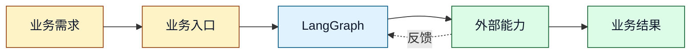

关键认知：

- API 负责接收请求，不负责写复杂流程。
- LangGraph 负责决定下一步走哪个节点、什么时候循环、什么时候暂停。
- 节点负责把状态交给业务能力处理，再把结果写回状态。
- 工具、模型、数据库、人工审批都是被图调用的能力，不应该反向控制图。

---

## 业务落地的三层视角

真实项目经常混乱，是因为大家把"业务流程"、"代码结构"、"部署架构"混在一起讲。落地时建议分成三张图：

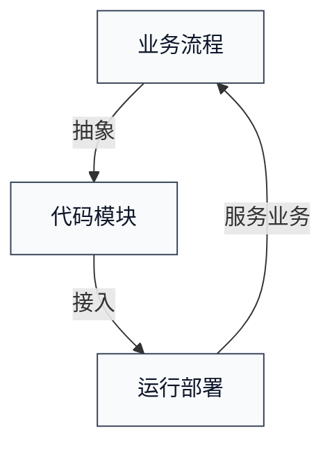

对应到本教程：

| 视角 | 要回答的问题 | 本项目对应内容 |
|---|---|---|
| 业务流程 | 先做什么，后做什么，什么时候返工，什么时候让人确认 | `analyze -> search -> summarize -> evaluate -> review -> report` |
| 代码模块 | 状态、节点、工具、Prompt、API 分别放哪里 | `app/state.py`、`app/nodes/`、`app/tools/`、`app/prompts/`、`app/api/` |
| 运行部署 | 长任务、恢复、事件、失败、成本如何处理 | `thread_id`、checkpointer、API、事件接口、测试和配置 |

---

## 业务流程架构

"资料检索与总结 Agent"的业务流程不是简单流水线，因为它有两个关键控制点：

1. **质量不达标要回到检索**：这是业务循环。
2. **生成草稿后要人工确认**：这是 Human-in-the-loop。

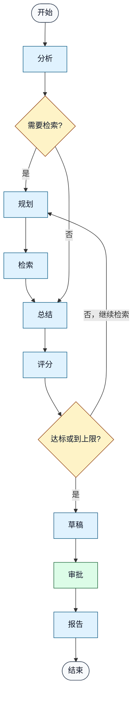

这张图对应 `app/graph.py`：

- `add_node(...)` 定义图上有哪些业务步骤。
- `add_edge(...)` 定义固定顺序。
- `add_conditional_edges(...)` 定义业务分支。
- `compile(checkpointer=...)` 定义图是否可恢复。

---

## 代码模块架构

一个业务项目不能把所有逻辑都塞进 `graph.py`。推荐把 LangGraph 项目拆成六类模块：

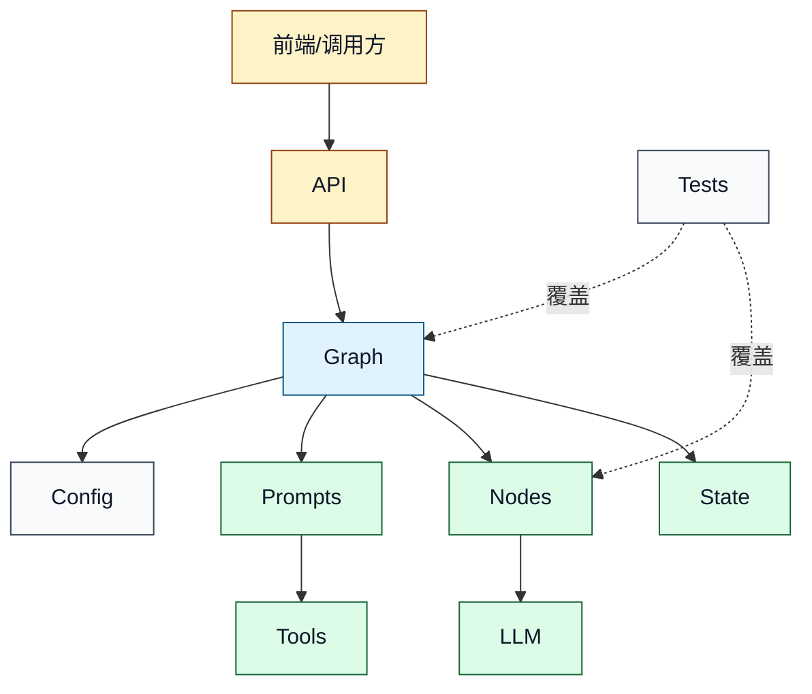

| 模块 | 职责 | 不应该做 |
|---|---|---|
| `app/api/` | 参数校验、任务创建、状态查询、人工反馈入口 | 不写 Prompt，不决定图路线 |
| `app/graph.py` | 注册节点、连边、路由、编译图 | 不写具体业务处理细节 |
| `app/state.py` | 定义共享状态字段和初始状态 | 不调模型，不调工具 |
| `app/nodes/` | 读状态、调业务能力、写状态 | 不直接处理 HTTP，不读写任务表 |
| `app/tools/` | 封装搜索、数据库、内部系统等外部能力 | 不依赖 LangGraph 状态 |
| `app/prompts/` | 存放可独立评审的模型指令 | 不混在 Python 逻辑里 |
| `app/llm.py` | 模型调用、mock/real 切换、结构化输出兜底 | 不决定业务流程 |
| `tests/` | 验证节点输出和图级行为 | 不依赖真实线上服务 |

---

## State 是业务上下文，不是数据库

LangGraph 的 `State` 是一次任务在图执行过程中的共享上下文。它适合放"后续节点必须继续使用的数据"，不适合当成业务数据库。

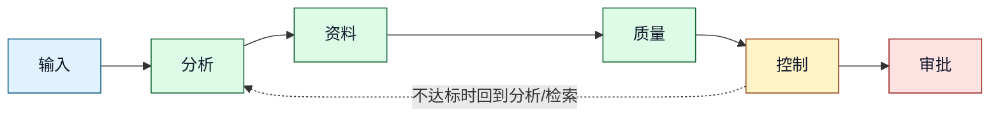

判断一个字段该不该进 `State`，可以问三句话：

1. 后续节点是否需要它？
2. 恢复任务时是否需要它？
3. 审计、调试、展示进度时是否需要它？

三个问题都是否定，就不要放进 `State`。例如临时变量、一次性格式化字符串、局部计算结果，应留在节点函数内部。

---

## 运行时架构：教程版与生产版

教程项目为了便于理解，API 中同步执行图，任务结果放在内存字典里。这种方式适合学习，不适合生产。

### 教程版运行架构

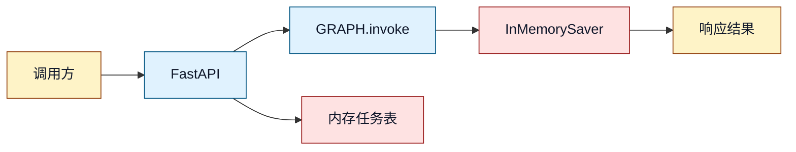

限制很明显：

- HTTP 请求会等待图执行。
- 进程重启后 `_TASKS` 和 `InMemorySaver` 都会丢。
- 并发、重试、取消、告警都很难做。

### 生产版推荐架构

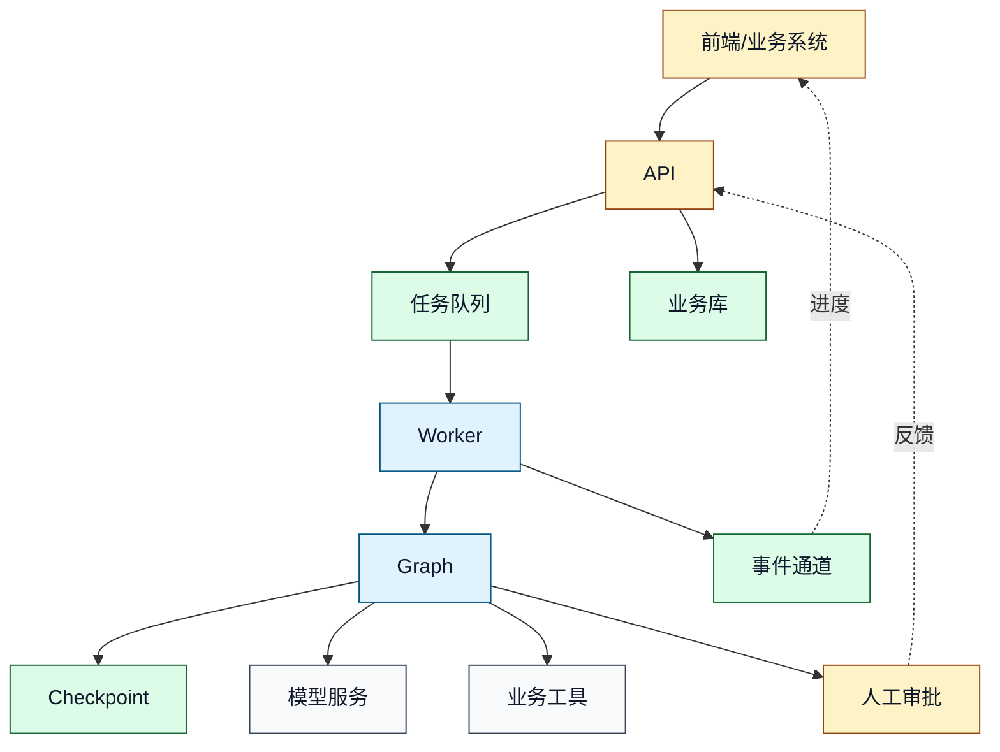

生产版的核心变化：

- API 不等待图跑完，只返回 `task_id`。
- Worker 独立执行图，失败后可重试或标记失败。
- Checkpoint 持久化到数据库，支持恢复和人工继续。
- 任务状态、权限、审计、最终结果进入业务数据库。
- 事件通道负责把节点进度推给前端。

---

## 一次任务的完整时序

这张图把"创建任务 -> 图中断 -> 人工审批 -> 恢复执行 -> 获取报告"串起来：

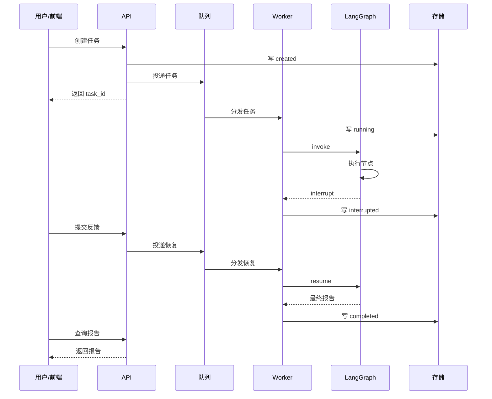

注意：`thread_id` 是恢复的关键。没有稳定的 `thread_id`，`Command(resume=...)` 就找不到之前暂停的那次图执行。

---

## 数据边界：Checkpoint 与业务库分工

很多项目会把 checkpointer 当数据库用，这是高风险设计。更稳妥的做法是分工：

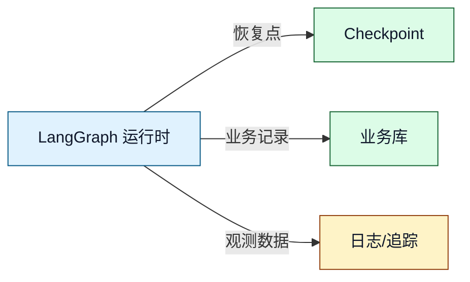

| 数据 | 放哪里 | 原因 |
|---|---|---|
| 图恢复快照 | Checkpoint Store | 给 LangGraph 恢复执行用 |
| 任务列表、状态、创建人 | 业务数据库 | 给业务系统查询、鉴权、统计 |
| 最终报告 | 业务数据库或对象存储 | 用户需要长期查看 |
| 审批人、审批时间、意见 | 业务数据库 | 审计合规需要 |
| 节点耗时、token、错误摘要 | 日志/追踪系统 | 排查和成本分析需要 |
| 临时 Prompt 拼接内容 | 通常不长期保存 | 可能包含敏感信息，且体积大 |

---

## 关键架构决策

### 1. 图是业务流程，不是工具集合

工具越多，越需要图来管顺序和退出条件。不要让每个工具自己决定下一步，否则流程会分散在很多文件里。

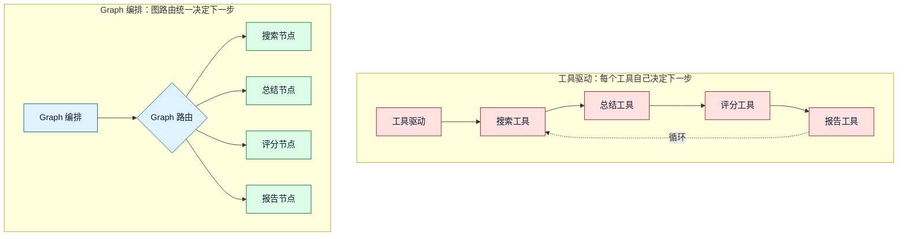

### 2. 节点要薄，业务能力要可测

节点的理想形态是：

```text
读 State -> 调业务函数/工具/模型 -> 返回要更新的字段
```

这样做的好处是节点可以测试，工具可以替换，Prompt 可以评审，图可以单独验证。

### 3. 循环必须有业务上限和运行时上限

本项目有两道闸：

- `max_iterations`：业务层上限，防止一直补充检索。
- `recursion_limit`：LangGraph 运行时上限，防止图无限递归。

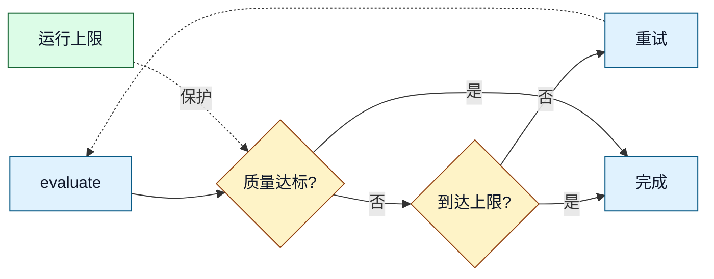

### 4. 人工介入是正式状态，不是弹窗

人工审批不是前端临时弹个框那么简单。后端必须知道任务已经进入 `interrupted`，并持久化草稿、审批问题和恢复所需的 `thread_id`。

---

## 从教程项目到业务项目的演进路线

不要一上来就做全量平台。一个可控的演进路线更现实：

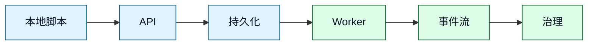

每一阶段的验收标准：

| 阶段 | 验收标准 |
|---|---|
| 本地脚本 | 给定输入能稳定跑完，失败能看见错误 |
| API 包装 | 能创建任务、查询任务、提交人工反馈 |
| 持久化 | 进程重启后能按 `thread_id` 恢复 |
| 队列 + Worker | HTTP 不阻塞，长任务由 Worker 执行 |
| 事件流 | 前端能看到节点级进度和中断事件 |
| 生产治理 | 有权限、审计、成本上限、告警、回放能力 |

---

## 落地检查清单

上线前至少检查这些项：

| 类别 | 检查项 |
|---|---|
| 流程 | 每个节点职责清楚，分支条件可解释，循环有退出条件 |
| 状态 | `State` 字段完整但不过度膨胀，初始状态统一构造 |
| 持久化 | checkpointer 不使用纯内存，`thread_id` 稳定可追踪 |
| API | 创建任务立即返回，长任务不阻塞 HTTP |
| Worker | 支持失败标记、重试策略、超时控制 |
| 工具 | 外部调用有超时、错误分类、结果摘要 |
| LLM | Prompt 独立管理，结构化输出有兜底 |
| 人工介入 | 中断状态可查询，审批记录可审计 |
| 观测 | 记录节点耗时、工具成功率、token、错误原因 |
| 安全 | API Key 不进代码和日志，用户只能访问自己的任务 |
| 测试 | 节点单测、路由测试、图级集成测试都覆盖 |

---

## 本章小结

LangGraph 业务落地项目的核心不是"会画一个图"，而是把业务流程稳定地变成一个可恢复、可观测、可治理的运行系统。

记住这张总图：

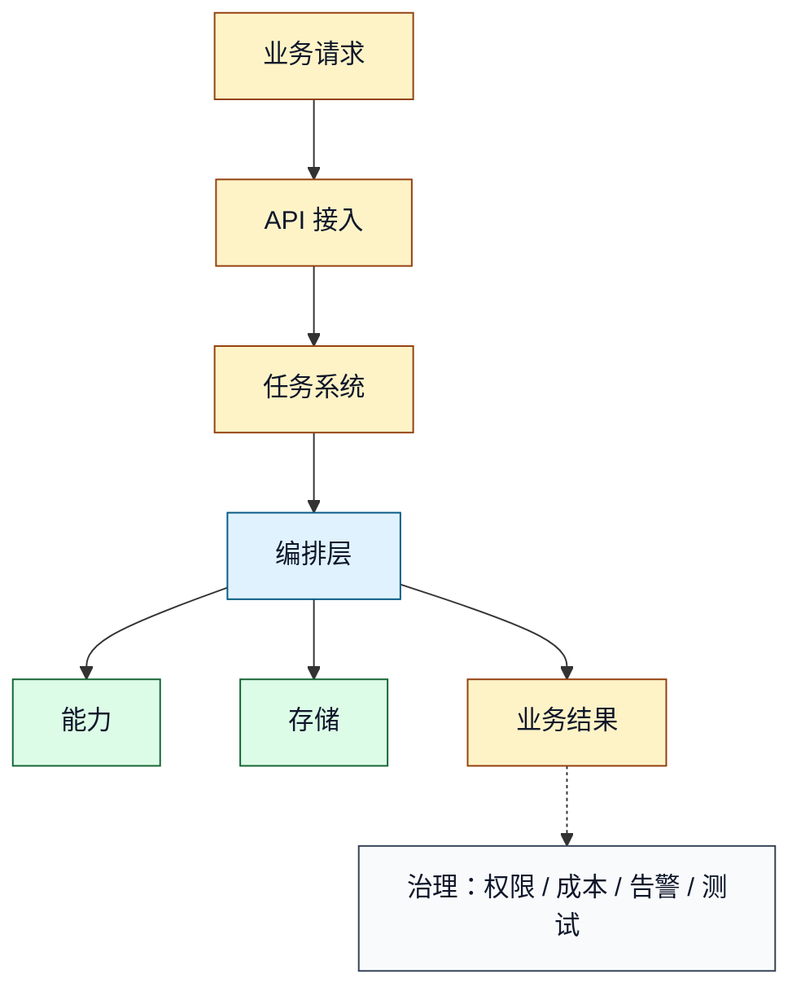

能把这张图讲清楚，就说明你已经从"会用 LangGraph API"走到了"能设计 LangGraph 业务项目"。

回到 [README](./README.md)。
