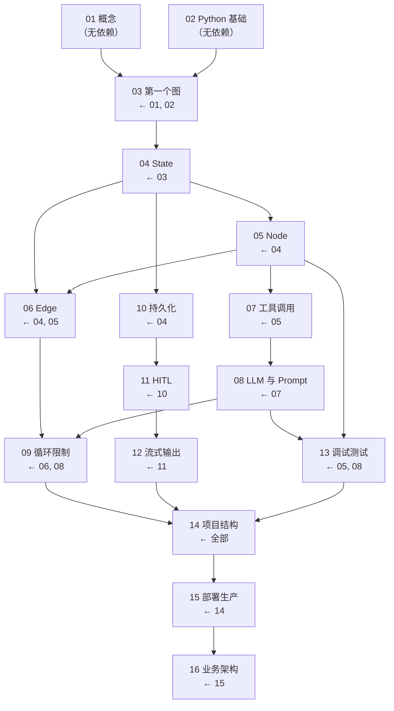

# 学习地图：一图看懂整个教程

> 开始第 01 章之前，先花 3 分钟看这张地图。它会告诉你三件事：
> 1. 学完整个教程，你能做出什么。
> 2. 16 章之间是什么关系。
> 3. 每章学完，你多了一个什么能力。

---

## 1. 贯穿项目演进总览：项目是怎么长大的

贯穿项目"资料检索与总结 Agent"从普通函数一路成长为可部署服务。每一章，项目都多了一个能力：

**怎么读这张图**：每到一个节点，问自己"现在项目多了什么"。如果答不上来，说明上一章没消化，回头再看一眼。

---

## 2. 章节依赖关系

按 01-16 顺序读就是主线。这张图告诉你哪些章节有硬性前置——遇到看不懂的地方，先确认前置是否过关：

**关键路径**：03 → 04 → 06 → 09 → 10 → 11 → 12 → 14 → 15 → 16

这是理解 LangGraph 的主干。02、05、07、08、13 是重要的支线，但主线不通，支线没意义。

---

## 3. 章节一句话总览

每章学完你能做什么，以及一句话记忆点：

| 章 | 学完你能 | 一句话要点 |
|---|---|---|
| 01 LangGraph 是什么 | 判断要不要用 LangGraph | 流程里有"回路"或"人"，就值得用 |
| 02 Python 最小基础 | 看懂并运行 Python 示例 | 字典 + `TypedDict` + 虚拟环境 |
| 03 第一个图 | 跑通最小 LangGraph | 节点做事、边定顺序、状态传数据 |
| 04 State | 设计共享状态 | 下一个节点需要的数据才进 State |
| 05 Node | 写出可测试的节点 | 节点是薄胶水，业务逻辑下沉 |
| 06 Edge | 给流程加分叉 | 路由函数选标签，path_map 做映射 |
| 07 工具调用 | 让 Agent 连接外部 | 工具只返回，节点写状态，失败进 errors |
| 08 LLM 与 Prompt | 用 LLM 且输出稳定 | Prompt 即契约，结构化输出 + 兜底 |
| 09 循环限制 | 让 Agent 自我修正 | 达标退出 + 上限兜底，缺一不可 |
| 10 持久化 | 状态可恢复 | checkpointer + `thread_id` |
| 11 人工介入 | 关键步骤让人审批 | `interrupt` 暂停，`Command(resume)` 恢复 |
| 12 流式输出 | 前端看到进度 | 逐步输出，统一事件结构 |
| 13 调试测试 | 出问题找得到 | 结构化日志 + 分层测试 |
| 14 项目结构 | 整理成项目 | 每层各管一段，单向依赖 |
| 15 部署生产 | 知道上线差什么 | 三种运行方式 + 检查清单 |
| 16 业务架构 | 讲清落地项目怎么设计 | 业务流程 + 代码模块 + 运行部署 |

---

## 4. 学习节奏建议

| 节奏 | 适用 | 做法 |
|---|---|---|
| 标准（推荐） | 想扎实入门 | 01-16 顺序读，每章做必做练习 |
| 快速 | 时间紧张 | 主线 03→04→06→09→10→11→12→14→15→16，跳过 05/07/08/13 先通主干 |
| 打基础 | Python 生疏 | 先认真过 02，03 逐行注释版多看几遍 |
| 复习 | 忘了细节 | 用本文件的"一句话总览"定位章节，用[术语表](./术语表.md)查概念，用[错误速查](./术语表.md#2-错误速查表)查报错 |

---

回到 [README](./README.md)。
