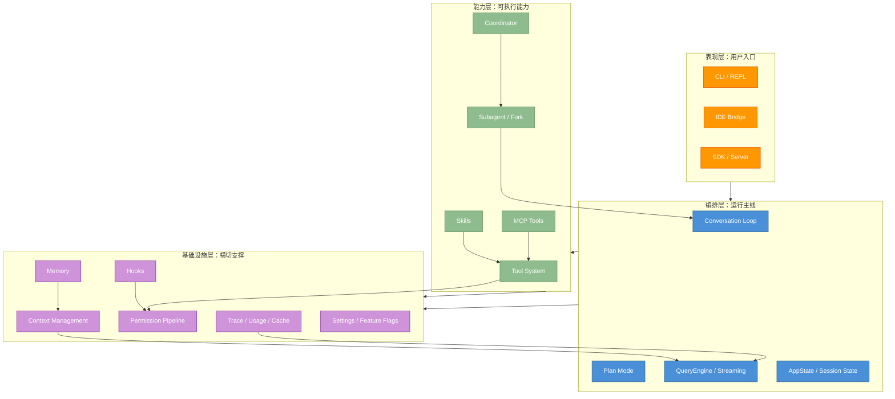
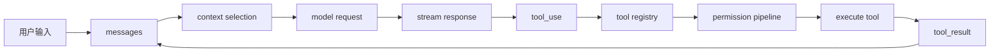

# 附录 A：架构导航地图

原课程对应：`附录/A-源码导航地图.md`

> 本附录用于在读完全书或卡在某个模块时，快速回到系统全景。它不是替代正文，而是把正文 15 章放到同一张架构地图里。

## A.1 先看全景：Claude Code 的四层结构



读图结论：

- 对话循环是运行主线，不是单独模块知识点。
- 工具、MCP、Skill、Subagent 都会回到工具系统、权限管线和上下文管理。
- 设置、功能标志、Hooks、Trace 不是主线动作，但会影响几乎所有主线动作。

## A.2 模块索引

| 模块 | 主要职责 | 对应章节 |
|------|----------|----------|
| Conversation Loop | 管理 turn、messages、stop reason、tool_result 回填 | 第 2 章 |
| Tool System | 定义、过滤、执行工具，把模型意图落地 | 第 3 章 |
| Permission Pipeline | 控制工具是否可执行、是否需要用户确认 | 第 4 章 |
| Settings | 管理配置层级、项目配置、企业策略和功能开关 | 第 5 章 |
| Memory | 保存跨会话稳定知识，并在需要时进入上下文 | 第 6 章 |
| Context Management | 选择、压缩、裁剪本轮模型可见信息 | 第 7 章 |
| Hooks | 在生命周期节点插入检查、拦截、审计和自动化 | 第 8 章 |
| Subagent / Fork | 派生独立上下文处理可隔离子任务 | 第 9 章 |
| Coordinator | 编排多个 Worker、共享中间成果、综合结果 | 第 10 章 |
| Skills | 按需加载任务知识包和流程包 | 第 11 章 |
| MCP | 通过标准协议接入外部工具和资源 | 第 12 章 |
| Streaming / Performance | 优化流式体验、工具并发、缓存和成本 | 第 13 章 |
| Plan Mode | 先规划、验证计划，再执行复杂任务 | 第 14 章 |
| Build Your Harness | 把前面机制收束成自研路线 | 第 15 章 |

## A.3 关键数据流

### 标准工具调用路径



这个路径是全书主干。第 3、4、8、12 章看起来都在讲不同机制，但它们最终都插在这个路径上。

### 长任务状态路径

```text
messages
  -> context
  -> compact summary
  -> memory candidate
  -> trace / usage
  -> next turn
```

读长任务相关章节时，用这条路径区分：

| 概念 | 关注点 |
|------|--------|
| `messages` | 当前会话历史和工具结果 |
| `context` | 本轮送进模型的信息 |
| `compact summary` | 长历史压缩后的可继续状态 |
| `memory` | 跨会话可复用知识 |
| `trace / usage` | 复盘、调试、成本和缓存证据 |

## A.4 阅读建议

如果读正文时卡住，按这个顺序回查：

1. 先看本附录的四层结构，判断当前概念属于哪一层。
2. 再看 [architecture-learning-map.md](architecture-learning-map.md) 的全书学习路线。
3. 如果是术语不清，查 [appendix-d-glossary.md](appendix-d-glossary.md) 或 [glossary.md](glossary.md)。
4. 如果是工具、功能标志不清，查附录 B、附录 C。

