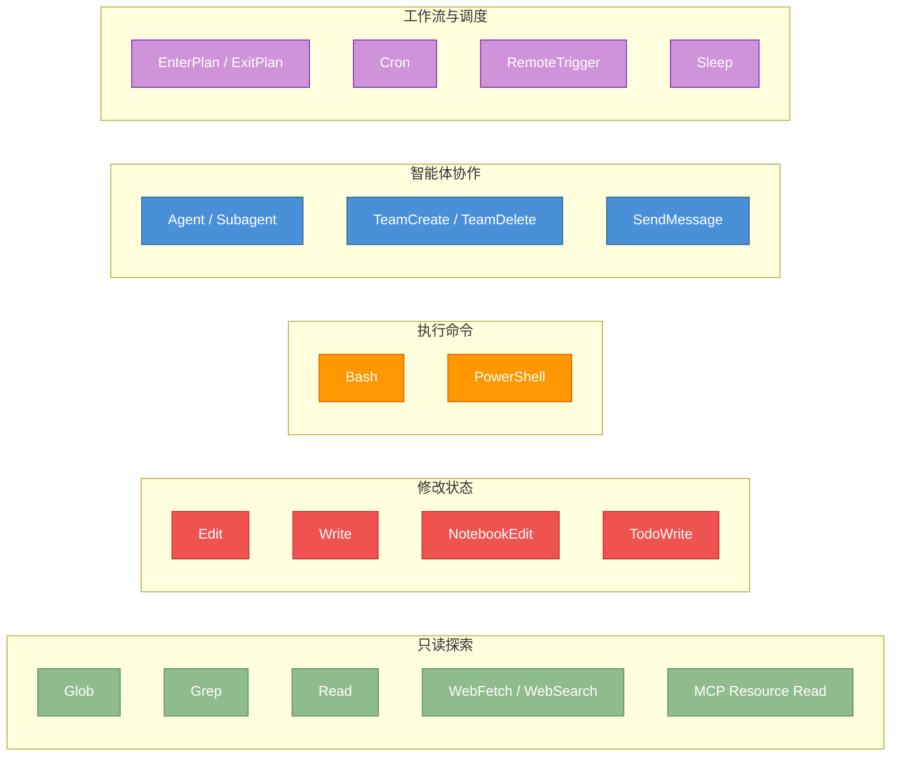

# 附录 B：工具完整清单

原课程对应：`附录/B-工具完整清单.md`

> 本附录的目标不是让你背工具名，而是帮助你理解工具系统的分类、风险边界和组合方式。具体 API 和字段看到能识别即可。

## B.1 工具分类总览



## B.2 工具风险梯度

| 风险层级 | 工具类型 | 权限重点 |
|----------|----------|----------|
| 低 | Read、Glob、Grep、List resources | 输出可能很大，但通常不修改状态 |
| 中 | WebFetch、WebSearch、Read MCP resource | 网络和外部资源可能不稳定，需要来源意识 |
| 中高 | Edit、Write、NotebookEdit、TodoWrite | 会修改本地文件或会话状态，必须确认范围 |
| 高 | Bash、PowerShell | 命令可能读、写、删除、联网或长时间运行 |
| 高 | MCP 工具调用 | 外部服务能力不完全由本地代码控制 |
| 很高 | Team、Subagent、Cron、RemoteTrigger | 会放大执行范围、时间跨度和协作复杂度 |

## B.3 常用组合模式

### 代码探索

```text
Glob -> Grep -> Read -> 总结结构
```

先定位文件，再定位符号，最后读具体上下文。不要一开始就读大文件。

### 安全修改

```text
Read -> Edit/Write -> Bash test -> tool_result -> 继续判断
```

修改前先看现状，修改后必须把验证结果回填给模型。

### 外部能力接入

```text
MCP 连接 -> 工具发现 -> mcp__server__tool -> 权限管线 -> 外部调用
```

MCP 不是绕过权限的快捷通道，它只是把外部能力适配成内部工具。

### 多 Agent 协作

```text
拆分任务 -> 派 Subagent/Worker -> 写中间产物 -> 主 Agent/Coordinator 综合
```

关键不是开多少 Agent，而是结果是否能被可靠整合。

## B.4 学习时该记什么

| 必须理解 | 看到能识别 | 查阅即可 |
|----------|------------|----------|
| 工具是模型意图落地的执行入口 | `readOnly`、`destructive`、`concurrencySafe` | 具体工具内部函数名 |
| 工具执行前要过 schema 和权限 | `tool_use`、`tool_result` | 每个工具的完整参数列表 |
| 写入、执行、远程调用风险不同 | `mcp__server__tool` | 所有 feature flag 对应工具 |
| 并发只适合并发安全工具 | `Bash` 动态判断 | 内部测试工具和实验工具 |

