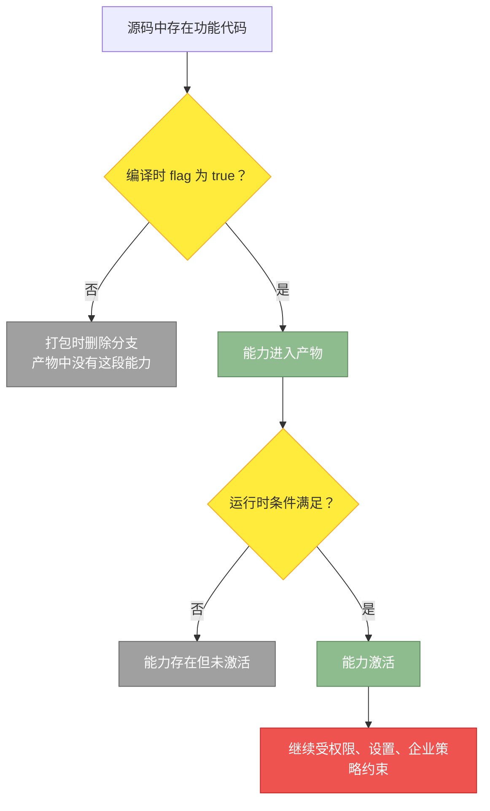

# 附录 C：功能标志速查表

原课程对应：`附录/C-功能标志速查表.md`

> 功能标志不要当成配置项清单背诵。它们的核心价值是控制能力是否进入构建产物、是否在运行时激活，以及是否逐步发布给用户。

## C.1 先看全景：编译时门控和运行时门控



读图结论：

- 编译时为 `false`：能力可能根本不在最终产物里。
- 编译时为 `true`：只代表代码存在，不代表用户一定能用。
- 运行时激活后：仍然要受权限、设置、白名单和策略约束。

## C.2 按功能域理解

| 功能域 | 典型能力 | 对应章节 |
|--------|----------|----------|
| 交互模式 | Plan、Bridge、Proactive、Daemon | 第 5、12、14 章 |
| 子任务与协作 | Fork、Coordinator、Verification Agent、Triggers | 第 9、10、14 章 |
| 上下文与压缩 | AutoCompact、MicroCompact、History Snip、Token Budget | 第 7、13 章 |
| 权限与安全 | Bash Classifier、Transcript Classifier、Hard Fail | 第 4 章 |
| 工具与技能 | ToolSearch、MCP Skills、Skill Search、Browser Tool | 第 3、11、12 章 |
| 会话与持久化 | Background Sessions、File Persistence、Away Summary | 第 14、15 章 |
| 记忆与知识 | Team Memory、Extract Memories、Memory Telemetry | 第 6 章 |
| 远程与部署 | SSH Remote、Self Hosted Runner、Direct Connect | 第 15 章 |
| 遥测与诊断 | Perfetto、Shot Stats、Slow Operation Logging | 第 13 章 |

## C.3 常见组合

| 场景 | 关注的标志类型 | 学习重点 |
|------|----------------|----------|
| 日常开发 | 权限分类、上下文压缩、基础工具 | 安全和体验平衡 |
| IDE 协作 | Bridge、KAIROS、IDE 工具白名单 | 双向通信和权限回调 |
| 多 Agent | Fork、Coordinator、Verification Agent | 任务拆分和结果整合 |
| 长任务 | Background Session、Daemon、Triggers | 生命周期和恢复 |
| 性能调优 | Cache、Token Budget、Tracing | 成本、延迟和证据 |
| 企业安全 | Hard Fail、Attestation、策略门控 | 最小权限和审计 |

## C.4 学习时该记什么

| 必须理解 | 看到能识别 | 查阅即可 |
|----------|------------|----------|
| feature flag 可以影响代码是否进入产物 | 编译时 vs 运行时门控 | 全部 flag 名称 |
| 功能打开不等于权限放开 | flag、settings、permission 的关系 | 每个 flag 的内部实现位置 |
| 高级能力通常需要多个 flag 组合 | Fork、Coordinator、Triggers 等标志族 | 各标志默认值 |
| flag 是渐进发布和实验隔离手段 | DCE、runtime gate、policy gate | 内部实验标志含义 |

## C.5 和第 15 章的关系

自研 Harness 时，不必一开始做复杂 feature flag 系统。推荐顺序：

```text
第一阶段：普通配置开关
第二阶段：运行时策略门控
第三阶段：构建时裁剪实验能力
第四阶段：企业策略和灰度发布
```

如果项目还没有稳定核心循环，先不要把功能标志系统做得很复杂。

