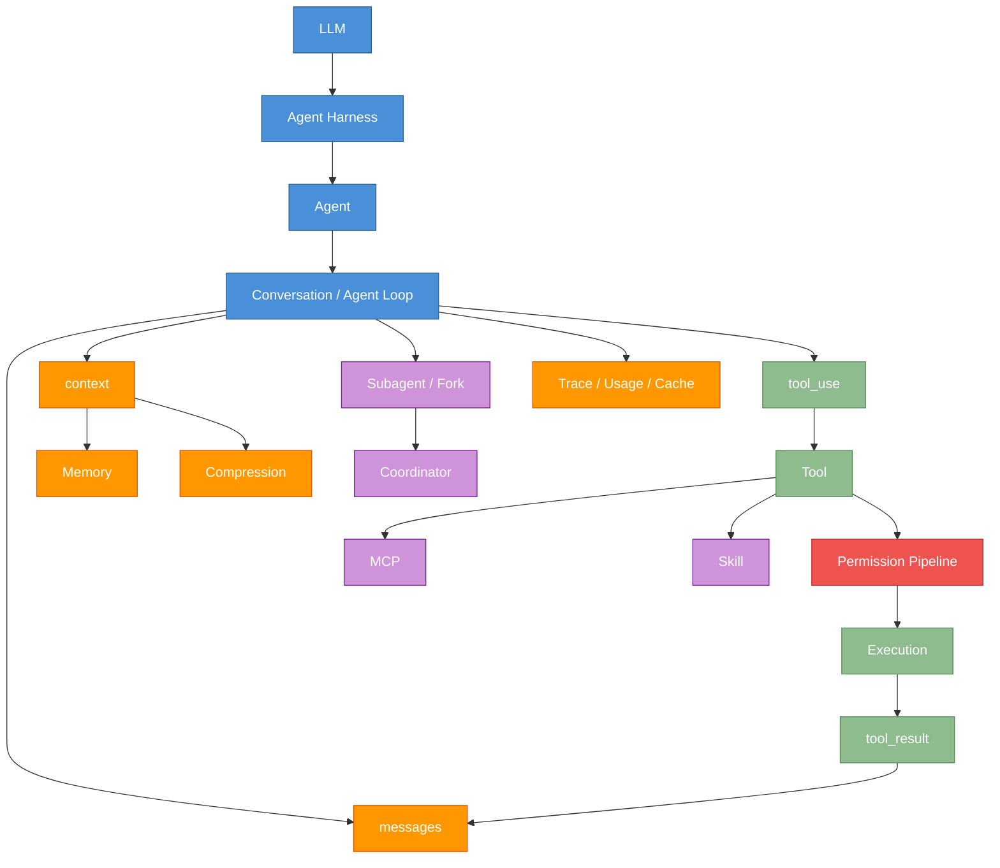

# 附录 D：术语表

原课程对应：`附录/D-术语表.md`

> 本附录用于统一术语理解。完整阅读时可以先看关系图；遇到单个词不清楚时，再回到 [glossary.md](glossary.md) 查更短的定义。

## D.1 核心概念关系图

## D.2 高频术语速查

| 术语 | 易学解释 | 重点章节 |
|------|----------|----------|
| Agent | 能围绕目标多轮观察、行动、再观察的系统 | 第 1 章 |
| Harness | 包在模型外面的工程运行环境 | 第 1、15 章 |
| Turn | 对话循环的一次迭代，不是框架 | 第 2 章 |
| Message | 模型输入输出的结构化消息 | 第 2 章 |
| Context | 本轮模型实际可见的信息 | 第 7 章 |
| Memory | 跨会话保存的稳定知识 | 第 6 章 |
| Tool | Agent 可调用的外部能力 | 第 3 章 |
| Tool Call | 模型提出的工具调用意图 | 第 3 章 |
| Tool Result | 工具执行后回填给模型的观察结果 | 第 2、3 章 |
| Permission Pipeline | 工具执行前后的安全决策链 | 第 4 章 |
| Hook | 生命周期节点上的扩展点 | 第 8 章 |
| Subagent | 主 Agent 派出的独立任务执行者 | 第 9 章 |
| Fork | 从当前上下文分出独立工作分支 | 第 9 章 |
| Coordinator | 多 Worker 协作中的中心调度者 | 第 10 章 |
| Skill | 按需加载的任务知识包或流程包 | 第 11 章 |
| MCP | 外部工具和资源接入的标准协议 | 第 12 章 |
| Streaming | 按事件逐步输出和处理 | 第 13 章 |
| Plan Mode | 先规划、再执行的工作流约束 | 第 14 章 |
| Trace | 一次运行的结构化证据链 | 第 13、15 章 |

## D.3 最容易混淆的几组概念

| 概念组 | 区别 |
|--------|------|
| Agent vs Harness | Agent 是整体能力，Harness 是让模型可行动、可控、可观测的工程层 |
| Turn vs Loop | Loop 是持续运行的循环结构，Turn 是循环中的一次迭代 |
| Context vs Memory | Context 是本轮可见内容，Memory 是长期保存内容；Memory 需要被召回进 Context 才会生效 |
| Tool vs MCP | Tool 是具体能力，MCP 是外部能力接入协议 |
| Hook vs Skill | Hook 插在生命周期节点，Skill 是按需加载的知识和流程 |
| Subagent vs Tool Call | Tool Call 执行确定动作，Subagent 会独立推理和执行一段任务 |
| Fork vs Coordinator | Fork 偏独立分支探索，Coordinator 偏中心化团队编排 |
| Plan Mode vs Todo List | Todo List 是任务列表，Plan Mode 是执行前的工作流约束和权限状态 |
| Trace vs Log | Log 是事件记录，Trace 更强调一次任务的结构化因果链 |

## D.4 阅读方法

遇到术语时不要先背定义，先问三个问题：

1. 它在主循环的哪个位置出现？
2. 它影响模型能看见什么、能做什么，还是影响人如何审计？
3. 它的结果会不会进入下一轮 `messages`、`context`、`memory` 或 `trace`？

能回答这三个问题，就比背 API 名称更重要。

