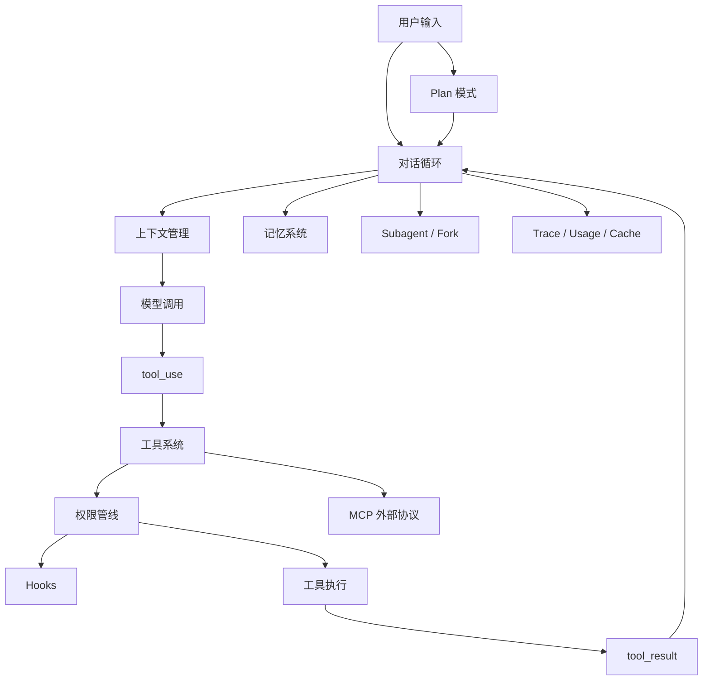
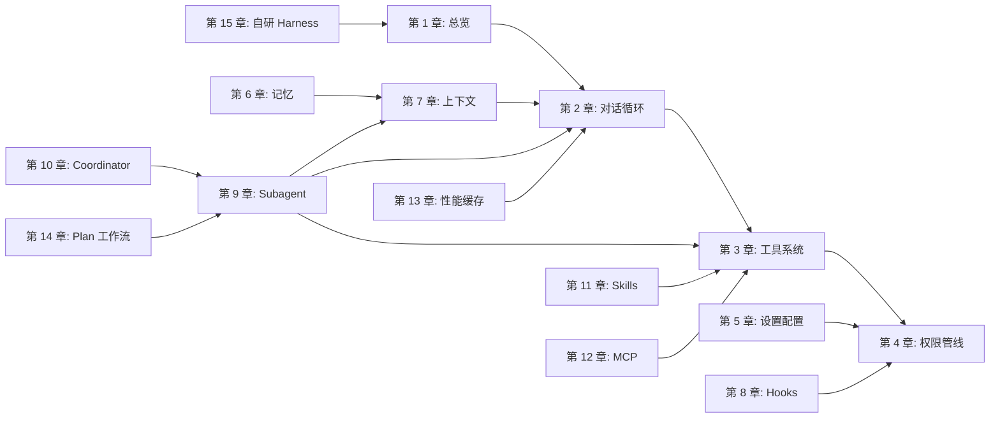

# 架构学习地图

这个附录用于快速建立全书视角。读正文时如果觉得机制很多、章节之间关系不清，可以先回到这里看三张总图。

## 1. 全书总架构图



这张图的读法：

- 对话循环是运行时主线。
- 工具系统让模型动作落地。
- 权限管线和 Hooks 保护工具执行边界。
- 上下文管理决定模型每轮能看见什么。
- 记忆系统保存跨会话稳定信息。
- Subagent 和 MCP 都不是旁路，最终仍要回到工具、权限、上下文和观测体系中。

## 2. 跨章节依赖图



学习时不要把每章看成孤立模块。更合适的顺序是：

1. 先理解第 1-4 章：Agent 为什么能行动，以及行动边界在哪里。
2. 再理解第 5-8 章：运行时状态、记忆、上下文和扩展点如何组织。
3. 再理解第 9-12 章：并行、协作、技能和外部协议如何进入主循环。
4. 最后理解第 13-15 章：性能、工作流和自研落地。

## 3. 学习路线图

```text
第一阶段：建立主干
  1 -> 2 -> 3 -> 4

第二阶段：理解运行时状态
  5 -> 6 -> 7 -> 8

第三阶段：理解高级协作
  9 -> 10 -> 11 -> 12

第四阶段：工程落地
  13 -> 14 -> 15
```

每个阶段的检查问题：

| 阶段 | 学完后应该能回答 |
|------|------------------|
| 1-4 | Agent 如何从用户输入走到工具执行？权限在哪里拦截？ |
| 5-8 | 配置、记忆、上下文、Hooks 分别管什么？ |
| 9-12 | Subagent、Coordinator、Skill、MCP 的边界是什么？ |
| 13-15 | 如何把这些机制做成可运行、可观测、可扩展的 Harness？ |

## 4. 真实任务穿透图

以“修复一个测试失败”为例，任务会穿过多个章节机制：

```mermaid
sequenceDiagram
  participant U as User
  participant Plan as Plan Mode
  participant Loop as Conversation Loop
  participant Tool as Tool System
  participant Perm as Permission
  participant Ctx as Context
  participant Sub as Verification Agent

  U->>Plan: 修复测试失败
  Plan->>Loop: 明确范围和验证方式
  Loop->>Ctx: 构造当前上下文
  Loop->>Tool: Read / Grep / Bash
  Tool->>Perm: 请求权限判断
  Perm-->>Tool: allow / ask / deny
  Tool-->>Loop: tool_result
  Loop->>Ctx: 压缩或保留关键结果
  Loop->>Sub: 独立验证
  Sub-->>Loop: 验证结论
  Loop-->>U: 结果、风险、验证证据
```

这张图适合在学习中反复使用：每读完一章，就问自己这章在真实任务里的位置在哪里。

## 5. 常见混淆关系图

```text
messages  : 当前会话历史，是模型请求的基础材料
context   : 本轮模型实际可见的信息集合
memory    : 跨会话保存的稳定信息
trace     : 给人和系统复盘的执行记录
tool_result: 工具观察结果，会回填到 messages
```

如果只记一句话：`messages` 是历史，`context` 是本轮可见内容，`memory` 是长期知识，`trace` 是复盘证据。

