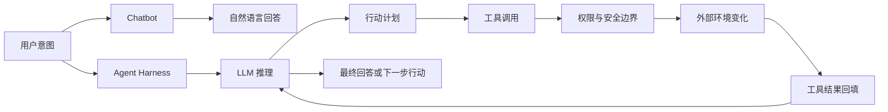
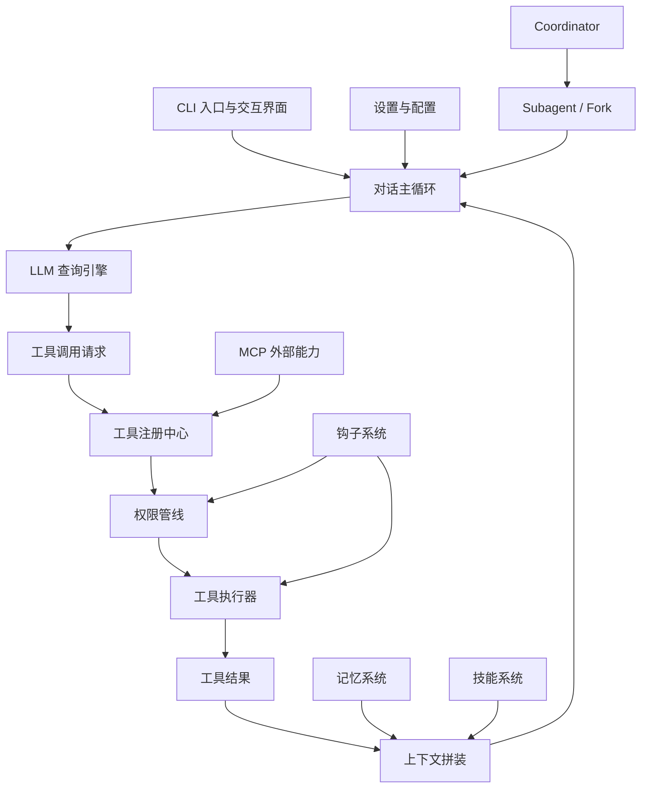
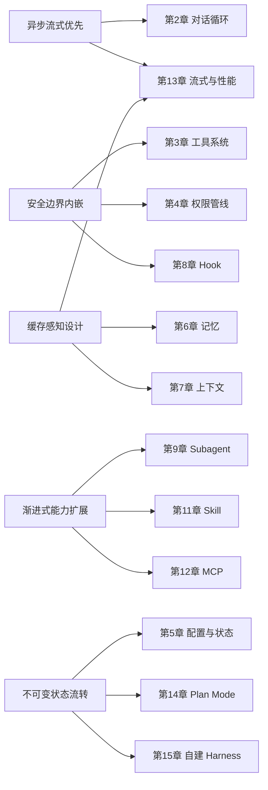

# 第 1 章：智能体编程的新范式

原课程对应：`第一部分-基础篇/01-智能体编程的新范式.md`

> 本章是全书的入口。学习重点不是“Claude Code 有哪些功能”，而是理解为什么 LLM 工具调用之后，软件工程需要一套 Agent Harness 来承接模型的行动能力。

## 学习目标

读完本章后，你应该能够：

- 理解 AI Agent 从简单对话走向自主执行工具调用的演进脉络。
- 建立 Agent Harness 的核心心智模型，知道它在 Agent 系统中的位置。
- 掌握 Claude Code 的宏观架构、技术选型和设计哲学。
- 区分“简单 API 封装”和“Agent Harness”的本质差异。
- 理解五个设计原则如何贯穿 Agent 系统的各个子系统。

## 1.1 从 Chatbot 到 Agent：软件工程的范式转移

### LLM 作为推理引擎 vs. LLM 作为对话伙伴

最早接触 LLM 时，我们通常把它当成“对话伙伴”：人输入 Prompt，模型输出一段文本。这个模式是同步的、单轮的、文本中心的。模型负责理解问题并生成回答，人负责复制结果、执行命令、检查错误、继续追问。

这种模式的限制很明显：

- 模型不能自己读取项目文件。
- 模型不能执行测试命令。
- 模型不能修改代码并观察结果。
- 模型不能在出错后自主调整策略。

因此，早期 Chatbot 的工程能力主要停留在“给建议”。真正的开发动作仍由人完成。

Agent 范式的变化在于：LLM 不再只是回答问题，而是开始决定“下一步应该调用什么工具、传递什么参数、如何处理工具结果”。这时模型从文本生成器变成任务编排者，而 Harness 负责把模型的决策落到真实世界。

### 工具调用的突破意义

工具调用重新定义了 LLM 和外部世界的边界。

没有工具时，LLM 是封闭系统。它只能基于上下文窗口生成文本。它知道如何诊断问题，但不能打开文件；它知道如何运行测试，但不能执行命令；它知道如何修改代码，但不能把修改写入磁盘。

有了工具调用后，LLM 可以通过 Harness 请求外部动作：

```text
模型产生工具调用意图
  -> Harness 校验工具名和参数
  -> Harness 执行真实工具
  -> 工具结果回填给模型
  -> 模型基于观察结果继续推理
```

这一步让 LLM 从“给出建议”变成“驱动动作”。但它同时引入新的工程问题：

1. 工具注册与发现：谁管理工具？模型如何知道哪些工具可用？
2. 参数校验：模型传错参数怎么办？
3. 权限管控：危险命令是否允许执行？
4. 错误恢复：工具失败后如何继续？
5. 状态一致性：多轮工具调用如何共享当前状态？
6. 并发与调度：哪些工具调用可以并行，哪些必须串行？

这些问题共同催生了 Agent Harness。

### 为什么需要 Agent Harness，而不是简单封装

一个常见误解是：Agent Harness 只是对 LLM API 包一层 wrapper，再加几个工具函数。

这个理解太浅。简单封装通常只处理：

```text
调用 LLM API -> 解析输出 -> 执行工具 -> 再调用 LLM API
```

这确实能跑出一个最小 demo，但在真实工程环境中会快速失效。因为真实 Agent 需要处理的不只是“调用”，还包括：

- 流式输出：用户需要实时看到 Agent 的思考、工具调用和进度。
- 权限管控：不同命令、路径、工具、项目需要不同安全策略。
- 上下文管理：长任务会撑爆上下文窗口，必须压缩、裁剪和召回。
- 错误恢复：API 超时、工具失败、输出格式不对都要可恢复。
- 状态持久化：用户中断会话后，任务状态如何恢复？
- 可扩展性：如何安全接入 MCP、Skills、Hooks 和 Subagent？

所以更准确的理解是：

```text
Agent Harness 是围绕 LLM 构建的运行时框架，
它让 LLM 能安全、可靠、可扩展地与外部世界交互。
```

如果说简单封装像给模型接一个遥控器，那么 Agent Harness 更像为模型设计一辆完整的车：有方向盘、刹车、安全气囊、仪表盘、导航、燃油系统和维修诊断。

## 1.2 Claude Code 全景架构导览

### AI 编程工具演进时间线

理解 Claude Code 前，先看 AI 编程工具的演进方向：

```text
代码补全
  -> 聊天式问答
  -> 函数/工具调用
  -> 代码执行环境
  -> 编辑器内 Agent
  -> 终端原生 Agent
  -> 标准化外部协议与多能力接入
```

这条线说明一个趋势：AI 编程工具的目标从“给更多建议”逐渐变成“完成更多行动”。

早期工具主要预测下一段代码；之后的聊天助手可以解释代码和生成片段；再往后，工具调用让模型能读文件、执行命令、查询外部资源；终端原生 Agent 则进一步把模型放进真实开发环境，让它围绕项目持续行动。

Claude Code 的意义在于，它不是一个简单聊天窗口，而是一个围绕真实开发工作流设计的 Agent Harness。

### 项目规模说明了什么

原课程提到 Claude Code 的代码库规模很大，包含大量 TypeScript 文件和模块。这一点不是为了强调“代码多”，而是为了说明：一个真实可用的 Agent Harness 本身就是复杂工程系统。

为什么复杂？

- 每个工具需要独立模块和清晰边界。
- 权限、上下文、工具、消息循环之间有严格调用关系。
- 外部协议、插件、Hooks、Subagent 都要和主循环协同。
- 任务中断、恢复、错误、流式反馈都需要稳定处理。

这也解释了为什么学习 Harness 不能只盯着一个 `while` 循环。循环是心脏，但真实系统还需要血管、神经、免疫和诊断系统。

### 技术栈

Claude Code 的技术栈选择体现了一种实用工程取向：终端 Agent 不是脚本拼接，而是一个需要 UI、类型、流式响应、参数校验和扩展能力的完整应用。

| 技术组件 | 作用 | 对 Harness 的意义 |
|----------|------|------------------|
| Bun | 运行时 | 提供快速启动、原生 TypeScript 支持和现代 Web API |
| React + Ink | 终端 UI | 用组件化方式构建终端交互界面 |
| Commander.js | CLI 参数解析 | 管理命令、参数、模型选择和权限模式 |
| Zod | Schema 验证 | 校验工具调用参数，并生成模型可理解的 JSON Schema |
| Anthropic SDK | LLM 调用 | 支持官方 API、流式响应和类型安全 |

这里最值得注意的是两个选择。

第一，React + Ink 说明终端 UI 也可以采用声明式组件模型。工具执行进度、权限确认、多列结果展示、流式输出，都不适合用散乱的 `console.log` 拼接。组件化 UI 让终端 Agent 能像 Web 应用一样管理状态和渲染。

第二，Zod 在 Agent Harness 中不只是普通类型工具。模型生成的工具参数是不稳定输入，可能缺字段、传错类型、越界或结构不符合预期。Zod 提供运行时校验，同时还能生成 JSON Schema 让模型知道参数约束。这相当于把“工具协议”同时服务于模型提示和执行安全。

因此，技术栈不是细枝末节。它对应的是 Harness 的几个基础能力：

- 快速启动
- 结构化终端交互
- 参数和类型安全
- 流式模型调用
- 工具协议生成

### 核心源码文件及其职责

从宏观上看，Claude Code 可以拆成五类核心模块：

| 模块 | 作用 | 学习重点 |
|------|------|----------|
| 入口模块 | 初始化 CLI、环境和用户输入 | Agent 从哪里开始运行 |
| 查询引擎 | 管理消息、状态和模型调用 | 对话循环如何持续推进 |
| 对话主循环 | 连接模型响应、工具调用和结果回填 | Agent 的心跳 |
| 工具系统 | 提供文件、命令、搜索等外部能力 | Agent 如何行动 |
| 权限与扩展系统 | 管控风险并接入外部能力 | Agent 如何安全扩展 |

这些模块不是并列堆放，而是分层协作。入口模块启动系统，查询引擎驱动循环，循环使用工具系统，工具系统受权限约束，扩展系统再把新能力接进来。

原课程进一步把核心源码职责拆成五个关键模块。易学版可以这样理解：

#### 入口点模块

入口点负责把一个命令行程序启动成可交互 Agent。

它通常承担三件事：

1. 启动优化：尽早记录性能节点，并把可以并行的 I/O 预取提前启动。
2. CLI 解析：解析模型选择、工具白名单、权限模式、工作目录等参数。
3. UI 初始化：创建 React/Ink 渲染上下文，启动交互式 REPL。

这个模块的学习重点是：Agent Harness 的启动路径会直接影响用户体验。一个终端 Agent 如果启动慢、初始化过程不可见、配置加载不稳定，会让用户觉得它笨重且不可控。

#### LLM 查询引擎核心

查询引擎可以理解为对话生命周期管理者。

它管理的不是一次 API 请求，而是一整个会话运行过程，包括：

- 消息历史
- 文件缓存
- token 和用量统计
- 权限拒绝记录
- 当前会话状态
- 交互式 REPL 和无头 SDK 的共用逻辑

这里的关键设计是“一个核心，多种入口”。终端交互和 SDK 调用不应该各自实现一套 Agent 逻辑，否则功能和 bug 修复会分裂。把查询生命周期集中到一个核心引擎里，能保证不同入口共享同一套状态管理和行为规则。

#### 异步生成器对话主循环

对话主循环是 Agent Harness 的心脏。原课程强调它采用 `AsyncGenerator`，不是普通函数，也不是简单回调。

它每轮大致做这些事：

```text
构建 API 请求
  -> 调用 LLM 并流式接收响应
  -> 解析工具调用
  -> 经过权限管线
  -> 执行工具
  -> 注入工具结果
  -> 判断继续或终止
```

`AsyncGenerator` 的价值在于，上层可以用 `for await...of` 消费中间事件：模型流式文本、工具调用开始、工具执行进度、工具结果、错误或最终回答。这样既保留了线性代码结构，又能支持流式 UI、中断和进度反馈。

状态管理上，原课程特别强调跨迭代状态应以整体替换方式流转，而不是到处原地修改字段。这为后续 Subagent、Fork 和调试复现打下基础。

#### 工具类型系统基石

工具类型系统定义所有工具必须遵守的契约。

这不是为了“代码写得优雅”，而是为了让工具系统的安全和调度规则能被统一表达。一个成熟工具定义通常需要包含：

- 工具名称和描述
- 参数 schema
- 执行方法
- 权限检查回调
- 进度回调
- 是否并发安全
- 中断行为
- 是否具有破坏性

这些字段背后对应的是实际工程问题：工具能不能并行？用户中断时应该取消还是等待？工具是否会修改外部状态？是否需要更高权限？

#### 工具注册中心

工具注册中心是工具系统的单一事实来源。

它的职责不是简单返回一个工具数组，而是管理：

- 哪些工具默认可用。
- 哪些工具受 Feature Flag 控制。
- 哪些工具需要延迟加载。
- 哪些工具在当前权限上下文下不可见。
- 哪些工具来自扩展或外部协议。

其中“工具过滤”很关键：禁止使用的工具最好不要发送给模型。这样模型不会尝试调用不该看到的工具，减少拒绝、重试和上下文浪费。

这个设计对应一个通用原则：能力不是只在执行时控制，也应在暴露给模型之前就控制。

## 1.3 五个贯穿全书的设计原则

本章最重要的部分，是建立后续章节反复出现的设计原则。它们不是孤立技巧，而是 Agent Harness 的架构骨架。

### 原则一：异步流式优先

Agent 任务经常不是一次请求就结束。它可能要读文件、调用工具、等待 API、运行测试、处理错误，再继续下一步。

如果采用传统“请求-完整响应”的模式，用户只能等最终结果，很难观察中间状态，也很难中断任务。

异步流式优先的价值在于：

- 增量输出：用户可以实时看到进展。
- 可中断：长任务可以被取消或打断。
- 背压控制：消费者处理不过来时，系统可以暂停或缓冲。
- 更适合工具调用：工具执行和模型响应可以形成事件流。

在 Harness 视角里，Agent 不只是返回一个结果，而是在产生一串事件：

```text
开始任务 -> 模型思考 -> 请求工具 -> 工具执行 -> 返回观察 -> 继续推理 -> 完成
```

这就是为什么后续会讨论流式架构和性能优化。

### 原则二：安全边界内嵌

Agent 一旦能操作真实文件和命令，安全就不能作为事后补丁。

权限系统必须嵌入工具执行路径：

```text
模型提出工具调用
  -> 工具可见性过滤
  -> 参数校验
  -> 权限策略判断
  -> 必要时用户审批
  -> 沙箱或受限环境执行
  -> 审计记录
```

这里的关键不是“有一个确认弹窗”，而是多层防御。即使某一层判断失效，其他层仍应限制风险。

这也是为什么第 4 章会单独分析权限管线，而不是把权限放在工具系统里顺带讲完。

### 原则三：缓存感知设计

LLM API 调用成本高，延迟也不可忽视。Agent 系统还会频繁发送系统提示、工具定义、项目上下文和历史消息。

如果每次调用都重新构造完整上下文，系统会付出很高成本。

缓存感知设计要解决：

- 哪些 Prompt 片段是稳定的。
- 哪些工具定义可以复用。
- 哪些上下文不应该频繁变化。
- 子 Agent 是否可以共享某些已渲染的系统提示。

注意：缓存不是单纯的性能优化。它会反过来影响架构设计。为了让缓存命中率稳定，系统需要更稳定的 Prompt 结构、更清晰的工具列表和更可控的上下文拼装顺序。

### 原则四：渐进式能力扩展

Claude Code 的能力不是一次性塞进一个巨大核心里，而是分层扩展：

| 扩展级别 | 机制 | 适用场景 |
|----------|------|----------|
| 工具 | 增加原子动作能力 | 文件、命令、搜索 |
| Skills | 加载任务知识和流程 | 代码审查、文档生成、特定工作流 |
| Plugins | 组织工具和配置 | 可安装能力包 |
| MCP | 连接外部服务 | 第三方工具、资源、系统 |

这种渐进式扩展避免了两个极端：

- 所有能力都写进核心，导致核心臃肿。
- 所有能力都外包插件，导致基础能力不稳定。

好的 Harness 会把稳定核心和可扩展能力分开。

### 原则五：不可变状态流转

Agent 运行中会产生大量状态：消息、工具结果、任务计划、文件观察、权限决策、错误记录。

如果这些状态被随意原地修改，调试会非常困难。尤其在 Subagent、并发工具调用和任务恢复场景下，可变共享状态会带来不一致。

不可变状态流转的核心思想是：每次状态更新都基于旧状态生成新状态，而不是隐式修改同一个对象。

它带来的好处：

- 更容易追踪状态变化。
- 更容易复现错误。
- 更适合并发和 Fork。
- 更容易记录 Trace。

这为后续理解 Subagent、Fork、Plan Mode 和任务恢复打基础。

## 1.4 本章与后续章节的关系

本章建立的是全书地图。后续章节可以看成对这几个问题的逐步展开：

| 问题 | 对应章节 |
|------|----------|
| Agent 如何持续运行？ | 第 2 章：对话循环 |
| Agent 如何行动？ | 第 3 章：工具系统 |
| Agent 如何安全行动？ | 第 4 章：权限管线 |
| Agent 的行为如何配置？ | 第 5 章：设置与配置 |
| Agent 如何跨会话保留信息？ | 第 6 章：记忆系统 |
| Agent 如何管理当前可见信息？ | 第 7 章：上下文管理 |
| Agent 生命周期如何扩展？ | 第 8 章：Hooks |
| Agent 如何并行和隔离子任务？ | 第 9-10 章：Subagent 与 Coordinator |
| Agent 如何加载专业能力？ | 第 11 章：Skills |
| Agent 如何接入外部协议？ | 第 12 章：MCP |
| Agent 如何改善响应体验？ | 第 13 章：流式与性能 |
| Agent 如何先规划再执行？ | 第 14 章：Plan 模式 |
| 如何组合成自己的 Harness？ | 第 15 章：自建 Agent Harness |

## 1.5 实战练习：安装与第一次诊断

本章的练习不是为了教 Claude Code 使用技巧，而是为了让你观察一个真实 Agent Harness 启动时会检查什么。

### 步骤一：安装 Claude Code

按照原课程要求准备 Node.js 18+ 或 Bun，然后安装 Claude Code。

学习时要观察：安装的不是一个模型，而是一个能连接模型、工具、权限和项目环境的 CLI Harness。

### 步骤二：运行 `/doctor`

在一个项目目录中启动 Claude Code，并运行：

```text
/doctor
```

这个命令通常会检查环境、权限、MCP、API 连接和文件系统访问等内容。

你要关注的不是检查结果本身，而是这些检查暴露了 Harness 的哪些依赖：

- 运行时环境
- 权限配置
- 外部服务连接
- 工作目录访问
- 缓存或配置状态

### 步骤三：观察系统自检流程

运行 `/doctor` 时，不要只看通过或失败。要观察检查结果是怎样出现的：

- 是否每完成一项就即时显示，而不是全部结束后一次性输出。
- 哪些检查是纯本地检查，哪些需要访问外部服务。
- 哪些检查可能触发确认或权限判断。
- 检查结果是否显示缓存、配置或连接状态。

这个练习对应前面的设计原则：

- 渐进式输出体现异步流式优先。
- 需要确认的诊断动作体现安全边界内嵌。
- 缓存和配置状态体现缓存感知设计。

### 步骤四：观察一次完整的工具调用

让 Claude Code 执行一个简单任务，例如列出当前目录下的源代码文件。

观察三个阶段：

1. 思考阶段：它如何理解任务。
2. 工具调用阶段：它选择了什么工具，传了什么参数。
3. 回答阶段：它如何基于工具结果生成最终回复。

这个过程就是第 2 章要展开的对话主循环。

### 步骤五：思考题

完成一次观察后，回答这些问题：

1. 你看到的工具调用中，哪些看起来可以并发执行？哪些必须串行？为什么？
2. 如果你在工具执行中按下 Ctrl+C，系统应该立即取消、等待安全点，还是继续完成当前工具？这体现了哪个设计原则？
3. 如果连续发送很多消息，上下文窗口会怎样？系统应该压缩、裁剪、检索，还是提示用户？
4. `/doctor` 检查了哪些 Harness 依赖？这些依赖分别属于配置、权限、外部服务还是运行环境？
5. 如果你要实现一个最小 Harness，本章哪些能力可以先不做，哪些必须一开始就设计好？

## 1.6 学习时的关键问题

读完原课程第 1 章后，建议你能回答这些问题：

1. LLM 从对话伙伴变成 Agent，关键变化是什么？
2. 工具调用为什么会把问题从模型层推到系统工程层？
3. 简单 API 封装为什么不足以支撑真实 Agent？
4. Agent Harness 至少需要解决哪 6 类工程问题？
5. Claude Code 的五类核心模块分别承担什么职责？
6. 异步流式优先、安全边界内嵌、缓存感知、渐进式扩展、不可变状态流转分别解决什么问题？
7. 如果你要自研 Harness，第一章给你的最重要架构提醒是什么？

## 1.7 常见误解

### 误解一：Agent Harness 就是工具调用循环

工具调用循环只是 Harness 的最小骨架。真实 Harness 还必须处理权限、状态、上下文、错误、扩展、流式输出和观测。

### 误解二：Claude Code 的价值主要在模型

模型当然重要，但本课程分析的是模型外层的工程系统。没有 Harness，模型能力很难稳定落到真实开发任务。

### 误解三：把所有能力堆进核心就能更强

能力越多，边界越重要。成熟 Harness 会通过工具、Skills、插件、MCP 分层扩展，而不是把所有逻辑写进一个核心循环。

### 误解四：安全可以后补

Agent 一旦有执行能力，安全必须在工具可见性、参数校验、权限判断、沙箱和审计中多层内嵌。

## 1.8 和通用 Harness 的关系

从通用 Harness 设计角度，本章给出的是第一性原则：

```text
不要先问“我要接哪个模型”，
先问“我要怎样管理模型的行动边界”。
```

一个最小可用 Harness 至少需要：

- 对话循环
- 工具注册与调度
- 权限检查
- 上下文拼装
- 错误处理
- Trace 记录

后续所有高级机制，都是在这个基础上继续增强。

## 1.9 关键流程图补强

### 图一：Chatbot 与 Agent Harness 的边界差异

这张图用来建立第一章最重要的直觉：Chatbot 的核心产物是文本回复，Agent Harness 的核心产物是“受控行动”。



学习时可以这样判断两者差异：如果系统只需要“说清楚”，它更接近 Chatbot；如果系统需要“安全地做事情，并能解释为什么这样做”，它就进入了 Harness 领域。

### 图二：Claude Code 总架构的学习版视图

原课程会从多个源码模块展开，这里先给一个学习版总图，方便你把后续章节放回同一个架构中。



这张图不是精确源码依赖图，而是学习路线图。第 2-4 章讲主循环、工具和权限；第 5-8 章讲配置、记忆、上下文和 Hook；第 9-12 章讲高级扩展；第 13-15 章讲性能、流程和自建 Harness。

### 图三：五大原则贯穿全书索引图

第一章的五个原则不是口号，而是后续机制的解释框架。



读后续章节时，可以不断追问：这个机制主要服务哪条原则？如果找不到答案，说明你还没有抓到它的设计动机。

### 图四：最小 Harness 能力分层图

如果你想自研 Harness，不要一开始就追求完整 Claude Code。可以把能力分成三层理解。

```text
第 3 层：高级协作与生态
  Skills / MCP / Subagent / Coordinator / Hooks 编排 / 企业策略

第 2 层：可靠工程能力
  权限管线 / 上下文管理 / 记忆系统 / 流式输出 / 错误恢复 / 状态管理

第 1 层：最小可用闭环
  用户输入 -> LLM -> 工具调用 -> 工具执行 -> 结果回填 -> 下一轮
```

第一层让系统能跑起来；第二层让系统可控、可恢复、可长期使用；第三层让系统可扩展、可协作、可组织化落地。

## 关键要点总结

本章建立的是理解全书的概念框架。

第一，AI 编程工具的范式转移已经发生。LLM 不再只是对话伙伴，而是在工具调用标准化之后变成可以驱动外部动作的任务编排者。这个变化把问题从模型层推到了工程系统层。

第二，Agent Harness 是使这种范式成立的工程基础设施。它不只是调用 LLM API 和执行工具，而是要处理流式输出、权限管控、上下文管理、错误恢复、状态持久化和可扩展性。

第三，Claude Code 的宏观架构可以通过几个核心模块理解：入口模块、查询引擎、异步生成器对话主循环、工具类型系统和工具注册中心。它们之间不是松散组合，而是严格的层次协作。

第四，五大设计原则贯穿后续章节：异步流式优先、安全边界内嵌、缓存感知设计、渐进式能力扩展、不可变状态流转。每当后续章节讨论一个具体机制，都可以回到这些原则中找设计原因。

第五，学习 Claude Code 的最终目的不是复刻一个完全相同的工具，而是理解一个真实 Agent Harness 如何把模型能力转化为可控、可靠、可扩展的工程系统。

下一章会进入对话主循环，也就是 Agent Harness 的心脏：模型如何在“调用 LLM、解析工具调用、执行工具、注入结果”的循环中持续推进任务。
