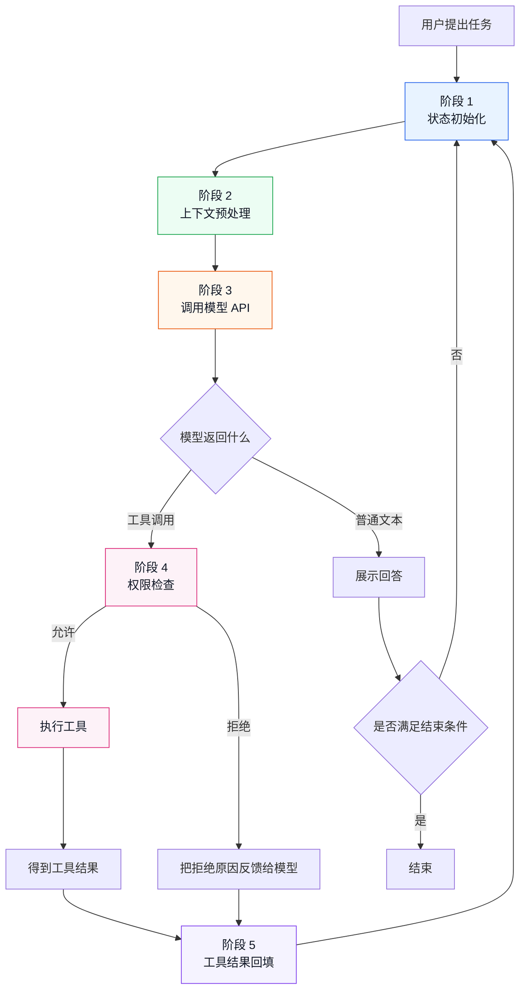
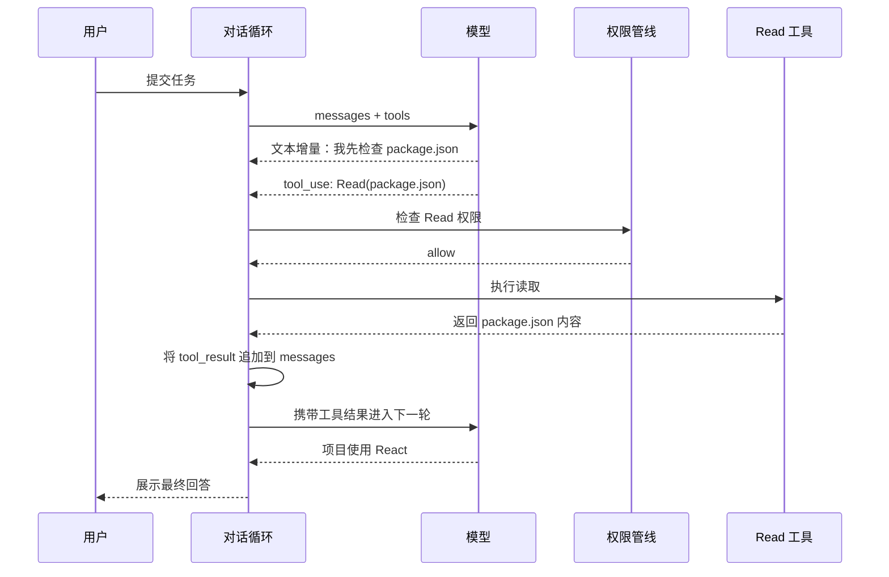
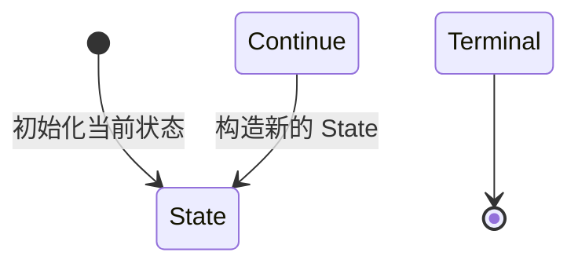
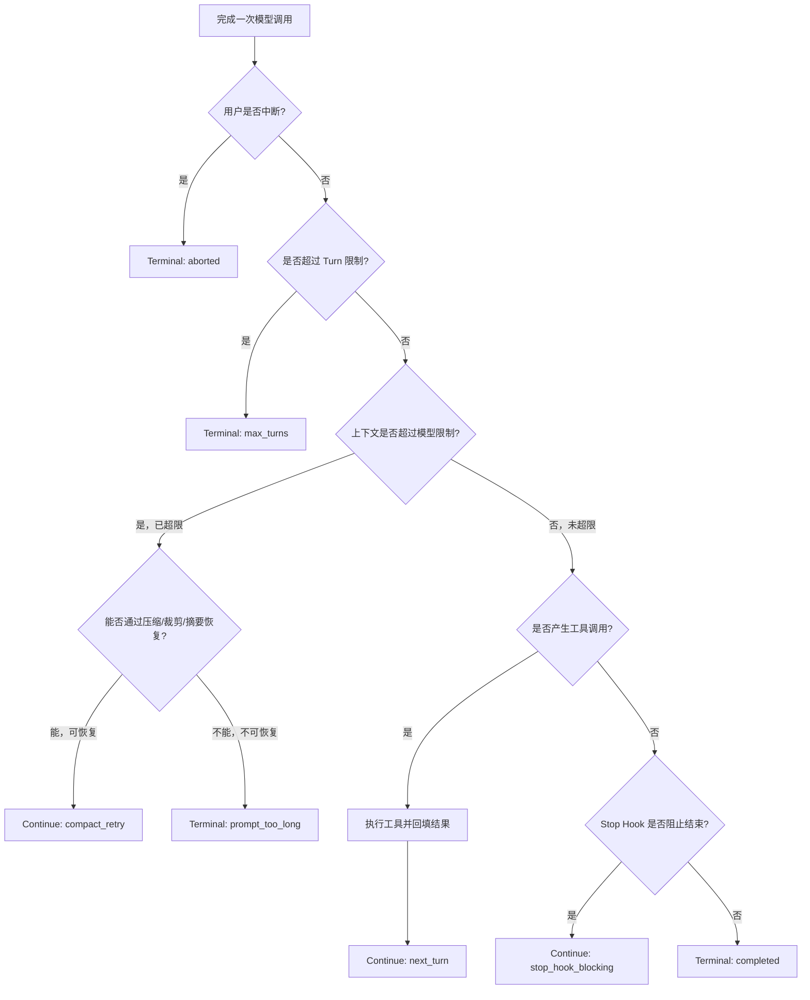
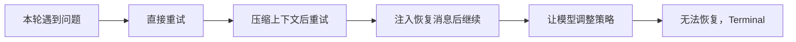
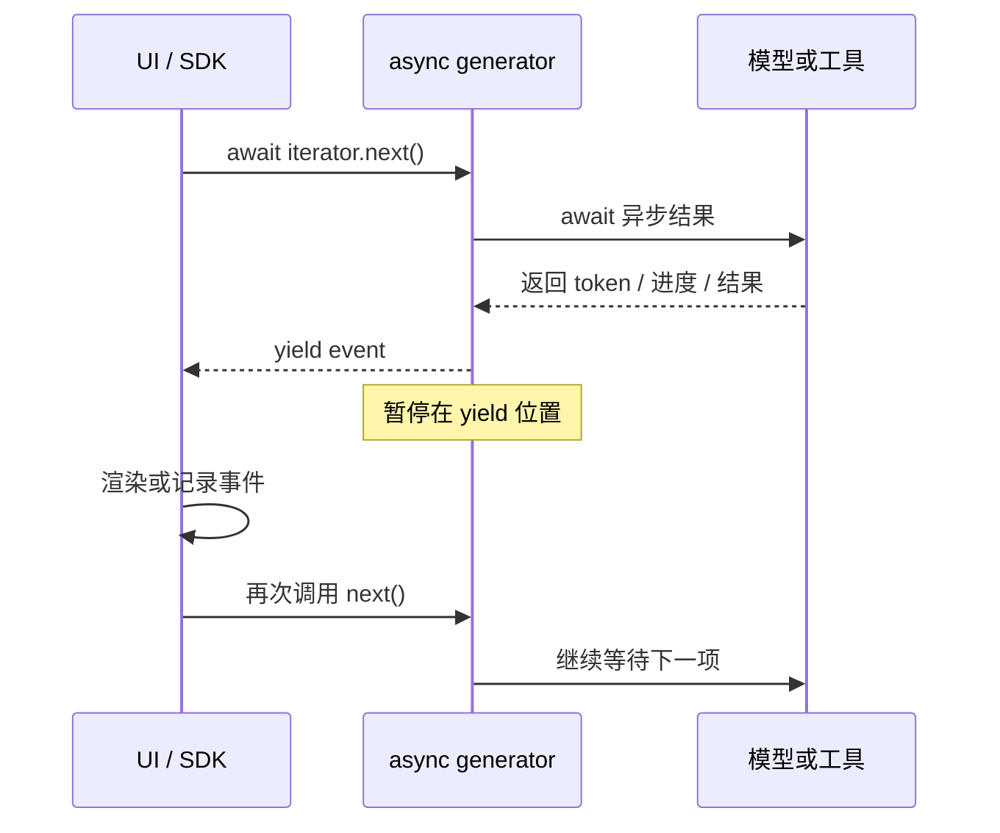
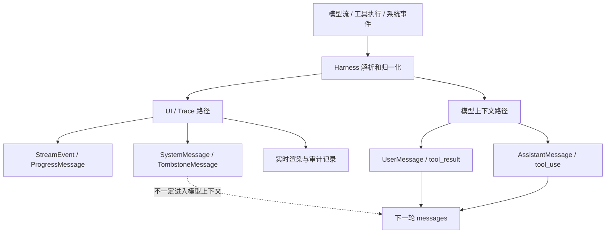
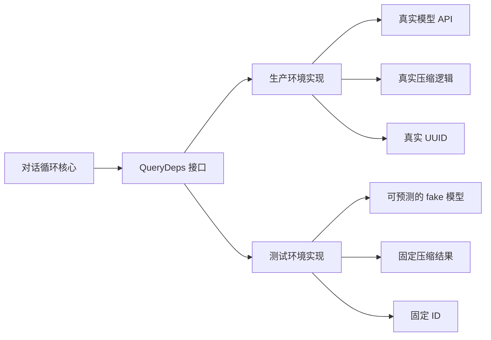
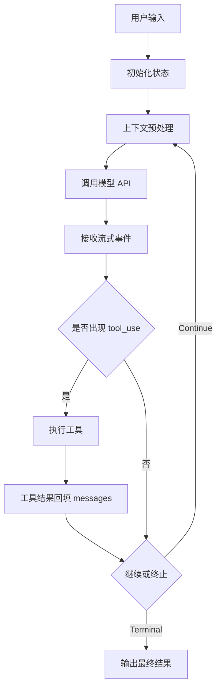
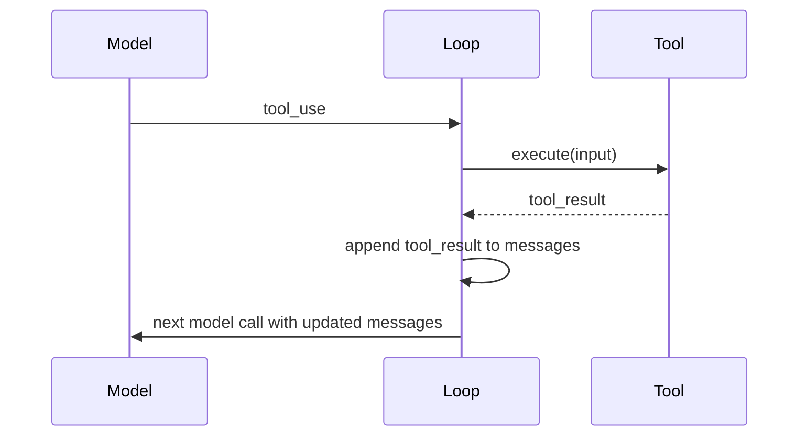

# 第 2 章：对话循环 - Agent 的心跳

原课程对应：`第一部分-基础篇/02-对话循环-Agent的心跳.md`

> 如果第 1 章回答“为什么需要 Agent Harness”，本章回答“Agent Harness 如何一轮一轮活起来”。对话循环是 Agent 的心跳：模型调用、工具执行、结果回填、继续判断，都在这个循环里发生。

## 学习目标

读完本章后，你应该能够：

- 理解为什么 Claude Code 使用 `AsyncGenerator` 组织对话主循环。
- 区分流式事件、结构化消息、工具摘要和墓碑消息。
- 说清一个完整 Turn 从状态初始化到工具结果回填的生命周期。
- 理解依赖注入为什么能让对话循环可测试。
- 掌握 `State + Continue + Terminal` 的状态转换模型。
- 判断 Agent 循环何时继续，何时终止，以及为什么要细分终止原因。

## 2.1 先看全景：Agent 如何完成一项任务

在学习 `AsyncGenerator`、消息类型和状态转换之前，先只记住下面这个闭环：



这就是对话循环。图里的阶段 1-5 会在 2.2 节展开：先初始化状态，再整理上下文，然后调用模型；如果模型请求工具，就进入工具执行，最后把工具结果写回消息历史，进入下一轮。

后面出现的流式事件、状态对象、Continue、Terminal、压缩恢复和 Hook，都只是在回答三个问题：

1. 本轮发生了什么？
2. 下一轮带着什么信息继续？
3. 当前任务为什么继续或结束？

### 用一个真实任务走一遍

假设用户说：

> 读取 `package.json`，告诉我这个项目使用什么前端框架。

一次完整执行过程如下：



这个例子中发生了两次模型调用：

- 第一次模型调用负责决定“需要读取文件”。
- 工具执行后，第二次模型调用负责理解读取结果并回答用户。

所以 Agent 的“一个任务”不等于“一次模型 API 调用”。它可能由多个 Turn 组成，而工具结果回填是连接前后 Turn 的关键。

### 本章内容不需要全部记忆

本章按三个学习等级阅读：

| 学习等级 | 内容 | 要求 |
|----------|------|------|
| 必须理解 | 对话闭环、工具结果回填、Continue / Terminal | 能用自己的话讲清楚 |
| 看到能识别 | `yield`、`AsyncGenerator`、`tool_use`、`StreamEvent` | 读源码时知道它们在做什么 |
| 查阅即可 | 泛型参数顺序、完整事件名、全部终止原因 | 使用时回来查表，不需要背 |

先理解流程，再把 API 名称对应到流程节点。不要反过来从 API 名称猜系统如何运行。

## 2.2 一个完整 Turn 的生命周期

一个 Turn 可以理解为“对话主循环的一次迭代”。它不是框架，也不是某个库，而是源码阅读和系统分析时使用的一个概念。

更具体地说：

```text
Agent Harness
  -> 对话主循环
      -> Turn 1
      -> Turn 2
      -> Turn 3
      -> ...
```

所以，Turn 的位置大概相当于下面代码中的一次 `while` 循环：

```typescript
while (true) {
  // 这里就是一个 Turn

  const context = prepareContext(state)
  const response = await callModel(context)

  if (response.hasToolUse) {
    const toolResults = await runTools(response.toolUses)
    state = appendToolResults(state, toolResults)
    continue
  }

  return finish(response)
}
```

因此，一个 Turn 通常包含“一次模型调用加上可能发生的工具执行”。如果模型调用工具，工具结果会进入下一轮；如果模型不调用工具，循环可能结束。

这里要避免两个误解：

| 误解 | 更准确的理解 |
|------|--------------|
| Turn 是一个框架 | Turn 只是主循环中的一次处理周期 |
| 一个用户任务只有一个 Turn | 一个任务可能包含多个 Turn，尤其是需要工具调用时 |

你可以把 Turn 简单记成：

```text
Turn = Agent 主循环跑了一圈
```

在五个阶段里，阶段 1 和阶段 2 最容易混淆，因为它们都发生在模型调用之前。区别是：

| 阶段 | 关注点 | 回答的问题 | 例子 |
|------|--------|------------|------|
| 阶段 1：状态初始化 | Agent 内部当前状态 | 我现在手里有什么状态？ | 当前 messages、turn 计数、工具上下文、恢复计数、stop hook 状态 |
| 阶段 2：上下文预处理 | 即将发送给模型的输入 | 这次我要把什么发给模型？ | 选择 messages、截断工具结果、压缩历史、组装系统提示、检查 token 限制 |

可以把它类比成做饭：

```text
阶段 1：打开冰箱，看现在有哪些食材
阶段 2：挑选、清洗、切配，准备下锅
阶段 3：真正下锅烹饪，也就是调用模型
```

所以一句话：

```text
阶段 1 是读取和建立当前 State。
阶段 2 是把 State 转换成这次模型调用需要的 Prompt / Messages / Tools。
```

原课程把一个 Turn 拆成五个阶段。

### 阶段一：状态初始化

对话主循环通常是一个 `while(true)`。每次循环顶部，系统会读取当前状态快照，包括：

- 当前消息列表
- 工具使用上下文
- 自动压缩追踪状态
- 恢复计数器
- turn 计数
- 待处理的工具摘要
- stop hook 状态

重点不是这些字段本身，而是状态读写方式：每轮开始时读取当前状态，结束时构造新状态。这样可以避免执行过程中半更新状态导致的不一致。

可以把它理解为：

```text
读取旧 State
  -> 执行本轮逻辑
  -> 生成新 State
  -> continue 下一轮
```

### 阶段二：上下文预处理

模型调用前，Harness 必须把上下文整理到可发送状态。原课程这里非常关键，因为它说明 Agent 循环不是简单把全部历史塞给模型。

预处理通常包括：

1. 工具结果预算：过大的工具结果要截断、摘要或落盘。
2. Snip 压缩：对超长消息做直接裁剪。
3. Microcompact：做轻量压缩，同时尽量保持缓存友好。
4. Context Collapse：把连续或低价值内容折叠为更紧凑表示。
5. 系统提示组装：合并基础系统提示和动态上下文。
6. Autocompact：上下文超过阈值时做自动摘要压缩。
7. Token 阻断检查：超过硬限制时不再调用 API，直接失败。

这一段是理解“上下文管理”的前置知识。对话循环每一轮都要决定：哪些信息进入本次模型调用，哪些信息压缩，哪些信息不能再带。

这里的顺序也有意义：先做轻量处理，再做重量压缩，最后才硬性阻断。因为越重的压缩越可能损失信息。

### 阶段三：API 调用

预处理完成后，循环发起模型调用。发送给模型的通常包括：

- 消息列表
- 系统提示
- 可见工具定义
- 模型参数
- 当前上下文约束

API 调用是流式的。模型可能一边输出文本，一边生成工具调用块。循环需要同时做两件事：

- 把流式事件 yield 给 UI。
- 收集 assistant 消息和工具调用块，供后续执行。

这解释了为什么 Agent 的输出经常是“边说边做”。例如模型先说“我需要检查 package.json”，随后发出读取文件的工具调用。Harness 不能把文本和工具调用割裂处理，必须保留它们在同一个响应中的顺序和关系。

### 阶段四：工具调用检测与执行

流式响应结束后，循环判断模型是否请求工具调用。

如果没有工具调用，进入终止路径。如果有工具调用，则开始工具执行流程：

```text
收集 tool_use
  -> 权限管线检查
  -> 按并发安全性分组
  -> 执行工具
  -> yield 工具进度和结果
  -> 收集结果消息
```

这里有一个重要设计点：工具结果既要给 UI 看，也要进入下一轮模型调用。也就是说，工具执行结果有两个消费者：

- UI/Trace：用于展示和记录。
- 下一轮模型：用于继续推理。

如果这两条路径不同步，用户看到的内容和模型看到的内容就可能不一致。

### 阶段五：工具结果回填与下一轮

工具执行完成后，循环会把 assistant 消息、工具结果、附件消息等合并成新的消息列表，然后构造新状态，进入下一轮。

附件注入容易被忽略，但很重要。工具执行期间，外部环境可能发生变化：配置文件更新、内存文件变化、用户排队了新命令、工作区状态变化。如果这些变化不进入下一轮上下文，模型可能基于过期状态继续决策。

这一阶段可以概括为：

```text
旧 messages
  + assistant response
  + tool results
  + attachments
  -> 新 messages
  -> 下一轮模型调用
```

### 终止条件判断

生产级 Agent 不能只有“成功”和“失败”两个结束状态。原课程列出了多种终止原因，每一种都对应不同处理逻辑。

| 终止原因 | 触发条件 | 设计意图 |
|----------|----------|----------|
| `completed` | 模型正常回复且无工具调用 | 正常结束 |
| `aborted_streaming` | 用户中断流式响应 | 快速响应用户取消 |
| `aborted_tools` | 工具执行期间中断 | 清理工具执行状态 |
| `max_turns` | 超过最大循环次数 | 防止无限循环 |
| `blocking_limit` | token 超过硬限制 | 避免无效 API 调用 |
| `prompt_too_long` | 压缩仍无法容纳上下文 | 明确上下文失败 |
| `model_error` | API 调用异常 | 服务或网络错误降级 |
| `stop_hook_prevented` | Stop hook 阻止继续 | 外部规则控制终止 |
| `hook_stopped` | 工具 hook 阻止继续 | Hook 决定中断 |
| `image_error` | 图片输入格式或尺寸问题 | 输入数据错误 |

细分终止原因不是形式主义。调试 Agent 时，终止原因就是第一线索。笼统的 `error` 会让开发者不知道是上下文爆了、用户取消了、模型失败了，还是 Hook 拦截了。

## 2.3 状态转换模型

理解完整 Turn 后，下一步进入状态机视角。对话循环并不是随意 `continue` 或 `return`，而是通过明确的状态转换来推进。

### State 类型与 Continue/Terminal

可以把循环模型拆成三个概念：

| 概念 | 作用 |
|------|------|
| `State` | 当前循环持有的完整可变状态 |
| `Continue` | 决定继续下一轮，并说明继续原因 |
| `Terminal` | 决定结束循环，并说明终止原因 |

`State` 包含消息、工具上下文、压缩追踪、恢复计数、turn 计数等。每次继续时，系统构造新的 State，而不是在旧对象上隐式改来改去。

`Continue` 和 `Terminal` 的价值在于：每一次循环跳转都有类型化原因。这样后续调试时可以看到“为什么继续”或“为什么结束”。

可以先用下面这张图理解三者关系：



这里的重点不是把 `State` 当成一个具体类，而是把它看成“当前循环快照”。`Continue` 和 `Terminal` 是从这个快照出发做出的两类决定。

### 状态转换的决策逻辑

状态决策可以先看图，再看下面的原因表：



图里的三个判断词可以这样理解：

| 判断结果 | 含义 | 后续动作 |
|----------|------|----------|
| 未超限 | 当前上下文可以正常发给模型 | 继续判断工具调用或结束条件 |
| 可恢复 | 上下文太长，但可以压缩、裁剪或摘要后再试 | `Continue: compact_retry` |
| 不可恢复 | 上下文太长，而且压缩后也无法安全保留任务信息 | `Terminal: prompt_too_long` |

读图时只需要抓住一个判断：当前问题能不能通过“补充信息、压缩上下文、执行工具或反馈错误”继续解决？能继续就产生 `Continue`，不能继续才产生 `Terminal`。

常见 Continue 路径包括：

| Continue 原因 | 含义 |
|---------------|------|
| `next_turn` | 工具调用完成，带着工具结果进入下一轮 |
| `max_output_tokens_recovery` | 模型输出被截断，注入恢复消息后继续 |
| `max_output_tokens_escalate` | 首次截断时尝试提高输出 token 限制 |
| `reactive_compact_retry` | 上下文过长，尝试响应式压缩后重试 |
| `collapse_drain_retry` | 上下文折叠溢出后，用信息损失较小方式恢复 |
| `stop_hook_blocking` | Stop hook 返回阻塞错误，把错误反馈给模型修正 |
| `token_budget_continuation` | token 预算提示模型注意限制 |

这些路径说明一个关键思想：错误或限制不一定直接终止任务，有些可以作为反馈进入下一轮，让模型修正策略。

例如：

- 模型输出被截断，不一定失败，可以扩大 token 或要求续写。
- 上下文过长，不一定失败，可以先尝试压缩。
- Hook 阻止继续，不一定失败，可以把原因告诉模型，让模型换方案。

成熟 Agent Harness 的循环不是“成功路径 + 异常路径”，而是一组可恢复状态转换。

恢复路径可以进一步理解成一条由轻到重的阶梯：



不是所有错误都要立刻结束，也不是所有错误都值得无限重试。每一种 `Continue` 都应该有次数限制和明确的失败出口。

## 2.4 异步生成器：对话循环的骨骼

Claude Code 的对话主循环是一个异步生成器，也就是 `async function*`。

这不是语法偏好，而是架构选择。Agent 对话不是一次函数调用能完成的事情。模型响应可能逐 token 返回，工具执行可能持续几十秒，UI 需要实时展示进度，用户也可能随时中断。

普通函数只能“调用后返回一个结果”。Promise 也只能 resolve 一次。回调可以持续通知，但会把控制流打散。异步生成器正好适合 Agent 循环：

```text
对话循环作为生产者
  -> yield 流式文本
  -> yield 工具调用事件
  -> yield 工具执行进度
  -> yield 工具结果
  -> return 终止状态

UI 或 SDK 作为消费者
  -> for await...of 消费事件
  -> 实时渲染或记录
  -> 必要时取消生成器
```

可以把它理解为：对话循环不是一次性吐出答案，而是持续产生事件流。每一次 `yield` 都像心跳，把 Agent 当前正在发生的事情推给外层。

异步生成器属于“拉取式流”：消费者请求下一个事件，生成器才继续向前运行。



如果 UI 暂时不调用下一次 `next()`，生成器就停在 `yield` 处。这就是背压的直观含义：消费者处理不过来时，生产者不会无限向前堆积事件。

### `async function*` 语法拆解

> 阅读要求：理解 `async`、`yield` 和 `return` 各自负责什么即可。`AsyncGenerator<YieldValue, ReturnValue, NextValue>` 的泛型顺序属于源码查阅项，不需要背诵。

如果你对 JavaScript / TypeScript 的生成器不熟，这个语法一开始会很绕。可以把 `async function*` 拆成三部分理解：

| 语法片段 | 含义 | 在 Agent 循环里的作用 |
|----------|------|------------------------|
| `async` | 函数内部可以使用 `await` | 等待模型流、工具执行、文件 IO、网络请求 |
| `function*` | 这是生成器函数，可以多次 `yield` | 一边执行一边向外发出事件 |
| `async function*` | 异步生成器函数，返回 `AsyncGenerator` | 同时支持异步等待和流式产出 |

这里要特别区分：ES6 的普通 Generator 写法确实是 `function*`，不需要 `async`。`async function*` 是后来的异步生成器语法，用来解决“生成器内部也要等待异步操作”的问题。

两者的差异可以这样看：

| 写法 | 返回对象 | `next()` 返回什么 | 函数内部能否直接 `await` | 消费方式 | 适合场景 |
|------|----------|-------------------|---------------------------|----------|----------|
| `function* gen()` | `Generator` | `{ value, done }` | 不能 | `for...of` | 同步序列，例如遍历、状态机、惰性计算 |
| `async function* gen()` | `AsyncGenerator` | `Promise<{ value, done }>` | 可以 | `for await...of` | 异步事件流，例如模型流、工具进度、网络数据 |

普通 Generator 示例：

```typescript
function* count() {
  yield 1
  yield 2
  return 3
}

const iterator = count()
console.log(iterator.next()) // { value: 1, done: false }
```

异步 Generator 示例：

```typescript
async function* countSlowly() {
  yield 1
  await new Promise(resolve => setTimeout(resolve, 100))
  yield 2
  return 3
}

const iterator = countSlowly()
console.log(await iterator.next()) // { value: 1, done: false }
```

所以你看到 `async function*` 觉得奇怪，是因为它把两个机制叠在了一起：

```text
function* 负责“多次产出”
async 负责“每一步可以等待异步结果”
```

Agent 对话循环刚好同时需要这两个能力：模型输出是流式的，需要多次产出；工具、Hook、MCP、文件系统又都是异步的，需要 `await`。

### 为什么终端里能一行一行流式输出

你在一些 Agent CLI 里看到的“内容不断冒出来”，通常不是 `async function*` 单独完成的，而是三层机制叠加出来的：

```text
LLM API 流式返回 token/chunk
        ↓
Agent Harness 把每个 chunk 转成事件 yield 出去
        ↓
终端 UI 收到事件后立即渲染
```

也就是说，真正产生连续内容的来源通常是模型 API 的 streaming response。`async function*` 的作用是把这些连续到来的小片段，按顺序交给外层消费者。

简化后可以写成这样：

```typescript
async function* runConversation() {
  const stream = callLLM({ stream: true })

  for await (const chunk of stream) {
    yield {
      type: "assistant_text_delta",
      text: chunk.text
    }
  }

  return "done"
}
```

外层消费这些事件时，如果用 `console.log`，每个事件都会换行：

```typescript
for await (const event of runConversation()) {
  console.log(event.text)
}
```

但真实终端 UI 更常见的是直接写入标准输出：

```typescript
for await (const event of runConversation()) {
  if (event.type === "assistant_text_delta") {
    process.stdout.write(event.text)
  }
}
```

`process.stdout.write` 不会自动换行，所以如果模型分三次返回：

```text
"我们"
"来分析"
"这个问题"
```

终端可以逐步显示为：

```text
我们来分析这个问题
```

用户看到的效果就是“回答正在实时生成”。这也解释了为什么 Agent Harness 要保留流式事件，而不是等模型完整回答结束后再一次性渲染。

因此要分清三件事：

| 层次 | 负责什么 |
|------|----------|
| 模型流 | 真正持续产生 token 或 chunk |
| `async function*` | 把 chunk 包装成有序事件流 |
| 终端 UI | 收到事件后立即显示、更新或折叠 |

如果 `runConversation()` 内部只在最后 `return`，那外层再怎么写 `while + next()` 也不会有流式效果。必须是内部真的多次 `yield`，外层又及时消费和渲染，用户才会看到内容持续输出。

最小例子：

```typescript
async function* runConversation(): AsyncGenerator<string, string, void> {
  yield "开始请求模型"
  await new Promise(resolve => setTimeout(resolve, 100))

  yield "收到一段文本"
  await new Promise(resolve => setTimeout(resolve, 100))

  yield "工具执行完成"
  return "对话结束"
}
```

这个类型 `AsyncGenerator<string, string, void>` 可以拆成：

```typescript
AsyncGenerator<YieldValue, ReturnValue, NextValue>
```

对应到上面的例子：

| 类型位置 | 示例值 | 含义 |
|----------|--------|------|
| `YieldValue` | `string` | 每次 `yield` 给外层的事件类型 |
| `ReturnValue` | `string` | 生成器结束时 `return` 的最终结果类型 |
| `NextValue` | `void` | 外层通过 `next(value)` 传回生成器内部的值，这里不用 |

消费异步生成器通常使用 `for await...of`：

```typescript
for await (const event of runConversation()) {
  console.log(event)
}
```

但这里有一个重要细节：`for await...of` 只会消费 `yield` 出来的值，不会把最终 `return` 值作为循环项吐出来。也就是说，上面的循环会打印：

```text
开始请求模型
收到一段文本
工具执行完成
```

但不会打印 `对话结束`。如果 Harness 需要拿到最终终止原因，就要由外层驱动器手动读取最后一次 `next()` 的结果，或者用封装好的 runner 捕获 `done: true` 时的 `value`：

```typescript
const iterator = runConversation()

while (true) {
  const step = await iterator.next()

  if (step.done) {
    const terminalReason = step.value
    console.log("return:", terminalReason)
    break
  }

  console.log("yield:", step.value)
}
```

这正好对应 Agent Harness 的分工：

- `yield`：告诉 UI、日志系统、调用方“过程中发生了什么”。
- `await`：等待模型、工具、Hook、MCP 等外部异步动作完成。
- `return`：告诉主循环“为什么这一轮结束”。

所以 `async function*` 不是炫技语法，而是把“异步等待 + 流式输出 + 最终终止状态”放进同一个线性控制流里。

### 函数签名与 AsyncGenerator 模式

原课程强调，对话循环入口的函数签名本身就暴露了设计意图：它接收一个结构化参数对象，向外产出多种事件，最终返回一个终结状态。

这里有三层含义。

第一，`yield` 的类型是联合类型。也就是说，对话循环会产出多种事件：流式 API 事件、请求开始事件、结构化消息、墓碑消息、工具调用摘要等。用一个生成器统一产出这些事件，可以保证 UI 看到的顺序就是系统真实发生的顺序。

第二，`return` 表示终止结论。`yield` 负责过程，`return` 负责结论。这让调用方能清楚区分“过程中发生了什么”和“最终为什么结束”。

第三，参数使用对象封装，而不是长参数列表。这让循环可以接收消息历史、系统提示、工具上下文、权限函数、最大 turn 数、依赖注入对象等字段，同时保持扩展性。

为什么不用回调？

回调需要为不同事件注册不同处理函数，事件顺序和状态容易分散。为什么不用 Promise？Promise 只能表达一次结果，不能表达持续事件流。为什么不用更重的事件系统？事件系统虽然灵活，但会引入额外订阅、取消和内存管理复杂度。

`AsyncGenerator` 的价值是：控制流仍然是线性的，但输出是流式的。

### 流式事件类型

对话循环中流转的事件可以分成几类：

| 事件类型 | 易学理解 | 用途 |
|----------|----------|------|
| `stream_request_start` | 一轮 API 请求开始 | UI 显示“正在思考”或记录请求边界 |
| `StreamEvent` | API 返回的原始流式事件 | 展示 token、thinking、tool_use 等增量 |
| `Message` | 解析后的结构化消息 | 作为对话历史和 UI 内容 |
| `TombstoneMessage` | 标记某条消息废弃 | 流式回退或替换时让 UI 移除旧内容 |
| `ToolUseSummaryMessage` | 工具调用摘要 | 折叠展示长工具结果 |

这里容易混淆的是 `StreamEvent` 和 `Message`。

`StreamEvent` 更像直播帧，边来边展示；`Message` 更像整理后的回放，已经被解析成结构化对象。一个成熟 Harness 往往两个都需要：前者保证实时体验，后者保证状态可保存、可回填、可调试。

`TombstoneMessage` 也值得注意。流式系统中，已经显示出去的内容有时需要废弃或替换。与其偷偷修改 UI 状态，不如发出明确的“墓碑消息”，告诉外层某条消息已经失效。这让 UI 和 Trace 都能看到发生了什么。

### 消息类型体系

Claude Code 的消息体系不是简单的 `role + content`。不同消息承担不同职责。

| 消息类型 | 作用 |
|----------|------|
| `UserMessage` | 用户输入，也承载工具执行结果 |
| `AssistantMessage` | 模型回复，可能包含文本和工具调用 |
| `SystemMessage` | 系统通知，通常用于 UI 展示，不一定进入 API |
| `AttachmentMessage` | 文件变更、内存文件、任务通知等附加信息 |
| `ProgressMessage` | 工具执行过程中的进度反馈 |

这些消息并不都会沿着同一条路径流动：



读图结论：UI 需要知道“系统正在发生什么”，模型只需要看到“继续推理所必需的消息”。两条路径有交集，但不能简单认为 UI 显示的所有内容都会发送给模型。

为什么工具结果常以 user 角色回填？这不是直觉设计，而是 API 协议约束。模型需要在下一轮调用中“看到”工具结果，而协议通常要求工具结果以用户侧消息进入对话。Harness 要做的是把这个协议细节封装起来，让上层只关心“工具结果已经回填”。

这里有一个重要学习点：消息既是 UI 内容，也是模型上下文的一部分，还是 Agent 状态的载体。如果消息类型设计混乱，后续上下文压缩、工具回填、Trace 记录都会变得困难。

## 2.5 依赖注入与可测试性

对话循环是复杂系统的核心。如果它无法测试，整个 Harness 就很难可靠演进。

### QueryDeps 接口

原课程中的 `QueryDeps` 思路是把关键外部依赖抽象出来，例如：

- 模型调用函数
- 轻量压缩函数
- 自动压缩函数
- UUID 生成器

生产环境使用真实依赖，测试环境传入 fake 依赖。



同一套循环逻辑在生产环境连接真实副作用，在测试环境连接可控替身。测试关注的是状态怎样转换，而不是网络和随机数是否正常。

这样做的好处是：

- 测试不需要真实调用模型 API。
- 可以精确模拟模型返回工具调用、截断、错误等场景。
- 可以固定 UUID，避免快照或断言不稳定。
- 不需要在多个测试文件里对模块做复杂 spy/mock。

依赖注入把“循环逻辑”和“外部副作用”分开。循环内部可以专注状态转换，外部依赖通过接口替换。

### 为什么对话循环采用函数式设计

Claude Code 的对话循环选择 `async function*`，而不是 class 方法。这背后有几个原因。

第一，状态天然隔离。每次调用函数都会创建自己的闭包，局部状态不会被另一个会话共享。

第二，生成器天然支持背压。消费者不请求下一个值，生成器就暂停。这对大量工具输出很重要，否则 UI 处理不过来时可能堆积内存。

第三，取消传播更明确。调用生成器的 `.return()` 可以触发清理逻辑，适合处理 Ctrl+C、工具取消和资源释放。

第四，组合性更好。`yield*` 可以把子生成器的输出直接转发。模型流、工具流、压缩恢复流，都可以统一成为外层事件流。

反过来，如果把对话状态放在全局变量或 class 实例属性里，并发会话、测试隔离和中断恢复都会更危险。

## 2.6 关键流程图补强

### 图 1：一个 Turn 的完整生命周期



### 图 2：State / Continue / Terminal

```text
State
  -> Continue(next_turn)
  -> Continue(compact_retry)
  -> Continue(max_output_tokens_recovery)
  -> Terminal(success)
  -> Terminal(user_abort)
  -> Terminal(tool_abort)
  -> Terminal(token_budget_exceeded)
```

这张图要表达的重点是：继续和终止都不是模糊状态，而是带原因的状态转换。带原因以后，Trace、测试和错误恢复才有抓手。

### 图 3：工具结果回填闭环



如果没有“结果回填”，工具调用只是一次外部动作；有了回填，模型才能基于观察结果继续推理。

## 实战练习

### 练习一：追踪一次完整工具调用流

观察一次需要工具调用的任务，记录四个节点：

1. API 请求开始。
2. 第一个 tool_use 到达。
3. 工具执行开始。
4. 工具结果进入下一轮消息。

思考：UI 展示的内容和模型下一轮看到的内容是否一致？

### 练习二：模拟输出截断恢复

在测试环境中假设模型输出被 `max_output_tokens` 截断。思考 Harness 应该如何恢复：

- 是提高输出上限？
- 是注入恢复消息？
- 是直接失败？
- 如果截断发生在工具调用 JSON 中间，应如何处理？

### 练习三：理解依赖注入价值

假设没有 `QueryDeps`，要测试 7 种 Continue 路径和 10 种 Terminal 原因，你需要 mock 哪些模块？这些 mock 是否会因为模块路径调整而脆弱？

然后对比依赖注入：只替换 `callModel`、压缩函数、UUID 生成器，测试是否更稳定？

### 练习四：上下文压缩管线实战

构造一个长对话场景，分别判断下面几种压缩策略应该在什么时候触发：

- Snip
- Microcompact
- Context Collapse
- Autocompact
- Token 阻断

## 关键要点

1. 一个 Turn 包含状态初始化、上下文预处理、API 调用、工具执行、结果回填和终止判断。理解 Turn 的生命周期，就理解了 Agent 如何持续行动。

2. 工具结果回填把“执行动作”和“继续推理”连接起来。UI 展示路径与模型上下文路径有交集，但承担的职责不同。

3. `State + Continue + Terminal` 让循环状态可追踪。继续和终止都必须有明确原因，这对调试、恢复和观测非常重要。

4. `AsyncGenerator` 是承载这条事件流的实现方式。它同时支持异步等待、流式输出、子生成器委托、背压和取消，但具体泛型和 API 名称不需要背诵。

5. 对话循环产出的不是单一答案，而是一串事件。UI、Trace 和下一轮模型调用都依赖这些事件和消息。

6. 上下文预处理是每轮模型调用前的关键步骤。Snip、Microcompact、Context Collapse、Autocompact 和 Token 阻断构成了由轻到重的压缩管线。

7. 依赖注入让对话循环可测试。复杂 Agent 系统必须把模型调用、压缩和随机 ID 等副作用抽象出来。

8. 终止不是失败，而是设计。生产级 Agent 需要区分用户中断、工具中断、上下文过长、模型错误、Hook 阻断等不同结束路径。

下一章会转向工具系统。如果说对话循环是 Agent 的心脏，那么工具系统就是 Agent 的双手：它决定模型的意图如何变成真实动作。
