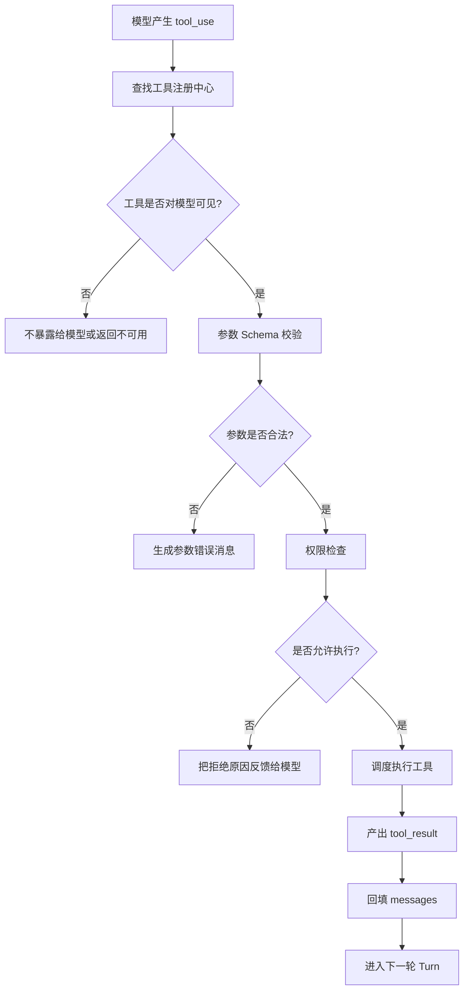
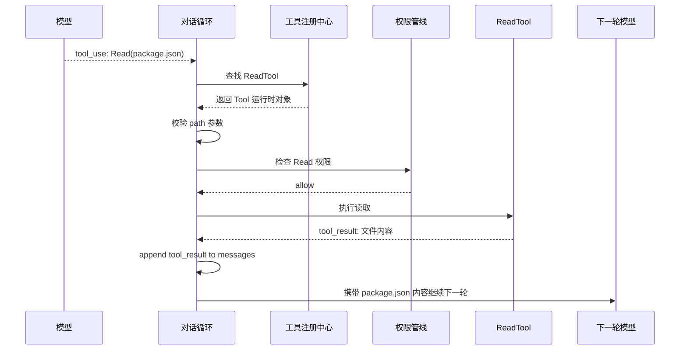
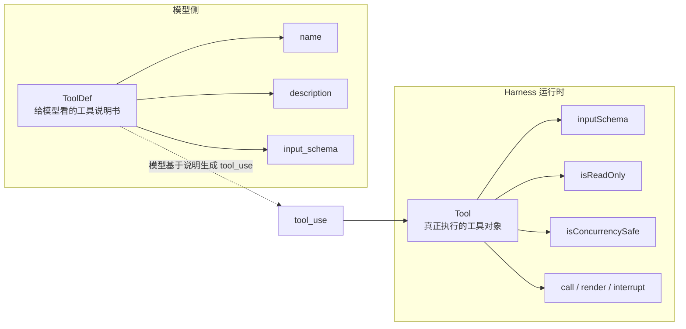
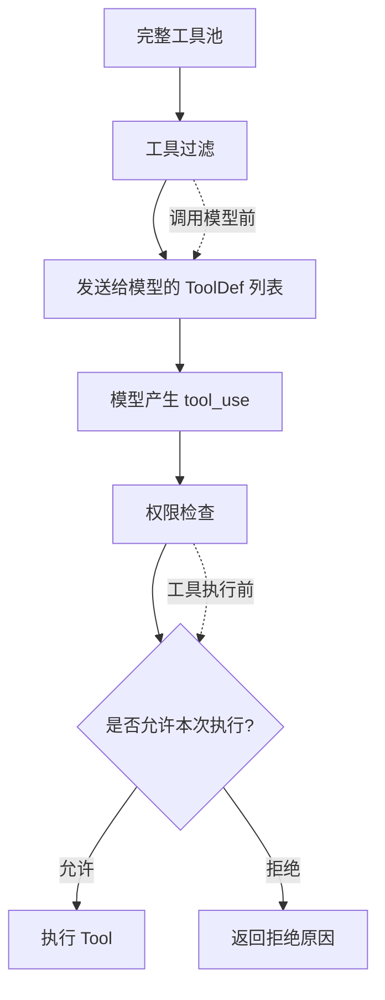
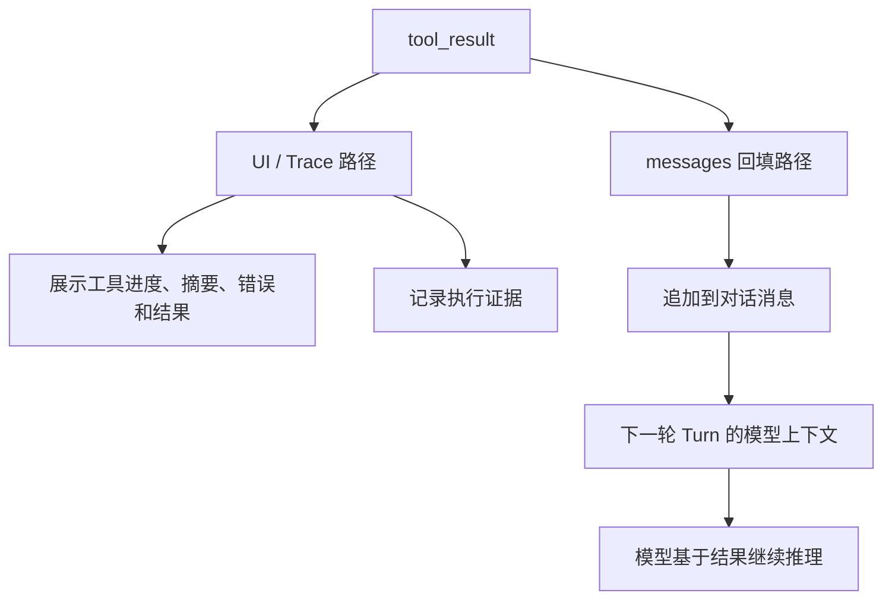
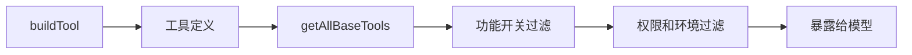
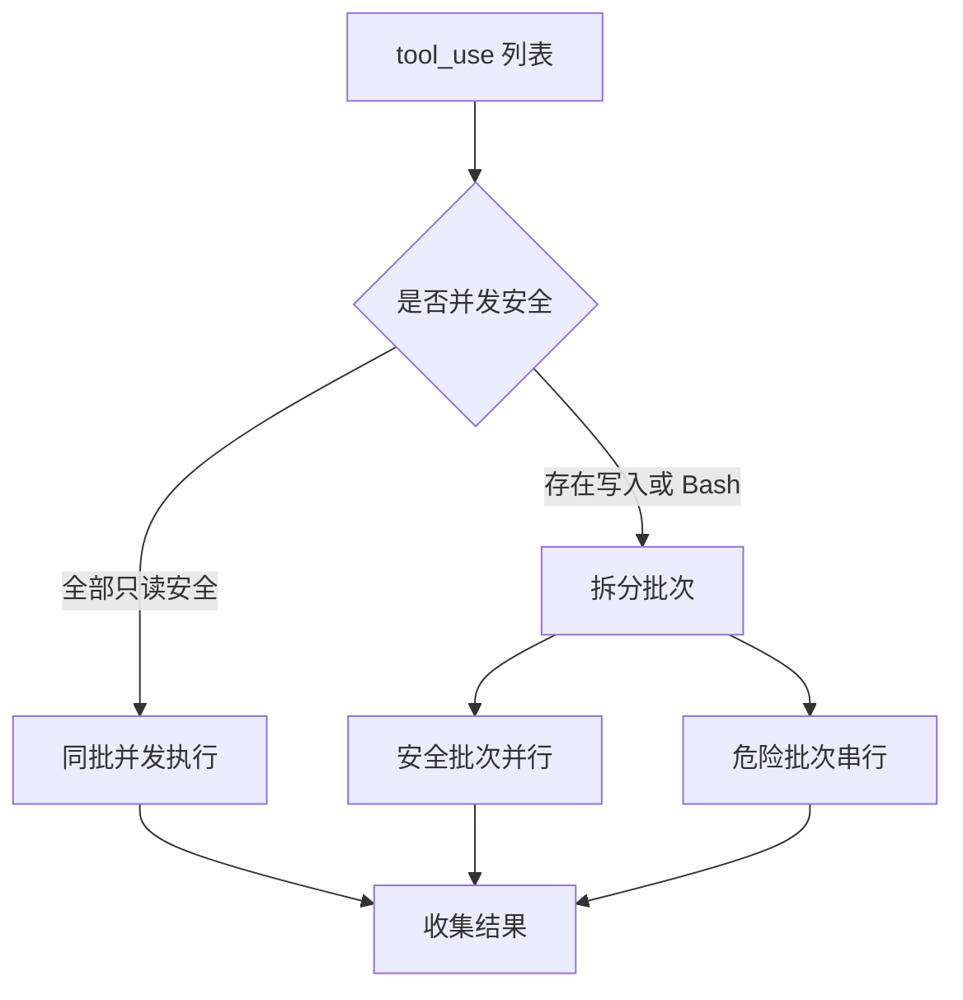

# 第 3 章：工具系统 - Agent 的双手

原课程对应：`第一部分-基础篇/03-工具系统-Agent的双手.md`

> 如果第 2 章的对话循环是 Agent 的心脏，那么工具系统就是 Agent 的双手。模型负责判断要做什么，工具系统负责把这种判断变成真实动作。

## 学习目标

读完本章后，你应该能够：

- 理解 Claude Code 工具定义协议的核心结构。
- 说明 `Tool`、`Tools`、`ToolDef`、`buildTool` 的职责差异。
- 理解工具注册、条件加载、死代码消除、延迟发现和过滤管线。
- 区分 Bash、文件、搜索、AgentTool 等核心工具的设计取舍。
- 掌握工具编排引擎如何在并行性、安全性和顺序性之间取平衡。
- 理解 `StreamingToolExecutor` 为什么能降低工具调用等待时间。

## 3.1 先看全景：模型意图如何变成真实动作

第 2 章讲的是对话循环如何发现 `tool_use`。第 3 章讲的是：一旦模型产生了 `tool_use`，Harness 如何把它变成一次真实、可控、可回填的动作。

先看完整路径：



读图时抓住三条线：

1. 模型只表达意图：它说“我要调用某个工具”。
2. Harness 负责把意图变成受控执行：查找、校验、权限、调度。
3. 工具结果必须回填：否则下一轮模型不知道真实世界发生了什么。

### 用 `Read(package.json)` 走一遍



这个例子说明：工具系统不是“模型直接执行函数”。模型只发出结构化请求，真正的执行权在 Harness 手里。

### 本章内容不需要全部记忆

| 学习等级 | 内容 | 要求 |
|----------|------|------|
| 必须理解 | 工具调用生命周期、工具结果回填、工具过滤 vs 权限检查 | 能用自己的话讲清楚 |
| 看到能识别 | `Tool`、`ToolDef`、`buildTool`、`runTools`、`StreamingToolExecutor` | 读源码时知道它们大概负责什么 |
| 查阅即可 | 泛型参数、完整工具清单、全部工具状态字段 | 使用时回来查表，不需要背 |

先理解工具调用路径，再把 API 名称对应到路径节点。不要一开始就背 `Tool<Input, Output, Progress>`。

## 3.2 工具定义协议

Claude Code 的每个工具都遵循统一类型契约。原课程把这个契约称为工具系统的基石。

易学理解：工具不是一段随便可调用的函数，而是一份完整协议。它必须告诉 Harness：

- 我叫什么。
- 我需要什么参数。
- 我是否只读。
- 我是否并发安全。
- 我如何执行。
- 我如何展示执行过程和结果。
- 我在中断时应该如何处理。

这就是“接口即架构”。工具协议写清楚后，权限检查、并发调度、进度反馈、UI 渲染都能围绕同一个契约工作。

### 核心类型：Tool、Tools、ToolDef、buildTool

原课程中的工具类型可以按职责理解：

| 类型 | 易学解释 | 作用 |
|------|----------|------|
| `Tool<Input, Output, Progress>` | 单个工具的完整契约 | 定义输入、输出、进度和行为 |
| `Tools` | 工具集合 | 表示 Harness 当前可用工具池 |
| `ToolDef` | 发送给模型的工具定义 | 让模型知道工具名称、描述和参数 |
| `buildTool` | 工具构造工厂 | 给工具补齐默认行为和类型约束 |

最容易混淆的是 `ToolDef` 和 `Tool`：



读图结论：

```text
模型看到的是 ToolDef。
Harness 执行的是 Tool。
tool_use 是两者之间的桥。
```

`Tool` 使用泛型拆分输入、输出和进度数据。这种设计不是类型炫技，而是把三个关注点分开：

- 输入类型：用于参数校验。
- 输出类型：用于工具执行结果。
- 进度类型：用于流式 UI 和中间状态。

每个工具通常围绕五个要素定义：

1. 名称与别名。
2. Zod Schema。
3. 权限与安全声明。
4. 执行逻辑。
5. 渲染和进度反馈。

名称用于模型调用和注册表匹配。别名用于兼容旧名称。一个公开工具如果改名，不能简单删除旧名称，否则旧配置、脚本和用户习惯都会断裂。

Zod Schema 有双重作用：

- 对模型生成的参数做运行时校验。
- 转换成 JSON Schema，告诉模型参数含义和约束。

这点非常重要：模型输出并不可信，工具必须把模型参数当作外部输入处理。

### buildTool 工厂函数

`buildTool` 是创建工具的标准入口。它接收部分工具定义，并补齐安全默认值。

这个模式可以概括为：

```text
开发者声明工具核心行为
  -> buildTool 补齐默认值
  -> 返回完整 Tool 契约
```

安全默认值遵循 `fail-closed` 原则：如果工具没有显式声明自己只读、并发安全或低风险，就默认不安全。

这和机场安检类似：默认所有行李都要检查，只有明确满足条件的对象才能走快速通道。反过来如果默认放行，只在发现问题时拦截，安全系统会非常脆弱。

对自研 Harness 来说，`buildTool` 的启发是：不要让每个工具重复实现一堆样板逻辑。应该提供一个工具工厂，让简单工具只关注核心执行，复杂工具再显式覆盖高级行为。

## 3.3 工具注册与动态发现

工具定义只是第一步。Harness 还需要知道当前有哪些工具、哪些工具能暴露给模型、哪些工具应该延迟加载。

### getAllBaseTools() 完整工具清单

`getAllBaseTools()` 可以理解为内建工具的注册中心。它返回 Claude Code 当前基础工具集合。

这些工具大致可以分成几类：

| 类别 | 代表工具 | 作用 | 并发安全倾向 |
|------|----------|------|--------------|
| 命令执行 | BashTool | 执行 Shell 命令 | 通常否 |
| 文件操作 | FileReadTool、FileEditTool、FileWriteTool | 读、改、写文件 | Read 是，Edit/Write 否 |
| 搜索 | GlobTool、GrepTool | 文件名和内容搜索 | 通常是 |
| 网络 | WebFetchTool、WebSearchTool | 抓取网页或搜索 | 通常是 |
| 智能协作 | AgentTool | 启动子智能体 | 通常否 |
| 任务规划 | TodoWriteTool、Plan 相关工具 | 任务和计划管理 | 视具体操作 |
| 配置 | ConfigTool | 修改配置 | 通常否 |
| MCP | List/Read MCP Resource 工具 | 访问外部资源 | 多为只读 |

工具清单不是越多越好。每多一个工具，都意味着更多 prompt token、更多选择空间、更多权限规则和更多测试负担。

### 死代码消除在工具注册中的应用

原课程提到，Claude Code 使用条件导入和功能开关，让某些工具只在特定构建或特定功能模式下出现。

这有两个价值。

第一是性能：不需要的工具不加载，减少启动和打包成本。

第二是安全：内部调试工具、实验功能或特定环境工具不应该出现在外部构建中。即使隐藏在 UI 后面，只要代码被打进包里，就有被误用或泄露信息的风险。

因此，工具注册不仅是功能组织，也是产品边界和安全边界。

### ToolSearchTool 延迟发现机制

当工具数量很多时，把所有工具 schema 一次性发给模型会非常浪费上下文。尤其接入 MCP 后，外部服务可能提供几十个甚至上百个工具。

延迟发现的思路是：

```text
初始上下文只给模型工具目录
  -> 模型发现需要某类工具
  -> 调用 ToolSearchTool
  -> Harness 再加载具体工具 schema
```

这像给模型一本目录，而不是一开始塞完整百科全书。

延迟发现的价值：

- 降低初始 prompt token。
- 提升缓存命中率。
- 减少模型在无关工具之间犹豫。
- 让 MCP 工具接入更可控。

但也要注意：某些关键工具不能延迟，例如用于进一步发现工具的 ToolSearchTool 本身，以及某些任务入口工具。否则模型第一轮就可能找不到继续行动的入口。

### 工具过滤管线

从完整工具清单到最终发送给模型，中间会经过过滤管线。

典型过滤顺序可以理解为：

```text
全部基础工具
  -> 模式过滤
  -> 拒绝规则过滤
  -> 启用状态检查
  -> 合并 MCP 工具
  -> 排序去重
  -> 发送给模型
```

这里最关键的是“工具可见性过滤”：不允许使用的工具，最好在发送给模型前就过滤掉。

原因很简单：如果模型看到了一个禁止工具，它可能仍会尝试调用，然后 Harness 再拒绝。这样会浪费 token 和 turn，也会让模型陷入“我明明看到了工具但不能用”的混乱状态。

排序也不是细节。工具列表顺序稳定，有助于 prompt 缓存。如果每次工具顺序不同，缓存命中会下降。

### 工具过滤 vs 权限检查

工具过滤和权限检查都和安全有关，但发生时间不同。



| 机制 | 发生时间 | 决定什么 | 典型问题 |
|------|----------|----------|----------|
| 工具过滤 | 调用模型前 | 模型能不能看见工具 | 这个工具是否应该出现在当前上下文里？ |
| 权限检查 | 工具执行前 | 这次调用能不能真的执行 | 这次参数、路径、命令是否允许？ |

一句话区分：

```text
过滤控制“可见性”。
权限控制“执行权”。
```

如果一个工具本来就不该使用，最好在过滤阶段不暴露给模型。如果工具通常可用，但某次调用参数有风险，就在权限阶段拦截。

## 3.4 核心工具深度解析

本节不是逐个背工具列表，而是理解不同工具为什么这样设计。

先看风险阶梯：


这张图不是说 Read 永远安全、Bash 永远不能用，而是说明默认风险倾向不同：

| 工具类型 | 副作用风险 | 并发倾向 | 权限倾向 |
|----------|------------|----------|----------|
| Read / Glob / Grep | 低，主要观察信息 | 通常可并发 | 通常较宽松 |
| Edit | 中，会修改已有文件 | 谨慎并发 | 需要确认修改范围 |
| Write | 高，可能创建或覆盖文件 | 通常串行 | 需要更强确认 |
| Bash | 最高，命令语义复杂 | 默认保守串行 | 高风险确认 |

后面分别看 Bash、文件三件套、搜索工具和 AgentTool 时，都可以回到这张风险阶梯。

### BashTool：命令执行的瑞士军刀

BashTool 是最强大的工具，也是风险最高的工具。

它不只是执行 Shell 命令，还要处理：

- 命令权限。
- 沙箱边界。
- 中断行为。
- 执行进度。
- 错误传播。
- 命令语义分析。

BashTool 的特殊性在于副作用不可预测。一个 Bash 命令可能只是 `ls`，也可能是删除文件、启动服务、修改环境、发起网络请求。因此它通常不能简单标记为并发安全。

原课程提到一个重要设计：BashTool 执行失败时，可能会取消同一批并行 Bash 工具。原因是 Bash 命令之间经常存在隐式依赖，一个命令失败后继续执行后续命令，可能只会产生更多噪音和破坏。

中断行为也需要细分。用户按 Ctrl+C 时，有些命令应立即取消，有些命令可能需要等待安全点。例如测试命令中断后可能仍有价值输出，而破坏性命令中断可能留下半完成状态。

### 文件三件套：FileReadTool、FileEditTool、FileWriteTool

文件工具体现了读、改、写三种不同风险等级。

`FileReadTool` 负责读文件，通常是只读且并发安全。它还可以维护文件状态缓存，避免重复读取和重复注入上下文。

`FileEditTool` 负责精确编辑。它常使用 `old_string -> new_string` 的模式，而不是直接按行号修改。原因是行号很脆弱：文件在读取和编辑之间可能已经变化，行号就会偏移。精确字符串匹配更适合保证“我改的是我看到的那一段”。

`FileWriteTool` 负责创建或覆写文件，风险最高。它可以完全替换文件内容，因此权限和确认要求通常比 Edit 更严格。

这三个工具的区分对自研 Harness 很重要。不要把所有文件操作都做成一个万能 `file_tool`。读、改、写的风险、权限和并发策略都不同。

### 搜索双雄：GlobTool 与 GrepTool

GlobTool 查文件名，GrepTool 查文件内容。

虽然 BashTool 也可以执行 `find` 和 `grep`，但专门搜索工具有明显优势：

- 输出结构化，模型更容易解析。
- 默认只读，权限更宽松。
- 可限制结果数量，避免输出爆炸。
- 可针对文件类型、glob、ignore 规则优化。

这体现了“专门化优于通用化”。万能工具虽然灵活，但结构化、安全性和可控性都更差。

### AgentTool：子智能体入口

AgentTool 是进入多 Agent 协作的入口。它让主 Agent 可以派出子智能体处理独立子任务。

它和普通工具不同：普通工具执行一个确定动作，AgentTool 会启动一个独立推理过程。

关键设计点：

- 子智能体有独立上下文窗口。
- 子智能体继承部分父上下文，例如权限规则。
- 子智能体不应直接污染父 Agent 的消息历史。
- 子结果通过明确协议返回给主 Agent。

这就是后续 Subagent/Fork 章节要展开的内容。这里先记住：AgentTool 是工具系统和多 Agent 编排之间的桥。

## 3.5 工具编排引擎

模型可能在一轮响应里请求多个工具。Harness 必须决定这些工具怎么执行。

工具编排要同时满足三个目标：

1. 并行性：能并行的尽量并行，提高速度。
2. 安全性：有副作用或依赖关系的不能乱并行。
3. 顺序性：最终结果呈现顺序要稳定，方便模型和 UI 理解。

### runTools() 函数与并发分区

`runTools()` 是工具执行调度的核心。它通常也是一个异步生成器，因为工具执行过程也需要产出进度和结果。

核心策略是并发分区：

```text
遍历工具调用列表
  -> 连续并发安全工具合并为一个批次
  -> 非并发安全工具单独成批
  -> 安全批次并行执行
  -> 非安全批次串行执行
```

举例：

```text
[Read(a.ts), Read(b.ts), Bash(ls), Read(c.ts)]
```

可能分成：

```text
批次 1：Read(a.ts), Read(b.ts)  并行
批次 2：Bash(ls)                串行
批次 3：Read(c.ts)              等 Bash 之后再读
```

换成图更直观：

```mermaid
flowchart TD
  I[输入 tool_use 列表<br/>Read(a), Read(b), Bash(ls), Read(c), Edit(d)] --> B1[Batch 1<br/>Read(a) + Read(b)<br/>并行执行]
  B1 --> B2[Batch 2<br/>Bash(ls)<br/>保守串行]
  B2 --> B3[Batch 3<br/>Read(c)<br/>等待 Bash 后执行]
  B3 --> B4[Batch 4<br/>Edit(d)<br/>写入类工具串行]
  B4 --> O[按批次收集 tool_result]

  classDef safe fill:#ECFDF3,stroke:#16A34A,color:#111827
  classDef risky fill:#FEF2F2,stroke:#DC2626,color:#111827
  classDef output fill:#E8F3FF,stroke:#2563EB,color:#111827
  class B1,B3 safe
  class B2,B4 risky
  class O output
```

读图结论：调度器不是只看“谁先完成”，而是先按风险把工具分批。安全批次可以并行，危险批次要保守串行，最终还要收集成下一轮能理解的结果。

为什么 `Read(c.ts)` 不能和 `Bash(ls)` 同批？因为 Bash 可能有副作用。即使命令看起来只是 `ls`，调度器如果基于工具类型而不是命令语义做保守判断，会更安全。否则文件读取可能看到 Bash 执行前后的不确定状态。

并发安全标记很关键。只读工具如果错误标成不安全，会变慢；写入工具如果错误标成安全，会产生数据竞争。

### StreamingToolExecutor 流式执行

传统工具执行路径是：等模型完整响应结束，再执行所有工具。

StreamingToolExecutor 更激进：模型流式输出 tool_use 块时，就可以开始执行工具。

这会减少等待时间：

```text
传统：
模型完整输出 -> 工具开始执行 -> 工具全部完成

流式：
模型输出第一个工具调用 -> 第一个工具立即开始
模型继续输出后续工具 -> 后续工具陆续开始
```

它内部通常维护一个工具状态机：

| 状态 | 含义 |
|------|------|
| queued | 工具已入队，等待执行条件 |
| executing | 工具正在执行 |
| completed | 工具执行完成但结果未必已产出 |
| yielded | 结果已按顺序产出 |

这里有一个精细平衡：执行可以并行，但结果产出要尽量保持请求顺序。否则 UI 和下一轮消息构造会变得复杂。

错误传播也要区分。Bash 失败可能影响同批命令，所以需要取消相关执行；只读搜索失败通常是局部失败，不应取消所有工具。

### 工具状态机在对话主循环中的集成

工具编排不是孤立模块，它和第 2 章对话循环紧密连接。

流式路径中：

```text
模型流式产生 tool_use
  -> StreamingToolExecutor 入队
  -> 条件满足就执行
  -> 完成后收集结果
  -> 按顺序 yield 给 UI
  -> 结果回填到下一轮 messages
```

批量路径中：

```text
模型响应完全结束
  -> 收集全部 tool_use
  -> runTools 执行
  -> 收集全部结果
  -> 下一轮调用模型
```

两条路径都必须保证同一件事：工具执行后对上下文的修改要传播回对话循环。例如工具写了文件，文件缓存也要更新；工具读了文件，后续上下文可能要知道这个文件已经被观察过。

工具结果也有两条消费路径：



读图结论：工具结果不是只给用户看的日志。它必须进入下一轮模型上下文，否则模型无法基于真实执行结果继续行动。

## 实战练习

### 练习一：实现一个自定义工具

设计一个 `file_info` 工具，要求：

- 参数包含 `path` 字段。
- 使用 schema 校验输入。
- 返回文件是否存在、大小和类型。
- 标记它是否只读。
- 判断它是否并发安全。
- 设计工具使用消息和结果消息如何展示。

思考：如果这个工具读取文件系统元数据，它是否应该并发安全？如果未来它会自动创建缺失文件，这个判断是否改变？

### 练习二：分析并发分区策略

给定工具调用：

```text
Read(a.ts), Grep(TODO), FileEdit(a.ts), Glob(*.md), Bash(npm test), Read(b.ts)
```

手动分批，并说明每个批次为什么可以或不可以并行。

重点不是答案唯一，而是你是否能说明风险来源。

### 练习三：追踪 StreamingToolExecutor 生命周期

观察一次包含多个工具调用的任务，记录每个工具从 `queued` 到 `yielded` 的状态变化。

重点观察：

- 哪些工具提前开始执行。
- 哪些工具必须等待。
- 哪些结果先完成但延后产出。
- 中断时哪些工具被取消。

## 关键要点

1. 工具调用生命周期是本章主线：模型产生 `tool_use`，Harness 查找工具、校验参数、检查权限、调度执行，最后把 `tool_result` 回填到下一轮 messages。

2. 工具系统的核心不是“能调用函数”，而是统一协议。`ToolDef` 是给模型看的说明书，`Tool` 是 Harness 运行时真正执行的对象。

3. `buildTool` 体现“显式声明，安全默认”。工具必须主动声明自己只读或并发安全，否则默认保守处理。

4. 工具注册中心是能力单一事实来源。条件注册、死代码消除和延迟发现共同控制工具何时存在、何时可见、何时加载。

5. 工具过滤控制“模型能不能看见工具”，权限检查控制“这次调用能不能真的执行”。两者发生时间不同，不能混为一谈。

6. BashTool 强大但危险，文件工具要区分读、改、写，搜索工具体现专门化优势，AgentTool 是多智能体能力入口。

7. 并发分区让工具执行在性能和安全之间取平衡。并发安全标记错误会直接影响可靠性。

8. StreamingToolExecutor 把工具执行前移到模型流式输出阶段，通过状态机保证并行执行和顺序产出的平衡。

下一章会进入权限管线。工具系统给了 Agent 行动能力，权限管线决定这些行动在什么边界内可以发生。

## 3.6 关键流程图补强

### 图 1：工具注册管线



### 图 2：工具过滤流程

```text
全部工具
  -> 当前运行环境是否支持
  -> feature flag 是否开启
  -> 权限模式是否允许可见
  -> 子智能体工具隔离
  -> 最终工具列表
```

工具过滤不是执行前才做的安全检查。更好的设计是：模型一开始就不要看到不该使用的工具。

### 图 3：runTools 并发分区



### 图 4：Read / Edit / Write 风险差异

| 工具类型 | 风险 | 并发倾向 | 权限倾向 |
|----------|------|----------|----------|
| Read | 观察文件 | 可并发 | 通常较低 |
| Edit | 修改已有文件 | 谨慎并发 | 需要确认 |
| Write | 创建或覆盖文件 | 通常串行 | 需要确认 |
| Bash | 任意命令入口 | 默认串行 | 高风险确认 |
