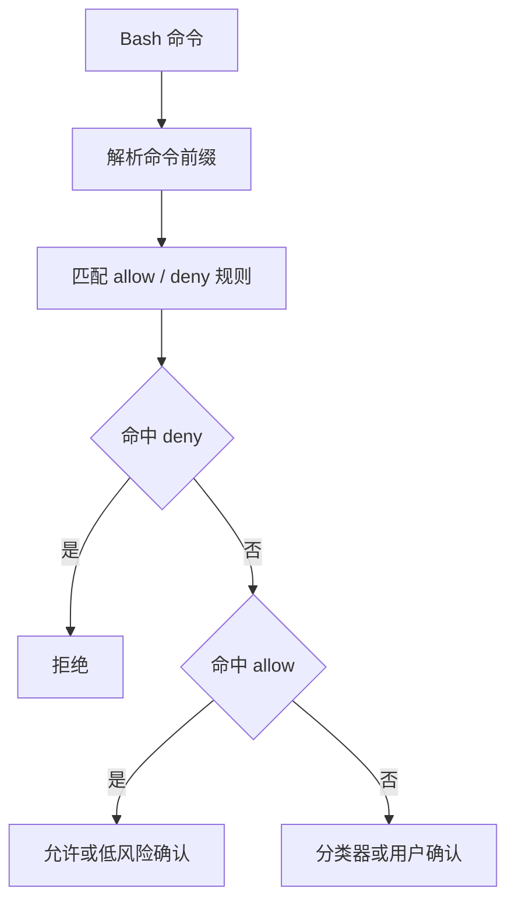

# 第 4 章：权限管线 - Agent 的护栏

原课程对应：`第一部分-基础篇/04-权限管线-Agent的护栏.md`

> 工具系统给了 Agent 行动能力，权限管线决定这些行动能不能发生、在什么范围内发生、由谁确认、是否需要持久化规则。

## 学习目标

读完本章后，你应该能够：

- 理解权限管线不是单点检查，而是多阶段决策流程。
- 说清 `validateInput`、`hasPermissionsToUseTool`、`checkPermissions` 和用户确认各自负责什么。
- 理解 `PermissionContext` 为什么需要携带工具、环境、来源和决策信息。
- 区分 default、plan、auto、bypassPermissions、bubble 等权限模式。
- 理解 BashTool 权限为什么比普通工具更复杂。
- 掌握权限更新和持久化在项目级安全配置中的作用。

## 4.1 权限管线的四个阶段

权限管线的核心思想是分层防御。一个工具调用从模型产生到真正执行，中间至少要经过参数、规则、上下文和用户确认等多个关口。

可以把它理解为：

```text
模型提出工具调用
  -> 阶段一：参数 schema 验证
  -> 阶段二：静态规则匹配
  -> 阶段三：上下文评估
  -> 阶段四：用户确认或自动决策
  -> 执行或拒绝
```

每一层解决的问题不同。前一层越早拦截，后面的风险和成本越低。

### 4.1.1 阶段一：validateInput - Zod Schema 验证

第一阶段是输入验证。

模型生成的工具参数不能直接信任。即使模型“看起来懂工具”，它仍可能传错类型、漏掉必填字段、传入超出范围的值，或构造出工具无法处理的结构。

`validateInput` 的职责是：

- 检查工具参数是否符合 schema。
- 拒绝缺失字段、类型错误、非法枚举值。
- 把非结构化模型输出变成可靠的工具输入。

这一层不讨论“是否允许执行”，只讨论“这个请求是否格式正确”。这是权限管线的地基。参数不合法时，不应该进入更昂贵的权限判断。

### 4.1.2 阶段二：hasPermissionsToUseTool - 规则匹配

第二阶段是规则匹配。

这一层检查当前工具调用是否命中已有允许或拒绝规则。例如：

- 某个工具是否被禁用。
- 某个命令前缀是否被允许。
- 某个路径是否禁止写入。
- 当前模式是否允许使用此工具。

它更偏静态判断：根据工具名、输入参数、配置规则和权限列表快速得出初步结果。

这里的关键是“先看规则，再问用户”。如果某个动作已经被明确拒绝，就不应该再弹窗让用户确认；如果某个动作已经被项目规则明确允许，也不必每次打断用户。

### 4.1.3 阶段三：checkPermissions - 上下文评估

第三阶段是上下文评估。

有些权限不能只靠工具名判断。例如同样是 BashTool：

```text
ls src
rm -rf /
git status
npm test
curl internal-api
```

这些命令都走 BashTool，但风险完全不同。

`checkPermissions` 需要结合更多上下文：

- 当前权限模式。
- 工具输入内容。
- 项目目录和工作区。
- 用户配置和项目配置。
- 历史权限决策。
- Hook 或分类器返回的判断。
- 子智能体是否需要向父级冒泡权限。

这层的价值是把“工具级权限”细化为“动作级权限”。

### 4.1.4 阶段四：交互式提示 - 用户确认

第四阶段是用户确认。

当系统无法自动判断，或动作风险较高时，需要把决策交给用户。用户确认不是权限系统的全部，但它是处理不确定风险的重要层。

一个好的确认提示应该说明：

- 哪个工具要执行。
- 具体参数是什么。
- 可能产生什么影响。
- 是只允许一次，还是允许类似操作。
- 是否要写入持久化规则。

交互式提示的设计目标不是频繁打扰用户，而是在关键风险点给用户明确控制权。

## 4.2 PermissionContext 的设计

权限决策不能只看工具名。它需要上下文。

`PermissionContext` 可以理解为权限管线的“案卷”：一次工具调用进入权限系统时，所有判断需要的信息都应该装在这个上下文里。

### 4.2.1 ToolPermissionContext 类型结构

一个完整的工具权限上下文通常需要包含：

| 信息 | 作用 |
|------|------|
| 工具名称 | 判断是哪类能力 |
| 工具输入 | 判断具体动作风险 |
| 工作目录 | 限定路径和项目边界 |
| 权限模式 | 决定默认策略 |
| 用户规则 | 应用个人偏好 |
| 项目规则 | 应用项目安全约定 |
| Hook 结果 | 接入外部策略 |
| 子智能体来源 | 判断是否需要冒泡 |

这里的重点是：权限判断不是孤立函数，而是围绕上下文做决策。

### 4.2.2 PermissionDecision 的来源：hook、user、classifier

权限决策可能来自不同来源。

| 来源 | 特点 |
|------|------|
| hook | 外部脚本或生命周期扩展点给出的判断 |
| user | 用户通过交互式提示做出的选择 |
| classifier | 系统或模型分类器对风险的自动判断 |

不同来源的可信度和适用场景不同。

Hook 适合企业策略或项目规则，例如禁止访问某些路径。用户适合处理一次性高风险动作。分类器适合在 auto 模式下降低确认频率，但分类器结果不能替代硬性安全边界。

### 4.2.3 ResolveOnce 模式：原子化的竞争解决

权限决策可能存在竞争。例如用户确认、Hook 返回、分类器判断、超时逻辑可能都在等待结果。

`ResolveOnce` 模式的目标是：一次权限请求只能被解决一次。

```text
多个来源竞争产生决策
  -> 第一个有效决策生效
  -> 后续结果被忽略
  -> 避免重复执行或重复提示
```

这对交互式 Agent 很重要。否则可能出现用户刚拒绝，另一个异步分支又批准；或者同一工具调用被执行两次。

## 4.3 权限模式谱系

权限模式决定 Agent 默认如何处理工具调用。不同模式对应不同自动化程度和风险边界。

### 4.3.1 default 模式：逐次确认

default 模式偏保守。对于有风险或未明确允许的动作，系统会逐次询问用户。

适合：

- 新项目。
- 不熟悉的仓库。
- 权限规则尚未建立。
- 用户希望保持强控制。

缺点是确认频率较高，自动化体验较弱。

### 4.3.2 plan 模式：只读为主

plan 模式强调先理解和规划，减少修改性动作。

在这个模式下，Agent 更适合读取文件、搜索代码、分析结构、提出计划，而不是直接写文件或执行高风险命令。

它的价值是把“想清楚”和“动手改”分开。复杂任务中，先进入 plan 模式可以降低误操作概率。

### 4.3.3 auto 模式：自动审批（带分类器）

auto 模式试图减少交互确认，让系统根据规则或分类器自动批准低风险动作。

适合：

- 用户已经信任项目规则。
- 任务重复且风险可控。
- 需要较强自动化。

但 auto 不等于无限制。分类器可能误判，因此仍需要硬性拒绝规则、路径边界和沙箱保护。

### 4.3.4 bypassPermissions 模式：完全跳过

bypassPermissions 是最高风险模式。它跳过常规权限检查，让 Agent 更自由地执行动作。

这个模式只适合高度受控环境，例如临时实验、沙箱项目或用户明确承担风险的场景。

学习时要记住：bypass 不是更高级的 auto，而是主动关闭护栏。它应该被清楚标记、谨慎使用，并尽量限制在隔离环境里。

### 4.3.5 bubble 模式：子智能体权限冒泡

bubble 模式用于 Subagent 场景。

子智能体遇到需要确认的动作时，不应该自己随意决定，而是把权限请求冒泡给父级或主 Agent，由更高层上下文做判断。

这解决两个问题：

- 子 Agent 上下文不完整，可能不知道全局风险。
- 主 Agent 需要保持对关键动作的控制权。

## 4.4 BashTool 的权限细节

BashTool 是权限系统最复杂的工具之一，因为它本身是通用命令执行入口。

同一个 BashTool 可以执行安全命令，也可以执行高风险命令。因此 Bash 权限不能只看工具名，必须看命令语义。

### 4.4.1 命令分类与通配符匹配

命令分类用于判断 Bash 命令属于哪类动作：

- 只读查看，例如 `ls`、`cat`、`git status`。
- 构建测试，例如 `npm test`、`mvn test`。
- 修改文件，例如 `sed -i`、`rm`、`mv`。
- 网络访问，例如 `curl`、`wget`。
- 系统级操作，例如修改权限、安装软件。

通配符匹配用于表达规则。例如：

```text
允许 npm test *
拒绝 rm -rf *
允许 git status
```

通配符越宽，风险越高。`npm *` 比 `npm test` 风险大得多，因为它可能包含 install、publish、run script 等不同动作。

### 4.4.2 前缀提取规则

Bash 命令的权限规则经常基于前缀。

例如：

```text
git status --short
```

可以提取前缀为：

```text
git status
```

这样用户允许一次 `git status` 后，类似状态查询命令可以复用规则。

但前缀提取必须保守。Shell 命令可能包含管道、重定向、变量、子命令和逻辑操作符。简单字符串切分容易误判风险。

因此 Bash 权限通常需要命令解析和语义判断，而不是只做文本前缀匹配。

### 4.4.3 分类器自动审批机制

auto 模式下，分类器可以辅助判断命令风险。

例如它可以识别：

- 这是只读查询。
- 这是测试命令。
- 这是修改文件。
- 这是高风险删除。

但分类器只能降低确认成本，不能替代硬规则。明确拒绝的命令不应被分类器放行；越界路径也不应因为分类器判断低风险而绕过。

合理顺序是：

```text
硬性拒绝规则
  -> 显式允许规则
  -> 分类器判断
  -> 用户确认
```

## 4.5 权限更新与持久化

权限系统如果每次都问用户，会很烦。如果每次都自动放行，又很危险。

权限更新和持久化就是在两者之间建立平衡：用户可以把一次确认转化为稳定规则，但这个过程必须明确可见。

### 4.5.1 PermissionUpdate 模式

`PermissionUpdate` 可以理解为一次权限规则变更请求。

常见模式包括：

- 只允许本次。
- 允许当前命令前缀。
- 允许当前工具。
- 拒绝当前工具。
- 写入用户级规则。
- 写入项目级规则。

这里的重点是作用域。允许一次和永久允许是完全不同的风险；用户级规则和项目级规则也会影响不同范围。

### 4.5.2 applyPermissionUpdates 与 persistPermissionUpdates

权限更新通常分两步：

1. `applyPermissionUpdates`：把规则应用到当前运行时。
2. `persistPermissionUpdates`：把规则写入配置文件，供后续会话继续使用。

这两个步骤必须区分。

有些确认只应该在当前会话生效，不应该写盘。有些项目约定则需要持久化到项目配置中，让团队共享。

自研 Harness 时，也应该明确区分“临时权限”和“持久权限”。

## 实战练习：配置项目级权限系统

### 练习 1：配置项目级 `.claude/settings.json`

为一个项目设计基础权限配置：

- 默认允许只读搜索工具。
- 默认允许 `git status`、`git diff`。
- 修改文件需要确认。
- 删除文件需要明确拒绝或强确认。
- 网络请求需要确认。

思考：哪些规则应该放到项目级，哪些应该留在用户级？

### 练习 2：更精细的通配符控制

比较以下规则风险：

```text
allow: npm test
allow: npm run test:*
allow: npm *
```

说明为什么通配符越宽，权限风险越高。

### 练习 3：企业级安全配置模板

设计一个企业项目权限模板：

- 禁止访问密钥文件。
- 禁止执行部署命令。
- 禁止访问内网敏感域名。
- 允许只读代码搜索。
- 允许测试命令，但禁止发布命令。

重点不是规则语法，而是安全边界是否明确。

### 练习 4：权限决策流的情景分析

分析下面场景应该如何决策：

1. Agent 请求读取 `src/index.ts`。
2. Agent 请求写入 `src/index.ts`。
3. Agent 请求执行 `rm -rf dist`。
4. Agent 请求执行 `git status --short`。
5. 子智能体请求修改配置文件。

对每个场景说明会经过哪些权限阶段，最终应允许、拒绝、确认还是冒泡。

## 关键要点总结

1. 权限管线是多阶段流程，不是单个 allow/deny 判断。

2. `validateInput` 解决参数合法性，`hasPermissionsToUseTool` 解决规则匹配，`checkPermissions` 解决上下文评估，交互式提示解决不确定风险。

3. `PermissionContext` 让权限判断具备环境感知能力。工具名、输入参数、工作目录、权限模式、Hook、用户规则和子智能体来源都可能影响决策。

4. 权限模式是一条自动化谱系。default 更保守，plan 偏只读，auto 更自动化，bypass 风险最高，bubble 用于子智能体权限上交。

5. BashTool 权限最复杂，因为它是通用命令执行入口。命令分类、通配符匹配、前缀提取和分类器判断都必须保守设计。

6. 权限更新要区分临时应用和持久化写入。一次允许不等于永久允许，用户级规则也不等于项目级规则。

7. Agent 越能行动，权限越要前置。成熟 Harness 应该在工具可见性、参数校验、规则匹配、上下文评估、用户确认和持久化规则中形成闭环。

下一章会进入设置与配置系统。权限规则不是孤立存在的，它们需要通过配置系统在用户、项目和会话之间组织起来。

## 4.6 关键流程图补强

### 图 1：四阶段权限管线


### 图 2：权限模式谱系

```text
plan      : 只读优先，写操作受限
default   : 高风险动作逐次确认
auto      : 低风险动作可自动批准
bubble    : 子智能体权限上交父级
bypass    : 跳过权限，风险最高
```

### 图 3：Bash 前缀匹配流程



### 图 4：hook / user / classifier 决策竞争

```text
权限请求
  -> Hook 可以提前允许或拒绝
  -> Classifier 可以给低风险建议
  -> User 是不确定风险的最终确认者
  -> ResolveOnce 确保只采纳第一个有效决策
```

这张图的重点是：权限决策不是投票系统，而是有优先级和原子解决规则的竞争过程。
