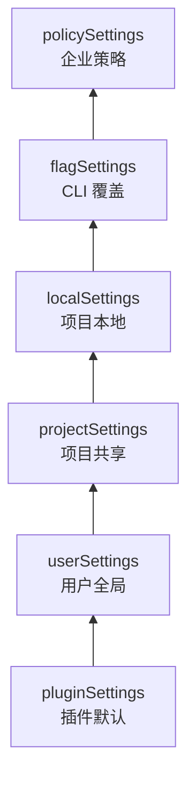
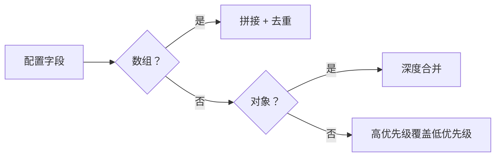
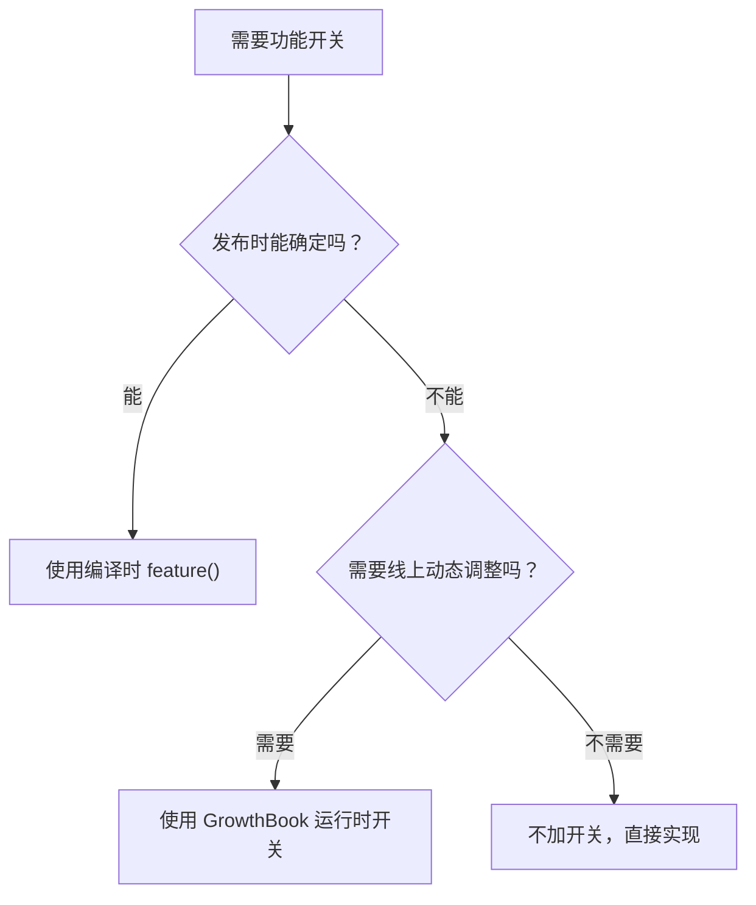
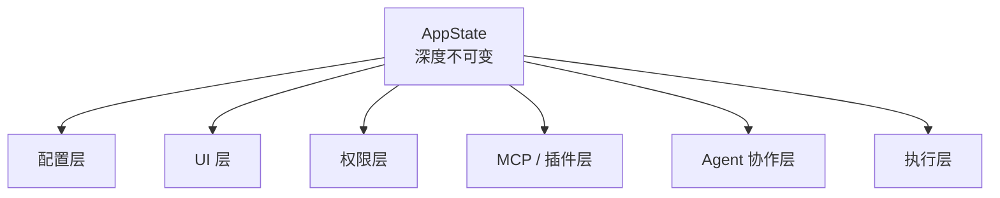
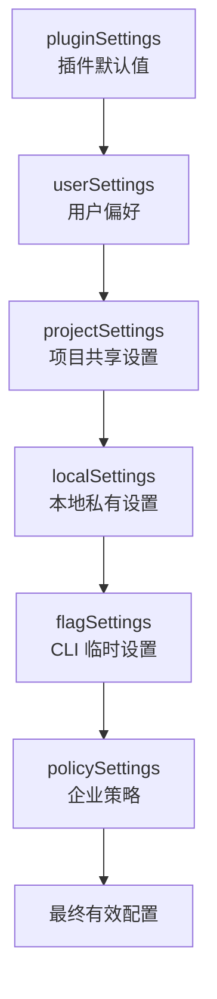
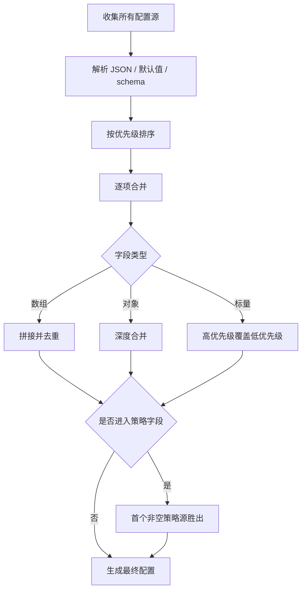
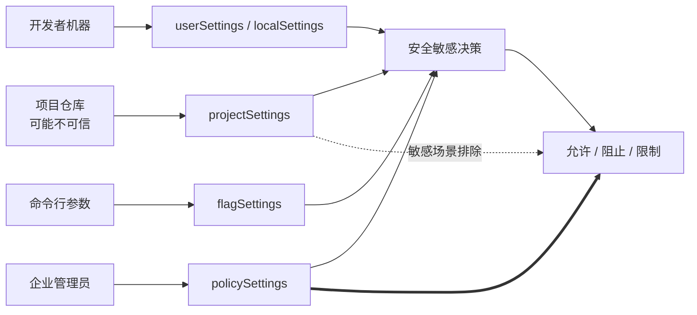
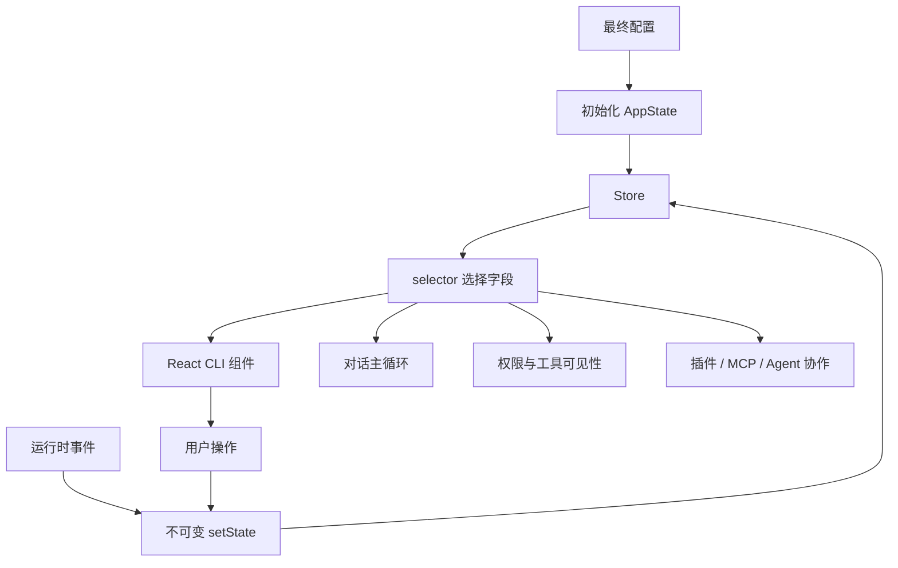

# 第 5 章：设置与配置 - Agent 的基因

原课程对应：`第二部分-核心系统篇/05-设置与配置-Agent的基因.md`

> 工具系统决定 Agent 能做哪些动作，权限管线决定这些动作是否安全。设置与配置系统则更靠前：它在 Agent 启动前就写入行为边界，决定模型、权限、Hooks、插件、功能开关和运行时状态如何组合。

## 学习目标

读完本章后，你应该能够：

- 说清 Claude Code 六层配置源的优先级，以及每层适合放什么。
- 理解数组、对象、标量在配置合并时为什么采用不同规则。
- 判断哪些配置源可信，哪些配置源在安全敏感场景下必须排除。
- 区分编译时功能开关和运行时实验开关。
- 理解 Claude Code 为什么用极简不可变 Store 管理全局状态。
- 能为个人项目、团队项目和企业场景设计合理配置策略。

## 5.1 六层配置源的优先级体系

配置不是单个 `settings.json` 文件。Claude Code 的最终行为来自多层配置叠加：插件给默认能力，用户配置表达个人偏好，项目配置表达团队约定，本地配置表达个人覆盖，命令行参数表达一次性覆盖，企业策略表达最高优先级的管控。

易学理解：配置像一层层透明胶片。底层提供默认图案，上层可以盖住下层的某些字段，但不是所有字段都用同一种方式覆盖。

### 5.1.1 配置源定义与顺序

原课程给出的完整优先级链从低到高是：

```text
pluginSettings
  -> userSettings
  -> projectSettings
  -> localSettings
  -> flagSettings
  -> policySettings
```

| 配置源 | 易学理解 | 典型内容 | 信任特点 |
|--------|----------|----------|----------|
| `pluginSettings` | 插件基础默认值 | 插件默认配置 | 低层基础，需受插件策略约束 |
| `userSettings` | 用户全局偏好 | 默认模型、UI 偏好、个人常用权限 | 用户自己控制 |
| `projectSettings` | 项目共享约定 | 团队 lint 命令、共享 Hooks、项目权限基线 | 会入 Git，可能来自他人仓库 |
| `localSettings` | 项目本地覆盖 | 个人调试偏好、本地额外权限 | 不入 Git，用户本机控制 |
| `flagSettings` | CLI 一次性覆盖 | CI 专用配置、临时模型选择 | 用户显式传入 |
| `policySettings` | 企业管理策略 | 强制模型、禁用能力、托管 Hooks | 最高优先级，管理方控制 |

优先级的核心原则是：后加载者覆盖前者。但这个“覆盖”不是简单粗暴的替换。不同数据类型有不同合并规则。



这个顺序能支持三类需求：

- 个人用户可以用全局设置减少重复配置。
- 团队可以把稳定规则提交到项目仓库。
- 企业可以在最上层锁定安全相关能力。

### 5.1.2 合并规则

配置合并的关键不是“谁优先”，而是“遇到不同类型怎么合并”。

| 类型 | 合并方式 | 例子 | 设计意义 |
|------|----------|------|----------|
| 数组 | 拼接并去重 | `permissions.allow` | 各层增加规则，不会意外清空下层规则 |
| 对象 | 深度合并 | `hooks.PreToolUse` | 嵌套配置可以逐层补充和覆盖 |
| 标量 | 高优先级直接覆盖 | `model`、`verbose` | 单一选择只保留最终值 |

例如用户全局配置里有：

```json
{
  "model": "sonnet",
  "permissions": {
    "allow": ["Bash(npm *)"]
  }
}
```

项目配置里有：

```json
{
  "permissions": {
    "allow": ["Read(*)", "Bash(npm test)"]
  }
}
```

本地配置里有：

```json
{
  "model": "opus",
  "permissions": {
    "allow": ["Bash(git *)"]
  }
}
```

合并后可以这样理解：

```json
{
  "model": "opus",
  "permissions": {
    "allow": [
      "Bash(npm *)",
      "Read(*)",
      "Bash(npm test)",
      "Bash(git *)"
    ]
  }
}
```

`model` 是标量，所以本地配置覆盖全局配置。`permissions.allow` 是数组，所以多层规则累积。

这里有一个安全细节：不能用上层空数组来“清除”下层权限。数组拼接会保留下层规则。如果要拒绝某类行为，应该使用显式的 deny 规则，而不是试图用空 allow 覆盖。



### 5.1.3 配置文件的实际路径

配置源最终要落到可定位的文件或外部来源上。

| 配置源 | 实际位置 | 是否建议提交 |
|--------|----------|--------------|
| `userSettings` | `~/.claude/settings.json` | 不适用，用户目录 |
| `projectSettings` | `<project>/.claude/settings.json` | 是，团队共享 |
| `localSettings` | `<project>/.claude/settings.local.json` | 否，应加入 `.gitignore` |
| `flagSettings` | CLI `--settings` 指定的文件 | 不适用，一次性 |
| `policySettings` | 远程策略、MDM、managed settings、注册表等 | 不适用，企业管理 |

其中 `policySettings` 最特殊。普通配置源会合并，企业策略源则采用“第一个非空来源胜出”的方式。它大致按如下顺序查找：

```text
远程管理策略
  -> MDM 策略
  -> managed-settings.json / managed-settings.d/*.json
  -> Windows 用户级注册表
  -> 没有企业策略
```

为什么不合并所有企业策略来源？因为企业策略通常是经过审计的一整套方案。把多个策略来源混在一起，可能产生无法预测的权限组合，也会降低审计确定性。

### 5.1.4 策略层的特殊地位

`policySettings` 不是“更高优先级的用户配置”，而是企业级权威配置。

普通配置源遵循增量模型：

```text
我信任下层配置
  -> 我只补充或覆盖自己关心的字段
  -> 最终得到叠加结果
```

企业策略遵循权威单一模型：

```text
找到最高优先级的非空策略来源
  -> 直接使用这一整套策略
  -> 不和其他企业策略来源混合
```

这能避免安全语义冲突。比如一个策略来源限制模型，另一个策略来源限制权限，如果随意合并，最终结果可能表面上更严格，实际上出现绕行空间。使用单一来源能让管理员清楚知道“到底是哪套策略在生效”。

### 5.1.5 配置加载的真实项目实践

实际使用时，可以把六层配置分工如下。

**个人开发场景**

```text
~/.claude/settings.json
  -> 个人默认模型、输出偏好、常用只读权限

<project>/.claude/settings.json
  -> 团队共享命令、项目 Hooks、基础权限规则

<project>/.claude/settings.local.json
  -> 个人本地调试配置、不会提交的临时权限
```

**CI/CD 场景**

```text
claude --settings /path/to/ci-settings.json
```

CI 里的配置应该临时、可追溯、最小权限。用 `flagSettings` 可以避免污染开发者本地配置，也方便流水线明确记录本次运行用了哪份配置。

**企业管控场景**

```text
policySettings
  -> 锁定模型、安全 deny 规则、托管 Hooks 限制

projectSettings
  -> 团队工作流、非敏感项目约定

userSettings
  -> UI 偏好、verbose 等个人体验配置
```

一个成熟团队不要把所有内容都塞进项目配置。项目配置适合稳定共享约定，个人偏好留给用户配置，本地临时行为留给 local 配置，安全底线交给策略层。

## 5.2 安全边界设计

配置系统的最大风险来自 `projectSettings`。它会随着仓库一起被克隆，也会自动加载。如果攻击者在恶意仓库里放入危险配置，用户进入项目后 Agent 可能在不知情的情况下加载它。

因此 Claude Code 的核心安全策略是：在安全敏感检查中系统性排除 `projectSettings`。

### 5.2.1 供应链攻击的威胁模型

传统软件供应链攻击通常通过依赖包、构建产物或安装脚本进入系统。Agent 配置供应链攻击更隐蔽：攻击者可以把危险配置伪装成普通项目文件。

| 维度 | 传统软件供应链攻击 | Agent 配置供应链攻击 |
|------|--------------------|----------------------|
| 攻击入口 | 依赖包、构建脚本、二进制产物 | `.claude/settings.json`、Hooks、工具配置 |
| 受害者 | 软件运行环境 | 使用 Agent 的开发者环境 |
| 攻击面 | 构建、安装、运行时 | 文件读写、命令执行、外部访问 |
| 隐蔽性 | 需要绕过依赖审查 | 配置看起来可能很正常 |

典型风险是恶意项目配置一个 `PreToolUse` hook，让每次工具调用前执行外部脚本，读取环境变量或密钥并发送出去。用户只是克隆项目并启动 Agent，攻击就可能发生。

`projectSettings` 危险的原因有三点：

- 它可能来自第三方仓库，不一定可信。
- 它会在进入项目后自动加载。
- 它可以配置 Hooks、权限等影响执行行为的能力。

这三个条件叠加，使它不能被当成用户主动授权。

### 5.2.2 shouldAllowManagedHooksOnly

`shouldAllowManagedHooksOnly` 用来判断是否只允许运行托管 Hooks。

如果企业策略启用了这个限制，Hooks 只从 `policySettings` 中读取。来自用户、项目、本地配置的 Hooks 都会被跳过。

这个设计适合合规要求强的组织。例如企业要求所有工具调用必须写入内部审计日志，那么管理员可以：

- 在企业策略中启用只允许托管 Hooks。
- 在企业策略中配置审计 Hook。
- 禁止开发者通过本地或项目配置替换审计 Hook。

这样做不是为了减少灵活性，而是为了保证关键安全动作不可绕过。

### 5.2.3 pluginOnlyPolicy

`pluginOnlyPolicy` 控制哪些“定制面”只能来自可信来源。原课程提到的定制面包括：

- `skills`
- `agents`
- `hooks`
- `mcp`

如果某个定制面被策略锁定，可信来源通常只包括：

- 企业策略配置
- 内置或随 CLI 发布的能力
- 经过策略允许的插件来源

用户目录和项目目录里的自定义内容会被阻断。

这个策略的价值在于“选择性锁定”。企业可以只锁定风险较高的面，例如 MCP 和 Hooks，同时仍允许团队使用普通技能或项目配置提升效率。

| 锁定对象 | 主要防护目标 |
|----------|--------------|
| `hooks` | 防止未审核脚本自动执行 |
| `mcp` | 防止连接未批准的外部服务 |
| `agents` | 防止加载不可信子 Agent 定义 |
| `skills` | 防止使用未审查的任务流程 |

### 5.2.4 projectSettings 的系统性排除

原课程强调，多个安全敏感判断都会有意排除 `projectSettings`。例如跳过危险权限提示、启用自动模式、计划模式下自动执行等能力，都不能只因为项目配置写了某个字段就直接放行。

这背后的原则可以叫“信任半径递减”：

```text
企业策略
  -> 用户显式 CLI 参数
  -> 用户本地配置
  -> 用户全局配置
  -> 项目共享配置
  -> 插件默认配置
```

越靠近用户主动控制的配置，越可信。越可能来自外部仓库或生态系统的配置，越要保守。

安全敏感字段尤其不能信任项目配置，例如：

- 跳过权限确认。
- 自动批准命令。
- 加载非托管 Hooks。
- 重定向记忆写入路径。
- 允许连接未审查外部服务。

这和第 4 章的权限管线是同一套思想：能行动的能力越强，配置来源越要可信。

## 5.3 功能开关系统

Claude Code 的功能开关分成两类：编译时开关和运行时开关。

编译时开关决定某段代码是否进入最终构建产物。运行时开关决定已经存在的能力在当前环境中是否启用。

### 5.3.1 编译时死代码消除

编译时开关通过 `feature()` 这类函数表达。构建时如果某个功能为关闭，打包器可以把对应分支直接移除。

这和运行时 `if` 判断不同：

| 方式 | 代码是否进入产物 | 是否有运行时开销 | 适合场景 |
|------|------------------|------------------|----------|
| 编译时开关 | 关闭时不进入 | 几乎没有 | 发布时就能决定的能力 |
| 运行时判断 | 仍在产物中 | 有少量开销 | 发布后仍需动态调整的能力 |

编译时死代码消除有三个好处：

- 减少包体积。
- 避免未启用实验功能进入用户环境。
- 降低隐藏代码路径带来的安全和测试负担。

原课程列举了多个功能标志，覆盖长期会话、后台守护、记忆提取、团队记忆、模板工作流、MCP 扩展等方向。学习时不需要背每个名字，重点是理解：功能开关不是零散布尔值，而是产品演进和风险隔离的机制。

### 5.3.2 GrowthBook 实验框架

运行时开关用于发布后仍需调整的能力。Claude Code 使用 GrowthBook 做实验和动态门控。

这类读取函数通常强调“来自缓存，可能不是最新值”。这个命名很重要，因为它提醒调用方：为了不阻塞启动路径，系统宁愿读取可能稍旧的缓存，也不在热路径上等待远程配置。

运行时开关适合：

- A/B 实验。
- 灰度发布。
- 按用户或环境动态启用。
- 不想重新发布 CLI 就调整的能力。

决策可以这样看：



第 6 章的自动记忆提取就是一个交叉案例：是否把提取能力编进产物由编译时开关控制，是否在某个用户环境启用还可能受运行时实验控制。

## 5.4 状态管理系统

配置决定 Agent 启动时的初始行为，但运行过程中还需要状态系统协调 UI、权限、工具、插件、MCP、子 Agent 等动态信息。

Claude Code 的状态管理方案很克制：不是引入复杂框架，而是实现一个极简不可变 Store，再通过 React Context 暴露给终端 UI。

### 5.4.1 Store：极简不可变状态容器

Store 的核心能力只有三个：

- `getState`：读取当前状态。
- `setState`：通过 updater 函数产生新状态。
- `subscribe`：订阅状态变化。

关键点是不可变更新。`setState` 不鼓励原地修改对象，而是要求返回一个新状态。系统再通过 `Object.is` 比较新旧引用，只有引用变化才通知订阅者。

```javascript
// 不触发通知：返回同一个引用
setState(prev => prev)

// 触发通知：返回新引用
setState(prev => ({ ...prev, count: prev.count + 1 }))
```

这种做法把“状态是否变化”的语义交给调用方：返回新引用就表示发生变化，返回旧引用就表示没有变化。

为什么不用更重的状态库？因为 Agent CLI 的状态需求和大型 Web 应用不同。

| 维度 | 大型 Web 应用 | Agent CLI |
|------|---------------|-----------|
| UI 交互频率 | 很高 | 中等 |
| 多用户并发 | 常见 | 通常是单用户会话 |
| 时间旅行调试 | 有价值 | 不是核心需求 |
| 中间件生态 | 常需要 | 不宜过重 |
| 代码可读性 | 重要 | 更重要 |

极简 Store 的价值是让状态流转可读、可控、可测试。

### 5.4.2 AppState：全局状态的类型定义

`AppState` 是全局状态的类型集合，并被标记为深度不可变。它覆盖很多子系统：

| 状态层 | 代表字段 | 作用 |
|--------|----------|------|
| 配置层 | `settings`、`verbose`、`mainLoopModel` | 保存合并后的配置和运行模式 |
| UI 层 | `expandedView`、`footerSelection`、`statusLineText` | 终端界面展示状态 |
| 权限层 | `toolPermissionContext` | 当前权限模式和工具许可上下文 |
| MCP 层 | `mcp.clients`、`mcp.tools`、`mcp.commands` | 外部协议集成状态 |
| 插件层 | `plugins.enabled`、`plugins.errors` | 插件加载和错误状态 |
| Agent 层 | `agentDefinitions`、`teamContext` | 子 Agent 和团队上下文 |
| 执行层 | `speculation` | 推测执行相关状态 |



深度不可变不是装饰。它让 TypeScript 在编译期阻止直接修改状态字段，避免“某个组件偷偷改了全局状态”的问题。

### 5.4.3 AppStateProvider：React Context 封装

`AppStateProvider` 把 Store 封装成 React Context。Provider 本身只创建一次 Store，不因为每次状态变化而整体重建。

消费者主要通过两个 hook 使用：

- `useAppState(selector)`：订阅状态切片。
- `useSetAppState()`：只拿更新函数，不订阅状态。

这背后用的是 React 的 `useSyncExternalStore`。它适合外部状态源，能保证并发渲染下的快照一致，避免 UI 读取到前后不一致的状态。

性能上，重点是最小订阅：

```javascript
// 反模式：订阅整个状态，任何字段变化都重渲染
const state = useAppState(s => s)

// 推荐：只订阅真正使用的字段
const model = useAppState(s => s.mainLoopModel)
const verbose = useAppState(s => s.verbose)

// 推荐：只写不读
const setState = useSetAppState()
```

这里的设计和配置系统一样，都在追求可解释性：每个组件为什么重渲染、每个状态字段由谁修改，都应该能说清楚。

## 5.5 关键流程图补强

### 图一：六层配置优先级图

配置系统最容易混淆的是“谁覆盖谁”。可以先记住：越靠后越有最终决定权，但 `policySettings` 又有特殊的首个非空策略。



学习时不要只背顺序，还要判断配置项的性质：数组、对象和标量的合并方式不同；安全敏感配置还会排除不可信来源。

### 图二：配置合并流程图



这张图能帮助你分析练习题：先找来源，再看优先级，最后看字段类型。不要把所有字段都当成简单覆盖。

### 图三：企业策略单一权威模型

企业策略和项目配置的关键差异是可信边界不同。项目配置可能来自仓库，策略配置来自组织管理面。



理解这个模型后，就能解释为什么 `projectSettings` 虽然方便共享，但不能作为企业安全底线的唯一依据。

### 图四：AppState 数据流图

配置加载完成后不会停在文件层，它会进入运行时状态，并影响 UI、权限、模型选择和扩展系统。



学习重点是单向数据流：配置和事件改变状态，组件和子系统通过 selector 读取状态，读取方不应该偷偷修改全局对象。

## 实战练习

### 练习 1：配置合并预测

已知：

- `~/.claude/settings.json`：`{ "permissions": { "allow": ["Bash(ls)"] }, "model": "sonnet" }`
- `.claude/settings.json`：`{ "permissions": { "allow": ["Read(*)"] }, "hooks": { "Stop": ["..."] } }`
- `.claude/settings.local.json`：`{ "permissions": { "allow": ["Bash(git *)"] } }`

请预测合并后的 `permissions.allow` 和 `model`。

参考答案：`permissions.allow` 是 `["Bash(ls)", "Read(*)", "Bash(git *)"]`，`model` 仍是 `"sonnet"`。

延伸思考：如果 CLI `--settings` 设置了 `"model": "opus"`，结果是什么？如果企业策略设置了 `"model": "haiku"`，结果又是什么？

### 练习 2：安全边界分析

假设你是企业管理员，希望：

- 所有用户只能运行管理员批准的 Hooks。
- 用户不能自行安装或连接未批准的 MCP 服务器。

应该放在哪一层配置？应该启用什么类型的策略？

参考答案：放在 `policySettings`。启用只允许托管 Hooks，并对 `mcp` 定制面启用插件或策略限制。

### 练习 3：状态订阅优化

一个组件只显示当前模型名和 `verbose` 状态。比较两种写法：

```javascript
const state = useAppState(s => s)
```

和：

```javascript
const model = useAppState(s => s.mainLoopModel)
const verbose = useAppState(s => s.verbose)
```

哪种更好？为什么？

参考答案：第二种更好。第一种订阅整个状态树，任何字段变化都可能重渲染。第二种只订阅组件真正使用的两个字段。

### 练习 4：配置策略设计

为一个 20 人开发团队设计配置分层：

- 团队统一使用指定模型和权限基线。
- 每个开发者可以自定义 UI 偏好和本地调试权限。
- CI/CD 使用最小权限原则。

建议答案：

| 配置源 | 放什么 |
|--------|--------|
| `policySettings` | 企业安全底线，例如禁用危险工具、限制外部服务 |
| `projectSettings` | 团队共享模型建议、lint/test 命令、项目权限基线 |
| `userSettings` | 个人 UI 偏好、默认输出风格 |
| `localSettings` | 本地调试权限，不提交 |
| `flagSettings` | CI/CD 一次性最小权限配置 |

## 关键要点总结

1. Claude Code 的最终配置来自六层优先级链：`pluginSettings -> userSettings -> projectSettings -> localSettings -> flagSettings -> policySettings`。

2. 合并规则按类型区分：数组拼接去重，对象深度合并，标量由高优先级覆盖。

3. `projectSettings` 会入 Git，可能来自不可信仓库，所以在安全敏感检查中必须被系统性排除。

4. `policySettings` 采用“首个非空源胜出”，不是普通深度合并，这保证企业策略可审计、可预测。

5. 编译时功能开关用于死代码消除，运行时 GrowthBook 开关用于灰度和实验。两者解决的问题不同。

6. Claude Code 的 Store 很小，但通过不可变更新、`Object.is` 引用比较和订阅机制，满足了 Agent CLI 的核心状态管理需求。

7. `AppState` 把配置、UI、权限、MCP、插件、Agent 协作和执行状态放入一个可类型检查的全局结构中。理解它有助于理解各子系统如何协同。
