# 第 6 章：记忆系统 - Agent 的长期记忆

原课程对应：`第二部分-核心系统篇/06-记忆系统-Agent的长期记忆.md`

> 上下文窗口只能保存当前会话的工作记忆。记忆系统解决的是另一个问题：哪些信息值得跨会话保存，并在未来任务中成为 Agent 的可靠线索。

## 学习目标

读完本章后，你应该能够：

- 区分 `user`、`feedback`、`project`、`reference` 四种记忆类型。
- 理解为什么记忆系统只保存不可从代码仓库实时推导的信息。
- 掌握记忆 Markdown 文件、Frontmatter 和 `MEMORY.md` 索引的作用。
- 说明后台自动记忆提取为什么基于 Fork 模式运行。
- 理解工具列表一致性和提示缓存共享之间的关系。
- 能设计一套不过度保存、可验证、可维护的 Agent 记忆策略。

## 6.1 四种记忆类型的分类学

记忆不是聊天记录，也不是项目文档。Claude Code 的记忆系统关注的是“以后仍然有用，但不能简单从代码里重新读取出来”的信息。

易学理解：代码、文件结构、Git 历史是 Agent 可以实时查到的事实，不该塞进长期记忆。用户偏好、项目决策背后的原因、外部系统入口、被验证过的做法，才更适合保存。

先看一条信息如何变成记忆：

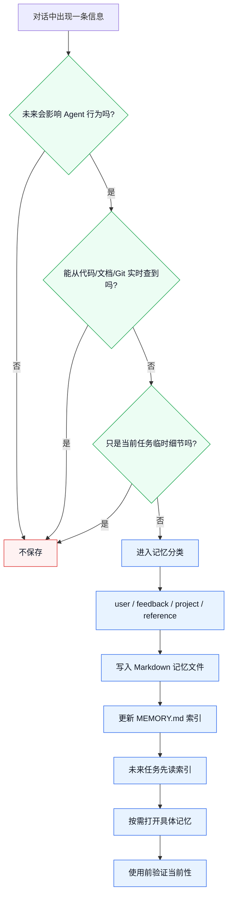

读图结论：记忆系统的第一步不是分类，而是克制。只有“未来有用、实时拿不到、不是临时细节”的信息，才值得进入记忆系统。

也可以把第一步压缩成一个决策树：

```text
要不要保存为记忆？
  -> 未来会影响 Agent 行为吗？
      否：不保存
  -> 能从代码 / 文档 / Git 直接查到吗？
      是：不保存，未来实时读取
  -> 只是当前任务临时细节吗？
      是：不保存
  -> 是否涉及日期、版本、负责人、路径等会变化的信息？
      是：保存时写清绝对时间，使用前必须验证
  -> 进入四类记忆分类
```

### 6.1.1 闭合类型系统

原课程强调，Claude Code 把记忆限制为四种闭合类型：

- `user`
- `feedback`
- `project`
- `reference`

闭合类型系统的意思是：不能随意新增“架构记忆”“Bug 记忆”“API 记忆”等自定义类型。

这样做看似少了灵活性，实际换来三个好处：

- 分类稳定：Agent 不需要猜一堆相近类型的区别。
- 索引简单：`MEMORY.md` 可以按固定类型组织和筛选。
- 去重容易：同一条信息不容易同时落入多个自定义分类。

如果开放任意类型，记忆目录会很快变成杂物堆。Agent 每次加载时要先理解类型体系，反而降低效率。

### 6.1.2 四种类型的详细解析

四种记忆可以从“关于人还是关于项目”“主观指导还是客观事实”两个维度理解。

| 类型 | 关注对象 | 保存内容 | 典型用途 |
|------|----------|----------|----------|
| `user` | 人 | 用户角色、知识背景、长期偏好 | 调整沟通深度和协作方式 |
| `feedback` | 行为 | 用户纠正或确认过的做法 | 保持未来行为一致 |
| `project` | 项目 | 决策背景、当前计划、非代码状态 | 理解为什么这样做 |
| `reference` | 外部资源 | 文档、仪表盘、工单、频道链接 | 知道去哪里查外部信息 |

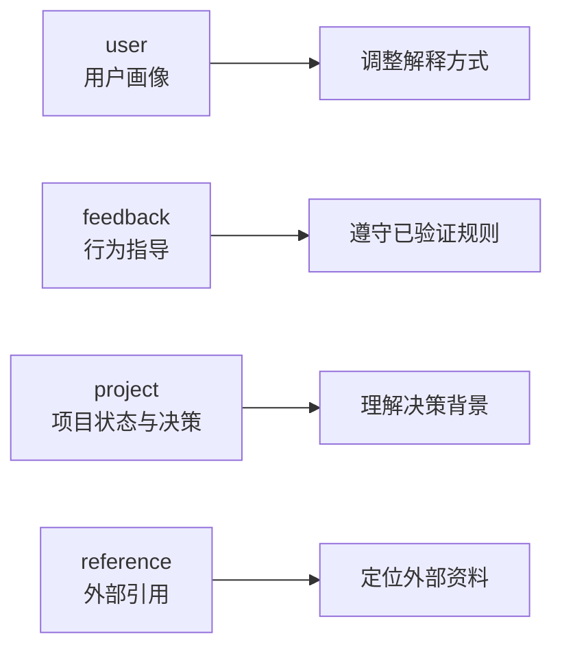

`user` 记忆适合保存用户长期画像。例如用户熟悉后端但不熟悉前端，Agent 以后解释 React 时就可以使用更贴近后端工程的类比。

`feedback` 记忆最重要。它记录用户对 Agent 行为的纠正和确认。例如“提交前必须运行 lint”“不要修改生成目录里的代码”。好的 feedback 记忆要包含规则、原因和适用方式。

`project` 记忆记录不可从代码直接推导的项目事实。例如“认证模块选择 JWT 是为了支持移动端”，这个信息解释的是为什么，而不是代码现在长什么样。

`reference` 记忆是外部系统的指针。例如 API 文档地址、监控仪表盘、工单系统项目、团队沟通频道。这些东西不一定在代码仓库里，但对完成任务很关键。

### 6.1.3 明确排除的信息

原课程明确列出了一批不应该保存为记忆的信息：

- 代码模式、惯例、架构、文件路径。
- Git 历史。
- 已经体现在代码里的调试修复步骤。
- `CLAUDE.md` 等项目文档里已经存在的信息。
- 当前对话的一次性临时任务细节。

原因很简单：这些信息可以重新获取。Agent 可以读文件、搜索代码、看 commit、打开文档。长期记忆应该存“实时拿不到或拿到成本很高”的内容。

| 信息 | 是否适合记忆 | 理由 |
|------|--------------|------|
| `src/routes` 下有哪些 API | 不适合 | 可以实时搜索代码 |
| 团队为什么放弃 Session 改用 JWT | 适合 | 决策背景不一定在代码里 |
| 上次 lint 失败的具体日志 | 通常不适合 | 临时执行结果，会过期 |
| 用户要求以后提交前运行 lint | 适合 | 行为规则会影响未来任务 |
| 某个 Grafana 仪表盘地址 | 适合 | 外部入口不在仓库里 |

甚至用户要求“记住所有文件结构”时，Agent 也应该引导用户保存更有价值的信息：哪些结构背后的原因、哪些约定不明显、哪些坑需要以后避开。

### 记忆、上下文、项目文档和代码仓库的边界

这四者很容易混在一起，可以用下面的图分清：

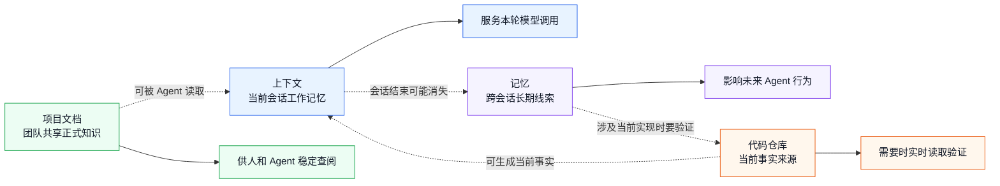

| 载体 | 保存什么 | 不适合保存什么 |
|------|----------|----------------|
| 上下文 | 当前任务需要的工作材料 | 跨会话长期规则 |
| 记忆 | 用户偏好、行为反馈、项目决策背景、外部入口 | 当前代码结构、临时日志、可实时读取事实 |
| 项目文档 | 团队正式规范、架构说明、运行手册 | 个人偏好、一次性任务状态 |
| 代码仓库 | 当前实现和配置事实 | 决策背后的隐性原因 |

读图结论：记忆不是项目文档的替代品，也不是代码仓库快照。它更像“未来协作的线索”，用到当前行动前还要回到仓库或外部系统验证。

### 6.1.4 记忆使用的最佳实践

保存记忆时，要问三个问题：

1. 未来会不会影响 Agent 的行为？
2. 这条信息能不能从代码或 Git 里直接查到？
3. 如果保存，它应该作为事实、规则、用户画像，还是外部引用？

正面例子：

| 场景 | 类型 | 推荐保存方式 |
|------|------|--------------|
| 用户说偏好 Vitest 而不是 Jest | `feedback` | 规则 + Why + 适用场景 |
| 用户说自己熟悉 Python 但不熟悉 TypeScript | `user` | 用户背景 |
| 团队决定使用事件驱动架构以降低服务耦合 | `project` | 决策 + Why |
| 生产告警看 PagerDuty 某服务 | `reference` | 外部入口和用途 |

反面例子：

| 场景 | 更好的做法 |
|------|------------|
| 记住项目文件列表 | 需要时用文件工具读取 |
| 记住 package.json 版本号 | 需要时读取当前文件 |
| 记住一次测试输出 | 除非其中有非显而易见教训，否则不保存 |
| 记住已写进 docs 的规范 | 引导用户维护项目文档 |

涉及时间时必须转换为绝对日期。记忆会跨会话保存，“下周二”“昨天”“明天”在未来都会失去稳定意义。

### 6.1.5 记忆管理的常见误区

**误区一：记忆越多越好**

过多记忆会污染索引，增加上下文负担，还会让 Agent 在低价值线索里浪费注意力。好记忆应该经得起一个测试：删除它后，Agent 的未来行为是否会明显变差？

**误区二：把记忆当项目文档**

项目文档应该进仓库，放在 `docs/`、`CLAUDE.md` 或其他稳定文档里。记忆适合保存文档没有表达的背景和用户反馈。

**误区三：不处理过期信息**

记忆没有天然永不过期的保证。尤其是涉及日期、计划、版本、负责人、外部链接的记忆，都可能失效。Agent 使用前要验证，用户也需要定期清理。

## 6.2 记忆文件格式

Claude Code 的记忆以 Markdown 文件保存，并通过索引文件提供入口。这是一种简单、可读、可调试的设计。

### 6.2.1 Frontmatter 格式

每条记忆是一个独立 Markdown 文件，文件开头使用 YAML Frontmatter 声明元数据。

基础字段包括：

| 字段 | 作用 |
|------|------|
| `name` | 记忆名称，便于识别 |
| `description` | 一行描述，用于未来判断相关性 |
| `type` | 四种记忆类型之一 |

示例：

```markdown
---
name: pre-commit-lint-requirement
description: Must run npm run lint before every commit because previous unlinted code blocked CI
type: feedback
---

**Rule**: Run `npm run lint` before every code commit.

**Why**: A previous commit with unlinted code caused CI to fail and blocked the team.

**How to apply**: Before committing code, run lint and fix any reported errors.
```

为什么使用 Markdown 文件而不是数据库？

- 人可以直接阅读和编辑。
- 可以用普通文件工具调试。
- 不需要数据库依赖。
- 迁移和备份简单。
- 和项目文档生态一致。

缺点是复杂查询能力弱。但 Agent 记忆的主要使用方式不是复杂关系查询，而是读取相关索引并按需打开文件，所以文件系统足够。

### 6.2.2 MEMORY.md 索引文件

`MEMORY.md` 是记忆入口。它不是完整记忆库，而是目录页。对话开始时，Agent 可以先看到索引，再判断哪些记忆需要进一步读取。

索引条目大致是：

```markdown
- [Title](file.md) -- 一行说明
```

原课程强调两个容量限制：

- 最多 200 行。
- 最大 25KB。

这两个限制服务于不同目标。行数限制保护阅读效率，避免索引变成长文档。字节限制保护上下文预算，避免描述过长撑爆上下文。

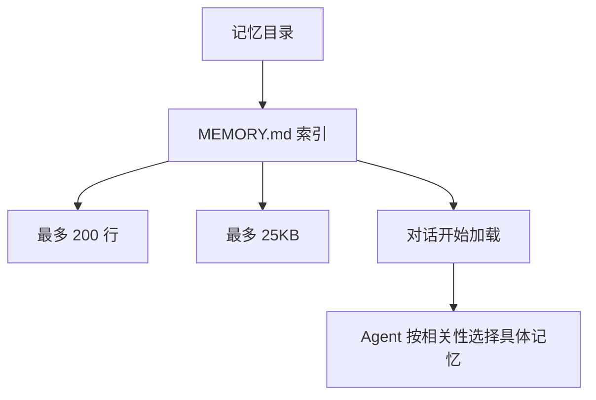

一个好的索引应该让 Agent 快速判断“是否值得打开某条记忆”，而不是把所有细节塞进目录。

### 6.2.3 记忆文件的目录结构

默认记忆目录按项目隔离，路径基于 Git 根目录生成，大致位于：

```text
~/.claude/projects/<sanitized-git-root>/memory/
```

路径解析有覆盖机制，但出于安全原因，`projectSettings` 不应该控制记忆目录。否则恶意仓库可以把记忆路径重定向到敏感目录，诱导后台 Agent 写入不该写的位置。

路径安全校验通常要拒绝：

| 风险路径 | 例子 | 防护理由 |
|----------|------|----------|
| 相对路径 | `../../secret` | 可能逃出允许目录 |
| 根路径 | `/` | 范围过大 |
| Windows 盘符根 | `C:\` | 范围过大 |
| UNC 路径 | `\\server\share` | 可能写入远程位置 |
| Null 字节 | `foo\0bar` | 可能绕过路径解析 |

这一节和第 5 章的配置安全边界直接相连：不可信项目配置不能决定安全敏感路径。

## 6.3 自动记忆提取

记忆可以由主 Agent 主动保存，也可以在对话结束后由后台 Agent 自动提取。自动提取的重点不是“把聊天总结一下”，而是从对话里找出值得跨会话保存的用户偏好、反馈、项目决策和外部引用。

### 6.3.1 基于 Fork 模式的后台提取

自动提取不是在主对话里同步完成，而是通过 Fork 模式启动后台 Agent。

这样做有几个好处：

- 不阻塞用户看到最终回复。
- 提取失败不会影响主任务结果。
- 后台 Agent 可以复用主对话的提示和上下文。
- 主对话和后台提取可以使用独立预算。

流程可以这样理解：

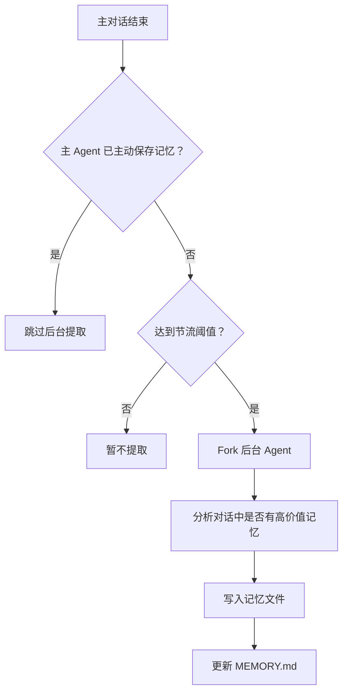

这里的“Fork”不是随便启动一个新任务，而是让后台 Agent 继承主对话的系统提示、上下文和工具定义。这样它能理解主任务发生了什么，也能利用提示缓存降低成本。

### 6.3.2 互斥机制

主 Agent 和后台 Agent 都可能写记忆。如果不做互斥，同一条信息可能被保存两次。

Claude Code 的设计是：如果主 Agent 在本次对话中已经写入记忆，后台提取就跳过。

```text
主 Agent 主动保存记忆
  -> 写入标志被设置
  -> 对话结束触发后台检查
  -> 后台 Agent 发现已有写入
  -> 跳过提取
```

这个机制避免重复保存，也保留主 Agent 的主动判断优先级。毕竟主 Agent 在对话中直接面对用户，更清楚用户明确要求保存了什么。

### 6.3.3 工具权限白名单

后台 Agent 需要读上下文、查文件、写记忆，但不应该拥有完整行动能力。原课程强调后台提取通过 `canUseTool` 这类权限回调限制工具使用。

| 工具能力 | 后台提取权限 | 原因 |
|----------|--------------|------|
| `Read` / `Grep` / `Glob` | 允许 | 需要验证上下文和相关文件 |
| `Bash` | 仅允许只读类命令 | 可以查看状态，但不能破坏环境 |
| `Edit` / `Write` | 仅限记忆目录 | 只能写记忆，不能改项目代码 |
| 网络或其他副作用工具 | 通常拒绝 | 后台任务不应扩展攻击面 |

这体现最小权限原则。后台 Agent 的职责是管理记忆，不是继续替用户改代码或访问外部系统。

### 6.3.4 节流与协调

自动提取不是每次对话都执行。短对话频繁提取，成本可能高于收益。因此系统会用计数器或功能开关控制触发频率。

还有一个尾随提取机制。假设一次提取正在运行，此时又完成了一次新对话。新对话的上下文会被暂存，等当前提取完成后，再用最新暂存上下文运行一次尾随提取。

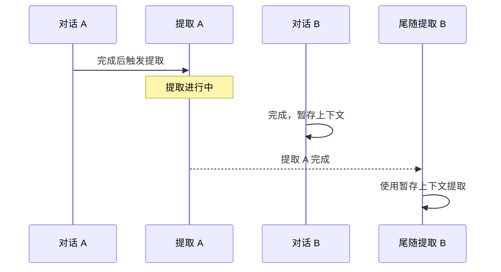

没有尾随提取时，对话 B 中的独特信息可能被错过。尾随机制保证并发期间的信息不会因为节流或正在运行的任务而丢失。

## 6.4 缓存感知的记忆架构

后台提取如果每次都重新发送完整上下文，成本会很高。Claude Code 的设计重点是让后台 Agent 尽量复用主对话的提示缓存。

### 6.4.1 提示缓存共享

LLM API 的提示缓存可以复用相同前缀的请求。主 Agent 和后台 Agent 如果共享系统提示、工具定义、上下文前缀，就更容易命中缓存。

简化成本模型：

```text
系统提示 + 工具定义 + 历史上下文很长
  -> 主 Agent 已经发送过
  -> 后台 Agent 使用相同前缀
  -> API 可复用缓存
  -> 延迟和输入成本下降
```

这就是为什么后台提取不能只从功能角度设计，还要从 API 缓存角度设计。对于频繁使用的 Agent，提示缓存命中率会直接影响成本和响应速度。

### 6.4.2 工具列表的一致性要求

工具列表是提示缓存 key 的一部分。如果后台 Agent 的工具列表和主 Agent 不同，即使系统提示和消息历史相同，也可能无法命中缓存。

因此推荐做法不是给后台 Agent 换一套工具列表，而是保持工具列表一致，再用运行时权限回调限制实际能用的工具。

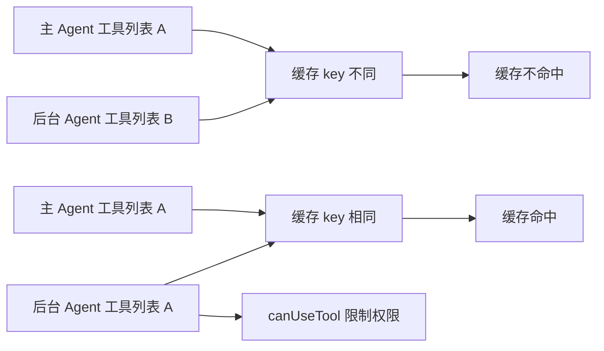

这背后的架构原则是：接口保持一致，行为通过权限变化。这样既保留缓存共享，又能限制后台 Agent 的实际能力。

### 6.4.3 记忆的生命周期

记忆是否启用由多层条件决定，例如环境变量、简单模式、远程持久化能力、settings 字段和默认值。后台提取还可能受编译时功能开关和 GrowthBook 运行时开关控制。

记忆生命周期可以分成四步：

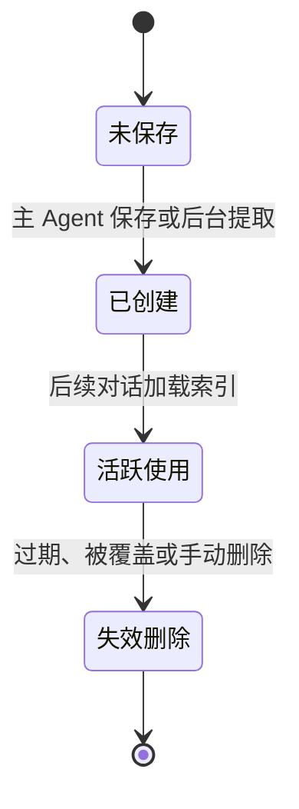

需要注意：记忆没有天然保证永远正确。它保存的是某个时间点的判断。随着项目演进，记忆可能过期。

因此记忆管理依赖两件事：

- 保存时要克制，不保存低价值内容。
- 使用时要验证，不把记忆当作当前事实。

### 6.4.4 记忆的读取与验证

原课程最重要的一句话可以改写为：

```text
记忆是线索，不是结论。
```

如果记忆说某文件存在，Agent 应该先检查文件是否仍存在。如果记忆说项目使用某依赖版本，Agent 应该读取当前 `package.json`。如果记忆说某函数负责认证，Agent 应该搜索确认。

验证规则可以这样看：

| 记忆提到什么 | 使用前怎么验证 |
|--------------|----------------|
| 文件路径 | 检查文件是否存在 |
| 函数、标志、模块名 | 搜索当前代码 |
| 依赖版本 | 读取包管理文件 |
| 外部链接 | 在需要访问时确认仍可用 |
| 决策原因 | 通常可作为背景，但涉及当前实现时仍要查代码 |

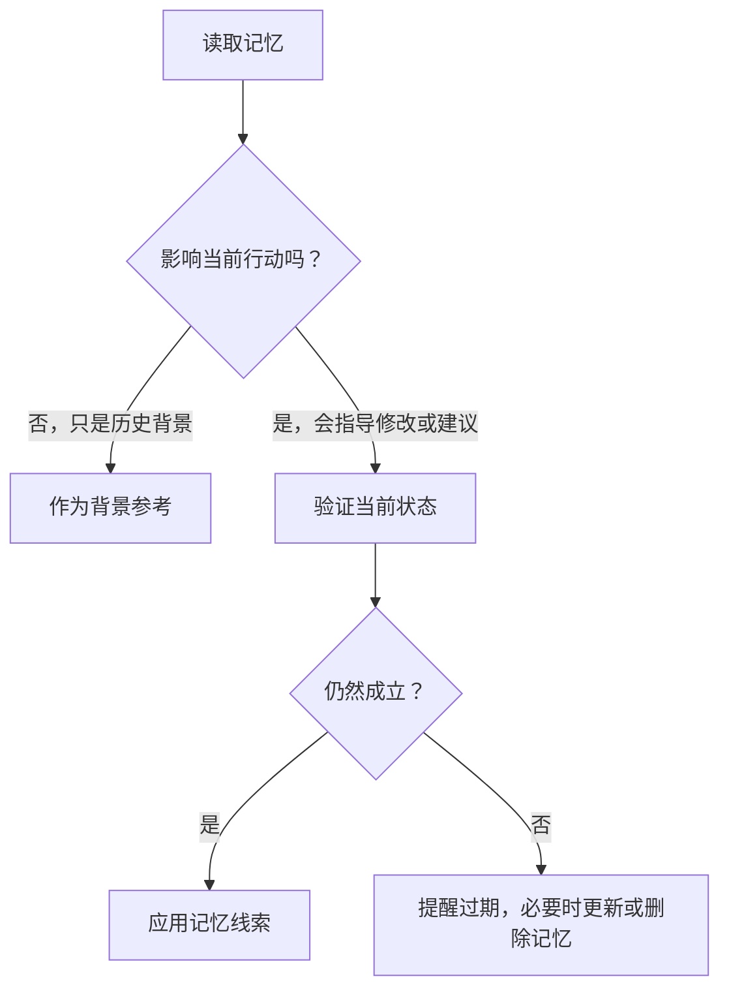

这种做法在可靠性和效率之间取平衡。完全不信任记忆会让记忆系统失去价值；完全相信记忆又会被过期信息误导。把记忆当线索，是更稳妥的中间道路。

## 6.5 关键流程图补强

### 图一：四类记忆分类图

记忆分类的核心问题不是“这句话重要吗”，而是“以后模型应该把它当成什么类型的线索”。

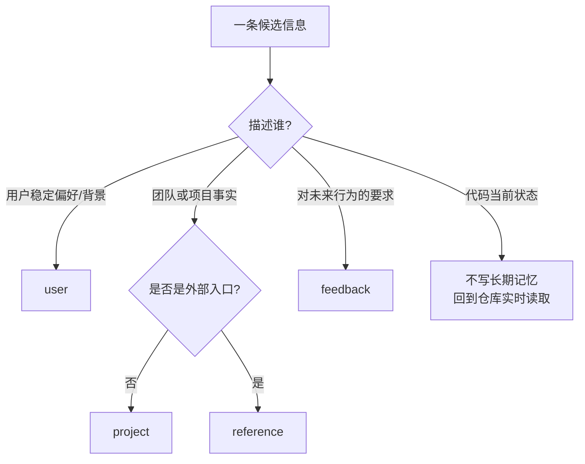

实操时优先排除：能从代码、配置、Git 或当前任务直接读到的信息，不要写进长期记忆。

### 图二：后台 Fork 记忆提取流程

自动提取记忆的价值在于“不阻塞主任务”，但它也必须受到权限和去重控制。

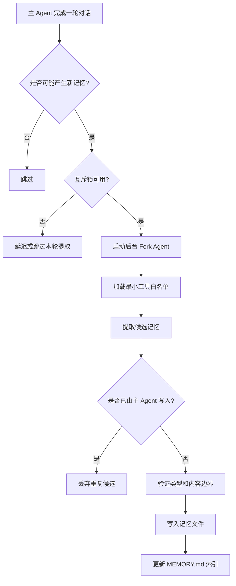

这张图也解释了为什么记忆提取和普通任务执行不同：它是后台维护行为，不应该扩大工具权限，也不应该改变用户当前任务的结果。

### 图三：记忆文件生命周期扩展图

第 6.4 节已经给出基础生命周期，这里把“索引、使用、过期处理”也放进去。

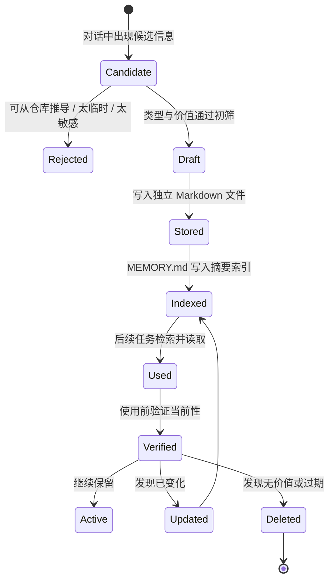

记忆不是永久真理，而是可维护的知识资产。真正成熟的记忆系统必须允许更新和删除。

### 图四：记忆注入上下文的决策图

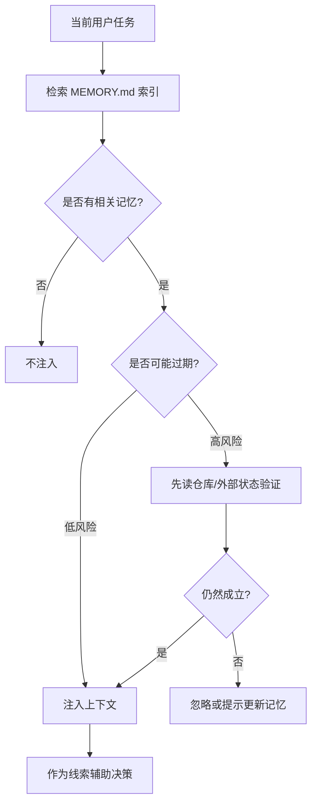

这能避免一个常见误区：记忆可以减少重复解释，但不能替代当前事实验证。

## 实战练习

### 练习 1：记忆类型分类

判断以下信息应保存为什么类型：

1. “我们团队使用 Linear 项目 BACKEND 追踪后端 Bug。”
2. “用户是初级开发者，第一次使用 TypeScript。”
3. “集成测试必须使用真实数据库，不要 mock，因为上次 mock 导致生产事故。”
4. “认证中间件重写是因为法律合规要求，不是技术债。”
5. “API 文档的 Swagger UI 在 http://localhost:3000/api-docs。”
6. “每次创建新组件时，先写测试再写实现。”

参考答案：

| 序号 | 类型 | 原因 |
|------|------|------|
| 1 | `reference` | 外部系统指针 |
| 2 | `user` | 用户画像 |
| 3 | `feedback` | 行为规则，并包含 Why |
| 4 | `project` | 项目决策背景 |
| 5 | `reference` | 外部或本地文档入口 |
| 6 | `feedback` | 未来行为指导 |

### 练习 2：Frontmatter 编写

为下面场景写一条记忆：

> 用户说：“以后每次提交代码都要先运行 `npm run lint`，上次有人提交了未 lint 的代码导致 CI 失败了一整天。”

参考答案：

```markdown
---
name: pre-commit-lint-requirement
description: Must run npm run lint before every commit because unlinted code previously blocked CI
type: feedback
---

**Rule**: Run `npm run lint` before every code commit.

**Why**: Unlinted code previously caused CI to fail for a full day and blocked the team.

**How to apply**: Before committing, run `npm run lint` and fix all reported issues.
```

延伸思考：如果一周后用户说 lint 已经集成到 pre-commit hook，不需要手动运行，应该更新还是删除这条记忆？

### 练习 3：缓存感知架构分析

假设要为后台提取 Agent 增加语义搜索记忆的能力，有两种方案：

- 方案 A：后台 Agent 使用和主 Agent 不同的工具列表，新增 `MemorySearch`。
- 方案 B：主 Agent 和后台 Agent 工具列表保持一致，通过权限回调限制搜索范围。

哪种更好？

参考答案：方案 B 更好。它保持工具列表一致，有利于提示缓存命中，同时通过运行时权限限制后台 Agent 只能访问记忆相关范围。

### 练习 4：记忆管理策略设计

你同时维护 5 个项目，每个项目都有 20-30 条记忆。设计一个策略回答：

- 如何避免跨项目记忆混淆？
- 如何处理过期记忆？
- 如何确保 `MEMORY.md` 索引不超限？

参考思路：

- 按 Git 根目录隔离项目记忆，跨项目共享的只应是稳定用户画像。
- 定期清理经不起“删除后行为是否明显变差”测试的记忆。
- 控制 `description` 长度，合并主题相近的记忆。
- 涉及日期、版本、负责人、路径的记忆使用前先验证。

## 关键要点总结

1. Claude Code 使用闭合四类型记忆：`user`、`feedback`、`project`、`reference`。闭合分类换来稳定索引和一致推理。

2. 记忆只应保存不可从代码仓库实时推导的信息。代码结构、Git 历史、当前临时任务不适合长期记忆。

3. 每条记忆是带 Frontmatter 的 Markdown 文件，`MEMORY.md` 是索引，不是完整记忆库。

4. `MEMORY.md` 有 200 行和 25KB 的双重限制，目的是让索引保持快速浏览，而不是变成文档全文。

5. 自动记忆提取通过 Fork 后台 Agent 执行，避免阻塞主对话，也让提取失败不影响用户任务。

6. 主 Agent 主动写入记忆后，后台提取会跳过，避免重复保存同一信息。

7. 后台 Agent 使用最小权限白名单：可以读取和验证，写入限制在记忆目录，不能随意修改项目。

8. 工具列表一致性是提示缓存共享的前提。差异化能力应通过运行时权限控制，而不是改变工具定义。

9. 记忆是时间点快照。使用时应把它当线索，涉及当前行动前必须验证当前状态。
