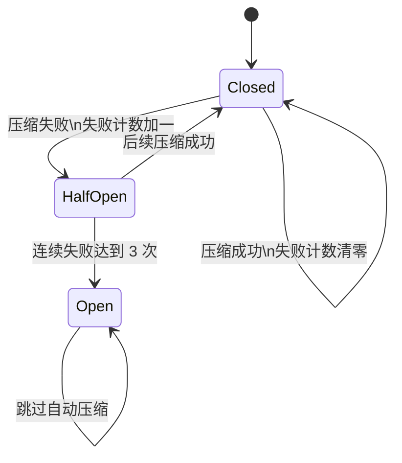
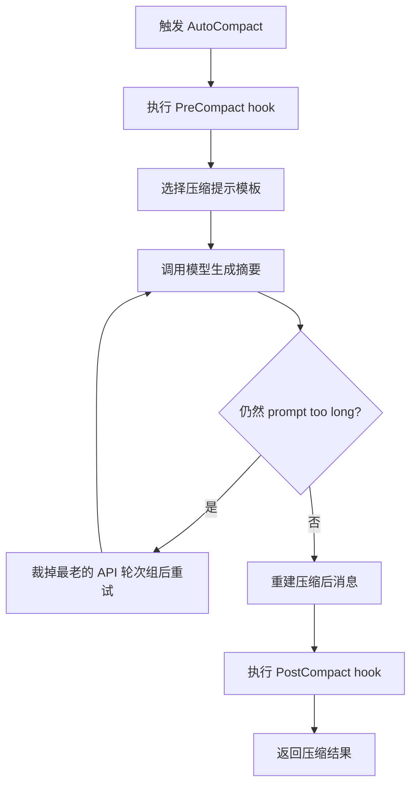
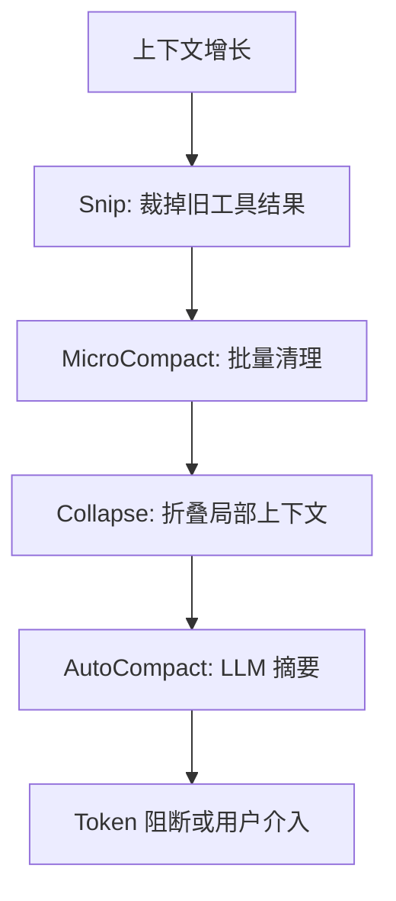

# 第 7 章：上下文管理 - Agent 的工作记忆

原课程对应：`第二部分-核心系统篇/07-上下文管理-Agent的工作记忆.md`

> 如果第 6 章的记忆系统解决“哪些信息可以跨会话保存”，本章解决“本轮模型调用到底应该看见哪些信息”。上下文管理是 Agent 的工作记忆系统：它要在有限窗口里放入目标、约束、历史、工具结果和当前环境，同时避免无关内容拖慢甚至误导模型。

## 学习目标

读完本章后，你应该能够：

- 理解上下文窗口为什么是 Agent 系统的硬约束。
- 说明有效上下文窗口如何由模型窗口和预留输出空间共同决定。
- 掌握 Snip、MicroCompact、Collapse、AutoCompact 四级压缩策略的差异。
- 理解断路器为什么能阻止自动压缩进入连续失败循环。
- 看懂压缩提示为什么采用 `<analysis>` 和 `<summary>` 的双阶段输出。
- 为长会话、多文件任务和大型重构任务设计上下文管理策略。

## 7.1 上下文窗口的约束

模型每次推理只能看到本轮请求里的内容。对 Agent 来说，这些内容不只是用户最近一句话，还包括系统提示、历史消息、工具调用、工具结果、附件、记忆、动态说明和可用工具定义。

这就是上下文管理的根本压力：任务越长，消息越多；工具越强，返回结果越大；系统越可扩展，注入内容越多。窗口一旦接近上限，继续把所有历史原样塞进去就会失败。

一个容易理解的类比是：上下文窗口像一张有限大小的工作台。当前目标、正在看的文件、刚做出的决定必须放在桌面上；旧日志、重复输出、已经验证完的中间材料可以收进抽屉或贴成摘要。工作台不是越满越好，真正重要的是让模型下一步需要的材料在正确位置。

### 有效窗口公式

模型标称上下文窗口并不等于可放历史消息的空间，因为模型还需要输出空间。Claude Code 会先为输出预留一部分 token，再把剩余部分当成本轮可承载上下文的有效空间。

```text
有效上下文窗口 = 模型上下文窗口 - 预留输出 token
```

原课程提到的关键实现思想是：预留空间取“模型最大输出 token”和 `20,000` 中较小的那个值。这样做的目的不是保守，而是避免压缩本身失败。

例如模型窗口是 `200,000` token，最大输出是 `16,384` token：

| 项目 | 数值 |
|------|------|
| 模型窗口 | 200,000 |
| 预留输出 | min(16,384, 20,000) = 16,384 |
| 有效上下文窗口 | 183,616 |

这里真正能放对话历史、工具结果和附件的空间是 `183,616`，不是 `200,000`。如果忽略输出预留，最糟糕的情况是：系统发现上下文太大，想调用模型生成摘要，但连摘要输出空间都没有。

### 缓冲区与阈值

Claude Code 不会等窗口完全耗尽才处理，而是围绕有效窗口设置多级阈值。可以把它看成一条逐步收紧的安全线：


几个缓冲常量共同决定这些区域：

| 缓冲区 | 大致作用 | 易学解释 |
|--------|----------|----------|
| `WARNING_THRESHOLD_BUFFER_TOKENS` | 提前发出警告 | 告诉用户“工作台快满了” |
| `ERROR_THRESHOLD_BUFFER_TOKENS` | 标记危险区域 | 说明继续堆内容已经高风险 |
| `AUTOCOMPACT_BUFFER_TOKENS` | 自动压缩余量 | 在彻底满之前启动摘要 |
| `MANUAL_COMPACT_BUFFER_TOKENS` | 手动压缩最低余量 | 保证用户主动压缩还能完成 |

这里的核心思想是“提前处置”。上下文管理不能只做最后一刻的错误处理。真正稳定的 Agent 会在危险到来前就提醒、压缩或阻断。

### 断路器设计

自动压缩不是必然成功的。API 可能失败，摘要可能过长，输入结构可能仍然超过限制。如果系统在每一轮都盲目重试，就会出现这样的循环：

```text
上下文过大
  -> 自动压缩
  -> 压缩失败
  -> 下一轮仍然过大
  -> 再次自动压缩
  -> 再次失败
```

Claude Code 为此引入断路器。连续自动压缩失败达到阈值后，系统会停止继续尝试同一类自动压缩，避免把每一轮都变成无效 API 调用。



断路器背后的工程判断是：失败有时不是偶发，而是状态本身已经坏了。继续重试不会修复状态，只会浪费调用、增加延迟，还可能让用户以为 Agent 卡住。

## 7.2 四级压缩策略

Claude Code 的上下文压缩不是单一动作，而是一套从轻到重的渐进策略：

```text
Snip
  -> MicroCompact
  -> Collapse
  -> AutoCompact
```

越靠前，成本越低，信息损失越小；越靠后，释放空间越强，但更依赖模型摘要，也更可能丢失细节。

| 级别 | 是否调用 LLM | 主要处理对象 | 适合场景 |
|------|--------------|--------------|----------|
| Snip | 否 | 指定旧工具结果 | 用户明确知道哪些内容不再需要 |
| MicroCompact | 否 | 过期缓存后的旧工具结果 | 长会话暂停后恢复、旧结果太多 |
| Collapse | 部分依赖 | 消息组和上下文结构 | 高压状态下主动重构上下文 |
| AutoCompact | 是 | 整段对话历史 | 前面策略不够时的兜底摘要 |

### Level 1: Snip（裁剪）

Snip 是最轻量的压缩。它不让模型重新总结，而是把旧工具结果替换成简短占位文本，例如“旧工具结果已清理”。

为什么不是直接删除消息？因为 Agent 的消息链里常有工具调用 ID、工具结果 ID、前后引用关系。直接删除可能破坏对话结构，让后续消息无法解释“这个结果从哪里来”。占位文本则保留了结构，只清掉大块内容。

Snip 适合用户已经判断完的材料。例如 Agent 刚读了十几个文件，完成分析后这些完整文件内容不再需要逐字保留，就可以 Snip 掉旧读取结果，把空间留给当前修改方案和测试结果。

### Level 2: MicroCompact（微压缩）

MicroCompact 也是低成本策略。它的重点不是语义摘要，而是在合适时间批量清理旧工具结果。

原课程强调它和提示缓存有关。连续请求如果前缀稳定，服务端缓存可以降低成本和延迟；但用户暂停太久后，缓存可能过期。既然过期后本来就要重发上下文，继续携带大量旧工具结果就没有收益。此时 MicroCompact 会保留最近若干个结果，把更早的工具结果替换成占位。

| 维度 | MicroCompact 的做法 |
|------|----------------------|
| 触发依据 | 距离上次助手消息的时间超过阈值 |
| 保留原则 | 至少保留最近一部分工具结果 |
| 压缩成本 | 不调用 LLM，主要是结构化替换 |
| 风险 | 旧结果的原文细节会丢失 |
| 收益 | 降低后续请求体积，减少缓存过期后的重写负担 |

这里的取舍很现实：旧工具结果如果已经不能享受缓存，又很少被精确引用，就应该尽快从工作记忆里移走。

### Level 3: Collapse（折叠）

Collapse 是更主动的上下文重构。它不只是清理旧工具输出，而是在上下文压力上升时，把部分上下文折叠成更紧凑的表示。

可以把 Snip 和 MicroCompact 看作“清理杂物”，而 Collapse 更像“重新整理桌面布局”：哪些消息组合在一起，哪些信息改成摘要，哪些 spawn 或子任务不能再继续扩张，都属于它的考虑范围。

原课程提到 Collapse 和 AutoCompact 在触发点上会有竞争，因此 Collapse 启用时会抑制部分自动压缩路径。原因是二者定位不同：AutoCompact 是最后兜底，Collapse 则希望在真正溢出前主动整理。

| 对比项 | Collapse | AutoCompact |
|--------|----------|-------------|
| 工作方式 | 主动重构上下文 | 调用模型生成会话摘要 |
| 触发阶段 | 接近高水位时提前介入 | 上下文压力更高时兜底 |
| 信息保留 | 尽量保留局部结构 | 依赖摘要表达历史 |
| 与子任务关系 | 可限制新的 spawn | 主要处理当前会话历史 |

### Level 4: AutoCompact（自动压缩）

AutoCompact 是最重的压缩手段。当前面几级释放空间仍不够时，系统调用 LLM 对对话历史生成摘要，然后用“压缩边界 + 摘要 + 必要附件 + 保留消息”的方式重建上下文。

典型流程如下：



这个流程里有几个关键点。

第一，压缩前后都有 hook。`PreCompact` 可以注入压缩指令，例如“重点保留数据库 schema 决策”；`PostCompact` 可以检查摘要质量或记录压缩结果。

第二，压缩不是把摘要孤零零放进上下文，而是构造一个清晰的新消息序列。原课程提到的顺序是：压缩边界、摘要消息、保留消息、附件、hook 结果。稳定顺序对调试、回放和后续压缩都很重要。

第三，如果压缩提示本身仍然太长，系统会裁掉最老的 API 轮次组并重试，但重试次数有限。无限裁剪会让摘要失去意义，也会拖垮请求链路。

## 7.3 压缩提示工程

压缩质量不只取决于“调用了更强的模型”，更取决于提示如何定义摘要任务。一个差的压缩提示会把重要决策抹掉，只留下泛泛的“用户正在修改项目”。这样的摘要虽然短，但对下一轮工作几乎没有帮助。

好的压缩提示要回答三件事：

1. 摘要覆盖哪些消息范围。
2. 哪些信息必须保留。
3. 输出格式如何约束，方便后续重新注入上下文。

### 压缩专用提示模板

原课程把压缩提示分成三类模板：

| 模板 | 摘要范围 | 适用场景 |
|------|----------|----------|
| `BASE_COMPACT_PROMPT` | 从会话开始到当前 | 普通全量压缩 |
| `PARTIAL_COMPACT_PROMPT` | 从指定位置到当前 | 前面已经压缩过，只压缩后续新增内容 |
| `PARTIAL_COMPACT_UP_TO_PROMPT` | 从开始到指定位置 | 保留最近完整消息，只压缩更早部分 |

这三种模板解决的是“压缩范围”问题。长会话可能已经经历过多次压缩，如果每次都从头摘要，会重复处理已压缩内容；如果只摘要最近部分，又可能丢失旧摘要和新消息之间的关系。模板区分范围后，系统就能更精细地组合上下文。

压缩提示还有一个重要限制：摘要模型不应该调用工具。压缩是整理已有对话，不是执行新任务。如果压缩过程中又读文件、跑命令、触发工具，就会把“重写历史”变成“产生新历史”，让状态变复杂。

### 双阶段输出结构

原课程强调压缩输出分成两个 XML 块：

| 块 | 作用 | 是否进入最终上下文 |
|----|------|--------------------|
| `<analysis>` | 让模型先梳理对话结构、目标、决策和风险 | 否 |
| `<summary>` | 形成正式摘要，供后续会话继续使用 | 是 |

这是一种很实用的提示工程模式：允许模型先整理思路，但不把整理过程长期塞进上下文。最终上下文只需要结果，不需要草稿。

```text
模型原始压缩输出
  -> 丢弃 analysis 草稿
  -> 提取 summary 正文
  -> 作为压缩摘要消息注入后续上下文
```

正式摘要通常要覆盖目标、当前进度、关键决策、文件变更、待办事项、错误和约束等内容。重点不是写得漂亮，而是让下一轮 Agent 能接着工作。

### CompactBoundaryMessage 压缩边界标记

压缩完成后，系统会插入 `CompactBoundaryMessage`。它不是给用户看的普通文本，而是消息链里的边界标记。

它至少承担三件事：

- 标记“这里之前的内容已经被摘要替代”。
- 记录压缩类型、压缩前 token、涉及消息数量等元数据。
- 通过逻辑父节点把压缩前后的消息链连接起来。

没有边界标记，后续系统很难判断哪些消息已经被压缩过，可能重复摘要、重复注入，或在调试时无法解释上下文为什么变短。

## 7.4 令牌预算追踪

上下文管理不是等到失败才处理。Claude Code 会持续计算 token 使用状态，并把结果传给 UI、压缩模块和阻断逻辑。

### 多级警告状态

令牌状态可以看成几个布尔信号：

| 状态 | 含义 | 系统行为 |
|------|------|----------|
| `isAboveWarningThreshold` | 已进入预警区 | UI 提醒用户上下文偏高 |
| `isAboveErrorThreshold` | 已进入危险区 | 更强烈地提示需要压缩 |
| `isAboveAutoCompactThreshold` | 达到自动压缩线 | 尝试 AutoCompact 或相关压缩路径 |
| `isAtBlockingLimit` | 接近硬限制 | 阻止继续发送新请求 |

这些信号让系统可以分层反应：先提醒，再压缩，最后阻断。阻断不是失败主义，而是避免把一个必然超限的请求发给 API。

### 压缩后的令牌预算

压缩不是越狠越好，也不是压完后把所有东西再加载回来。原课程列出了一组压缩后恢复预算，例如最多恢复的文件数量、总 token 预算、每个文件 token 上限、技能内容预算等。

| 预算项 | 作用 |
|--------|------|
| 最多恢复文件数 | 防止一次性把所有旧文件重新塞回上下文 |
| 总恢复预算 | 控制压缩后上下文不会立刻再次爆掉 |
| 每文件上限 | 防止单个大文件吞掉全部空间 |
| 技能预算 | 限制技能说明等动态能力注入的体积 |

这解释了一个常见问题：为什么压缩后 Agent 有时需要重新读取某个文件？因为压缩不是完整备份，它只保留继续任务需要的摘要和少量恢复内容。真正需要精确细节时，应重新读取当前相关文件，而不是期待摘要保存所有行。

### 真实令牌估算

压缩完成后，系统还会估算压缩后上下文的真实 token 数。这个估算不只看摘要本身，还包括边界标记、附件、hook 结果和保留消息。

如果压缩后的 token 仍然很高，说明压缩效果不足。可能原因包括：

- 摘要太长。
- 附件恢复太多。
- 系统提示和工具定义本身占用过大。
- 会话结构复杂，无法通过一次摘要明显变短。

这个指标对遥测和调试很有用。它能帮助开发者区分“压缩没有执行”和“压缩执行了但收益不够”。

## 7.5 长对话的上下文管理策略

理解机制之后，更重要的是知道如何使用它。长任务不是靠一个无限窗口完成的，而是靠阶段边界、主动压缩和精确召回完成的。

### 策略一：主动压缩优于被动压缩

被动压缩通常发生在上下文快满时。那时系统只能尽力保命，很难知道用户最关心哪些细节。

主动压缩则发生在阶段结束时。例如你刚完成需求调研，可以手动压缩并明确说明“保留接口约束、数据库字段和未决问题”。这样摘要会更接近下一阶段需要的材料。

```text
不推荐：
持续工作到窗口接近上限 -> 自动压缩 -> 可能丢失关键细节

推荐：
阶段完成 -> 手动压缩并说明保留重点 -> 进入下一阶段
```

### 策略二：分阶段工作

大型任务最好拆成阶段：

| 阶段 | 主要上下文 | 阶段结束动作 |
|------|------------|--------------|
| 研究阶段 | 文件结构、关键代码、现有行为 | 压缩成问题地图和约束清单 |
| 规划阶段 | 方案、取舍、风险、任务拆分 | 压缩成执行计划和验收标准 |
| 实施阶段 | 正在修改的文件、测试结果、错误信息 | 保留当前 diff 和未解决问题 |
| 验证阶段 | 测试命令、失败日志、修复记录 | 总结最终状态和残余风险 |

分阶段的好处是：每次压缩都有明确目标，而不是让模型在一堆混杂历史中猜什么重要。

### 策略三：利用记忆系统补充上下文

记忆系统不是上下文管理的替代品，而是补充来源。长期稳定的信息适合进入记忆，例如项目约定、用户偏好、架构决策；临时日志和工具输出适合留在当前上下文或被压缩。

二者关系可以这样理解：

```text
记忆：长期保存，按需召回
上下文：本轮可见，直接影响模型输出
压缩：把当前上下文整理成可继续工作的短状态
```

因此，重要且稳定的信息不要只依赖压缩摘要。需要跨会话复用的内容，应该进入记忆或项目文档。

### 多文件项目的上下文策略

多文件项目最容易把上下文耗尽，因为 Read、Grep、测试日志和 diff 都会占空间。

| 场景 | 推荐策略 |
|------|----------|
| 一次读取很多文件 | 分批阅读，读完即整理结论，旧结果可 Snip |
| 大量搜索结果 | 保留命中模式和关键文件，不保留所有输出 |
| 长测试日志 | 保留失败用例、错误栈和复现命令，裁掉重复日志 |
| 跨模块重构 | 先建立模块地图，再逐模块实施和压缩 |
| 多天持续任务 | 阶段性写入项目文档或记忆，降低单会话负担 |

判断信息是否该留在上下文，可以问三个问题：

1. 下一轮模型是否马上需要它？
2. 它是否包含不可从文件重新获得的决策或约束？
3. 它是否比摘要更适合保留原文？

如果三个答案都是否，就应该压缩、裁剪或移出上下文。

## 实战练习

**练习 1：令牌预算计算器**

假设模型窗口是 `200,000` token，最大输出是 `16,384` token。请计算有效上下文窗口，并说明为什么不能把全部 `200,000` token 都用于历史消息。

进阶：如果系统提示、工具定义和固定说明已经占用 `50,000` token，真正留给对话历史和工具结果的空间还剩多少？

**练习 2：选择压缩策略**

为下面三个场景选择合适的压缩策略组合：

- 代码审查会话，读取了大量文件但只需要保留问题清单。
- 教学会话，需要保留早期对话中的精确解释。
- 自动化修复任务，工具结果很多，但当前只关心最后一次测试失败。

说明你会用 Snip、MicroCompact、Collapse 还是 AutoCompact，以及为什么。

**练习 3：设计 PreCompact 指令**

为一个后端重构任务写一段 PreCompact 指令，要求摘要重点保留：

- 已确认的接口兼容性要求。
- 修改过的文件和原因。
- 仍未解决的测试失败。
- 用户明确禁止修改的边界。

**练习 4：断路器推演**

连续发生以下事件：压缩成功、压缩失败、压缩失败、压缩失败、下一轮继续请求。请写出每一步失败计数如何变化，并判断下一轮是否应该继续自动压缩。

**练习 5：多文件上下文整理**

选一个真实项目，假设 Agent 已经读取 12 个文件、运行 3 次测试、修改 4 个文件。请设计一张上下文保留表：哪些必须保留原文，哪些只保留摘要，哪些可以清理。

## 关键要点

1. 上下文窗口是 Agent 的硬约束。模型只能基于本轮请求中的内容推理。
2. 有效窗口要扣除预留输出空间，否则压缩和回答本身都可能没有足够 token。
3. Claude Code 采用四级渐进压缩：Snip、MicroCompact、Collapse、AutoCompact。
4. 轻量压缩优先处理旧工具结果，重型压缩才调用 LLM 生成摘要。
5. 断路器用于阻止连续自动压缩失败造成的 API 调用浪费和延迟放大。
6. 压缩提示采用双阶段结构：让模型先分析，再只保留正式摘要。
7. `CompactBoundaryMessage` 让系统知道压缩边界，避免重复处理历史。
8. 压缩后仍要控制恢复预算，不能把所有旧附件和文件再次塞回上下文。
9. 长任务应按阶段工作，在关键节点主动压缩，并把稳定知识沉淀到记忆或文档中。

## 7.6 关键流程图补强

### 图 1：上下文预算公式

```text
有效上下文 =
  模型上下文窗口
  - 最大输出预留
  - 系统提示
  - 工具定义
  - 固定运行时说明
```

不要把模型窗口误解成“历史消息可用空间”。输出预留和固定提示都会先占掉预算。

### 图 2：四级压缩阶梯



### 图 3：AutoCompact 触发流程

```text
检测 token 超阈值
  -> 轻量压缩是否足够
  -> 不足则构造压缩提示
  -> 模型生成摘要
  -> 插入 CompactBoundaryMessage
  -> 继续下一轮
```

### 图 4：长任务分阶段上下文管理


长任务最怕把所有细节塞在一个上下文里。分阶段工作能让每一轮模型只看当前最相关的信息。
