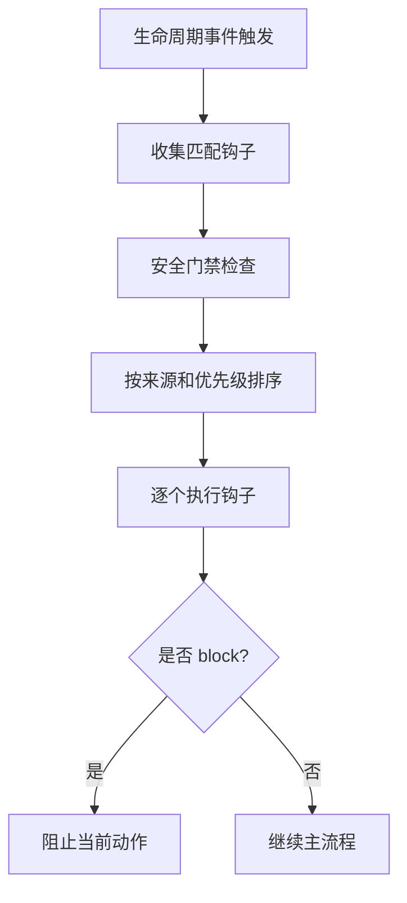
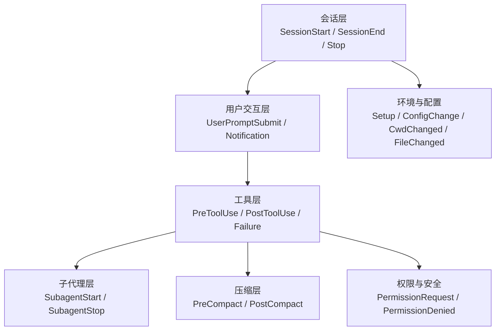
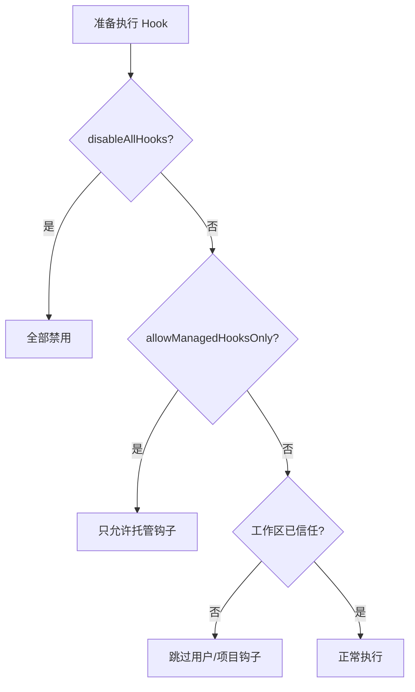

# 第 8 章：钩子系统 - Agent 的生命周期扩展点

原课程对应：`第二部分-核心系统篇/08-钩子系统-Agent的生命周期扩展点.md`

> 权限管线决定 Agent 的动作能不能执行，钩子系统决定 Agent 在关键生命周期节点还能额外挂接哪些行为。它让用户、项目和企业策略可以在不改主循环源码的情况下，观察、拦截、修改和增强 Agent 的运行过程。

## 学习目标

读完本章后，你应该能够：

- 区分 Command、Prompt、Agent、HTTP、Function 五种钩子类型。
- 说明同步钩子、异步钩子和异步唤醒钩子的执行差异。
- 掌握 26 个生命周期事件的大致分组和触发时机。
- 理解 `decision`、`updatedInput`、`additionalContext`、`continue` 等响应字段的作用。
- 理解钩子配置如何通过 schema、优先级和工作区信任检查保证安全。
- 设计轻量、可维护、可审计的钩子配置，避免常见反模式。

## 8.1 钩子类型与执行模型

钩子是 Agent 生命周期上的扩展点。主循环走到某个关键节点时，系统发出一个事件；所有匹配这个事件的钩子按规则执行；钩子可以记录日志、注入上下文、修改输入，甚至阻止动作继续。

可以把钩子系统看成主循环旁边的一组检查站：



这个设计的价值是解耦。主循环不需要知道每个团队的审计脚本、审批服务或项目约束，只需要在稳定节点发出事件，并理解钩子的结构化返回。

### 五种钩子类型

原课程把钩子分成五类，其中前四类可以写入配置，Function 钩子只存在于运行时。

| 类型 | 执行方式 | 是否可持久化 | 适合场景 |
|------|----------|--------------|----------|
| Command | 执行 Shell 命令 | 是 | 本地脚本、安全检查、审计日志 |
| Prompt | 调用 LLM 做判断 | 是 | 需要语义理解的轻量审批 |
| Agent | 启动更完整的 Agentic 验证 | 是 | 多步检查，例如跑测试并分析结果 |
| HTTP | 向外部服务发送请求 | 是 | 企业审批、CI、审计平台集成 |
| Function | TypeScript 回调 | 否 | SDK 嵌入、运行时动态控制 |

**Command 钩子**最直接。它适合做规则明确、能用脚本完成的事情，例如检查 Bash 命令是否包含危险模式，或者把工具调用记录到本地日志。

**Prompt 钩子**适合语义判断。例如“这次写文件是否修改了核心模块”，这种问题用正则可能很脆弱，但让模型看上下文判断会更自然。不过它会增加模型调用成本和延迟。

**Agent 钩子**适合多步验证。例如代码改完后，不只是看 diff，还要运行测试、分析失败、判断是否可以继续。这类钩子能力强，但不能放在高频路径上随便触发。

**HTTP 钩子**把生命周期事件接到外部系统。企业环境常用它做审计、审批、通知或合规流水线。它要特别注意环境变量白名单，不能把凭证随意暴露给外部请求。

**Function 钩子**是运行时回调。它不适合写进 JSON 配置，因为函数引用不能安全序列化，也不应该让配置文件直接携带任意内存代码。

### 同步 vs 异步钩子

Command 钩子支持三种执行模式：

| 模式 | 是否阻塞主流程 | 结果是否影响当前动作 | 适合场景 |
|------|----------------|----------------------|----------|
| 同步 | 是 | 是 | 执行前审批、输入修正、风险拦截 |
| `async` | 否 | 通常否 | 日志上报、通知、后台审计 |
| `asyncRewake` | 否 | 异常时可唤醒模型 | 后台监控、任务完成后发现问题再介入 |

```text
同步模式：
动作准备执行 -> Hook 运行 -> 根据 Hook 结果继续或阻止

异步模式：
动作准备执行 -> Hook 后台运行
             -> 主流程立即继续

异步唤醒：
主流程继续 -> Hook 后台运行
           -> 退出码 2 时注入消息，让模型继续处理
```

同步模式最安全，但会增加等待时间。异步模式不打断用户体验，但不适合做必须在执行前完成的审批。异步唤醒介于两者之间：平时不干扰，只有检测到需要模型处理的问题时才把它唤醒。

## 8.2 核心生命周期事件

Claude Code 的 Hook 事件覆盖工具、用户输入、会话、子代理、压缩、权限、安全和环境变化等关键节点。原课程提到完整事件数组有 26 个事件，学习时不必死记名称，而要理解它们分别属于哪一层。



### 工具调用生命周期

工具调用是钩子最常见的使用点，核心事件有三个：

| 事件 | 触发时机 | 能做什么 |
|------|----------|----------|
| `PreToolUse` | 工具执行前 | 拦截、审批、修改输入 |
| `PostToolUse` | 工具成功后 | 审计、通知、后处理输出 |
| `PostToolUseFailure` | 工具失败后 | 上报错误、生成诊断、提示替代方案 |

`PreToolUse` 是最强的拦截点。它可以返回 `decision: "block"` 阻止工具执行，也可以通过 `updatedInput` 修改工具参数。它和权限管线的关系是：权限管线先判断动作是否允许，PreToolUse 再做更贴近业务或项目的二次检查。

`PostToolUse` 发生在工具已经成功执行之后。它适合做审计、异步上报和结果增强，不适合再做“是否应该执行”的判断。某些 MCP 工具输出还可以在这里被后处理或脱敏。

`PostToolUseFailure` 专门处理失败现场。它拿到错误类型、中断状态、超时状态等信息，适合接入监控或生成重试建议。

### 用户交互生命周期

`UserPromptSubmit` 在用户提交消息之后、模型处理之前触发。它站在用户意图和模型理解之间，可以阻止输入，也可以注入额外上下文。

常见用途包括：

- 检查用户输入是否包含敏感信息。
- 根据用户问题追加项目文档、当前分支、最近提交等背景。
- 把过短的用户请求补成更完整的任务上下文。
- 在配额、策略或合规条件不满足时阻止继续处理。

`Notification` 在系统发通知时触发，例如权限提示、空闲提醒、认证成功等。它适合接 Slack、Teams、邮件或企业通知系统。

### 会话生命周期

会话事件描述 Agent 从启动到结束的过程。

| 事件 | 触发时机 | 典型用途 |
|------|----------|----------|
| `SessionStart` | 新启动、恢复、清空、压缩后重启 | 注入环境信息、加载项目上下文 |
| `SessionEnd` | 清空、退出、登出等结束原因 | 清理临时资源、保存摘要、上报统计 |
| `Stop` | 助手准备结束响应前 | 检查任务是否完成，必要时强制继续 |
| `StopFailure` | 因 API 错误结束 | 错误上报和诊断日志 |

`SessionStart` 的阻塞错误通常会被忽略，这是优雅降级：一个写错的启动钩子不应该让整个 Agent 无法启动。

`SessionEnd` 通常有很短的超时限制，因为它处在关闭流程里。这里应该做轻量清理，不应该等待慢任务。

`Stop` 很有价值。模型可能以为自己完成了任务，但其实还有测试未跑、文件未改或 TODO 未处理。Stop 钩子可以检查输出或工作区状态，发现问题时用退出码 2 把信息注入模型，让它继续工作。

### 子代理生命周期

`SubagentStart` 和 `SubagentStop` 围绕子代理运行触发。输入通常包含子代理 ID、类型等信息。

子代理是上下文管理和多 Agent 编排的重要工具。主 Agent 可以把独立子任务交给子代理，子代理在自己的上下文中完成工作，再把结果交回主 Agent。

钩子在这里的用途包括：

- 记录哪些任务被委派给子代理。
- 给子代理注入资源限制或项目约束。
- 在子代理结束时检查结果质量。
- 对长时间运行的子代理做超时和审计。

### 压缩生命周期

压缩事件包括 `PreCompact` 和 `PostCompact`。

`PreCompact` 在压缩前触发。它的 stdout 可以作为额外压缩指令加入压缩提示，例如“保留所有数据库迁移决策”和“不要丢失用户明确禁止修改的路径”。如果返回阻止信号，也可以阻止本次压缩。

`PostCompact` 在压缩完成后触发。它适合记录压缩前后 token 变化、检查摘要质量，或把摘要结果写入审计系统。

这两个事件说明：上下文压缩不是黑箱。项目可以定义“什么信息重要”，从而影响摘要保留重点。

### 权限与安全事件

`PermissionRequest` 在权限请求出现时触发。它可以自动给出允许或拒绝决策，减少用户反复确认。它处在权限管线和用户交互之间，适合表达企业策略或项目级审批规则。

`PermissionDenied` 在自动模式分类器拒绝工具调用时触发。它通常不用于硬拦截，而是提供替代建议。例如某个 Bash 命令被拒绝后，钩子可以提示模型改用只读搜索工具。

### 其他事件

其他事件覆盖初始化、配置和环境变化：

| 事件 | 作用 |
|------|------|
| `Setup` | 仓库初始化、环境准备、维护动作 |
| `ConfigChange` | 配置文件变更审计，可阻止危险配置生效 |
| `Elicitation` / `ElicitationResult` | MCP 服务器请求用户输入及其结果 |
| `CwdChanged` | 工作目录变化通知 |
| `FileChanged` | 文件变化通知 |
| `InstructionsLoaded` | 指令文件加载审计，仅观察 |

原课程统计有 26 个生命周期事件。按功能归类后，可以形成这张速查表：

| 分组 | 事件 | 主要控制能力 |
|------|------|--------------|
| 工具 | `PreToolUse`、`PostToolUse`、`PostToolUseFailure` | 执行前拦截、执行后处理、失败诊断 |
| 用户 | `UserPromptSubmit`、`Notification` | 输入控制、通知集成 |
| 会话 | `SessionStart`、`SessionEnd`、`Stop`、`StopFailure` | 初始化、结束、强制继续、错误处理 |
| 子代理 | `SubagentStart`、`SubagentStop` | 子任务监控和结果验证 |
| 压缩 | `PreCompact`、`PostCompact` | 自定义压缩和摘要审计 |
| 权限 | `PermissionRequest`、`PermissionDenied` | 自动审批和拒绝后的引导 |
| 环境/配置/MCP | `Setup`、`ConfigChange`、`Elicitation`、`ElicitationResult`、`CwdChanged`、`FileChanged`、`InstructionsLoaded` | 初始化、配置安全、外部协议和环境变化 |

## 8.3 钩子响应协议

钩子输出不是普通日志。高级钩子需要用结构化 JSON 表达“允许、阻止、修改、注入、继续还是停止”。这套协议让外部脚本能精确影响 Agent 行为。

### 响应协议全景图

钩子响应大致分成两条通道：

| 通道 | 内容 | 作用 |
|------|------|------|
| 结构化 JSON | `decision`、`reason`、`hookSpecificOutput` 等 | 控制 Agent 行为 |
| stdout/stderr | 普通文本、错误信息 | 展示给用户或注入给模型 |

常见 JSON 字段如下：

```json
{
  "decision": "approve",
  "reason": "optional reason",
  "additionalContext": "extra context for the model",
  "continue": true,
  "stopReason": "optional stop reason",
  "hookSpecificOutput": {
    "hookEventName": "PreToolUse"
  }
}
```

### 顶层决策字段

`decision` 是最直接的控制字段：

| 值 | 含义 |
|----|------|
| `approve` | 明确允许继续 |
| `block` | 阻止当前动作，通常配合 `reason` |
| 缺省 | 默认继续，但仍受退出码语义影响 |

默认继续是一个重要设计。钩子配置或脚本出现非关键格式问题时，系统不应该轻易让主流程停摆。但如果钩子明确返回 `block`，则必须尊重这个决定。

### hookSpecificOutput 事件特定输出

不同事件有不同的专用输出。`hookSpecificOutput` 用 `hookEventName` 标识它针对哪个事件。

`PreToolUse` 常用字段：

| 字段 | 作用 |
|------|------|
| `permissionDecision` | 覆盖或补充权限决策，例如 allow、deny、ask |
| `permissionDecisionReason` | 解释权限判断原因 |
| `updatedInput` | 修改即将传给工具的输入 |

`updatedInput` 能力很强，也很危险。它适合做透明的安全增强，例如给某些命令追加 `--dry-run`，或把路径规范化。它不适合悄悄改变操作语义，例如把用户要写的文件改到另一个目录。

`UserPromptSubmit` 常用字段是 `additionalContext`。它不改写用户原始输入，而是在旁边追加背景信息。

### additionalContext：注入额外上下文

`additionalContext` 可以把钩子产生的信息加入模型上下文。它适合动态信息，而不是静态配置。

典型例子：

- `SessionStart` 注入当前项目名、分支、运行环境。
- `UserPromptSubmit` 根据用户问题追加相关文档片段。
- `PostToolUse` 对工具结果补充解释或注意事项。
- `Setup` 注入初始化检测结果。

它和配置里的静态指令不同：静态指令在启动时确定，`additionalContext` 每次钩子执行时都可以根据当前状态生成。

### continue 字段

`continue` 用于控制助手是否继续响应。设为 `false` 时，助手停止生成；`stopReason` 可以说明原因。

在 Stop 类事件里，这个字段尤其有用。比如钩子发现模型已经偏离任务，或者已经达到某个输出边界，就可以要求停止。反过来，如果需要模型继续处理未完成事项，可以通过事件退出码和错误信息让模型重新进入循环。

### 退出码与 JSON 响应的协作关系

钩子最终效果由退出码和 JSON 内容共同决定。可以按下面规则理解：

| 退出码 | JSON decision | 最终效果 |
|--------|---------------|----------|
| 0 | `approve` 或缺省 | 正常通过 |
| 0 | `block` | 阻止，JSON 决策优先 |
| 2 | 任意 | 阻止，并把 stderr 给模型 |
| 其他非 0 | `approve` | 警告但继续 |
| 其他非 0 | `block` | 阻止 |

最清晰的实践是：退出码和 JSON 不要表达相反意思。如果要阻止，就让 `decision`、退出码和错误说明一致；如果只是警告，就不要混入 `block`。

## 8.4 钩子配置与安全

钩子很强，所以必须受配置验证、优先级和安全门禁约束。没有这些约束，钩子系统会从扩展点变成供应链攻击入口。

### 配置验证

钩子配置使用 schema 做严格校验。核心结构可以理解为三层：

| 层级 | 作用 |
|------|------|
| `HooksSchema` | 顶层，把事件名映射到匹配器数组 |
| `HookMatcherSchema` | 规定哪些工具或条件会触发钩子 |
| `HookCommandSchema` | 区分 command、prompt、agent、http 等具体钩子 |

一个典型配置形状是：

```json
{
  "hooks": {
    "PreToolUse": [
      {
        "matcher": "Bash(git *)",
        "hooks": [
          {
            "type": "command",
            "command": "python3 scripts/check_git.py",
            "timeout": 3000
          }
        ]
      }
    ]
  }
}
```

`matcher` 很关键。与其在所有工具调用前都运行脚本，再在脚本里判断工具类型，不如在配置层就精确匹配。例如 `Bash(git *)` 只关心 Git 命令，`Write` 只关心写文件。

### 钩子来源与优先级

钩子可能来自用户配置、项目配置、本地配置、插件、内置逻辑和会话临时注册。系统会收集所有匹配钩子，再按优先级执行。

原课程给出的优先级可以按“用户意图优先”理解：

```text
userSettings
  -> projectSettings
  -> localSettings
  -> pluginHook
  -> builtinHook
  -> sessionHook
```

这意味着用户自己的安全偏好应优先于项目默认和插件默认。项目可以提供团队约束，插件可以提供默认能力，但最终不能覆盖用户明确设置。

### 优先级冲突解决案例分析

假设同一个 `PreToolUse` 事件上有三个钩子：

| 来源 | 钩子 | 目的 |
|------|------|------|
| userSettings | A | 写入个人审计日志 |
| projectSettings | B | 检查项目安全规则 |
| localSettings | C | 本机调试输出 |

执行顺序是 A、B、C。所有匹配钩子都会按序运行；如果其中一个返回 `block`，当前工具动作会被阻止。

另一个常见冲突来自匹配器。例如：

```json
{
  "PreToolUse": [
    { "matcher": "Bash(rm *)", "hooks": [{ "type": "command", "command": "python3 check_delete.py" }] },
    { "matcher": "Bash(npm publish *)", "hooks": [{ "type": "command", "command": "python3 check_publish.py" }] },
    { "matcher": "Write", "hooks": [{ "type": "command", "command": "python3 check_write.py" }] }
  ]
}
```

这里不是所有钩子都对所有工具生效，而是按照 matcher 精确触发。精确匹配能减少性能开销，也能降低误拦截。

### 紧急禁用开关

钩子系统有多层安全门禁：



三层含义分别是：

| 安全层 | 解决的问题 |
|--------|------------|
| 全局禁用 | 紧急排障或安全事件时，一键关闭所有钩子 |
| 仅托管钩子 | 企业环境只允许管理员策略下发的钩子 |
| 工作区信任检查 | 防止克隆项目里的恶意 `.claude/settings.json` 自动执行命令 |

工作区信任非常重要。钩子本质上可以执行命令、发 HTTP 请求、修改输入。如果一个不可信仓库自带恶意钩子，打开项目就执行，会形成供应链风险。

### 会话钩子的特殊设计

会话钩子是运行时动态注册的钩子。原课程提到它使用 `Map` 而不是普通对象记录状态，这是为了并行场景下的性能和更新控制。

如果很多子 Agent 同时注册钩子，每次都用对象展开创建新对象，会触发大量监听器更新，整体开销可能接近平方级。`Map.set()` 可以保持更低成本，并避免不必要的 store 通知。

这说明钩子系统不仅是配置功能，也处在 Agent 高频运行路径里。数据结构选择会直接影响多 Agent 并发时的稳定性。

## 8.5 钩子最佳实践与反模式

### 最佳实践清单

| 实践 | 原因 |
|------|------|
| 保持同步钩子轻量 | 同步钩子会阻塞当前动作，慢脚本会让 Agent 像卡住 |
| 给 Command 钩子设置超时 | 防止脚本挂起拖死主流程 |
| 用 matcher 精确过滤 | 避免每次工具调用都运行无关钩子 |
| 优雅处理异常 | 钩子失败应该有清晰退出码和提示 |
| 文档化钩子意图 | 配置会长期存在，后续维护者需要知道为什么拦截 |
| 遵循最小权限 | 不要为了方便监听所有事件、暴露所有环境变量 |

一个简单判断标准是：如果钩子不需要影响当前动作，就优先异步；如果必须阻止风险动作，就同步但保持短小。

### 反模式警告

**反模式 1：在高频 PreToolUse 上跑重任务**

例如每次工具调用前都跑完整代码审查，会让所有操作都变慢。更好的做法是在 `PostToolUse` 针对 `Write` 异步审查，或在 `Stop` 阶段统一检查。

**反模式 2：钩子之间形成循环依赖**

一个钩子触发另一个事件，另一个事件又触发前一个钩子，会让执行路径变得难以预测。即使系统能防无限递归，性能和可调试性也会下降。

**反模式 3：滥用 `updatedInput`**

`updatedInput` 不应该悄悄改变用户意图。例如把所有 Bash 命令都加 `sudo`，看似省事，实际扩大权限风险。输入修改必须透明、可解释、范围有限。

**反模式 4：HTTP 钩子暴露过多环境变量**

外部请求只应该拿到必要凭证。`allowedEnvVars` 应该是精确白名单，不应该把整个环境交给钩子。

### 完整实战案例：企业级安全审计系统

一个企业级配置通常会组合多种事件和钩子类型：

```json
{
  "hooks": {
    "SessionStart": [
      {
        "hooks": [
          {
            "type": "command",
            "command": "python3 scripts/session_init.py --report-env",
            "message": "Initializing audit session..."
          }
        ]
      }
    ],
    "PreToolUse": [
      {
        "matcher": "Bash(rm *)",
        "hooks": [
          {
            "type": "command",
            "command": "python3 scripts/validate_delete.py",
            "timeout": 3000
          }
        ]
      },
      {
        "matcher": "Write",
        "hooks": [
          {
            "type": "prompt",
            "prompt": "Review this write operation for production config risk. Input: $ARGUMENTS"
          }
        ]
      }
    ],
    "PostToolUse": [
      {
        "matcher": "Bash",
        "hooks": [
          {
            "type": "http",
            "url": "https://audit.internal.example/api/log",
            "headers": { "Authorization": "Bearer $AUDIT_TOKEN" },
            "allowedEnvVars": ["AUDIT_TOKEN"],
            "async": true
          }
        ]
      }
    ],
    "Stop": [
      {
        "hooks": [
          {
            "type": "command",
            "command": "python3 scripts/check_completion.py",
            "asyncRewake": true
          }
        ]
      }
    ],
    "SessionEnd": [
      {
        "hooks": [
          {
            "type": "command",
            "command": "python3 scripts/session_summary.py",
            "timeout": 1500
          }
        ]
      }
    ]
  }
}
```

这套配置覆盖了完整生命周期：启动时记录环境，删除前做安全检查，写文件时用模型审查风险，Bash 执行后异步上报审计系统，响应停止时检查任务是否真的完成，会话结束时写摘要。

## 实战练习

**练习 1：配置安全审查钩子**

设计一个 `PreToolUse` 钩子，只拦截 `Write` 工具。要求检查目标路径是否位于 `src/` 或 `test/` 下；如果不在允许范围内，用退出码 2 阻止，并给出清晰原因。

进阶：把同样规则扩展到 Bash 中的写文件命令，例如 `cp`、`mv` 和重定向。

**练习 2：会话上下文注入**

设计一个 `SessionStart` 钩子，读取项目 `package.json`，把项目名、主要依赖和当前 Git 分支作为 `additionalContext` 注入。

思考：文件不存在、JSON 解析失败、Git 仓库不存在时，钩子应该继续、警告还是阻止？

**练习 3：钩子优先级分析**

同一事件上存在四个钩子：用户配置 A、项目配置 B、插件钩子 C、运行时 Function 钩子 D。请分析它们的执行顺序。如果 A 返回 `block`，后续钩子是否还会执行？当前动作是否会继续？

**练习 4：异步唤醒设计**

为 `Stop` 事件设计一个 `asyncRewake` 钩子：后台检查任务队列，如果发现高优先级任务就用退出码 2 唤醒模型。说明你如何避免模型反复被唤醒又立即停止。

**练习 5：敏感数据项目的钩子方案**

为一个处理用户隐私数据的 Web 项目设计钩子组合，满足：

- 禁止修改生产配置文件。
- 数据库相关文件修改需要 LLM 审查。
- Bash 调用后要异步上报审计系统。
- 任务结束前自动检查是否运行了相关测试。

## 关键要点

1. 钩子系统是 Agent 生命周期扩展机制，不是普通工具，也不是 Skill。
2. 五种钩子类型覆盖脚本、LLM 判断、多步 Agent 验证、HTTP 集成和运行时回调。
3. 同步钩子适合阻断风险动作，异步钩子适合日志和通知，异步唤醒适合后台发现问题后重新介入。
4. 26 个生命周期事件覆盖工具、用户、会话、子代理、压缩、权限、配置、MCP 和环境变化。
5. 钩子响应通过结构化 JSON 控制行为，核心字段包括 `decision`、`reason`、`hookSpecificOutput`、`additionalContext` 和 `continue`。
6. 退出码和 JSON 决策共同决定最终效果，二者应表达一致意图。
7. 钩子配置必须经过 schema 校验，并通过 matcher 精确控制触发范围。
8. 优先级体现用户主权：用户配置优先于项目、插件和内置钩子。
9. 安全门禁包括全局禁用、仅托管钩子和工作区信任检查。
10. 好钩子应该轻量、可审计、可超时、最小权限，并避免隐式改变用户意图。
