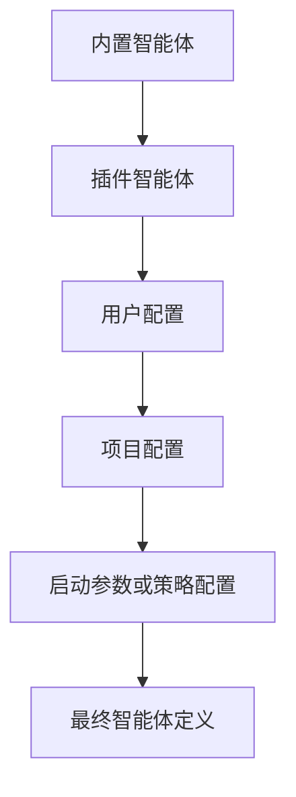
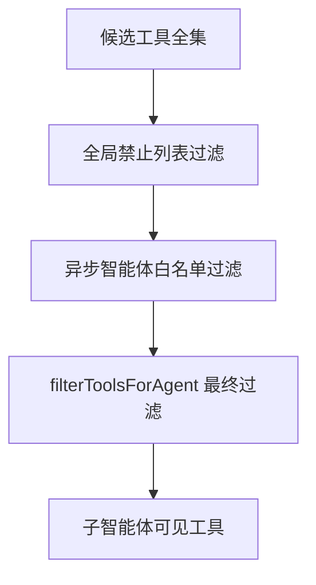
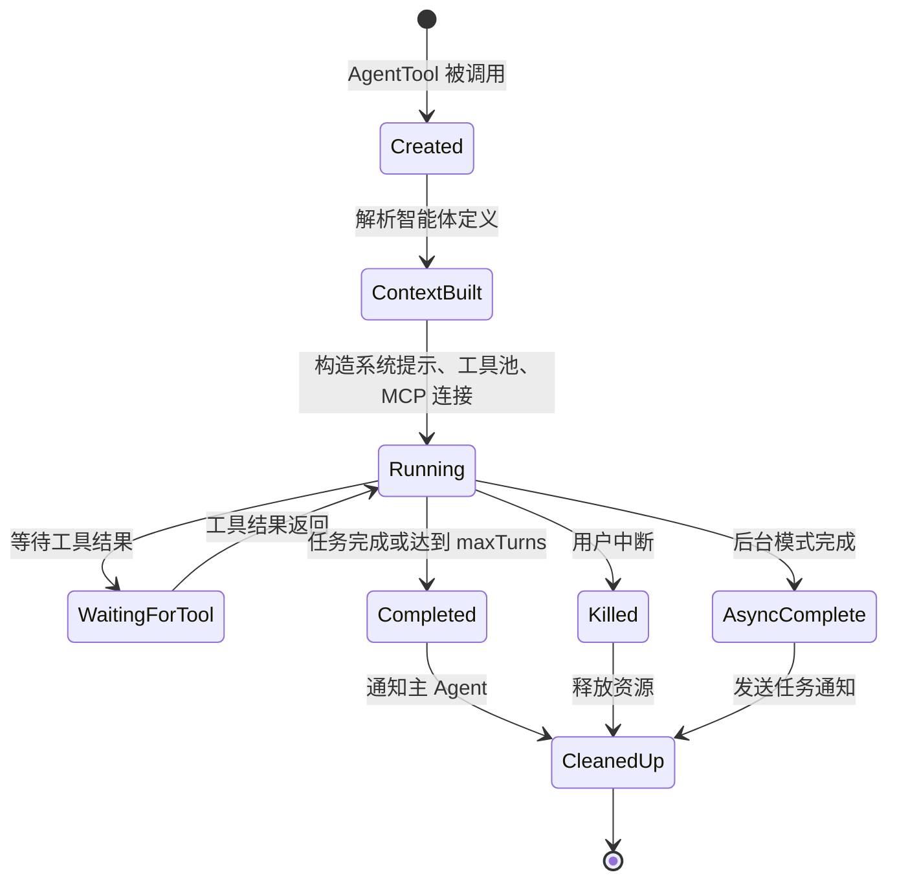

# 第 9 章：子智能体与 Fork 模式

原课程对应：`第三部分-高级模式篇/09-子智能体与Fork模式.md`

> 本章进入 Claude Code 的多智能体能力。重点不是“能不能开一个子任务”，而是理解子智能体如何被定义、加载、隔离、运行，以及 Fork 模式如何在不浪费大量 token 的前提下复用父对话上下文。

## 学习目标

读完本章后，你应该能够：

- 理解 `AgentTool` 在工具入口、智能体运行器、Fork 模式和自定义智能体之间的分工。
- 说清 `BaseAgentDefinition` 如何描述一个子智能体的身份、工具、模型、权限和生命周期。
- 区分内置智能体、自定义智能体和插件智能体三种来源。
- 理解 Explore、Plan、General Purpose、Verification 四类内置智能体各自适合什么任务。
- 掌握 Fork 模式为什么强调字节级上下文继承，以及 `CacheSafeParams` 的五个缓存安全维度。
- 理解子智能体工具隔离、递归防护和生命周期管理的工程意义。

## 9.1 AgentTool 架构

`AgentTool` 是主 Agent 调用子智能体的入口。它表面上是一个工具，实际承载的是“创建一个带独立上下文的 Agent 运行过程”。

普通工具通常做一件确定的事，比如读文件、搜索文本、执行命令。`AgentTool` 不同：它会启动另一个推理循环，让子智能体自己读取上下文、选择工具、执行任务并返回结果。因此它连接的是两层系统：

```text
主 Agent
  -> AgentTool
  -> 子智能体定义
  -> 子智能体运行器
  -> 工具池、权限、MCP、Skill、Hook
  -> 子任务结果
  -> 回到主 Agent
```

容易误解的一点是：子智能体不是“更复杂的函数调用”。函数调用的输入输出通常很窄，而子智能体有自己的提示词、工具范围、模型设置、最大轮次和上下文策略。它更像主 Agent 派出一个临时专家，而不是调用一个确定 API。

### 目录结构与模块职责

原课程把 `AgentTool` 附近的代码拆成几个关键模块。易学版可以按职责理解：

| 模块 | 易学解释 | 设计重点 |
|------|----------|----------|
| 工具入口 | 接收模型传入的子任务描述，并触发子智能体 | 只负责“接任务”，不混入复杂执行逻辑 |
| 智能体运行器 | 管理子智能体的上下文、工具池、MCP 连接和生命周期 | 让运行过程和路由逻辑解耦 |
| Fork 实现 | 构造缓存安全的子上下文 | 复用父对话前缀，减少 token 成本 |
| 内置智能体注册表 | 按 feature gate 和配置加载系统内置智能体 | 按需暴露能力 |
| 自定义智能体加载 | 读取 `.claude/agents/` 中的 Markdown 定义 | 降低用户扩展门槛 |
| 工具过滤函数 | 根据规则裁剪子智能体可用工具 | 防递归、防越权、防后台阻塞 |

为什么不把路由逻辑和执行逻辑合并？因为它们变化频率不同。

路由逻辑关心“这次应该用哪类智能体、任务描述是什么、要不要后台运行”。执行逻辑关心“如何构造上下文、如何注入工具、如何清理资源”。如果两者混在一起，新增一种智能体就可能影响底层运行器，风险会很高。分层后，新增智能体更多是增加定义，运行器可以保持稳定。

### BaseAgentDefinition 类型定义

所有子智能体都基于一个统一定义结构。你可以把 `BaseAgentDefinition` 看成智能体的“身份证加运行说明书”。

它通常包含这些信息：

| 字段类别 | 典型内容 | 作用 |
|----------|----------|------|
| 身份描述 | `agentType`、`whenToUse`、颜色 | 告诉系统和用户这个智能体是谁、什么时候用 |
| 工具能力 | `allowedTools`、`disallowedTools` | 限定子智能体能做什么、不能做什么 |
| 能力加载 | `skills`、`mcpServers` | 预加载专属 Skill 或 MCP 服务 |
| 执行控制 | `model`、`effort`、`maxTurns` | 控制模型、推理强度和最多运行轮次 |
| 权限控制 | `permissionMode`、后台模式 | 决定是否需要确认、是否阻塞主流程 |
| 上下文策略 | `omitClaudeMd`、`isolationMode`、memory 选项 | 决定继承哪些上下文，隔离到什么程度 |
| 生命周期扩展 | hooks | 在工具调用前后、完成时执行额外逻辑 |

这份定义的价值在于：它把“一个子智能体应该如何工作”声明出来，而不是散落在运行代码里。对 Harness 来说，声明式定义更容易被加载、覆盖、审计和组合。

一个最小化的子智能体心智模型如下：

```text
身份：我是谁
场景：什么时候找我
工具：我能用哪些能力
上下文：我能看到什么信息
控制：我最多跑多久、用什么模型
输出：我应该返回什么格式的结果
```

### 三种智能体来源

Claude Code 的子智能体并非只来自一处。原课程区分了三种来源。

| 来源 | 易学解释 | 优先级和用途 |
|------|----------|--------------|
| 内置智能体 | 系统自带，开箱即用 | 优先级最低，作为默认能力 |
| 自定义智能体 | 用户或项目通过 Markdown 声明 | 可以覆盖同名内置智能体，适合项目定制 |
| 插件智能体 | 插件包提供，带插件元数据 | 适合组织化分发和版本管理 |

这种设计给企业级部署留出了空间。例如公司可以提供一个 `security-auditor` 智能体，强制使用特定审计流程、只读工具和内部 MCP 服务。项目成员不需要每个人手写相同提示词，只要加载配置即可。

加载优先级很重要：用户和项目定义可以覆盖内置默认值，策略配置又可以进一步限制最终能力。这样既保留灵活性，也能让企业策略拥有更高控制权。



## 9.2 内置智能体

内置智能体体现了 Claude Code 对软件工程任务的基本拆分：探索、规划、执行、验证。它们不是为了“角色扮演”，而是为了让不同阶段使用不同权限、不同提示词和不同风险策略。

| 智能体 | 主要职责 | 工具倾向 | 适合场景 |
|--------|----------|----------|----------|
| Explore | 只读搜索和代码理解 | Read、Grep、Glob 等只读工具 | 快速定位代码、理解依赖、查找配置 |
| Plan | 结构化规划 | 只读工具，强调输出计划 | 复杂实现前拆步骤、列文件范围 |
| General Purpose | 通用执行 | 更完整工具集 | 明确任务下的实现和修复 |
| Verification | 对抗式验证 | 后台、只读或受限工具 | 检查实现是否真的满足要求 |

这四类智能体对应工程流程中的四种认知姿态：

```text
先找清楚事实
  -> 再制定计划
  -> 然后执行修改
  -> 最后用怀疑态度验证
```

### Explore Agent：只读代码探索专家

Explore Agent 是高速只读搜索智能体。它适合回答“在哪里”“谁调用了谁”“这个配置从哪里来”这类问题。

它的设计有两个关键点。

第一，严格限制写操作。Explore 的任务是收集事实，不应该创建文件、修改代码或改变环境。这样主 Agent 可以放心派它去搜索，而不用担心它在后台改动项目。

第二，尽量减少上下文噪音。Explore 任务通常不需要完整项目规范、提交模板或 PR 说明，只需要足够理解搜索目标的提示。省略不必要上下文可以节省 token，也能让模型更聚焦。

适合 Explore 的任务：

- 追踪某个 bug 的可能来源。
- 查找某个函数或配置项的定义位置。
- 理解一个模块被哪些地方调用。
- 快速梳理目录结构和模块边界。

不适合 Explore 的任务：

- 修改代码。
- 制定长期计划。
- 运行危险命令。
- 向用户追问需求。

### Plan Agent：结构化规划智能体

Plan Agent 使用和 Explore 类似的只读工具，但职责不同。Explore 偏“找事实”，Plan 偏“把事实变成可执行方案”。

它通常输出结构化信息，例如：

| 输出要素 | 说明 | 对后续阶段的价值 |
|----------|------|------------------|
| 问题分析 | 当前需求或问题如何拆解 | 防止实现方向跑偏 |
| 实施步骤 | 按顺序列出修改动作 | General Agent 可以逐步执行 |
| 关键文件 | 需要阅读或修改的文件 | 减少后续搜索成本 |
| 风险评估 | 可能副作用和注意事项 | Verification Agent 的检查重点 |
| 依赖关系 | 哪些步骤必须先后执行 | 判断能否并行 |

为什么 Plan Agent 要省略 `CLAUDE.md`？不是因为项目规范不重要，而是因为规划阶段要先理解“做什么”和“为什么做”，不应该过早被命名风格、提交模板、PR 格式等实现细节牵引。

举例来说，如果规划阶段已经开始纠结变量命名规则，模型可能会把注意力放在局部风格上，而不是任务边界、依赖关系和风险。实现阶段再加载项目规范更合适。

### General Purpose Agent：通用智能体

General Purpose Agent 是最灵活的子智能体。它通常拥有更完整的工具权限，可以读写文件、运行命令、使用搜索工具，也可能接入 Skill 和 MCP。

它适合：

- 明确边界的代码修改。
- 小范围 bug 修复。
- 根据计划执行某一组文件改动。
- 完成不需要频繁与主 Agent 同步的实现任务。

但不要把它当成默认选择。原课程强调一个反模式：不要用 General Purpose Agent 做只读任务。

原因很现实：General Purpose Agent 的工具更多、上下文更重、潜在副作用也更大。如果任务只是“查一下这个函数在哪里被用到”，用 Explore 更便宜、更快、更安全。最小权限原则在智能体系统里同样适用。

### Verification Agent：验证智能体

Verification Agent 是专门用来“找问题”的智能体。它不是复述实现过程，也不是帮主 Agent 找理由证明自己做对了，而是以对抗方式检查实现是否可靠。

它关注的问题包括：

- 测试是否真的运行了，而不是只口头说通过。
- 是否存在明显遗漏的边界条件。
- 是否有 import、类型、路径或配置错误。
- 是否存在未覆盖的文件或模块。
- 实现是否只满足 happy path。
- 是否有安全、并发或性能隐患。

#### 对抗性设计的深层哲学

验证智能体的系统提示通常会直接指出常见的“自我合理化借口”。这不是语气问题，而是工程设计。

LLM 很容易在任务接近完成时倾向于解释成功，例如“逻辑看起来没问题”“应该可以工作”“测试环境复杂所以不运行”。Verification Agent 的目标正好相反：它要主动寻找会推翻结论的证据。

可以把它理解为软件工程里的红队测试：

| 普通验证 | 对抗性验证 |
|----------|------------|
| 看实现是否符合预期 | 找实现在哪里可能不符合预期 |
| 容易接受表面正确 | 专门检查边界、异常和未运行项 |
| 倾向于确认已有结论 | 倾向于挑战已有结论 |
| 输出“看起来可以” | 输出具体失败点和修复建议 |

为什么 Verification Agent 常适合后台运行？因为验证任务不应该阻塞主流程的每个小动作。它可以在后台运行测试、查边界、生成报告，等完成后把问题列表返回给主 Agent。主 Agent 再决定是否修复。

## 9.3 Fork 模式：缓存安全的并行执行

Fork 模式解决的是一个具体问题：主对话已经积累了大量上下文，如果每次创建子智能体都重新构造 prompt，会浪费大量 token，也会破坏 prompt cache。

Fork 的核心思想是：把父对话已经渲染好的上下文字节前缀安全地交给子智能体，让子智能体从同一个前缀继续分叉，而不是重新拼装一份“看起来差不多”的上下文。

### Fork 模式的直觉理解

可以把普通子智能体和 Fork 子智能体这样区分：

| 模式 | 上下文来源 | 成本特征 | 适合场景 |
|------|------------|----------|----------|
| 普通子智能体 | 重新构建自己的系统提示、工具定义和消息 | 灵活，但容易重复 token | 定制化强、上下文差异大的任务 |
| Fork 子智能体 | 继承父对话的缓存安全前缀 | 更省 token，缓存命中率高 | 多个独立搜索、验证或分析任务 |

Fork 像是从当前对话状态分出一条分支。分支拥有独立后续消息，不会把中间探索污染主对话；但它的起点和父对话保持字节级一致，从而复用缓存。

### forkSubagent 模块的核心设计

Fork 模块的职责不是简单复制 messages。它要同时处理：

- 父对话上下文继承。
- 系统提示和工具定义的缓存安全。
- 子任务指令注入。
- 递归 Fork 防护。
- 子结果的汇总和返回。

流程可以概括为：

```text
主 Agent 判断任务适合 Fork
  -> 收集缓存安全参数
  -> 构造 forked messages
  -> 设置 querySource 标记
  -> 启动子智能体运行循环
  -> 子智能体返回结果
  -> 主 Agent 审查并使用结果
```

Fork 的收益主要来自缓存前缀共享，而不是“开更多并行一定更快”。如果子任务很小，Fork 的初始化成本可能超过收益；如果子任务高度耦合，Fork 后还会增加整合成本。

### 继承父对话的完整上下文和系统提示

原课程特别强调：Fork 要继承父对话的完整上下文和系统提示，而且要尽量保持字节级一致。

原因在于 prompt cache 通常按字节前缀匹配，而不是按语义匹配。两段提示词即使意思完全相同，只要空格、换行、属性顺序、工具 schema 顺序不同，就可能导致缓存无法命中。

所以 Fork 不应该“重新生成一份等价提示”。它应该优先复用已经渲染过的原始片段。

```text
语义级重建：
  内容意思相同，但字节可能不同
  -> 缓存命中不稳定

字节级继承：
  复用已渲染原始前缀
  -> 缓存命中更稳定
```

这个设计听起来细，但对大规模并行非常关键。多个子智能体如果都共享同一个长前缀，可以显著减少重复 token 处理。

### CacheSafeParams 五个维度

`CacheSafeParams` 可以理解为“哪些东西必须保持不变，缓存才安全”。原课程列出五个维度：

| 维度 | 包含内容 | 为什么影响缓存 |
|------|----------|----------------|
| system prompt | 基础系统提示和角色约束 | 提示词前缀的核心部分 |
| user context | 用户侧上下文、会话信息 | 会影响模型看到的任务背景 |
| system context | 工作目录、环境、权限模式等 | 决定工具和运行边界 |
| tool context | 工具定义、工具 schema、工具顺序 | 工具描述通常很长，且顺序敏感 |
| messages | 历史消息和工具结果 | 对话前缀本身 |

五个维度中任意一个发生差异，都可能破坏缓存命中。尤其是工具定义，很多人会忽略它的顺序和渲染方式。对模型来说，工具列表也是 prompt 的一部分。

### buildForkedMessages 的巧妙设计

`buildForkedMessages` 的关键思路是：不要把子任务指令粗暴塞进历史消息中，也不要把父对话重新整理一遍，而是在保留父前缀的基础上追加一条严格格式化的子任务指令。

它通常要做到：

1. 保留父对话中已经缓存的部分。
2. 追加说明“你是被 Fork 出来的子任务执行者”。
3. 禁止子智能体再创建子智能体或向用户提问。
4. 明确子任务目标、输出格式和下一步限制。
5. 标记查询来源，方便后续递归防护。

易学版可以把它理解为：

```text
父对话缓存前缀
  + 子任务边界说明
  + 禁止行为说明
  + 预期输出格式
  -> Fork 子智能体输入
```

这里最重要的是“追加”，不是“重写”。只要重写，缓存安全就会变差。

### 递归 Fork 防护

Fork 的一个危险是递归：子智能体又 Fork 出子智能体，子智能体的子智能体继续 Fork。表面上看这会带来无限并行，实际上会带来资源爆炸、结果聚合困难和调试困难。

原课程提到两层防护：

| 防线 | 易学解释 | 为什么重要 |
|------|----------|------------|
| `querySource` 检查 | 运行时标记“我是 Fork 出来的” | 不依赖消息历史，不会被压缩清除 |
| 消息扫描 | 检查特定标签作为后备 | 防止标记在序列化边界丢失 |

为什么不让 Fork 子智能体也拥有 Fork 能力？因为 Fork 是为主 Agent 管理并行分支服务的，不是让每个分支继续扩张。递归结构会让资源使用和结果整合快速失控。

## 9.4 自定义智能体

内置智能体解决通用问题，自定义智能体解决项目和团队问题。Claude Code 允许用户通过 Markdown 文件声明智能体，让项目可以沉淀自己的专家角色。

### .claude/agents/ 目录中的定义文件

自定义智能体通常放在 `.claude/agents/` 目录下。系统会扫描这个目录，读取每个 Markdown 文件，解析 frontmatter 和正文，然后合并到智能体注册表。

加载流程可以概括为：

```text
扫描 .claude/agents/
  -> 解析每个 Markdown 文件
  -> 提取 YAML frontmatter
  -> 提取正文作为系统提示
  -> 合并内置、插件、自定义来源
  -> 按优先级去重
  -> 注册到智能体列表
```

这种方式降低了扩展门槛。团队不需要写 TypeScript 插件，也不需要理解底层运行器，就能声明一个适合本项目的代码审查、文档生成、测试生成或性能分析智能体。

### Markdown frontmatter 格式

一个自定义智能体一般由两部分组成：frontmatter 描述元数据，正文描述行为规范。

```markdown
---
name: code-reviewer
description: 审查代码中的安全、可靠性和测试风险
tools:
  - Read
  - Grep
  - Glob
disallowedTools:
  - Write
  - Edit
model: haiku
effort: high
permissionMode: default
maxTurns: 15
background: true
---

你是一位代码审查智能体。你的任务是发现具体风险，
输出按严重程度排序的问题列表，并给出可操作修复建议。
```

关键字段可以这样理解：

| 字段 | 作用 | 建议 |
|------|------|------|
| `name` | 智能体名称 | 简短、唯一、任务导向 |
| `description` | 使用场景描述 | 写清什么时候应该调用 |
| `tools` | 允许工具列表 | 从最小工具集开始 |
| `disallowedTools` | 禁止工具列表 | 显式禁止高风险工具 |
| `model` | 使用模型 | 简单任务可用轻量模型 |
| `effort` | 推理强度 | 审查、规划类任务可提高 |
| `maxTurns` | 最大轮次 | 防止后台任务失控 |
| `background` | 是否后台运行 | 适合审查、分析、生成报告 |

解析时，frontmatter 会被映射成智能体定义，正文会进入该智能体的系统提示。若启用了 memory 字段，还可能注入持久化记忆内容。

#### 更多自定义 Agent 案例

**文档生成 Agent**

适合为 API、复杂函数或模块生成文档。工具范围通常包括 Read、Grep、Glob，必要时允许 Write 写入文档，但不允许 Bash 执行命令。

输出应包含参数说明、返回值说明、使用示例和兼容性提示。

**测试生成 Agent**

适合为指定模块补测试。它需要读源代码、写测试文件，可能需要运行测试命令。工具范围可以包括 Read、Write、Grep、Glob、Bash，但要限制任务文件范围。

输出应说明覆盖了哪些路径、哪些边界条件还未覆盖。

**性能分析 Agent**

适合查找慢查询、重复 I/O、无谓循环、缓存缺失等问题。它通常需要只读分析和少量 Bash 命令，默认不应允许 Edit 和 Write。

输出应包含问题位置、严重程度、优化建议和预期收益。

自定义智能体也可以配置 hooks。这和第 8 章 Hook 系统使用同一类生命周期思想，例如在工具调用前记录审计日志，或在工具调用后格式化报告。

## 9.5 智能体工具隔离

子智能体拥有工具能力，但不能拥有无限工具能力。工具隔离的目标是：让子智能体完成任务，同时避免递归、越权和后台阻塞。

### 全局禁止列表

有些工具对所有子智能体都应该禁用。例如：

- 获取其他子任务输出的工具，避免结果递归。
- Plan mode 相关工具，因为只应由主流程控制。
- Agent 工具，防止子智能体继续创建子智能体。
- 向用户提问的工具，避免后台智能体打断用户。
- 停止任务类工具，因为主任务状态应由主 Agent 管理。

全局禁止列表体现的是硬边界：不管具体智能体如何声明，这些工具都不能放开。



### 异步智能体白名单

后台或异步子智能体的限制更严格。因为它们运行时用户不一定盯着，也不应该弹出交互式确认。

异步智能体通常只允许一组白名单工具，例如 Read、Write、Edit、Bash、Grep、Glob、WebSearch 等核心工具，但会排除可能导致递归或阻塞的工具。

这里的原则是：后台智能体可以做任务，但不能接管主流程。

### filterToolsForAgent

`filterToolsForAgent` 是最终仲裁者。它综合处理三层规则：

1. MCP 工具始终按其权限系统处理。
2. 全局禁止工具一律排除。
3. 异步智能体只能使用白名单工具，但进程内协作者可按规则放宽。

为什么 MCP 工具不简单套用同一套限制？因为 MCP 工具来自外部服务，通常由用户显式配置，并有自己的权限边界。Harness 需要把 MCP 权限交给专门的 MCP 权限层处理，而不是在子智能体工具过滤里粗暴屏蔽。

工具隔离可以总结成：

| 层级 | 解决的问题 | 策略 |
|------|------------|------|
| 全局禁止 | 防递归、防越权、防主流程状态混乱 | 绝对排除 |
| 异步白名单 | 防后台阻塞用户或无限扩张 | 只开放有限工具 |
| 最终过滤 | 合并智能体声明、MCP、运行模式 | 精确裁剪 |

## 9.6 子智能体生命周期管理

子智能体不是调用完就结束的黑盒。它从创建、构建上下文、运行、等待工具、完成到清理，经历完整生命周期。

### 生命周期状态转换

生命周期可以这样理解：



这些状态让系统能回答几个关键问题：

- 当前子智能体是否仍在运行。
- 它是否正在等待工具结果。
- 它是正常完成、失败、被中断还是后台结束。
- 是否需要释放 MCP 连接、工具引用或临时资源。

### 上下文构建阶段

子智能体开始运行前，需要构建完整运行上下文。这个阶段通常包括：

1. 根据智能体定义生成系统提示。
2. 根据允许和禁止规则组装工具池。
3. 初始化智能体专属 MCP 服务。
4. 预加载需要的 Skill。
5. 如果配置了 memory，则注入相关记忆。
6. 设置权限模式、模型、最大轮次和后台标记。

上下文构建失败时，系统应该尽早失败，而不是让子智能体进入半初始化状态。半初始化状态最难调试：模型可能看到部分工具，权限层又不承认这些工具。

### 资源清理阶段

子智能体完成或失败后，运行器要清理资源：

- 关闭专属 MCP 连接。
- 释放工具实例引用。
- 格式化结果为任务通知。
- 如果是后台智能体，把通知排队等待主 Agent 下一轮处理。
- 保留必要日志和用量统计。

`maxTurns` 是生命周期管理中最实用的安全阀。它限制子智能体最多运行多少轮，防止任务在无效循环中持续消耗资源。

经验上可以这样设置：

| 任务类型 | 建议 maxTurns |
|----------|---------------|
| 只读搜索 | 10 到 15 |
| 代码生成 | 20 到 30 |
| 复杂审查 | 30 到 50 |
| 探索性分析 | 15 到 20 |

设置过低会导致任务未完成就中断；设置过高会浪费 token，尤其是后台智能体。更好的做法是根据任务类型给默认值，而不是所有子智能体共用一个大数字。

## 易学解释：什么时候该用子智能体

子智能体适合“边界清楚、可以独立完成、结果可审查”的任务。

| 任务 | 是否适合 | 原因 |
|------|----------|------|
| 搜索某个错误来源 | 适合 Explore | 只读、独立、结果明确 |
| 为一个模块写测试 | 适合 General Purpose | 文件范围明确，可验证 |
| 检查实现是否漏掉边界条件 | 适合 Verification | 需要独立怀疑视角 |
| 和用户反复确认需求 | 不适合 | 子智能体不应接管交互 |
| 多个文件交叉重构且边界不清 | 谨慎 | 容易冲突，可能更适合 Coordinator |

核心判断标准是：主 Agent 是否能给出清晰任务说明和验收标准。如果不能，先不要派子智能体。

## 实战练习

**练习 1：创建一个自定义代码审查智能体**

在项目的 `.claude/agents/` 目录下设计一个 `code-reviewer.md`，要求：

- 只读权限，禁止 Write 和 Edit。
- 使用轻量模型降低成本。
- 输出结构化审查报告。
- `maxTurns` 设置为 15。
- 后台运行，避免阻塞主流程。

思考：如果这个智能体需要读取公司内部安全规范，应该用 Skill、MCP 还是直接写进 Markdown？

**练习 2：分析 Fork 模式的缓存效率**

假设父对话有 100 条消息，约 80,000 token。主 Agent 一次性发起 3 个 Fork 子智能体。请估算：

- 第一个子智能体可复用多少父对话前缀。
- 第二、第三个子智能体是否也能复用相同缓存前缀。
- 如果不用 Fork，每个子智能体要重复发送多少输入 token。
- 如果三个子任务描述分别为 200、350、180 token，它们各自新增 token 大约是多少。

**练习 3：探索 Verification Agent 的对抗策略**

为“代码审查 Agent”写一段验证提示，要求它主动识别以下自我合理化：

- 没有实际运行测试却声称测试通过。
- 只检查 happy path。
- 把类型检查、lint、单元测试混为一谈。
- 因为修改很小就跳过验证。

**练习 4：设计一个多智能体协作流程**

为“给用户认证模块添加 OAuth2 支持”设计流程：

1. 使用 Explore Agent 调查现有认证代码结构。
2. 使用 Plan Agent 制定实现计划。
3. 使用 General Purpose Agent 执行实现。
4. 使用 Verification Agent 验证实现。

写出每一步的输入、预期输出、工具范围和最大轮次。

## 关键要点

1. `AgentTool` 表面是工具，实质是子智能体运行入口。它把任务委派、智能体定义、上下文构建、工具池和生命周期连接起来。

2. `BaseAgentDefinition` 是子智能体的统一声明结构。身份、场景、工具、模型、权限、上下文和 hooks 都应该通过定义表达，而不是散落在执行代码里。

3. 内置智能体各司其职：Explore 负责只读搜索，Plan 负责结构化规划，General Purpose 负责通用执行，Verification 负责对抗性验证。不要用权限更大的智能体处理只读任务。

4. Fork 模式的核心不是简单并行，而是通过字节级上下文继承实现 prompt cache 共享。`CacheSafeParams` 的五个维度是 system prompt、user context、system context、tool context 和 messages。

5. `buildForkedMessages` 的关键是保留父对话缓存前缀，再追加子任务指令。重建一份语义等价提示会破坏缓存稳定性。

6. 递归 Fork 必须被限制。`querySource` 运行时标记和消息扫描后备机制共同防止子智能体继续无限分叉。

7. 工具隔离是子智能体安全的核心。全局禁止列表、异步白名单和 `filterToolsForAgent` 三层过滤，确保子智能体不会递归、越权或在后台阻塞用户。

8. 子智能体生命周期管理包括创建、上下文构建、运行、等待工具、完成、中断和清理。合理设置 `maxTurns`、选择模型和工具集，是降低成本和提升可靠性的关键。
