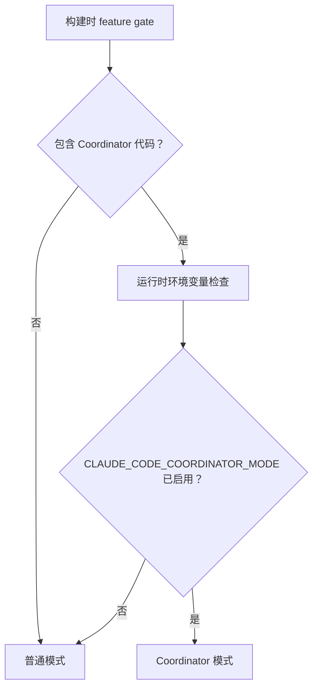
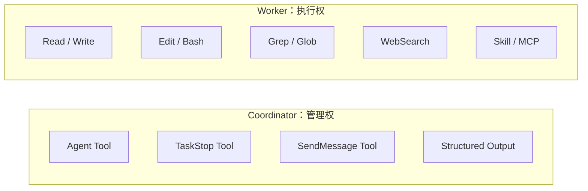
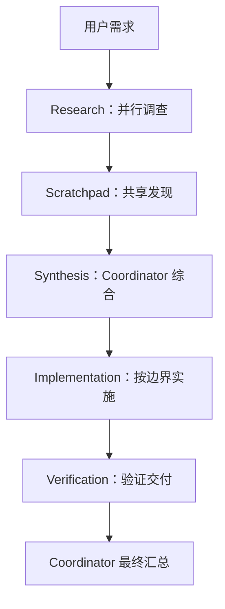
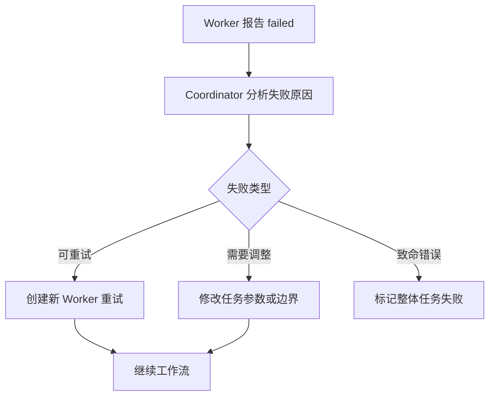
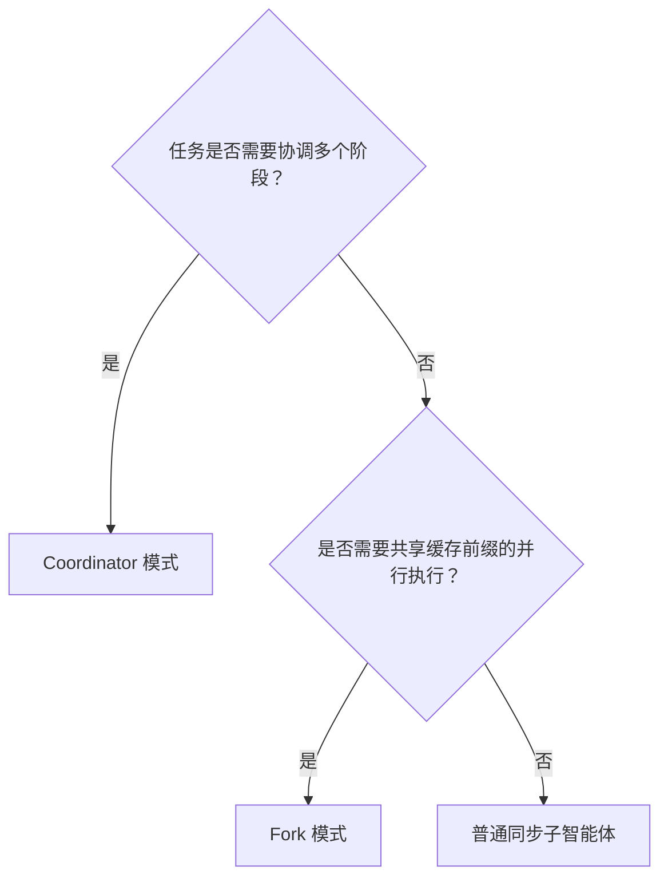
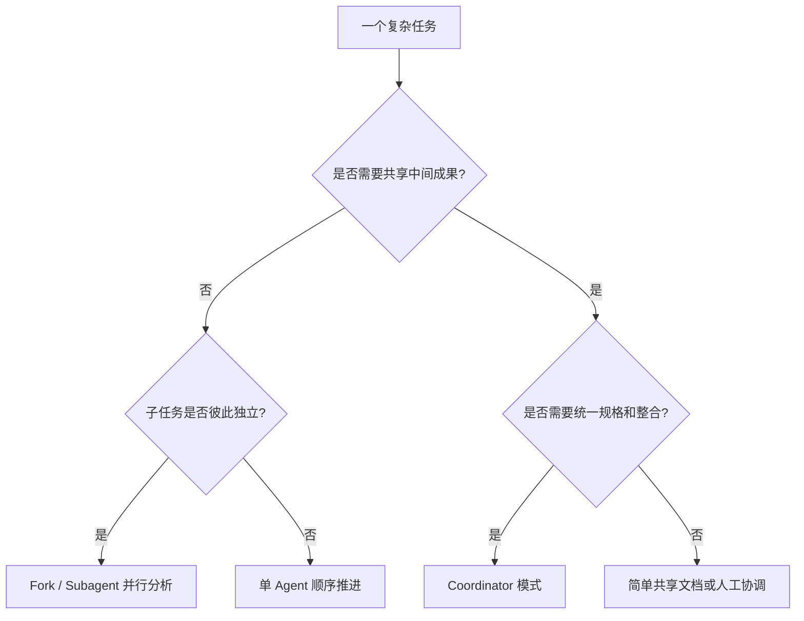
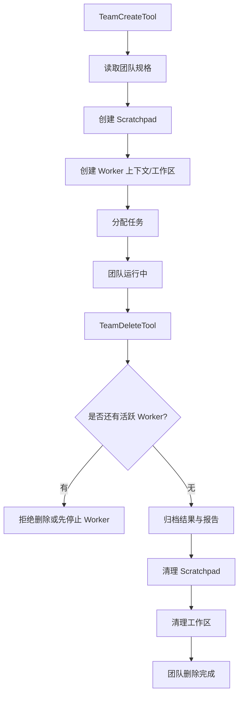
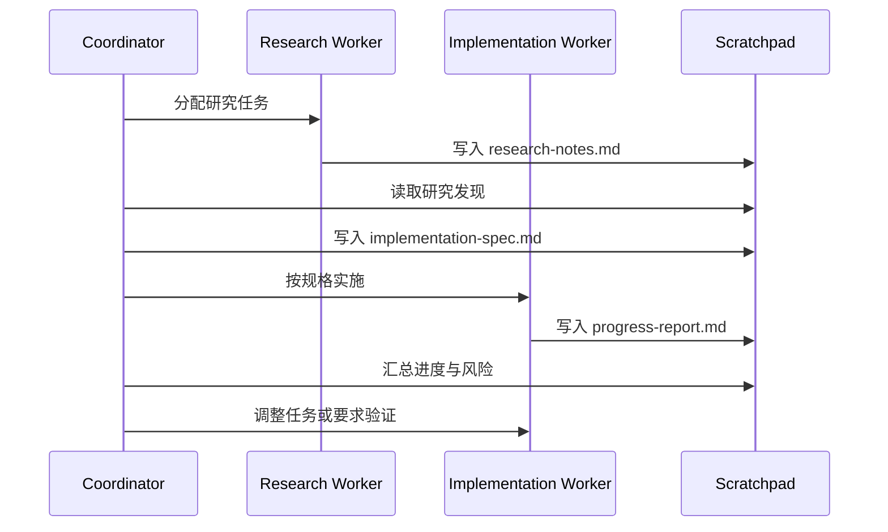
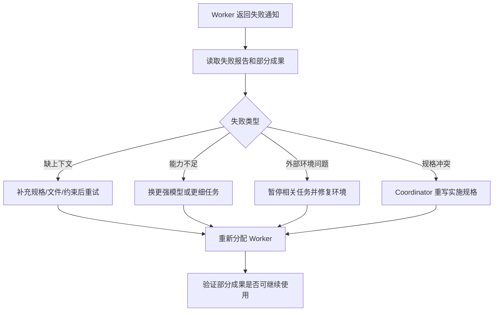

# 第 10 章：协调器模式 - 多智能体企业级编排

原课程对应：`第三部分-高级模式篇/10-协调器模式-多智能体编排.md`

> 第 9 章讲的是如何派出子智能体处理独立任务。本章继续向前：当任务需要多个工作者协作、共享中间发现、处理失败和部分完成时，就需要 Coordinator 模式。它不是“更多 Agent 同时跑”，而是一套中心化编排方案。

## 学习目标

读完本章后，你应该能够：

- 理解 Coordinator 模式采用“协调者加工作者”的架构，而不是让所有 Agent 平等互相通信。
- 说清双重门控机制：feature gate 和 `CLAUDE_CODE_COORDINATOR_MODE` 环境变量。
- 理解 Coordinator 模式为什么与 Fork 模式互斥，以及会话恢复时为什么要匹配模式。
- 掌握协调者和工作者工具池的分离策略。
- 理解团队管理、消息传递和 Scratchpad 协作空间如何支撑多 Agent 工作流。
- 用 Research、Synthesis、Implementation、Verification 四阶段工作流拆解复杂任务。
- 判断 Coordinator 模式和 Fork 模式各自适合什么场景。

## 10.1 协调器架构

Coordinator 模式的核心是“协调者不亲自执行开发动作，而是管理工作者”。它像工程项目里的项目经理：不亲自写每一行代码，但要知道任务如何拆分、谁负责什么、哪些工作可以并行、哪些必须等待、失败后如何调整。

```text
用户需求
  -> Coordinator 理解目标和拆任务
  -> 创建 Worker 团队
  -> 给 Worker 分配任务
  -> Worker 独立执行并写入 Scratchpad
  -> Coordinator 读取结果并综合判断
  -> 分配实施或验证任务
  -> 最终向用户交付
```

这里最关键的边界是：Coordinator 管理任务，Worker 执行任务。Coordinator 不应该直接改代码，Worker 也不应该互相指挥。

### coordinatorMode 核心模块

原课程提到 Coordinator 模式的核心代码量不大，但定义了整个协作模型。它入口通常围绕一个判断函数：当前是否启用 Coordinator 模式。

这个判断有两层：

| 层级 | 作用 | 易学解释 |
|------|------|----------|
| Feature gate | 编译时是否包含该能力 | 构建产物中可以完全去掉 Coordinator 相关代码 |
| 环境变量 | 运行时是否激活该能力 | 即使代码存在，也必须显式打开 |



为什么要双重门控？因为这符合企业软件的最小权限原则。

编译时 gate 可以减少二进制体积和攻击面，适合轻量 SDK 或嵌入式场景。运行时环境变量让包含功能的构建也必须显式启用，避免用户在不知情时进入多 Agent 模式。

### 激活条件与互斥关系

Coordinator 模式会和其他模式交互，其中最重要的是与 Fork 模式互斥。

当 Coordinator 模式启用时，Fork 模式会被禁用或让位。原因是两者代表不同并行策略：

| 模式 | 并行方式 | 控制中心 |
|------|----------|----------|
| Fork | 主 Agent 发起多个对等分支 | 主 Agent |
| Coordinator | 协调者分配任务给工作者 | Coordinator |

Coordinator 已经拥有自己的任务委派、工作者管理和结果聚合机制。如果再叠加 Fork，会出现两个调度中心：主 Agent 想分叉，Coordinator 也想分配任务。调度中心越多，任务归属和失败处理越混乱。

因此模式选择要明确：需要独立并行搜索时用 Fork；需要多阶段协作、任务分配和结果整合时用 Coordinator。

### 会话恢复的模式匹配

会话恢复时必须保持模式一致。假设用户昨天用 Coordinator 模式创建了一个会话，今天恢复时忘了设置环境变量，如果系统按普通模式恢复，工具列表、系统提示和任务状态都会不同。

因此原课程提到 `matchSessionMode()` 这类机制：恢复会话时检查当前模式是否和历史会话匹配，不匹配时自动调整环境变量或激活状态，让会话以原模式继续。

这个设计解决的是“可恢复性”问题。Agent 会话不只是聊天记录，它还包含运行模式、工具池、团队状态、Scratchpad 路径和任务通知协议。模式不一致会导致行为不一致。

### Coordinator 的系统提示

Coordinator 的系统提示不是普通角色描述，而是一份行为协议。它定义协调者能做什么、不能做什么、如何分配任务、如何读取结果、如何处理失败。

核心约束包括：

- Coordinator 是任务分配者，不是直接执行者。
- Coordinator 要给 Worker 下明确任务，包括目标、边界、输出位置和验收标准。
- Coordinator 必须读取和理解研究结果，再编写实施规格。
- Worker 的结果是内部信号，不是和用户对话的对象。
- Coordinator 不得编造 Worker 结果。
- Coordinator 不得让一个 Worker 去检查另一个 Worker。
- Coordinator 不应让 Worker 只做“报告文件内容”这种可以自己完成的简单动作。

为什么禁止“工作者检查工作者”？因为这会形成信息传递链。

```text
Worker A 完成任务
  -> Worker B 检查 A
  -> Worker B 报告给 Coordinator
  -> Coordinator 再理解 B 的报告
```

链路越长，信息丢失和误解越多。正确做法是：Coordinator 直接接收每个 Worker 的结果，自己综合判断，然后必要时派新的 Worker 验证具体目标。

## 10.2 工作器工具分配

Coordinator 模式最重要的安全边界之一，是协调者和工作者的工具集不同。

协调者只拥有编排工具，工作者才拥有开发工具。这保证协调者把精力放在管理任务上，也避免它绕过工作者直接改代码。

### INTERNAL_WORKER_TOOLS

`INTERNAL_WORKER_TOOLS` 是工作者内部工具集的概念。它表示 Worker 能看到的开发能力，例如 Read、Write、Edit、Bash、Grep、Glob、WebSearch、Skill、MCP 等。

与之相对，Coordinator 的工具集很小，主要包括：

| Coordinator 工具 | 作用 |
|------------------|------|
| Agent Tool | 创建工作者并分配任务 |
| TaskStop Tool | 停止正在运行的工作者 |
| SendMessage Tool | 给工作者发送消息 |
| Structured Output Tool | 接收或整理结构化结果 |

Coordinator 没有 Read、Write、Edit、Bash 等开发工具。这个限制很关键：它强制 Coordinator 通过 Worker 完成实际工作，让“管理”和“执行”保持分层。



### Simple 模式和完整模式的工具集

工作者工具集可以分成 Simple 和 Full 两种模式。

| 模式 | 工具集 | 适用场景 |
|------|--------|----------|
| Simple | Bash、Read、Edit | CI/CD、资源受限容器、快速验证 |
| Full | 完整白名单工具，包括搜索、网络、Skill、MCP 等 | 本地开发、复杂重构、完整 IDE 集成 |

Simple 模式适合资源受限或风险更高的环境。比如 CI 容器里不需要 WebSearch 和完整外部协议，只需要读取、编辑和运行命令完成自动化任务。

Full 模式适合本地开发。复杂任务需要搜索、读取外部文档、访问 MCP 服务或加载 Skill，此时完整工具集更有价值。

### 工具池的独立组装

工作者的工具池独立于父级工具池组装。这意味着 Worker 可以获得完整开发工具集，而不会被 Coordinator 自身的工具限制影响。

这听起来像绕开限制，其实正好相反：它让权限边界更清楚。

- Coordinator 被限制为编排者。
- Worker 被授权为执行者。
- Worker 不拥有团队管理工具。
- Coordinator 不拥有文件修改工具。

如果让 Worker 继承 Coordinator 的工具池，Worker 反而无法开发；如果让 Coordinator 拥有 Worker 工具，分层就失效。因此两者必须独立组装。

最佳实践是：在进入 Coordinator 的 Implementation 阶段前，先让 Coordinator 输出清晰任务分配计划，包括每个 Worker 的文件范围、输入资料、输出位置和验收标准。

## 10.3 团队管理

Coordinator 模式需要管理一组 Worker。这组 Worker 不是随便创建的后台任务，而是一个有共享空间、成员列表、生命周期和清理规则的团队。

### TeamCreateTool / TeamDeleteTool

团队创建工具负责初始化协作环境。典型流程包括：

```text
检查是否已有团队
  -> 生成唯一团队名
  -> 创建团队目录
  -> 创建 Scratchpad
  -> 初始化成员列表
  -> 更新全局状态
  -> 设置任务追踪结构
```

为什么限制一个协调者只能管理一个团队？因为多个团队会让任务状态复杂化。Coordinator 需要知道当前所有 Worker、Scratchpad、通知队列和任务状态。如果同时管理多个团队，任务归属和资源清理都会更难。

团队删除工具负责收尾。它不能简单删除目录，而要确认：

- 是否仍有活跃 Worker。
- 是否有未处理的任务通知。
- Scratchpad 是否仍被使用。
- worktree 或临时资源是否需要清理。

### 团队删除的安全保障

团队删除是高风险操作。原课程强调几个安全点：

1. 仍有活跃成员时拒绝删除。
2. 清理顺序要合理：先清理团队目录，再清理 worktree，最后清理团队上下文。
3. 单个资源清理失败不能阻止其他资源继续清理。

不要在 Worker 完成前删除团队。否则可能出现：

- Worker 的任务通知无法送达 Coordinator。
- Scratchpad 文件被删除，Worker 读到空数据。
- worktree 被清理，Worker 的文件修改丢失。
- Coordinator 仍以为任务在运行，但资源已经不存在。

### SendMessageTool 消息传递

`SendMessageTool` 是 Coordinator 和 Worker 之间的通信通道。它支持几类常见消息：

| 消息类型 | 说明 | 用途 |
|----------|------|------|
| 点对点 | 发给指定 Worker | 追加指令、澄清任务 |
| 广播 | 发给所有 Worker | 发布共享决策或变更 |
| UDS | 跨进程通信 | 不同进程间传递消息 |
| Bridge | 跨会话或跨机器通信 | 更复杂部署下的消息桥接 |

消息传递适合即时指令，不适合长期知识存储。长期知识应该写入 Scratchpad。

## 10.4 协作空间

多个 Worker 之间不能直接聊天，也不应该形成链式沟通。它们需要一个共享、持久、可读写的协作空间。这就是 Scratchpad。

### Scratchpad 协作空间设计

Scratchpad 是会话专属的临时目录，通常位于项目临时目录下的会话路径中。它的用途是保存跨 Worker 的中间发现、分析文档、实施规格和验证报告。

设计理念可以概括为：

| 设计点 | 目的 |
|--------|------|
| 会话隔离 | 不同会话互不污染 |
| 临时目录 | 不把中间文件写入项目源码 |
| 可读写 | Worker 可以共享分析和规格 |
| 免权限提示 | 降低协作过程中的确认噪音 |
| 自由结构 | 让不同任务按需组织文件 |

Scratchpad 不应该放在项目目录内。它是协作过程的临时知识空间，不是最终交付物。如果放进项目目录，容易污染 git 状态，也可能让 Worker 把中间草稿误认为源码。

#### Scratchpad 的典型使用模式

Scratchpad 常见用法如下：

| 文件 | 内容 | 谁写 | 谁读 |
|------|------|------|------|
| `api-analysis.md` | 后端路由、接口、服务层发现 | API Research Worker | Coordinator、Implementation Worker |
| `db-analysis.md` | schema、迁移、ORM 发现 | DB Research Worker | Coordinator、DB Worker |
| `frontend-analysis.md` | 页面、状态管理、组件库发现 | Frontend Research Worker | Coordinator、Frontend Worker |
| `implementation-spec.md` | Coordinator 综合后的实施规格 | Coordinator | Implementation Workers |
| `verification-report.md` | 验证结果和风险列表 | Verification Worker | Coordinator |

为什么不用消息传递替代 Scratchpad？因为消息是瞬时的，Scratchpad 是持久的。研究阶段的发现可能被后续多个 Worker 反复读取，写成文件比让 Coordinator 不断转发更可靠。

Scratchpad 还支持增量构建：Worker A 写基础分析，Worker B 追加发现，Coordinator 再整理成规格。这比把所有中间信息塞进一条消息更清晰。

### 协调者的任务工作流

Coordinator 标准工作流分为四个阶段：

| 阶段 | 执行者 | 目标 | 典型输出 |
|------|--------|------|----------|
| Research | 多个 Worker 并行 | 调查代码库、发现文件、理解问题 | Scratchpad 分析文档 |
| Synthesis | Coordinator | 综合研究结果，编写实施规格 | `implementation-spec.md` |
| Implementation | 多个 Worker 按依赖执行 | 根据规格修改代码 | 代码变更和执行报告 |
| Verification | Verification Worker 或多个 Worker | 验证功能、测试、边界和集成 | 验证报告 |



关键约束是：Coordinator 必须先消化研究发现，再写实施规格。不能把研究报告原样转发给实现 Worker，让 Worker 自己猜下一步。Coordinator 的价值就在综合判断和任务分配。

### 并发策略

并发不是“能并发就并发”。Coordinator 需要区分任务依赖。

| 任务类型 | 并发策略 | 原因 |
|----------|----------|------|
| 研究不同领域 | 可以并行 | API、数据库、前端分析互不写文件 |
| 编写共享规格 | 串行，由 Coordinator 完成 | 需要统一理解和统一口径 |
| 修改互不重叠文件 | 可以并行 | 文件所有权清晰 |
| 修改同一文件 | 串行 | 避免冲突 |
| 验证不同模块 | 可以并行 | 测试目标独立 |
| 集成验证 | 通常串行 | 需要完整实现后统一检查 |

系统提示鼓励 Coordinator 在一次消息中 fan out 多个独立 Worker。这利用了并行工具调用能力，让多个研究任务同时启动。

### 任务通知协议

Worker 完成后，会通过任务通知协议把状态和结果传回 Coordinator。原课程示例使用 XML 风格标签，易学版可以理解为结构化事件：

```xml
<task-notification>
  <task-id>{agentId}</task-id>
  <status>completed|failed|killed</status>
  <summary>{human-readable status summary}</summary>
  <result>{worker final response}</result>
  <usage>
    <total_tokens>N</total_tokens>
    <tool_uses>N</tool_uses>
    <duration_ms>N</duration_ms>
  </usage>
</task-notification>
```

为什么用明显标签而不是普通自然语言？因为 Coordinator 需要区分“用户说的话”和“Worker 回来的内部信号”。标签让模型更容易识别消息类型，也便于系统提示反复强调：Worker 结果是内部事件，不是对话伙伴。

## 10.5 完整案例：从需求到交付

这一节用一个端到端案例说明 Coordinator 如何工作。

### 场景：为 Web 应用添加用户通知系统

需求：为一个 Express.js 应用添加通知系统，支持邮件和站内信两种通知方式，用户可以在设置页面管理通知偏好。

这个任务涉及后端 API、数据库 schema、服务层、前端页面和验证。如果由单个 Agent 线性处理，容易在上下文里混杂大量发现和实现细节。Coordinator 可以把它拆成阶段。

#### Phase 1: Research（研究阶段）

Coordinator 同时派出三个研究 Worker：

| Worker | 任务 | 输出 |
|--------|------|------|
| `api-researcher` | 调查 Express 路由、中间件、API 版本策略 | `/scratchpad/api-analysis.md` |
| `db-researcher` | 调查数据库 schema、ORM、迁移策略 | `/scratchpad/db-analysis.md` |
| `frontend-researcher` | 调查前端框架、页面结构、状态管理 | `/scratchpad/frontend-analysis.md` |

每个 Worker 只负责调查自己的领域，不做修改。它们把发现写到 Scratchpad，Coordinator 后续统一读取。

#### Phase 2: Synthesis（综合阶段）

Coordinator 读取三个分析文件，生成实施规格。例如：

- 数据库：新增 `Notification` 和 `NotificationPreference` 模型。
- API：新增通知列表、创建、更新、删除、偏好设置端点。
- 服务层：新增 `NotificationService` 处理邮件和站内信。
- 前端：在设置页添加通知偏好组件。
- 依赖：可能需要邮件发送库。

综合阶段的关键是把分散发现变成一个一致计划。Coordinator 要判断哪些实现可以并行，哪些必须等待。

#### Phase 3: Implementation（实施阶段）

Coordinator 根据规格分配实现 Worker：

| Worker | 文件范围 | 依赖 |
|--------|----------|------|
| `db-implementer` | `prisma/schema.prisma` 和迁移文件 | 无，先执行 |
| `service-implementer` | 通知服务和 API 路由 | 等待 DB 结构确定 |
| `frontend-implementer` | 通知偏好组件和设置页 | 可与后端部分并行，但 API 契约需稳定 |

这里的重点是文件所有权。每个 Worker 应该独占自己的文件范围，避免两个 Worker 同时改同一个文件。

#### Phase 4: Verification（验证阶段）

最后派出验证 Worker 检查：

- 迁移是否正确。
- API 是否符合 RESTful 约定。
- 前端组件是否正确调用 API。
- 错误处理是否覆盖。
- 默认通知偏好是否合理。
- 是否存在权限或数据泄露风险。

验证完成后，Coordinator 根据报告决定是否重新分配修复任务，或汇总最终交付说明。

## 10.6 故障恢复与部分完成

多智能体协作中，Worker 失败是常态。Coordinator 模式的价值之一，就是把失败变成可管理事件，而不是让整个任务立刻崩溃。

### 工作者失败的处理策略

常见失败类型和应对策略如下：

| 失败类型 | 表现 | Coordinator 的应对策略 |
|----------|------|------------------------|
| 工具执行失败 | Bash 命令返回非零退出码 | 分析失败原因，重试或调整命令 |
| 模型输出截断 | 达到 maxTurns 或上下文限制 | 缩小任务范围，重新分配 |
| MCP 连接失败 | 外部工具不可用 | 降级为不依赖该工具的策略 |
| 文件冲突 | 多个 Worker 触碰同一区域 | 停止冲突任务，重新划分文件所有权 |
| 致命错误 | 环境不可恢复或需求矛盾 | 标记任务失败并向用户说明 |



### 部分完成的处理

部分完成不是失败的同义词。比如 API 研究 Worker 只完成了 80% 调查，但已经发现了主要路由和中间件结构。Coordinator 应该利用这 80% 信息，而不是等待完美报告。

更好的做法是：

- 在 Scratchpad 中标注置信度。
- 把未确认区域写进实施规格。
- 让实施 Worker 在遇到未知区域时补充调查。
- 对高风险未知点单独派验证 Worker。

示例置信度标注：

```text
[HIGH] 已确认通知路由应放在 src/routes/notifications.ts
[MEDIUM] 邮件发送依赖可能使用 nodemailer，实施前需确认
[LOW] 前端偏好页结构只做了初步调查，可能需要追加搜索
```

这种方式让 Coordinator 不会卡在“信息必须完美”上，也不会把不确定内容伪装成事实。

## 10.7 Coordinator 模式与 Fork 模式对比

Coordinator 和 Fork 都是多智能体能力，但解决的问题不同。

| 维度 | Coordinator 模式 | Fork 模式 |
|------|------------------|-----------|
| 架构模型 | 中心化，协调者加工作者 | 去中心化，多个对等分支 |
| 上下文共享 | Worker 只看到分配任务和共享资料 | 子智能体继承完整父上下文 |
| 通信方式 | Coordinator 中转，Scratchpad 共享 | 无直接通信，各自独立 |
| 任务分配 | 显式分配，精确控制 | 隐式并行，任务相对独立 |
| 结果聚合 | Coordinator 综合所有结果 | 主 Agent 按需收集结果 |
| 缓存效率 | 不共享完整缓存前缀 | 字节级共享，缓存效率高 |
| 适用场景 | 复杂多步骤、需要协调的工程任务 | 独立并行搜索、分析、验证 |
| 故障恢复 | Coordinator 可重新分配任务 | 主 Agent 收到失败后决定 |
| 资源开销 | 较高，需团队和 Scratchpad 管理 | 较低，重点是缓存复用 |
| 心智模型 | 建筑工地：项目经理加工人 | 侦察队：多个独立侦察兵 |

选择时可以用这个流程：



如果任务需要研究、综合、实施、验证多个阶段，并且工作者之间需要共享中间发现，选 Coordinator。如果只是让多个子任务从同一上下文出发各自搜索或验证，选 Fork。

## 10.8 关键流程图补强

### 图一：Coordinator 与 Fork 的选择图



Fork 更像“复制上下文后各自探索”，Coordinator 更像“有项目经理的团队协作”。选择错误会带来重复劳动、结果无法合并或成本过高。

### 图二：团队创建与删除流程图



删除团队不是简单删目录。安全顺序是先确认没有活跃 Worker，再归档结果，最后清理资源。

### 图三：Scratchpad 协作流



Scratchpad 的重点是“中间成果持久化”。如果没有它，Coordinator 很容易只能依赖一次性消息，难以做跨阶段综合。

### 图四：Worker 失败恢复流程图



失败恢复的关键不是“重试一次”，而是先分类失败原因，再决定是补上下文、换执行者、修环境还是重写规格。

## 易学解释：Coordinator 的核心价值

Coordinator 模式解决的不是“让更多 Agent 跑起来”，而是“让多个 Agent 的工作结果能被可靠整合”。

它提供了四个能力：

| 能力 | 解决的问题 |
|------|------------|
| 任务分配 | 防止多个 Worker 做重复事或抢同一文件 |
| 共享空间 | 让中间发现可持久、可复用 |
| 结果综合 | 把分散发现变成统一规格 |
| 故障恢复 | 让失败 Worker 不拖垮整个任务 |

多 Agent 的难点不是启动，而是边界、通信、整合和验证。Coordinator 正是围绕这些难点设计的。

## 实战练习

**练习 1：设计一个多工作者工作流**

假设你要把一个单体 Express.js 应用拆成微服务。设计 Coordinator 模式下的工作流：

1. Research 阶段需要几个 Worker？每个负责调查什么模块？
2. Synthesis 阶段如何综合发现并写微服务拆分规格？
3. Implementation 阶段如何分配 Worker 避免文件冲突？
4. Verification 阶段如何验证每个微服务和整体集成？

**练习 2：分析 Scratchpad 的安全边界**

回答以下问题：

- Scratchpad 目录权限设置为只有当前用户可访问，意味着什么？
- 为什么 Scratchpad 不应该放在项目目录内？
- 两个 Worker 同时写同一个 Scratchpad 文件会发生什么风险？
- 如何设计文件命名规范避免冲突？

扩展思考：如果要给 Scratchpad 做版本控制，需要记录哪些元信息？这会如何改变 Worker 的写入行为？

**练习 3：对比 Coordinator 模式与 Fork 模式**

填写下表，并为每个维度写一句理由：

| 维度 | Coordinator 模式 | Fork 模式 |
|------|------------------|-----------|
| 架构模型 | ? | ? |
| 上下文共享 | ? | ? |
| 适用场景 | ? | ? |
| 通信方式 | ? | ? |
| 缓存效率 | ? | ? |
| 故障恢复 | ? | ? |
| 资源开销 | ? | ? |

**练习 4：设计故障恢复策略**

假设 Implementation 阶段的 Worker 在修改数据库 schema 时失败，迁移脚本报错。请设计：

1. Coordinator 如何检测到失败。
2. Coordinator 如何判断是重试、调整策略还是终止。
3. 已经部分完成的修改如何处理。
4. 其他并行 Worker 是否应该暂停。

**练习 5：模拟一个完整 Coordinator 工作流**

选择一个熟悉的项目，设计“添加国际化支持”的 Coordinator 工作流，要求：

- 列出 Research 阶段的调查方向。
- 编写 Synthesis 阶段的实施规格大纲。
- 设计 Implementation 阶段的 Worker 分配。
- 规划 Verification 阶段的检查清单。

## 关键要点

1. Coordinator 模式采用“协调者加工作者”架构。协调者只负责任务分配、消息传递、团队管理和结果综合，不直接执行代码修改。

2. 双重门控机制让模式启用更明确：feature gate 控制构建中是否包含能力，`CLAUDE_CODE_COORDINATOR_MODE` 控制运行时是否激活。会话恢复时还需要匹配历史模式。

3. Coordinator 模式与 Fork 模式互斥。Coordinator 已经有中心化任务委派模型，不应再叠加 Fork 的隐式并行能力。

4. 工具隔离让角色边界清楚：Coordinator 只有编排工具，Worker 拥有开发工具集但不拥有团队管理工具。Simple 和 Full 两种工作者工具集适配不同运行环境。

5. TeamCreate 和 TeamDelete 不是普通目录操作，而是团队生命周期管理。删除团队前必须确认没有活跃 Worker，并按顺序清理 Scratchpad、worktree 和上下文。

6. Scratchpad 是跨 Worker 的持久协作空间。它适合保存研究发现、实施规格和验证报告，弥补 Worker 之间不能直接通信的限制。

7. 标准工作流是 Research、Synthesis、Implementation、Verification。核心原则是 Coordinator 必须先理解研究发现，再编写实施规格，不能把综合责任推给 Worker。

8. 故障恢复是 Coordinator 的内置能力。通过任务通知中的 status、Scratchpad 中的部分结果和重新分配能力，系统可以处理 Worker 失败和部分完成。

9. Coordinator 适合复杂多步骤、需要协调和共享中间成果的工程任务；Fork 适合独立并行搜索或分析任务。理解两者差异，是正确使用多智能体能力的关键。
