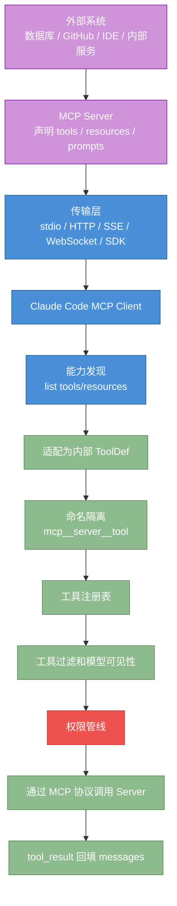
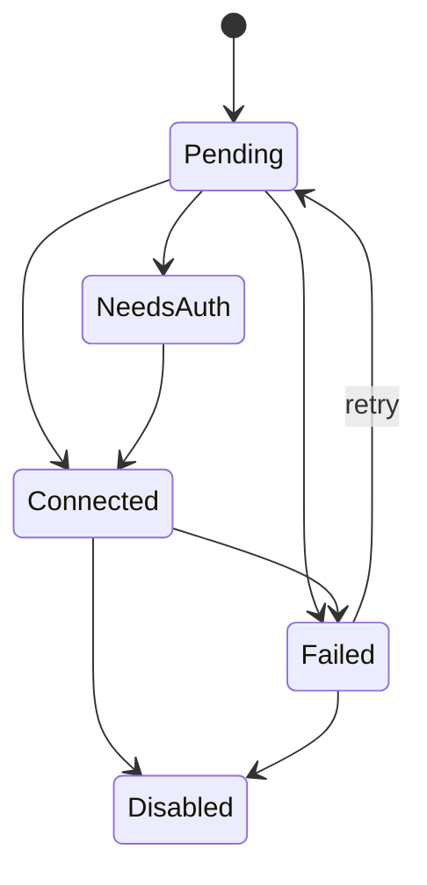
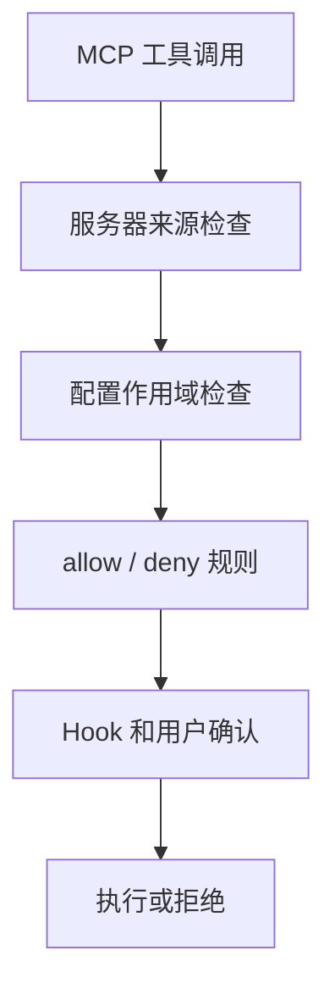
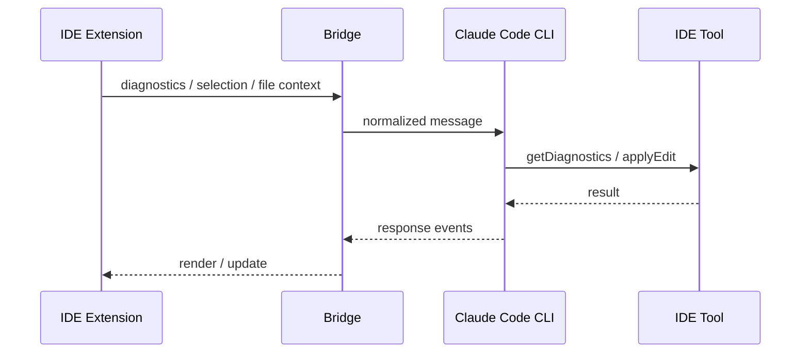

# 第 12 章：MCP 集成与外部协议

原课程对应：`第三部分-高级模式篇/12-MCP集成与外部协议.md`

> 本章讨论 Claude Code 如何通过 MCP 把外部工具、数据源、IDE 和远程服务接入 Harness。重点不是会写一个 `.mcp.json`，而是理解协议层、工具映射、权限边界和 Bridge 通信为什么要分层设计。

## 学习目标

读完本章后，你应该能够：

- 理解 MCP 要解决的集成碎片化问题，以及它为什么像 Agent 世界的标准外设接口。
- 区分 stdio、SSE、HTTP、WebSocket、SDK、IDE 专用传输等不同接入方式。
- 说清 MCP 服务器连接状态、重试、认证和禁用之间的生命周期。
- 理解 MCP 工具如何从外部协议映射为 Claude Code 内部工具。
- 掌握 `mcp__server__tool` 命名规则和它在权限隔离中的作用。
- 解释 MCP 的配置作用域、企业白名单/黑名单、插件去重和 IDE 工具白名单。
- 理解 Bridge 系统如何支撑 IDE 与 claude.ai 的双向通信和远程控制。

## 12.0 先看全景：MCP Server 如何变成 Claude Code 工具

MCP 最容易被误解成“一个插件市场”或“一个外部工具”。更准确的理解是：MCP 是外部能力进入 Agent Harness 的协议适配层。外部服务器声明能力，Claude Code 连接、发现、映射、注册，然后仍然走内部工具系统和权限管线。



读图结论：

- MCP Server 不直接控制 Claude Code，只声明可用能力。
- MCP 工具进入内部后，和内置工具一样要被过滤、校验、授权和审计。
- `mcp__server__tool` 不是随意命名，而是把“来自哪个服务器”和“具体哪个工具”写进工具名。

### `mcp__server__tool` 名称拆解

```text
mcp__github__create_issue
 |     |        |
 |     |        -> tool：服务器暴露的具体工具
 |     -> server：MCP 服务器名或配置名
 -> mcp：说明这是外部 MCP 工具，不是内置工具
```

这个命名有三个作用：

| 作用 | 为什么重要 |
|------|------------|
| 避免重名 | 内置 `read` 和某个外部 `read` 不会混在一起 |
| 权限隔离 | 策略可以针对某个 MCP Server 或某个工具生效 |
| 审计清楚 | 日志里能看出动作来自哪个外部能力 |

### 传输方式先按边界理解

| 接入方式 | 边界感 | 适合先记什么 |
|----------|--------|--------------|
| `stdio` | 本地子进程 | 最常见，本地开发优先理解它 |
| `http` / `sse` | 远程服务 | 重点看认证、延迟和服务可用性 |
| `ws` | 实时双向连接 | 适合理解长期连接和推送 |
| `sdk` | 宿主进程内调用 | 信任边界更多交给宿主应用 |
| IDE Bridge | IDE 专用通道 | 重点看白名单、权限回调和双向消息 |

## 12.1 MCP 架构概览

MCP 是 Model Context Protocol 的缩写。它解决的核心问题是：Agent 需要访问很多外部系统，但每个系统都单独适配会造成碎片化。

没有 MCP 时，每个 AI 工具都可能为 GitHub、数据库、文件系统、浏览器、知识库写一套自己的连接方式。工具提供方也要为不同 AI 平台重复开发。MCP 试图把这件事标准化：

```text
外部系统实现 MCP Server
  -> 声明自己有哪些工具、资源和能力
Claude Code 实现 MCP Client
  -> 连接服务器
  -> 发现能力
  -> 映射为内部工具
  -> 经过权限管线后调用
```

从 Claude Code 内部看，MCP 不是绕过工具系统的新通道，而是外部工具进入内部工具系统的一层适配器。MCP 工具一旦被注册，就要和内置工具一样参与工具列表、权限检查、Hook 拦截、上下文回填和 UI 展示。

```text
Claude Code
  工具系统
    -> MCP 适配层
      -> stdio / SSE / HTTP / WebSocket / SDK
        -> 外部 MCP Server
  权限管线
  Hook 系统
  对话循环
```

### 12.1.1 为什么需要 MCP：问题与解决方案

MCP 的价值可以从两边看。

对工具提供方来说，它只需要实现一个 MCP Server，就可以被多个支持 MCP 的 Agent 使用。它不用理解每个 Agent 的内部工具注册格式，也不用为每个客户端写专用插件。

对 Agent Harness 来说，它只需要实现一个 MCP Client，就能接入一批外部能力。它不用把 GitHub、数据库、搜索、知识库、IDE 都写成内置工具。

这背后有三个设计原则：

| 原则 | 含义 | 对 Claude Code 的影响 |
|------|------|----------------------|
| 协议即契约 | 服务器先声明工具、资源、参数和能力，客户端按协议调用 | 外部能力可以被统一发现、映射和校验 |
| 传输无关 | 协议语义不绑定具体通信方式 | 本地进程、远程 HTTP、WebSocket、SDK 都能接入 |
| 安全内嵌 | 外部能力默认不可信，连接、注册、调用都要受控 | MCP 工具仍需经过权限管线和策略过滤 |

易学理解：MCP 像一套标准插口。插口定义了“设备怎么描述自己、怎么收请求、怎么返回结果”。但插上设备不代表它可以随便操作电脑。Claude Code 仍然要决定这个设备可不可信、能不能用、每个动作是否需要确认。

### 12.1.2 支持的传输协议

MCP 协议本身不绑定某一种传输。Claude Code 支持多种连接方式，用来覆盖本地工具、远程服务、IDE 集成和 SDK 嵌入。

| 协议类型 | 易学理解 | 适合场景 | 主要取舍 |
|----------|----------|----------|----------|
| `stdio` | 启动本地子进程，通过标准输入输出通信 | 本地文件系统、CLI 工具、开发环境工具 | 延迟低，部署简单，但依赖本机环境 |
| `sse` | 基于 HTTP 的服务器推送 | 远程 MCP 服务、云端工具 | 易部署，但有网络延迟和认证问题 |
| `http` | 流式 HTTP 协议 | 新式远程 MCP 服务 | 更贴近现代 HTTP 基础设施 |
| `ws` | WebSocket 全双工通信 | 需要实时双向通信的服务 | 双向能力强，但连接管理更复杂 |
| `sse-ide` | IDE 专用 SSE 变体 | VS Code、JetBrains 等 IDE 扩展 | 附带 IDE 元数据和白名单限制 |
| `ws-ide` | IDE 专用 WebSocket 变体 | 需要低延迟双向通信的 IDE | 实时性好，但权限边界更敏感 |
| `sdk` | 进程内函数调用 | 第三方应用嵌入 Claude Code SDK | 几乎无通信开销，但信任边界交给宿主应用 |
| `claudeai-proxy` | claude.ai 平台代理 | 平台连接器 | 依赖平台能力和账号状态 |

选型可以按这个流程判断：

```text
MCP Server 在本机吗？
  -> 是：优先 stdio
  -> 否：继续判断

是否是 IDE 扩展？
  -> 是：使用 sse-ide 或 ws-ide
  -> 否：继续判断

是否需要服务器主动频繁推送？
  -> 是：WebSocket
  -> 否：SSE 或 HTTP

是否是 SDK 内嵌场景？
  -> 是：SDK 类型
```

默认建议是：本地开发优先 `stdio`。它简单、低延迟、生命周期容易跟随 CLI 管理。只有当服务必须远程部署、多人共享或依赖云端资源时，再考虑 HTTP/SSE/WebSocket。

一个典型 stdio 配置示例：

```json
{
  "mcpServers": {
    "filesystem": {
      "type": "stdio",
      "command": "npx",
      "args": ["-y", "@modelcontextprotocol/server-filesystem", "/tmp"],
      "env": {}
    }
  }
}
```

需要注意：stdio 服务器启动时不应做过重初始化。Claude Code 可能在启动阶段连接多个 MCP Server，如果某个服务器启动很慢，会拖慢整体体验。重型资源更适合延迟到首次工具调用时再初始化。

### 12.1.3 连接管理器 MCPConnectionManager

Claude Code 需要在 UI 和工具系统中共享 MCP 连接状态。连接不能散落在各个组件里分别维护，否则会出现重复连接、状态不一致和清理困难。

`MCPConnectionManager` 可以理解为 MCP 连接的集中管理层。它提供两个核心动作：

| 动作 | 作用 |
|------|------|
| `reconnect` | 重新连接某个服务器，并刷新工具、命令、资源列表 |
| `toggle` | 启用或禁用某个服务器，启用时连接，禁用时断开并移除工具 |

在 React UI 中，它以 Context Provider 的方式把能力提供给子组件。子组件通过 Hook 获取重连或切换函数，而不是自己创建 MCP Client。

易学理解：

```text
MCPConnectionManager
  -> 保存每个服务器的连接状态
  -> 统一处理重连和启停
  -> 把最新工具列表交给工具系统
  -> 给 UI 提供一致状态
```

这种设计让连接管理“集中管控，分散使用”。组件可以请求重连或开关服务器，但真正的连接生命周期由管理器统一处理。

### 12.1.4 服务器连接状态与生命周期

MCP 服务器不是只有“连上”和“没连上”两种状态。原课程列出了一套更细的状态机：

| 状态 | 含义 | 用户体验 |
|------|------|----------|
| `Connected` | 连接成功，工具可用 | 工具进入可用列表 |
| `Failed` | 连接失败，并记录错误原因 | UI 可显示失败信息 |
| `NeedsAuth` | 需要认证或凭证过期 | 用户需要登录或补充凭证 |
| `Pending` | 等待重试连接 | 系统可指数退避重试 |
| `Disabled` | 用户或策略禁用 | 不再自动重连，工具移除 |

状态转换可以这样理解：

```text
启动连接
  -> 成功：Connected
  -> 网络失败：Failed -> Pending -> 重试
  -> 需要登录：NeedsAuth -> 用户认证 -> Connected
  -> 用户禁用：Disabled
```

`Pending` 状态通常会使用指数退避：第一次很快重试，后续等待时间逐步增加。这样可以避免服务器不可用时频繁重连造成额外压力，又能在短暂故障恢复后尽快恢复工具。

连接状态直接影响工具可见性：只有 `Connected` 的 MCP Server 才能把工具注册进 Claude Code。服务器断开、禁用或认证失败后，相关工具应从可用列表移除，避免模型继续调用已经不可用的外部能力。

## 12.2 MCP 工具集成

MCP 工具集成的任务是把外部服务器声明的工具，变成 Claude Code 内部 `Tool` 对象。

这个过程分成三步：

```text
工具发现
  -> 向 MCP Server 请求 tools/list
  -> 得到名称、描述、参数 schema、行为注解

工具映射
  -> 清理外部输入
  -> 生成内部工具名
  -> 把 MCP 注解映射为内部工具属性

工具注册
  -> 进入 Claude Code 工具系统
  -> 受权限、Hook、并发调度和延迟加载控制
```

### 12.2.1 工具发现与映射

当 MCP Server 连接成功后，Claude Code 会请求它的工具列表。服务器返回的不是函数实现，而是工具元信息：

- 工具名
- 描述
- 输入参数 schema
- 行为注解，例如是否只读、是否破坏性、是否访问开放世界
- 可选元数据，例如是否应该总是加载

这些信息会被转换成 Claude Code 内部工具对象。

映射时需要做几件事：

| 步骤 | 为什么需要 |
|------|------------|
| Unicode 清理 | 外部工具名和描述不可信，要移除控制字符或非法字符 |
| 命名空间处理 | 避免不同服务器的同名工具冲突 |
| Schema 转换 | 让模型和运行时都能理解参数约束 |
| 行为注解桥接 | 把 MCP 的 hint 转成内部并发、安全和权限判断依据 |
| 延迟加载判断 | 避免所有 MCP 工具描述一次性挤进上下文 |

MCP 工具常见内部属性：

| 内部属性 | 来源 | 作用 |
|----------|------|------|
| `isMcp` | 固定标记 | 区分外部工具和内置工具 |
| `mcpInfo` | 服务器名、原始工具名 | 用于权限、日志和 UI 展示 |
| 并发安全判断 | `readOnlyHint` 等注解 | 决定能否和其他工具并行 |
| 破坏性判断 | `destructiveHint` | 影响确认提示和风险等级 |
| 开放世界判断 | `openWorldHint` | 判断是否接触外部网络或不可控系统 |
| `alwaysLoad` | MCP 元数据 | 决定是否跳过延迟加载 |

这里要注意 hint 的含义。MCP Server 声明某工具只读，只是一个外部声明。Claude Code 可以参考它做并发和权限判断，但不能把它当成绝对可信事实。外部工具仍然要经过内部权限管线。

### 12.2.2 工具名称前缀：mcp__server__tool

MCP 工具默认使用三段式命名：

```text
mcp__{server}__{tool}
```

例如：

```text
mcp__github__create_issue
mcp__filesystem__read_file
mcp__database__query
```

这个命名规则有两个作用。

第一，避免冲突。两个 MCP Server 都可以提供 `read_file`，但注册成 `mcp__docs__read_file` 和 `mcp__filesystem__read_file` 后就不会混淆。

第二，隔离权限。用户允许 `mcp__github__*`，只代表允许 GitHub 服务器的 MCP 工具，不代表允许所有 MCP 工具，也不代表允许内置工具。

权限配置示例：

```json
{
  "permissions": {
    "allow": [
      "mcp__github__create_issue",
      "mcp__filesystem__read_file"
    ]
  }
}
```

解析规则可以这样看：

| 工具名 | 服务器 | 工具 |
|--------|--------|------|
| `mcp__github__create_issue` | `github` | `create_issue` |
| `mcp__my_server__read_file` | `my_server` | `read_file` |
| `mcp__my__special__tool` | 可能被解析为 `my` | `special__tool` |

因此服务器名最好避免双下划线。双下划线是分隔符，不适合再出现在服务器名中。

有一个特殊场景是 SDK 模式。在某些 SDK 嵌入用法里，可以关闭 MCP 前缀，让外部工具用原始名称注册，甚至覆盖内置工具。这是高级能力，适合宿主应用明确掌控运行环境时使用。普通用户和普通 MCP Server 不应该依赖这种方式。

### 12.2.3 MCP 工具的权限模型

MCP 工具来自外部服务器，默认应该更保守。原课程强调的原则是：默认拒绝或要求用户确认，显式规则才自动允许。

权限判断可以分成四层：

```text
企业策略
  -> allowedMcpServers / deniedMcpServers
IDE 白名单
  -> IDE 类型服务器只允许少数安全工具
用户权限配置
  -> allow / deny 精确或通配匹配
运行时确认
  -> 未命中规则时询问用户
```

用户可以在权限配置中预授权：

| 规则 | 含义 | 风险 |
|------|------|------|
| `mcp__github__create_issue` | 只允许一个具体工具 | 风险较低 |
| `mcp__github__*` | 允许 GitHub 服务器所有工具 | 取决于服务器可信度 |
| `mcp__*` | 允许所有 MCP 工具 | 高风险，不建议全局使用 |

不要把 MCP 工具当成“接进来就可信”。即使工具名叫 `read_file`，它也可能来自第三方服务器，真实行为取决于服务器实现。Harness 的职责是：在连接时过滤服务器，在注册时隔离命名空间，在调用时执行权限检查。

## 12.3 MCP 权限与安全

MCP 增强了扩展性，也扩大了信任边界。内置工具至少由 Claude Code 自己实现，MCP 工具则可能来自本地 npm 包、远程 HTTP 服务、企业服务器、IDE 扩展或 SDK 宿主应用。

所以 MCP 安全不能只靠“工具调用时问一下用户”。更稳妥的设计是多层防御：

- 配置作用域控制谁能添加服务器。
- 企业策略控制哪些服务器能连接。
- 工具命名空间隔离权限规则。
- IDE 工具白名单压缩攻击面。
- 插件去重避免重复连接和伪装。
- 运行时确认处理未明确授权的动作。

### 12.3.1 配置范围与作用域

MCP Server 配置可以来自多个作用域。每个作用域代表不同管理级别和使用场景。

| 作用域 | 配置来源 | 适合场景 |
|--------|----------|----------|
| `local` | 项目本地个人配置 | 当前项目个人实验，不提交版本库 |
| `project` | 项目共享配置 | 团队共同使用的 MCP Server |
| `user` | 用户全局配置 | 跨项目通用服务，例如个人 GitHub |
| `dynamic` | 运行时添加 | 当前会话临时使用 |
| `enterprise` | 企业配置 | 组织批准或禁止的服务器策略 |
| `claudeai` | claude.ai 平台连接器 | 平台侧接入能力 |
| `managed` | 托管策略 | IT 或管理员强制配置 |

这些作用域不是简单谁后出现谁覆盖。更准确的理解是：

```text
企业/托管策略：硬约束
项目配置：团队共享
用户配置：个人全局
local 配置：当前项目个人偏好
dynamic：会话临时配置
claudeai：平台连接能力
```

最佳实践：

| 需求 | 建议作用域 |
|------|------------|
| 公司统一批准的 MCP 服务 | enterprise 或 managed |
| 团队仓库必须使用的服务 | project |
| 个人跨项目常用服务 | user |
| 不想提交给团队的本地测试服务 | local |
| 临时试用一个服务器 | dynamic |

### 12.3.2 服务器审批与白名单

企业环境中，MCP Server 不能完全由个人随意接入。因为服务器一旦连接成功，就可以向模型暴露工具、资源和技能，甚至影响模型行为。

审批机制通常由两个列表组成：

| 策略 | 含义 | 优先级 |
|------|------|--------|
| `deniedMcpServers` | 明确禁止的服务器 | 最高，命中后直接拒绝 |
| `allowedMcpServers` | 明确允许的服务器 | 如果配置了白名单，不在其中的都拒绝 |

匹配方式可以按三类：

| 匹配方式 | 适用服务器 | 例子 |
|----------|------------|------|
| 服务器名 | 所有类型 | 禁止名为 `dangerous-server` 的配置 |
| 命令数组 | `stdio` | 禁止某个 `npx ...` 启动命令 |
| URL 模式 | 远程服务器 | 只允许 `https://mcp.company.com/*` |

为什么 stdio 要按命令数组匹配？因为只按服务器名很容易绕过：用户把 `dangerous` 改名成 `safe`，底层启动命令仍然一样。按实际命令匹配更接近“它到底启动了什么”。

过滤流程：

```text
读取一个 MCP Server 配置
  -> SDK 类型通常由宿主应用负责安全边界
  -> 命中 deniedMcpServers：阻止
  -> 存在 allowedMcpServers 且未命中：阻止
  -> 其他情况：允许进入连接流程
```

白名单是更严格的策略。它适合安全要求高的组织：默认不允许任何外部 MCP，只有审批过的服务器可以连接。

### 12.3.3 插件去重

同一个 MCP Server 可能通过多个路径出现：

- 用户手动配置了一个服务器。
- 插件也声明了同一个服务器。
- claude.ai 连接器又带来了同一个远程服务。

如果不去重，后果包括：

- 同一个服务器被连接多次，浪费资源。
- 同名工具重复出现，模型选择变混乱。
- 同一外部系统收到重复请求，可能产生副作用。
- 权限配置和日志难以解释。

去重通常要基于“实际连接目标”，而不是配置名称。

| 类型 | 去重签名 | 说明 |
|------|----------|------|
| `stdio` | `command + args` | 只要启动的是同一个命令，就视为重复 |
| 远程服务 | URL | 指向同一 URL 视为重复 |
| `sdk` | 通常不去重 | SDK 可能由不同宿主代码注册不同能力 |

当重复出现时，保留优先级大致是：

```text
手动配置
  > 插件配置
  > 平台连接器
```

这体现了一个实用原则：用户显式写下的配置最能代表当前意图，自动注入的配置不应覆盖它。

### 12.3.4 IDE 工具白名单

IDE 集成是 MCP 的特殊场景。IDE 扩展本身可能来自第三方，如果它能任意暴露工具，攻击面会非常大。

因此 IDE 类型 MCP Server 需要额外白名单。原课程列出的核心允许工具是：

| 工具 | 用途 | 风险控制 |
|------|------|----------|
| `mcp__ide__executeCode` | 在 IDE 环境中执行代码或应用操作 | 受 IDE 集成边界和权限管线限制 |
| `mcp__ide__getDiagnostics` | 获取 IDE 中的错误、警告和诊断信息 | 只读信息，风险相对低 |

白名单检查最好发生在工具发现阶段。也就是说，不允许的 IDE 工具根本不注册进 Claude Code 工具系统，模型也看不到它们。相比“注册后再拒绝调用”，这种方式更清晰、更省 token，也减少了误调用机会。

## 12.4 IDE 集成：Bridge 系统

Bridge 系统负责 Claude Code 与 IDE、claude.ai 等外部环境的双向通信。MCP 让外部工具进入 Claude Code；Bridge 则让外部界面和远程控制能力与 CLI 会话协作。

它不是简单转发日志，而是一个通信中间层：

```text
外部世界
  -> VS Code / JetBrains / claude.ai
Bridge
  -> 传输层
  -> 消息路由
  -> 去重
  -> 认证
  -> 权限门控
Claude Code
  -> REPL / 对话循环 / 工具系统
```

### 12.4.1 架构概览

Bridge 系统要处理多类需求：

| 需求 | 为什么复杂 |
|------|------------|
| 多传输协议 | 要兼容旧版和新版通道 |
| 双向通信 | CLI 要发消息出去，也要接收外部输入 |
| 多会话并行 | 用户可能同时开多个终端或 IDE 窗口 |
| 远程控制 | 外部可以请求切模型、中断、调权限模式 |
| 安全门控 | 不是所有账号、组织和功能标志都允许远程控制 |
| 消息去重 | 网络重连和重投递不能导致重复执行 |

核心模块可以按职责理解：

| 模块方向 | 职责 |
|----------|------|
| API 客户端 | 和 claude.ai 后端通信 |
| 传输适配器 | 封装 v1、v2、SSE、WebSocket 等差异 |
| 消息路由 | 区分权限响应、控制请求和普通用户消息 |
| 去重集合 | 记住最近处理过的消息 ID |
| REPL 桥接 | 把外部输入交给 CLI 会话 |
| 权限门控 | 检查订阅、profile、组织和功能开关 |
| 认证工具 | 管理 OAuth token、刷新和重试 |

Bridge 的设计目标是：上层 REPL 不必关心外部消息来自 VS Code、JetBrains 还是网页端；传输层差异被封装在统一接口后面。

### 12.4.2 双向通信层

Bridge 有两个方向的数据流。

出站流：CLI 到外部。

```text
Claude Code 产生消息
  -> 对话文本
  -> 工具调用和结果
  -> 状态变化
  -> 错误诊断
  -> Bridge 发送给 IDE 或 claude.ai
```

入站流：外部到 CLI。

```text
IDE 或 claude.ai 发来消息
  -> 权限响应
  -> 控制请求
  -> 用户输入
  -> Bridge 路由到对应处理器
```

入站更复杂，因为它可能改变本地会话状态。原课程把入站处理分成三类：

| 消息类型 | 处理方式 |
|----------|----------|
| 权限响应 | 直接交给权限管线，表示用户在外部界面允许或拒绝某动作 |
| 控制请求 | 检查是否允许入站控制，再执行切模型、中断等操作 |
| 用户消息 | 先做回声过滤和重复投递过滤，再交给对话循环 |

为什么需要回声过滤？因为 CLI 发出去的消息可能又从外部通道返回。如果不识别它，系统可能把自己刚发出的内容当成新用户输入。

为什么需要重复投递过滤？网络重试、SSE 重连或服务端重放都可能让同一消息出现多次。Bridge 用有界 UUID 集合记录最近处理过的消息 ID。这个集合容量固定，既能防近期重复，又不会让长期会话内存无限增长。

### 12.4.3 控制协议

Bridge 支持外部发送控制请求来管理本地 CLI 会话。常见控制类型：

| 控制请求 | 作用 |
|----------|------|
| `initialize` | 初始化握手，交换能力、命令、模型和账户信息 |
| `set_model` | 远程切换模型 |
| `set_max_thinking_tokens` | 调整思考 token 预算 |
| `set_permission_mode` | 切换权限模式 |
| `interrupt` | 中断当前执行 |

控制协议的设计重点是“控制面要小”。能从外部改变本地 CLI 状态的命令越多，安全审计越困难。因此 Bridge 只暴露少数明确命令，每个命令都有清晰语义。

`initialize` 是特殊的。它通常是只读握手，用来告诉外部客户端当前 CLI 支持什么能力。即使在 outbound-only 模式下，它也可以被允许。

其他可变请求则不同。如果当前是 outbound-only 模式，外部只能看 CLI 输出，不能控制本地会话。这时 `set_model`、`interrupt` 等请求应该被拒绝。

流程：

```text
收到控制请求
  -> 如果是 initialize：返回能力信息
  -> 否则检查是否 outbound-only
  -> outbound-only：拒绝可变控制
  -> 允许入站控制：执行请求并返回结果
```

`interrupt` 的优先级通常很高。用户点击中断时，系统应尽快停止当前执行，而不是等一长串普通处理逻辑结束。

### 12.4.4 传输层抽象

Bridge 传输层用统一接口隐藏底层通信差异。上层只关心：

```text
connect()
disconnect()
send(message)
subscribe(handler)
```

底层可以是 v1，也可以是 v2。

| 版本 | 传输方式 | 状态 |
|------|----------|------|
| v1 | WebSocket 读取 + HTTP POST 写入 | 历史方案，仍需兼容 |
| v2 | SSE 读取 + CCR Client 写入 | 新方向，更适合长会话和多会话 |

v2 的几个关键改进：

| 改进 | 解决的问题 |
|------|------------|
| SSE 序列号延续 | 重连后只补发缺失消息，避免完整历史重放 |
| Epoch 管理 | 区分旧连接迟到消息和新连接消息 |
| 心跳续租 | 检测连接活性，触发重连 |
| 每实例认证闭包 | 多会话下 token 不互相污染 |

序列号延续可以这样理解：

```text
连接 A 收到消息 1-5
网络断开
客户端重连时告诉服务器：我已处理到 5
服务器从 6 开始继续发
```

如果没有这个机制，长会话重连时可能重放大量历史消息，造成带宽浪费、重复处理和 UI 抖动。

每实例认证也很重要。旧设计如果用全局 token，多会话同时运行时，一个会话刷新 token 可能影响另一个会话。v2 让每个传输实例持有自己的认证上下文，隔离性更好。

### 12.4.5 VS Code 和 JetBrains 扩展集成

IDE 扩展通过 `sse-ide` 或 `ws-ide` 类型 MCP Server 接入 Claude Code。它们在普通 MCP 传输基础上增加 IDE 元数据，例如 IDE 名称、运行平台和本地连接信息。

典型流程：

```text
IDE 扩展启动本地 MCP Server
  -> 把服务器 URL 传给 Claude Code
  -> Claude Code 建立 sse-ide 或 ws-ide 连接
  -> 请求 tools/list
  -> 只注册 IDE 白名单工具
  -> 模型可调用 getDiagnostics 或 executeCode
```

IDE 集成给 Claude Code 带来两个关键能力：

| 能力 | 意义 |
|------|------|
| 获取诊断信息 | 模型能看到 IDE 中实时类型错误、lint 警告和编译问题 |
| 在 IDE 上下文执行 | 修复可以结合 IDE 的项目配置、运行环境和编辑状态 |

这比“用户复制错误到终端”更强，因为诊断信息可以结构化获取，且更贴近用户实际编辑环境。

不过 IDE 集成仍然受权限系统约束。通过 IDE 执行动作不是绕过权限，而是另一类 MCP 工具调用，仍应经过工具注册、白名单、权限管线和 Hook。

### 12.4.6 Bridge 权限门控

Bridge 远程控制能力风险更高，因为它允许外部系统影响本地 CLI 会话。因此它需要多层门控。

原课程提到的检查可以理解为四关：

```text
是否使用 claude.ai 订阅账号
  -> token profile 是否完整
  -> 是否有组织 UUID
  -> 远程 Bridge 功能标志是否开启
  -> 全部通过后才允许 Bridge 功能
```

每一关都解决不同问题：

| 检查 | 目的 |
|------|------|
| 订阅类型 | 确认当前账号支持该平台能力 |
| Profile 完整性 | 确认 token 权限足够 |
| 组织信息 | 支持组织级策略和审计 |
| 功能标志 | 支持灰度发布和按范围启用 |

认证上，Bridge 使用 Bearer Token。请求返回 401 时，可以尝试刷新 token，再重试原请求。

```text
发送请求
  -> 成功：返回结果
  -> 401：刷新 token
  -> 用新 token 重试
  -> 仍失败：报告 Bridge 不可用或认证失效
```

这种设计把用户体验和安全性结合起来：token 短暂过期时自动恢复；真正认证失败时，不继续盲目重试。

## 12.5 关键流程图补强

### 图 1：MCP 连接状态机



### 图 2：工具发现与命名映射

```text
MCP server
  -> list tools
  -> 映射为内部工具定义
  -> 命名为 mcp__server__tool
  -> 进入工具注册系统
  -> 继续走权限管线
```

### 图 3：MCP 权限模型



### 图 4：IDE Bridge 双向通信



## 实战练习

### 练习 1：配置一个 stdio 类型的 MCP 服务器

在项目根目录创建 `.mcp.json`：

```json
{
  "mcpServers": {
    "filesystem": {
      "type": "stdio",
      "command": "npx",
      "args": ["-y", "@modelcontextprotocol/server-filesystem", "/tmp"],
      "env": {}
    }
  }
}
```

启动后观察：

- 服务器是否进入 Connected。
- 工具名是否带 `mcp__filesystem__` 前缀。
- 断开或禁用服务器后，工具是否从列表消失。
- 未配置 allow 时，工具调用是否需要确认。

进阶：只自动允许只读工具，保留写入工具确认。

### 练习 2：理解工具名称解析

分析这些名称：

| 名称 | 解析结果 |
|------|----------|
| `mcp__github__create_issue` | server=`github`，tool=`create_issue` |
| `mcp__my_server__read_file` | server=`my_server`，tool=`read_file` |
| `mcp__my__special__tool` | 可能产生歧义，应避免服务器名含双下划线 |

进阶：为 `github` 和 `git_hub` 两个服务器分别写权限规则，确保同名工具不会互相影响。

### 练习 3：配置企业级 MCP 安全策略

设计策略：

```json
{
  "allowedMcpServers": [
    { "serverName": "approved-server" },
    { "serverUrl": "https://mcp.company.com/*" }
  ],
  "deniedMcpServers": [
    { "serverName": "dangerous-server" }
  ]
}
```

思考：

- 黑名单和白名单同时命中时谁优先？
- 如果用户在 local 配置中添加了未审批服务器，是否应连接？
- 如何只允许公司域名下的远程 MCP？
- stdio 服务器是否需要按命令数组审批？

### 练习 4：多服务器集成实战

模拟一个开发环境：

```json
{
  "mcpServers": {
    "github": {
      "type": "stdio",
      "command": "npx",
      "args": ["-y", "@modelcontextprotocol/server-github"],
      "env": { "GITHUB_PERSONAL_ACCESS_TOKEN": "ghp_xxxx" }
    },
    "database": {
      "type": "sse",
      "url": "https://internal-mcp.company.com/database"
    },
    "docs": {
      "type": "stdio",
      "command": "npx",
      "args": ["-y", "@modelcontextprotocol/server-brave-search"]
    }
  }
}
```

分析：

- 每个服务器的工具完整名称是什么？
- GitHub 服务器失败时，数据库和 docs 是否应受影响？
- 哪些工具可以自动允许，哪些必须每次确认？
- 如果插件也提供了同一个 docs 服务器，谁胜出？

### 练习 5：理解 Bridge 通信流程

场景 A：用户在 VS Code 中发送“修复所有 TypeScript 错误”。

你需要能说清：

- 消息如何从 IDE 到达 CLI。
- Claude Code 如何通过 `getDiagnostics` 获取错误。
- 修复后如何通过 IDE 通道应用或验证。
- 这些工具为什么仍受白名单和权限管线约束。

场景 B：用户在 claude.ai 网页端远程控制 CLI。

你需要能解释：

- `initialize` 为什么可以在受限模式下执行。
- `set_model` 为什么属于可变控制，需要额外授权。
- `interrupt` 如何尽快影响当前执行。
- 没有订阅、profile 不完整或功能标志关闭时，Bridge 会在哪一层被拒绝。

## 关键要点

1. MCP 是外部能力接入协议，不是绕过 Claude Code 工具系统的特殊通道。
2. MCP 的三大设计原则是协议契约、传输无关和安全内嵌。
3. 本地开发优先使用 stdio；远程共享服务可用 SSE、HTTP 或 WebSocket；SDK 类型适合宿主应用嵌入。
4. MCP 服务器生命周期需要细分 Connected、Failed、NeedsAuth、Pending 和 Disabled，工具可见性应跟随连接状态变化。
5. MCP 工具通过发现、映射、注册进入内部工具系统，并继续受权限、Hook 和并发调度约束。
6. `mcp__server__tool` 命名规则同时解决名称冲突和权限隔离。
7. MCP 工具默认应该保守处理，显式 allow 才自动放行，不建议全局允许 `mcp__*`。
8. MCP 安全依赖多层防御：配置作用域、企业审批、插件去重、IDE 白名单和运行时确认。
9. Bridge 系统负责 IDE 和 claude.ai 的双向通信，核心难点是传输抽象、去重、控制协议、认证和多会话隔离。
10. IDE 集成通过少数白名单工具提供实时诊断和执行能力；它增强上下文感知，但不应绕开权限体系。

Bridge 增强的是上下文和交互，不是权限豁免。IDE 工具仍然应该在白名单和权限管线内运行。
