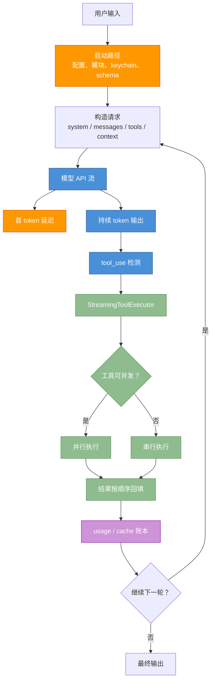
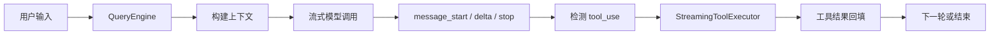
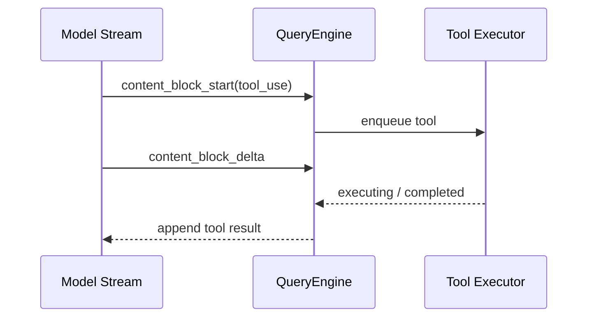
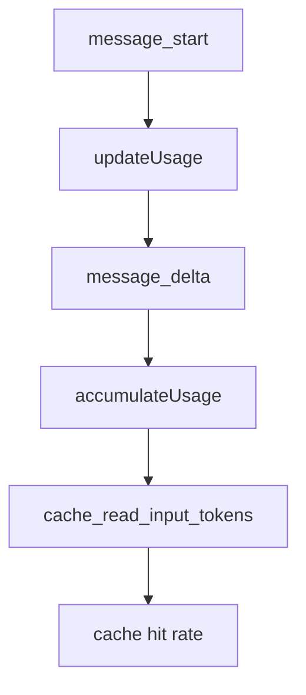

# 第 13 章：流式架构与性能优化

原课程对应：`第四部分-工程实践篇/13-流式架构与性能优化.md`

> Agent 的性能不是只看模型快不快。真实体验来自流式响应、工具并发、启动路径、token 成本和缓存命中率共同作用。

## 学习目标

读完本章后，你应该能够：

- 理解 QueryEngine 如何管理一次查询的生命周期。
- 说明 token 流、工具调用块和工具执行如何组成流式数据流。
- 掌握 StreamingToolExecutor 的并发控制、顺序输出和错误级联。
- 理解启动性能优化为什么要关注并行预取、延迟加载和惰性 schema。
- 知道 token 成本追踪和缓存优化如何影响 Agent 生产成本。

## 13.0 先看全景：性能不是一个指标

读这一章时不要只盯着“模型输出快不快”。Agent Harness 的性能由多条路径共同决定：模型首 token、流式渲染、工具并发、启动路径、上下文大小、缓存命中和 token 成本。



读图结论：

- “流式输出”解决的是感知延迟和中间状态可见，不等于总耗时一定变短。
- “工具并发”只对并发安全工具有效，写文件、共享状态、顺序依赖仍然要串行。
- “缓存命中”影响的不只是成本，也会影响后续请求延迟。

### 性能问题先定位到哪一段

| 现象 | 优先排查 | 对应小节 |
|------|----------|----------|
| 一开始很久没有输出 | 启动路径、首 token、请求构造过重 | 13.1、13.3 |
| token 已输出但工具迟迟不动 | tool_use 检测、参数 JSON 拼接、权限等待 | 13.1、13.2 |
| 多个工具看起来互相阻塞 | 并发安全判断、串行工具、结果顺序缓冲 | 13.2 |
| 成本突然升高 | usage 累加、缓存断裂、上下文变大 | 13.4、13.5 |
| fork 后缓存命中下降 | system/tool/messages 前缀是否字节级一致 | 13.5 |

## 13.1 流式 API 交互

流式架构的目标不是让输出“看起来更快”，而是让 Agent 的中间过程可观察、可中断、可调度。

### 13.1.1 QueryEngine：查询生命周期的管理者

QueryEngine 管理的是完整查询生命周期，而不是单次 API 调用。

它需要协调：

- 用户输入。
- 消息历史。
- 系统提示。
- 工具定义。
- 模型流式响应。
- 工具调用和结果。
- token 用量。
- 错误和终止原因。

在 Harness 中，QueryEngine 类似运行时调度中心。UI、SDK、后台任务都可以把请求交给它，但核心循环和状态管理应该保持统一。

原课程这里强调一个很重要的工程原则：**一次会话最好只有一个 QueryEngine 拥有查询状态**。原因不是“类设计更优雅”，而是为了避免状态分散后难以恢复和调试。

QueryEngine 通常会持有这些状态：

| 状态 | 用途 | 为什么不能散落各处 |
|------|------|--------------------|
| `messages` | 当前会话的消息历史 | 决定下一轮模型输入，顺序错了会影响语义 |
| `AbortController` | 用户中断、超时、父子任务取消 | 中断必须能同时影响模型流和工具流 |
| permission denials | 权限拒绝记录 | 后续模型需要知道哪些动作不能再尝试 |
| usage | token 与缓存用量 | 成本统计要跨多轮累加 |
| file cache | 文件读取缓存 | 避免重复读，也保证上下文一致 |
| discovered skills | 已发现的技能 | 影响工具和提示词暴露 |

这个原则可以叫 single ownership：状态可以被多个模块读取，但应该由一个明确的生命周期管理者更新。否则 UI、工具执行器、压缩器、子 Agent 都各自维护一份状态，最后很容易出现“屏幕上显示 A，下一轮模型看到 B，日志里记录 C”的问题。

### 13.1.2 Token 流的实时接收

模型响应不是一次性到达，而是以 token 或事件块逐步返回。

实时接收 token 的价值：

- 用户能更快看到反馈。
- UI 可以展示思考、输出和工具调用进度。
- 系统可以在异常时更早中断。
- Trace 可以记录更细粒度的过程。

这也要求 Harness 不能只处理“最终文本”，而要处理事件流。

在实现上，`submitMessage` 这类入口更适合设计成 `AsyncGenerator`：

```text
for await (event of queryEngine.submitMessage(input)) {
  render(event)
  recordTrace(event)
  maybeStartTool(event)
}
```

这样调用方不必等完整结果，可以边接收、边展示、边调度。模型 API 的事件通常会包含 `message_start`、`message_delta`、`message_stop` 一类阶段，usage 统计也要跟着这些阶段更新：

- `message_start`：建立本轮响应的上下文，可能拿到初始 usage 或 message id。
- `message_delta`：累积文本、thinking、tool_use 参数片段，也可能出现增量 usage。
- `message_stop`：确认本轮结束原因，补齐最终 usage，决定是否进入下一轮。

学习这部分时不要只盯着“打印 token”。真正的重点是：每一个流式事件都可能影响 UI、工具执行、成本统计、取消控制和下一轮消息构造。

### 13.1.3 工具调用块的即时检测

模型流式输出时，工具调用块可能在完整响应结束前就出现。

如果 Harness 只有等完整响应结束后才解析工具，会浪费等待时间。更先进的设计是边接收边检测：

```text
接收模型流
  -> 检测 tool_use 块
  -> 工具入队
  -> 满足条件即执行
  -> 模型继续输出
```

这就是后面 StreamingToolExecutor 能发挥作用的基础。

流式工具检测通常来自两个事件层次：

- `content_block_start`：提示一个新的内容块开始，可能是 text、thinking，也可能是 `tool_use`。
- `content_block_delta`：工具参数 JSON 还在持续到达，需要增量拼接。

这里有一个常见误区：看到每个 delta 都到达，就想每个 delta 都做完整 JSON 解析、权限判断、工具准备。这样会把高频小事件变成 CPU 热点。更稳妥的做法是：

1. 在 `content_block_start` 发现这是工具块，记录工具 id、name 和顺序。
2. 在 `content_block_delta` 只做轻量拼接和必要的完整性检测。
3. 当参数结构足够完整时，再进入工具入队和权限判断。
4. 如果 JSON 尚不完整，只保留缓冲，不做重活。

一句话：流式检测要尽早，但重计算要克制。

### 13.1.4 完整的流式数据流全景图

完整链路可以这样理解：

```text
用户输入
  -> QueryEngine
  -> 对话循环
  -> 模型 API 流
  -> token/text 事件
  -> tool_use 检测
  -> 工具执行流
  -> 工具结果
  -> messages 回填
  -> 下一轮模型调用
```

关键是所有阶段都尽量以流式事件连接，而不是阻塞等待最终结果。

更细一点，数据流中至少有两条“并行流”：

```text
模型事件流：message_start -> delta -> content_block_start -> delta -> stop
工具事件流：queued -> executing -> completed -> yielded
```

QueryEngine 的职责是把两条流重新编织成可理解的会话历史。模型负责提出工具调用，StreamingToolExecutor 负责尽早执行工具，QueryEngine 再把工具结果按协议回填到 `messages`，触发下一次模型调用。

## 13.2 StreamingToolExecutor 的并发控制

StreamingToolExecutor 把工具执行从“模型结束后批量执行”推进到“工具调用块出现时就开始执行”。

### 13.2.1 设计哲学：流到即执行

流到即执行的收益在长任务中很明显。模型还在输出后续工具调用时，前面的工具已经可以开始运行。

这能减少端到端延迟，但也带来新问题：

- 工具调用还没全部出现，如何判断并发关系？
- 先完成的工具能不能先输出？
- 某个工具失败是否要取消其他工具？

### 13.2.2 并发安全：并行与串行的抉择

工具是否能并行，取决于并发安全声明和副作用风险。

通常：

- 只读搜索、读文件可以并行。
- 写文件、改配置、执行 Bash 命令需要保守串行。
- 不确定安全性的工具应默认串行。

这和第 3 章工具系统的 `isConcurrencySafe` 直接相关。

原课程给出的并发判断可以理解成一个保守状态机。每个工具调用大致会经过：

```text
queued -> executing -> completed -> yielded
```

- `queued`：已经从流里识别出来，但还不能执行。
- `executing`：权限通过，工具正在运行。
- `completed`：工具完成了，但结果可能还不能输出。
- `yielded`：结果已经按请求顺序交给上层。

`canExecuteTool` 的核心规则是：

| 当前状态 | 新工具能否开始 |
|----------|----------------|
| 没有工具在执行 | 可以开始 |
| 有工具在执行，新工具和所有执行中工具都声明并发安全 | 可以并发 |
| 有工具在执行，只要有一个工具不确定安全 | 等待 |
| 工具安全信息缺失 | 按不安全处理 |

这就是 fail-closed：不确定时不要并发。Agent 的工具可能读写真实文件、调用外部服务、执行命令，错误并发带来的代价通常高于少等几百毫秒。

### 13.2.3 结果缓冲与顺序输出

流式执行允许工具并行完成，但结果输出仍要保持稳定顺序。

否则会出现：

```text
模型请求顺序：A -> B -> C
完成顺序：B -> C -> A
UI 展示顺序：混乱
下一轮消息：难以解释
```

因此工具执行器通常需要缓冲已完成结果，等前序工具也完成后再按顺序产出。

这并不意味着 UI 不能显示实时进度。更合理的拆分是：

- 进度事件可以即时展示，例如“B 工具已经完成”。
- 协议结果要按模型请求顺序输出，例如 `A result -> B result -> C result`。

原因是下一轮模型看到的工具结果顺序应该稳定。否则同一个任务在不同机器、不同网络延迟下会形成不同消息历史，既影响可复现性，也影响 prompt cache。

### 13.2.4 兄弟工具错误级联

有些工具失败应该影响同批工具，例如 Bash 命令失败可能说明环境状态已经不适合继续执行。另一些工具失败则是局部失败，例如读取某个不存在文件，不一定影响其他搜索。

错误级联策略需要区分工具类型和副作用范围。

一个实用判断：

| 失败工具 | 是否级联取消兄弟工具 | 原因 |
|----------|----------------------|------|
| `Bash` / 写操作 | 通常应该级联 | 环境状态可能已改变，继续执行风险高 |
| `Edit` / `Write` | 通常应该级联或转人工确认 | 同批修改可能存在依赖顺序 |
| `Read` | 通常不级联 | 一个文件不存在不影响读取其他文件 |
| `WebFetch` / 搜索 | 通常不级联 | 网络或单页面失败多为局部失败 |

“兄弟工具”指同一轮模型响应里并列出现的多个工具调用。级联策略越透明，用户越容易理解为什么某些工具被取消。

## 13.3 启动性能优化

终端 Agent 的启动性能直接影响用户心理预期。启动慢会让工具显得笨重，即使后续执行很强也会降低信任。

### 13.3.1 并行预取：与模块评估赛跑

启动阶段有些 I/O 可以提前并行：

- 配置读取。
- keychain 或凭据预取。
- 环境检查。
- 本地缓存加载。

原则是：能并行的预取尽早开始，不要等所有模块加载完再串行做。

原课程举的典型例子是把 MDM raw read 和 keychain 预取提前，并让它们与模块 import/evaluation 链路并行。假设串行启动需要：

```text
模块加载 65ms + MDM 读取 55ms + keychain 40ms = 160ms
```

如果 MDM 和 keychain 能在模块加载期间并行开始，关键路径可能变成：

```text
max(模块加载 65ms, MDM 55ms, keychain 40ms) = 65ms
```

这相当于从 160ms 降到 65ms，节省约 95ms，约 59%。这里的数字不重要，重要的是优化思路：启动性能看的是关键路径，不是所有步骤耗时相加。

### 13.3.2 延迟加载

不是所有模块都应该启动时加载。

适合延迟加载的内容：

- 低频工具。
- 实验功能。
- 大型依赖。
- MCP 服务适配。
- 只在特定命令下使用的 UI 组件。

延迟加载可以减少冷启动成本，也能降低循环依赖风险。

一个具体案例是 `messageSelector` 这类 UI 组件。它可能依赖 React/Ink 等较重模块，但只有进入特定交互选择界面时才需要。如果启动时就加载，会让每次 CLI 冷启动都为低频路径付费。

判断一个模块是否适合延迟加载，可以看三个问题：

1. 它是否只在少数命令或交互分支中使用？
2. 它是否引入重依赖或明显初始化成本？
3. 延迟加载后是否不会破坏错误处理和类型边界？

满足这些条件，就可以把它从启动关键路径挪出去。

### 13.3.3 惰性 Schema 评估

工具 schema 可能很多，也可能很复杂。如果启动时一次性生成所有 schema，会拖慢初始化。

惰性 schema 的思路是：

```text
工具存在
  -> 先不生成完整 schema
  -> 需要暴露给模型时再生成
  -> 需要延迟发现时只生成索引
```

这和第 3 章 ToolSearchTool 的延迟发现互相配合。

Schema 的成本容易被低估。一个 Zod schema 评估可能只有 0.1-0.3ms，但如果启动时注册 60 个工具，就可能产生 6-18ms 的纯 schema 成本。对长时间运行的服务这不算大，对频繁启动的 CLI 就很明显。

常见实现方式是把 schema 做成 getter：

```text
tool = {
  name: "Read",
  get inputSchema() {
    return buildReadSchema()
  }
}
```

这样工具元数据可以先注册，真正需要把工具暴露给模型或执行参数校验时，再生成完整 schema。

### 13.3.4 启动优化 Checklist

检查启动性能时，可以问：

- 哪些 I/O 可以提前并行？
- 哪些模块可以延迟加载？
- 哪些 schema 可以按需生成？
- 哪些功能开关可以让无关代码不进入构建？
- 是否有性能探针记录启动阶段耗时？
- 是否能区分“总耗时”和“关键路径耗时”？
- 是否记录了 import/evaluation、配置读取、凭据读取、工具注册、schema 生成的分段耗时？
- 延迟加载后，首次使用该功能的延迟是否仍可接受？

## 13.4 令牌成本追踪

Agent 成本不只来自最终回答，还来自系统提示、工具 schema、历史消息、压缩摘要、MCP 工具定义和多轮循环。

### 13.4.1 成本计算引擎

成本计算需要记录：

- 输入 token。
- 输出 token。
- 缓存命中 token。
- 模型价格。
- 工具和多轮调用次数。
- 子 Agent 额外成本。

没有成本追踪，Agent 很容易在复杂任务中悄悄变贵。

成本计算引擎通常分成两层：

- `updateUsage`：更新当前轮或当前事件的 usage。
- `accumulateUsage`：把多轮 usage 累加到任务总账。

两者不能混用。`updateUsage` 关注“本次模型事件告诉我什么”，`accumulateUsage` 关注“整个任务已经花了多少”。如果只保留最后一次 usage，压缩、重试、fork、工具调用后的二次模型请求都会被漏掉。

### 13.4.2 accumulateUsage 累加模式

一次任务可能包含多轮模型调用。用量统计不能只看最后一轮，而要累加整个生命周期。

```text
turn 1 usage
  + turn 2 usage
  + compact usage
  + subagent usage
  -> task total usage
```

这种累加模式也方便做预算控制。

实现累加时有一个容易忽略的保护：对输入值做 `> 0` 判断。原因是某些事件可能没有携带 usage，或者携带了默认 0。如果无条件覆盖，就可能把已经记录的真实 token 用量覆盖成 0。

```text
if input_tokens > 0:
  total.input_tokens += input_tokens
if cache_read_input_tokens > 0:
  total.cache_read_input_tokens += cache_read_input_tokens
```

Fork Agent 还会放大这个问题。子 Agent 可能在后台运行、中途被取消，或者还没来得及发送最终 stop 事件。如果只在最后汇总 usage，中断时就会丢账；因此 fork 场景更适合按事件及时 accumulate。

### 13.4.3 Token 成本追踪的最佳实践

建议记录：

- 每轮 token 使用。
- 是否命中缓存。
- 哪些上下文块最耗 token。
- 工具 schema 消耗。
- 压缩前后 token 对比。
- fork/subagent 的 token 是否单独记账并汇总到父任务。
- usage 缺失和 usage 为 0 的事件是否被区分。
- 超预算时是停止、降级模型，还是触发用户确认。

这些数据能反过来指导上下文管理和工具发现策略。

## 13.5 缓存优化策略

Prompt 缓存能显著降低成本和延迟，但缓存对字节级稳定性很敏感。

### 13.5.1 提示缓存共享的三个维度

缓存优化通常关注：

- 系统提示是否稳定。
- 工具定义顺序是否稳定。
- 共享上下文是否复用。

如果每次调用都随机改变工具顺序、动态插入无关信息，缓存命中率会下降。

更完整的 cache key 维度包括：

| 维度 | 说明 |
|------|------|
| system prompt | 系统提示词文本和拼接顺序 |
| tools | 工具列表、工具顺序、schema 文本 |
| model | 不同模型通常不能共享缓存 |
| messages prefix | 消息历史的稳定前缀 |
| thinking config | 是否开启 thinking、预算、输出上限等 |

原课程提到的 `CacheSafeParams` 可以理解成“允许进入缓存前缀的稳定参数集合”。一个容易踩的点是 `maxOutputTokens`：它看起来只是输出上限，但可能改变 thinking 相关配置，从而破坏缓存一致性。

### 13.5.2 Fork 模式的字节级一致性

Fork 子 Agent 时，如果父子共享相同前缀上下文，就有机会复用缓存。

但字节级一致性很严格。多一个空格、工具顺序变化、系统提示插入位置变化，都可能导致缓存断裂。

因此 Fork 不是只复制语义，还要尽量保持可缓存前缀稳定。

Fork 模式要特别关注三份状态：

- `forkContextMessages`：子 Agent 继承的上下文消息。
- `promptMessages`：实际发送给模型的消息序列。
- `contentReplacementState`：上下文替换、压缩、文件引用等状态。

如果只复制消息文本，不复制 replacement state，子 Agent 可能在渲染上下文时产生不同字节；如果只复制语义，不保证顺序和空白，缓存也可能断裂。这里追求的是字节级一致，而不只是“意思差不多”。

### 13.5.3 缓存断裂检测

缓存断裂需要被观测，否则开发者只会看到成本上升，却不知道原因。

可以记录：

- 缓存命中 token。
- 缓存未命中原因。
- 工具定义顺序变化。
- 系统提示 diff。
- 上下文块插入位置变化。

一个简单指标是：

```text
cache hit rate = cache_read_input_tokens / total_input_tokens
```

如果相似任务的命中率突然下降，就应该检查稳定前缀是否被破坏。比如新增了动态时间戳、随机排序工具、把临时任务说明插到了系统提示前部，都会让缓存从高命中变成低命中。

### 13.5.4 缓存优化的实战策略

实战策略：

- 固定工具排序。
- 稳定系统提示结构。
- 把高频稳定内容放在前缀。
- 动态内容尽量后置。
- 延迟加载低频工具。
- Fork 时复用父上下文前缀。
- 把动态内容放到稳定前缀之后。
- 避免在系统提示里插入随机 id、临时时间戳等无关变化。
- 对 fire-and-forget 的后台 fork 使用 `skipCacheWrite`，避免低价值任务污染缓存写入。

缓存优化的底层思路是：把“经常重复、很少变化”的内容放在前面，把“每次都变”的内容放在后面。

## 实战练习

### 练习 1：分析工具并发行为

给一组工具调用标注哪些可以并行、哪些必须串行，并说明原因。

示例：

```text
Read(a.ts), Read(b.ts), Bash(npm test), Edit(a.ts), WebFetch(url)
```

请判断哪些能并发，哪些必须等待，并说明如果 `Bash(npm test)` 失败，是否应该取消还没执行的兄弟工具。

### 练习 2：追踪缓存命中率

比较两次相似任务的 token 用量，观察是否有缓存命中变化。

要求至少记录：

- `input_tokens`
- `cache_read_input_tokens`
- 工具数量和顺序
- system prompt 是否变化
- messages prefix 是否一致

### 练习 3：评估并行预取效果

列出启动阶段所有 I/O 操作，判断哪些可以并行提前执行。

进一步画出关键路径图，比较：

```text
串行总耗时
并行后关键路径耗时
```

### 练习 4：Token 成本分析实战

对一次多轮 Agent 任务统计每轮输入、输出、缓存和总成本。

额外观察：如果中途有 fork/subagent，是否能把子任务成本归并到父任务总成本。

### 练习 5：性能调优 Checklist 自评

用本章 checklist 检查一个 Agent Harness 原型，找出三个最可能的性能瓶颈。

输出格式建议：

| 瓶颈 | 证据 | 优化方案 | 风险 |
|------|------|----------|------|

## 关键要点

1. 流式架构让 Agent 过程可见、可中断、可调度。
2. StreamingToolExecutor 通过流到即执行减少等待，但需要并发安全、顺序输出和错误级联策略。
3. 启动性能来自并行预取、延迟加载、惰性 schema 和性能探针的组合。
4. token 成本必须按任务生命周期累加，而不是只看最后一次模型调用。
5. prompt 缓存依赖稳定前缀和字节级一致性，工具顺序和动态上下文都会影响命中率。
6. 性能优化不是最后才做的附加项，它会反过来影响工具注册、上下文管理、Fork 和系统提示结构。

## 13.6 关键流程图补强

这一章最值得补图，不是为了好看，而是为了把“看似并行的事情”理顺。

### 图 1：QueryEngine 查询生命周期



### 图 2：流式事件与工具执行的双通道



### 图 3：启动关键路径

```text
串行：配置读取 -> 模块加载 -> MDM/keychain -> schema 生成 -> 首屏
并行：配置读取 -> 模块加载
       MDM/keychain 预取并发执行
       schema 按需生成
       首屏尽快返回
```

### 图 4：成本与缓存账本



### 图 5：缓存断裂排查

```text
缓存命中下降
  -> 检查 system prompt 是否变化
  -> 检查 tools 顺序是否变化
  -> 检查 messages prefix 是否被打断
  -> 检查 thinking config / maxOutputTokens
  -> 检查 fork 是否字节级一致
```
