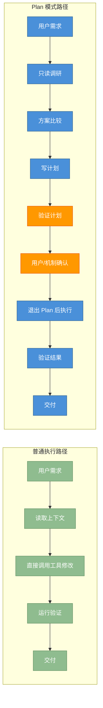
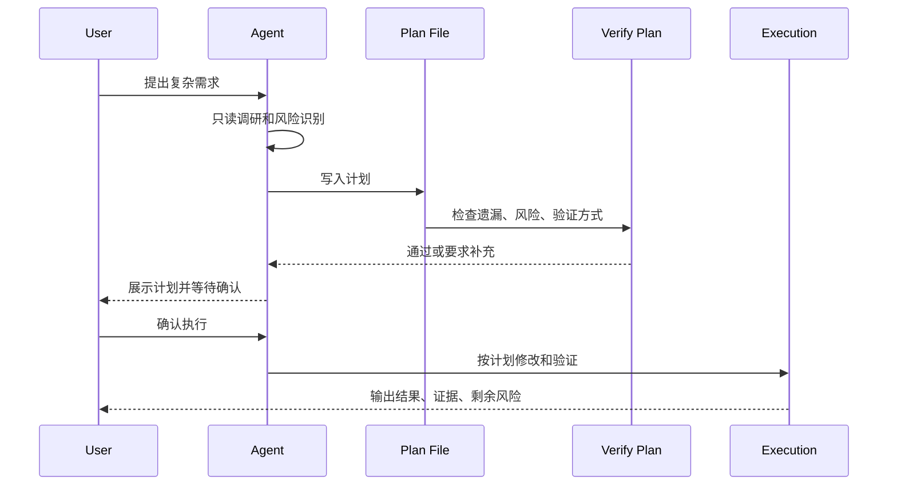
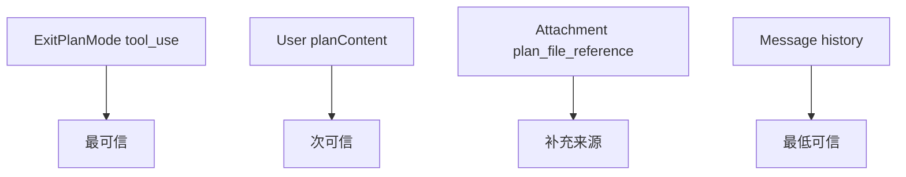
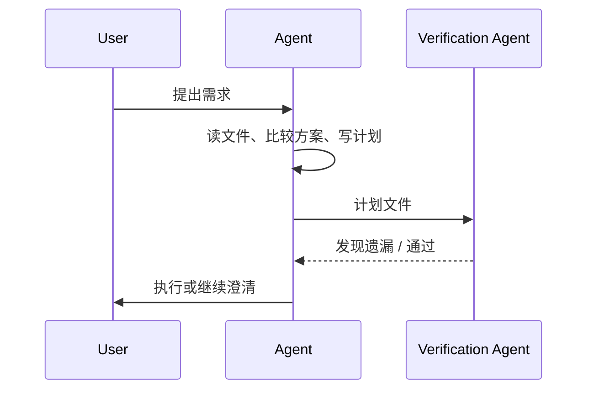

# 第 14 章：Plan 模式与结构化工作流

原课程对应：`第四部分-工程实践篇/14-Plan模式与结构化工作流.md`

> Plan 模式不是普通 todo list，而是把“理解需求、制定方案、验证计划、再执行”变成 Agent 的工作流约束。

## 学习目标

读完本章后，你应该能够：

- 理解 Plan 模式为什么要先规划后执行。
- 说明模式切换、退出 Plan、计划验证和计划恢复的作用。
- 理解工作流系统如何和 Skill、Fork Agent 配合。
- 掌握本地定时任务、远程触发、后台任务和主动模式的基本边界。
- 区分结构化工作流的设计模式和常见反模式。

## 14.0 先看全景：Plan 模式改变的是行动顺序

Plan 模式不是让 Agent “写一个 todo list”，而是把复杂任务从“边想边改”改成“先理解、先设计、先验证计划，再执行”。它真正改变的是工作流状态和权限边界。



读图结论：

- 普通路径适合低风险、小范围、目标明确的任务。
- Plan 模式适合复杂任务，因为它在执行前增加了方案比较和计划验证。
- Plan 模式的价值不在计划文本本身，而在“动手前先确认目标、边界、顺序和验证方式”。

### Plan -> Review -> Execute -> Verify 闭环



学习本章时优先看每个阶段的“产物”：

| 阶段 | 产物 | 判断标准 |
|------|------|----------|
| 调研 | 相关文件、调用链、约束 | 是否足以支持方案选择 |
| 计划 | 步骤、文件范围、风险、验证方式 | 是否能交给另一个执行者照着做 |
| 审查 | 计划缺口或通过结论 | 是否发现遗漏和不可验证步骤 |
| 执行 | 代码/配置变更 | 是否严格落在计划范围内 |
| 验证 | 命令输出、检查清单、风险说明 | 是否能证明执行结果 |

## 14.1 Plan 模式的架构

Plan 模式解决的是复杂任务的偏航问题。Agent 如果直接执行，可能在需求未澄清、风险未识别、验证方式未确定时就开始改文件。

原课程把这种问题称为 Premature Action：Agent 过早行动。它不是“执行速度太快”的问题，而是没有先弄清楚目标、边界和验证标准，就进入了写文件、跑命令、改配置的阶段。

Plan 模式把执行前移入一个受限阶段：

```text
理解需求
  -> 收集上下文
  -> 形成计划
  -> 验证计划
  -> 用户确认
  -> 执行
```

### 14.1.1 设计哲学：先规划后执行

先规划后执行的价值：

- 避免过早修改。
- 让用户看到任务拆解。
- 提前暴露风险和依赖。
- 明确验证标准。
- 让复杂任务可审查。

Plan 模式的重点不是写一份漂亮计划，而是降低错误执行的概率。

进入 Plan 模式后，Agent 的思考路径应该从“我马上改哪里”变成：

```text
理解 -> 发现 -> 比较 -> 澄清 -> 设计 -> 呈现
```

- 理解：复述任务目标，识别显性需求和隐含约束。
- 发现：读文件、查调用链、找相似实现。
- 比较：列出可选方案和取舍。
- 澄清：遇到高风险不确定性时问用户。
- 设计：给出执行步骤、文件范围、验证方式。
- 呈现：把计划交给用户或验证机制检查。

所以 Plan 模式不是“禁止工作”，而是把工作限制在只读调研和方案设计上。

### 14.1.2 模式切换机制

模式切换决定 Agent 当前允许做什么。

在 Plan 模式中，通常应该鼓励：

- 读文件。
- 搜索代码。
- 分析依赖。
- 提问澄清。
- 输出计划。

应限制：

- 写文件。
- 执行破坏性命令。
- 修改配置。
- 自动提交。

这和权限模式直接相关。Plan 模式本质上是工作流状态和权限策略的组合。

模式切换还有几个实现细节：

| 机制 | 作用 |
|------|------|
| `prePlanMode` | 记录进入 Plan 前的原模式，退出时恢复 |
| `prepareContextForPlanMode` | 清理或重排上下文，让计划阶段看到合适信息 |
| child/sub Agent 限制 | 子 Agent 通常不能自行进入 Plan 模式，避免控制父会话状态 |
| 外部/内部提示差异 | 外部用户提示要可见、可解释；内部 ant user prompt 更偏工作流指令 |

最后一点容易混淆：用户看到的 Plan 模式入口，是产品交互；系统内部给 Agent 的进入 Plan 指令，是运行时控制。两者目标一致，但表达和权限边界不同。

### 14.1.3 退出 Plan 模式

退出 Plan 模式需要明确条件：

- 计划已经写清。
- 用户或验证机制接受计划。
- 执行范围和文件边界明确。
- 验证方式明确。

如果计划还含糊，就退出执行，Plan 模式就失去价值。

退出时通常不是简单把 mode 改回 default，而是恢复 `prePlanMode`。如果进入 Plan 前是 auto 模式，退出时就尝试回到 auto；但这里需要 circuit breaker：如果 auto gate 已经关闭，不能强行回 auto，而要 fallback 到 default。

这个细节保护的是安全边界。Plan 阶段可能经历了上下文清理、权限变化、用户拒绝或策略变更，退出时必须重新确认“原模式现在是否仍然允许”。

### 14.1.4 Plan 模式完整案例：从需求到计划到实施

一个完整案例可以分成：

```text
用户提出需求
  -> Agent 读取相关文件
  -> Agent 识别变更范围
  -> Agent 给出方案选择
  -> Agent 写出实施步骤
  -> 用户确认
  -> Agent 执行计划
  -> Agent 验证结果
```

学习时要关注每个阶段的输出，而不是只看最终代码。

在团队协作场景，还会有 teammate path：本地没有 approval UI，计划需要通过 mailbox 发给 team lead。消息里通常要包含：

- sender：谁发起计划。
- timestamp：计划生成时间。
- plan file path/content：计划文件路径或内容。
- request id：用于追踪一次审批请求。

这说明 Plan 模式不是单机交互功能，它也可以成为团队工作流中的审批和交接协议。

## 分页功能实施计划

原课程中使用分页功能作为结构化计划示例。这里保留它作为学习模板。

### 方案选择：混合模式

混合模式通常意味着：既保留简单直接的实现路径，又在关键点加入抽象和验证。

例如分页功能可能同时涉及：

- API 参数。
- 查询条件。
- 返回结构。
- 前端展示。
- 边界条件。
- 测试用例。

Plan 模式会先明确哪些层需要改，哪些层不需要改。

### 实施步骤

一个合格计划应该包含：

1. 读取现有接口和调用方。
2. 确认分页参数命名。
3. 修改数据查询逻辑。
4. 修改返回结构。
5. 更新调用方。
6. 添加边界测试。
7. 运行验证命令。

### 预计影响

计划还应说明影响范围：

- 是否兼容旧参数。
- 是否改变默认返回数量。
- 是否影响已有调用方。
- 是否需要数据库索引。
- 是否改变错误码或响应格式。

## 14.2 计划验证机制

计划不是写完就一定正确。复杂任务需要验证计划本身。

### 14.2.1 验证智能体

验证智能体可以从另一个视角检查计划：

- 是否漏了文件。
- 是否漏了测试。
- 是否有风险未说明。
- 是否执行顺序错误。
- 是否违反项目约束。

这相当于在动手前做一次设计 review。

原课程还强调一个顺序问题：计划验证 hook 要在 context clear 之后注册。因为清理上下文可能会移除已有 hook，如果先注册再清理，验证步骤可能被意外丢掉。

为什么要用独立验证 Agent？核心是减少 self-review bias。写计划的同一个 Agent 很容易沿着自己的假设继续证明自己正确；独立验证 Agent 则更适合站在反方检查遗漏、顺序错误和验证不足。

### 14.2.2 计划文件的持久化与恢复

计划应该可以保存。否则会话中断后，Agent 只能依赖上下文记忆，很容易丢失细节。

计划文件应记录：

- 需求背景。
- 决策。
- 任务拆分。
- 文件范围。
- 验证方式。
- 未解决问题。

文件命名通常可以基于 slug，让计划能被人类快速识别。例如：

```text
add-pagination.md
fix-login-timeout.md
refactor-tool-registry.md
```

如果计划来自子 Agent，可以带上 agent id：

```text
{slug}-agent-{agentId}.md
```

这样主会话、子会话、验证会话之间可以通过文件路径建立清晰关联。

### 14.2.3 计划文件恢复的深度分析

恢复计划时，不能只读任务列表，还要恢复决策依据。

如果只恢复：

```text
1. 改接口
2. 改前端
3. 跑测试
```

Agent 仍然不知道为什么这么改、哪些方案被排除、风险是什么。

好的计划恢复应包含“做什么”和“为什么这么做”。

恢复来源可以按可靠性排序：

| 来源 | 可靠性 | 说明 |
|------|--------|------|
| `ExitPlanMode` tool_use input | 高 | 工具调用参数通常包含最终确认的计划内容 |
| 用户消息里的 `planContent` | 中 | 可能是用户或系统回传的计划文本 |
| attachment 的 `plan_file_reference` | 中 | 需要再读取文件快照或路径 |
| 普通消息历史 | 低 | 可能混有讨论、废弃方案和中间草稿 |

`recoverPlanFromMessages` 的价值就在这里：会话可能中断、上下文可能压缩、计划文件可能以不同形式出现，恢复逻辑需要从多个来源找回最可信的计划。

恢复时还要区分三类信息：

- direct file：当前文件系统里的计划文件。
- file snapshot：当时附加到消息里的文件快照。
- message history：对话里的计划文本。

如果三者冲突，通常应优先使用明确提交给 `ExitPlanMode` 的内容，再根据文件快照补充上下文。

## 14.3 工作流系统

工作流系统把固定步骤封装成可复用流程。

### 14.3.1 WorkflowTool 与 Skill 系统

WorkflowTool 负责执行结构化流程，Skill 提供任务知识和步骤模板。

两者关系可以理解为：

```text
Skill：知道某类任务应该怎么做
WorkflowTool：把这些步骤按流程跑起来
```

例如代码审查 Skill 可以定义检查项，WorkflowTool 可以按“读 diff -> 查风险 -> 输出 findings”的顺序执行。

Skill 更准确地说是一种 prompt template 和任务知识包。它可以包含：

- 固定工作流说明。
- `$ARGUMENTS` 占位符，用用户输入填充。
- 允许使用的工具集合。
- 推荐的 agent type，例如特定审查 Agent，或 fallback 到 `general-purpose`。

`createGetAppStateWithAllowedTools` 这类机制可以把 Skill 的工具边界落到运行时状态里。这样 Skill 不是只靠文字提醒“不要用危险工具”，而是能真正限制 Agent 可见和可调用的工具。

Skill 和 code plugin 的区别也要看清：

| 方案 | 适合 |
|------|------|
| prompt template / Skill | 流程、经验、检查项、领域知识 |
| code plugin | 新工具、新协议、新运行时代码能力 |

能用 Skill 解决的，不一定要写插件；需要真实执行能力的，不能只靠 Skill。

### 14.3.2 Fork Agent 的状态隔离

工作流中有些步骤适合 Fork Agent 执行，例如验证计划、独立审查、并行调研。

Fork 的关键是隔离：

- 子 Agent 拥有独立上下文。
- 子 Agent 不直接污染主上下文。
- 子 Agent 返回结构化结果。
- 主 Agent 负责整合和决策。

更具体地说，Fork Agent 通常会：

- clone `readFileState`，让子 Agent 看到一致的文件读取状态。
- 创建独立 `AbortController`，但把它和父级取消信号关联。
- 默认让 `setAppState` 变成 no-op，除非明确允许子 Agent 修改父状态。
- 不传 UI callbacks，避免子 Agent 控制父会话界面。

所以 subagent 不是“主 Agent 的远程手臂”，而是一个隔离工作单元。它可以研究、验证、输出结论，但不能随意改变父会话的模式、权限和 UI。

## 14.4 调度系统

调度系统让 Agent 不只响应当前请求，还能在未来时间或外部事件触发时执行任务。

### 14.4.1 ScheduleCronTool：本地定时任务

ScheduleCronTool 用于创建本地定时任务。

它适合：

- 定期检查。
- 定时运行报告。
- 周期性同步。
- 提醒类任务。

但定时任务需要明确权限、生命周期和失败处理。

定时任务通常分两类：

| 类型 | 特点 | 示例 |
|------|------|------|
| one-shot | 只触发一次 | 30 分钟后检查构建结果 |
| recurring | 周期触发 | 每天早上生成项目摘要 |

本地任务可以保存到 `.claude/scheduled_tasks.json`。其中 `durable` 标志很关键：

- `durable: true`：会话结束后仍可恢复。
- `durable: false`：只在当前会话生命周期内有效。

学习时要特别留意：定时任务不是普通函数调用，它会把 Agent 行为延伸到未来时间点，因此必须有可查看、可取消、可审计的状态。

### 14.4.2 CronScheduler：调度器核心

调度器核心需要管理：

- 任务注册。
- 触发时间。
- 执行状态。
- 重试策略。
- 取消和清理。
- 运行日志。

没有这些，定时任务很容易变成不可观察的后台行为。

多会话环境还有重复触发问题。如果两个终端同时打开同一个项目，都在扫描 `.claude/scheduled_tasks.json`，同一个任务可能被执行两次。CronScheduler 需要用 file lock 之类的机制选出 owner。

一个常见策略：

```text
owner session 持有锁并负责触发任务
non-owner session 每 5 秒 poll 一次状态
触发时间加入 deterministic jitter，避免大量任务同一秒启动
```

deterministic jitter 的意思是抖动可预测、可复现，不是每次随机。这样既能避免 thundering herd，又不会让任务时间完全不可解释。

### 14.4.3 RemoteTriggerTool：远程触发

远程触发让外部系统启动 Agent 工作流。

这带来新的边界问题：

- 谁有权触发。
- 触发参数如何校验。
- 触发任务是否需要用户确认。
- 触发结果如何通知。

RemoteTriggerTool 通常支持这些操作：

| 操作 | 含义 |
|------|------|
| list | 列出已有远程触发器 |
| get | 查看单个触发器 |
| create | 创建触发器 |
| update | 更新配置 |
| run | 手动触发一次 |

底层可能调用 triggers API endpoint，但能否启用要受两个条件控制：

- feature flag：产品是否开放这个能力。
- policy：例如 `allow_remote_sessions` 是否允许远程会话。

远程触发比本地 cron 风险更高，因为触发源可能来自外部系统，所以鉴权、参数校验、审计和用户可见性都更重要。

### 14.4.4 定时任务的会话级生命周期

定时任务可能跨越当前会话，因此需要明确生命周期：

- 会话结束是否继续。
- 用户如何查看任务。
- 用户如何取消任务。
- 任务失败如何记录。
- 任务结果如何回到上下文。

### 14.4.5 工作流设计模式与反模式

好的工作流：

- 输入明确。
- 步骤可观察。
- 权限边界清楚。
- 失败可恢复。
- 输出结构化。

反模式：

- 把所有逻辑塞进一个长 Prompt。
- 工作流中隐式修改状态。
- 没有取消和恢复机制。
- 失败只输出笼统错误。

原课程还可以整理成三类推荐模式：

| 模式 | 流程 | 适合场景 |
|------|------|----------|
| Plan-Execute-Verify | 先计划、再执行、最后独立验证 | 复杂代码变更 |
| Event-Triggered Workflow | 外部事件触发 Agent 工作流 | PR 创建、告警、部署完成 |
| Polling Loop with Escalation | 周期检查，异常时升级给用户 | 长任务监控、异步构建 |

常见反模式也要明确：

- Unplanned complex tasks：复杂任务不计划，直接改。
- Overplanning：简单任务写很重的计划，拖慢反馈。
- Zombie recurring tasks：周期任务没人维护、没人知道、一直运行。
- Synchronous polling in main conversation：在主对话里不断等和查，浪费 token，也阻塞用户交互。

## 14.5 后台任务与主动模式

后台任务让 Agent 能处理慢操作，同时不阻塞主交互。

### 14.5.1 SleepTool

SleepTool 看似简单，但它代表了等待能力。

等待不是空转，而是工作流中的时间控制点。例如“30 分钟后检查结果”需要可取消、可恢复、可记录。

SleepTool 的价值是避免 token-consuming polling。也就是说，不要让模型每隔几秒回答一次“还没好，我继续等”，而是把等待交给运行时调度。

但 SleepTool 不适合 Plan 模式。计划阶段应该产出方案和等待条件，而不是在只读规划阶段真正睡眠。

### 14.5.2 后台会话管理

后台会话需要管理：

- 任务 ID。
- 当前状态。
- 日志和 Trace。
- 取消信号。
- 结果通知。

否则用户不知道后台 Agent 在做什么。

`runForkedAgent` 作为后台任务运行时，通常还会做这些事：

- clone file state，避免后台任务读取状态和主任务互相污染。
- 使用独立 AbortController，并和父任务取消关联。
- suppress permission prompts，例如 `shouldAvoidPermissionPrompts: true`，避免后台任务突然弹本地确认。
- 把 transcript 写入 sidechain，主会话只接收摘要或结果。
- 保留 `lastCacheSafeParams`，方便 post-turn hooks 继续利用缓存安全参数。

后台任务越像“另一个会话”，越需要显式记录输入、权限、输出和取消条件。

### 14.5.3 后台任务的生命周期管理

生命周期包括：

```text
创建
  -> 等待
  -> 执行
  -> 产出结果
  -> 通知或持久化
  -> 清理
```

每个阶段都要处理错误和取消。

## 14.6 关键流程图补强

### 图 1：Plan 模式切换状态机

```mermaid
stateDiagram-v2
  [*] --> Default
  Default --> Plan: enter plan
  Plan --> Default: exit plan
  Plan --> Default: fallback when auto gate closed
  Default --> Auto: optional auto mode
  Auto --> Plan: user switches
```

### 图 2：计划阶段工作流

```text
理解 -> 发现 -> 比较 -> 澄清 -> 设计 -> 呈现 -> 验证
```

### 图 3：计划恢复优先级



### 图 4：Plan-Execute-Verify



### 图 5：Cron 调度生命周期

```text
创建任务
  -> 写入 scheduled_tasks.json
  -> durable? 继续保存 / 仅会话有效
  -> file lock 争抢 owner
  -> 到时触发
  -> 执行
  -> 记录结果
  -> 清理或继续下一轮
```

### 图 6：RemoteTrigger 门控

```text
外部请求
  -> feature flag 检查
  -> allow_remote_sessions 策略检查
  -> 参数校验
  -> 触发工作流
  -> 审计与通知
```

## 实战练习

### 练习 1：体验 Plan 模式完整流程

选一个小功能，先写计划，再执行。检查计划是否包含范围、步骤、风险和验证。

### 练习 2：创建 Cron 定时任务

设计一个每天运行的代码健康检查任务，说明触发时间、权限和输出位置。

### 练习 3：分析计划文件恢复

故意中断一个计划任务，思考恢复时需要哪些信息才能继续。

### 练习 4：设计一个完整的事件驱动工作流

设计一个“PR 创建后自动审查”的工作流，说明触发、权限、步骤、失败处理和通知方式。

要求补充：

- 触发器是 local cron 还是 remote trigger。
- 是否需要 `allow_remote_sessions`。
- 审查计划如何持久化。
- 失败后是重试、升级给用户，还是停止。

## 关键要点

1. Plan 模式是执行前约束，不是普通 todo list。
2. 模式切换应改变权限边界：计划阶段以读和分析为主，执行阶段才允许修改。
3. 计划文件需要持久化决策依据，而不只是任务列表。
4. WorkflowTool 和 Skill 可以把任务知识转化为可复用流程。
5. 调度系统引入时间和外部触发，因此必须管理权限、生命周期和可观测性。
6. 后台任务需要 ID、状态、取消、日志和结果通知，否则会变成不可控自动化。
