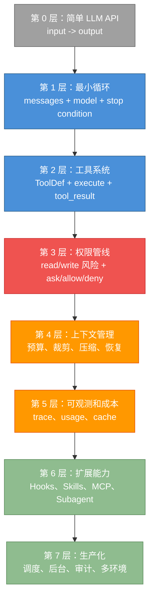
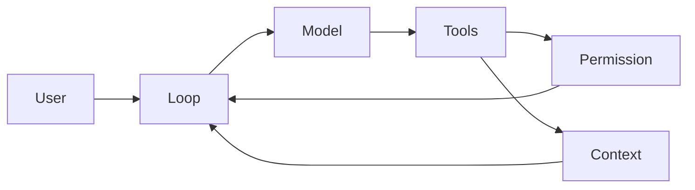
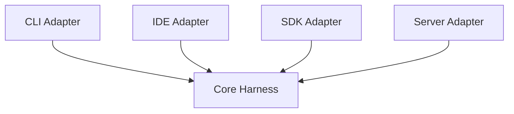
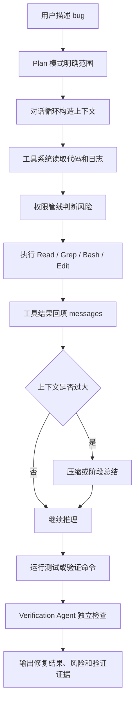

# 第 15 章：构建你自己的 Agent Harness

原课程对应：`第四部分-工程实践篇/15-构建你自己的Agent-Harness.md`

> 本章把前面所有机制收束到一个问题：如果你要自己设计 Agent Harness，应该按什么顺序做，哪些能力必须先有，哪些可以后续扩展。

## 学习目标

读完本章后，你应该能够：

- 用五大设计原则指导自己的 Harness 设计。
- 判断什么时候需要 Agent Harness，什么时候简单 LLM API 调用足够。
- 规划对话循环、工具系统、权限管线、上下文、记忆和 Hooks 的实现路线。
- 理解大型 Harness 架构中的循环依赖、模块化、功能开关、错误处理和可观测性。
- 识别生产化 Agent Harness 需要考虑的安全、环境和未来扩展问题。

## 15.0 先看全景：先做最小闭环，再做高级能力

这一章容易让人产生“要一次性做完 Claude Code 所有能力”的压力。更实用的读法是：先把最小 Agent Harness 跑通，再逐层增加安全、上下文、扩展和生产化能力。



读图结论：

- 没有最小循环，就不要急着做 Skill、MCP、Subagent。
- 没有权限管线，就不要开放写文件、执行命令和外部服务调用。
- 没有 trace、usage 和验证证据，生产化后很难排查问题和控制成本。

### 前面章节如何映射到自己的 Harness

| 课程章节 | 自研组件 | 最小实现先做什么 |
|----------|----------|------------------|
| 第 2 章 | Conversation Loop | while loop、stop reason、tool_result 回填 |
| 第 3 章 | Tool System | 工具接口、schema、执行器、错误结果 |
| 第 4 章 | Permission Pipeline | 只读/写入分类、用户确认、拒绝回填 |
| 第 5 章 | Settings | 配置层级、默认值、项目配置 |
| 第 6 章 | Memory | 先读项目说明文件，再考虑自动提取 |
| 第 7 章 | Context | token 预算、优先级、压缩摘要 |
| 第 8 章 | Hooks | 先做 PreToolUse/PostToolUse 两个点 |
| 第 9-10 章 | Subagent / Coordinator | 等单 Agent 稳定后再加 |
| 第 11-12 章 | Skills / MCP | 作为扩展入口，不要放进核心循环最小版 |
| 第 13-14 章 | Streaming / Plan | 流式事件和先规划后执行的工作流 |

### 先做 / 后做 / 不要一开始做

| 优先级 | 能力 | 理由 |
|--------|------|------|
| 先做 | 对话循环、工具回填、权限确认、基础 trace | 这些决定 Harness 能不能可靠行动 |
| 后做 | 记忆、压缩、Hooks、Skills、MCP、Subagent | 它们依赖稳定的核心循环和工具系统 |
| 不要一开始做 | 多 Agent 编排、复杂调度、全量插件市场、过度自动化 | 这些会放大权限、状态和调试复杂度 |

## 15.1 设计原则回顾与选型指南

自研 Harness 前，先不要急着写工具。应该先确认设计原则和适用场景。

### 五大设计原则在实际项目中的应用

| 原则 | 落地方式 |
|------|----------|
| 循环优于递归 | 用清晰的 while loop 管理观察、思考、行动、再观察 |
| 异步流式优先 | 对话循环和工具执行都产出事件流 |
| 安全边界内嵌 | 工具可见性、参数校验、权限判断和审计前置 |
| 缓存感知设计 | 稳定系统提示、工具顺序和上下文前缀 |
| 渐进式能力扩展 | 先核心工具，再 Skills、MCP、Subagent |

“循环优于递归”是本章特别值得记住的一条。Agent Harness 看起来像模型不断“调用自己”，但工程实现不要真的写成深层递归。更稳妥的方式是：

```text
while task_not_finished:
  build context
  call model
  stream response
  execute tools
  append results
  check stop conditions
```

这样更容易加入最大轮数、取消、成本预算、错误恢复和 trace。递归式实现短期看起来简洁，长期会让状态散落在调用栈里。

### 何时使用 Agent Harness 模式 vs 简单 LLM API 调用

简单 LLM API 适合：

- 单轮问答。
- 文本生成。
- 简单分类。
- 无工具、无状态、无权限的任务。

Agent Harness 适合：

- 多轮任务。
- 需要读写文件或调用工具。
- 需要权限边界。
- 需要长上下文管理。
- 需要可观测、可恢复、可扩展。

如果任务只需要“一问一答”，不要过度设计 Harness。如果任务需要“观察、行动、再观察”，就需要 Harness。

可以用更细的判断表：

| 维度 | 简单 LLM API | Agent Harness |
|------|--------------|---------------|
| 交互轮数 | 通常单轮或少量固定轮次 | 不确定轮数，需要循环 |
| 工具调用 | 无工具或固定后处理 | 模型可选择工具并读取结果 |
| 上下文管理 | 输入一次性拼好 | 需要压缩、选择、引用、恢复 |
| 错误恢复 | 调用失败就返回错误 | 工具失败可回填给模型继续处理 |
| 成本控制 | 单次调用成本可估计 | 多轮、fork、缓存、预算都要追踪 |
| 安全边界 | 主要是 API 权限 | 每个工具、参数和工作区都要管控 |

简单规则：如果流程是 `input -> output`，优先简单 API；如果流程是 `observe -> think -> act -> observe`，就进入 Harness 范畴。

### 运行时选择：Bun vs. Node.js vs. Python

运行时选择取决于目标：

| 运行时 | 优势 | 适合场景 |
|--------|------|----------|
| Bun | 启动快、TS 体验好 | 终端工具和快速 CLI |
| Node.js | 生态成熟 | 企业环境、广泛兼容 |
| Python | AI 生态强 | 实验、数据、模型周边 |

关键不是哪个语言“最好”，而是你的工具生态、部署环境、团队能力和性能目标是否匹配。

原课程偏向 Bun 的原因主要是工程体验：

- 冷启动快，适合频繁启动的 CLI；课程中把它概括为接近 Node 冷启动的约三分之一。
- 原生 TypeScript 体验好，减少构建链路摩擦。
- bundler 和 feature flag 结合方便，可以把未启用能力排除出启动路径。

但这不是说所有 Harness 都该用 Bun。企业后端长期服务可能更看重 Node.js 生态和运维成熟度；研究原型可能更看重 Python 的模型和数据生态。

## 15.2 核心组件实现路线图

建议按从小到大的顺序实现。

### Step 1：对话循环

先实现最小循环：

```text
messages
  -> call model
  -> parse response
  -> final answer or tool call
```

不要一开始就做复杂工具、记忆和多 Agent。先让循环稳定。

推荐把最小循环建模成 `AsyncGenerator`，并显式传入依赖：

```text
runAgent({ modelClient, tools, permissionService, state }) -> AsyncGenerator<Event>
```

这样 UI、测试、CLI 和后台任务都可以消费同一套事件流。最小可用后，再补这些保护：

- 最大轮数：防止模型无限调用工具。
- `AbortController`：支持用户中断和父任务取消。
- 重试策略：网络或模型临时失败时指数退避。
- fallback model：主模型连续失败时可降级。
- usage tracking：每轮都记录 token 和缓存命中。

注意顺序：先把循环跑通，再把停止条件和恢复能力补上。

### Step 2：工具系统

加入工具协议：

- 工具名。
- 描述。
- 参数 schema。
- 执行函数。
- 结果结构。
- 错误结构。

先支持 2-3 个基础工具，例如 read_file、write_file、run_command。

工具构建器应该默认 fail-closed。也就是说，如果没有显式声明安全属性，就按危险处理：

```text
buildTool({
  name,
  schema,
  execute,
  isReadOnly: false,
  isConcurrencySafe: false,
  requiresPermission: true
})
```

很多自研 Harness 的问题是默认把工具当安全，后来再加黑名单。更稳妥的是默认工具都有副作用，再逐步给 `Read`、`Search`、`List` 这类工具加只读和并发安全标记。

### Step 3：权限管线

工具能执行后，必须加权限。

最小权限管线：

```text
参数校验
  -> 工具可见性
  -> 风险分类
  -> 用户确认
  -> 执行记录
```

权限不要后补。后补权限往往会变成一堆散落在工具里的 if 判断。

更完整的权限管线可以拆成四段：

```text
工具是否可见
  -> 参数是否安全
  -> 策略是否允许
  -> 用户或系统是否批准
```

生产化时还要补：

- audit log：记录谁在什么时候批准了什么工具和参数。
- dynamic rule update：用户拒绝后，后续同类请求要能自动拦截。
- permission cache：重复安全操作可以减少打扰，但必须有范围和过期时间。
- RBAC：Server 或团队环境下，不同用户能调用的工具不同。

权限系统的目标不是让 Agent “少做事”，而是让它只在明确边界内做事。

### Step 4：上下文管理

上下文管理从简单规则开始：

- 限制工具结果长度。
- 保留当前目标。
- 保留最近关键消息。
- 超长历史做摘要。
- 大文件只放片段或引用。

不要一开始就做复杂 RAG，但要预留信息选择和压缩的位置。

上下文压缩可以按渐进式路线做：

1. 长工具结果截断。
2. 老消息摘要。
3. 文件内容替换成引用。
4. 按当前目标选择相关上下文。
5. 超预算时触发二次压缩或用户确认。

这里要接受一个现实：压缩必然有信息损失。关键问题不是“有没有损失”，而是“损失的是不是当前任务不重要的信息”。因此压缩策略必须知道当前目标和验证标准。

### Step 5：记忆系统

记忆系统用于跨会话保存稳定信息。

先从简单文件存储开始：

- 用户偏好。
- 项目约定。
- 历史决策。

同时要设计召回规则：什么时候读记忆，哪些记忆进入上下文。

记忆系统最难的不是存储，而是三件事：

- 提取什么：不是所有对话都值得长期保存。
- 保存多久：过期决策、临时偏好和稳定约定要区分。
- 何时注入：记忆太早、太多进入上下文，会污染当前任务。

最小实现可以从人工确认的项目约定开始，而不是自动把所有聊天记录都写入记忆。

### Step 6：钩子系统

Hooks 用于扩展生命周期。

最小 Hook 点：

- 任务开始。
- 工具调用前。
- 工具调用后。
- 任务结束。

Hooks 不应破坏主循环清晰性。它们是扩展点，不应成为隐藏主逻辑。

生产环境的 Hook 还需要工程护栏：

- timeout：例如单个 hook 最多 10 秒。
- error tolerance：hook 失败不能默认拖垮主任务，除非它是安全关键 hook。
- process isolation：执行外部脚本时隔离环境和权限。
- audit tracing：记录 hook 输入、输出、耗时和失败原因。

如果 Hook 可以修改提示词、工具列表或权限决策，就必须被纳入审计范围。

## 15.3 从 Claude Code 学到的架构教训

### 循环依赖的打破策略

大型 Harness 很容易出现循环依赖：工具需要上下文，上下文需要工具结果，权限需要工具定义，工具定义又依赖配置。

打破循环依赖的方法：

- 抽出接口。
- 使用依赖注入。
- 延迟加载。
- 把类型定义和实现分离。
- 明确模块单向依赖。

原课程还提到几种可操作策略：

- lazy require 配合 feature flag：只有功能启用时才加载重模块。
- centralized type exports：类型从统一入口导出，避免实现模块互相引用。
- 将工具数组设计为 readonly collection，避免注册后被运行时随意修改。

循环依赖的症状通常不是立刻编译失败，而是更隐蔽：

- 启动时间随功能增加呈非线性增长。
- 某些导入值偶发 `undefined`。
- 改一个底层类型引发大面积 rebuild。
- 测试必须按特定顺序运行才通过。

遇到这些症状，要先画依赖图，而不是继续加条件判断。

### 大型代码库的模块化设计

模块化不是按文件数量拆，而是按责任边界拆。

好的模块应该能回答：

- 它负责什么。
- 它不负责什么。
- 它依赖谁。
- 谁依赖它。
- 它的输入输出是什么。

一个实用做法是按“核心无环境、边缘适配环境”拆：

```text
core loop
  -> tool protocol
  -> permission service interface
  -> context manager
  -> adapters: CLI / IDE / SDK / Server
```

核心层不应该知道自己运行在 CLI 还是 IDE。不要在核心循环里到处写 `if (isCLI)`，而是让不同入口实现不同 adapter。

### 功能开关驱动的渐进式发布

功能开关让新能力可以逐步启用。

适合用于：

- 实验工具。
- 新权限模式。
- 新 MCP 集成。
- 新流式执行器。
- 企业版功能。

但功能开关过多也会增加测试矩阵，需要定期清理。

功能开关至少有三类：

| 类型 | 例子 | 适合控制 |
|------|------|----------|
| 编译期开关 | bundler define | 排除实验代码、减少启动路径 |
| 运行时配置 | 本地 config / env | 用户级或项目级能力 |
| 远程开关 | feature flag service | 灰度发布、回滚、企业策略 |

不要把所有开关都做成远程开关。启动性能、安全策略和本地开发体验需要不同粒度的控制。

### 错误处理与断路器模式

Agent 系统的错误不是异常栈那么简单。模型错误、工具错误、权限拒绝、上下文超限、用户中断，都需要不同处理。

断路器模式用于防止系统在连续失败时继续扩大损害：

- 连续工具失败后停止。
- 连续模型超时后降级。
- token 超预算后阻断。
- 权限反复拒绝后提醒用户。

错误处理还要区分“给模型看的错误”和“给开发者看的错误”。例如 API 错误可以包装成 assistant message，让模型解释降级方案；但内部可恢复错误可以 withheld，不一定暴露给用户。

一个简单断路器策略：

```text
consecutiveFailures += 1
if consecutiveFailures >= 3:
  stop current loop
  summarize failures
  suggest fallback or ask user
```

阈值 3 不是绝对标准，但它表达了原则：连续失败时不要无限重试。可以选择 fallback model、缩小上下文、跳过不稳定工具，或把控制权交还给用户。

### 可观测性的深度讨论

可观测性至少包括：

- Trace。
- 工具调用日志。
- 权限决策记录。
- token 用量。
- 缓存命中率。
- 终止原因。
- 子 Agent 结果。

没有这些，Agent 出错时很难判断是模型、工具、权限、上下文还是用户输入导致。

可观测性可以分层设计：

| 层级 | 记录内容 |
|------|----------|
| structured logs | 每次工具调用、权限决策、错误码 |
| aggregate metrics | 成功率、延迟、成本、缓存命中率 |
| distributed tracing | 跨主 Agent、subagent、MCP 服务追踪 |
| anomaly detection | 成本暴涨、失败率突增、缓存命中下降 |

跨 Agent 场景建议使用 `query_chain_id` 之类的追踪 id，把主任务、fork、后台 hook、MCP 调用串起来。否则一次任务拆成多个会话后，很难复盘。

## 15.4 生产化考量

### 遥测与可观测性

生产环境需要知道：

- 哪些任务最常失败。
- 哪些工具最常被拒绝。
- 哪些模型调用最贵。
- 哪些上下文压缩导致质量下降。
- 哪些 Hook 或 MCP 服务不稳定。

最小遥测指标可以包括：

- `agent.turn.count`
- `model.latency.ms`
- `tool.execution.ms`
- `tool.failure.count`
- `permission.denied.count`
- `token.input/output/cache_read`
- `context.compaction.count`
- `cache.hit_rate`

这些指标不一定都要上传远程服务，但至少应该能在本地 trace 中复盘。

### 多环境适配：CLI / IDE / SDK / Server

同一 Harness 可能有多个入口：

- CLI：强调终端交互和权限确认。
- IDE：强调文件上下文和编辑体验。
- SDK：强调可编程调用。
- Server：强调多用户、权限隔离和审计。

核心逻辑应共享，入口层适配不同 UI 和运行环境。

可以整理成适配器表：

| 环境 | 入口关注点 | 不应放进 core 的内容 |
|------|------------|----------------------|
| CLI | 终端渲染、shell 权限确认、中断快捷键 | Ink/TTY 细节 |
| IDE | 当前文件、选区、诊断、diff 展示 | 编辑器 API |
| SDK | 函数式调用、事件订阅、类型稳定 | 产品 UI 假设 |
| Server | 多租户、鉴权、审计、限流 | 单用户本地状态 |

原则是：core 负责循环和协议，adapter 负责环境差异。

### 安全审计

安全审计要覆盖：

- 工具执行记录。
- 权限决策来源。
- 配置变更。
- 文件修改。
- 外部请求。
- 子 Agent 委派。

审计不是为了事后甩锅，而是为了复现和改进。

更具体的安全清单：

- 工具 flags 是否准确：只读、写入、网络、并发安全、需要确认。
- trusted workspace hooks：哪些 hook 来自可信工作区，哪些需要禁用或确认。
- 输入清洗：例如 `backfillObservableInput` 可以补观察字段，但不能篡改真正发往 API 的 raw input。
- budget cap：token、时间、工具次数和外部请求都要有上限。
- prompt injection threat model：来自网页、文件、工具结果的文本不能自动获得系统指令权限。

安全边界要贯穿工具、上下文、记忆、MCP 和子 Agent，不是只在执行 shell 前问一句。

## 15.5 Agent Harness 的未来

### 多模态交互

未来 Harness 不只处理文本和代码，还会处理图片、音频、视频、GUI 状态和设备事件。

这会增加上下文管理和权限边界复杂度。

多模态会带来新的取舍：

| 挑战 | 说明 |
|------|------|
| payload size | 图片、音频、视频比文本大得多 |
| cost | 多模态 token 或处理费用更高 |
| cache efficiency | 二进制和动态截图更难形成稳定前缀 |
| permissions | 截屏、录音、摄像头、GUI 控制都需要更强授权 |

因此多模态 Harness 不能只是“把图片塞进上下文”，还要重新设计采样、压缩、引用和权限。

### 长期运行智能体（Daemon 模式）

长期运行 Agent 需要：

- 持久任务队列。
- 后台会话。
- 定时调度。
- 资源限制。
- 健康检查。
- 用户可见控制台。

Daemon 模式的本质是从 request/response 变成 persistent agent。它需要：

- persistent state：任务、上下文、记忆和未完成工具调用能恢复。
- event wakeup：文件变化、定时器、远程事件能唤醒任务。
- multi-agent coordination：多个 Agent 共享资源时有调度和锁。
- resource-aware scheduling：CPU、网络、token、外部 API 都要限额。

主要挑战是崩溃恢复、状态一致性和资源管理。一个后台 Agent 如果不可见、不可停、不可审计，就不应该长期运行。

### 标准化协议（MCP 演进方向）

MCP 代表外部能力标准化方向。未来 Harness 可能不再为每个工具写专用适配，而是通过协议发现和调用能力。

但协议标准化不等于风险消失。权限、审计、上下文污染和服务信任仍然存在。

MCP 的未来价值可能在：

- dynamic tool discovery：运行时发现工具，而不是写死工具列表。
- cross-agent protocol：不同 Agent 通过统一协议共享能力。
- sandbox execution：工具在隔离环境中执行。
- streaming result：外部工具也能以流式结果返回。

新的问题是：运行时发现的工具如何做权限？如果工具在任务中途出现，Harness 必须能动态评估它的 schema、风险、来源和可见性。

### 未来架构的前瞻性分析

未来 Agent Harness 可能朝这些方向发展：

- 多 Agent 协作成为常态。
- 工具和资源通过协议动态发现。
- 记忆和上下文管理更细粒度。
- 安全策略更可配置。
- 评估和回归测试成为基础设施。

可以把演进路线概括成：

| 现在 | 未来 |
|------|------|
| monolith harness | microservices / modular runtime |
| passive assistant | proactive agent |
| single skill | multi-skill orchestration |
| implicit memory | explicit knowledge graph |
| local-only tools | protocol-discovered tools |

这条路线的核心不是让系统变复杂，而是把复杂性变成可管理的模块、协议和策略。

## 实战练习

### 延伸练习：实现一个最小 Agent Harness

实现路线：

1. 对话循环：支持多轮 messages。
2. 工具系统：支持 read_file 和 shell_echo。
3. 权限管线：shell_echo 自动允许，read_file 限制在项目目录。
4. Trace：记录每次模型响应和工具调用。
5. 上下文管理：限制工具结果长度。
6. 错误处理：工具失败回填给模型。

验收标准：

- 能执行一个需要读文件的任务。
- 能看到工具调用 Trace。
- 越界读取会被拒绝。
- 工具失败后模型能继续回答。

### 场景练习 A：选择 API 还是 Harness

给三个任务做选型：

1. 把一段中文改写成英文邮件。
2. 读取项目代码，找出登录超时 bug，并修改测试。
3. 每天检查构建状态，失败时自动创建报告。

要求说明：为什么选简单 API 或 Harness，需要哪些组件。

### 场景练习 B：设计权限管线

你要支持 `ReadFile`、`WriteFile`、`RunShell`、`WebFetch` 四个工具。请为每个工具标注：

- 是否只读。
- 是否允许并发。
- 是否需要用户确认。
- 审计日志要记录哪些字段。

### 场景练习 C：设计生产化 Trace

为一次 “主 Agent -> subagent -> MCP tool” 的任务设计 trace 字段，至少包含：

- `query_chain_id`
- 父子任务关系
- token usage
- permission decisions
- tool latency
- failure reason

### 四周实现计划

| 周次 | 目标 | 交付物 |
|------|------|--------|
| 第 1 周 | 最小循环和 2 个只读工具 | 可运行 CLI、基础 trace |
| 第 2 周 | 权限管线和写工具 | 参数校验、用户确认、审计日志 |
| 第 3 周 | 上下文压缩和 usage/cost | 超长任务可继续、成本可见 |
| 第 4 周 | Hooks、Skill 或 MCP 任选一项 | 可扩展工作流和验证案例 |

不要一开始就追求完整复刻 Claude Code。先让一个最小 Harness 在真实小任务里稳定工作，再逐步加能力。

## 关键要点

1. 自研 Harness 应从对话循环、工具系统和权限管线开始。
2. 不需要工具和状态的任务，用简单 LLM API 就够了。
3. 上下文、记忆、Hooks、MCP、Subagent 都应渐进加入。
4. 大型 Harness 的难点在模块边界、循环依赖、错误恢复和可观测性。
5. 生产化不仅是部署，还包括遥测、安全审计、多环境适配和成本控制。
6. Agent Harness 的未来会更开放、更长期运行、更协议化，但安全边界仍然是核心。

## 15.6 关键流程图补强

### 图 1：最小 Agent Harness 总架构



### 图 2：最小循环伪代码

```text
while not done:
  build_context()
  stream = call_model()
  for event in stream:
    emit(event)
    if event has tool_use:
      run_tool()
  update_usage()
  if stop_condition:
    break
```

### 图 3：六步落地路线

```text
对话循环
  -> 工具系统
  -> 权限管线
  -> 上下文管理
  -> 记忆系统
  -> 钩子系统
```

### 图 4：Core / Adapter 分层



### 图 5：主任务与 subagent / MCP trace 串联

```text
query_chain_id
  -> main agent turn
  -> forked subagent turn
  -> MCP tool call
  -> permission decision
  -> final result
```

### 图 6：四周实现计划

```text
第 1 周: loop + trace
第 2 周: permission + write tools
第 3 周: context + usage/cost
第 4 周: hooks / skill / MCP 选一项
```

### 图 7：真实任务穿透图

以“修复一个线上 bug”为例，一个成熟 Harness 不会只调用模型生成答案，而是让任务穿过多个运行时层：



这张图适合用来检查自研 Harness 是否完整：

- 只有模型调用，没有工具系统：只能回答，不能行动。
- 有工具系统，没有权限管线：可以行动，但边界不清。
- 有权限管线，没有上下文管理：长任务会失控。
- 有实现，没有验证 Agent 或 trace：很难证明任务真的完成。

### 图 8：数据生命周期总图

```text
用户输入
  -> messages
  -> context selection
  -> model request
  -> tool_use
  -> permission decision
  -> tool_result
  -> updated messages
  -> compact summary
  -> memory candidate
  -> trace / usage / cache metrics
```

理解这条生命周期，能区分几个容易混淆的词：

| 概念 | 作用 |
|------|------|
| `messages` | 会话历史和工具结果回填位置 |
| `context` | 本轮实际送进模型的信息 |
| `memory` | 跨会话长期保存的信息 |
| `trace` | 复盘执行过程的证据 |
| `usage` | 成本、缓存和预算控制依据 |
