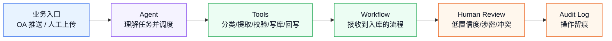

# DeepSeek Harness 业务落地快速入门

> 目标：用尽量浅显的方式快速熟悉 DeepSeek Harness，并能判断它如何在业务场景中落地。

这篇不是源码手册，也不是 API 参考。它解决三个问题：

1. dsh 到底适合解决什么业务问题？
2. 业务需求怎么拆成 dsh 里的 Agent、Tool、Plugin、Workflow？
3. 怎么先做一个可验证的 MVP，而不是一开始就做大而全的平台？

---

## 1. 一句话理解 dsh

DeepSeek Harness（dsh）可以理解成一个 **AI Agent 运行底座**。

```text
模型负责思考
dsh 负责让思考变成可控行动
```

如果只调用一次大模型，让它生成一段文本，普通 LLM API 就够了。

如果业务里出现下面这些事情，就开始需要 Harness：

- 要读写文件、查数据库、调 OA、调用内部系统。
- 要把一个任务拆成多个步骤执行。
- 有些步骤需要人工确认。
- 操作过程必须有日志、可追溯、可审计。
- 以后可能要不断加新能力，但不想频繁改核心代码。

dsh 的价值不是“让模型更聪明”，而是让 AI 能在业务系统里 **有边界地行动**。

---

## 2. 什么时候用 dsh，什么时候不用

先用这个表判断：

| 场景 | 是否需要 dsh | 原因 |
|------|--------------|------|
| 翻译一句话、改写一封邮件 | 不需要 | 一次模型调用就能完成 |
| 根据用户问题查知识库并回答 | 可能需要 | 如果只检索文本，RAG 就够；如果还要调系统和审批，就需要 dsh |
| 自动处理 OA 公文归档 | 需要 | 涉及文件、分类、数据库、审批、回写、日志 |
| 代码助手读取项目并修改文件 | 需要 | 涉及工具调用、权限、上下文、验证 |
| 运维巡检后自动生成报告 | 需要 | 涉及定时任务、命令执行、异常处理、通知 |
| 客服机器人只回答 FAQ | 不一定 | 如果不操作系统，普通问答系统更简单 |

判断标准很简单：

```text
只回答问题 -> 先用 LLM API / RAG
需要行动、流程、权限、日志 -> 考虑 dsh
```

---

## 3. 先记住 5 个核心概念

快速熟悉 dsh，不需要先记源码包名。先记这 5 个概念。

### 3.1 Agent：正在处理任务的 AI 助手

Agent 是“一个正在工作的 AI 助手”。

它会：

- 接收用户任务。
- 组织上下文。
- 调用模型思考。
- 根据需要调用工具。
- 把工具结果放回对话，再继续判断下一步。

业务类比：

```text
档案馆里的 AI 档案员
OA 系统里的 AI 流程助理
运维系统里的 AI 巡检员
```

### 3.2 Tool：Agent 可以执行的动作

Tool 是 Agent 能做的具体动作。

例如：

| 工具 | 业务含义 |
|------|----------|
| `read` | 读取文件 |
| `write` / `edit` | 写入或修改文件 |
| `glob` / `grep` | 搜索文件路径和内容 |
| `bash` | 执行命令 |
| `web_search` / `web_fetch` | 搜索和抓取网页 |
| 自定义工具 | 调 OA、查数据库、生成档号、发审批 |

业务落地时，最重要的不是工具多，而是工具边界清楚：

```text
这个工具能做什么？
输入是什么？
输出是什么？
是否有风险？
是否需要人工确认？
是否要记录日志？
```

### 3.3 Plugin：把能力装进 dsh 的方式

Plugin 可以理解成“能力包”。

一个插件可以提供：

- 一个工具。
- 一个服务实现。
- 一段系统提示。
- 一个 UI 扩展。
- 一组配置。
- 一个业务流程能力。

业务落地时，不建议改 dsh 核心代码。更推荐写业务插件：

```text
dsh 核心 = 通用运行底座
业务插件 = 你的行业能力
```

比如档案馆场景可以写：

- `dsh-archive-tools`：档案分类、编目、生成档号。
- `dsh-archive-db`：对接档案数据库。
- `dsh-archive-oa-bridge`：对接 OA。
- `dsh-archive-workflow`：定义接收、审核、入库流程。

### 3.4 Profile：启动时加载哪一组能力

Profile 决定 dsh 以什么形态启动。

你可以把它理解成“启动菜单”：

| Profile | 适合场景 |
|---------|----------|
| `web` | 有人值守，通过浏览器使用 |
| `headless` | 一次性无人值守任务，执行完退出 |
| 自定义 profile | 加载你的业务插件和配置 |

业务落地时常见组合：

```text
白天人工处理 -> web profile
夜间批量任务 -> headless profile
特定业务能力 -> 自定义 profile + 业务插件
```

### 3.5 Workflow：把多个步骤串起来

Workflow 是“流程编排”。

它适合处理多步骤任务：

```text
接收文件
  -> 自动分类
  -> 提取元数据
  -> 校验质量
  -> 人工审核
  -> 生成档号
  -> 写入数据库
  -> 回写 OA
```

如果只是一步工具调用，不一定需要 Workflow。

如果有明确流程、分支、人工节点、失败处理，就应该考虑 Workflow。

---

## 4. 从业务需求到 dsh 组件

拿“档案馆公文归档”举例。

业务需求：

> OA 办结后的公文自动进入档案系统。AI 帮忙分类、提取元数据、生成档号。低置信度或涉密文件必须人工确认。所有操作要留痕。

可以拆成这样：



对应到 dsh：

| 业务问题 | dsh 组件 |
|----------|----------|
| 谁来理解任务 | Agent |
| 怎么调用 OA / 数据库 | Tool + Plugin |
| 怎么按步骤执行 | Workflow |
| 怎么让人确认 | interaction / ask_user_question / Web UI |
| 怎么无人值守执行 | headless profile |
| 怎么保留记录 | session log / audit log |
| 怎么以后扩展 | 新增插件，不改核心 |

---

## 5. 最小 MVP 怎么做

不要一开始就做完整平台。先做一个最小闭环。

### 5.1 MVP 目标

一个好的 MVP 应该能证明：

```text
AI 能处理一条真实业务数据
关键步骤能被人看懂和确认
结果能写入目标系统或模拟系统
过程能追溯
```

### 5.2 MVP 不做什么

第一版先不要做：

- 全量 OA 对接。
- 所有档案类型。
- 复杂权限矩阵。
- 批量性能优化。
- 多部门审批流。
- 大而全的管理后台。

### 5.3 MVP 做什么

以档案馆为例，第一版只做：

| 模块 | 最小实现 |
|------|----------|
| 入口 | 手动上传 5-10 份样例文件，或模拟 OA 推送 |
| 工具 | `classify_archive`、`extract_metadata`、`generate_archive_no` |
| 数据 | 先写 SQLite 或测试库 |
| 人工确认 | 分类低置信度时要求人工确认 |
| 日志 | 记录输入、工具调用、结果、人工决策 |
| 验收 | 10 份样例里 8 份能正确完成分类和编目 |

最小闭环图：

```text
样例文件
  -> Agent 判断任务
  -> 调 classify_archive
  -> 调 extract_metadata
  -> 低置信度时人工确认
  -> 调 generate_archive_no
  -> 写入测试库
  -> 输出处理报告
```

---

## 6. 业务落地时最重要的 6 个问题

做任何 dsh 业务落地前，先回答这 6 个问题。

### 问题 1：业务入口在哪里？

常见入口：

- Web UI 手动操作。
- OA / ERP / CRM webhook。
- 定时任务。
- CLI / headless 批处理。
- Python SDK 调用。

### 问题 2：Agent 需要哪些工具？

把“AI 要做的事”拆成工具：

```text
查数据 -> query_xxx
写数据 -> save_xxx
发起审批 -> create_approval
查询审批 -> get_approval_status
生成文档 -> generate_xxx
回写系统 -> notify_xxx
```

每个工具都要有清晰输入输出。

### 问题 3：哪些步骤不能让 AI 自动决定？

这些通常需要人工确认：

- 涉密、隐私、合规。
- 低置信度分类。
- 写入生产系统。
- 删除或覆盖数据。
- 对外发送通知。
- 生成正式文件或证明。

### 问题 4：怎么审计？

至少记录：

- 谁发起。
- 哪个会话。
- 调了什么工具。
- 输入摘要。
- 输出结果。
- AI 为什么这么判断。
- 人工是否确认。
- 最终写入了哪里。

### 问题 5：失败后怎么办？

业务系统一定会失败：

- OA 超时。
- 数据库断开。
- 文件格式异常。
- 模型输出不稳定。
- 人工长时间不确认。

MVP 里至少要定义：

- 哪些错误可以重试。
- 哪些错误要转人工。
- 哪些错误必须停止流程。
- 是否支持从某一步继续。

### 问题 6：怎么逐步扩展？

不要把所有能力写成一个大插件。

更好的拆法：

```text
业务工具插件
系统对接插件
领域知识插件
工作流插件
审计日志插件
UI 插件
```

每个插件只做一类事，后续扩展会轻很多。

---

## 7. 2-3 小时学习路线

如果只是快速熟悉，按这个顺序读。

### 第 1 步：先看本篇

目标：知道 dsh 适合什么业务场景。

你应该能回答：

- 为什么不是所有 AI 项目都需要 Harness？
- Tool、Plugin、Workflow 分别解决什么问题？
- 一个业务 MVP 应该先做什么？

### 第 2 步：读 `architecture.md`

只重点看：

- 30 秒看懂这个项目。
- 五层架构。
- 启动流程。
- Agent 循环。
- 能力接缝。

先不要纠结每个包名。

### 第 3 步：读 `plugin-system.md`

只重点看：

- Context / Fiber / Service / Effect。
- 插件生命周期。
- 插件通信方式。
- 能力接缝。
- 怎么写一个最小插件。

目标是理解：为什么业务能力应该做成插件。

### 第 4 步：读 `archive-solution.md`

重点看：

- 两条业务流程。
- 插件清单。
- 系统集成方案。
- 四阶段落地路径。
- 风险和审计字段。

目标是学习一个业务场景怎么拆。

---

## 8. 判断一个业务是否适合 dsh 的 Checklist

如果下面问题大多数是“是”，就适合考虑 dsh。

| 问题 | 是 / 否 |
|------|--------|
| 任务是否需要调用业务系统？ |  |
| 是否需要多步骤流程？ |  |
| 是否有人工确认或审批节点？ |  |
| 是否需要操作日志和审计？ |  |
| 是否需要读写文件、数据库或接口？ |  |
| 是否希望后续按插件扩展能力？ |  |
| 是否有无人值守或批处理需求？ |  |
| 是否需要失败重试、暂停、恢复或转人工？ |  |

结论：

```text
0-2 个是：先用简单 LLM API / RAG
3-5 个是：可以做一个 dsh MVP 验证
6 个以上是：dsh 很可能适合做业务 Agent 底座
```

---

## 9. 下一步怎么学

建议接下来补两类文档：

1. **业务落地地图**：从需求到 dsh 组件的映射方法。
2. **第一个业务 Agent 实战**：用一个简单业务场景，从工具定义到 MVP 验收走一遍。

如果只是学习，不要一开始深入所有源码。先用业务问题牵引：

```text
我要让 Agent 做什么？
它需要哪些工具？
哪些地方必须人工确认？
结果写到哪里？
怎么证明它做对了？
```

能回答这五个问题，就已经具备业务落地的基本判断力。
