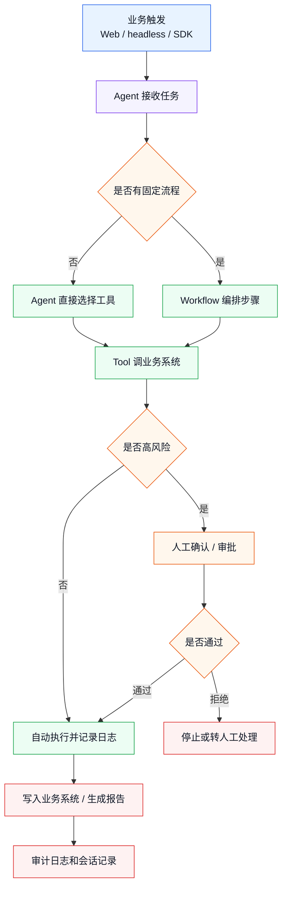

# 从业务场景到 dsh 落地方案

> 目标：拿到一个业务需求后，能快速判断应该用 dsh 的哪些能力，先做什么，后做什么，哪里必须人工确认。

这篇接在 [00-business-quickstart.md](00-business-quickstart.md) 后面读。上一篇回答“dsh 是什么”，这一篇回答“业务怎么落地成 dsh 方案”。

---

## 1. 先不要问“怎么写插件”

很多人一上来会问：

```text
我要写几个插件？
要不要写 workflow？
要不要用 headless？
要不要接 Python SDK？
```

这些都不是第一步。

第一步应该问业务问题：

```text
谁发起任务？
Agent 要做哪些动作？
哪些动作有风险？
结果写到哪里？
怎么证明它做对了？
```

如果业务动作和风险边界没想清楚，直接写插件只会把复杂度提前。

---

## 2. 业务需求拆解成 7 个问题

拿到一个业务场景，先填这张表。

| 问题 | 要问什么 | 输出物 |
|------|----------|--------|
| 1. 入口 | 任务从哪里来？人工、系统推送、定时任务、SDK？ | 入口方式 |
| 2. 目标 | 最终要产生什么结果？文本、数据库记录、审批单、报告？ | 验收标准 |
| 3. 动作 | Agent 需要调用哪些系统或工具？ | 工具清单 |
| 4. 流程 | 任务是否有固定步骤和分支？ | 流程图 |
| 5. 风险 | 哪些动作不能自动执行？ | 人工确认点 |
| 6. 数据 | 输入、输出、状态、日志放哪里？ | 数据对象 |
| 7. 运维 | 失败、重试、超时、回滚怎么处理？ | 异常策略 |

这 7 个问题填完，dsh 方案基本就能出来。

---

## 3. 入口怎么选

入口决定业务怎么触发 Agent。

| 业务触发方式 | 推荐入口 | 适合场景 |
|--------------|----------|----------|
| 工作人员手动操作 | `web` profile | 人工审核、查档、客服辅助、运营工具 |
| 后台一次性任务 | `headless` profile | 批量处理、定时巡检、夜间归档 |
| 其他系统调用 | Python SDK / JSON-RPC | OA、ERP、CRM、数据平台集成 |
| 命令行临时任务 | CLI | 开发测试、运维排查、临时处理 |
| 浏览器内业务工作台 | Web UI + 业务插件 | 需要可视化、审批、结果查看 |

简单判断：

```text
需要人看和确认 -> web
自动跑完就退出 -> headless
被别的系统调用 -> SDK / JSON-RPC
```

---

## 4. 能力怎么选

业务能力不要一上来都做成大插件。先判断它属于哪一类。

| 业务需求 | dsh 能力 | 例子 |
|----------|----------|------|
| 让 Agent 调一个接口 | Tool | `query_customer`、`submit_archive` |
| 对接一个系统 | Service Provider + Plugin | OA Provider、DB Provider |
| 注入行业知识 | Skill / Prompt Plugin | 档案分类规则、客服话术规范 |
| 多步骤流程 | Workflow | 接收 -> 分类 -> 审核 -> 入库 |
| 人工确认 | interaction / ask_user_question / Web UI | 是否允许写入生产库 |
| 后台长任务 | headless / jobs | 夜间批处理、巡检报告 |
| 系统可观测 | Session Log / Audit Log | 工具调用记录、审批记录 |

一个业务方案通常不是只用一种能力，而是组合：

```text
Tool 负责动作
Plugin 负责装配能力
Workflow 负责流程
Profile 负责启动形态
Log 负责证明过程
```

---

## 5. 是否需要 Workflow

不是所有业务都需要 Workflow。

先用这个判断：

| 情况 | 是否需要 Workflow |
|------|-------------------|
| 只是问答或一次工具调用 | 不需要 |
| 需要 2-3 步，但每次都由 Agent 自己判断 | 不一定 |
| 有固定步骤、固定顺序 | 建议需要 |
| 有分支、审批、失败重试 | 需要 |
| 需要复盘每个流程节点状态 | 需要 |

例子：

```text
用户问：“帮我查一下这个客户信息”
  -> 一个 query_customer 工具就够

用户说：“把这批客户按规则分层，生成名单，发起审批，通过后同步 CRM”
  -> 需要 Workflow
```

Workflow 的价值不是“显得高级”，而是让流程边界固定下来：

- 哪一步先执行。
- 哪一步可以重试。
- 哪一步必须人工确认。
- 哪一步失败后停止。
- 哪些数据进入最终结果。

---

## 6. 业务落地总图

可以用这张图把大多数业务场景放进去：



读这张图时，只看四条线：

1. 任务从哪里来。
2. Agent 怎么决定动作。
3. 哪些地方要人工确认。
4. 最后怎么写入系统和留痕。

---

## 7. MVP 应该怎么切

业务落地最容易失败的地方，是一开始想做完整系统。

建议按三层切 MVP。

### 第一层：跑通动作

目标：Agent 能调用业务工具。

只做：

- 1 个入口。
- 2-3 个工具。
- 1 份测试数据。
- 1 个输出结果。

不做：

- 完整权限。
- 复杂流程。
- 批量处理。
- 大量 UI。

### 第二层：跑通流程

目标：Agent 能按业务步骤完成闭环。

补上：

- 固定流程。
- 人工确认点。
- 失败转人工。
- 结果写入测试库。
- 基础审计日志。

### 第三层：跑通生产边界

目标：能小范围试运行。

补上：

- 真实系统接口。
- 权限控制。
- 重试和超时。
- 运维日志。
- 回滚或补偿方案。
- 灰度试点。

---

## 8. 业务组件模板

每个业务场景可以按这个模板整理。

### 8.1 业务入口

```text
入口名称：
触发方式：Web / headless / SDK / webhook / 定时任务
触发人或系统：
输入数据：
期望输出：
```

### 8.2 工具清单

| 工具名 | 做什么 | 输入 | 输出 | 风险等级 | 是否需要确认 |
|--------|--------|------|------|----------|--------------|
| `query_xxx` | 查询业务数据 | ID / 条件 | 业务记录 | 低 | 否 |
| `save_xxx` | 写入业务数据 | 结构化结果 | 成功 / 失败 | 高 | 是 |
| `notify_xxx` | 通知外部系统 | 消息内容 | 回执 | 中 | 视情况 |

风险等级可以先粗略分：

```text
低：只读，不影响业务状态
中：生成结果，但不直接写生产
高：写生产、发通知、审批、删除、覆盖
```

### 8.3 流程节点

| 步骤 | 谁执行 | 输入 | 输出 | 失败怎么办 |
|------|--------|------|------|------------|
| 1. 接收数据 | 系统 | 原始数据 | 标准对象 | 格式错误则转人工 |
| 2. AI 判断 | Agent | 标准对象 | 分类 / 建议 | 低置信度转人工 |
| 3. 写入系统 | Tool | 确认后的结果 | 写入回执 | 失败重试或回滚 |

### 8.4 人工确认点

| 确认点 | 触发条件 | 人要看什么 | 通过后做什么 |
|--------|----------|------------|--------------|
| 分类确认 | 置信度低 | AI 分类理由和原文摘要 | 继续编目 |
| 写入确认 | 写生产库前 | 待写入字段 diff | 调写入工具 |
| 对外通知确认 | 发消息前 | 通知内容和对象 | 发送通知 |

### 8.5 审计字段

| 字段 | 说明 |
|------|------|
| `request_id` | 本次业务请求 |
| `session_id` | dsh 会话 |
| `operator_id` | 发起人 |
| `tool_name` | 工具名 |
| `input_summary` | 输入摘要 |
| `decision` | 自动通过 / 需人工 / 拒绝 / 失败 |
| `reason` | 判断原因 |
| `output_ref` | 输出结果引用 |
| `created_at` | 时间 |

---

## 9. 三个典型业务映射

### 9.1 档案归档

| 业务元素 | dsh 映射 |
|----------|----------|
| OA 推送公文 | SDK / webhook 入口 |
| 自动分类 | `classify_archive` 工具 |
| 元数据提取 | `extract_metadata` 工具 |
| 低置信度确认 | Web UI / ask_user_question |
| 入库 | `save_archive` 工具 |
| 回写 OA | `notify_oa_archived` 工具 |
| 流程编排 | Workflow |
| 审计 | Session Log + 业务审计表 |

### 9.2 运维巡检

| 业务元素 | dsh 映射 |
|----------|----------|
| 每晚执行 | headless profile / 定时触发 |
| 采集状态 | `bash` / 自定义监控工具 |
| 分析异常 | Agent |
| 生成报告 | Tool 或最终回复 |
| 严重告警 | 人工确认后通知 |
| 历史追踪 | 日志和报告归档 |

### 9.3 知识库问答升级为业务助手

| 业务元素 | dsh 映射 |
|----------|----------|
| 用户提问 | Web UI |
| 检索知识库 | 自定义检索工具 |
| 查询业务系统 | `query_order` / `query_customer` |
| 需要修改状态 | 高风险工具 + 人工确认 |
| 输出答案 | Agent 最终回复 |
| 留痕 | 会话记录 + 操作日志 |

这个例子很重要：RAG 只能回答“知道什么”，dsh 可以进一步处理“要不要行动、怎么行动、行动是否合规”。

---

## 10. 落地评审清单

做方案评审时，可以直接拿这张表问。

| 检查项 | 要求 |
|--------|------|
| 业务目标清楚 | 能一句话说清楚 Agent 要完成什么 |
| MVP 足够小 | 2-3 个工具能跑通第一版 |
| 工具边界明确 | 每个工具输入输出清楚 |
| 高风险动作可控 | 写入、删除、通知、审批都有确认机制 |
| 流程可追踪 | 每一步有状态和日志 |
| 失败有去向 | 重试、停止、转人工至少选一种 |
| 数据对象统一 | 不让每个工具各自理解一套字段 |
| 可逐步扩展 | 新能力能以插件方式增加 |

如果这张表填不出来，说明还不适合开始写代码。

---

## 11. 下一步读什么

读完这一篇后，可以按目标选择：

| 目标 | 下一篇 |
|------|--------|
| 想先理解整体架构 | [architecture.md](architecture.md) |
| 想理解为什么用插件扩展 | [plugin-system.md](plugin-system.md) |
| 想看具体业务案例 | [archive-solution.md](archive-solution.md) |
| 想回到快速入门 | [00-business-quickstart.md](00-business-quickstart.md) |

建议学习顺序：

```text
00-business-quickstart
  -> 01-business-landing-map
  -> archive-solution
  -> architecture
  -> plugin-system
```

这个顺序是业务落地导向，不是源码阅读导向。先知道怎么拆业务，再看 dsh 的机制为什么能支撑这种拆法。
