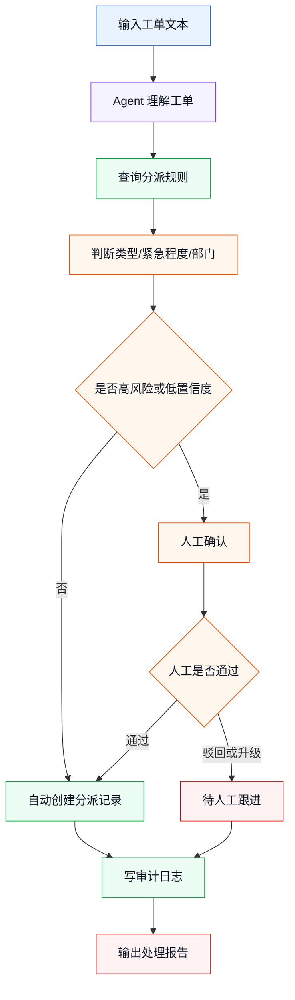
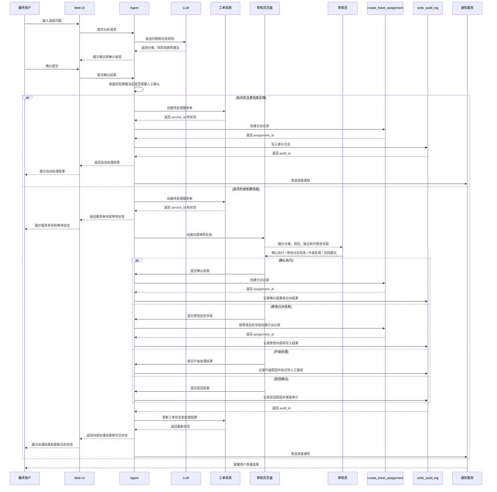
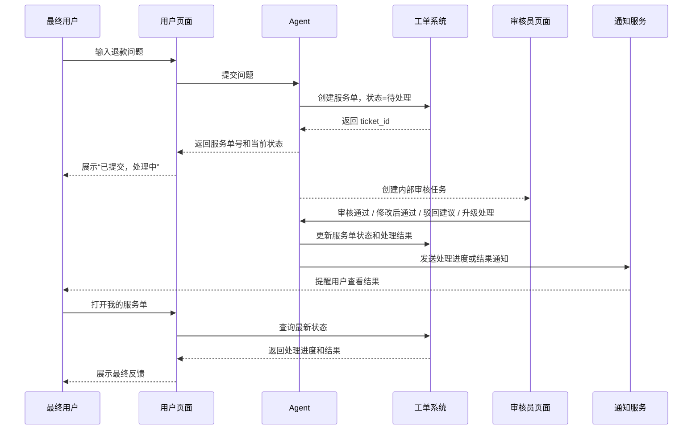
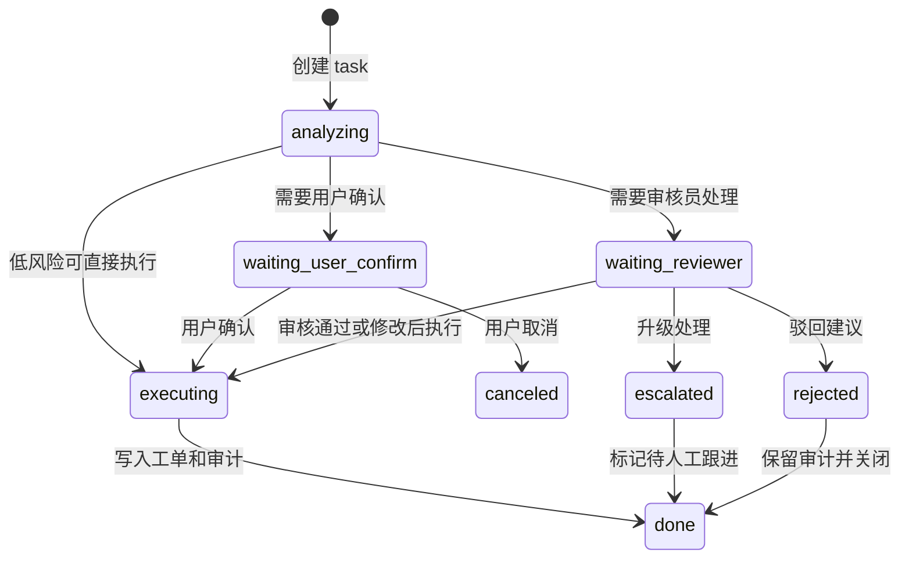

# 做第一个业务 Agent：客户工单分派助手

> 目标：用一个足够简单的业务场景，把 dsh 的业务落地方法走一遍。读完后，你应该知道一个业务 Agent 的 MVP 应该怎么拆、怎么验收。

这篇不追求完整开发细节，而是训练一种落地思路：

```text
业务问题
  -> Agent 任务
  -> 工具清单
  -> 流程节点
  -> 人工确认
  -> 审计日志
  -> MVP 验收
```

---

## 1. 场景选择：客户工单分派

我们选一个常见、容易理解的场景：

> 用户提交客服工单后，AI 自动判断工单类型、紧急程度和责任部门。低风险工单自动分派，高风险或不确定工单交给人工确认。所有判断和分派动作都要留痕。

这个场景适合入门，因为它不需要一上来接很多复杂系统，但能覆盖 dsh 落地的关键点：

- Agent 要理解自然语言。
- 需要调用业务工具。
- 有人工确认点。
- 有写入动作。
- 有审计日志。
- 可以先做很小的 MVP。

---

## 2. 先定义 MVP 边界

第一版不要做完整客服系统，只做“能跑通一条工单”。

### 2.1 MVP 要做什么

| 模块 | 第一版范围 |
|------|------------|
| 输入 | 手动输入一条工单文本 |
| 判断 | 识别工单类型、紧急程度、建议部门 |
| 工具 | 查询部门规则、创建分派记录、写审计日志 |
| 人工确认 | 高紧急或低置信度时确认 |
| 输出 | 返回处理报告 |
| 验收 | 10 条样例工单里 8 条能正确分派或进入人工跟进 |

### 2.2 MVP 不做什么

第一版先不要做：

- 多渠道接入。
- 完整客服工单系统。
- 大量 UI 页面。
- 复杂 SLA 计算。
- 多轮审批。
- 自动通知客户。
- 全量历史数据训练。

MVP 的目的不是上线，而是证明：

```text
dsh 能让 Agent 在业务规则约束下完成一个可追踪动作
```

---

## 3. 把业务话翻译成 dsh 组件

业务需求可以这样映射：

| 业务说法 | dsh 里的表达 |
|----------|---------------|
| 用户提交工单 | Web 输入 / SDK 调用 / headless 任务 |
| AI 判断分类 | Agent 推理 + 规则 Skill |
| 查询部门规则 | `query_routing_rules` 工具 |
| 创建分派记录 | `create_ticket_assignment` 工具 |
| 高风险要人工确认 | `ask_user_question` / Web UI |
| 记录过程 | `write_audit_log` 工具 / Session Log |
| 以后扩展到其他工单 | 新增规则、工具或插件 |

核心思想：

```text
Agent 不直接“随便操作系统”
Agent 只能通过定义好的工具行动
```

---

## 4. 业务流程图

先用流程图固定边界：



这张图比代码更重要。它先回答：

- 哪些动作由 Agent 判断。
- 哪些动作通过工具执行。
- 哪些地方必须人工确认。
- 失败、驳回或升级后走哪里。
- 最终怎么留痕。

### 4.1 业务时序图

上面的流程图说明“有哪些步骤”，时序图说明“这些步骤由谁发起、谁执行、谁返回结果”。

这一节要先抓住一件事：

- **对 agent 来说，这是一条完整业务时序。**
- 用户和审核员只是这条时序里的两个角色面。
- 用户关心输入、确认、进度和结果。
- 审核员关心分类、风险、分派建议、修改内容和审计。
- 低风险可以自动处理，高风险或低置信度进入审核员处理。

第一版 MVP 的入口可以先做成一个很简单的 Web 页面：

```text
用户输入问题
  -> Agent 组织上下文
  -> LLM 给出建议
  -> 用户确认提交
  -> 系统生成服务单
  -> 用户看到处理中和后续进度
```



这张主图要表达的重点是：

- 用户和审核员是同一条业务链路里的不同角色。
- 修改分派信息修改的是“即将写入工单系统的字段”，不是用户原始问题。
- 所有分支都要写审计日志。
- 最终还要把结果回写到用户能看到的服务单状态里。

### 4.2 提交后的反馈闭环

主图已经把完整业务链路串起来了。但从最终用户视角，还要单独看一眼异步反馈：

```text
我提交之后，审核需要时间，那我去哪里看结果？
```

答案是：不要让用户一直停在“等待审核”的页面里。用户确认提交后，系统应该立刻生成一个可追踪的服务单，并把状态返回给用户。



这里有两个页面，不要混在一起：

| 页面 | 谁看 | 看到什么 | 不应该看到什么 |
|------|------|----------|----------------|
| 用户确认页 | 最终用户 | 问题内容、提交动作、服务单号、处理状态、最终反馈 | 内部部门、风险规则、驳回、升级处理、审计日志 |
| 审核员页 | 业务人员 / 审核员 | 分类、风险、建议部门、工具结果、审计链路、确认按钮 | 面向用户的安抚文案 |

所以闭环应该是：

```text
用户提交
  -> 系统返回服务单号
  -> 用户看到“处理中”
  -> 审核员在内部页面处理
  -> 工单状态更新
  -> 用户收到通知或回到“我的服务单”查看结果
```

这样即使审核需要几分钟、几小时，用户也不会觉得请求丢了。

### 4.3 Agent 和人是怎么交互的

这部分是技术实现的关键。

Agent 不要做成一个“收一次请求、吐一次结果”的函数，而要做成一个**有状态的工作流**：

- 每个请求都有自己的 `session_id` 或 `task_id`
- 每个阶段都要落库
- 遇到人工确认就暂停
- 人做完决定后，再把决定作为新事件喂回 Agent

#### 推荐实现

```text
用户/审核员发起动作
  -> Controller 写入 task/session
  -> Runner 读取当前状态继续执行
  -> LLM / Tool / Human Gate 逐步推进
  -> 每一步都写 event 和 audit
  -> 前端通过轮询或 SSE 看到状态变化
```



#### 建议的数据对象

| 对象 | 作用 |
|------|------|
| `session` | 一次完整业务会话，承载上下文 |
| `task` | 当前要处理的业务任务 |
| `review_task` | 需要人工审核的待办 |
| `event` | 记录用户确认、审核决策、LLM 输出、工具结果 |
| `audit_log` | 记录可追溯的业务留痕 |

#### 建议的接口

| 接口 | 作用 |
|------|------|
| `POST /api/sessions` | 创建会话并提交用户输入 |
| `GET /api/sessions/{id}` | 查询当前状态、结果和下一步 |
| `POST /api/sessions/{id}/events` | 用户确认后继续推进任务 |
| `GET /api/review-tasks/{id}` | 审核员拉取待办 |
| `POST /api/review-tasks/{id}/decision` | 审核员提交确认、修改、升级或驳回 |

#### 前端怎么拿结果

- 用户页：`SSE`、`WebSocket` 或轮询都可以，核心是展示 `waiting`、`processing`、`done`
- 审核员页：先拉取待办，再提交 decision
- 后端：收到 decision 后，不直接返回最终业务结果，而是把 decision 写成事件，继续驱动 Agent 跑完后续步骤

#### 这套方案的好处

- 不怕中途暂停
- 不怕人工介入
- 不怕流程很长
- 每一步都可追溯
- 很容易做失败重试和状态恢复

### 4.4 多用户并发怎么隔离

一个 Agent 不是只能服务一个用户。

更准确的理解是：

```text
Agent 代码可以共享
Agent Runtime 可以并发执行
但每个用户的 session、task、context、event 必须隔离
```

也就是说，系统里不是为每个用户启动一个完全独立的 Agent 程序，而是让同一套 Agent 能力处理很多条独立任务。

```text
用户 A -> session_A -> task_A -> context_A -> events_A
用户 B -> session_B -> task_B -> context_B -> events_B
用户 C -> session_C -> task_C -> context_C -> events_C
```

#### 隔离边界

| 隔离对象 | 为什么要隔离 |
|----------|--------------|
| `user_id` | 知道这个请求属于谁 |
| `tenant_id` | 多租户或多业务线不能串数据 |
| `session_id` | 一次对话或一次业务处理的上下文边界 |
| `task_id` | 一条具体业务任务的状态边界 |
| `review_task_id` | 一条人工审核待办的操作边界 |
| `event_id` | 每一步输入、输出、决策都要能追踪 |
| `permission_scope` | 工具调用只能访问当前用户或当前业务允许的数据 |

#### 技术实现方式

每次请求都必须带上身份和会话信息：

```text
POST /api/sessions
Authorization: Bearer <token>

{
  "tenant_id": "mall_a",
  "user_id": "user_001",
  "message": "我这单退款三天了还没到账"
}
```

后端创建隔离的会话和任务：

```text
session:
  id = session_001
  tenant_id = mall_a
  user_id = user_001

task:
  id = task_001
  session_id = session_001
  status = analyzing

event:
  task_id = task_001
  type = user_message
  payload = 用户输入
```

之后 Agent 每次继续执行，都不能只靠内存变量，而要按 `task_id` 重新加载：

```text
load task by task_id
load session by session_id
check user_id / tenant_id / permission_scope
load context for this session only
run next step
append event
save new status
```

#### 为什么不能只用全局变量

不要这样做：

```text
current_user = 用户 A
current_context = 用户 A 的上下文

另一个请求进来
current_user = 用户 B
current_context = 用户 B 的上下文
```

这种写法在并发下很容易串上下文：

- 用户 A 看到用户 B 的结果
- 审核员处理错任务
- Agent 调工具时拿错业务数据
- 审计日志无法追溯

#### 推荐的数据访问规则

任何查询都要带隔离条件：

```sql
select * from tasks
where id = :task_id
  and tenant_id = :tenant_id;
```

任何审核操作都要检查任务归属：

```text
review_task.task_id -> task.session_id -> session.tenant_id
```

任何工具调用都要带最小必要上下文：

```text
tool_input = {
  "tenant_id": "mall_a",
  "ticket_id": "ticket_123",
  "allowed_actions": ["read_ticket", "create_assignment"]
}
```

#### 并发执行时怎么避免重复处理

多用户并发时，还要防止同一个任务被执行两次：

```text
worker_1 取到 task_001
worker_2 也取到 task_001
两个 worker 同时创建分派记录
```

常见做法：

- `task.version` 乐观锁
- `review_task.status` 从 `pending` 原子更新为 `processing`
- 工具调用加 `idempotency_key`
- 写入业务系统前检查是否已经有 `assignment_id`

例如：

```sql
update review_tasks
set status = 'processing', version = version + 1
where id = :review_task_id
  and status = 'pending'
  and version = :old_version;
```

如果更新行数是 0，说明这个审核任务已经被别人处理了。

#### 一句话总结

```text
Agent 能力是共享的
用户上下文是隔离的
任务状态是持久化的
执行过程是可恢复的
工具调用是带权限边界的
```

---

## 5. 工具怎么设计

第一版只需要 3 个工具。

### 工具 1：`query_routing_rules`

用途：查询工单分派规则。

```text
输入：
  - ticket_text
  - optional category_hint

输出：
  - 可选分类列表
  - 部门映射规则
  - 高风险关键词
  - 人工确认规则
```

为什么需要这个工具：

```text
业务规则不要硬塞进模型记忆里
规则应该来自可维护的数据源或配置
```

### 工具 2：`create_ticket_assignment`

用途：创建工单分派记录。

```text
输入：
  - ticket_id
  - category
  - urgency
  - target_department
  - reason

输出：
  - assignment_id
  - status
```

风险等级：高。

因为它会写入业务系统，所以建议：

- 高紧急工单先人工确认。
- 低置信度结果先人工确认。
- 分派前展示即将写入的字段。

### 工具 3：`write_audit_log`

用途：记录 Agent 的判断和行动。

```text
输入：
  - ticket_id
  - session_id
  - decision
  - reason
  - tool_calls
  - human_approval

输出：
  - audit_id
```

审计日志不要只记录“最终成功”。更应该记录：

- AI 判断了什么。
- 为什么这么判断。
- 调用了什么工具。
- 人是否确认。
- 最终写入了什么。

---

## 6. Agent 应该怎么判断

Agent 的任务不是“自己创造业务规则”，而是按规则做判断。

可以给 Agent 一个简单工作准则：

```text
你是客户工单分派助手。
你的任务是判断工单类型、紧急程度和责任部门。
必须先查询分派规则，再做判断。
如果置信度低、出现投诉升级、退款、法律、数据安全等高风险词，必须请求人工确认。
写入分派记录前，要说明分类、部门和理由。
所有处理都必须记录审计日志。
```

这里有一个关键点：

```text
让 Agent 遵守流程，不等于相信 Agent 永远会遵守流程
```

高风险动作仍然要靠工具权限、人工确认和审计日志兜底。

---

## 7. 人工确认怎么设计

不是每一步都要人工确认。只确认高风险部分。

| 确认点 | 触发条件 | 人要看什么 |
|--------|----------|------------|
| 分类确认 | 分类置信度低 | 原工单、AI 分类、理由 |
| 高风险确认 | 涉及投诉升级、退款、法律、安全 | 风险标签、建议部门、处理建议 |
| 写入确认 | 即将写入正式工单系统 | 字段 diff、目标部门、理由 |

人工确认的问题要短：

```text
是否允许将该工单分派给“售后支持部”？

原因：
- 用户明确提到退款
- 规则命中“售后争议”
- AI 置信度 0.82
```

不要让人工审核一大段模型推理。只展示决策所需信息。

---

## 8. 审计日志怎么设计

第一版可以用一张简单表。

| 字段 | 示例 |
|------|------|
| `request_id` | `req_001` |
| `ticket_id` | `ticket_123` |
| `session_id` | `session_abc` |
| `category` | `售后争议` |
| `urgency` | `高` |
| `target_department` | `售后支持部` |
| `decision` | `人工确认后分派` |
| `reason` | `命中退款关键词，规则建议售后支持部` |
| `human_approval` | `approved` |
| `assignment_id` | `assign_789` |
| `created_at` | `2026-08-16T10:00:00+08:00` |

审计的目标不是堆字段，而是能回答：

```text
这条工单为什么被分给这个部门？
是谁确认的？
调用了哪些工具？
最终写入了什么？
如果出错，应该从哪里排查？
```

---

## 9. MVP 的完整运行例子

输入工单：

```text
我上周买的设备一直无法启动，客服说会联系我但没人处理。
现在我要求退款，如果今天没有答复，我会投诉。
```

Agent 的理想处理过程：

```text
1. 识别关键词：无法启动、退款、投诉。
2. 调 query_routing_rules 查询规则。
3. 判断：
   - category = 售后争议
   - urgency = 高
   - target_department = 售后支持部
4. 因为命中“退款”和“投诉”，请求人工确认。
5. 人工确认通过。
6. 调 create_ticket_assignment 创建分派记录。
7. 调 write_audit_log 写审计日志。
8. 输出处理报告。
```

输出报告：

```text
处理结果：已分派
工单类型：售后争议
紧急程度：高
责任部门：售后支持部
原因：用户提到设备无法启动、退款和投诉，命中高风险售后争议规则。
人工确认：已通过
分派记录：assign_789
审计记录：audit_456
```

---

## 10. 第一版验收标准

不要用“感觉能用”做验收。先定具体标准。

### 样例集

准备 10 条工单：

| 类型 | 数量 |
|------|------|
| 普通咨询 | 2 |
| 售后问题 | 2 |
| 退款争议 | 2 |
| 投诉升级 | 2 |
| 信息不完整 | 2 |

### 验收指标

| 指标 | 标准 |
|------|------|
| 分类准确率 | >= 80% |
| 高风险召回 | 退款、投诉、法律、安全类必须进入人工跟进 |
| 写入正确性 | 自动或确认后写入字段无明显错误 |
| 审计完整性 | 每条处理都有审计记录 |
| 失败处理 | 信息不足时不强行分派，能进入人工跟进 |

第一版最重要的验收不是“自动化率”，而是：

```text
该自动的能自动
不该自动的能停住
出了问题能追溯
```

---

## 11. 从 MVP 到生产怎么扩展

### 阶段 1：手动输入

```text
Web UI 输入工单文本
  -> Agent 处理
  -> 写测试库
```

目标：验证 Agent、工具、人工确认、审计闭环。

### 阶段 2：接测试系统

```text
测试工单系统
  -> SDK / API 触发
  -> Agent 处理
  -> 写测试库
```

目标：验证系统集成和字段映射。

### 阶段 3：灰度生产

```text
真实工单系统
  -> 只处理低风险类型
  -> 高风险全部人工确认
  -> 每日复盘审计日志
```

目标：验证稳定性、准确率和业务接受度。

### 阶段 4：扩大范围

可以逐步增加：

- 更多工单类型。
- 更多部门规则。
- 自动通知。
- SLA 计算。
- 批量处理。
- 周报统计。
- 与 CRM / OA / 知识库联动。

---

## 12. 这个例子对应 dsh 的哪些学习点

| 学习点 | 在例子里的位置 | 后续看哪篇 |
|--------|----------------|------------|
| Agent 循环 | Agent 判断并调用工具 | [architecture.md](architecture.md) |
| Tool | 三个业务工具 | [plugin-system.md](plugin-system.md) |
| Plugin | 工具和规则能力打包 | [plugin-system.md](plugin-system.md) |
| Profile | Web / headless / SDK 入口 | [architecture.md](architecture.md) |
| Workflow | 固定分派流程 | [01-business-landing-map.md](01-business-landing-map.md) |
| 人工确认 | 高风险确认点 | [archive-solution.md](archive-solution.md) |
| 审计日志 | `write_audit_log` | [archive-solution.md](archive-solution.md) |

---

## 13. 练习：换成你的业务

把下面模板填一遍，就能开始设计自己的第一个业务 Agent。

```text
业务场景：

入口：

Agent 要完成的目标：

需要的 3 个工具：
1.
2.
3.

哪些动作必须人工确认：

最终写入哪里：

审计日志至少记录什么：

10 条测试样例怎么准备：

MVP 成功标准：
```

如果这张表填不出来，说明还不该写代码。先回到业务流程和风险边界，把问题问清楚。
