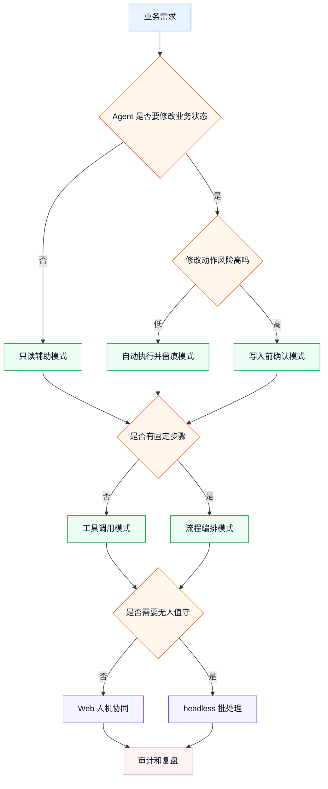
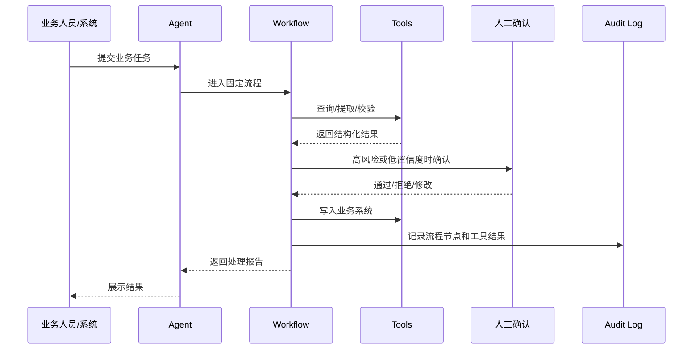

# 业务 Agent 落地模式库

> 目标：看到一个业务需求后，能快速判断应该用哪种 Agent 落地模式，以及在 dsh 里大致应该怎么组织入口、工具、插件、流程、确认点和日志。

前面几篇已经讲了：

- dsh 是什么。
- 业务需求怎么拆。
- 第一个业务 Agent 怎么做。
- MVP 怎么交付。

这一篇不继续加新概念，而是把常见业务场景整理成“模式”。

你可以把它当成选型速查表：

```text
业务需求来了
  -> 先判断它属于哪类模式
  -> 再决定入口、工具、流程、确认点、日志
  -> 最后切一个小 MVP
```

---

## 1. 为什么要先看模式

很多业务 Agent 项目一开始容易陷入两个误区：

| 误区 | 结果 |
|------|------|
| 一上来讨论模型和提示词 | 忽略了业务动作、权限和留痕 |
| 一上来讨论插件开发 | 还没想清楚到底要让 Agent 做什么 |

更稳的方式是先问：

```text
这个 Agent 是只读，还是会写系统？
是人工值守，还是后台自动跑？
是一步完成，还是固定流程？
失败后能不能自动重试？
是否必须留下审计记录？
```

这些问题决定了落地模式。

---

## 2. 模式选择总图

先用这张图判断业务需求大致属于哪类：



读图时不要记节点名，只抓三件事：

1. 是否写系统。
2. 是否固定流程。
3. 是否无人值守。

这三件事决定 80% 的方案形态。

---

## 3. 8 种常见落地模式

### 3.1 只读辅助模式

适合场景：

- 客服辅助查询。
- 运维知识库问答。
- 档案检索说明。
- 合同条款解释。
- 内部制度问答。

核心特点：

```text
Agent 可以查资料、查系统、生成建议
但不直接修改业务数据
```

dsh 里的常见组织方式：

| 位置 | 设计 |
|------|------|
| 入口 | `web` profile 或 SDK |
| 工具 | 查询类工具，比如 `query_customer`、`search_archive` |
| 插件 | 系统对接插件、知识规则插件 |
| 确认点 | 通常不需要写入确认 |
| 日志 | 记录查询来源和回答依据 |

MVP 范围：

```text
先接 1 个数据源
只支持 5-10 类高频问题
回答中展示依据
不做自动写入
```

业务例子：

> 客服输入客户问题，Agent 查询订单、会员等级和售后规则，给出回复建议。客服确认后自己复制回复，不由 Agent 直接发送给客户。

这个模式最适合第一轮试点，因为风险低、反馈快。

---

### 3.2 写入前确认模式

适合场景：

- 创建工单。
- 修改客户标签。
- 提交审批。
- 发起退款。
- 写入档案目录。

核心特点：

```text
Agent 可以准备写入动作
但真正写入前必须让人确认
```

dsh 里的常见组织方式：

| 位置 | 设计 |
|------|------|
| 入口 | `web` profile |
| 工具 | 查询工具 + 写入工具 |
| 确认 | `ask_user_question` 或 Web UI 确认 |
| 审计 | 写入前参数、确认人、确认结果、工具返回值 |

确认信息要让业务人员看得懂：

```text
即将执行：
  将工单 T20260816001 分派给售后支持部

执行原因：
  命中“退款 + 投诉”规则，紧急程度为高

影响：
  会创建正式分派记录

是否继续？
```

MVP 范围：

```text
只做 1 个写入动作
只支持测试系统或测试数据
所有写入都先确认
确认内容必须可读
```

这个模式的价值是：让业务方先信任 Agent 的判断，再逐步放开低风险自动化。

---

### 3.3 自动执行并留痕模式

适合场景：

- 低风险状态同步。
- 自动生成报告。
- 测试环境数据整理。
- 非生产系统批量标记。
- 内部通知草稿生成。

核心特点：

```text
Agent 可以直接执行动作
但必须留下足够日志，方便复盘
```

适合自动执行的动作通常满足：

- 可回滚。
- 影响范围小。
- 不涉及资金、隐私、删除、外发。
- 规则非常明确。
- 有失败兜底。

dsh 里的常见组织方式：

| 位置 | 设计 |
|------|------|
| 入口 | `web`、SDK 或 `headless` |
| 工具 | 写入工具、通知工具、日志工具 |
| 插件 | 业务系统对接插件 |
| 审计 | 每次工具调用都记录输入、输出和状态 |

MVP 范围：

```text
只自动执行低风险动作
高风险动作仍然转人工确认
失败时停止，不继续扩大影响
```

业务例子：

> 每晚自动读取当天已关闭工单，生成分类统计报告，并写入运营日报草稿。Agent 不直接外发日报，只生成草稿和日志。

---

### 3.4 流程编排模式

适合场景：

- 档案接收、整理、审核、入库。
- OA 公文处理。
- 合同审查。
- 客诉升级处理。
- 报销初审。

核心特点：

```text
任务不是一步完成
而是有固定步骤、分支、审批和失败处理
```

是否需要流程编排，可以看这张表：

| 现象 | 是否建议流程化 |
|------|----------------|
| 只有一次查询 | 不需要 |
| 每次步骤都不固定 | 不一定 |
| 有固定顺序 | 建议 |
| 有审批分支 | 需要 |
| 要追踪每个节点状态 | 需要 |
| 失败后要重试或转人工 | 需要 |

模式图：



MVP 范围：

```text
先只做主流程
只保留 1 个审批点
只接 1 个业务系统
失败全部转人工
```

这个模式最接近真实业务落地，但不要第一版就做太完整。

---

### 3.5 headless 批处理模式

适合场景：

- 夜间批量归档。
- 定时巡检。
- 批量生成日报。
- 批量分类历史数据。
- 定时检查异常订单。

核心特点：

```text
没有人在界面上一直陪着 Agent
任务启动后自动执行，完成后退出或产出结果
```

dsh 里的常见组织方式：

| 位置 | 设计 |
|------|------|
| 入口 | `headless` profile |
| 输入 | 文件、任务参数、系统队列、定时任务 |
| 工具 | 批量读取、处理、写入、生成报告 |
| 风险 | 高风险动作不要自动执行，输出待确认清单 |
| 日志 | 每批次、每条记录、失败原因 |

MVP 范围：

```text
先处理 10-30 条样例
限制最大处理数量
失败立即记录并跳过或停止
不要第一版就跑全量历史数据
```

业务例子：

> 每晚处理当天新增档案，自动提取元数据和分类。低置信度档案进入“待人工确认清单”，高置信度档案写入测试库。

这个模式的关键不是“跑得快”，而是“失败可控、结果可复查”。

---

### 3.6 系统集成适配器模式

适合场景：

- 对接 OA。
- 对接 CRM。
- 对接档案系统。
- 对接知识库。
- 对接审批系统。

核心特点：

```text
Agent 不直接知道每个系统的细节
插件把业务系统包装成稳定工具或服务
```

推荐拆法：

| 层次 | 职责 |
|------|------|
| Agent | 决定下一步该做什么 |
| Tool | 暴露一个清晰动作 |
| Plugin | 装配工具、配置和服务 |
| Adapter | 处理具体系统接口、鉴权、字段转换 |

例子：

```text
Agent 想做的动作：
  查询客户最近一次投诉

工具名：
  query_latest_complaint

适配器内部：
  调 CRM 接口
  转换客户 ID
  处理接口错误
  返回统一结构
```

MVP 范围：

```text
先对接 1 个系统
先封装 2-3 个高频动作
接口失败时返回可理解错误
不要让 Agent 直接拼业务系统参数
```

这个模式能降低后续扩展成本，因为业务系统变化时，优先改适配器，不是改 Agent 的思考逻辑。

---

### 3.7 审计优先模式

适合场景：

- 政务。
- 金融。
- 档案。
- 医疗。
- 法务。
- 涉密或合规场景。

核心特点：

```text
先设计怎么留痕
再设计怎么自动化
```

至少要记录：

| 记录项 | 说明 |
|--------|------|
| 输入 | 用户任务、文件、业务 ID |
| 判断 | Agent 给出的分类、风险、原因 |
| 工具调用 | 工具名、输入、输出、状态 |
| 人工确认 | 确认人、确认时间、确认结果 |
| 写入结果 | 写入了什么系统、返回什么 ID |
| 异常 | 失败原因、是否重试、是否转人工 |

业务上可以这样理解：

```text
不是只问“Agent 做了什么”
还要能回答“它为什么这么做，谁允许它这么做，结果写到了哪里”
```

MVP 范围：

```text
先定义一张审计日志表或日志格式
每个工具调用都能关联 session_id / task_id
每个高风险动作都能关联确认记录
```

审计优先不是额外工作，而是业务 Agent 能进入真实流程的基础。

---

### 3.8 转人工兜底模式

适合场景：

- Agent 置信度不足。
- 业务规则冲突。
- 系统接口失败。
- 用户问题超出范围。
- 操作风险过高。

核心特点：

```text
Agent 不需要什么都能自动完成
它必须知道什么时候停下来，把问题交给人
```

常见转人工条件：

| 条件 | 例子 |
|------|------|
| 低置信度 | 分类不确定、多个部门都可能负责 |
| 高风险 | 涉及退款、删除、外发、涉密 |
| 规则冲突 | 两条规则给出不同结果 |
| 数据缺失 | 缺少客户 ID、档案号、审批单号 |
| 工具失败 | 接口超时、权限不足、返回异常 |

转人工时不要只说“失败了”。应该带上上下文：

```text
需要人工处理：
  工单 T20260816002 无法自动分派

原因：
  同时命中“投诉升级”和“财务退款”规则

Agent 已完成：
  查询客户信息
  查询分派规则
  生成候选部门

建议：
  请人工选择售后支持部或财务部
```

MVP 范围：

```text
所有不确定情况先转人工
转人工消息必须带原因和已执行步骤
后续再逐步把高频兜底场景规则化
```

---

## 4. 模式组合：真实项目通常不是单选

真实业务项目通常会组合多个模式。

以“档案馆公文归档”为例：

| 业务步骤 | 推荐模式 |
|----------|----------|
| 从 OA 接收办结公文 | 系统集成适配器模式 |
| 提取标题、文号、责任部门 | 只读辅助模式 |
| 判断档案分类 | 只读辅助模式 + 审计优先模式 |
| 生成档号 | 写入前确认模式 |
| 写入档案系统 | 写入前确认模式 / 自动执行并留痕模式 |
| 夜间处理历史文件 | headless 批处理模式 |
| 低置信度分类 | 转人工兜底模式 |
| 全流程状态跟踪 | 流程编排模式 |

所以不要问：

```text
这个项目到底是哪一种模式？
```

更应该问：

```text
这个业务流程的每个步骤分别适合哪种模式？
```

---

## 5. 从模式到 dsh 组件

可以用这张表把模式翻译成 dsh 组件。

| 模式 | 入口 | 工具 | 插件 | 流程 | 确认 | 日志 |
|------|------|------|------|------|------|------|
| 只读辅助 | `web` / SDK | 查询工具 | 知识/系统插件 | 可选 | 少 | 查询和依据 |
| 写入前确认 | `web` | 查询 + 写入 | 系统插件 | 可选 | 强 | 写入前后 |
| 自动执行并留痕 | SDK / `headless` | 写入/生成 | 系统插件 | 可选 | 中 | 强 |
| 流程编排 | `web` / SDK | 多工具 | 工作流插件 | 强 | 强 | 节点级 |
| headless 批处理 | `headless` | 批量工具 | 批处理插件 | 可选 | 弱或离线确认 | 批次级 |
| 系统集成适配器 | 任意 | 统一业务工具 | 对接插件 | 可选 | 看风险 | 接口级 |
| 审计优先 | 任意 | 审计工具 | 审计插件 | 建议 | 看风险 | 最强 |
| 转人工兜底 | `web` / 工单系统 | 转交工具 | 交互插件 | 可选 | 强 | 原因和上下文 |

这个表不是源码 API 对照表，而是方案设计表。它用于业务讨论和 MVP 拆解。

---

## 6. 业务落地的推荐顺序

如果不知道从哪里开始，可以按这个顺序：

```text
1. 只读辅助
2. 写入前确认
3. 自动执行低风险动作
4. 流程编排
5. headless 批处理
6. 多系统集成
```

原因很简单：

| 阶段 | 主要目标 |
|------|----------|
| 只读辅助 | 建立业务方信任 |
| 写入前确认 | 让 Agent 接近真实动作 |
| 自动执行低风险动作 | 提升效率 |
| 流程编排 | 进入完整业务闭环 |
| headless 批处理 | 扩大处理规模 |
| 多系统集成 | 支撑更复杂场景 |

不要反过来做。

如果第一步就是“多系统集成 + 全流程自动化 + 无人值守”，项目很容易变成大平台建设，短期很难验证价值。

---

## 7. 常见反模式

| 反模式 | 问题 | 更好的做法 |
|--------|------|------------|
| 让 Agent 直接操作生产系统 | 风险不可控 | 写入前确认，先接测试系统 |
| 把业务规则全写进提示词 | 难维护、难审计 | 规则放工具、配置或业务系统里 |
| 没有转人工路径 | Agent 一失败就卡住 | 明确兜底条件和转交信息 |
| 只看回答质量，不看行动日志 | 无法复盘 | 从第一版就记录工具调用和判断原因 |
| 一次接太多系统 | 集成复杂度过高 | 先接一个核心系统 |
| 第一版就做全量批处理 | 影响范围太大 | 先限制样例数量和处理范围 |
| 只做 Demo，不定义验收 | 很难判断是否有价值 | 准备 10-30 条样例和通过标准 |

---

## 8. 一个 15 分钟选型练习

拿到一个业务需求后，按下面模板填一遍。

```text
业务场景：

Agent 是否会修改业务状态：

是否有高风险动作：

是否有固定流程：

是否需要无人值守：

是否需要对接业务系统：

失败后是否能转人工：

推荐模式：

第一版 MVP 只做：

第一版不做：
```

例子：

```text
业务场景：
  客服工单自动分派

Agent 是否会修改业务状态：
  会，创建分派记录

是否有高风险动作：
  有，高紧急和投诉类工单

是否有固定流程：
  有，理解 -> 查规则 -> 判断 -> 确认 -> 写入 -> 留痕

是否需要无人值守：
  第一版不需要

是否需要对接业务系统：
  第一版可以先模拟工单系统

失败后是否能转人工：
  必须能

推荐模式：
  写入前确认 + 转人工兜底 + 审计优先

第一版 MVP 只做：
  10 条样例工单、3 个工具、1 个确认点、1 份审计日志

第一版不做：
  多渠道接入、自动通知客户、复杂 SLA、全量工单系统改造
```

---

## 9. 学习建议

读这一篇时，不需要记住所有模式名称。

更重要的是形成一个判断习惯：

```text
只读还是写入？
写入是否需要确认？
一步还是流程？
人工值守还是后台批处理？
怎么审计？
失败怎么转人工？
```

这些问题问清楚以后，dsh 的 Agent、Tool、Plugin、Profile、Workflow 才会自然落到业务方案里。

