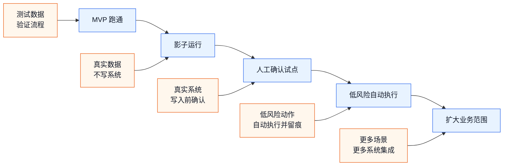
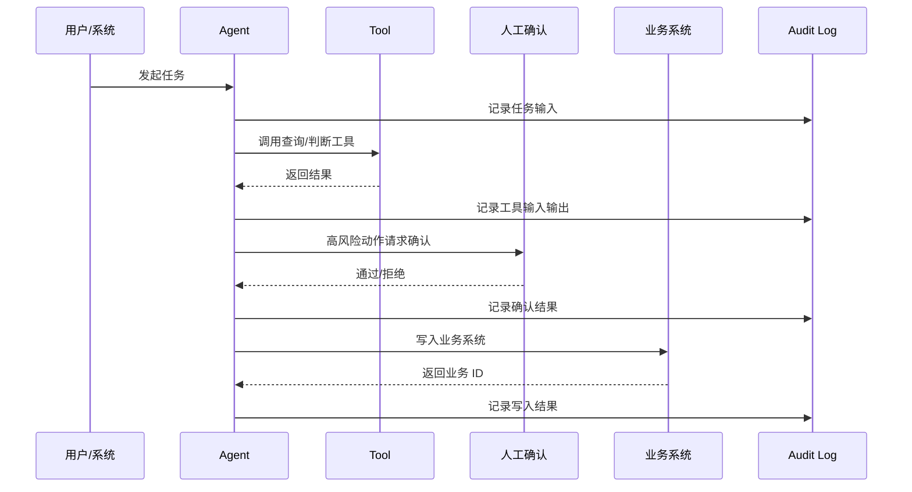

# 从 MVP 到生产试点

> 目标：业务 Agent 的 MVP 跑通之后，知道怎么进入小范围真实试点，怎么控制风险，怎么验收，怎么逐步扩大范围。

前面几篇解决的是：

- 怎么理解 dsh。
- 怎么拆业务场景。
- 怎么做第一个 Agent。
- 怎么按 MVP 节奏交付。
- 常见业务模式和案例怎么套。

这一篇解决的是：

```text
MVP 看起来能跑了
  -> 能不能接真实系统？
  -> 哪些动作可以自动化？
  -> 怎么灰度？
  -> 出问题怎么回退？
  -> 怎么判断可以继续扩大范围？
```

---

## 1. 先分清 Demo、MVP、生产试点

这三个阶段经常被混在一起。

| 阶段 | 目标 | 数据 | 系统 | 风险 |
|------|------|------|------|------|
| Demo | 证明概念可演示 | 构造数据 | 模拟系统 | 很低 |
| MVP | 证明一个小场景可闭环 | 脱敏样例 / 测试数据 | 测试系统 | 可控 |
| 生产试点 | 在真实业务里小范围使用 | 真实数据 | 真实或准生产系统 | 需要治理 |

一个常见错误是：

```text
Demo 能跑
  -> 直接接生产
```

更稳的路径应该是：

```text
Demo
  -> MVP
  -> 影子运行
  -> 人工确认试点
  -> 低风险自动化
  -> 扩大范围
```

---

## 2. 推荐推进路径

从 MVP 到生产试点，可以按 5 个阶段推进：



每个阶段只放开一层风险。

| 阶段 | 放开什么 | 不放开什么 |
|------|----------|------------|
| MVP 跑通 | Agent 可以调模拟工具 | 不接生产 |
| 影子运行 | Agent 可以读真实数据 | 不写业务系统 |
| 人工确认试点 | 可以写真实系统 | 写入前必须人工确认 |
| 低风险自动执行 | 低风险动作可自动执行 | 高风险仍然确认 |
| 扩大业务范围 | 增加场景和系统 | 不一次性全量铺开 |

---

## 3. 影子运行：最容易被忽略的一步

影子运行的意思是：

```text
Agent 读取真实业务输入
给出判断和建议
但不真正写入业务系统
```

例如客服工单场景：

```text
真实工单进入系统
人工照常分派
Agent 同时给出自己的分派建议
对比人工结果和 Agent 结果
不让 Agent 创建正式分派记录
```

影子运行能回答三个问题：

| 问题 | 为什么重要 |
|------|------------|
| Agent 在真实数据上是否稳定 | Demo 数据太干净，真实数据更乱 |
| 业务规则是否覆盖常见情况 | 很多规则只有业务人员知道 |
| 哪些场景必须转人工 | 先看风险，再谈自动化 |

影子运行的输出物：

- 样例任务清单。
- Agent 判断结果。
- 人工处理结果。
- 差异分析。
- 需要补充的规则。
- 可以自动化的低风险范围。

---

## 4. 生产试点前的 7 个检查项

进入真实试点前，至少检查这 7 项。

| 检查项 | 要回答的问题 | 不满足时的处理 |
|--------|--------------|----------------|
| 场景边界 | 这次只覆盖哪些业务？ | 缩小范围 |
| 工具权限 | Agent 能调用哪些工具？ | 禁用高风险工具 |
| 写入确认 | 哪些动作必须确认？ | 默认全部确认 |
| 审计日志 | 能不能复盘每个动作？ | 先补日志 |
| 失败兜底 | 出错后交给谁？ | 建立转人工路径 |
| 样例验收 | 有没有真实样例验证？ | 先做影子运行 |
| 回退方案 | 写错后怎么处理？ | 明确撤销或人工修复流程 |

一个简单原则：

```text
不能复盘的动作，不要自动化。
不能回退的动作，不要直接放开。
不能解释的判断，不要进入高风险流程。
```

---

## 5. 权限：不要让 Agent 拿到过大的能力

业务 Agent 的权限应该按“最小可用”设计。

### 5.1 工具权限分级

| 级别 | 类型 | 例子 | 默认策略 |
|------|------|------|----------|
| L1 | 只读查询 | 查规则、查客户、查档案 | 可开放 |
| L2 | 生成草稿 | 生成报告、生成审批草稿 | 可开放 |
| L3 | 写入测试系统 | 写测试记录、写草稿 | 需要日志 |
| L4 | 写入生产系统 | 创建工单、更新状态 | 需要确认 |
| L5 | 高风险动作 | 删除、退款、外发、权限变更 | 默认禁止或强确认 |

不要只按“工具名”判断风险，还要看参数。

例如同样是 `update_customer_tag`：

```text
给客户加“待跟进”标签 -> 低风险
给客户加“黑名单”标签 -> 高风险
```

所以工具设计时要把风险字段显式暴露出来。

### 5.2 推荐权限策略

第一轮试点：

```text
只读工具：开放
草稿工具：开放
测试写入：开放但记录日志
生产写入：人工确认
高风险动作：禁止或单独审批
```

等业务稳定后，再逐步放开低风险生产写入。

---

## 6. 审计：生产试点的底线

业务 Agent 的日志不能只记录“最终结果”。

至少要记录这条链：



### 6.1 审计日志建议字段

| 字段 | 说明 |
|------|------|
| `task_id` | 一次业务任务的唯一 ID |
| `session_id` | 一次 Agent 会话 ID |
| `business_id` | 工单号、档案号、单据号等 |
| `input_snapshot` | 输入摘要或快照 |
| `decision` | Agent 的判断结果 |
| `reason` | 判断理由 |
| `tool_name` | 调用的工具 |
| `tool_input` | 工具入参 |
| `tool_output` | 工具返回 |
| `risk_level` | 风险等级 |
| `human_approval` | 是否人工确认 |
| `operator` | 确认人或操作人 |
| `result_status` | 成功、失败、转人工 |
| `created_at` | 记录时间 |

第一版不一定要做复杂审计平台，但日志结构要先定下来。

---

## 7. 验收：不要只看“回答对不对”

业务 Agent 的验收要同时看 5 类指标。

| 指标 | 看什么 | 例子 |
|------|--------|------|
| 准确性 | 判断是否符合业务规则 | 分类、分派、风险识别 |
| 可控性 | 高风险是否能停住 | 写入前确认、转人工 |
| 可追溯 | 是否能复盘过程 | 工具调用、确认记录 |
| 可用性 | 业务人员是否愿意用 | 节省时间、减少重复操作 |
| 稳定性 | 失败是否可理解 | 错误提示、重试、兜底 |

### 7.1 验收样例集

建议准备 30 条左右真实或脱敏样例：

| 样例类型 | 数量建议 |
|----------|----------|
| 正常简单样例 | 10 条 |
| 边界样例 | 5 条 |
| 高风险样例 | 5 条 |
| 数据缺失样例 | 5 条 |
| 系统异常样例 | 5 条 |

如果只用正常样例，Agent 看起来会很好；一进入真实业务就会暴露问题。

### 7.2 Go / No-Go 标准

试点前可以用这个标准：

```text
Go：
  正常样例通过率达到业务可接受标准
  高风险样例 100% 进入确认或转人工
  每条样例都有审计记录
  失败时不会继续扩大影响
  业务负责人同意小范围试点

No-Go：
  Agent 会绕过确认写入系统
  高风险样例被自动执行
  日志无法复盘
  错误结果难以撤销
  业务边界仍然说不清
```

---

## 8. 灰度：先小范围，后扩大

不要第一天就让所有人使用。

推荐灰度方式：

| 灰度维度 | 第一阶段 | 第二阶段 | 第三阶段 |
|----------|----------|----------|----------|
| 用户 | 1-3 个种子用户 | 一个小组 | 一个部门 |
| 数据 | 10-30 条 | 100-300 条 | 更多真实数据 |
| 场景 | 1 个流程 | 2-3 个相近流程 | 更多业务线 |
| 权限 | 只读 / 草稿 | 确认后写入 | 低风险自动 |
| 系统 | 测试系统 | 准生产 | 生产小范围 |

灰度阶段要固定复盘节奏：

```text
每天看失败样例
每周更新规则和工具
每两周评估是否扩大范围
```

---

## 9. 回退：提前设计，不要出事后再想

业务 Agent 试点必须有回退方案。

### 9.1 常见回退方式

| 风险 | 回退方式 |
|------|----------|
| 判断错误 | 人工修改结果 |
| 写入错误 | 撤销记录或创建更正记录 |
| 工具异常 | 禁用工具，转人工 |
| 规则错误 | 回滚规则配置 |
| 范围失控 | 暂停自动执行，只保留只读建议 |
| 用户误用 | 限制入口和权限 |

### 9.2 最小回退按钮

第一版至少要能做到：

```text
暂停 Agent 写入能力
保留只读查询和建议
把未完成任务转人工
导出最近审计日志
```

这不是 UI 上一定要有一个按钮，而是流程上必须能做到。

---

## 10. 试点复盘模板

每周复盘一次，用这个模板：

```text
试点周期：

覆盖业务：

处理任务数：

自动完成数：

人工确认数：

转人工数：

失败数：

高风险拦截数：

业务人员反馈：

最常见失败原因：

需要补充的工具：

需要调整的规则：

是否扩大范围：
```

判断是否扩大范围，不看“演示是否顺利”，看真实任务数据。

---

## 11. 从试点到持续运营

业务 Agent 上线后，不是一次性交付结束。

后续要维护 5 类东西：

| 维护对象 | 为什么要维护 |
|----------|--------------|
| 业务规则 | 规则会变，不能只写死在提示词里 |
| 工具接口 | 业务系统接口会变 |
| 样例集 | 新问题需要进入回归测试 |
| 审计日志 | 合规和问题复盘需要 |
| 用户反馈 | 发现真实业务边界 |

### 11.1 建议运营节奏

| 周期 | 工作 |
|------|------|
| 每天 | 看失败任务和高风险拦截 |
| 每周 | 更新规则、补样例、复盘业务反馈 |
| 每月 | 评估是否扩大自动化范围 |
| 每季度 | 复查权限、审计和业务价值 |

---

## 12. 一页上线检查清单

进入生产试点前，把这张表填完。

```text
业务场景是否足够小：

入口是否明确：

工具清单是否明确：

只读工具有哪些：

写入工具有哪些：

高风险工具有哪些：

哪些动作必须人工确认：

审计日志是否能关联 task_id / session_id / business_id：

失败后转给谁：

是否有回退方案：

是否完成影子运行：

是否准备验收样例：

是否有 Go / No-Go 标准：

是否指定业务负责人：

是否指定技术负责人：
```

---

## 13. 最重要的落地原则

从 MVP 到生产，不是把 Agent 一次性变强，而是逐步放开边界。

推荐顺序：

```text
先只读
再生成草稿
再写入前确认
再低风险自动执行
最后才扩大范围
```

业务 Agent 真正能落地，靠的不是“模型一次判断全对”，而是：

- 工具边界清楚。
- 高风险能停住。
- 错误能兜底。
- 过程能追溯。
- 范围能灰度。
- 价值能验收。

