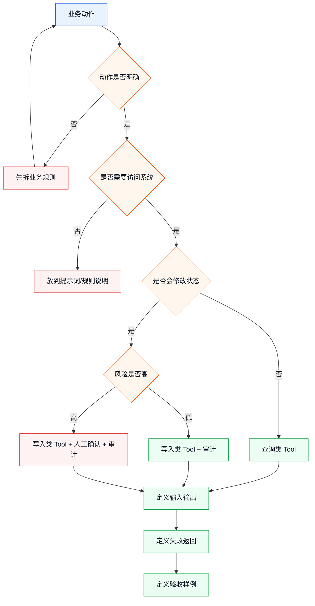
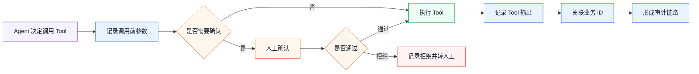

# 业务 Tool 设计指南

> 目标：把业务动作设计成 Agent 可以安全调用、业务人员可以理解、开发人员可以实现、后续可以审计的 Tool。

前面几篇讲的是业务场景、落地模式和试点流程。真正开始做时，最容易卡住的是 Tool：

```text
业务人员说：“让 AI 帮我处理工单”
开发人员要落成：
  query_ticket_rules
  query_customer_profile
  create_ticket_assignment
  write_audit_log
```

这一篇解决：

- 一个业务动作是否适合做 Tool。
- Tool 粒度怎么切。
- 输入输出怎么设计。
- 风险和人工确认怎么标出来。
- 失败时怎么返回。
- 怎么让 Tool 支撑审计和验收。

---

## 1. Tool 是 Agent 的行动边界

可以这样理解：

```text
Agent 负责判断下一步
Tool 负责执行明确动作
```

Agent 不能直接“随便操作业务系统”。它只能调用已经定义好的 Tool。

所以 Tool 的设计，本质上是在给 Agent 划边界：

| 边界 | 要回答的问题 |
|------|--------------|
| 能力边界 | 这个 Tool 到底能做什么 |
| 数据边界 | 它能读取或写入哪些数据 |
| 风险边界 | 它会不会改变业务状态 |
| 权限边界 | 谁、在什么条件下可以调用 |
| 审计边界 | 调用后能不能复盘 |

业务 Agent 能不能落地，很大程度取决于 Tool 边界是否清楚。

---

## 2. 从业务动作到 Tool 的流程

先用这张图理解设计步骤：



这个流程的关键不是“怎么写代码”，而是先判断动作的性质。

---

## 3. 什么动作适合做 Tool

适合做 Tool 的动作通常有 4 个特点：

| 特点 | 说明 | 例子 |
|------|------|------|
| 动作明确 | 输入、输出、结果都比较清楚 | 查询客户、创建工单 |
| 系统相关 | 需要访问文件、数据库、接口或业务系统 | 查 OA、查 CRM、写档案库 |
| 可复用 | 多个场景会用到 | 查询规则、写审计日志 |
| 可审计 | 调用结果能记录和复盘 | 写入业务 ID、返回状态 |

不适合直接做 Tool 的动作：

| 业务说法 | 问题 | 更好的拆法 |
|----------|------|------------|
| “处理这个客户” | 太泛 | 拆成查询客户、判断风险、创建跟进任务 |
| “优化流程” | 没有明确动作 | 先输出建议，不做 Tool |
| “自动搞定报销” | 范围太大 | 拆成查制度、校验票据、生成初审记录 |
| “帮我看一下” | 可能只是模型判断 | 先作为 Agent 推理或提示词 |

简单判断：

```text
能写清楚输入输出 -> 可以考虑 Tool
写不清楚输入输出 -> 先不要做 Tool
```

---

## 4. Tool 粒度怎么切

Tool 粒度太粗，Agent 难以控制；Tool 粒度太细，流程会变复杂。

### 4.1 太粗的 Tool

```text
process_ticket(ticket_text)
```

问题：

- 里面可能查询规则、判断分类、写入分派、发送通知。
- 失败时不知道失败在哪一步。
- 很难插入人工确认。
- 审计不清楚。

### 4.2 太细的 Tool

```text
get_ticket_title
get_ticket_body
get_customer_id
get_customer_level
get_customer_last_order
get_customer_last_complaint
```

问题：

- Agent 需要调用太多次。
- 上下文和错误处理变复杂。
- 性能和稳定性更难控制。

### 4.3 推荐粒度

一个 Tool 最好对应一个业务人员能理解的动作：

| 推荐 Tool | 业务含义 |
|-----------|----------|
| `query_routing_rules` | 查询工单分派规则 |
| `query_customer_profile` | 查询客户画像摘要 |
| `create_ticket_assignment` | 创建分派记录 |
| `write_audit_log` | 写处理日志 |

经验规则：

```text
一个 Tool 做一件完整小事
不要把完整流程塞进一个 Tool
也不要把字段级读取拆成一堆 Tool
```

---

## 5. Tool 命名：让业务和开发都看得懂

Tool 名字建议用“动词 + 业务对象”。

| 类型 | 命名例子 |
|------|----------|
| 查询 | `query_customer_profile`、`search_archive_record` |
| 校验 | `check_invoice_fields`、`validate_archive_metadata` |
| 创建 | `create_ticket_assignment`、`create_archive_record` |
| 更新 | `update_case_status`、`update_customer_tag` |
| 生成 | `generate_review_report`、`generate_archive_number` |
| 审计 | `write_audit_log`、`record_approval_result` |

避免这些名字：

| 不推荐 | 原因 |
|--------|------|
| `handle_task` | 太泛 |
| `do_business` | 看不出动作 |
| `call_api` | 暴露技术细节，不表达业务含义 |
| `process_all` | 可能包含太多动作 |

Tool 名字应该服务于 Agent 理解，也服务于日志复盘。

---

## 6. 输入设计：少而明确

Tool 输入不要直接塞一大段自然语言，也不要让 Agent 猜字段。

### 6.1 推荐输入结构

以创建工单分派为例：

```text
tool: create_ticket_assignment

input:
  ticket_id: T20260816001
  category: refund_complaint
  urgency: high
  target_department: after_sales
  reason: 用户提到退款失败并表达投诉意向
  risk_level: high
  requested_by: agent
```

这些字段有几个好处：

- 业务人员能看懂。
- 写入前可以展示给人确认。
- 日志可以直接记录。
- 后续可以做规则校验。

### 6.2 输入字段设计原则

| 原则 | 说明 |
|------|------|
| 必填字段少 | 第一版只保留动作必须字段 |
| 字段名业务化 | 用 `ticket_id`，不要用 `bizKey1` |
| 枚举要稳定 | `low/medium/high` 比自由文本更好验收 |
| 原因要单独字段 | 不要只记录最终结果 |
| 风险要显式字段 | 方便确认和审计 |

### 6.3 不推荐输入

```text
input:
  text: 帮我把这个工单分给售后，原因你自己看着办
```

问题：

- 字段不明确。
- 写入前不好确认。
- 失败后不好复盘。
- 容易让 Agent 把业务判断和系统动作混在一起。

---

## 7. 输出设计：让 Agent 知道下一步

Tool 输出不只是给用户看，也是给 Agent 判断下一步用的。

### 7.1 推荐输出结构

```text
output:
  success: true
  assignment_id: A20260816001
  status: created
  message: 分派记录已创建
  next_action: write_audit_log
```

如果失败：

```text
output:
  success: false
  error_code: RULE_CONFLICT
  message: 同时命中售后和财务分派规则
  recoverable: true
  suggested_next_action: ask_human_to_choose_department
```

### 7.2 输出字段建议

| 字段 | 作用 |
|------|------|
| `success` | 表示动作是否完成 |
| `status` | 表示业务状态 |
| `business_id` | 返回业务系统中的记录 ID |
| `message` | 给人看的简短说明 |
| `error_code` | 给程序和 Agent 判断 |
| `recoverable` | 是否可恢复 |
| `suggested_next_action` | 建议 Agent 下一步怎么处理 |

好的输出能减少 Agent 的猜测。

---

## 8. 风险分级：决定是否需要确认

业务 Tool 一定要标风险。

| 风险级别 | 说明 | 例子 | 默认策略 |
|----------|------|------|----------|
| L1 | 只读 | 查询规则、查询客户摘要 | 可直接调用 |
| L2 | 生成草稿 | 生成报告、生成拟办意见 | 可直接调用 |
| L3 | 写测试数据 | 写测试库、生成草稿记录 | 记录日志 |
| L4 | 写生产数据 | 创建工单、更新状态 | 人工确认 |
| L5 | 高风险操作 | 删除、退款、外发、权限变更 | 禁止或强审批 |

风险不是固定由工具决定，还和参数有关：

```text
update_customer_tag("待跟进") -> 可能是 L3/L4
update_customer_tag("黑名单") -> 可能是 L5
```

所以写入类 Tool 的输入里建议带上：

```text
risk_level
reason
requires_confirmation
```

---

## 9. 人工确认：确认的不是“要不要继续”，而是“继续做什么”

确认信息必须足够具体。

不推荐：

```text
是否继续？
```

推荐：

```text
是否允许创建工单分派记录？

工单：T20260816001
部门：售后支持部
紧急程度：高
原因：命中退款投诉规则
影响：会在工单系统中创建正式分派记录
```

确认内容要包含：

| 内容 | 说明 |
|------|------|
| 动作 | 即将调用哪个业务动作 |
| 对象 | 影响哪个业务对象 |
| 参数 | 写入哪些关键字段 |
| 原因 | Agent 为什么这么做 |
| 影响 | 对业务系统有什么影响 |
| 替代 | 拒绝后怎么处理 |

这样人工确认才有意义。

---

## 10. 失败设计：不要只返回“失败”

失败返回要帮助 Agent 判断下一步。

### 10.1 失败分类

| 失败类型 | 例子 | 建议处理 |
|----------|------|----------|
| 参数错误 | 缺少 `ticket_id` | 让 Agent 补字段 |
| 规则冲突 | 多个部门都匹配 | 转人工选择 |
| 权限不足 | 当前用户不能写入 | 停止并提示 |
| 系统异常 | 接口超时 | 可重试或转人工 |
| 业务拒绝 | 状态不允许修改 | 停止并记录 |

### 10.2 推荐失败输出

```text
success: false
error_code: PERMISSION_DENIED
message: 当前用户没有权限创建正式分派记录
recoverable: false
suggested_next_action: stop_and_report
```

```text
success: false
error_code: RULE_CONFLICT
message: 同时命中售后支持部和财务部
recoverable: true
suggested_next_action: ask_user_question
```

失败设计越清楚，Agent 越不容易乱猜。

---

## 11. 审计设计：Tool 天然要服务留痕

每次 Tool 调用都应该能进入审计链路。

### 11.1 最小审计字段

| 字段 | 说明 |
|------|------|
| `task_id` | 业务任务 ID |
| `session_id` | Agent 会话 ID |
| `tool_name` | 调用哪个 Tool |
| `tool_input` | 输入摘要 |
| `tool_output` | 输出摘要 |
| `risk_level` | 风险等级 |
| `confirmation_id` | 人工确认记录 |
| `business_id` | 业务系统返回 ID |
| `status` | 成功、失败、跳过、转人工 |

### 11.2 审计链路图



审计不是最后补的功能。Tool 设计时就要想好日志字段。

---

## 12. Tool 设计模板

每个业务 Tool 都建议先填这张卡片。

```text
Tool 名称：

业务动作：

一句话说明：

输入字段：

输出字段：

是否只读：

是否修改业务状态：

风险级别：

是否需要人工确认：

确认时展示哪些字段：

成功后返回什么业务 ID：

失败类型有哪些：

失败后建议 Agent 怎么做：

需要记录哪些审计字段：

测试样例：
```

这个模板可以在需求评审时直接给业务人员看。

---

## 13. 示例：客服工单分派 Tool

### 13.1 查询规则 Tool

```text
Tool 名称：
  query_routing_rules

业务动作：
  查询工单分派规则

输入字段：
  ticket_text
  category_hint

输出字段：
  matched_rules
  candidate_departments
  high_risk_keywords
  confirmation_required

是否只读：
  是

风险级别：
  L1

失败后：
  如果规则系统不可用，转人工分派
```

### 13.2 创建分派 Tool

```text
Tool 名称：
  create_ticket_assignment

业务动作：
  创建工单分派记录

输入字段：
  ticket_id
  category
  urgency
  target_department
  reason
  risk_level

输出字段：
  success
  assignment_id
  status
  message

是否只读：
  否

是否修改业务状态：
  是

风险级别：
  L4

是否需要人工确认：
  是，高紧急或低置信度时必须确认

失败后：
  参数缺失让 Agent 补字段
  规则冲突转人工选择
  权限不足停止并记录
```

---

## 14. 示例：档案归档 Tool

### 14.1 元数据提取 Tool

```text
Tool 名称：
  extract_archive_metadata

业务动作：
  从待归档文件中提取关键元数据

输入字段：
  file_id
  file_text
  file_type

输出字段：
  title
  document_no
  responsible_department
  document_date
  confidence
  missing_fields

是否只读：
  是

风险级别：
  L2

失败后：
  缺少关键字段时转人工补录
```

### 14.2 创建档案记录 Tool

```text
Tool 名称：
  create_archive_record

业务动作：
  创建档案目录记录

输入字段：
  archive_no
  title
  category
  retention_period
  metadata
  review_result

输出字段：
  success
  archive_record_id
  status
  message

是否只读：
  否

风险级别：
  L4

是否需要人工确认：
  是，第一版全部确认

失败后：
  字段校验失败则返回缺失字段
  档号冲突则转人工处理
```

---

## 15. Tool 验收：用样例证明它可用

Tool 不是写完就算完成。每个 Tool 都要有样例验收。

### 15.1 查询类 Tool 验收

| 验收点 | 例子 |
|--------|------|
| 能查到正常数据 | 输入客户 ID，返回客户摘要 |
| 查不到时有明确返回 | 返回 `NOT_FOUND` |
| 不泄露不该看的字段 | 不返回身份证号全文 |
| 输出结构稳定 | 字段名和枚举固定 |

### 15.2 写入类 Tool 验收

| 验收点 | 例子 |
|--------|------|
| 正常写入 | 返回业务 ID |
| 参数缺失 | 返回明确错误 |
| 权限不足 | 不写入并返回原因 |
| 重复提交 | 能识别或避免重复写入 |
| 高风险 | 不绕过人工确认 |

### 15.3 审计类 Tool 验收

| 验收点 | 例子 |
|--------|------|
| 能关联任务 | 有 `task_id` |
| 能关联会话 | 有 `session_id` |
| 能关联业务对象 | 有工单号、档案号 |
| 能复盘输入输出 | 有摘要和状态 |
| 能记录确认结果 | 有确认人和确认时间 |

---

## 16. 常见反模式

| 反模式 | 问题 | 更好的做法 |
|--------|------|------------|
| 一个 Tool 包完整流程 | 无法控制和审计 | 拆成查询、判断、写入、日志 |
| Tool 输入是一大段文本 | 字段不可控 | 使用结构化输入 |
| Tool 输出只有字符串 | Agent 不知道下一步 | 返回 `success/status/error_code` |
| 写入 Tool 没有风险级别 | 无法确认和灰度 | 显式标注 `risk_level` |
| 失败只返回异常 | Agent 容易乱猜 | 返回失败类型和建议动作 |
| 不记录工具入参 | 出事无法复盘 | 从第一版记录摘要 |
| 业务规则藏在 Tool 里 | 业务方难维护 | 规则数据化或配置化 |

---

## 17. 学习建议

学习 dsh 业务落地时，不要先追求“会写很多 Tool”。

更重要的是会设计 Tool：

```text
这个动作是否明确？
输入输出是否结构化？
是否会修改业务状态？
是否需要人工确认？
失败后 Agent 应该怎么做？
日志能不能复盘？
```

这些问题清楚以后，Tool 才能成为 Agent 的安全行动边界，而不是把业务系统暴露给模型随意操作。

