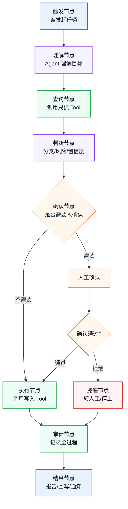
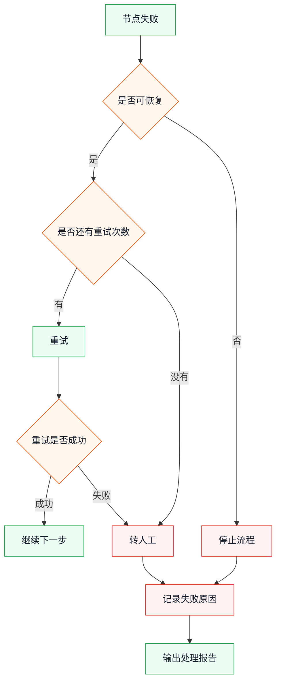
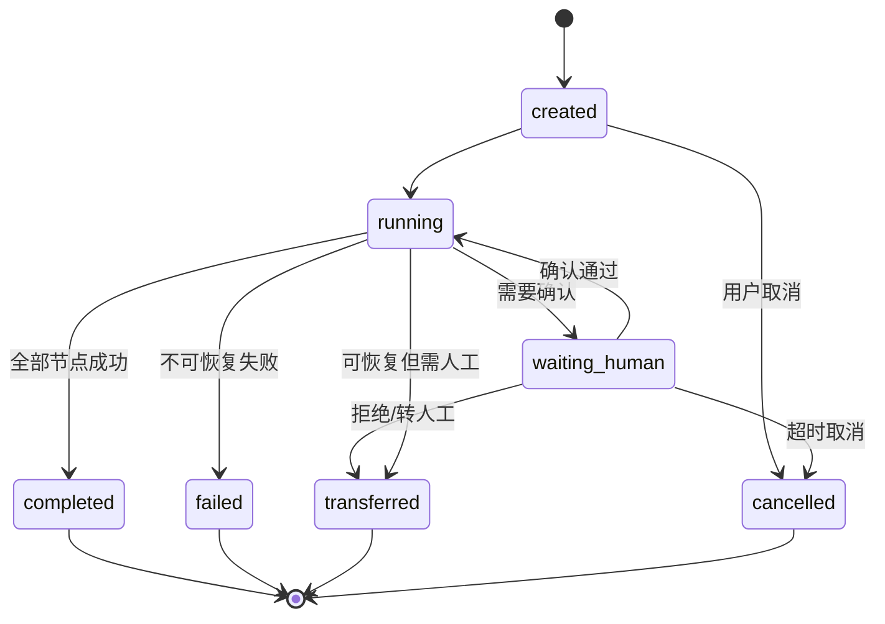
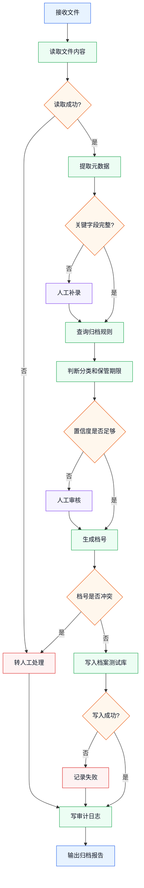

# 业务 Workflow 设计指南

> 目标：把一个多步骤业务场景整理成清楚、可执行、可确认、可审计、可验收的 Agent Workflow。

如果说 Tool 是 Agent 的“动作”，那么 Workflow 就是 Agent 的“办事流程”。

```text
Tool 解决：能做什么动作
Workflow 解决：动作按什么顺序做，遇到分支怎么办，哪里需要人确认，失败后怎么收尾
```

这一篇不追求源码细节，而是讲业务落地时怎么设计流程。

---

## 1. 什么时候需要 Workflow

不是所有 Agent 场景都需要 Workflow。

先用这张表判断：

| 场景特征 | 是否需要 Workflow | 例子 |
|----------|-------------------|------|
| 一次问答 | 不需要 | 问制度、问操作说明 |
| 一次查询 | 不需要 | 查客户、查档案 |
| 一次写入但要确认 | 不一定 | 确认后创建工单 |
| 固定多步骤 | 建议需要 | 接收 -> 校验 -> 写入 |
| 有分支 | 需要 | 高风险转人工，低风险自动处理 |
| 有审批 | 需要 | 低置信度人工审核 |
| 有失败重试 | 需要 | 接口超时后重试或转人工 |
| 要追踪节点状态 | 需要 | 档案归档、OA 流转 |

简单判断：

```text
一步能完成 -> Tool 就够
多步且顺序固定 -> 考虑 Workflow
多步且有分支/确认/失败处理 -> 应该 Workflow 化
```

---

## 2. Workflow 是业务流程，不是代码炫技

Workflow 的价值不是“显得架构复杂”，而是让业务边界固定下来：

- 哪一步先做。
- 哪一步可以跳过。
- 哪一步必须人工确认。
- 哪一步失败后停止。
- 哪一步失败后可重试。
- 哪些数据要进入最终结果。
- 哪些动作必须进入审计日志。

如果没有 Workflow，Agent 可能每次按不同顺序做事；对于高风险业务，这会很难验收和复盘。

---

## 3. Workflow 设计总图

一个业务 Workflow 通常包含 6 类节点：



读这张图时，重点看三条线：

1. 主流程怎么走。
2. 风险流程怎么停。
3. 失败或拒绝后怎么收尾。

---

## 4. 先画主流程，再补分支

设计 Workflow 时，不要一开始就画所有异常情况。

推荐顺序：

```text
1. 先画正常主流程
2. 再标出人工确认点
3. 再补失败分支
4. 再补审计点
5. 最后补验收样例
```

### 4.1 主流程示例：客服工单分派

```text
输入工单
  -> 查询分派规则
  -> 查询客户信息
  -> 判断类型和部门
  -> 创建分派记录
  -> 写审计日志
  -> 输出处理报告
```

这只是“理想路径”，不代表可以直接上线。

### 4.2 补确认点

```text
输入工单
  -> 查询分派规则
  -> 查询客户信息
  -> 判断类型和部门
  -> 如果高风险或低置信度，人工确认
  -> 创建分派记录
  -> 写审计日志
  -> 输出处理报告
```

### 4.3 补失败分支

```text
规则查询失败 -> 转人工
客户信息缺失 -> 降级处理或转人工
部门判断冲突 -> 人工选择部门
创建分派失败 -> 记录失败并停止
```

这样流程才接近真实业务。

---

## 5. Workflow 节点怎么设计

每个节点都要能回答 5 个问题：

| 问题 | 说明 |
|------|------|
| 输入是什么 | 来自用户、上一步节点还是业务系统 |
| 做什么动作 | Agent 判断、Tool 调用、人工确认还是记录日志 |
| 输出是什么 | 给下一步用的数据 |
| 失败怎么办 | 重试、跳过、转人工还是停止 |
| 是否审计 | 是否需要记录输入、输出和原因 |

### 5.1 节点模板

```text
节点名称：

节点类型：
  Agent 判断 / Tool 调用 / 人工确认 / 审计 / 结果输出

输入：

动作：

输出：

成功后下一步：

失败后下一步：

是否需要人工确认：

是否写审计：
```

这个模板可以让业务人员和开发人员一起评审流程。

---

## 6. 节点类型

### 6.1 触发节点

触发节点回答：

```text
任务从哪里来？
```

常见入口：

| 入口 | 适合场景 |
|------|----------|
| Web 手动触发 | 人工值守、需要确认 |
| headless 任务 | 定时批处理、一次性后台任务 |
| SDK / API | 被 OA、CRM、ERP 调用 |
| 文件输入 | 批量处理、档案整理 |

### 6.2 查询节点

查询节点通常调用只读 Tool：

- 查规则。
- 查客户。
- 查档案。
- 查订单。
- 查审批状态。

查询节点一般风险低，但仍要注意权限和数据脱敏。

### 6.3 判断节点

判断节点由 Agent 根据上下文做判断：

- 分类。
- 风险等级。
- 置信度。
- 下一步动作。
- 是否转人工。

判断节点最好输出结构化结果：

```text
category: refund_complaint
urgency: high
target_department: after_sales
confidence: 0.72
risk_level: high
reason: 命中退款和投诉规则
```

不要只输出一段散文，否则后续节点不好判断。

### 6.4 人工确认节点

人工确认节点不是“问一句是否继续”，而是展示即将执行的业务动作：

```text
动作：创建工单分派记录
对象：T20260816001
部门：售后支持部
原因：命中退款投诉规则
影响：会写入工单系统
```

确认结果至少有三种：

| 结果 | 下一步 |
|------|--------|
| 通过 | 继续执行 |
| 拒绝 | 停止或转人工 |
| 修改后通过 | 使用人工修改后的参数继续 |

### 6.5 执行节点

执行节点通常调用写入类 Tool：

- 创建记录。
- 更新状态。
- 提交审批。
- 写入档案库。
- 生成报告。

写入类节点要绑定：

- 风险等级。
- 确认记录。
- 审计日志。
- 回退方式。

### 6.6 审计节点

审计节点负责记录：

- 输入。
- Agent 判断。
- Tool 调用。
- 人工确认。
- 写入结果。
- 失败原因。

实际落地时，审计不一定是单独一步，也可以嵌入每个节点。但在流程设计图里，建议把审计显式画出来，避免遗漏。

---

## 7. 分支设计：不要只画成功路径

业务流程最容易出问题的地方，是只画成功路径。

至少要画 4 类分支：

| 分支 | 例子 | 处理方式 |
|------|------|----------|
| 低置信度 | Agent 不确定分类 | 人工确认 |
| 高风险 | 退款、删除、涉密、外发 | 强确认或禁止 |
| 数据缺失 | 缺客户 ID、缺档号 | 补充信息或转人工 |
| 工具失败 | 接口超时、权限不足 | 重试、停止或转人工 |

### 7.1 分支条件要明确

不推荐：

```text
如果感觉不确定，就问人
```

推荐：

```text
如果 confidence < 0.8，进入人工确认
如果 risk_level in [high, critical]，进入人工确认
如果 required_fields 缺失，进入补充信息节点
如果 tool_error.recoverable = false，停止并转人工
```

业务流程越高风险，分支条件越要结构化。

---

## 8. 失败处理：可恢复和不可恢复

失败不是一种情况。

### 8.1 可恢复失败

可恢复失败是指：补充信息、重试、人工选择后还能继续。

| 失败 | 处理 |
|------|------|
| 缺少字段 | 让用户补充 |
| 分类冲突 | 人工选择 |
| 临时超时 | 限制次数重试 |
| 低置信度 | 人工确认 |

### 8.2 不可恢复失败

不可恢复失败是指：继续执行可能扩大风险，应该停止。

| 失败 | 处理 |
|------|------|
| 权限不足 | 停止并记录 |
| 业务状态不允许 | 停止并说明 |
| 高风险动作未确认 | 停止 |
| 写入结果不一致 | 停止并转人工 |

### 8.3 失败处理图



---

## 9. Workflow 状态怎么定义

Workflow 需要状态，否则很难复盘。

建议从这些状态开始：

| 状态 | 说明 |
|------|------|
| `created` | 任务已创建 |
| `running` | 正在执行 |
| `waiting_human` | 等待人工确认 |
| `completed` | 已完成 |
| `failed` | 执行失败 |
| `transferred` | 已转人工 |
| `cancelled` | 已取消 |

状态转换示例：



学习时不需要背状态名，只要理解：

```text
流程不是只有成功和失败
等待人工、转人工、取消也都是正常状态
```

---

## 10. 从 Workflow 到 Tool 调用

Workflow 不直接替代 Tool。Workflow 负责安排 Tool 的调用顺序。

例子：客服工单分派 Workflow。

| 节点 | 调用 Tool | 输出 |
|------|-----------|------|
| 查询规则 | `query_routing_rules` | 规则、候选部门 |
| 查询客户 | `query_customer_profile` | 客户等级、历史投诉 |
| 判断分派 | Agent 判断 | 分类、部门、风险 |
| 人工确认 | `ask_user_question` / Web UI | 确认结果 |
| 创建分派 | `create_ticket_assignment` | 分派 ID |
| 写审计 | `write_audit_log` | 审计 ID |

如果一个节点内部做了太多事情，通常说明 Tool 粒度或 Workflow 节点粒度需要重新切。

---

## 11. 示例：档案归档 Workflow

### 11.1 主流程

```text
接收文件
  -> 读取文件内容
  -> 提取元数据
  -> 查询归档规则
  -> 判断分类和保管期限
  -> 人工审核
  -> 生成档号
  -> 写入档案测试库
  -> 写审计日志
  -> 输出归档报告
```

### 11.2 分支

| 分支条件 | 处理 |
|----------|------|
| 文件无法读取 | 停止并转人工 |
| 元数据缺失 | 人工补录 |
| 分类置信度低 | 人工审核 |
| 档号冲突 | 停止并转人工 |
| 写库失败 | 记录失败，不继续回写 |

### 11.3 流程图



---

## 12. 示例：报销初审 Workflow

### 12.1 主流程

```text
接收报销单
  -> 查询报销制度
  -> 校验发票字段
  -> 查询预算状态
  -> 判断异常和风险
  -> 生成人工初审建议
  -> 财务确认
  -> 创建初审记录
  -> 写审计日志
```

### 12.2 风险点

| 风险点 | 处理 |
|--------|------|
| 金额超过阈值 | 强制人工确认 |
| 发票字段冲突 | 转人工 |
| 缺少附件 | 返回补充材料 |
| 预算不足 | 标记异常 |
| 特殊报销类型 | 转人工 |

这个场景不建议第一版自动通过或自动驳回。更适合让 Agent 生成初审建议，由财务确认。

---

## 13. Workflow 验收

Workflow 验收不能只看最终结果，还要看每个关键节点。

### 13.1 样例集

| 样例类型 | 数量建议 | 目的 |
|----------|----------|------|
| 正常样例 | 10 条 | 验证主流程 |
| 低置信度样例 | 5 条 | 验证人工确认 |
| 高风险样例 | 5 条 | 验证强确认 |
| 数据缺失样例 | 5 条 | 验证补充信息或转人工 |
| 工具失败样例 | 5 条 | 验证失败处理 |

### 13.2 验收表

| 验收点 | 通过标准 |
|--------|----------|
| 主流程 | 正常样例能走到完成 |
| 人工确认 | 高风险样例不会绕过确认 |
| 转人工 | 不确定场景能带上下文转人工 |
| 失败处理 | 工具失败不会继续扩大影响 |
| 审计 | 每个关键节点都有记录 |
| 报告 | 最终输出能解释做了什么 |

---

## 14. 常见反模式

| 反模式 | 问题 | 更好的做法 |
|--------|------|------------|
| 只画成功路径 | 真实业务一异常就卡住 | 至少补低置信度、高风险、数据缺失、工具失败 |
| 把流程都交给 Agent 自由发挥 | 每次执行顺序可能不同 | 固定关键节点和分支条件 |
| 没有状态 | 无法知道卡在哪一步 | 定义 running、waiting_human、failed 等状态 |
| 人工确认太晚 | 可能已经执行高风险动作 | 写入前确认 |
| 失败后继续执行 | 容易扩大影响 | 不可恢复失败立即停止 |
| 审计只记最终结果 | 无法复盘过程 | 节点级记录输入、输出、原因 |
| 第一版流程太长 | 交付周期失控 | 先做主流程 + 一个确认点 |

---

## 15. Workflow 设计模板

可以直接复制这份模板做业务评审：

```text
Workflow 名称：

业务目标：

触发入口：

主流程步骤：
1.
2.
3.

需要调用的 Tool：

人工确认点：

分支条件：

失败处理：

状态列表：

审计字段：

最终输出：

MVP 只覆盖：

MVP 不覆盖：

验收样例：

通过标准：
```

---

## 16. 学习建议

学习 Workflow 时，不要先记实现 API。

先练习画三张图：

```text
1. 主流程图
2. 风险分支图
3. 状态转换图
```

能画清楚这三张图，再去看 dsh 的插件、工具和运行机制，会容易很多。

业务落地时，Workflow 的核心不是“自动化更多步骤”，而是让 Agent 的行动变得：

- 顺序明确。
- 风险可控。
- 失败有去处。
- 状态可追踪。
- 结果可验收。

