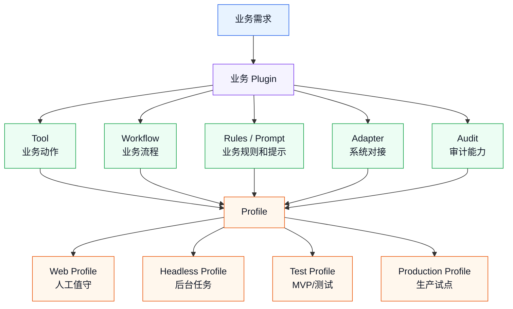
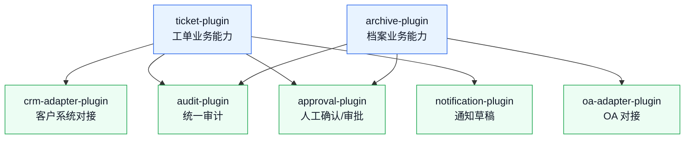

# 业务 Plugin / Profile 设计指南

> 目标：理解业务能力怎么在 dsh 里打包、装配和启动。重点不是深入 Cordis API，而是知道业务 Tool、Workflow、规则、系统对接应该怎么组织。

前面两篇讲了：

- Tool：Agent 可以调用的业务动作。
- Workflow：多个动作如何形成业务流程。

这一篇继续往上走：

```text
Tool / Workflow / 规则 / 系统对接
  -> 怎么打包成业务 Plugin
  -> 怎么组合成不同 Profile
  -> 怎么支持 MVP、试点、生产不同阶段
```

---

## 1. 一句话理解 Plugin 和 Profile

可以先用业务类比理解：

```text
Plugin = 一个能力包
Profile = 一套启动方案
```

更具体一点：

| 概念 | 类比 | 解决的问题 |
|------|------|------------|
| Tool | 一个具体动作 | Agent 能做什么 |
| Workflow | 一套办事流程 | 多个动作按什么顺序做 |
| Plugin | 一个能力包 | 把工具、规则、服务、流程装起来 |
| Profile | 一套启动配置 | 本次启动加载哪些能力 |

例子：

```text
dsh-archive-tools
  提供档案读取、元数据提取、分类、写库等工具

dsh-archive-workflow
  提供档案接收、审核、入库流程

archive-web-profile
  启动 Web 形态，给档案人员人工值守使用

archive-headless-profile
  启动后台批处理形态，用于夜间处理待归档文件
```

---

## 2. 为什么不要把所有能力写在一起

业务 Agent 项目里，最容易出现一个“大杂烩插件”：

```text
dsh-business-agent
  里面有客服、档案、OA、报销、审计、权限、工作流、所有工具
```

短期看省事，长期会有问题：

| 问题 | 后果 |
|------|------|
| 能力边界不清楚 | 不知道哪个功能属于哪个业务 |
| 权限不好控制 | 某个场景可能加载了不该加载的工具 |
| 测试困难 | 改一个工具影响一堆流程 |
| 复用困难 | 别的场景想复用单个工具很麻烦 |
| 上线风险大 | 小改动也要带着整个能力包发布 |

更推荐按业务边界和能力边界拆。

---

## 3. Plugin / Profile 总图



读这张图时，只记住：

```text
Plugin 负责提供能力
Profile 负责选择能力
```

---

## 4. 什么能力适合放进 Plugin

Plugin 不是只能放 Tool。业务 Plugin 可以包含多种东西。

| 能力 | 是否适合 Plugin | 例子 |
|------|-----------------|------|
| 业务 Tool | 适合 | `query_customer_profile`、`create_archive_record` |
| 系统对接 | 适合 | OA Adapter、CRM Adapter、档案库 Adapter |
| 业务规则 | 适合 | 分派规则、分类规则、报销规则 |
| Prompt / Skill | 适合 | 客服话术、档案分类说明 |
| Workflow | 适合 | 工单分派流程、档案归档流程 |
| 审计能力 | 适合 | `write_audit_log`、日志格式 |
| 一次性实验脚本 | 不一定 | 可以先放测试目录 |
| 临时 Demo 代码 | 不一定 | MVP 早期可以先简化 |

简单判断：

```text
如果一个能力会被复用、配置、测试、发布，就应该考虑放进 Plugin。
```

---

## 5. Plugin 拆分方式

### 5.1 按业务域拆

适合业务边界清楚的项目。

```text
dsh-ticket-plugin
dsh-archive-plugin
dsh-expense-plugin
dsh-oa-plugin
```

优点：

- 业务人员容易理解。
- 权限边界清楚。
- 每个业务域独立演进。

缺点：

- 跨业务复用能力时，可能需要抽公共插件。

### 5.2 按能力类型拆

适合平台能力较强的项目。

```text
dsh-business-tools
dsh-business-workflows
dsh-business-audit
dsh-business-adapters
```

优点：

- 技术复用明显。
- 公共能力集中。

缺点：

- 业务边界不如按业务域直观。
- 早期容易过度设计。

### 5.3 推荐：MVP 先按业务域，稳定后抽公共能力

第一版建议：

```text
dsh-ticket-plugin
  工单相关工具、规则、流程先放一起
```

稳定后再抽：

```text
dsh-audit-plugin
dsh-approval-plugin
dsh-crm-adapter-plugin
```

这样更符合 MVP 节奏：先跑通业务，再沉淀平台能力。

---

## 6. Profile 解决什么问题

Profile 决定本次启动加载哪组能力。

同一套业务 Plugin，在不同场景下可能有不同启动方式。

| 场景 | 推荐 Profile | 特点 |
|------|--------------|------|
| 人工试用 | Web Profile | 有界面、有确认、有人工反馈 |
| 夜间批处理 | Headless Profile | 无人值守、执行完退出 |
| MVP 测试 | Test Profile | 模拟数据、测试系统、低权限 |
| 生产试点 | Production Profile | 真实系统、审计、权限、确认 |
| 开发调试 | Dev Profile | 日志更详细、接口可替换 |

可以这样理解：

```text
Plugin 是积木
Profile 是这次要搭哪一套积木
```

---

## 7. Profile 分层：同一业务，不同风险

以客服工单为例，可以有 4 套 Profile。

| Profile | 数据 | 写入 | 确认 | 用途 |
|---------|------|------|------|------|
| `ticket-dev` | 模拟数据 | 本地文件 | 可选 | 开发调试 |
| `ticket-mvp` | 脱敏样例 | 测试库 | 全部确认 | MVP 验证 |
| `ticket-shadow` | 真实数据 | 不写入 | 不需要 | 影子运行 |
| `ticket-pilot` | 真实数据 | 生产小范围 | 高风险确认 | 生产试点 |

这比只写一个 profile 更安全：

```text
同样的 Agent 能力
在不同 Profile 下权限不同、数据源不同、确认策略不同
```

---

## 8. 推荐目录思路

下面不是 dsh 强制目录，只是业务项目可以参考的组织方式。

```text
business-agent/
├── plugins/
│   ├── ticket/
│   │   ├── tools/
│   │   ├── workflows/
│   │   ├── rules/
│   │   ├── adapters/
│   │   └── prompts/
│   ├── archive/
│   │   ├── tools/
│   │   ├── workflows/
│   │   ├── rules/
│   │   ├── adapters/
│   │   └── prompts/
│   └── common/
│       ├── audit/
│       ├── approval/
│       └── errors/
├── profiles/
│   ├── ticket-dev.yml
│   ├── ticket-mvp.yml
│   ├── ticket-shadow.yml
│   └── ticket-pilot.yml
└── samples/
    ├── ticket/
    └── archive/
```

学习时不用纠结具体目录名。关键是边界：

```text
业务能力放 plugins
启动组合放 profiles
验收样例放 samples
```

---

## 9. Plugin 内部应该有什么

一个业务 Plugin 可以先按这 6 类组织。

| 模块 | 内容 |
|------|------|
| `tools` | Agent 可调用的业务动作 |
| `workflows` | 多步骤业务流程 |
| `rules` | 可维护的业务规则 |
| `adapters` | 对接 OA、CRM、数据库等系统 |
| `prompts` | 行业说明、术语、工作准则 |
| `tests/samples` | 样例输入和验收数据 |

### 9.1 工单 Plugin 示例

```text
ticket-plugin/
├── tools/
│   ├── query-routing-rules
│   ├── query-customer-profile
│   ├── create-ticket-assignment
│   └── write-ticket-audit-log
├── workflows/
│   └── ticket-routing
├── rules/
│   ├── department-routing-rules
│   └── high-risk-keywords
├── adapters/
│   ├── ticket-system-adapter
│   └── crm-adapter
└── prompts/
    └── ticket-agent-guidelines
```

---

## 10. Plugin 之间怎么依赖

真实项目里，不同 Plugin 之间会有依赖。

例如：

```text
ticket-plugin
  依赖 crm-adapter-plugin
  依赖 audit-plugin
  依赖 approval-plugin
```

关系图：



拆依赖时有个原则：

```text
业务 Plugin 可以依赖公共 Plugin
公共 Plugin 不要反向依赖具体业务 Plugin
```

这样公共能力才能复用。

---

## 11. Adapter：不要让 Agent 直接理解业务系统细节

Adapter 的作用是把复杂系统接口包装成稳定业务动作。

不推荐：

```text
Agent 直接知道 CRM 的 URL、字段名、鉴权方式、分页规则
```

推荐：

```text
Agent 调用 query_customer_profile
Adapter 内部处理 CRM 接口、鉴权、字段映射、错误转换
```

### 11.1 Adapter 输出要稳定

即使后端系统字段变了，给 Agent 的输出也尽量稳定：

```text
customer_id
customer_level
recent_orders
recent_complaints
risk_flags
```

这样系统变化不会直接影响 Agent 的思考方式。

---

## 12. 配置：不同环境不要混在一起

业务落地会有不同环境：

- 本地开发。
- MVP 测试。
- 影子运行。
- 生产试点。

它们的数据源、权限、确认策略通常不同。

| 配置项 | Dev | MVP | Shadow | Pilot |
|--------|-----|-----|--------|-------|
| 数据源 | 本地模拟 | 脱敏样例 | 真实只读 | 真实 |
| 写入目标 | 本地文件 | 测试库 | 禁止写入 | 生产小范围 |
| 确认策略 | 可选 | 全部确认 | 不写入 | 高风险确认 |
| 日志 | 详细 | 详细 | 详细 | 审计级 |
| 最大处理量 | 很小 | 10-30 条 | 30-100 条 | 受控放开 |

Profile 的价值就在这里：

```text
同一套业务能力，通过不同 Profile 控制不同环境的边界。
```

---

## 13. 从 MVP 到生产的 Plugin 演进

不要第一版就设计成完整平台。

推荐演进路径：


### 13.1 阶段 1：一个业务 Plugin

```text
ticket-plugin
  工具、流程、规则、模拟系统对接都放一起
```

目标：跑通业务闭环。

### 13.2 阶段 2：拆出 Adapter

```text
ticket-plugin
crm-adapter-plugin
ticket-system-adapter-plugin
```

目标：让业务逻辑和系统接口解耦。

### 13.3 阶段 3：拆出公共能力

```text
audit-plugin
approval-plugin
notification-plugin
```

目标：多个业务复用审计、确认、通知能力。

### 13.4 阶段 4：多业务复用

```text
ticket-plugin
archive-plugin
expense-plugin
oa-plugin
common-audit-plugin
common-approval-plugin
```

目标：形成可持续扩展的业务 Agent 能力体系。

---

## 14. 如何避免过度设计

Plugin / Profile 很容易被设计得太复杂。

### 14.1 第一版不建议做

- 通用插件市场。
- 完整权限平台。
- 所有业务域统一抽象。
- 复杂多租户配置。
- 所有系统一次性适配。

### 14.2 第一版应该做

- 一个业务 Plugin。
- 2-3 个核心 Tool。
- 一个主 Workflow。
- 一个 MVP Profile。
- 一个测试数据源。
- 一个审计日志格式。

第一版的目标不是“架构完美”，而是：

```text
业务能力可以被加载
工具边界可以被控制
流程可以跑通
日志可以复盘
后续能拆，不是现在就全拆
```

---

## 15. 评审清单

设计业务 Plugin / Profile 时，可以用这张表检查。

```text
Plugin 名称：

负责哪个业务域：

包含哪些 Tool：

包含哪些 Workflow：

包含哪些业务规则：

需要对接哪些系统：

哪些能力是公共能力：

哪些能力暂时不抽公共：

有哪些 Profile：

每个 Profile 的数据源：

每个 Profile 的写入权限：

每个 Profile 的人工确认策略：

每个 Profile 的日志要求：

MVP 只加载哪些能力：

生产试点才加载哪些能力：
```

---

## 16. 示例：档案馆业务 Plugin / Profile

### 16.1 Plugin 拆分

第一版可以这样：

```text
archive-plugin
  tools:
    read_archive_file
    extract_archive_metadata
    query_archive_rules
    create_archive_record
    write_audit_log

  workflows:
    archive_receive_workflow

  rules:
    archive_category_rules
    retention_period_rules

  adapters:
    archive_db_adapter
    oa_adapter
```

如果后续多个业务都要用审计和 OA 对接，再拆：

```text
archive-plugin
common-audit-plugin
oa-adapter-plugin
```

### 16.2 Profile 设计

| Profile | 用途 | 写入策略 |
|---------|------|----------|
| `archive-dev` | 本地开发 | 写本地模拟文件 |
| `archive-mvp` | MVP 验证 | 写测试库，全部确认 |
| `archive-shadow` | 影子运行 | 只读真实数据，不写库 |
| `archive-pilot` | 生产试点 | 低风险写入，高风险确认 |
| `archive-headless` | 夜间批处理 | 只处理待确认清单或测试批次 |

### 16.3 学习重点

看这个例子时，不要纠结名字。

重点是：

```text
业务能力先聚合
公共能力后抽取
不同启动方式用 Profile 控制边界
```

---

## 17. 常见反模式

| 反模式 | 问题 | 更好的做法 |
|--------|------|------------|
| 一个大插件装所有业务 | 权限、测试、发布都难控 | 按业务域先拆 |
| 第一版抽太多公共插件 | MVP 推进慢 | 先跑通，再抽公共能力 |
| Profile 不区分环境 | 测试能力可能误接生产 | dev/mvp/shadow/pilot 分开 |
| Agent 直接接业务系统接口 | 字段和鉴权暴露给 Agent | 用 Adapter 包装 |
| 业务规则写死在代码里 | 业务方难维护 | 规则配置化或数据化 |
| 不区分只读和写入能力 | 权限风险大 | Profile 控制加载和确认策略 |
| 公共插件依赖业务插件 | 复用困难 | 业务依赖公共，公共不依赖业务 |

---

## 18. 学习建议

学习 Plugin / Profile 时，先不要陷入插件生命周期和底层 API。

先理解三个问题：

```text
这个业务能力应该放在哪个 Plugin？
这个场景启动时应该加载哪些 Plugin？
这个 Profile 下允许读什么、写什么、是否需要确认？
```

这三个问题想清楚以后，再去读 [plugin-system.md](plugin-system.md)，会更容易理解为什么 dsh 要用插件、服务和配置来组织能力。

