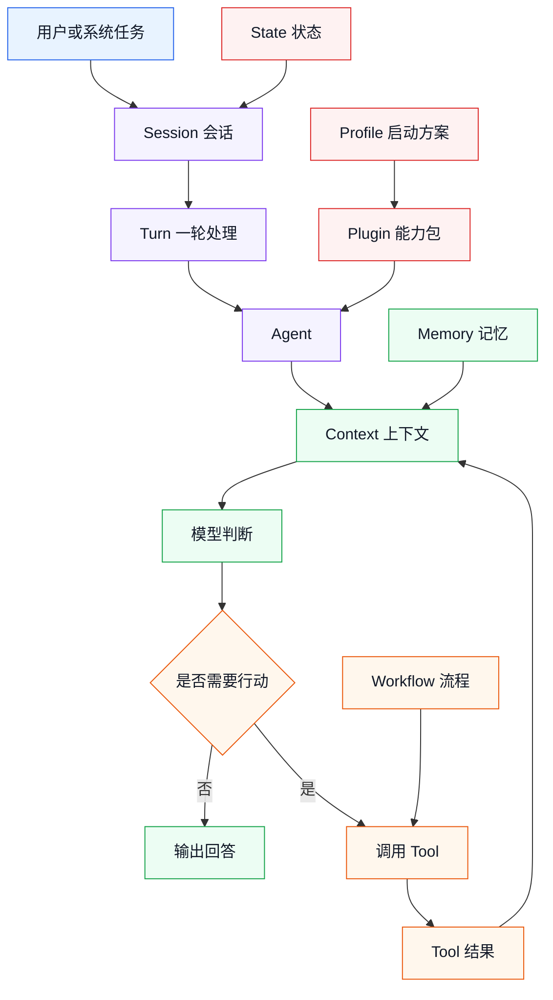
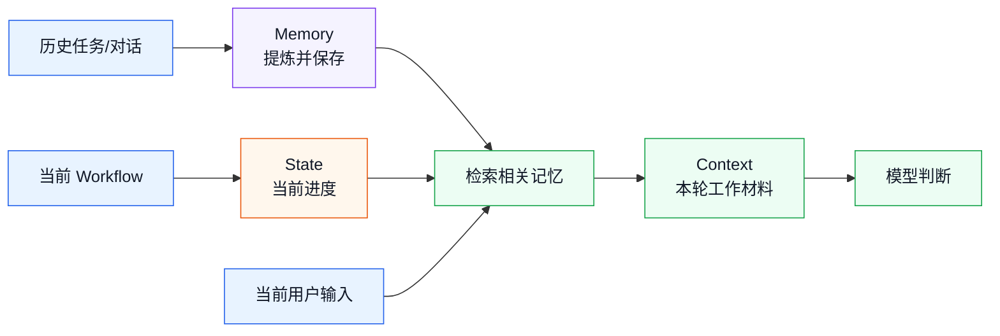
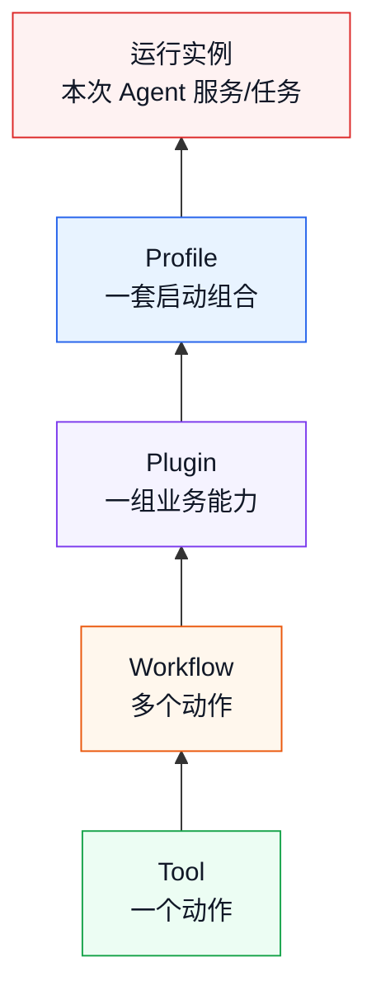

# DeepSeek Harness 概念速查与术语辨析

> 目标：把学习 dsh 时最容易混淆的概念放在一起解释，先建立正确的心智模型，再阅读架构、插件和源码。

这篇不是 API 手册，而是一张“概念地图”。

如果阅读过程中遇到这些词，可以回到这里：

```text
Agent
Tool
Workflow
Plugin
Profile
Session
Turn
Context
Memory
State
```

---

## 1. 先看整体关系

先用一张图建立整体印象：



读图时先记住：

```text
Session 是一次会话
Turn 是会话中的一轮处理
Context 是这一轮交给模型的信息
Memory 是可以跨任务保留的信息
State 是流程当前进行到哪里
Tool 是 Agent 可以执行的动作
Workflow 是多个动作组成的流程
Plugin 是能力包
Profile 是启动时选择能力包的方案
```

---

## 2. Agent 是什么

Agent 可以理解成“正在处理任务的 AI 工作单元”。

它通常会：

1. 接收任务。
2. 读取上下文。
3. 让模型判断下一步。
4. 必要时调用 Tool。
5. 读取 Tool 结果。
6. 继续判断或输出结果。

业务类比：

```text
客服 Agent = AI 客服助理
档案 Agent = AI 档案员
运维 Agent = AI 巡检员
```

Agent 不是单独的模型，也不是单独的 Tool。

```text
模型负责生成判断
Agent 负责组织任务和行动
Tool 负责执行具体动作
```

---

## 3. Tool 是什么

Tool 是 Agent 可以调用的具体动作。

例如：

| Tool | 业务动作 |
|------|----------|
| `query_customer_profile` | 查询客户信息 |
| `query_routing_rules` | 查询分派规则 |
| `create_ticket_assignment` | 创建工单分派记录 |
| `write_audit_log` | 写入审计日志 |

Tool 的关键是边界清楚：

```text
输入是什么？
输出是什么？
是否修改系统？
风险是什么？
是否需要确认？
失败后怎么办？
```

Tool 不等于 Workflow：

```text
Tool：创建一条工单记录
Workflow：查询规则 -> 判断部门 -> 人工确认 -> 创建记录 -> 写日志
```

---

## 4. Workflow 是什么

Workflow 是多个动作组成的业务流程。

它负责规定：

- 顺序。
- 分支。
- 人工确认。
- 重试。
- 失败处理。
- 状态变化。
- 最终输出。

业务例子：

```text
档案归档 Workflow：
接收文件
  -> 提取元数据
  -> 查询归档规则
  -> 判断分类
  -> 人工审核
  -> 生成档号
  -> 写入档案库
  -> 记录审计
```

Agent 可以参与 Workflow 中的判断，但不应该让所有流程边界都变成自由发挥。

```text
固定业务步骤由 Workflow 约束
不确定的业务判断交给 Agent
具体系统动作交给 Tool
```

---

## 5. Plugin 是什么

Plugin 是一组可以被 dsh 加载的能力。

一个业务 Plugin 可能包含：

- Tool。
- Workflow。
- 业务规则。
- Prompt 或 Skill。
- 系统 Adapter。
- 审计能力。
- 配置。

例如：

```text
archive-plugin
  提供：
    read_archive_file
    extract_archive_metadata
    query_archive_rules
    create_archive_record
    archive_receive_workflow
```

Plugin 的价值：

```text
dsh 核心保持通用
业务能力通过 Plugin 扩展
```

Plugin 不等于业务项目本身。

```text
Plugin 是能力的封装方式
业务项目是这些能力组合后的应用
```

---

## 6. Profile 是什么

Profile 是一套启动方案，用来决定：

- 加载哪些 Plugin。
- 使用什么数据源。
- 使用哪些配置。
- 允许哪些 Tool。
- 是否提供 Web 界面。
- 是否以 headless 方式执行。

例如：

| Profile | 作用 |
|---------|------|
| `ticket-dev` | 本地开发调试 |
| `ticket-mvp` | 测试数据验证 |
| `ticket-shadow` | 读取真实数据但不写入 |
| `ticket-pilot` | 生产小范围试点 |
| `ticket-headless` | 后台批处理 |

Plugin 和 Profile 的区别：

```text
Plugin：我有什么能力
Profile：这次启动启用哪些能力
```

同一个 Plugin 可以被多个 Profile 使用，但权限、数据源和确认策略可以不同。

---

## 7. Session 是什么

Session 可以理解成“一次持续的 Agent 会话”。

它通常包含：

- 用户和 Agent 的多轮交互。
- 本次任务的上下文。
- Tool 调用记录。
- 中间结果。
- 最终结果。
- 会话级日志。

业务类比：

```text
客服人员打开一个工单处理窗口
直到这个工单处理结束
这一段过程可以看成一个 Session
```

Session 关注的是：

```text
这一段连续的交互和任务过程
```

Session 不一定等于一个业务流程：

- 一个 Session 可能处理一个 Workflow。
- 一个 Session 也可能包含多个小问题。
- 一个 Workflow 也可能被后台任务执行，不一定有人工 Session。

---

## 8. Turn 是什么

Turn 可以理解成“会话中的一轮处理”。

一轮处理可能包括：

```text
用户输入
  -> Agent 判断
  -> 调用 Tool
  -> 读取 Tool 结果
  -> 再判断
  -> 输出本轮结果
```

所以 Turn 不是框架，也不是独立产品。

```text
Turn 是一次循环处理单元
Session 是多个 Turn 组成的会话
```

一个简单例子：

| Turn | 内容 |
|------|------|
| Turn 1 | 用户提交工单 |
| Turn 2 | Agent 查询客户信息 |
| Turn 3 | Agent 请求人工确认 |
| Turn 4 | 用户确认，Agent 创建分派记录 |
| Turn 5 | Agent 输出处理结果 |

在不同实现里，是否把每次 Tool 调用算成独立 Turn，可能有所不同。学习时先抓住“Turn 是一轮处理”即可。

---

## 9. Context 是什么

Context 是“当前这一轮交给模型参考的信息”。

它可能包含：

- 当前用户输入。
- 历史对话。
- 当前任务状态。
- 已调用 Tool 的结果。
- 系统规则。
- 相关文档。
- 需要遵守的限制。
- 必要的记忆内容。

可以这样理解：

```text
Context 是模型这一次能看到的工作材料
```

Context 通常是动态的：

```text
新消息来了 -> Context 变化
Tool 返回结果 -> Context 变化
进入新流程节点 -> Context 变化
上下文压缩 -> Context 变化
```

---

## 10. Memory 是什么

Memory 是“被提炼并保留，以便未来使用的信息”。

例如：

- 用户长期偏好。
- 已确认的业务规则。
- 项目的稳定约束。
- 历史反馈。
- 过去任务的摘要。

Memory 和 Context 的关系：

```text
Memory 是可保存的信息
Context 是当前实际提供给模型的信息
```

不是所有 Memory 都会被放进当前 Context。

```text
长期记忆库
  -> 根据当前任务检索相关内容
  -> 选择后放入 Context
  -> 模型使用
```

Memory 和聊天历史也不同：

| 概念 | 主要用途 |
|------|----------|
| 聊天历史 | 保留发生过的对话 |
| Memory | 从历史中提炼值得长期保留的信息 |
| Context | 当前这一轮实际提供给模型的信息 |

例子：

```text
聊天历史：
  用户三次提到不喜欢自动发送邮件

Memory：
  用户偏好：外部邮件发送前必须人工确认

Context：
  当前任务涉及发送邮件，因此加载这条偏好
```

---

## 11. State 是什么

State 是“当前任务或流程进行到什么状态”。

例如：

```text
created
running
waiting_human
completed
failed
transferred
cancelled
```

State 关注的是：

```text
现在处于哪一步？
下一步允许做什么？
哪些动作已经做过？
```

State 和 Memory 的区别：

| 概念 | 说明 |
|------|------|
| State | 当前任务进行到哪里 |
| Memory | 未来任务可能复用的信息 |

例子：

```text
State：
  当前档案任务正在等待人工审核

Memory：
  用户通常要求涉密档案必须人工确认
```

State 通常随着任务变化，Memory 更强调跨任务保留。

---

## 12. Context、Memory、State 的关系

这三个概念经常被混在一起。



一句话：

```text
Memory 负责“以后还能不能想起来”
State 负责“现在进行到哪里”
Context 负责“这一轮模型能看到什么”
```

---

## 13. Context 和短期记忆的关系

短期记忆通常指当前任务期间保留的信息。

它和 Context 关系很近，但不是完全相同：

```text
短期记忆 = 当前任务中可以持续复用的信息
Context = 某一轮实际送给模型的信息
```

例子：

```text
用户告诉 Agent：
  当前工单属于 VIP 客户

短期记忆：
  在本次工单处理期间保留“VIP 客户”这个事实

当前 Context：
  当前这一轮判断是否要升级处理时，包含“VIP 客户”
```

因为 Context 可能受长度限制，所以短期记忆中的内容不一定每一轮都原样放进去，可能需要摘要或选择性加载。

---

## 14. Session、Turn、Workflow 的关系

这三个概念都和“过程”有关，但层次不同：

| 概念 | 关注点 | 类比 |
|------|--------|------|
| Session | 一段连续会话 | 一个处理窗口 |
| Turn | 一轮交互或循环 | 窗口中的一次处理 |
| Workflow | 业务步骤和规则 | 办事流程 |

关系可以理解为：

```text
一个 Session
  可以包含多个 Turn
  可以执行一个或多个 Workflow

一个 Workflow
  可以跨多个 Turn
  也可以由 headless 任务执行，不一定有人工 Session
```

不要把它们当成同一个概念。

---

## 15. Profile、Plugin、Workflow、Tool 的关系

这四个概念可以按“从能力到启动”理解：



一句话：

```text
Tool 是动作
Workflow 是流程
Plugin 是能力包
Profile 是启动方案
```

---

## 16. 常见概念对照表

| 容易混淆 | 区别 |
|----------|------|
| Agent vs Model | Model 生成内容，Agent 组织任务和行动 |
| Agent vs Workflow | Agent 做动态判断，Workflow 约束固定流程 |
| Tool vs Plugin | Tool 是一个动作，Plugin 是一组能力 |
| Plugin vs Profile | Plugin 提供能力，Profile 选择能力 |
| Session vs Turn | Session 是一段会话，Turn 是一轮处理 |
| Context vs Memory | Context 是当前输入材料，Memory 是可长期保留的信息 |
| Memory vs State | Memory 面向未来复用，State 表示当前进度 |
| Workflow vs State | Workflow 定义怎么走，State 表示走到哪 |
| 日志 vs Memory | 日志记录发生过什么，Memory 提炼以后可能有用的信息 |
| 规则 vs Prompt | 规则更适合明确约束，Prompt 更适合说明任务和行为方式 |

---

## 17. 用一个业务案例串起来

以“客服工单分派”为例：

```text
Profile：
  ticket-pilot
  决定加载工单 Plugin，并连接生产试点环境

Plugin：
  ticket-plugin
  包含规则、Tool、Workflow 和审计能力

Workflow：
  工单分派流程
  查询 -> 判断 -> 确认 -> 写入 -> 审计

Tool：
  query_routing_rules
  query_customer_profile
  create_ticket_assignment
  write_audit_log

Session：
  客服处理一张工单的连续会话

Turn：
  用户提交工单、Agent 查询信息、人工确认等每一轮处理

State：
  当前工单处于 waiting_human

Memory：
  用户偏好高风险工单必须人工确认

Context：
  当前判断时提供工单文本、客户信息、规则、State 和相关 Memory
```

这样看，概念之间就不会混在一起。

---

## 18. 学习时的记忆口诀

不需要记住所有定义，先记这几句：

```text
Agent：负责处理任务
Tool：负责执行动作
Workflow：负责组织流程
Plugin：负责打包能力
Profile：负责选择启动能力
Session：一段会话
Turn：一轮处理
Context：当前工作材料
Memory：以后可复用的信息
State：当前流程进度
```

如果再遇到不清楚的概念，先问它属于哪一类：

```text
它是在描述能力？
是在描述流程？
是在描述运行过程？
是在描述当前数据？
还是在描述长期保留的信息？
```

---

## 19. 推荐阅读顺序

有了这张概念地图后，建议按下面顺序继续：

1. 回看 [00-business-quickstart.md](00-business-quickstart.md)，确认五个基础概念。
2. 阅读 [07-business-tool-design.md](07-business-tool-design.md)，理解 Tool 边界。
3. 阅读 [08-business-workflow-design.md](08-business-workflow-design.md)，理解流程和状态。
4. 阅读 [09-business-plugin-profile-design.md](09-business-plugin-profile-design.md)，理解能力装配。
5. 阅读 [architecture.md](architecture.md)，建立整体架构。
6. 阅读 [plugin-system.md](plugin-system.md)，再深入插件机制。

不要一开始就背 API 名称。先能用业务语言说清楚：

```text
谁处理任务？
调用什么动作？
按什么流程？
加载哪些能力？
当前进行到哪一步？
模型这一轮看到了哪些信息？
哪些信息以后还要保留？
```

